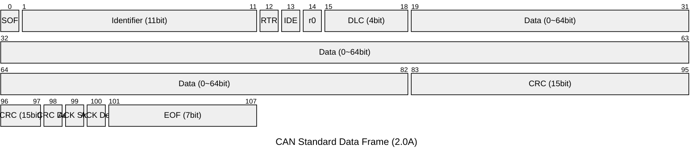
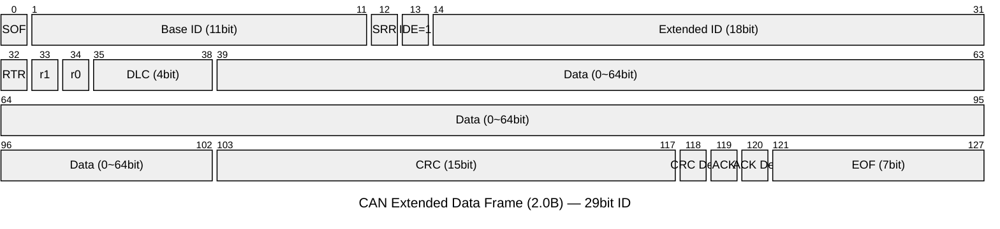
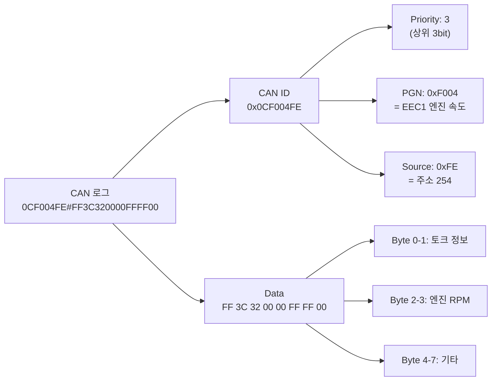

<Header/>

[[toc]]

# CAN 데이터 프레임

::: info 학습 목표
- CAN 버스에서 사용하는 4가지 프레임 종류를 구분할 수 있다
- 데이터 프레임의 각 필드(SOF, ID, DLC, Data, CRC 등)의 역할을 설명할 수 있다
- Standard(11bit)와 Extended(29bit) ID의 차이를 이해한다
- 비트 스터핑의 목적과 동작 방식을 설명할 수 있다
- 실제 CAN 로그를 보고 ID, DLC, Data를 직접 파싱할 수 있다
:::

---

## 1. 프레임의 종류

CAN 버스 위를 오가는 메시지는 목적에 따라 4가지 종류로 나뉜다.

| 프레임 종류 | 역할 |
|---|---|
| **데이터 프레임 (Data Frame)** | 실제 데이터를 전송하는 가장 일반적인 프레임 |
| **리모트 프레임 (Remote Frame)** | 다른 노드에게 특정 데이터를 보내달라고 요청하는 프레임 |
| **에러 프레임 (Error Frame)** | 오류를 감지한 노드가 버스 전체에 오류를 알리는 프레임 |
| **오버로드 프레임 (Overload Frame)** | 노드가 처리 준비가 안 됐을 때 다음 전송을 잠시 지연시키는 프레임 |

**비유로 이해하기**

CAN 버스를 무전기 채널이라고 생각해보자.
- **데이터 프레임**: "본부, 현재 위치 좌표는 37.5°N, 127.0°E이다." — 실제 정보 전달
- **리모트 프레임**: "본부, 현재 온도 데이터 좀 보내달라." — 데이터 요청
- **에러 프레임**: "잠깐! 방금 전송에 오류가 있었다!" — 오류 신호
- **오버로드 프레임**: "지금 처리 중이다, 잠깐만." — 전송 지연 요청

---

## 2. 데이터 프레임 필드 해부

데이터 프레임은 여러 필드로 구성되며, 각각 정해진 역할이 있다.



각 필드를 순서대로 살펴보자.

| 필드 | 크기 | 역할 |
|---|---|---|
| **SOF** (Start of Frame) | 1 bit | 프레임 시작을 알리는 Dominant(0) 비트 |
| **Identifier** | 11 bit | 메시지 식별자 겸 우선순위. 값이 낮을수록 높은 우선순위 |
| **RTR** (Remote Transmission Request) | 1 bit | 0=데이터 프레임, 1=리모트 프레임 구분 |
| **IDE** (Identifier Extension) | 1 bit | 0=Standard(11bit), 1=Extended(29bit) 구분 |
| **r0** (Reserved) | 1 bit | 예약된 비트, 항상 Dominant(0) |
| **DLC** (Data Length Code) | 4 bit | 데이터 필드의 바이트 수 (0~8) |
| **Data** | 0~64 bit | 실제 전송 데이터 (0~8바이트) |
| **CRC** (Cyclic Redundancy Check) | 15 bit | 전송 오류 검출을 위한 체크섬 |
| **ACK** | 2 bit | 수신 노드의 정상 수신 확인 (ACK Slot + ACK Delimiter) |
| **EOF** (End of Frame) | 7 bit | 프레임 종료를 알리는 7개의 Recessive(1) 비트 |

::: tip Dominant vs Recessive
CAN 버스에서 0을 Dominant, 1을 Recessive라 부른다. 여러 노드가 동시에 신호를 내보낼 때 Dominant(0)가 항상 이긴다. 전선을 당기는(0) 쪽이 안 당기는(1) 쪽을 이기는 것과 같다.
:::

---

## 3. Standard(11bit) vs Extended(29bit)

CAN 2.0A는 11bit Identifier를, CAN 2.0B는 29bit Identifier를 사용한다. ISOBUS(ISO 11783)는 29bit Extended ID를 기반으로 한다.



**Standard와 Extended의 차이**

| 항목 | Standard (2.0A) | Extended (2.0B) |
|---|---|---|
| Identifier 크기 | 11 bit | 29 bit (11 + 18) |
| 메시지 가짓수 | 2¹¹ = 2,048개 | 2²⁹ = 536,870,912개 |
| IDE 비트 | 0 | 1 |
| 추가 필드 | 없음 | SRR (Substitute Remote Request) |
| 주요 용도 | 일반 CAN | ISOBUS, CANopen 등 |

Extended 프레임에서 추가된 필드:
- **SRR** (Substitute Remote Request): Standard 프레임의 RTR 위치에 들어가는 Recessive 비트. Extended 프레임에서 항상 1
- **18bit Extension**: Base ID(11bit) 뒤에 붙는 추가 18bit로 총 29bit ID를 구성

프레임의 구조를 알았으니, 이 프레임이 버스 위를 실제로 이동할 때 적용되는 중요한 전송 규칙을 하나 살펴보자.

---

## 4. 비트 스터핑(Bit Stuffing)

**왜 필요한가?**

CAN은 클럭 신호 없이 데이터 신호만으로 통신한다. 수신 노드는 신호의 변화(0→1 또는 1→0)를 감지해 동기화를 유지한다. 그런데 같은 값이 너무 오래 연속되면 동기화 기준점을 잃어버릴 수 있다.

**동작 방식**

같은 값의 비트가 **5개 연속<strong> 나타나면, 다음에 반드시 </strong>반대 값의 비트를 1개 삽입**한다. 이 삽입된 비트를 <strong>Stuff Bit</strong>이라 한다.

```
원본 비트열: 1 1 1 1 1 0 0 0 0 0 1
                              ↑
                   5개 연속 1 뒤에 0 삽입됨

스터핑 후:  1 1 1 1 1 [0] 0 0 0 0 0 [1] 1
                       ↑             ↑
                   Stuff Bit      Stuff Bit
```

**수신측 처리**: 수신 노드는 5개 연속 비트 뒤에 오는 비트를 자동으로 제거(Destuffing)하여 원래 데이터를 복원한다.

::: tip 비트 스터핑 적용 범위
비트 스터핑은 SOF부터 CRC 필드까지 적용된다. EOF와 ACK 필드에는 적용되지 않는다.
:::

---

## 5. DLC와 데이터 길이

DLC(Data Length Code)는 4비트 필드로, 데이터 필드에 실제로 몇 바이트의 데이터가 있는지 알려준다.

| DLC 값 (10진수) | 데이터 바이트 수 |
|---|---|
| 0 | 0 바이트 |
| 1 | 1 바이트 |
| 2 | 2 바이트 |
| 3 | 3 바이트 |
| 4 | 4 바이트 |
| 5 | 5 바이트 |
| 6 | 6 바이트 |
| 7 | 7 바이트 |
| 8 | 8 바이트 |
| 9~15 | 8 바이트 (표준 CAN에서는 8을 초과하지 않음) |

::: info CAN FD의 DLC 확장
CAN FD(Flexible Data Rate)에서는 DLC 9~15가 12, 16, 20, 24, 32, 48, 64 바이트에 매핑되어 최대 64바이트 전송이 가능하다. 그러나 일반 CAN과 ISOBUS에서는 최대 8바이트다.
:::

이제 프레임의 모든 구성 요소를 알았다. 실제 CAN 로그를 보면서 직접 파싱해보자.

---

## 6. 프레임 읽기 실습

실제 CAN 로그에서 자주 보이는 형식을 파싱해보자.

**로그 예시**

```
0CF004FE#FF3C320000FFFF00
```

이 형식은 `[CAN ID]#[Data]` 구조다.

### CRC, ACK, EOF는 어디에?

프레임 구조에는 SOF, CRC, ACK, EOF 등이 있는데 로그에는 ID와 Data만 보인다. 이유는 **하드웨어(CAN 컨트롤러)가 자동으로 처리하는 영역**과 **소프트웨어가 다루는 영역**이 나뉘기 때문이다.

| 필드 | 누가 처리 | 소프트웨어에서 보이는가 |
|------|-----------|----------------------|
| **ID** | 소프트웨어 | 보인다 |
| **DLC** | 소프트웨어 | 보인다 (Data 길이로 유추) |
| **Data** | 소프트웨어 | 보인다 |
| SOF | CAN 컨트롤러 자동 생성 | 안 보인다 |
| CRC | CAN 컨트롤러가 자동 생성/검증 | 안 보인다 |
| ACK | CAN 컨트롤러가 자동 응답 | 안 보인다 |
| EOF | CAN 컨트롤러가 자동 추가 | 안 보인다 |

CAN 컨트롤러 칩이 프레임을 보낼 때 CRC를 자동 계산해서 붙이고, 받을 때 자동 검증한다. CRC가 틀리면 에러 프레임을 전송하고, 맞으면 ACK를 보낸다. 이 과정이 전부 하드웨어에서 끝나기 때문에, 소프트웨어에는 <strong>검증을 통과한 ID + DLC + Data만 올라온다.</strong>

```
0CF004FE#FF3C320000FFFF00
^^^^^^^^ ^^^^^^^^^^^^^^^^
  ID만     Data만
```

CRC가 틀린 프레임은 애초에 소프트웨어까지 도달하지 않는다. 하드웨어 단에서 폐기된다.

**파싱 과정**

```
원본: 0CF004FE#FF3C320000FFFF00
       ↓
CAN ID: 0CF004FE (16진수 8자리 = 29bit Extended ID)
Data  : FF 3C 32 00 00 FF FF 00
```

**CAN ID 분해 (ISOBUS PGN 구조)**

```
0C F0 04 FE  →  이진수로 변환
= 0000 1100  1111 0000  0000 0100  1111 1110

29bit ID (Extended):
  Priority  : 000 (3bit)       → 우선순위 0
  Reserved  : 0 (1bit)
  Data Page : 0 (1bit)
  PGN       : F004 (16진수)    → PGN = 61444 (EEC1, 엔진 속도)
  Source Addr: FE (16진수)     → 소스 주소 254
```

**Data 필드 해석**

```
Data (8바이트): FF 3C 32 00 00 FF FF 00

DLC = 8 (데이터 8바이트)

PGN F004 (EEC1) 기준 해석:
  Byte 0 (FF): Engine Torque Mode — 0xFF = 데이터 없음
  Byte 1 (3C): Driver's Demand Torque — 0x3C = 60 (offset -125 → -65%)
  Byte 2 (32): Actual Engine Torque  — 0x32 = 50 (offset -125 → -75%)
  Byte 3-4 (0000): Engine Speed      — 0x0000 = 0 RPM
  Byte 5 (FF): Source Address — 0xFF = 데이터 없음
  Byte 6 (FF): Engine Demand Torque — 0xFF = 데이터 없음
  Byte 7 (00): Reserved
```



::: tip 핵심 정리

- CAN 프레임에는 데이터/리모트/에러/오버로드 4가지 종류가 있으며, 가장 많이 쓰이는 것은 <strong>데이터 프레임</strong>이다.
- 데이터 프레임은 SOF → ID → 제어 필드 → Data → CRC → ACK → EOF 순서로 구성된다.
- **Standard(11bit)** ID는 2,048개, **Extended(29bit)** ID는 5억 개 이상의 메시지를 구별할 수 있다. ISOBUS는 Extended를 사용한다.
- <strong>비트 스터핑</strong>은 5개 연속 동일 비트 뒤에 반대 비트를 삽입해 수신 노드의 동기화를 돕는다.
- **DLC** 0~8은 데이터 길이(바이트)와 1:1 대응한다.
- CAN 로그 `ID#DATA` 형식에서 ID를 분해하면 PGN과 소스 주소를 알 수 있다.

:::

---

## 다음 챕터

- 다음 : [CAN 중재와 우선순위](/study/isobus/05-can-arbitration)
