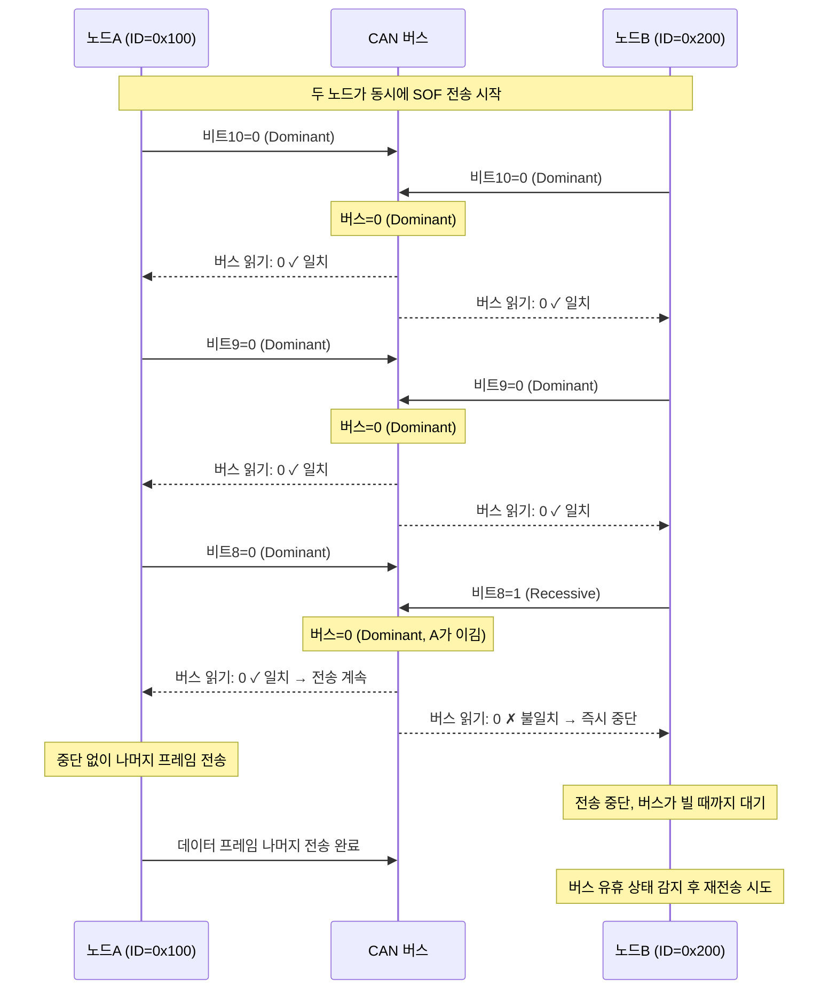
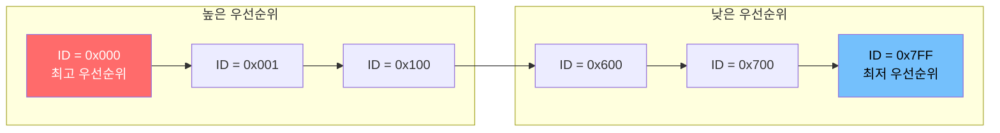

<Header/>

[[toc]]

# CAN 중재와 우선순위

## 학습 목표

- CAN 버스의 중재(Arbitration) 개념과 필요성을 설명할 수 있다
- CSMA/CD+AMP 메커니즘의 동작 방식을 이해한다
- 비트 단위 중재 과정을 단계별로 추적할 수 있다
- ID 값과 우선순위의 관계를 설명할 수 있다
- 안전 관련 메시지 설계 시 ID 배정 원칙을 적용할 수 있다

---

## 1. 버스 중재(Arbitration)란

**문제 상황<strong>: 여러 노드가 하나의 버스를 공유하는 CAN에서, 두 노드가 </strong>동시에 메시지를 전송하기 시작하면** 어떻게 될까?

이더넷의 경우 충돌(Collision)이 발생하면 두 노드 모두 전송을 멈추고 임의의 시간 뒤 재전송한다. 이 방식은 충돌 후 데이터가 손실된다.

**CAN의 해답**: CAN은 **CSMA/CD+AMP** 방식을 사용해 충돌 없이 우선순위가 높은 메시지가 이기도록 한다.

| 용어 | 의미 |
|---|---|
| **CSMA** (Carrier Sense Multiple Access) | 전송 전 버스가 사용 중인지 확인한다 |
| **CD** (Collision Detection) | 전송 중 충돌(다른 신호)을 감지한다 |
| **AMP** (Arbitration on Message Priority) | 메시지 우선순위에 따라 중재한다 |

**핵심 차이<strong>: 이더넷은 충돌 후 </strong>모두 재전송<strong>하지만, CAN은 중재 패배 노드만 재전송한다. 승리한 노드는 전송을 </strong>중단 없이 계속**한다.

> [!INFO]
> 중재는 ID 필드 전송 구간에서만 일어난다. 중재에서 이긴 노드의 메시지는 데이터 손실 없이 그대로 버스에 전달된다.

---

## 2. 비트 단위 중재 과정

중재는 **비트 하나씩** 비교하며 진행된다. 노드A(ID=0x100)와 노드B(ID=0x200)가 동시에 전송을 시작하는 상황을 살펴보자.

**ID 이진수 변환**

```
노드A ID = 0x100 = 0001 0000 0000 (11bit)
노드B ID = 0x200 = 0010 0000 0000 (11bit)
```

**비트별 중재 과정**

| 비트 위치 | 노드A | 노드B | 버스 상태 | 결과 |
|---|---|---|---|---|
| 비트 10 (MSB) | 0 (Dominant) | 0 (Dominant) | Dominant | 동점, 계속 |
| 비트 9 | 0 (Dominant) | 0 (Dominant) | Dominant | 동점, 계속 |
| 비트 8 | 0 (Dominant) | 1 (Recessive) | **Dominant** | **노드B 탈락** |

비트 8에서 노드A는 0(Dominant)을, 노드B는 1(Recessive)을 전송한다. 버스는 Dominant 값인 0이 된다. 노드B는 자신이 1을 보냈는데 버스가 0이 된 것을 감지하고, <strong>즉시 전송을 중단</strong>한다. 노드A는 아무것도 모른 채 전송을 계속한다.



---

## 3. ID 값과 우선순위 관계

**원칙: ID 숫자가 작을수록 우선순위가 높다.**

이유는 간단하다. CAN 버스에서 **0(Dominant)이 1(Recessive)을 이긴다**. ID의 상위 비트부터 비교할 때, 먼저 0을 보내는 노드가 버스를 차지한다.

```
ID = 0x001: 0000 0000 001  ← 앞쪽이 0으로 가득 참 → 버스 독점 유리
ID = 0x7FF: 1111 1111 111  ← 앞쪽이 1로 가득 참 → 버스 독점 불리
```



**29bit Extended ID에서의 우선순위**

ISOBUS는 29bit Extended ID를 사용하며, ID의 상위 3비트가 Priority 필드다.

```
29bit ID 구조:
[P P P][R][DP][PF 8bit][PS 8bit][SA 8bit]
  ↑
Priority (0~7, 낮을수록 높은 우선순위)
```

Priority 0이 가장 높고, Priority 7이 가장 낮다. 이를 통해 메시지 종류별 우선순위를 명시적으로 설정할 수 있다.

---

## 4. 메시지 설계 시 고려사항

중재 메커니즘을 이해하면 <strong>ID 배정 전략</strong>이 명확해진다.

**안전 관련 메시지에는 낮은 ID를 배정**

```
Priority 0 (ID 앞자리 000): 브레이크, 조향, 비상 정지
Priority 1 (ID 앞자리 001): 엔진 제어, 변속기
Priority 2 (ID 앞자리 010): 차량 속도, 자세 제어
Priority 3 (ID 앞자리 011): 일반 제어 데이터
Priority 6 (ID 앞자리 110): 진단, 설정
Priority 7 (ID 앞자리 111): 정보성 메시지, 로그
```

**주기적 메시지 vs 이벤트 메시지**

| 구분 | 특징 | ID 전략 |
|---|---|---|
| **주기적 메시지** | 일정 주기(예: 10ms, 100ms)로 반복 전송 | 중간 우선순위 배정. 너무 낮은 ID는 다른 중요 메시지를 방해할 수 있음 |
| **이벤트 메시지** | 특정 조건 발생 시에만 전송 | 안전 관련이면 낮은 ID, 정보성이면 높은 ID |

**버스 부하 고려**

중재에서 계속 패배하는 메시지는 버스가 바쁠수록 더 오래 기다려야 한다. 높은 우선순위 메시지가 너무 자주 전송되면, 낮은 우선순위 메시지는 <strong>기아 상태(Starvation)</strong>에 빠질 수 있다.

> [!TIP]
> 실무 설계 원칙:
> - 안전 관련 메시지: Priority 0~2
> - 실시간성이 중요한 제어 데이터: Priority 3~4
> - 진단, 설정, 정보: Priority 5~7
> - 동일 Priority 내에서는 기능별로 ID 범위를 구분해 관리한다

::: tip 핵심 정리

- CAN의 **CSMA/CD+AMP** 방식은 비트 단위로 중재해, 우선순위 높은 메시지가 데이터 손실 없이 전송된다.
- Dominant(0)이 Recessive(1)을 이기므로, **ID 값이 작을수록 우선순위가 높다**.
- 중재 패패 노드는 즉시 전송을 중단하고 버스가 빌 때까지 대기 후 재시도한다.
- ISOBUS의 29bit ID에서 상위 3비트(Priority)로 메시지 우선순위를 명시한다.
- 안전 관련 메시지(브레이크, 조향)에는 낮은 ID를, 정보성 메시지에는 높은 ID를 배정한다.

:::

---

## 다음 챕터

- **이전**: [04. CAN 데이터 프레임](/study/isobus/04-can-data-frame)
- **다음**: [06. CAN 에러 처리](/study/isobus/06-can-error)
