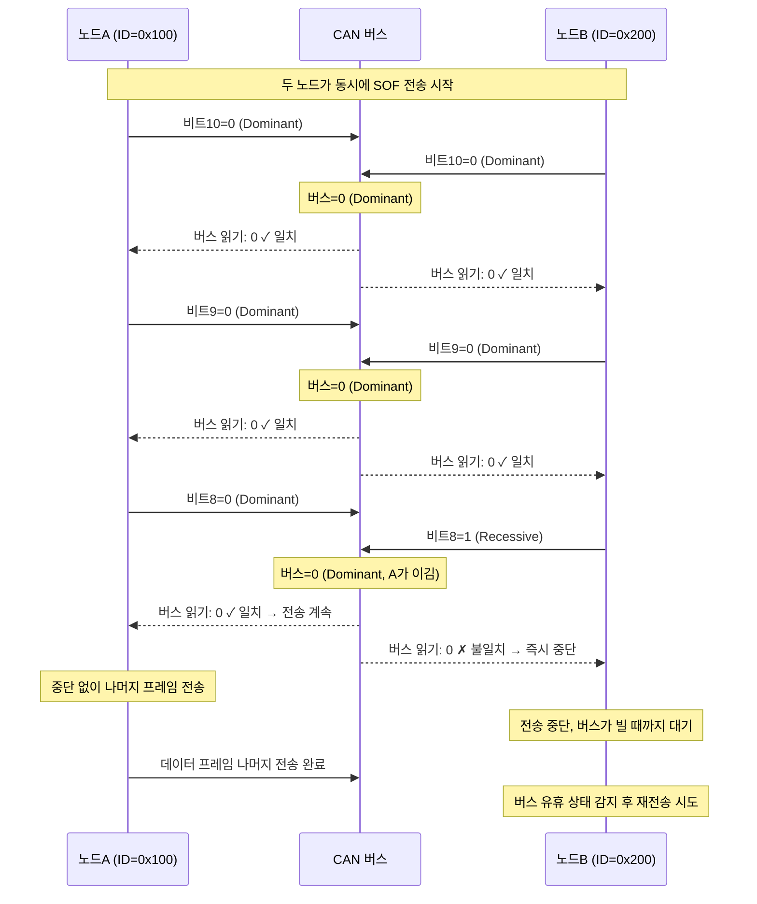
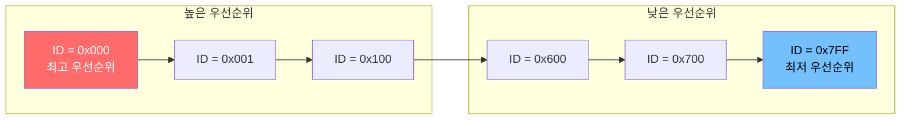

<Header/>

[[toc]]

# CAN 중재와 우선순위

::: info 학습 목표
- CAN 버스의 중재(Arbitration) 개념과 필요성을 설명할 수 있다
- CSMA/CD+AMP 메커니즘의 동작 방식을 이해한다
- 비트 단위 중재 과정을 단계별로 추적할 수 있다
- ID 값과 우선순위의 관계를 설명할 수 있다
- 안전 관련 메시지 설계 시 ID 배정 원칙을 적용할 수 있다
:::

## 1. 버스 중재(Arbitration)란

**문제 상황<strong>: 여러 노드가 하나의 버스를 공유하는 CAN에서, 두 노드가 </strong>동시에 메시지를 전송하기 시작하면** 어떻게 될까?

이더넷의 경우 충돌(Collision)이 발생하면 두 노드 모두 전송을 멈추고 임의의 시간 뒤 재전송한다. 이 방식은 충돌 후 데이터가 손실된다.

**CAN의 해답**: CAN은 **CSMA/CD+AMP** 방식을 사용해 충돌 없이 우선순위가 높은 메시지가 이기도록 한다.

| 용어 | 의미 |
|---|---|
| **CSMA** (Carrier Sense Multiple Access) | 전송 전 버스가 사용 중인지 확인한다 |
| **CD** (Collision Detection) | 전송 중 충돌(다른 신호)을 감지한다 |
| **AMP** (Arbitration on Message Priority) | 메시지 우선순위에 따라 중재한다 |

**핵심 차이<strong>: 이더넷은 충돌 후 </strong>모두 재전송<strong>하지만, CAN은 중재 패배 노드만 재전송한다. 승리한 노드는 전송을 </strong>중단 없이 계속**한다.

::: info
중재는 ID 필드 전송 구간에서만 일어난다. 중재에서 이긴 노드의 메시지는 데이터 손실 없이 그대로 버스에 전달된다.
:::

### "노드 ID"가 아니라 "메시지 ID"

한 가지 주의할 점이 있다. CAN에서 ID는 **노드(장치)를 식별하는 것이 아니라 메시지의 종류를 식별한다.** 하나의 ECU가 여러 종류의 메시지를 보낼 수 있으며, 각각 다른 ID를 가진다.

```
엔진 ECU (하나의 노드)가 보내는 메시지들:
  ID=0x100: 엔진 RPM 정보
  ID=0x101: 엔진 온도 정보
  ID=0x102: 엔진 토크 정보
```

따라서 중재에서 비교되는 것은 노드의 고유번호가 아니라, **그 순간 전송하려는 메시지의 ID**다. 같은 노드라도 어떤 메시지를 보내느냐에 따라 우선순위가 달라진다.

## 2. 비트 단위 중재 과정

중재는 ID를 다 보낸 뒤에 비교하는 것이 아니다. 각 노드가 ID를 MSB(최상위 비트)부터 **한 비트씩 버스에 보내면서, 동시에 버스를 읽어 실시간으로 비교**한다.

```
시간 →
노드A: [SOF][비트10][비트9][비트8]...[비트0] → 승리 시 [DLC][Data]... 계속
노드B: [SOF][비트10][비트9][비트8] ← 여기서 탈락하면 즉시 중단
```

ID 구간이 끝나면 중재도 끝나고, 승자만 나머지(DLC, Data, CRC 등)를 전송한다. 구체적인 예시를 보자. 노드A(ID=0x100)와 노드B(ID=0x200)가 동시에 전송을 시작하는 상황이다.

**ID 이진수 변환**


**비트별 중재 과정**

| 비트 위치 | 노드A | 노드B | 버스 상태 | 결과 |
|---|---|---|---|---|
| 비트 10 (MSB) | 0 (Dominant) | 0 (Dominant) | Dominant | 동점, 계속 |
| 비트 9 | 0 (Dominant) | 0 (Dominant) | Dominant | 동점, 계속 |
| 비트 8 | 0 (Dominant) | 1 (Recessive) | **Dominant** | **노드B 탈락** |

비트 8에서 노드A는 0(Dominant)을, 노드B는 1(Recessive)을 전송한다. 버스는 Dominant 값인 0이 된다. 노드B는 자신이 1을 보냈는데 버스가 0이 된 것을 감지하고, <strong>즉시 전송을 중단</strong>한다. 노드A는 아무것도 모른 채 전송을 계속한다.


```mermaid
sequenceDiagram
    participant A as 노드A (ID=0x100)
    participant Bus as CAN 버스
    participant B as 노드B (ID=0x200)

    Note over A,B: 두 노드가 동시에 SOF 전송 시작
    A->>Bus: 비트10=0 (Dominant)
    B->>Bus: 비트10=0 (Dominant)
    Note over Bus: 버스=0 (Dominant)
    Bus-->>A: 버스 읽기: 0 ✓ 일치
    Bus-->>B: 버스 읽기: 0 ✓ 일치

    A->>Bus: 비트9=0 (Dominant)
    B->>Bus: 비트9=0 (Dominant)
    Note over Bus: 버스=0 (Dominant)
    Bus-->>A: 버스 읽기: 0 ✓ 일치
    Bus-->>B: 버스 읽기: 0 ✓ 일치

    A->>Bus: 비트8=0 (Dominant)
    B->>Bus: 비트8=1 (Recessive)
    Note over Bus: 버스=0 (Dominant, A가 이김)
    Bus-->>A: 버스 읽기: 0 ✓ 일치 → 전송 계속
    Bus-->>B: 버스 읽기: 0 ✗ 불일치 → 즉시 중단

    Note over A: 중단 없이 나머지 프레임 전송
    Note over B: 전송 중단, 버스가 빌 때까지 대기
    A->>Bus: 데이터 프레임 나머지 전송 완료
    Note over B: 버스 유휴 상태 감지 후 재전송 시도
```

## 3. ID 값과 우선순위 관계

**원칙: ID 숫자가 작을수록 우선순위가 높다.**

이유는 간단하다. CAN 버스에서 **0(Dominant)이 1(Recessive)을 이긴다**. ID의 상위 비트부터 비교할 때, 먼저 0을 보내는 노드가 버스를 차지한다.

```
ID = 0x001: 0000 0000 001  ← 앞쪽이 0으로 가득 참 → 버스 독점 유리
ID = 0x7FF: 1111 1111 111  ← 앞쪽이 1로 가득 참 → 버스 독점 불리
```


```mermaid
flowchart LR
    subgraph 높은 우선순위
        A["ID = 0x000<br>최고 우선순위"]
        B["ID = 0x001"]
        C["ID = 0x100"]
    end
    subgraph 낮은 우선순위
        D["ID = 0x600"]
        E["ID = 0x700"]
        F["ID = 0x7FF<br>최저 우선순위"]
    end
    A --> B --> C --> D --> E --> F
    style A fill:#ff6b6b,color:#fff
    style F fill:#74c0fc,color:#000
```

**29bit Extended ID에서의 우선순위**

ISOBUS는 29bit Extended ID를 사용하며, ID의 상위 3비트가 Priority 필드다.


Priority 0이 가장 높고, Priority 7이 가장 낮다. 이를 통해 메시지 종류별 우선순위를 명시적으로 설정할 수 있다.

### Priority가 같으면 어떻게 되는가

Priority 필드는 29비트 ID의 최상위 3비트일 뿐이다. Priority가 같으면 중재가 끝나는 것이 아니라, **나머지 비트(EDP → DP → PF → PS → SA)로 계속 비교**한다. 결국 29비트 ID 전체가 하나의 우선순위 값이다.


| 상황 | 중재 방식 |
|------|-----------|
| Priority가 다름 | Priority가 작은 쪽이 즉시 승리 |
| Priority가 같음 | PF → PS → SA 순서로 계속 비교 |
| 29비트 전체가 같음 | 발생할 수 없음 (같은 PGN+SA 조합은 네트워크에 하나뿐) |

이 원칙을 이해하면, 실제 시스템에서 메시지 ID를 어떻게 배정해야 하는지가 자연스럽게 도출된다.

## 4. 메시지 설계 시 고려사항

중재 메커니즘을 이해하면 <strong>ID 배정 전략</strong>이 명확해진다.

**안전 관련 메시지에는 낮은 ID를 배정**

```
Priority 0 (ID 앞자리 000): 브레이크, 조향, 비상 정지
Priority 1 (ID 앞자리 001): 엔진 제어, 변속기
Priority 2 (ID 앞자리 010): 차량 속도, 자세 제어
Priority 3 (ID 앞자리 011): 일반 제어 데이터
Priority 6 (ID 앞자리 110): 진단, 설정
Priority 7 (ID 앞자리 111): 정보성 메시지, 로그
```

**주기적 메시지 vs 이벤트 메시지**

| 구분 | 특징 | ID 전략 |
|---|---|---|
| **주기적 메시지** | 일정 주기(예: 10ms, 100ms)로 반복 전송 | 중간 우선순위 배정. 너무 낮은 ID는 다른 중요 메시지를 방해할 수 있음 |
| **이벤트 메시지** | 특정 조건 발생 시에만 전송 | 안전 관련이면 낮은 ID, 정보성이면 높은 ID |

**버스 부하 고려**

중재에서 계속 패배하는 메시지는 버스가 바쁠수록 더 오래 기다려야 한다. 높은 우선순위 메시지가 너무 자주 전송되면, 낮은 우선순위 메시지는 <strong>기아 상태(Starvation)</strong>에 빠질 수 있다.

::: tip 실무 설계 원칙
- 안전 관련 메시지: Priority 0~2
- 실시간성이 중요한 제어 데이터: Priority 3~4
- 진단, 설정, 정보: Priority 5~7
- 동일 Priority 내에서는 기능별로 ID 범위를 구분해 관리한다
:::

지금까지는 §2에서 2개 노드짜리 예시로 중재 원리를 봤다. 이번에는 노드 3개가 동시에 전송을 시작하는 실제 ISOBUS 메시지 조합으로, ID의 첫 비트부터 승부가 갈리는 순간까지 끝까지 따라가 본다.

## 5. 중재 과정 따라가기

### 시나리오: 노드 3개가 동시에 전송을 시작한다

버스가 유휴 상태였다가, 세 노드가 <strong>같은 순간</strong> SOF를 보내며 전송을 시작한다.

| 노드 | 메시지 | PGN | 근거 | Priority | SA |
|---|---|---|---|---|---|
| A (엔진 ECU) | EEC1(엔진 속도) | 61444 (0xF004) | [CAN 데이터 프레임](/study/isobus/04-can-data-frame)에서 이미 파싱해 본 PGN | 3 | 0x00 |
| B (차속 센서) | Wheel-based Speed and Distance(차속·거리) | 65096 (0xFE48) | ISO 11783-7 Part 7의 차속 메시지 | 6 | 0x1C |
| C (진단 도구) | DM1(활성 고장 코드) | 65226 (0xFECA) | ISO 11783-12 Annex B의 DM1 | 6 | 0xF9(오프보드 진단 도구 주소) |

Priority는 두 값만 쓴다. EEC1처럼 <strong>제어와 직결된 상태 메시지</strong>는 기본값 3, 차속·진단처럼 <strong>제어 명령이 아닌 상태·기록 메시지</strong>는 기본값 6이다. 이 기본값 규칙 자체는 새로 만든 게 아니라 J1939 29비트 ID 구조를 다룬 앞 챕터에서 이미 정리된 것이다.

PGN을 PF/PS로 역산하고 SA를 붙이면 29비트 ID가 나온다. Priority(3bit) + EDP(1bit) + DP(1bit) + PF(8bit) + PS(8bit) + SA(8bit) = 29bit다.

| 노드 | ID(hex) | Priority(3) | EDP(1) | DP(1) | PF(8) | PS(8) | SA(8) |
|---|---|---|---|---|---|---|---|
| A | `0x0CF00400` | `011` | `0` | `0` | `11110000`(0xF0) | `00000100`(0x04) | `00000000`(0x00) |
| B | `0x18FE481C` | `110` | `0` | `0` | `11111110`(0xFE) | `01001000`(0x48) | `00011100`(0x1C) |
| C | `0x18FECAF9` | `110` | `0` | `0` | `11111110`(0xFE) | `11001010`(0xCA) | `11111001`(0xF9) |

각 칸을 왼쪽부터 순서대로 이으면(비트28→비트0) 위 ID(hex)가 그대로 나온다.

::: tip 비트 번호 규칙
29비트 ID는 SOF 다음으로 <strong>맨 처음 나가는 비트를 비트28(MSB, Priority 최상위)</strong>, <strong>맨 마지막에 나가는 비트를 비트0(LSB, SA 최하위)</strong>이라 부른다. Priority는 비트28~26, EDP는 비트25, DP는 비트24, PF는 비트23~16, PS는 비트15~8, SA는 비트7~0이다.
:::

### 1라운드 만에 갈리는 승부

세 노드가 SOF 직후 ID의 첫 비트(비트28, Priority 최상위 비트)를 동시에 내보낸다.

| 라운드 | 비트 위치 | 노드A 송신 | 노드B 송신 | 노드C 송신 | 버스(wired-AND) | 판정 |
|---|---|---|---|---|---|---|
| 1 | 비트28 | 0 (Dominant) | 1 (Recessive) | 1 (Recessive) | **Dominant(0)** | A 계속 · <strong>B, C 동시 탈락</strong> |

Priority 3은 이진수로 `011`, Priority 6은 `110`이다. 최상위 비트만 봐도 A는 0, B와 C는 1이다. 버스는 세 값을 wired-AND로 합친 결과이므로, 하나라도 Dominant(0)를 내보내면 버스는 무조건 0이 된다. B와 C는 자신이 1을 보냈는데 버스가 0으로 관측되는 것을 <strong>동시에</strong> 감지하고, <strong>같은 라운드에서</strong> 각자 독립적으로 전송을 중단하고 수신 모드로 전환한다. 서로의 존재와 무관하게, 자신이 보낸 값과 버스 값을 비교하는 것만으로 판단이 끝난다는 점이 핵심이다.

::: tip 중재는 반드시 한 명씩 떨어지지 않는다
2개 노드짜리 예시(§2)에서는 매 라운드 최대 1개 노드만 탈락했다. 하지만 노드가 3개 이상이면, Dominant를 보낸 노드를 제외한 <strong>Recessive 노드 전부가 한 라운드에 동시에</strong> 탈락할 수 있다. 중재는 승자를 한 명씩 좁혀가는 토너먼트가 아니라, 매 비트마다 "그 순간 버스 값과 다르게 보낸 노드는 전부 탈락"하는 규칙이 반복될 뿐이다.
:::

A는 자신이 보낸 0과 버스 값 0이 일치하는 것을 확인하고 <strong>중단 없이</strong> 나머지 28비트(Priority 나머지 2비트 + EDP + DP + PF + PS + SA)를 마저 보낸 뒤, RTR/SRR, IDE, r0, DLC, Data, CRC, ACK, EOF까지 프레임 전체를 끝까지 전송한다. 이 과정에서 A의 데이터는 한 비트도 다시 보내지 않는다 — 중재에서 이긴 메시지는 처음부터 끝까지 그대로 버스에 실린다.

### 패배한 노드는 어떻게 되는가

B와 C는 전송을 중단한 순간부터 수신 노드로 동작하며, A가 보내는 프레임을 끝까지 수신한다(다른 목적지로 가는 메시지라도 버스에 실린 이상 모든 노드가 물리적으로 수신한다). A의 EOF까지 끝나고 버스가 다시 유휴 상태가 되면, B와 C는 각자 <strong>처음부터 다시</strong> SOF를 보내며 재전송을 시도한다. 이번에는 둘 다 이전과 동일한 ID를 다시 내보내므로, §3에서 정리한 원칙대로 <strong>같은 우선순위 관계가 그대로 반복</strong>된다.

여기서 이 절 전체를 관통하는 결론이 나온다. B와 C는 이번 라운드에서 메시지를 <strong>보내지 못했을 뿐, 데이터 자체를 잃어버리지는 않았다.</strong> 재시도해서 버스가 비는 다음 기회에 다시 온전히 보낼 수 있다. 이것이 §1에서 이더넷과 대비해 언급한 <strong>비파괴적 중재(non-destructive arbitration)</strong>다 — 충돌이 나도 아무도 데이터를 버리지 않는다.

### 우선순위가 같다면 몇 라운드까지 가는가

방금 예시는 A의 Priority(3)가 B·C(6)보다 낮아 1라운드 만에 끝났다. 그렇다면 <strong>Priority가 완전히 같은 두 메시지</strong>는 몇 라운드까지 가야 승부가 갈릴까? B와 C만 놓고 — A가 잠시 버스에 없었다고 가정하고 — 계속 비교해보자.

B와 C는 둘 다 Priority 6, EDP 0, DP 0이고, PGN이 둘 다 65000번대라 <strong>PF도 0xFE로 완전히 같다.</strong> 즉 비트28부터 비트16까지 13비트가 전부 동일하다. 승부는 PS 필드로 넘어가서야 갈린다.

| 구간 | 비트 위치 | 노드B | 노드C | 비고 |
|---|---|---|---|---|
| Priority(3bit) | 비트28~26 | `110` | `110` | 완전히 동일, 계속 |
| EDP | 비트25 | `0` | `0` | 동일, 계속 |
| DP | 비트24 | `0` | `0` | 동일, 계속 |
| PF(8bit) | 비트23~16 | `11111110`(0xFE) | `11111110`(0xFE) | 완전히 동일, 계속 |
| PS 최상위 비트 | 비트15 | `0` (Dominant, PS=0x48) | `1` (Recessive, PS=0xCA) | **여기서 갈림** — B 승, C 탈락 |

SOF 이후 <strong>14번째로 나가는 비트(비트15, PS 필드 최상위 비트)</strong>에 가서야 승부가 갈린다. B의 PS(0x48 = `01001000`)는 최상위 비트가 0이고, C의 PS(0xCA = `11001010`)는 최상위 비트가 1이기 때문이다. 이 예시가 §3에서 정리한 "Priority가 같으면 EDP → DP → PF → PS → SA 순서로 계속 비교한다"는 원칙을 실제 비트로 보여준다 — Priority와 PF까지 같아도, PS 한 비트 차이로 승부가 갈린다.

:::details 파이썬으로 검산해 보기
```python
def build_id(priority, edp, dp, pf, ps, sa):
    return (priority << 26) | (edp << 25) | (dp << 24) | (pf << 16) | (ps << 8) | sa


def pgn_to_pf_ps(pgn):
    return pgn // 256, pgn % 256          # PF>=240(PDU2) 기준: PGN = PF*256 + PS


def bits29(v):
    return [(v >> i) & 1 for i in range(28, -1, -1)]   # 비트28(MSB) -> 비트0(LSB)


# 노드 정의: (이름, priority, PGN, SA)
defs = [
    ("A_엔진(EEC1)",  3, 61444, 0x00),
    ("B_차속",        6, 65096, 0x1C),
    ("C_진단(DM1)",   6, 65226, 0xF9),
]

ids = {}
for name, prio, pgn, sa in defs:
    pf, ps = pgn_to_pf_ps(pgn)
    ids[name] = build_id(prio, 0, 0, pf, ps, sa)
    print(f"{name}: PF=0x{pf:02X} PS=0x{ps:02X} ID=0x{ids[name]:08X}")

# 3-way 중재 시뮬레이션
alive = set(ids)
bitstreams = {k: bits29(v) for k, v in ids.items()}
for i in range(29):
    vals = {k: bitstreams[k][i] for k in alive}
    bus = min(vals.values())              # 하나라도 0(Dominant)이면 버스는 0
    losers = [k for k, v in vals.items() if v != bus]
    if losers:
        print(f"round {i+1} (bit{28-i}): bus={bus}, 탈락={losers}")
    for l in losers:
        alive.discard(l)
    if len(alive) == 1:
        print("최종 승자:", alive)
        break

# B vs C만 남았다면 (Priority가 같을 때) 몇 라운드까지 가는가
bB, bC = bitstreams["B_차속"], bitstreams["C_진단(DM1)"]
for i in range(29):
    if bB[i] != bC[i]:
        print(f"B vs C 결정 라운드: {i+1} (bit{28-i}), B={bB[i]} C={bC[i]}")
        break
```

실행하면 노드A가 round 1(bit28)에서 즉시 승리하고, B와 C만 남길 경우 결정 라운드가 14(bit15)로 나온다 — 위 표와 정확히 일치한다.
:::

::: tip 핵심 정리

- CAN의 **CSMA/CD+AMP** 방식은 비트 단위로 중재해, 우선순위 높은 메시지가 데이터 손실 없이 전송된다.
- Dominant(0)이 Recessive(1)을 이기므로, **ID 값이 작을수록 우선순위가 높다**.
- 중재 패패 노드는 즉시 전송을 중단하고 버스가 빌 때까지 대기 후 재시도한다.
- ISOBUS의 29bit ID에서 상위 3비트(Priority)로 메시지 우선순위를 명시한다.
- 안전 관련 메시지(브레이크, 조향)에는 낮은 ID를, 정보성 메시지에는 높은 ID를 배정한다.

:::

## 다음 챕터

- 다음 : [CAN 에러 처리](/study/isobus/06-can-error)
