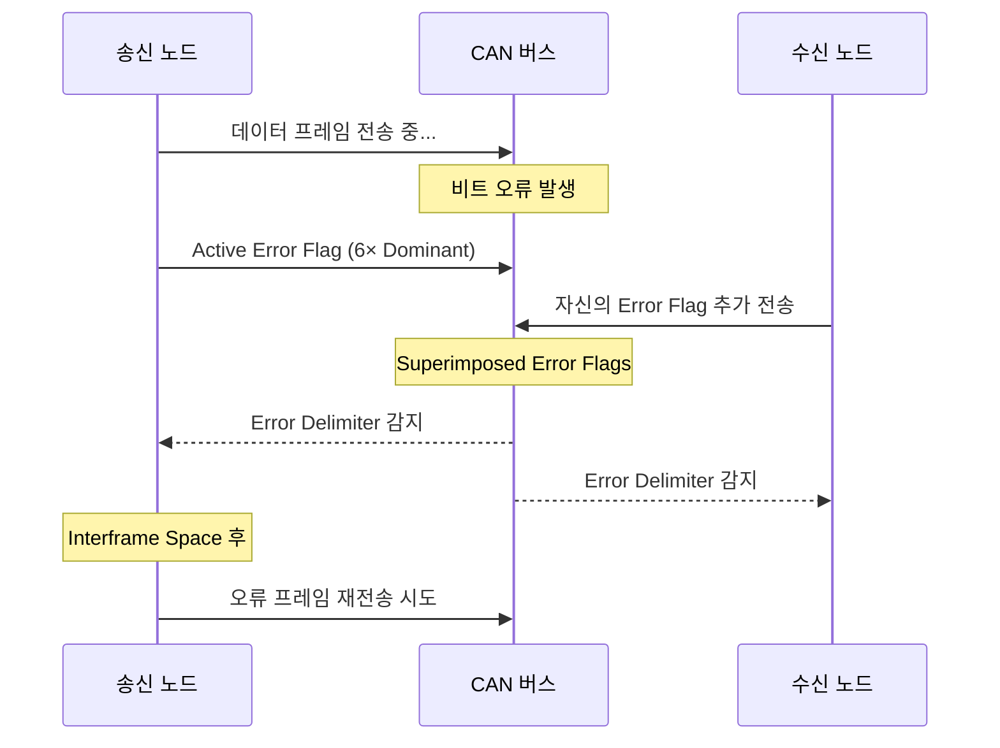
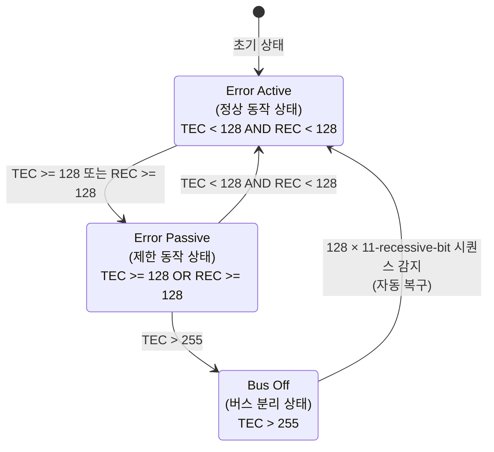
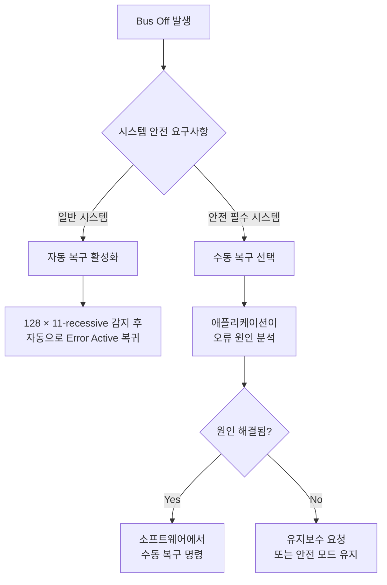

<Header/>

[[toc]]

# CAN 에러 처리

## 학습 목표

- CAN의 5가지 에러 검출 메커니즘을 각각 설명할 수 있다
- 에러 프레임의 구조와 역할을 이해한다
- TEC, REC 카운터의 증감 규칙을 적용할 수 있다
- Error Active → Error Passive → Bus Off 상태 천이 조건을 설명할 수 있다
- Bus Off에서 자동 복구 메커니즘을 이해한다

---

## 1. 에러 검출 메커니즘 5가지

CAN은 하드웨어 레벨에서 5가지 독립적인 방법으로 오류를 감지한다. 이 중 하나라도 오류를 감지하면 즉시 에러 프레임을 전송한다.

### 1-1. Bit Error (비트 에러)

**원리**: 노드가 비트를 전송하는 동시에 버스를 읽어서, 자신이 보낸 값과 버스의 값이 다르면 오류로 판단한다.

```
전송한 값: 1 (Recessive)
버스 읽은 값: 0 (Dominant) ← 다른 노드가 0을 보냄
→ Bit Error 발생
```

**예외**: 중재(Arbitration) 구간과 ACK 슬롯에서는 Bit Error를 검사하지 않는다. 중재 중 패배하는 것은 정상 동작이기 때문이다.

### 1-2. Stuff Error (스터프 에러)

**원리**: 비트 스터핑 규칙에 따르면, 같은 값의 비트 5개 후에는 반드시 반대 비트가 온다. 이 규칙이 위반되면 Stuff Error가 발생한다.

```
수신된 비트열: 1 1 1 1 1 1 ...
                          ↑ 6번째 동일 비트 → Stuff Error
```

### 1-3. CRC Error (CRC 에러)

**원리**: 송신 노드가 계산한 CRC 값을 프레임에 포함해 전송한다. 수신 노드는 받은 데이터로 직접 CRC를 계산해 프레임의 CRC 필드와 비교한다. 값이 다르면 CRC Error다.

```
송신 노드 계산 CRC: 0x1A3F
수신 노드 계산 CRC: 0x1A3E  ← 전송 중 비트 변형
→ CRC Error 발생
```

### 1-4. Form Error (폼 에러)

**원리**: CAN 프레임의 특정 필드(CRC Delimiter, ACK Delimiter, EOF)는 반드시 Recessive(1)여야 한다. 이 위치에서 Dominant(0)를 수신하면 Form Error다.

```
EOF 필드 (반드시 7개 Recessive):
수신: 1 1 1 0 1 1 1
              ↑ Dominant → Form Error
```

### 1-5. ACK Error (ACK 에러)

**원리**: 송신 노드는 ACK Slot을 Recessive로 전송하고, 수신에 성공한 모든 노드가 이 위치를 Dominant로 덮어쓴다(ACK). 아무도 ACK를 보내지 않으면(버스가 Recessive 유지), 송신 노드는 ACK Error를 인식한다.

```
ACK Slot 전송: 1 (Recessive)
버스 읽기:     1 (Recessive) ← 아무도 ACK 안 함
→ ACK Error 발생
```

**5가지 에러 비교 요약**

| 에러 종류 | 검출 주체 | 검출 지점 | 주요 원인 |
|---|---|---|---|
| Bit Error | 송신 노드 | 전송 중 버스 모니터링 | 버스 결함, 전기적 간섭 |
| Stuff Error | 수신 노드 | 데이터/CRC 필드 | 노이즈, 동기화 오류 |
| CRC Error | 수신 노드 | CRC 필드 비교 | 데이터 손상 |
| Form Error | 수신 노드 | 구조적 필드 위치 | 프레임 구조 손상 |
| ACK Error | 송신 노드 | ACK Slot | 수신 노드 없음, 버스 단선 |

이 5가지 중 하나라도 오류를 감지하면, 다음 단계는 이를 버스 전체에 알리는 것이다. 이때 사용되는 것이 에러 프레임이다.

---

## 2. 에러 프레임

오류를 감지한 노드는 즉시 <strong>에러 프레임(Error Frame)</strong>을 전송해 버스 전체에 오류 발생을 알린다.


**Active Error Flag (6 Dominant bits)**

- 6개의 연속 Dominant(0) 비트
- 이 자체가 Bit Stuffing 규칙 위반이므로, 다른 노드들도 Stuff Error를 감지해 자신의 에러 플래그를 전송함
- 결과적으로 버스에 6~12개의 연속 Dominant 비트가 나타나 버스 전체가 오류를 인지

**Error Delimiter (8 Recessive bits)**

- 8개의 연속 Recessive(1) 비트
- 에러 프레임의 끝을 알리며, 이후 정상 메시지 전송이 재개될 수 있음

**에러 프레임 이후 흐름**



에러 프레임이 전송될 때마다 CAN 컨트롤러는 내부적으로 오류 횟수를 기록한다. 이 카운터 값에 따라 노드의 동작이 달라진다.

---

## 3. 에러 카운터

CAN 컨트롤러는 <strong>TEC(Transmit Error Counter)</strong>와 **REC(Receive Error Counter)** 두 개의 카운터를 유지한다. 이 카운터로 노드의 에러 상태를 추적한다.

**TEC (Transmit Error Counter) 증감 규칙**

| 상황 | TEC 변화 |
|---|---|
| 전송 오류 감지(에러 프레임 전송) | +8 |
| 메시지 성공적으로 전송 | -1 |
| Bus Off 진입 시 | TEC > 255 확정 |

**REC (Receive Error Counter) 증감 규칙**

| 상황 | REC 변화 |
|---|---|
| 수신 오류 감지 (첫 번째) | +1 |
| 수신 오류 감지 (에러 플래그 후) | +8 |
| 메시지 성공적으로 수신 | -1 |
| REC가 127 초과 상태에서 성공 수신 | 119로 재설정 |

::: info 에러 카운터의 비대칭성
에러 카운터의 비대칭성에 주목하자. 오류 시 +8, 성공 시 -1로 설계된 이유는, <strong>오류 빈도가 낮아야 정상</strong>이라는 가정 때문이다. 간헐적 오류는 카운터가 자연히 회복되지만, 지속적 오류는 빠르게 누적된다.
:::

그렇다면 카운터가 특정 임계값에 도달하면 어떤 일이 벌어질까? CAN은 카운터 값에 따라 노드의 동작 상태를 세 단계로 구분한다.

---

## 4. 에러 상태 천이

TEC와 REC 값에 따라 노드는 3가지 상태 중 하나에 있게 된다.



**Error Active (에러 활성)**

- 초기 상태이자 정상 동작 상태
- TEC < 128, REC < 128
- 오류 감지 시 **Active Error Flag** (6 Dominant bits) 전송
- 버스에 적극적으로 오류를 알릴 수 있음

**Error Passive (에러 패시브)**

- TEC >= 128 또는 REC >= 128 시 진입
- 오류 감지 시 **Passive Error Flag** (6 Recessive bits) 전송
  - Recessive이므로 다른 노드의 신호를 덮어쓰지 못함
  - 버스에 오류를 강제로 알릴 수 없음
- Interframe Space에서 추가 대기 시간(Suspend Transmission, 8 bits) 발생

**Bus Off (버스 오프)**

- TEC > 255 시 진입
- 노드가 <strong>버스에서 완전히 분리</strong>됨
- 어떠한 전송도, 수신도 불가능
- 하드웨어 리셋이나 자동 복구 절차를 통해서만 복귀 가능

**에러 상태별 동작 비교**

| 상태 | 에러 플래그 종류 | 전송 가능 | 수신 가능 | 추가 대기 |
|---|---|---|---|---|
| Error Active | Active (6 Dominant) | 가능 | 가능 | 없음 |
| Error Passive | Passive (6 Recessive) | 가능 | 가능 | 있음 (8bit) |
| Bus Off | 없음 | **불가** | **불가** | — |

---

## 5. Bus Off 복구

Bus Off 상태에 진입한 노드는 두 가지 방법으로 복구할 수 있다.

**자동 복구 (Auto Recovery)**

CAN 컨트롤러는 버스에서 <strong>128번의 11-recessive-bit 시퀀스</strong>를 감지하면 자동으로 Error Active 상태로 복귀한다.

```
복구 조건:
버스에서 11개의 연속 Recessive(1) 비트를 128번 감지

[11111111111][11111111111]...[11111111111]
 ← 1번 →     ← 2번 →        ← 128번 →

128회 완료 시 → TEC = 0, REC = 0, Error Active 복귀
```

11개 연속 Recessive는 인터프레임 스페이스(Interframe Space)와 유휴 버스 상태에 해당한다. 버스가 정상 동작 중이면 이 시퀀스가 자연히 발생한다.

**수동 복구 (Manual Recovery)**

일부 CAN 컨트롤러는 소프트웨어에서 Bus Off 자동 복구를 비활성화할 수 있다. 이 경우 애플리케이션 코드가 명시적으로 복구를 트리거해야 한다.

```c
/* Example: manually trigger Bus Off recovery */
can_controller_reset(CAN1);          /* Reset the CAN controller */
can_set_mode(CAN1, CAN_MODE_NORMAL); /* Re-enter normal mode */
```

**복구 전략 선택 기준**



::: warning 농기계(ISOBUS) 환경에서의 고려사항
전기 노이즈가 많은 트랙터 환경에서는 간헐적 오류로 인한 Bus Off가 발생할 수 있다. 자동 복구가 적절할 수 있지만, 조향/브레이크 관련 ECU는 수동 복구로 설계해 불확실한 상태에서의 자동 복귀를 방지하는 것이 안전하다.
:::

::: tip 핵심 정리

- CAN은 **Bit, Stuff, CRC, Form, ACK** 5가지 독립 메커니즘으로 오류를 검출하며, 하나라도 감지되면 에러 프레임을 전송한다.
- <strong>에러 프레임</strong>은 6개의 Dominant(Active) 또는 6개의 Recessive(Passive) 비트로 구성된 에러 플래그와 8개의 Recessive Delimiter로 이뤄진다.
- <strong>TEC</strong>는 전송 오류 시 +8, 성공 시 -1. <strong>REC</strong>는 수신 오류 시 +8, 성공 시 -1로 변한다.
- 에러 상태는 **Error Active → Error Passive → Bus Off** 순으로 악화되며, 각 임계값은 128, 255이다.
- <strong>Bus Off 자동 복구</strong>는 버스에서 128번의 11-recessive-bit 시퀀스를 감지한 뒤 Error Active로 복귀한다.

:::

---

## 다음 챕터

[CAN FD](/study/isobus/07-can-fd)으로 이어진다.
