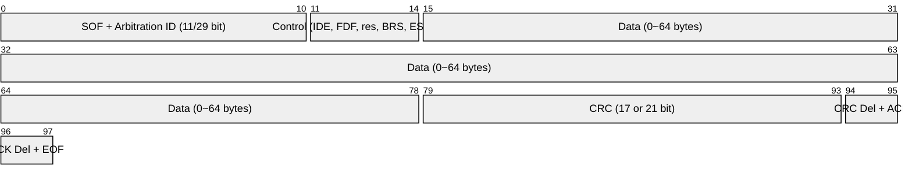
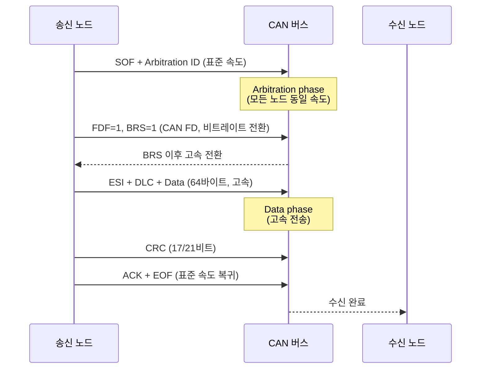
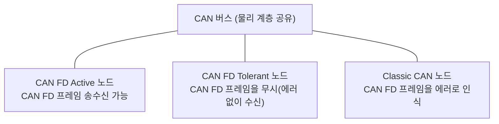

<Header />

[[toc]]

## 학습 목표

- CAN FD가 등장한 배경과 Classic CAN의 한계를 설명할 수 있다.
- FDF, BRS, ESI 비트의 역할을 이해하고 CAN FD 프레임 구조를 설명할 수 있다.
- 듀얼 비트레이트 동작 원리와 BRS 비트의 역할을 이해한다.
- FD tolerant / FD active 노드의 차이를 구분하고, ISOBUS와의 관계를 설명할 수 있다.

---

# 1. CAN FD가 나온 이유

## 기존 CAN의 한계

1986년 Bosch가 발표한 Classic CAN은 자동차 네트워크의 표준으로 자리 잡았다. 그러나 자동차 전자화가 가속화되면서 두 가지 근본적인 한계에 부딪혔다.

| 항목 | Classic CAN (2.0B) | 요구 사항 |
|---|---|---|
| 최대 페이로드 | 8 바이트 | 수십~수백 바이트 |
| 최대 비트레이트 | 1 Mbps | 수 Mbps 이상 |

**한계 1 — 8바이트 페이로드 상한**

ECU 소프트웨어 업데이트(OTA), 레이더/카메라 데이터, 고정밀 센서 융합 등 현대 자동차 기능은 한 프레임에 훨씬 많은 데이터를 담아야 한다. 8바이트로는 여러 프레임으로 쪼개서 보내야 하고, 이는 오버헤드와 응답 지연을 유발한다.

**한계 2 — 1 Mbps 비트레이트 상한**

버스 길이와 전파 지연 특성상 Classic CAN은 이론적으로 1 Mbps가 최대다. ADAS, 자율주행처럼 실시간성이 요구되는 애플리케이션에서는 이 속도로는 대역폭이 부족하다.

Bosch는 이 두 한계를 모두 해결하기 위해 **2012년 CAN FD(CAN with Flexible Data-rate)** 규격을 발표했다.

```
Classic CAN 한계 요약
─────────────────────────────────────
  페이로드:   최대 8 bytes
  비트레이트: 최대 1 Mbps
  → 현대 차량 전자화 요구를 충족 불가
─────────────────────────────────────
CAN FD 개선
  페이로드:   최대 64 bytes  (8배)
  비트레이트: Data phase 최대 8 Mbps (8배)
```

---

# 2. CAN FD의 구조

## 새로 추가된 제어 비트

CAN FD는 Classic CAN 프레임에 세 개의 비트를 추가해 하위 호환성을 유지하면서 새 기능을 제공한다.

| 비트 | 이름 | 역할 |
|---|---|---|
| **FDF** | FD Format | 이 프레임이 CAN FD임을 표시 (FDF=1이면 CAN FD) |
| **BRS** | Bit Rate Switch | Data phase에서 비트레이트를 전환할지 결정 |
| **ESI** | Error State Indicator | 송신 노드의 에러 상태를 표시 (Error Active=0, Error Passive=1) |

## CAN FD 프레임 구조



> 참고: CAN FD의 CRC는 페이로드 길이에 따라 17비트(0~16바이트) 또는 21비트(20~64바이트)로 확장된다.

## 프레임 흐름 다이어그램



## 최대 64바이트 페이로드

DLC(Data Length Code) 값과 실제 데이터 길이의 매핑이 CAN FD에서 확장되었다.

```
DLC  0~ 8 → 0~8 bytes  (Classic CAN과 동일)
DLC  9    → 12 bytes
DLC 10    → 16 bytes
DLC 11    → 20 bytes
DLC 12    → 24 bytes
DLC 13    → 32 bytes
DLC 14    → 48 bytes
DLC 15    → 64 bytes
```

---

# 3. 듀얼 비트레이트

## 두 개의 Phase

```mermaid
gantt
    title CAN FD 듀얼 비트레이트 타임라인
    dateFormat X
    axisFormat %s

    section Arbitration Phase (표준 속도)
    SOF + ID + Control (FDF/BRS 포함)  :a1, 0, 4

    section Data Phase (고속)
    ESI + DLC + Data + CRC             :a2, 4, 10

    section 복귀
    CRC Del + ACK + EOF                :a3, 10, 12
```

CAN FD 프레임은 <strong>두 개의 비트레이트 구간</strong>으로 나뉜다.



| 구간 | 포함 필드 | 속도 |
|---|---|---|
| **Arbitration phase** | SOF, ID, Control (FDF까지) | Nominal Bit Rate (통상 500 kbps) |
| **Data phase** | BRS 이후 ~ CRC | Data Bit Rate (2 ~ 8 Mbps) |

## BRS 비트가 전환 신호

`BRS=1`이면 BRS 비트 직후부터 Data phase 비트레이트로 전환된다. `BRS=0`이면 Data phase도 동일한 Nominal Bit Rate로 전송된다(속도 이점 없음).

```
Arbitration phase  BRS  │  Data phase            │  EOF
───────────────────[1]──┼──[고속 전송 구간]────────┼──[표준 복귀]
500 kbps           ↑    │  2~8 Mbps               │  500 kbps
                   전환 시점
```

## 실제 처리량 비교 예시

```
Classic CAN (8바이트, 1 Mbps):
  유효 데이터 처리량 ≈ 8 byte / ~130 bit(프레임 오버헤드) ≈ 492 kbps

CAN FD (64바이트, 4 Mbps Data phase):
  Arbitration phase: ~80 bit @ 500 kbps = 160 µs
  Data phase:        ~600 bit @ 4 Mbps  = 150 µs
  총 전송 시간 ≈ 310 µs → 약 2 Mbps 유효 처리량
```

---

# 4. CAN 2.0과의 호환성

## 같은 버스에서 공존할 수 있는가?

CAN FD 노드와 Classic CAN 노드는 <strong>버스를 물리적으로 공유</strong>할 수 있지만, 동작 방식에 따라 두 종류로 나뉜다.



| 노드 종류 | CAN FD 프레임 수신 | 에러 발생 |
|---|---|---|
| **FD Active** | 정상 처리 | 없음 |
| **FD Tolerant** | 무시(수신 후 폐기) | 없음 |
| **Classic CAN** | 인식 불가 | 에러 프레임 발생 |

> Classic CAN 노드가 같은 버스에 존재하면 CAN FD 프레임 전송 시 에러 프레임을 생성한다. 따라서 <strong>혼합 네트워크</strong>에서는 CAN FD를 사용하지 않거나, 게이트웨이로 분리해야 한다.

## ISOBUS와 CAN FD

현재 <strong>ISOBUS(ISO 11783)는 CAN 2.0B(29비트 확장 ID) 기반</strong>이다. 250 kbps의 비트레이트를 사용하며, CAN FD를 공식 채택하지 않았다.

```
현재 ISOBUS 스택
  물리 계층: CAN 2.0B, 250 kbps
  데이터 링크: ISO 11783-2 (버스 전기 특성 등)
  상위 계층: ISO 11783-3~14

CAN FD 채택 동향
  - 농기계 데이터량 증가(정밀농업, 자율주행)로 수요 증가
  - ISO TC23/SC19 WG1에서 CAN FD 확장 검토 중
  - 일부 제조사는 자체 게이트웨이로 내부 CAN FD 망 구성
```

::: tip 핵심 정리
- CAN FD는 2012년 Bosch가 발표, <strong>64바이트 페이로드</strong>와 <strong>최대 8 Mbps Data phase</strong>가 핵심 개선점이다.
- **FDF** 비트로 CAN FD 프레임임을 표시하고, **BRS** 비트로 Data phase 고속 전환, **ESI** 비트로 에러 상태를 나타낸다.
- Arbitration phase는 기존 속도(Nominal), Data phase만 고속(Data Bit Rate)으로 동작한다.
- Classic CAN 노드가 혼재하면 CAN FD 프레임을 에러로 처리하므로 혼합 네트워크는 격리가 필요하다.
- ISOBUS는 현재 CAN 2.0B 기반이며 CAN FD 채택은 진행 중이다.
:::

---

[이전: CAN 에러 처리](/study/isobus/06-can-error) | [다음: SAE J1939 입문](/study/isobus/08-j1939-intro)
