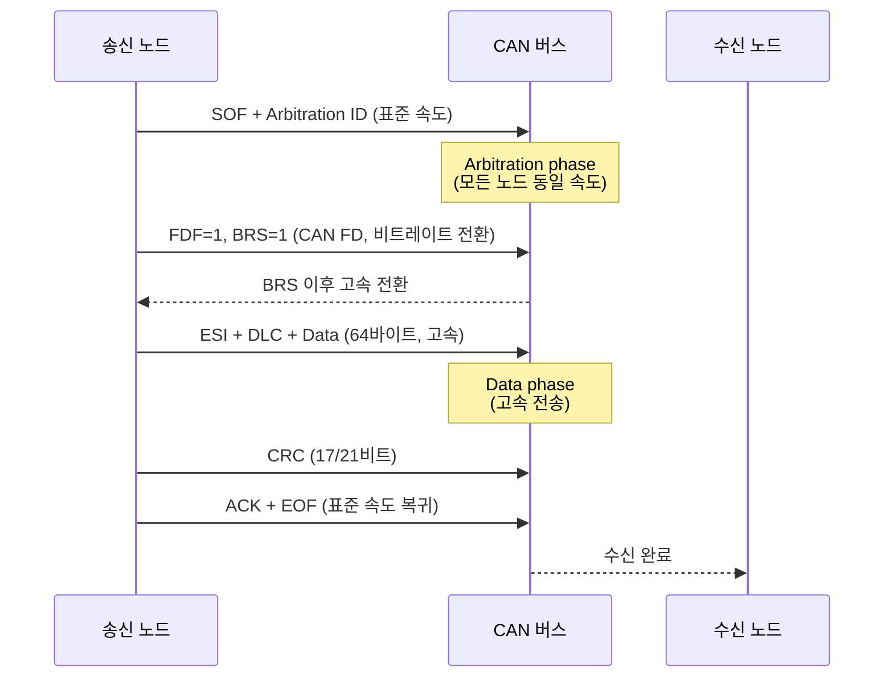
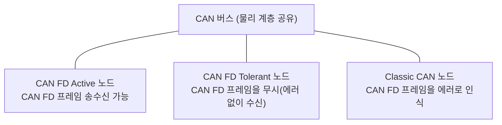

<Header />

[[toc]]

::: info 학습 목표
- CAN FD가 등장한 배경과 Classic CAN의 한계를 설명할 수 있다.
- FDF, BRS, ESI 비트의 역할을 이해하고 CAN FD 프레임 구조를 설명할 수 있다.
- 듀얼 비트레이트 동작 원리와 BRS 비트의 역할을 이해한다.
- FD tolerant / FD active 노드의 차이를 구분하고, ISOBUS와의 관계를 설명할 수 있다.
:::

# 1. CAN FD가 나온 이유

## 기존 CAN의 한계

1986년 Bosch가 발표한 Classic CAN은 자동차 네트워크의 표준으로 자리 잡았다. 그러나 자동차 전자화가 가속화되면서 두 가지 근본적인 한계에 부딪혔다.

| 항목 | Classic CAN (2.0B) | 요구 사항 |
|---|---|---|
| 최대 페이로드 | 8 바이트 | 수십~수백 바이트 |
| 최대 비트레이트 | 1 Mbps | 수 Mbps 이상 |

**한계 1 — 8바이트 페이로드 상한**

ECU 소프트웨어 업데이트(OTA), 레이더/카메라 데이터, 고정밀 센서 융합 등 현대 자동차 기능은 한 프레임에 훨씬 많은 데이터를 담아야 한다. 8바이트로는 여러 프레임으로 쪼개서 보내야 하고, 이는 오버헤드와 응답 지연을 유발한다.

**한계 2 — 1 Mbps 비트레이트 상한**

버스 길이와 전파 지연 특성상 Classic CAN은 이론적으로 1 Mbps가 최대다. ADAS, 자율주행처럼 실시간성이 요구되는 애플리케이션에서는 이 속도로는 대역폭이 부족하다.

Bosch는 이 두 한계를 모두 해결하기 위해 **2012년 CAN FD(CAN with Flexible Data-rate)** 규격을 발표했다.

| | Classic CAN | CAN FD | 개선 |
|---|---|---|---|
| 페이로드 | 최대 8 bytes | 최대 64 bytes | 8배 |
| 비트레이트 | 최대 1 Mbps | Data phase 최대 8 Mbps | 8배 |

# 2. CAN FD의 구조

## 새로 추가된 제어 비트

CAN FD는 Classic CAN 프레임에 세 개의 비트를 추가해 하위 호환성을 유지하면서 새 기능을 제공한다.

| 비트 | 이름 | 역할 |
|---|---|---|
| **FDF** | FD Format | 이 프레임이 CAN FD임을 표시 (FDF=1이면 CAN FD) |
| **BRS** | Bit Rate Switch | Data phase에서 비트레이트를 전환할지 결정 |
| **ESI** | Error State Indicator | 송신 노드의 에러 상태를 표시 (Error Active=0, Error Passive=1) |

## CAN FD 프레임 구조


> 참고: CAN FD의 CRC는 페이로드 길이에 따라 17비트(0~16바이트) 또는 21비트(20~64바이트)로 확장된다.

## 프레임 흐름 다이어그램


```mermaid
sequenceDiagram
    participant TX as 송신 노드
    participant BUS as CAN 버스
    participant RX as 수신 노드

    TX->>BUS: SOF + Arbitration ID (표준 속도)
    Note over BUS: Arbitration phase<br>(모든 노드 동일 속도)
    TX->>BUS: FDF=1, BRS=1 (CAN FD, 비트레이트 전환)
    BUS-->>TX: BRS 이후 고속 전환
    TX->>BUS: ESI + DLC + Data (64바이트, 고속)
    Note over BUS: Data phase<br>(고속 전송)
    TX->>BUS: CRC (17/21비트)
    TX->>BUS: ACK + EOF (표준 속도 복귀)
    BUS-->>RX: 수신 완료
```

## 최대 64바이트 페이로드

DLC(Data Length Code) 값과 실제 데이터 길이의 매핑이 CAN FD에서 확장되었다.

| DLC | 데이터 길이 |
|---|---|
| 0~8 | 0~8 bytes (Classic CAN과 동일) |
| 9 | 12 bytes |
| 10 | 16 bytes |
| 11 | 20 bytes |
| 12 | 24 bytes |
| 13 | 32 bytes |
| 14 | 48 bytes |
| 15 | 64 bytes |

# 3. 듀얼 비트레이트

## 두 개의 Phase

CAN FD 프레임은 <strong>두 개의 비트레이트 구간</strong>으로 나뉜다.


```mermaid
gantt
    title CAN FD 듀얼 비트레이트 타임라인
    dateFormat X
    axisFormat %s

    section Arbitration Phase (표준 속도)
    SOF + ID + Control (FDF/BRS 포함)  :a1, 0, 4

    section Data Phase (고속)
    ESI + DLC + Data + CRC             :a2, 4, 10

    section 복귀
    CRC Del + ACK + EOF                :a3, 10, 12
```

| 구간 | 포함 필드 | 속도 |
|---|---|---|
| **Arbitration phase** | SOF, ID, Control (FDF까지) | Nominal Bit Rate (통상 500 kbps) |
| **Data phase** | BRS 이후 ~ CRC | Data Bit Rate (2 ~ 8 Mbps) |

## BRS 비트가 전환 신호

`BRS=1`이면 BRS 비트 직후부터 Data phase 비트레이트로 전환된다. `BRS=0`이면 Data phase도 동일한 Nominal Bit Rate로 전송된다(속도 이점 없음).


## 실제 처리량 비교 예시

```
Classic CAN (8바이트, 1 Mbps):
  유효 데이터 처리량 ≈ 8 byte / ~130 bit(프레임 오버헤드) ≈ 492 kbps

CAN FD (64바이트, 4 Mbps Data phase):
  Arbitration phase: ~80 bit @ 500 kbps = 160 µs
  Data phase:        ~600 bit @ 4 Mbps  = 150 µs
  총 전송 시간 ≈ 310 µs → 약 2 Mbps 유효 처리량
```

# 4. CAN 2.0과의 호환성

## 같은 버스에서 공존할 수 있는가?

CAN FD 노드와 Classic CAN 노드는 <strong>버스를 물리적으로 공유</strong>할 수 있지만, 동작 방식에 따라 두 종류로 나뉜다.


```mermaid
graph TD
    BUS["CAN 버스 (물리 계층 공유)"]
    FD_ACTIVE["CAN FD Active 노드<br>CAN FD 프레임 송수신 가능"]
    FD_TOLERANT["CAN FD Tolerant 노드<br>CAN FD 프레임을 무시(에러 없이 수신)"]
    CLASSIC["Classic CAN 노드<br>CAN FD 프레임을 에러로 인식"]

    BUS --- FD_ACTIVE
    BUS --- FD_TOLERANT
    BUS --- CLASSIC
```

| 노드 종류 | CAN FD 프레임 수신 | 에러 발생 |
|---|---|---|
| **FD Active** | 정상 처리 | 없음 |
| **FD Tolerant** | 무시(수신 후 폐기) | 없음 |
| **Classic CAN** | 인식 불가 | 에러 프레임 발생 |

> Classic CAN 노드가 같은 버스에 존재하면 CAN FD 프레임 전송 시 에러 프레임을 생성한다. 따라서 <strong>혼합 네트워크</strong>에서는 CAN FD를 사용하지 않거나, 게이트웨이로 분리해야 한다.

## ISOBUS와 CAN FD

현재 <strong>ISOBUS(ISO 11783)는 CAN 2.0B(29비트 확장 ID) 기반</strong>이다. 250 kbps의 비트레이트를 사용하며, CAN FD를 공식 채택하지 않았다.

```
현재 ISOBUS 스택
  물리 계층: CAN 2.0B, 250 kbps
  데이터 링크: ISO 11783-2 (버스 전기 특성 등)
  상위 계층: ISO 11783-3~14

CAN FD 채택 동향
  - 농기계 데이터량 증가(정밀농업, 자율주행)로 수요 증가
  - ISO TC23/SC19 WG1에서 CAN FD 확장 검토 중
  - 일부 제조사는 자체 게이트웨이로 내부 CAN FD 망 구성
```

::: tip 핵심 정리
- CAN FD는 2012년 Bosch가 발표, <strong>64바이트 페이로드</strong>와 <strong>최대 8 Mbps Data phase</strong>가 핵심 개선점이다.
- **FDF** 비트로 CAN FD 프레임임을 표시하고, **BRS** 비트로 Data phase 고속 전환, **ESI** 비트로 에러 상태를 나타낸다.
- Arbitration phase는 기존 속도(Nominal), Data phase만 고속(Data Bit Rate)으로 동작한다.
- Classic CAN 노드가 혼재하면 CAN FD 프레임을 에러로 처리하므로 혼합 네트워크는 격리가 필요하다.
- ISOBUS는 현재 CAN 2.0B 기반이며 CAN FD 채택은 진행 중이다.
:::

# 5. 실제로 얼마나 빨라지나

앞 절까지는 CAN FD의 구조와 듀얼 비트레이트 원리를 개념으로 다뤘다. 여기서는 <strong>같은 64바이트 데이터</strong>를 Classic CAN과 CAN FD로 보낼 때 프레임 비트 수와 전송 시간을 끝까지 계산해 몇 배 차이가 나는지 확인한다.

## 시나리오

64바이트 데이터를 보내야 한다고 하자.

| 방식 | 처리 |
|---|---|
| Classic CAN | 최대 페이로드가 8바이트이므로 8바이트씩 <strong>8개 프레임</strong>으로 쪼갠다 |
| CAN FD | DLC 15가 64바이트에 대응하므로([§2 최대 64바이트 페이로드](#최대-64바이트-페이로드) 참고) <strong>1개 프레임</strong>에 담긴다 |

ID는 두 방식 모두 ISOBUS 기준인 29비트 Extended ID를 쓴다고 가정한다.

## 프레임 비트 수 계산

### Classic CAN — 8바이트 프레임 1개

필드별 비트 수는 CAN 4장의 Extended(29bit) 프레임 필드 표를 그대로 쓴다.

| 필드 | 비트 수 |
|---|---|
| SOF | 1 |
| Base ID | 11 |
| SRR | 1 |
| IDE | 1 |
| Extended ID | 18 |
| RTR | 1 |
| r1 | 1 |
| r0 | 1 |
| DLC | 4 |
| Data (8byte) | 64 |
| CRC | 15 |
| CRC 구분자 | 1 |
| ACK 슬롯 | 1 |
| ACK 구분자 | 1 |
| EOF | 7 |
| **합계** | **128** |

8바이트 프레임 1개가 128비트다. 8개 프레임을 보내야 하므로 <strong>128 × 8 = 1024비트</strong>가 필요하다.

### CAN FD — 64바이트 프레임 1개

CAN FD는 Classic CAN 프레임에 FDF·BRS·ESI 3비트가 추가된다([§2 새로 추가된 제어 비트](#새로-추가된-제어-비트)). 이 절에서는 그 3비트가 어느 phase에 속하는지까지 나눠서 센다 — Arbitration phase(SOF~BRS)와 Data phase(ESI~CRC)를 분리해야 다음 절의 시간 계산이 맞기 때문이다.

| 구간 | 필드 | 비트 수 |
|---|---|---|
| Arbitration phase | SOF | 1 |
| Arbitration phase | Base ID | 11 |
| Arbitration phase | SRR | 1 |
| Arbitration phase | IDE | 1 |
| Arbitration phase | Extended ID | 18 |
| Arbitration phase | RTR 위치 비트 | 1 |
| Arbitration phase | r1 | 1 |
| Arbitration phase | FDF | 1 |
| Arbitration phase | r0 | 1 |
| Arbitration phase | BRS | 1 |
| **Arbitration phase 소계** | | **37** |
| Data phase | ESI | 1 |
| Data phase | DLC | 4 |
| Data phase | Data (64byte) | 512 |
| Data phase | CRC | 21 |
| **Data phase 소계** | | **538** |
| 복귀(Nominal) | CRC 구분자 | 1 |
| 복귀(Nominal) | ACK 슬롯 | 1 |
| 복귀(Nominal) | ACK 구분자 | 1 |
| 복귀(Nominal) | EOF | 7 |
| **복귀 소계** | | **10** |
| **전체 합계** | | **585** |

CRC를 21비트로 잡은 이유는 페이로드가 64바이트라서다 — <strong>0~16바이트는 17비트, 20~64바이트는 21비트</strong>라는 규칙이 §2에 이미 나와 있고, 64바이트는 후자에 속한다.

::: tip 핵심 통찰 — 왜 phase를 나눠 세야 하나
CAN FD 프레임은 <strong>하나의 프레임 안에 두 개의 속도 구간</strong>이 있다. Arbitration phase(37비트)는 Nominal Bit Rate로, Data phase(538비트)는 Data Bit Rate로 흐른다. 이 둘을 합쳐서 "585비트를 한 속도로 나눴다"고 계산하면 틀린다. BRS 비트를 기점으로 <strong>구간별로 시간을 따로 구해 더해야</strong> 실제 전송 시간이 나온다.
:::

## 비트 스터핑을 어떻게 다뤘나

비트 스터핑은 데이터 값에 따라 늘었다 줄었다 하므로(§4 참고) 정확한 값은 실제 비트 패턴 없이는 알 수 없다. 이 절의 표와 시간 계산은 <strong>스터핑을 제외한 필드 비트 수(위 표의 128비트 / 585비트)</strong>를 기준으로 삼는다.

참고로 최악 케이스(같은 값이 5개 연속될 때마다 강제로 반대 비트가 삽입되는 상황)를 §4의 규칙 그대로 시뮬레이션하면, 8바이트 프레임 1개에서 23비트, 64바이트 FD 프레임 1개에서 114비트(Arbitration 7 + Data 107)가 추가로 붙는다. 이 값도 8배(FD ≈ 4.86배) 수준으로 <strong>비율은 비슷하게 늘어나므로 아래 배수 비교의 결론은 크게 달라지지 않는다</strong>. 다만 CAN FD는 실제로는 Data phase에서 고정 스터핑(fixed stuff bit) 방식을 쓰는데, 이는 ISO 11898-1 소관이라 이 저장소에 원문이 없어 정확한 규칙을 단정하지 않는다. 위 최악 케이스 수치는 §4의 동적 스터핑 규칙을 Data phase에도 동일하게 적용했다는 가정 하의 근사치일 뿐이다.

## 전송 시간 계산

Classic CAN은 500 kbps 단일 속도, CAN FD는 Arbitration phase 500 kbps + Data phase 2 Mbps로 계산한다.

| 방식 | 구간 | 비트 수 | 속도 | 시간 |
|---|---|---|---|---|
| Classic CAN | 8프레임 전체 | 1024 | 500 kbps | 2048 µs |
| CAN FD | Arbitration phase | 37 | 500 kbps | 74 µs |
| CAN FD | Data phase | 538 | 2 Mbps | 269 µs |
| CAN FD | 복귀(Nominal) | 10 | 500 kbps | 20 µs |
| **CAN FD 합계** | | 585 | — | **363 µs** |

2048 µs ÷ 363 µs ≈ <strong>5.64배</strong> 빠르다.

## 결론 — 몇 배 빨라지고, 왜 payload가 클수록 유리한가

같은 64바이트를 보낼 때 CAN FD는 Classic CAN보다 <strong>약 5.64배</strong> 빠르다. 속도 자체는 Data phase에서 최대 4배(2 Mbps ÷ 500 kbps) 빨라졌을 뿐인데 배수가 이보다 큰 이유는, <strong>Classic CAN이 8프레임으로 쪼개지면서 SOF·ID·CRC·EOF 같은 오버헤드 비트를 8번 반복</strong>하기 때문이다.

오버헤드 비율로 보면 차이가 분명해진다.

| 방식 | 페이로드 | 프레임 전체 비트 | 오버헤드 비율 |
|---|---|---|---|
| Classic CAN (8byte, 1프레임) | 64 bit | 128 bit | 50.0% |
| CAN FD (8byte, 1프레임) | 64 bit | 133 bit | 51.9% |
| CAN FD (64byte, 1프레임) | 512 bit | 585 bit | 12.5% |

같은 8바이트를 CAN FD로 보내면(DLC=8, 프레임 나눌 필요 없이 CRC만 17비트로 계산) 오버헤드 비율이 Classic CAN과 거의 같아서(51.9% vs 50.0%) 속도 이득이 <strong>약 1.87배</strong>에 그친다. 반면 페이로드가 64바이트로 커지면 오버헤드 비트 수(SOF~DLC, CRC, ACK, EOF 등)는 거의 그대로인데 페이로드가 512비트로 늘어나 오버헤드 비율이 12.5%까지 떨어진다. <strong>페이로드가 클수록 고정 오버헤드가 희석되면서 이득이 커지는 것</strong>이 CAN FD가 대용량 전송에서 특히 유리한 이유다.

:::details 파이썬으로 검산해 보기
```python
def worst_case_stuff_bits(L):
    """CH4 §4 규칙(5비트 연속 시 반대 비트 삽입)을 그대로 적용한 최악 케이스 시뮬레이션."""
    bits = []
    original_sent = 0
    stuff_count = 0
    cur = 0
    while original_sent < L:
        bits.append(cur)
        original_sent += 1
        if len(bits) >= 5 and len(set(bits[-5:])) == 1:
            stuff_val = 1 - bits[-1]
            bits.append(stuff_val)
            stuff_count += 1
    return stuff_count


# --- Classic CAN, Extended(29bit) ID, 8byte 프레임 1개 ---
SOF, BASE_ID, SRR, IDE, EXT_ID = 1, 11, 1, 1, 18
RTR, R1, R0, DLC = 1, 1, 1, 4
CTRL_AREA = SOF + BASE_ID + SRR + IDE + EXT_ID + RTR + R1 + R0 + DLC   # 39
CRC, CRC_DEL, ACK_SLOT, ACK_DEL, EOF = 15, 1, 1, 1, 7

DATA_BITS_CLASSIC = 8 * 8
classic_frame = CTRL_AREA + DATA_BITS_CLASSIC + CRC + CRC_DEL + ACK_SLOT + ACK_DEL + EOF
assert classic_frame == 128

n_frames = 8
classic_total_bits = classic_frame * n_frames                # 1024
classic_time_us = classic_total_bits * (1 / 500_000) * 1e6   # 2048.0

# --- CAN FD, Extended(29bit) ID, 64byte 프레임 1개 ---
FDF, BRS, ESI = 1, 1, 1
arb_bits = SOF + BASE_ID + SRR + IDE + EXT_ID + RTR + R1 + FDF + R0 + BRS   # 37
DATA_BITS_FD = 64 * 8
CRC_FD = 21   # 20~64바이트 구간
data_phase_bits = ESI + DLC + DATA_BITS_FD + CRC_FD                        # 538
tail_bits = CRC_DEL + ACK_SLOT + ACK_DEL + EOF                             # 10

fd_frame = arb_bits + data_phase_bits + tail_bits
assert fd_frame == 585

arb_time_us = arb_bits * (1 / 500_000) * 1e6          # 74.0
data_time_us = data_phase_bits * (1 / 2_000_000) * 1e6  # 269.0
tail_time_us = tail_bits * (1 / 500_000) * 1e6         # 20.0
fd_time_us = arb_time_us + data_time_us + tail_time_us  # 363.0

print(classic_total_bits, classic_time_us)   # 1024 2048.0
print(fd_frame, fd_time_us)                  # 585 363.0
print(classic_time_us / fd_time_us)          # 5.6418...

# 오버헤드 비율 비교 (8byte 페이로드일 때는 이득이 왜 작은지)
data_phase_bits_8b = ESI + DLC + DATA_BITS_CLASSIC + 17   # CRC 17bit (0~16byte 구간)
fd_frame_8b = arb_bits + data_phase_bits_8b + tail_bits
print(fd_frame_8b)  # 133
print((classic_frame - DATA_BITS_CLASSIC) / classic_frame)   # 0.50  (Classic 8B 오버헤드 비율)
print((fd_frame_8b - DATA_BITS_CLASSIC) / fd_frame_8b)        # 0.519 (FD 8B 오버헤드 비율)
print((fd_frame - DATA_BITS_FD) / fd_frame)                   # 0.125 (FD 64B 오버헤드 비율)
```
:::

## 다음 챕터

- 다음 : [SAE J1939 입문](/study/isobus/08-j1939-intro)
