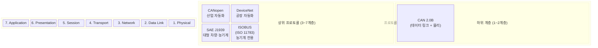
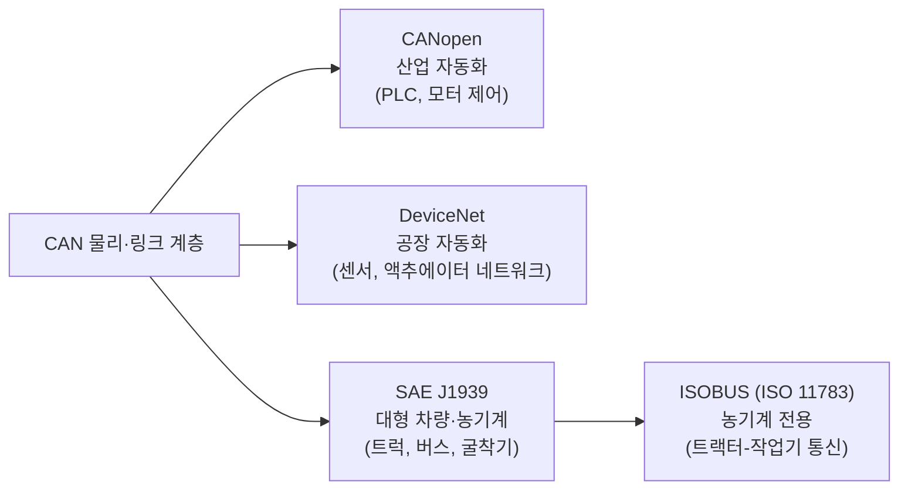
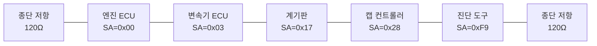
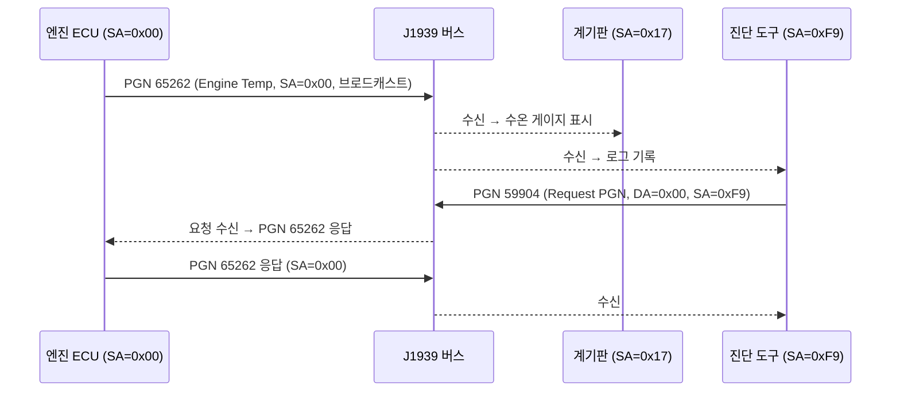

<Header />

[[toc]]

## 학습 목표

- CAN만으로 부족한 이유를 상위 프로토콜의 필요성과 연결해서 설명할 수 있다.
- CANopen, DeviceNet, J1939, ISOBUS의 위치와 차이를 구분할 수 있다.
- J1939의 29비트 CAN ID 구조(Priority, EDP, DP, PF, PS, SA)를 해석할 수 있다.
- J1939 네트워크에서 소스 어드레스(SA)의 역할을 이해한다.

---

# 1. 왜 CAN만으로는 부족한가

## CAN은 데이터 전달만 담당한다

CAN 프로토콜은 물리 계층과 데이터 링크 계층만 정의한다. 메시지를 버스에 올리고 내리는 것, 에러를 감지하는 것 — 여기까지가 CAN이 하는 일이다.

다음 기능들은 CAN 규격 어디에도 없다.

| 필요 기능 | CAN 2.0 지원 여부 |
|---|---|
| 노드별 고유 주소 관리 | 없음 (29비트 ID를 자유롭게 사용) |
| 메시지 의미 해석 (온도, 압력 등) | 없음 |
| 8바이트 초과 데이터 전송 프로토콜 | 없음 |
| 네트워크 진단 / 장치 검색 | 없음 |
| 타임아웃, 재전송 정책 | 없음 |

## 택배 트럭과 물류 시스템 비유

> "CAN은 택배 트럭이고, J1939은 물류 시스템이다."

```
CAN (택배 트럭)
  - 소포를 버스에서 목적지까지 운반
  - 어떤 소포인지, 배송 순서, 반품 정책은 모름

J1939 (물류 시스템)
  - 소포에 송장(PGN/SPN) 붙이기
  - 발송지(SA)/수신지(DA) 주소 관리
  - 큰 짐을 여러 소포로 나누는 규칙(Transport Protocol)
  - 배송 실패 처리, 재전송 정책
```

CAN 위에 상위 프로토콜을 올려야 비로소 실용적인 차량 네트워크가 완성된다.

---

# 2. 상위 프로토콜 지도

## OSI 7계층에서의 위치

CAN 기반 상위 프로토콜은 모두 OSI 모델의 3계층 이상을 담당한다.



## 프로토콜별 적용 도메인



> ISOBUS는 J1939을 기반으로 농기계 도메인에 특화한 확장 프로토콜이다. J1939을 이해하면 ISOBUS의 절반은 이해한 것이다.

---

# 3. J1939이란

SAE(Society of Automotive Engineers)가 정의한 <strong>대형 차량 및 작업 기계용 통신 상위 프로토콜</strong>이다.

```
표준명: SAE J1939
관리 기관: SAE International
기반 CAN: CAN 2.0B (29비트 확장 ID)
비트레이트: 250 kbps (표준) / 500 kbps (옵션)
주요 적용: 트럭, 버스, 굴착기, 트랙터, 농기계
```

J1939이 정의하는 것들:

- **PGN (Parameter Group Number)**: 메시지 종류 식별자
- **SPN (Suspect Parameter Number)**: 데이터 필드 내 개별 파라미터 식별자
- **소스/목적지 주소 관리**
- **Transport Protocol**: 8바이트 초과 데이터를 여러 프레임으로 분할 전송
- **네트워크 관리**: 주소 요청, 주소 충돌 감지

---

# 4. J1939과 CAN의 관계

## 29비트 CAN ID의 구조화

Classic CAN 2.0B는 29비트 확장 ID를 제공하지만, 이 ID를 어떻게 쓸지는 규정하지 않는다. J1939은 이 29비트를 다음과 같이 <strong>명확한 필드로 구조화</strong>한다.


| 필드 | 비트 수 | 설명 |
|---|---|---|
| **Priority** | 3 | 메시지 우선순위. 0이 최고, 7이 최저 |
| **EDP** | 1 | Extended Data Page. J1939에서는 보통 0 |
| **DP** | 1 | Data Page. PGN 공간을 두 배로 확장 |
| **PF** | 8 | PDU Format. 메시지 유형 결정 (PDU1 vs PDU2 구분) |
| **PS** | 8 | PDU Specific. PF < 240이면 목적지 주소, PF >= 240이면 그룹 확장 |
| **SA** | 8 | Source Address. 메시지를 보내는 노드의 주소 (0x00~0xFD) |

## 29비트 ID 예시 해석

```
CAN 29비트 ID: 0x18FEE000

바이너리: 000 1 1000 1111 1110 1110 0000 0000

분해:
  Priority : 000   = 0 (최고 우선순위)
  EDP      : 1     = 0 (EDP 비트, 실제로 CAN 확장 ID의 비트 28)
  DP       : 1     = 0
  PF       : 1111 1110 = 0xFE = 254 → PDU2 (브로드캐스트)
  PS       : 1110 0000 = 0xE0 = 224 → Group Extension
  SA       : 0000 0000 = 0x00 → 엔진 ECU

※ 실제 CAN ID 0x18FEE000 분해 (hex → 29bit):
  18FEE000 hex = 0001 1000 1111 1110 1110 0000 0000 0000 (32bit)
  하위 29비트만 사용:  000 1 1000 1111 1110 1110 0000 0000 0000 (29bit)
  Priority=6, EDP=0, DP=0, PF=0xFE=254, PS=0xE0=224, SA=0x00
```

29비트 ID의 구조를 이해했으니, 이제 이 ID 체계 위에서 실제 J1939 네트워크가 어떻게 구성되는지 살펴보자.

---

# 5. J1939 네트워크 구성

## 소스 어드레스(SA) 할당

J1939은 노드마다 <strong>고유한 소스 어드레스(SA)</strong>를 부여한다. SAE J1939-81(네트워크 관리) 규격이 주소 요청/충돌 감지 절차를 정의한다.

예약된 주소 예시:

```
SA 0x00 (0)   : Engine #1
SA 0x03 (3)   : Transmission #1
SA 0x17 (23)  : Instrument Cluster #1
SA 0x28 (40)  : Cab Controller
SA 0xF9 (249) : Diagnostic Tool (오프보드)
SA 0xFE (254) : Null Address (아직 주소 없음)
SA 0xFF (255) : Global (브로드캐스트 목적지)
```

## 네트워크 토폴로지 예시



> J1939 버스는 단일 버스 토폴로지(daisy-chain 또는 stub 방식)로 구성하며, 양 끝에 120Ω 종단 저항을 달아야 한다. ISOBUS도 동일한 물리 구성을 따른다.

## J1939 통신 흐름 예시



::: tip 핵심 정리
- CAN은 물리·링크 계층만 담당하므로 주소 관리, 메시지 의미, 대용량 전송은 상위 프로토콜이 필요하다.
- CANopen(산업), DeviceNet(공장), J1939(대형 차량·농기계), ISOBUS(농기계 전용) 모두 CAN 위에 올라가는 상위 프로토콜이다.
- J1939은 CAN 2.0B의 <strong>29비트 ID</strong>를 Priority + EDP + DP + PF + PS + SA 필드로 구조화한다.
- <strong>SA(Source Address)</strong>로 버스 내 노드를 구분하며, 0x00~0xFD가 일반 노드에 할당된다.
- ISOBUS는 J1939을 농기계 도메인에 맞게 확장한 프로토콜이다.
:::

---

## 다음 챕터

- 다음 : [J1939 메시지 구조](/study/isobus/09-j1939-message)
