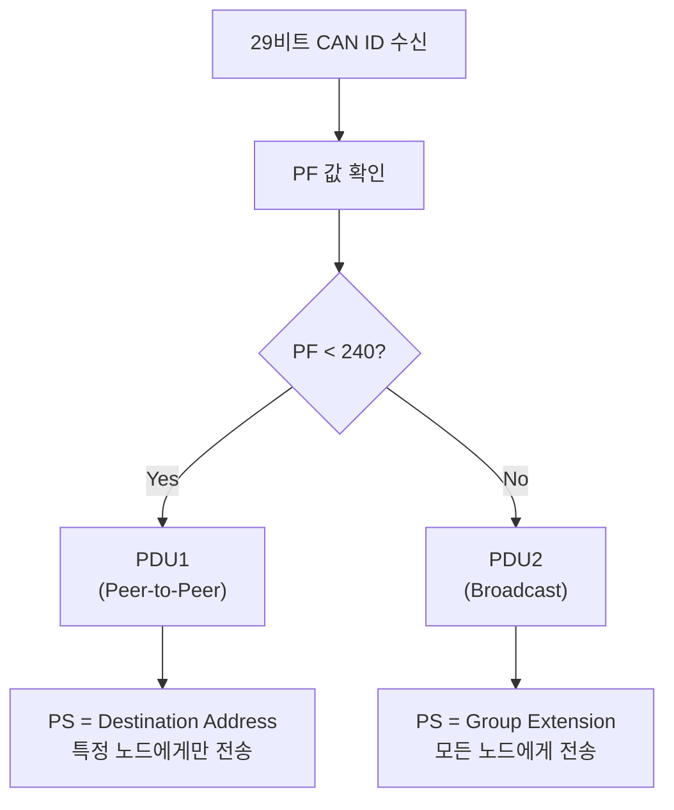
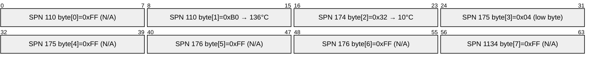

<Header />

[[toc]]

::: info 학습 목표
- J1939 29비트 ID의 각 필드(Priority, EDP, DP, PF, PS, SA)를 계산할 수 있다.
- PGN 계산 공식을 적용해 PF/PS 값으로 PGN을 도출할 수 있다.
- SPN의 개념과 데이터 필드 내 위치, 스케일/오프셋 적용 방법을 이해한다.
- PDU1과 PDU2의 차이를 PF 값으로 구분할 수 있다.
- 실제 CAN 메시지 문자열을 직접 파싱해 온도값을 추출할 수 있다.
:::

---

# 1. 29비트 ID 해부

## 필드별 상세 설명


| 필드 | 비트 위치 | 범위 | 설명 |
|---|---|---|---|
| **Priority** | 28~26 | 0~7 | 버스 중재 우선순위. **0이 최고, 7이 최저** |
| **EDP** | 25 | 0~1 | Extended Data Page. J1939에서는 0 고정 |
| **DP** | 24 | 0~1 | Data Page. 0: 기본 J1939, 1: 확장 PGN 공간 |
| **PF** | 23~16 | 0~255 | PDU Format. 메시지 종류 결정, PDU1/PDU2 구분 기준 |
| **PS** | 15~8 | 0~255 | PDU Specific. PF < 240이면 목적지 주소(DA), PF >= 240이면 그룹 확장 |
| **SA** | 7~0 | 0~253 | Source Address. 메시지 송신 노드 주소 |

## 비트 레이아웃 (29비트 전체)

```
비트 번호: 28  27  26  25  24  23  22  21  20  19  18  17  16  15  14  13  12  11  10  9   8   7   6   5   4   3   2   1   0
필드:      [  Priority  ][EDP][DP][                PF (8bit)               ][              PS (8bit)             ][            SA (8bit)            ]
```

## 예제: 0x18FEEE00 분해

```
CAN 29bit ID: 0x18FEEE00 (hex)

hex → binary (29비트):
  0x18FEEE00 = 0001 1000 1111 1110 1110 1110 0000 0000 (32bit)
  하위 29비트: 00 1 1000 1111 1110 1110 1110 0000 0000

필드 분해:
  Priority : 000      = 6     ← 28~26번 비트
  EDP      : 0        = 0
  DP       : 0        = 0
  PF       : 1111 1110 = 0xFE = 254
  PS       : 1110 1110 = 0xEE = 238
  SA       : 0000 0000 = 0x00 = 0 (엔진 ECU)
```

---

# 2. PGN (Parameter Group Number)

## PGN이란

PGN은 <strong>메시지의 종류(의미)</strong>를 식별하는 번호다. 같은 PGN을 가진 메시지는 항상 같은 형식의 데이터를 담는다.

```
PGN 65262 → Engine Temperature (엔진 온도 관련 파라미터들)
PGN 65265 → Cruise Control/Vehicle Speed
PGN 61444 → Electronic Engine Controller 1
```

## PGN 계산 공식

PGN 계산에는 PF 값이 핵심이다.

```
PF >= 240 (PDU2, 브로드캐스트):
  PGN = (EDP * 131072) + (DP * 65536) + (PF * 256) + PS

PF < 240 (PDU1, 목적지 지정):
  PGN = (EDP * 131072) + (DP * 65536) + (PF * 256)
  (PS는 목적지 주소이므로 PGN에 포함하지 않음)
```

> EDP는 J1939에서 보통 0이므로 EDP 항은 생략 가능.

## 계산 예제 1: PGN 65262 (Engine Temperature)

```
목표: PGN 65262 → PF, PS 값 역산

65262 / 256 = 254.9... → PF = 254 = 0xFE (>= 240이므로 PDU2)
65262 - (254 * 256) = 65262 - 65024 = 238 → PS = 238 = 0xEE

검증:
  PF = 0xFE = 254, PS = 0xEE = 238
  PGN = 254 * 256 + 238 = 65012 + 238 = 65262  ✓

CAN ID 구성 (Priority=6, DP=0, EDP=0, SA=0x00):
  0x18FEEE00
```

## 계산 예제 2: PGN 61444 (EEC1)

```
목표: PGN 61444 → PF, PS 역산

61444 / 256 = 240.0 → PF = 240 = 0xF0 (>= 240이므로 PDU2)
61444 - (240 * 256) = 61444 - 61440 = 4 → PS = 4 = 0x04

CAN ID (Priority=3, SA=0x00):
  Priority=3 → 0b011 → 0x0C000000 (비트 26~28)
  0x0CF00400
```

---

# 3. SPN (Suspect Parameter Number)

## SPN이란

SPN은 <strong>데이터 필드(8바이트) 내의 개별 파라미터</strong>를 식별하는 번호다. 하나의 PGN 메시지에 여러 SPN이 포함될 수 있다.

```
PGN 65262 (Engine Temperature) 내 SPN 목록:
  SPN 110 : Engine Coolant Temperature    (byte 1, 1byte)
  SPN 174 : Engine Fuel Temperature 1    (byte 2, 1byte)
  SPN 175 : Engine Oil Temperature 1     (byte 3~4, 2byte)
  SPN 176 : Engine Turbo Temperature     (byte 5~6, 2byte)
  SPN 1134: Engine Intercooler Temp      (byte 7, 1byte)
  SPN 1135: Engine Intercooler Coolant Temp (byte 8, 1byte)
```

## SPN 속성 (SPN 110 예시)

| 속성 | 값 |
|---|---|
| SPN 번호 | 110 |
| 이름 | Engine Coolant Temperature |
| PGN | 65262 |
| 데이터 위치 | byte 1 (offset 0) |
| 길이 | 1 byte |
| 분해능(Resolution) | 1 °C/bit |
| 오프셋(Offset) | -40 °C |
| 유효 범위 | -40 ~ 210 °C |
| 원시값 0xFF | Not Available (N/A) |

## SPN 값 변환 공식

```
실제값 = 원시값(raw) * 분해능 + 오프셋

SPN 110, raw = 0xB0 = 176:
  실제 온도 = 176 * 1 + (-40) = 136 °C
```

---

# 4. PDU1 vs PDU2

## 구분 기준: PF 값



## PDU1 (PF < 240): 목적지 지정 메시지

```
PS = DA (Destination Address)

예: 진단 도구(SA=0xF9)가 엔진 ECU(DA=0x00)에게 요청
  Priority = 6, EDP=0, DP=0
  PF = 0xEA (234, < 240 → PDU1)
  PS = DA = 0x00 (엔진 ECU)
  SA = 0xF9 (진단 도구)
  → CAN ID: 0x18EA00F9
```

## PDU2 (PF >= 240): 브로드캐스트 메시지

```
PS = Group Extension (PGN의 일부)

예: 엔진 ECU(SA=0x00)가 Engine Temperature 브로드캐스트
  Priority = 6, EDP=0, DP=0
  PF = 0xFE (254, >= 240 → PDU2)
  PS = 0xEE (238, Group Extension → PGN의 일부)
  SA = 0x00 (엔진 ECU)
  → CAN ID: 0x18FEEE00
  → PGN = 254 * 256 + 238 = 65262
```

## 비교 표

| 항목 | PDU1 | PDU2 |
|---|---|---|
| PF 값 범위 | 0 ~ 239 (0x00 ~ 0xEF) | 240 ~ 255 (0xF0 ~ 0xFF) |
| PS 의미 | Destination Address | Group Extension (PGN의 일부) |
| 전송 방식 | 특정 노드 지정 | 버스 전체 브로드캐스트 |
| 주요 용도 | 요청/응답, 진단 | 센서 데이터 주기적 전송 |

---

# 5. PGN/SPN 디코딩 실습

## 대상 메시지

```
18FEEE00#FFB03204FFFFFFFF
```

## 파싱 단계

### 1단계: CAN ID와 데이터 분리

```
CAN ID   : 18FEEE00 (hex, 29비트)
데이터   : FF B0 32 04 FF FF FF FF (8바이트)
           [0][1][2][3][4][5][6][7]
```

### 2단계: 29비트 ID 분해

```
0x18FEEE00 → binary (29비트):
  000 1 1000 1111 1110 1110 1110 0000 0000

Priority : 000         = 6
EDP      : 0           = 0
DP       : 0           = 0
PF       : 1111 1110   = 0xFE = 254  (>= 240 → PDU2)
PS       : 1110 1110   = 0xEE = 238
SA       : 0000 0000   = 0x00 (Engine ECU)
```

### 3단계: PGN 계산

```
PF = 254, PS = 238 (PDU2이므로 PS를 PGN에 포함)
PGN = DP * 65536 + PF * 256 + PS
    = 0 * 65536 + 254 * 256 + 238
    = 0 + 65024 + 238
    = 65262  → Engine Temperature
```

### 4단계: 데이터 필드 해석



### 5단계: SPN 110 값 추출

```
SPN 110 (Engine Coolant Temperature):
  데이터 위치: byte[1] = 0xB0

  0xFF(byte[0]) → SAE 규약상 N/A (Not Available)
  0xB0(byte[1]) = 176 (decimal)

  실제 온도 = 176 * 1 °C/bit + (-40 °C)
            = 176 - 40
            = 136 °C

결과: 엔진 냉각수 온도 = 136 °C
```

### 6단계: 전체 파싱 결과 요약

```
메시지   : 18FEEE00#FFB03204FFFFFFFF
Priority : 6
SA       : 0x00 (Engine ECU #1)
PGN      : 65262 (Engine Temperature)

SPN 110  Engine Coolant Temperature : 136 °C  (byte[1]=0xB0)
SPN 174  Engine Fuel Temperature 1  : 10 °C   (byte[2]=0x32, 50-40=10)
SPN 175  Engine Oil Temperature 1   : N/A     (byte[3~4] 포함 0xFF)
SPN 176  Engine Turbo Temperature   : N/A
SPN 1134 Intercooler Temp           : N/A
```

::: details Python 파싱 예제
## Python 파싱 예제

```python
def parse_j1939_message(can_id_hex: str, data_hex: str):
    """
    J1939 CAN 메시지를 파싱한다.

    Args:
        can_id_hex: 29비트 CAN ID (hex string, e.g. "18FEEE00")
        data_hex:   데이터 필드 (hex string, e.g. "FFB03204FFFFFFFF")
    """
    can_id = int(can_id_hex, 16)

    # 29비트 ID 분해
    sa       = (can_id >> 0) & 0xFF
    ps       = (can_id >> 8) & 0xFF
    pf       = (can_id >> 16) & 0xFF
    dp       = (can_id >> 24) & 0x01
    edp      = (can_id >> 25) & 0x01
    priority = (can_id >> 26) & 0x07

    # PGN 계산
    if pf >= 240:   # PDU2: PS는 Group Extension
        pgn = (edp << 17) | (dp << 16) | (pf << 8) | ps
    else:           # PDU1: PS는 목적지 주소
        pgn = (edp << 17) | (dp << 16) | (pf << 8)

    print(f"Priority : {priority}")
    print(f"SA       : 0x{sa:02X} ({sa})")
    print(f"PF       : 0x{pf:02X} ({pf})")
    print(f"PS       : 0x{ps:02X} ({ps})")
    print(f"PGN      : {pgn} (0x{pgn:05X})")

    # 데이터 파싱
    data = bytes.fromhex(data_hex)

    if pgn == 65262:  # Engine Temperature
        print("\n[PGN 65262: Engine Temperature]")
        spn110_raw = data[1]
        if spn110_raw == 0xFF:
            print("  SPN 110 Engine Coolant Temp: N/A")
        else:
            spn110_val = spn110_raw * 1 + (-40)
            print(f"  SPN 110 Engine Coolant Temp: {spn110_val} °C (raw=0x{spn110_raw:02X})")

        spn174_raw = data[2]
        if spn174_raw == 0xFF:
            print("  SPN 174 Engine Fuel Temp 1 : N/A")
        else:
            spn174_val = spn174_raw * 1 + (-40)
            print(f"  SPN 174 Engine Fuel Temp 1 : {spn174_val} °C (raw=0x{spn174_raw:02X})")


# 실행 예시
parse_j1939_message("18FEEE00", "FFB03204FFFFFFFF")
```

실행 결과:

```
Priority : 6
SA       : 0x00 (0)
PF       : 0xFE (254)
PS       : 0xEE (238)
PGN      : 65262 (0x0FEEE)

[PGN 65262: Engine Temperature]
  SPN 110 Engine Coolant Temp: 136 °C (raw=0xB0)
  SPN 174 Engine Fuel Temp 1 : 10 °C (raw=0x32)
```
:::

::: tip 핵심 정리
- 29비트 ID는 Priority(3) + EDP(1) + DP(1) + PF(8) + PS(8) + SA(8)로 구성된다.
- **PGN** = PF가 >= 240이면 PS 포함, PF < 240이면 PS 제외하여 계산한다.
- <strong>SPN</strong>은 PGN 데이터 필드 내 개별 파라미터이며, `실제값 = raw * 분해능 + 오프셋` 공식으로 변환한다.
- PDU1(PF < 240)은 특정 노드 지정, PDU2(PF >= 240)는 브로드캐스트 전송이다.
- `18FEEE00#FFB03204FFFFFFFF` 파싱 결과: Priority=6, PGN=65262, SA=0x00, 냉각수 온도=136°C.
:::

---

## 다음 챕터

- 다음 : [J1939 주소 체계](/study/isobus/10-j1939-address)
