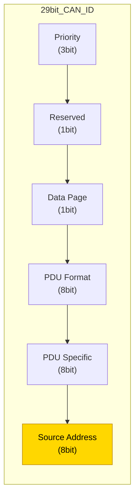
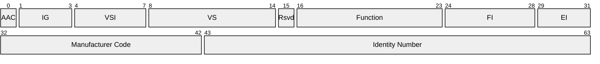
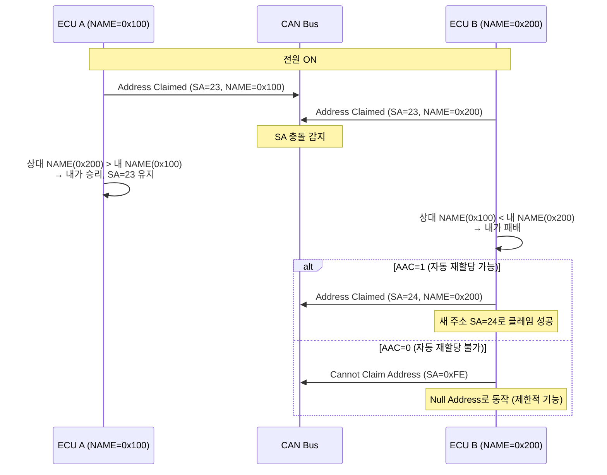
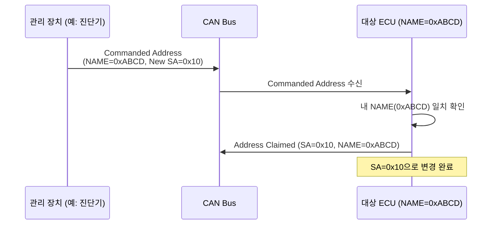

# J1939 주소 체계

## 학습 목표
- 소스 주소(SA)의 범위와 예약 주소의 의미를 설명할 수 있다.
- 64비트 NAME의 각 필드 구성과 역할을 이해한다.
- 주소 클레임 절차의 단계별 흐름과 충돌 해결 방식을 설명할 수 있다.
- Commanded Address(PGN 65240)의 동작 원리를 이해한다.

---

## 1. 소스 주소 (SA)

J1939 네트워크에서 모든 ECU는 <strong>소스 주소(Source Address, SA)</strong>를 가집니다. SA는 8비트 값으로, 29비트 CAN ID의 <strong>하위 8비트(비트 7~0)</strong>에 위치합니다.

```
┌─────────────────────────────────────────────────┐
│           29-bit CAN Identifier                  │
│  [28:26] P  [25] R  [24] DP  [23:16] PF          │
│  [15:8] PS (DA or Group Ext)  [7:0] SA           │
└─────────────────────────────────────────────────┘
```

### SA 값 범위

| 범위 | 의미 |
|------|------|
| 0 ~ 253 | 일반 사용 가능 주소 |
| 254 (0xFE) | Null Address — 주소 클레임 전, 또는 클레임 실패 시 |
| 255 (0xFF) | Global Address — 브로드캐스트 수신 전용 |

### 예약된 주소 (일부)

| SA | 장치 |
|----|------|
| 0 (0x00) | Engine #1 |
| 3 (0x03) | Transmission #1 |
| 23 (0x17) | Instrument Cluster #1 |
| 33 (0x21) | Cab Controller — Primary |
| 128 (0x80) | Task Controller (ISOBUS) |
| 130 (0x82) | Virtual Terminal (ISOBUS) |

예약 주소는 <strong>우선권</strong>을 가지지 않습니다. 주소 클레임 경쟁에서 NAME 값이 작은 쪽이 이기며, 예약 주소라도 더 작은 NAME을 가진 장치가 있으면 양보해야 합니다.



---

## 2. NAME (64비트)

<strong>NAME</strong>은 J1939 네트워크에서 ECU를 전 세계적으로 고유하게 식별하는 64비트 구조체입니다. 주소 클레임 시 충돌이 발생하면 NAME 값을 비교해 우선순위를 결정합니다. NAME 값이 **수치적으로 더 작은** 장치가 주소를 획득합니다.

### NAME 필드 구성



| 필드 | 비트 수 | 위치 (MSB 기준) | 설명 |
|------|---------|-----------------|------|
| Arbitrary Address Capable (AAC) | 1 | bit 63 | 1이면 자동 주소 재할당 가능 |
| Industry Group (IG) | 3 | bit 62~60 | 0=Global, 2=Agricultural |
| Vehicle System Instance (VSI) | 4 | bit 59~56 | 동일 시스템 여러 개 구분 |
| Vehicle System (VS) | 7 | bit 55~49 | 시스템 유형 (예: 트랙터) |
| Reserved | 1 | bit 48 | 항상 0 |
| Function (F) | 8 | bit 47~40 | 장치 기능 (예: 엔진 제어) |
| Function Instance (FI) | 5 | bit 39~35 | 동일 기능 여러 개 구분 |
| ECU Instance (EI) | 3 | bit 34~32 | 동일 장치 내 ECU 구분 |
| Manufacturer Code | 11 | bit 31~21 | 제조사 코드 (SAE J1939 등록) |
| Identity Number | 21 | bit 20~0 | 제조사 내 일련번호 |

**NAME 예시 (16진수):**

```
NAME = 0x0000000060000000
       └─────────────────┘
         Industry Group = 3 (Agriculture),
         Arbitrary Address Capable = 0,
         Function = 0 (Engine),
         Manufacturer Code = 0,
         Identity Number = 0
```

---

## 3. 주소 클레임 절차

J1939 장치는 네트워크에 연결되면 <strong>Address Claimed 메시지(PGN 60928, 0xEE00)</strong>를 브로드캐스트하여 주소를 선점합니다. 같은 주소를 사용하려는 장치가 있으면 NAME 비교를 통해 충돌을 해결합니다.



### 절차 단계 요약

1. **전원 ON** — ECU가 사용할 SA를 선택 (선호 주소 또는 저장된 주소)
2. **Request for Address Claimed 수신** — 다른 장치가 네트워크 조회를 요청할 수 있음
3. **Address Claimed 전송** — 선택한 SA와 자신의 NAME을 PGN 60928으로 브로드캐스트
4. **충돌 감지** — 같은 SA로 다른 NAME이 수신되면 충돌
5. **NAME 비교** — 더 작은 NAME 값을 가진 장치가 해당 SA를 획득
6. **패자 처리**
   - AAC=1: 다른 SA를 선택하여 재클레임
   - AAC=0: Cannot Claim (SA=0xFE) 전송 후 수신 전용 동작

### 타이밍 규칙

| 항목 | 값 |
|------|----|
| 클레임 후 대기 시간 | 250ms (다른 장치 응답 대기) |
| 요청 후 응답 시간 | 최대 1250ms |

---

## 4. Commanded Address

<strong>Commanded Address</strong>는 외부 장치가 특정 ECU에게 주소를 강제로 지정하는 메커니즘입니다. <strong>PGN 65240 (0xFED8)</strong>을 사용합니다.

### 메시지 구조

```
PGN 65240 (Commanded Address)
┌────────────────────────────────────────┐
│ Byte 1~8 : 대상 NAME (64bit)           │
│ Byte 9   : 새로운 SA (8bit)            │
└────────────────────────────────────────┘
```

### 동작 방식



### 사용 사례

| 상황 | 설명 |
|------|------|
| 공장 설정 | 제조 라인에서 장치에 고정 SA 부여 |
| 네트워크 재구성 | 시스템 통합 시 주소 충돌 사전 방지 |
| 진단/유지보수 | 특정 SA로 장치를 강제 이동 |

Commanded Address를 수신한 ECU는 반드시 <strong>Address Claimed 메시지로 응답</strong>해야 합니다. ECU가 새 주소를 클레임할 수 없는 경우 Cannot Claim을 전송합니다.

---

::: tip 핵심 정리
- SA는 8비트이며 0~253이 일반 사용 가능, 254=Null, 255=Global(브로드캐스트)입니다.
- SA는 29비트 CAN ID의 하위 8비트에 위치합니다.
- NAME은 64비트 구조체로 장치를 전 세계적으로 고유 식별하며, **값이 작을수록 우선순위가 높습니다.**
- 주소 클레임(PGN 60928)은 전원 ON 후 발생하며, 충돌 시 NAME 비교로 승자를 결정합니다.
- AAC=1인 장치는 충돌 패배 후 다른 주소로 자동 재클레임할 수 있습니다.
- Commanded Address(PGN 65240)는 외부에서 ECU의 주소를 강제 지정하는 방법입니다.
:::

## 다음 챕터

[J1939 Transport Protocol](/study/isobus/11-j1939-transport)으로 이어집니다.
