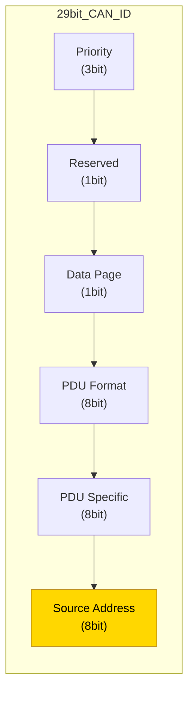
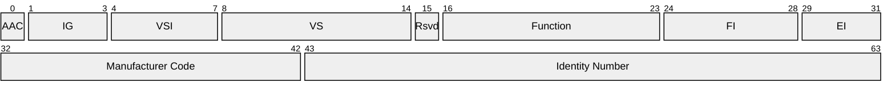
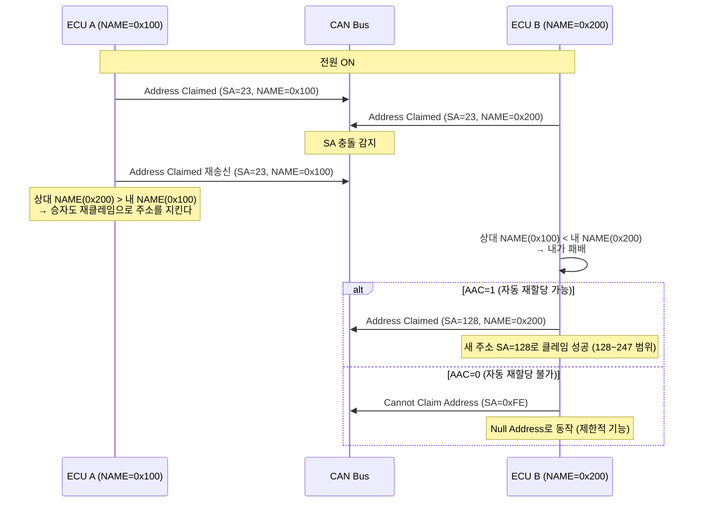
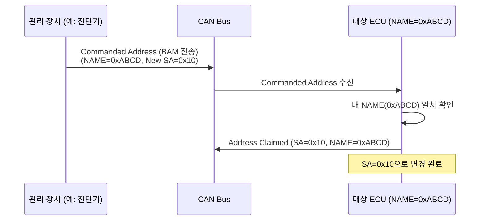

# J1939 주소 체계

::: info 학습 목표
- 소스 주소(SA)의 범위와 예약 주소의 의미를 설명할 수 있다.
- 64비트 NAME의 각 필드 구성과 역할을 이해한다.
- 주소 클레임 절차의 단계별 흐름과 충돌 해결 방식을 설명할 수 있다.
- Commanded Address(PGN 65240)의 동작 원리를 이해한다.
:::

## 1. 소스 주소 (SA)

J1939 네트워크에서 모든 ECU는 <strong>소스 주소(Source Address, SA)</strong>를 가진다. SA는 8비트 값으로, 29비트 CAN ID의 <strong>하위 8비트(비트 7~0)</strong>에 위치한다.


### SA 값 범위

| 범위 | 의미 |
|------|------|
| 0 ~ 127, 248 ~ 253 | Preferred address 영역 — 이 범위를 클레임하는 장치는 해당 주소에 정의된 기능을 실제로 수행해야 한다 |
| 128 ~ 247 | Self-configurable address 범위 — preferred address가 없거나 클레임에 실패한 장치가 사용 |
| 254 (0xFE) | Null Address — <strong>소스 주소로만</strong> 사용. 주소 클레임 전, 또는 클레임 실패 시 |
| 255 (0xFF) | Global Address — <strong>목적지 주소로만</strong> 사용 (브로드캐스트) |

### 예약된 주소 (일부)

| SA | 장치 |
|----|------|
| 0 (0x00) | Engine #1 |
| 3 (0x03) | Transmission #1 |
| 23 (0x17) | Instrument Cluster #1 |
| 33 (0x21) | Cab Controller — Primary |
| 38 (0x26) | Virtual Terminal (ISOBUS) |
| 247 (0xF7) | Task Controller (ISOBUS) |

예약(preferred) 주소는 <strong>우선권</strong>을 가지지 않는다. 주소 클레임 경쟁에서 NAME 값이 작은 쪽이 이기며, 예약 주소라도 더 작은 NAME을 가진 장치가 있으면 양보해야 한다. 기능 판단도 SA가 아니라 반드시 NAME으로 해야 한다. 참고로 <strong>ISOBUS(ISO 11783) 적합 장치는 self-configurable address 능력이 필수</strong>이며, non-configurable 장치는 J1939·구판 호환을 위해 허용될 뿐이다.


```mermaid
graph LR
    subgraph 29bit_CAN_ID
        P["Priority<br>(3bit)"]
        R["Reserved<br>(1bit)"]
        DP["Data Page<br>(1bit)"]
        PF["PDU Format<br>(8bit)"]
        PS["PDU Specific<br>(8bit)"]
        SA["Source Address<br>(8bit)"]
    end
    P --> R --> DP --> PF --> PS --> SA
    style SA fill:#ffd700,stroke:#b8860b,color:#000
```

## 2. NAME (64비트)

<strong>NAME</strong>은 J1939 네트워크에서 ECU를 전 세계적으로 고유하게 식별하는 64비트 구조체이다. 주소 클레임 시 충돌이 발생하면 NAME 값을 비교해 우선순위를 결정한다. NAME 값이 **수치적으로 더 작은** 장치가 주소를 획득한다.

### NAME 필드 구성


```mermaid
packet-beta
  0-0: "AAC"
  1-3: "IG"
  4-7: "VSI"
  8-14: "VS"
  15-15: "Rsvd"
  16-23: "Function"
  24-28: "FI"
  29-31: "EI"
  32-42: "Manufacturer Code"
  43-63: "Identity Number"
```

| 필드 | 비트 수 | 위치 (MSB 기준) | 설명 |
|------|---------|-----------------|------|
| Arbitrary Address Capable (AAC) | 1 | bit 63 | 1이면 자동 주소 재할당 가능 |
| Industry Group (IG) | 3 | bit 62~60 | 0=Global, 2=Agricultural |
| Vehicle System Instance (VSI) | 4 | bit 59~56 | 동일 시스템 여러 개 구분 |
| Vehicle System (VS) | 7 | bit 55~49 | 시스템 유형 (예: 트랙터) |
| Reserved | 1 | bit 48 | 항상 0 |
| Function (F) | 8 | bit 47~40 | 장치 기능 (예: 엔진 제어) |
| Function Instance (FI) | 5 | bit 39~35 | 동일 기능 여러 개 구분 |
| ECU Instance (EI) | 3 | bit 34~32 | 동일 장치 내 ECU 구분 |
| Manufacturer Code | 11 | bit 31~21 | 제조사 코드 (SAE J1939 등록) |
| Identity Number | 21 | bit 20~0 | 제조사 내 일련번호 |

**NAME 예시 (16진수):**

```
NAME = 0x2000000000000000
       └─────────────────┘
         Arbitrary Address Capable = 0,
         Industry Group = 2 (Agricultural equipment),
         Function = 0 (Engine),
         Manufacturer Code = 0,
         Identity Number = 0

최상위 바이트 = 0b0010_0000 = 0x20
  → AAC(1bit)=0, IG(3bit)=010(2), VSI(4bit)=0000
```

## 3. 주소 클레임 절차

J1939 장치는 네트워크에 연결되면 <strong>Address Claimed 메시지(PGN 60928, 0xEE00)</strong>를 브로드캐스트하여 주소를 선점한다. 같은 주소를 사용하려는 장치가 있으면 NAME 비교를 통해 충돌을 해결한다.

클레임에 앞서 <strong>주소 조회 시퀀스</strong>를 거치는 것이 표준 절차다. Request for Address Claimed(PGN 59904)를 Global 또는 자신의 초기 주소로 보내고, <strong>최소 250 ms + RTxD</strong>를 대기하면서 수신된 Address Claimed들로 사용 중인 주소를 파악한 뒤, 비어 있는 주소를 클레임한다. 여기서 <strong>RTxD(Random Transmit Delay)</strong>는 0~255 범위의 난수에 0.6 ms를 곱한 지연 시간으로, 여러 장치가 동시에 송신해 버스 오류를 일으키는 것을 막는다.


```mermaid
sequenceDiagram
    participant ECU_A as ECU A (NAME=0x100)
    participant BUS as CAN Bus
    participant ECU_B as ECU B (NAME=0x200)

    Note over ECU_A,ECU_B: 전원 ON

    ECU_A->>BUS: Address Claimed (SA=23, NAME=0x100)
    ECU_B->>BUS: Address Claimed (SA=23, NAME=0x200)

    Note over BUS: SA 충돌 감지

    ECU_A->>BUS: Address Claimed 재송신 (SA=23, NAME=0x100)
    Note over ECU_A: 상대 NAME(0x200) > 내 NAME(0x100)<br>→ 승자도 재클레임으로 주소를 지킨다
    ECU_B->>ECU_B: 상대 NAME(0x100) < 내 NAME(0x200)<br>→ 내가 패배

    alt AAC=1 (자동 재할당 가능)
        ECU_B->>BUS: Address Claimed (SA=128, NAME=0x200)
        Note over ECU_B: 새 주소 SA=128로 클레임 성공 (128~247 범위)
    else AAC=0 (자동 재할당 불가)
        ECU_B->>BUS: Cannot Claim Address (SA=0xFE)
        Note over ECU_B: Null Address로 동작 (제한적 기능)
    end
```

### 절차 단계 요약

1. **전원 ON** — ECU가 사용할 SA를 선택 (선호 주소 또는 저장된 초기 주소)
2. **주소 조회** — Request for Address Claimed(PGN 59904)를 보내고 250 ms + RTxD 대기하며 사용 중인 주소를 파악
3. **Address Claimed 전송** — 선택한 SA와 자신의 NAME을 PGN 60928으로 브로드캐스트
4. **충돌 감지** — 같은 SA로 다른 NAME이 수신되면 충돌
5. **NAME 비교** — 더 작은 NAME 값을 가진 장치가 해당 SA를 획득. <strong>승자도 자신의 NAME으로 Address Claimed를 재송신</strong>해 주소를 지켜야 한다
6. **패자 처리**
   - AAC=1: 128~247 범위에서 다른 SA를 선택하여 재클레임
   - AAC=0: Cannot Claim (SA=0xFE) 전송 후 수신 전용 동작 (RTxD 삽입 후 송신)

### 타이밍 규칙

| 항목 | 값 |
|------|----|
| 주소 조회(Request) 후 대기 | 최소 250 ms + RTxD |
| 클레임 성공 판정 | Address Claimed 송신 후 250 ms 동안 경합 클레임이 없어야 성공 |
| 일반 통신 시작 | 클레임 성공 후 250 ms 경과 전에는 일반 메시지 송신 금지 (Request 응답은 예외) |
| RTxD | 난수(0~255) × 0.6 ms |

## 4. Commanded Address

<strong>Commanded Address</strong>는 외부 장치가 특정 ECU에게 주소를 강제로 지정하는 메커니즘이다. <strong>PGN 65240 (0xFED8)</strong>을 사용하며, 지원 여부는 <strong>선택 사항</strong>이다.

### 메시지 구조


데이터가 9바이트라 단일 CAN 프레임(8바이트)에 담을 수 없으므로 <strong>BAM(Broadcast Announce Message) 전송 프로토콜로 Global(255)에 송신</strong>한다. 따라서 Commanded Address를 지원하는 장치는 BAM 수신도 지원해야 한다.

### 동작 방식


```mermaid
sequenceDiagram
    participant MASTER as 관리 장치 (예: 진단기)
    participant BUS as CAN Bus
    participant ECU as 대상 ECU (NAME=0xABCD)

    MASTER->>BUS: Commanded Address (BAM 전송)<br>(NAME=0xABCD, New SA=0x10)
    BUS->>ECU: Commanded Address 수신

    ECU->>ECU: 내 NAME(0xABCD) 일치 확인
    ECU->>BUS: Address Claimed (SA=0x10, NAME=0xABCD)
    Note over ECU: SA=0x10으로 변경 완료
```

### 사용 사례

| 상황 | 설명 |
|------|------|
| 공장 설정 | 제조 라인에서 장치에 고정 SA 부여 |
| 네트워크 재구성 | 시스템 통합 시 주소 충돌 사전 방지 |
| 진단/유지보수 | 특정 SA로 장치를 강제 이동 |

Commanded Address를 수락한 ECU는 명령받은 주소를 새 SA로 하는 <strong>Address Claimed 메시지를 발행</strong>해야 하며, 이때 일반 주소 클레임 요구사항이 그대로 적용된다. 수신했지만 주소를 변경할 수 없는 ECU는 <strong>현재 SA를 클레임하는 Address Claimed로 응답</strong>한다.

::: tip 핵심 정리
- SA는 8비트이며 0~127·248~253은 preferred, 128~247은 self-configurable 범위, 254=Null(소스 전용), 255=Global(목적지 전용)이다.
- SA는 29비트 CAN ID의 하위 8비트에 위치한다.
- NAME은 64비트 구조체로 장치를 전 세계적으로 고유 식별하며, **값이 작을수록 우선순위가 높다.**
- 클레임 전에 주소 조회 후 250 ms + RTxD를 대기하고, 충돌 시 NAME 비교로 승자를 결정한다. 승자도 Address Claimed를 재송신해야 한다.
- AAC=1인 장치는 충돌 패배 후 128~247 범위의 다른 주소로 자동 재클레임할 수 있다. ISOBUS 적합 장치는 이 능력이 필수다.
- Commanded Address(PGN 65240)는 외부에서 ECU의 주소를 강제 지정하는 방법이며, 9바이트 데이터라 BAM으로 전송된다.
:::

## 5. 주소 클레임 따라가기

앞 절이 절차를 일반화해서 설명했다면, 여기서는 <strong>서로 다른 제조사의 작업기 ECU 2개가 같은 주소를 동시에 클레임해 충돌하고, NAME 비교로 승패가 갈린 뒤, 진 쪽이 다른 주소를 재클레임하는 전 과정</strong>을 시각(ms) 단위로 끝까지 따라간다.

### 등장인물 — 두 파종기 컨트롤러의 NAME

두 CF 모두 파종기(Device class 4, Planter — [부속서 ISO 11783-5](/study/isobus/appendix-iso-part05) Annex A.3에서 확인) 컨트롤러이고, 둘 다 ISOBUS 적합 장치라 self-configurable(AAC=1)이다. Industry Group(농업 장비)·Device class·Function까지 같아서, NAME이 갈리는 지점은 제조사 고유 필드(Manufacturer Code, Identity Number)뿐이다.

| 필드 | 비트 | CF A — 그린텍 파종기 컨트롤러 | CF B — 블루팜 파종기 컨트롤러 |
|------|------|------|------|
| Self-configurable address (AAC) | 1 | 1 (self-configurable) | 1 (self-configurable) |
| Industry Group (IG) | 3 | 2 (Agricultural) | 2 (Agricultural) |
| Vehicle System Instance (VSI) | 4 | 0 | 0 |
| Vehicle System (VS) | 7 | 4 (Planter) | 4 (Planter) |
| Reserved | 1 | 0 | 0 |
| Function | 8 | 130 | 130 |
| Function Instance (FI) | 5 | 0 | 0 |
| ECU Instance (EI) | 3 | 0 | 0 |
| Manufacturer Code | 11 | 105 (그린텍) | 320 (블루팜) |
| Identity Number | 21 | 500000 | 250000 |

Function·Manufacturer Code·Identity Number의 실제 등록값은 isobus.net 데이터베이스가 관리하며 이 스터디의 부속서에는 실려 있지 않다. 위 표의 값은 필드 인코딩·비교 방식을 보여주기 위한 예시다. 이 값을 64비트로 이어 붙이면 다음과 같다.

```
NAME_A = 0xA00882000D27A120   (바이트: A0 08 82 00 0D 27 A1 20)
NAME_B = 0xA00882002803D090   (바이트: A0 08 82 00 28 03 D0 90)
```

### 타임라인 — 충돌부터 재클레임까지

두 CF 모두 제조 시 저장된 initial address가 우연히 128(self-configurable 범위의 첫 주소)로 같다고 하자.

| 시각(ms) | 송신자 | 메시지 (PGN, 데이터) | 버스 상태 | 판정 |
|------|------|------|------|------|
| 0 | CF A, CF B (각자) | Request for Address Claimed (PGN 59904, DA=255, 데이터=PGN 60928 조회) | 정상 송신 | 사용 중 주소 조회 시작 — 각자 <strong>250 ms + RTxD</strong> 대기 진입 |
| 0~331.6 | CF A | (대기, RTxD_A = 136 × 0.6 ms = 81.6 ms) | 유휴 — SA=128 클레임 수신 없음 | SA=128을 빈 주소로 판단 |
| 0~332.2 | CF B | (대기, RTxD_B = 137 × 0.6 ms = 82.2 ms) | 유휴 — SA=128 클레임 수신 없음 | SA=128을 빈 주소로 판단 |
| 331.6 | CF A | Address Claimed (PGN 60928, CAN ID 0x18EEFF80, SA=128, DATA=NAME_A) | 정상 송신 | SA=128 클레임 시작 |
| 332.2 | CF B | Address Claimed (PGN 60928, CAN ID 0x18EEFF80, SA=128, DATA=NAME_B) | 정상 송신 — RTxD 차이가 0.6 ms뿐이라 A의 클레임을 반영하기 전에 이미 자신의 클레임 전송에 들어간 상태 | SA=128 중복 클레임 발생 |
| 332.2 | CF A, CF B | (서로의 Address Claimed 수신) | SA=128 충돌 감지 | NAME 비교: `0xA00882000D27A120`(A) `<` `0xA00882002803D090`(B) → <strong>A 승, B 패</strong> |
| 332.2 | CF A | Address Claimed 재송신 (PGN 60928, SA=128, NAME_A) | 정상 송신 | 승자도 재송신해야 SA=128을 지킨다 |
| 332.2 | CF B | Address Claimed (PGN 60928, CAN ID 0x18EEFF81, SA=129, NAME_B) | 정상 송신 | AAC=1이므로 128~247 범위의 다음 빈 주소(129)를 즉시 재클레임 |
| 582.2 | — | 250 ms 동안 SA=128·SA=129 모두 경합 클레임 없음 | 유휴 | CF A는 SA=128, CF B는 SA=129 <strong>클레임 성공 확정</strong> |
| 582.2 이후 | CF A, CF B | 일반 메시지 송신 시작 | 정상 | 클레임 성공 후 250 ms 경과 — 일반 통신 허용(Request 응답은 이 전에도 예외적으로 가능) |

### 승패 규칙 — NAME을 64비트 정수로 통째 비교

NAME 비교는 각 필드를 개별로 견주는 것이 아니라, <strong>address-claimed 데이터 필드(8바이트) 전체를 하나의 정수로 취급해 비교</strong>한다. AAC를 최상위 비트로 놓고 이어 붙이면, 상위 필드가 같을 때만 하위 필드가 승패를 가른다.

이번 예시에서는 AAC·IG·VSI·VS·Reserved·Function·FI·EI가 완전히 같아 NAME의 앞 4바이트(`A0 08 82 00`)까지 일치한다. 갈리는 지점은 5번째 바이트, 즉 <strong>Manufacturer Code</strong>의 상위 8비트부터다 — 그린텍은 `0x0D`(제조사 코드 105), 블루팜은 `0x28`(제조사 코드 320)이라 `0x0D < 0x28`이므로 그린텍(CF A)이 이긴다.

:::tip 핵심 통찰
NAME 비교는 상위 필드가 같으면 그대로 하위 필드로 내려가는 <strong>사전식(lexicographic) 비교</strong>다. 그리고 self-configurable 비트(AAC)가 NAME의 <strong>최상위 비트</strong>이므로, 다른 필드가 전부 같더라도 AAC=0(non-configurable)인 CF는 AAC=1(self-configurable)인 CF를 항상 이긴다.
:::

### 패자의 행동 — 재클레임 또는 Cannot Claim

패자(CF B)가 이후 무엇을 하는지는 <strong>AAC 값</strong>에 따라 갈린다.

| AAC | 패자의 행동 |
|------|------|
| 1 (self-configurable, 이번 시나리오) | 128~247 범위에서 다음 빈 주소를 골라 재클레임한다. 위 타임라인처럼 SA=129를 클레임하고, 250 ms 무경합을 확인하면 통신을 시작한다 |
| 0 (non-configurable) | 재클레임을 시도하지 않고 <strong>RTxD를 삽입한 뒤 Cannot Claim Address(PGN 60928, SA=254, 데이터=자신의 NAME)</strong>를 송신한다. 이후 Null Address 상태로 남아 request-for-address-claimed 응답과 commanded-address 처리 외에는 통신할 수 없다 |

이번 시나리오의 CF B는 ISOBUS 적합 장치라 AAC=1이므로 위 표의 첫 줄대로 SA=129를 재클레임한다.

### 타이밍 규정이 시나리오에 어떻게 적용되는가

이 타임라인에 실제로 반영된 [§3 타이밍 규칙](#_3-주소-클레임-절차)은 세 가지다.

- <strong>주소 조회 후 대기</strong>: t=0에서 Request for Address Claimed를 보낸 뒤 최소 250 ms + RTxD를 기다린 다음에야 Address Claimed를 송신했다(t=331.6ms, 332.2ms).
- <strong>클레임 성공 판정</strong>: A와 B 모두 마지막 Address Claimed(t=332.2ms) 이후 250 ms 동안 경합이 없어야 성공이 확정된다(t=582.2ms).
- <strong>일반 통신 시작</strong>: 클레임 성공 확정(t=582.2ms) 이전에는 일반 메시지를 보낼 수 없다.

:::details 파이썬으로 검산해 보기
```python
FIELDS = [  # (필드명, 비트 수) — AAC가 최상위
    ("aac", 1), ("ig", 3), ("vsi", 4), ("vs", 7), ("rsvd", 1),
    ("func", 8), ("fi", 5), ("ei", 3), ("mfg", 11), ("ident", 21),
]


def encode_name(**kw):
    val = 0
    for name, bits in FIELDS:
        v = kw[name]
        assert 0 <= v < (1 << bits)
        val = (val << bits) | v
    assert val.bit_length() <= 64
    return val


# CF A - 그린텍 파종기 컨트롤러
NAME_A = encode_name(aac=1, ig=2, vsi=0, vs=4, rsvd=0,
                      func=130, fi=0, ei=0, mfg=105, ident=500000)
# CF B - 블루팜 파종기 컨트롤러
NAME_B = encode_name(aac=1, ig=2, vsi=0, vs=4, rsvd=0,
                      func=130, fi=0, ei=0, mfg=320, ident=250000)

print(hex(NAME_A), NAME_A.to_bytes(8, "big").hex())   # 0xa00882000d27a120 a00882000d27a120
print(hex(NAME_B), NAME_B.to_bytes(8, "big").hex())   # 0xa00882002803d090 a00882002803d090
print("A < B:", NAME_A < NAME_B)                      # True -> CF A(그린텍) 승

a_bytes, b_bytes = NAME_A.to_bytes(8, "big"), NAME_B.to_bytes(8, "big")
for i, (x, y) in enumerate(zip(a_bytes, b_bytes)):
    if x != y:
        print(f"byte[{i}]에서 최초로 갈림: A=0x{x:02X} B=0x{y:02X}")  # byte[4]: A=0x0D B=0x28
        break

# RTxD(0~255 난수 x 0.6ms)로 만든 두 대기 시간
RTXD_A, RTXD_B = 136 * 0.6, 137 * 0.6
print("t_A =", 250 + RTXD_A, "ms /", "t_B =", 250 + RTXD_B, "ms")  # 331.6 / 332.2
```
:::

## 다음 챕터

- 다음 : [J1939 Transport Protocol](/study/isobus/11-j1939-transport)
