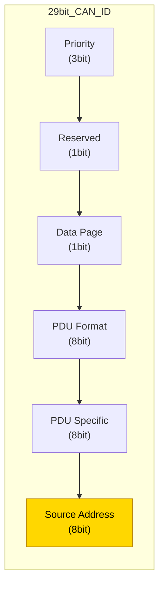
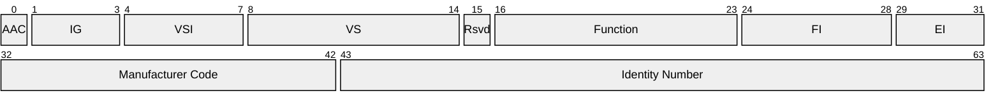
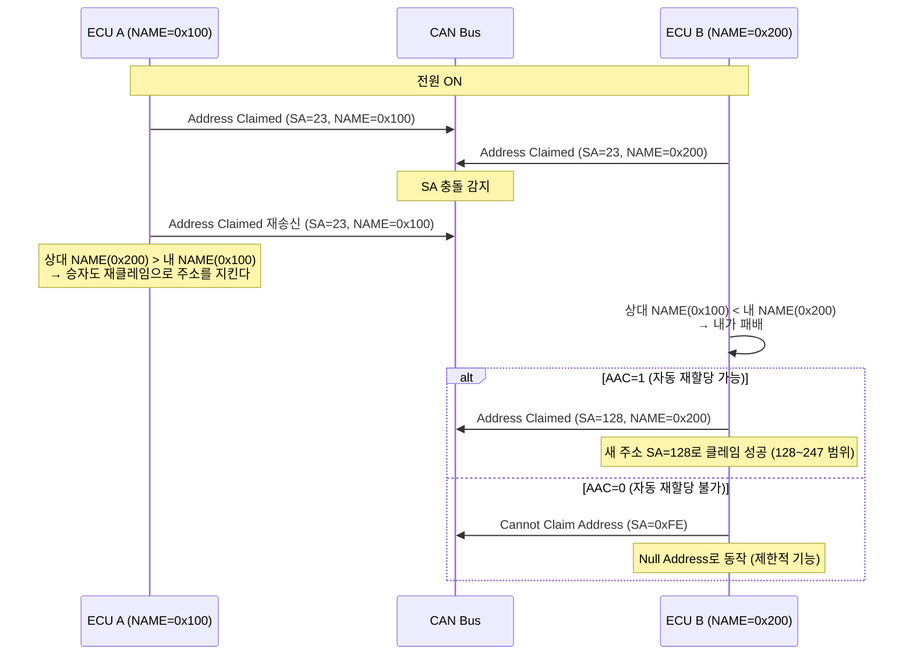
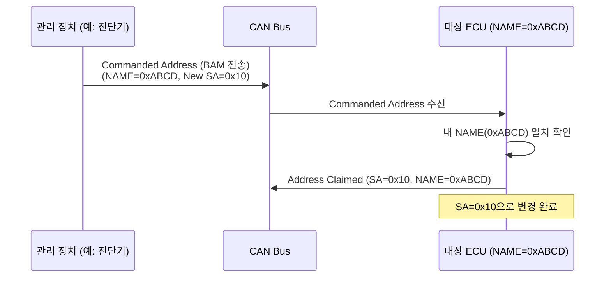

# J1939 주소 체계

::: info 학습 목표
- 소스 주소(SA)의 범위와 예약 주소의 의미를 설명할 수 있다.
- 64비트 NAME의 각 필드 구성과 역할을 이해한다.
- 주소 클레임 절차의 단계별 흐름과 충돌 해결 방식을 설명할 수 있다.
- Commanded Address(PGN 65240)의 동작 원리를 이해한다.
:::

## 1. 소스 주소 (SA)

J1939 네트워크에서 모든 ECU는 <strong>소스 주소(Source Address, SA)</strong>를 가진다. SA는 8비트 값으로, 29비트 CAN ID의 <strong>하위 8비트(비트 7~0)</strong>에 위치한다.


### SA 값 범위

| 범위 | 의미 |
|------|------|
| 0 ~ 127, 248 ~ 253 | Preferred address 영역 — 이 범위를 클레임하는 장치는 해당 주소에 정의된 기능을 실제로 수행해야 한다 |
| 128 ~ 247 | Self-configurable address 범위 — preferred address가 없거나 클레임에 실패한 장치가 사용 |
| 254 (0xFE) | Null Address — <strong>소스 주소로만</strong> 사용. 주소 클레임 전, 또는 클레임 실패 시 |
| 255 (0xFF) | Global Address — <strong>목적지 주소로만</strong> 사용 (브로드캐스트) |

### 예약된 주소 (일부)

| SA | 장치 |
|----|------|
| 0 (0x00) | Engine #1 |
| 3 (0x03) | Transmission #1 |
| 23 (0x17) | Instrument Cluster #1 |
| 33 (0x21) | Cab Controller — Primary |
| 38 (0x26) | Virtual Terminal (ISOBUS) |
| 247 (0xF7) | Task Controller (ISOBUS) |

예약(preferred) 주소는 <strong>우선권</strong>을 가지지 않는다. 주소 클레임 경쟁에서 NAME 값이 작은 쪽이 이기며, 예약 주소라도 더 작은 NAME을 가진 장치가 있으면 양보해야 한다. 기능 판단도 SA가 아니라 반드시 NAME으로 해야 한다. 참고로 <strong>ISOBUS(ISO 11783) 적합 장치는 self-configurable address 능력이 필수</strong>이며, non-configurable 장치는 J1939·구판 호환을 위해 허용될 뿐이다.


```mermaid
graph LR
    subgraph 29bit_CAN_ID
        P["Priority<br>(3bit)"]
        R["Reserved<br>(1bit)"]
        DP["Data Page<br>(1bit)"]
        PF["PDU Format<br>(8bit)"]
        PS["PDU Specific<br>(8bit)"]
        SA["Source Address<br>(8bit)"]
    end
    P --> R --> DP --> PF --> PS --> SA
    style SA fill:#ffd700,stroke:#b8860b,color:#000
```

## 2. NAME (64비트)

<strong>NAME</strong>은 J1939 네트워크에서 ECU를 전 세계적으로 고유하게 식별하는 64비트 구조체이다. 주소 클레임 시 충돌이 발생하면 NAME 값을 비교해 우선순위를 결정한다. NAME 값이 **수치적으로 더 작은** 장치가 주소를 획득한다.

### NAME 필드 구성


```mermaid
packet-beta
  0-0: "AAC"
  1-3: "IG"
  4-7: "VSI"
  8-14: "VS"
  15-15: "Rsvd"
  16-23: "Function"
  24-28: "FI"
  29-31: "EI"
  32-42: "Manufacturer Code"
  43-63: "Identity Number"
```

| 필드 | 비트 수 | 위치 (MSB 기준) | 설명 |
|------|---------|-----------------|------|
| Arbitrary Address Capable (AAC) | 1 | bit 63 | 1이면 자동 주소 재할당 가능 |
| Industry Group (IG) | 3 | bit 62~60 | 0=Global, 2=Agricultural |
| Vehicle System Instance (VSI) | 4 | bit 59~56 | 동일 시스템 여러 개 구분 |
| Vehicle System (VS) | 7 | bit 55~49 | 시스템 유형 (예: 트랙터) |
| Reserved | 1 | bit 48 | 항상 0 |
| Function (F) | 8 | bit 47~40 | 장치 기능 (예: 엔진 제어) |
| Function Instance (FI) | 5 | bit 39~35 | 동일 기능 여러 개 구분 |
| ECU Instance (EI) | 3 | bit 34~32 | 동일 장치 내 ECU 구분 |
| Manufacturer Code | 11 | bit 31~21 | 제조사 코드 (SAE J1939 등록) |
| Identity Number | 21 | bit 20~0 | 제조사 내 일련번호 |

**NAME 예시 (16진수):**

```
NAME = 0x2000000000000000
       └─────────────────┘
         Arbitrary Address Capable = 0,
         Industry Group = 2 (Agricultural equipment),
         Function = 0 (Engine),
         Manufacturer Code = 0,
         Identity Number = 0

최상위 바이트 = 0b0010_0000 = 0x20
  → AAC(1bit)=0, IG(3bit)=010(2), VSI(4bit)=0000
```

## 3. 주소 클레임 절차

J1939 장치는 네트워크에 연결되면 <strong>Address Claimed 메시지(PGN 60928, 0xEE00)</strong>를 브로드캐스트하여 주소를 선점한다. 같은 주소를 사용하려는 장치가 있으면 NAME 비교를 통해 충돌을 해결한다.

클레임에 앞서 <strong>주소 조회 시퀀스</strong>를 거치는 것이 표준 절차다. Request for Address Claimed(PGN 59904)를 Global 또는 자신의 초기 주소로 보내고, <strong>최소 250 ms + RTxD</strong>를 대기하면서 수신된 Address Claimed들로 사용 중인 주소를 파악한 뒤, 비어 있는 주소를 클레임한다. 여기서 <strong>RTxD(Random Transmit Delay)</strong>는 0~255 범위의 난수에 0.6 ms를 곱한 지연 시간으로, 여러 장치가 동시에 송신해 버스 오류를 일으키는 것을 막는다.


```mermaid
sequenceDiagram
    participant ECU_A as ECU A (NAME=0x100)
    participant BUS as CAN Bus
    participant ECU_B as ECU B (NAME=0x200)

    Note over ECU_A,ECU_B: 전원 ON

    ECU_A->>BUS: Address Claimed (SA=23, NAME=0x100)
    ECU_B->>BUS: Address Claimed (SA=23, NAME=0x200)

    Note over BUS: SA 충돌 감지

    ECU_A->>BUS: Address Claimed 재송신 (SA=23, NAME=0x100)
    Note over ECU_A: 상대 NAME(0x200) > 내 NAME(0x100)<br>→ 승자도 재클레임으로 주소를 지킨다
    ECU_B->>ECU_B: 상대 NAME(0x100) < 내 NAME(0x200)<br>→ 내가 패배

    alt AAC=1 (자동 재할당 가능)
        ECU_B->>BUS: Address Claimed (SA=128, NAME=0x200)
        Note over ECU_B: 새 주소 SA=128로 클레임 성공 (128~247 범위)
    else AAC=0 (자동 재할당 불가)
        ECU_B->>BUS: Cannot Claim Address (SA=0xFE)
        Note over ECU_B: Null Address로 동작 (제한적 기능)
    end
```

### 절차 단계 요약

1. **전원 ON** — ECU가 사용할 SA를 선택 (선호 주소 또는 저장된 초기 주소)
2. **주소 조회** — Request for Address Claimed(PGN 59904)를 보내고 250 ms + RTxD 대기하며 사용 중인 주소를 파악
3. **Address Claimed 전송** — 선택한 SA와 자신의 NAME을 PGN 60928으로 브로드캐스트
4. **충돌 감지** — 같은 SA로 다른 NAME이 수신되면 충돌
5. **NAME 비교** — 더 작은 NAME 값을 가진 장치가 해당 SA를 획득. <strong>승자도 자신의 NAME으로 Address Claimed를 재송신</strong>해 주소를 지켜야 한다
6. **패자 처리**
   - AAC=1: 128~247 범위에서 다른 SA를 선택하여 재클레임
   - AAC=0: Cannot Claim (SA=0xFE) 전송 후 수신 전용 동작 (RTxD 삽입 후 송신)

### 타이밍 규칙

| 항목 | 값 |
|------|----|
| 주소 조회(Request) 후 대기 | 최소 250 ms + RTxD |
| 클레임 성공 판정 | Address Claimed 송신 후 250 ms 동안 경합 클레임이 없어야 성공 |
| 일반 통신 시작 | 클레임 성공 후 250 ms 경과 전에는 일반 메시지 송신 금지 (Request 응답은 예외) |
| RTxD | 난수(0~255) × 0.6 ms |

## 4. Commanded Address

<strong>Commanded Address</strong>는 외부 장치가 특정 ECU에게 주소를 강제로 지정하는 메커니즘이다. <strong>PGN 65240 (0xFED8)</strong>을 사용하며, 지원 여부는 <strong>선택 사항</strong>이다.

### 메시지 구조


데이터가 9바이트라 단일 CAN 프레임(8바이트)에 담을 수 없으므로 <strong>BAM(Broadcast Announce Message) 전송 프로토콜로 Global(255)에 송신</strong>한다. 따라서 Commanded Address를 지원하는 장치는 BAM 수신도 지원해야 한다.

### 동작 방식


```mermaid
sequenceDiagram
    participant MASTER as 관리 장치 (예: 진단기)
    participant BUS as CAN Bus
    participant ECU as 대상 ECU (NAME=0xABCD)

    MASTER->>BUS: Commanded Address (BAM 전송)<br>(NAME=0xABCD, New SA=0x10)
    BUS->>ECU: Commanded Address 수신

    ECU->>ECU: 내 NAME(0xABCD) 일치 확인
    ECU->>BUS: Address Claimed (SA=0x10, NAME=0xABCD)
    Note over ECU: SA=0x10으로 변경 완료
```

### 사용 사례

| 상황 | 설명 |
|------|------|
| 공장 설정 | 제조 라인에서 장치에 고정 SA 부여 |
| 네트워크 재구성 | 시스템 통합 시 주소 충돌 사전 방지 |
| 진단/유지보수 | 특정 SA로 장치를 강제 이동 |

Commanded Address를 수락한 ECU는 명령받은 주소를 새 SA로 하는 <strong>Address Claimed 메시지를 발행</strong>해야 하며, 이때 일반 주소 클레임 요구사항이 그대로 적용된다. 수신했지만 주소를 변경할 수 없는 ECU는 <strong>현재 SA를 클레임하는 Address Claimed로 응답</strong>한다.

::: tip 핵심 정리
- SA는 8비트이며 0~127·248~253은 preferred, 128~247은 self-configurable 범위, 254=Null(소스 전용), 255=Global(목적지 전용)이다.
- SA는 29비트 CAN ID의 하위 8비트에 위치한다.
- NAME은 64비트 구조체로 장치를 전 세계적으로 고유 식별하며, **값이 작을수록 우선순위가 높다.**
- 클레임 전에 주소 조회 후 250 ms + RTxD를 대기하고, 충돌 시 NAME 비교로 승자를 결정한다. 승자도 Address Claimed를 재송신해야 한다.
- AAC=1인 장치는 충돌 패배 후 128~247 범위의 다른 주소로 자동 재클레임할 수 있다. ISOBUS 적합 장치는 이 능력이 필수다.
- Commanded Address(PGN 65240)는 외부에서 ECU의 주소를 강제 지정하는 방법이며, 9바이트 데이터라 BAM으로 전송된다.
:::

## 다음 챕터

- 다음 : [J1939 Transport Protocol](/study/isobus/11-j1939-transport)
