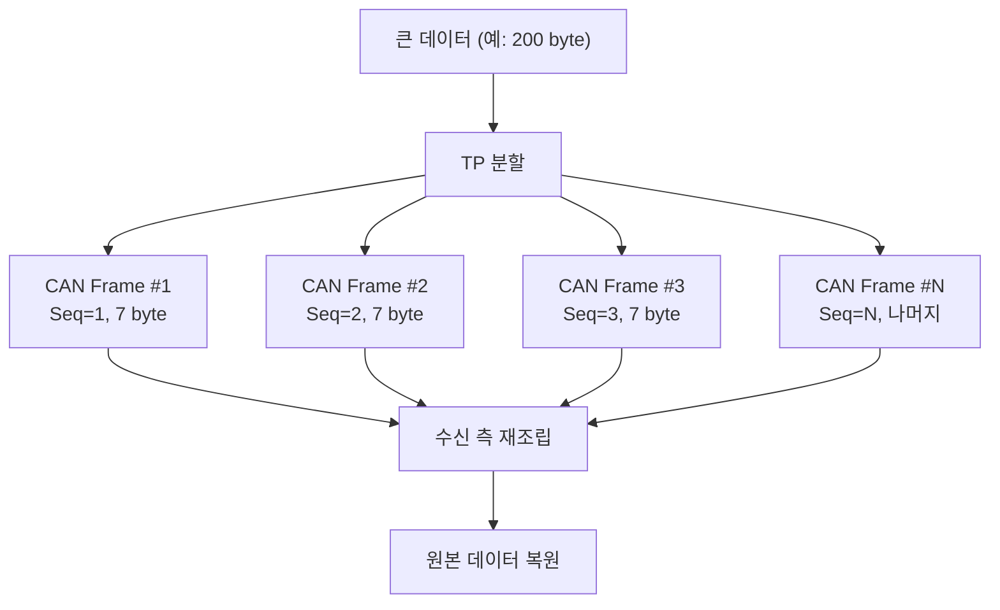
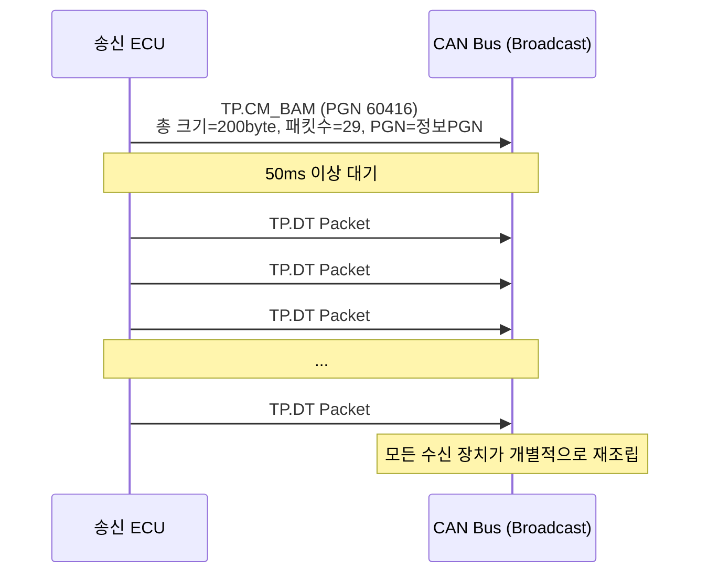
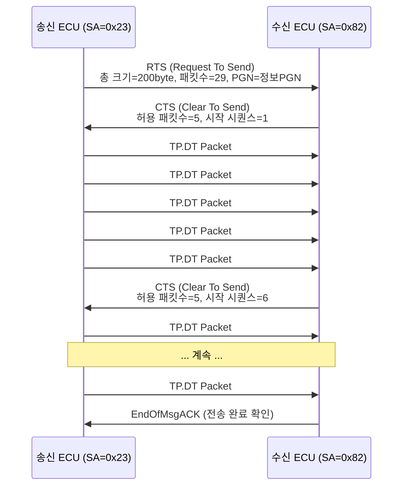
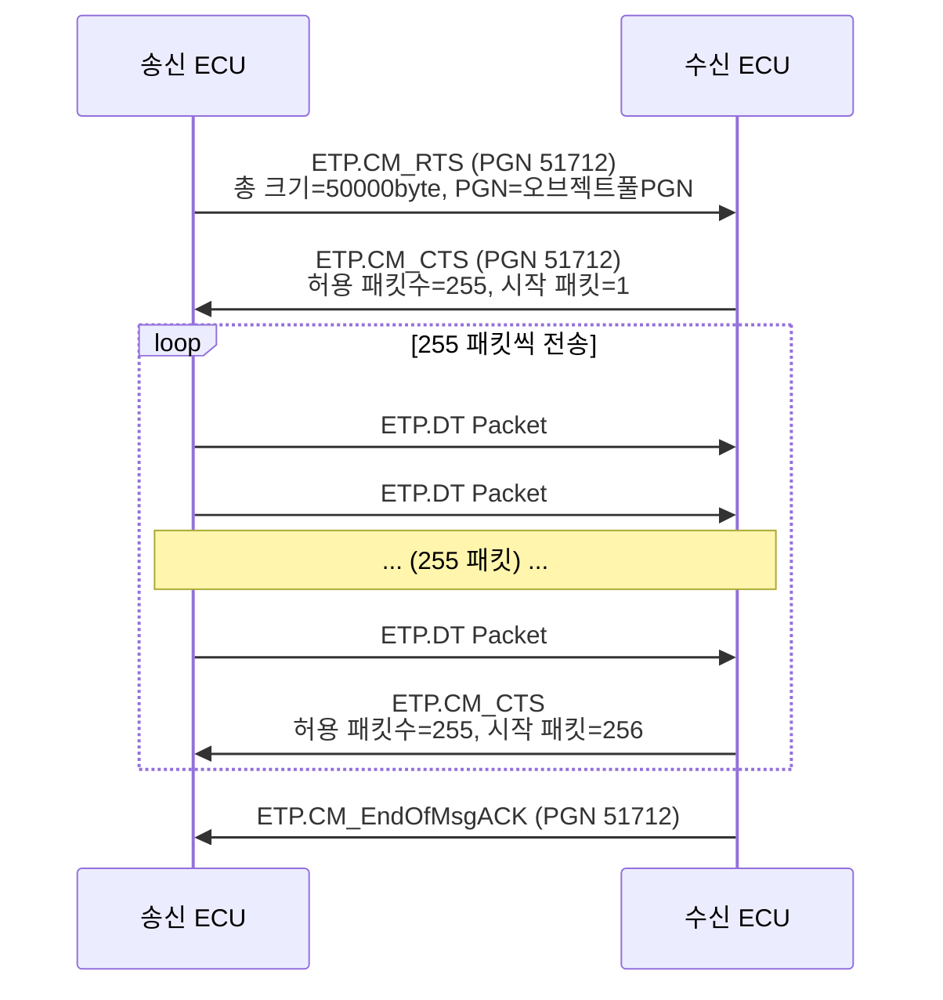
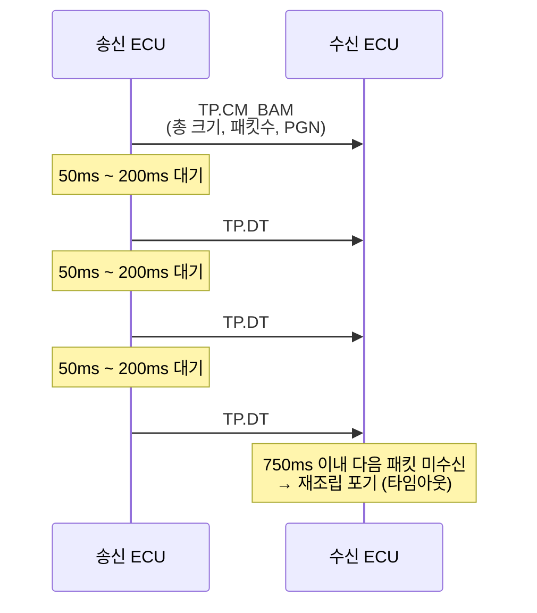
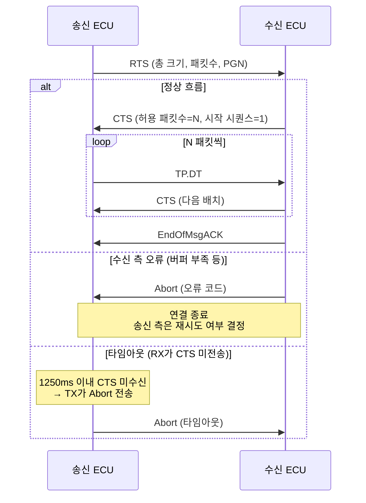

# J1939 Transport Protocol

::: info 학습 목표
- CAN 프레임의 8바이트 제한과 Transport Protocol의 필요성을 설명할 수 있다.
- BAM 방식과 CMDT 방식의 차이점과 적용 시나리오를 이해한다.
- TP.CM과 TP.DT 메시지의 역할과 PGN 번호를 안다.
- ETP가 필요한 상황과 TP와의 차이를 설명할 수 있다.
- 타임아웃 규칙을 이해하고 Abort 처리 흐름을 설명할 수 있다.
:::

---

## 1. 왜 Transport Protocol이 필요한가

CAN 프레임의 데이터 필드는 <strong>최대 8바이트</strong>이다. 단순한 센서 값이나 제어 신호는 8바이트 안에 담을 수 있지만, 다음과 같은 데이터는 그렇지 않다.

| 데이터 유형 | 일반 크기 |
|-------------|-----------|
| DM1 (진단 코드 목록) | 수십~수백 바이트 |
| VT 오브젝트 풀 (화면 정의) | 수십 KB ~ 수 MB |
| 소프트웨어 업데이트 펌웨어 | 수 KB ~ 수 MB |
| 제품 식별 정보(Product ID) | 수십 바이트 |

이런 데이터는 여러 CAN 프레임으로 **분할(segmentation)<strong> 하여 순서대로 전송해야 한다. 수신 측은 조각들을 모아 </strong>재조립(reassembly)** 한다. 이 역할을 담당하는 것이 <strong>J1939 Transport Protocol(TP)</strong>이다.



TP는 두 가지 모드를 제공한다.

- **BAM (Broadcast Announce Message)**: 1:N 브로드캐스트 전송
- **CMDT (Connection Mode Data Transfer)**: 1:1 연결 기반 전송 (흐름 제어 포함)

---

## 2. BAM (Broadcast Announce Message)

BAM은 특정 수신자를 지정하지 않고 <strong>버스 전체에 브로드캐스트</strong>하는 방식이다. 흐름 제어가 없으므로 수신자는 확인 응답(ACK)을 보내지 않다. 구현이 단순하지만 재전송이 불가능한다.

### BAM 흐름



### TP.CM_BAM 메시지 구조 (8바이트)

```
Byte 1 : Control Byte = 0x20 (BAM 식별자)
Byte 2~3: 총 데이터 크기 (Little-Endian, 최대 1785 byte)
Byte 4 : 총 패킷 수 (1~255)
Byte 5 : 0xFF (예약)
Byte 6~8: 전송할 PGN (24bit, Little-Endian)
```

### 타이밍 규칙

| 항목 | 값 |
|------|----|
| BAM 후 첫 TP.DT까지 대기 | 50ms ~ 200ms |
| TP.DT 패킷 간 간격 | 50ms ~ 200ms |
| 수신 측 타임아웃 | 750ms (패킷 미수신 시 재조립 포기) |

---

## 3. CMDT (Connection Mode Data Transfer)

CMDT는 **특정 수신자와 1:1 연결을 맺고** 흐름 제어를 포함한 데이터 전송을 수행한다. 수신자가 처리 가능한 패킷 수를 제어(CTS)할 수 있어 버퍼 오버플로를 방지한다.

### CMDT 흐름



### CMDT 제어 메시지 Control Byte 값

| 메시지 | Control Byte | 설명 |
|--------|-------------|------|
| RTS | 0x10 | 전송 요청 (총 크기, 패킷 수, PGN 포함) |
| CTS | 0x11 | 수신 준비 (허용 패킷 수, 시작 시퀀스 번호) |
| EndOfMsgACK | 0x13 | 전체 전송 완료 확인 |
| Abort | 0xFF | 연결 중단 (오류 코드 포함) |

### BAM vs CMDT 비교

| 항목 | BAM | CMDT |
|------|-----|------|
| 수신 대상 | 브로드캐스트 (전체) | 특정 장치 (1:1) |
| 흐름 제어 | 없음 | 있음 (CTS) |
| 완료 확인 | 없음 | EndOfMsgACK |
| 재전송 | 불가 | 가능 (Abort 후 재시도) |
| 최대 크기 | 1785 byte | 1785 byte |

---

## 4. TP.CM과 TP.DT

Transport Protocol은 <strong>두 가지 PGN</strong>으로 동작한다.

### TP.CM (PGN 60416, 0xEC00) — Connection Management

연결 관리를 담당한다. BAM 공지, RTS/CTS 흐름 제어, EndOfMsg, Abort 메시지가 모두 이 PGN을 사용하며, <strong>Control Byte(Byte 1)</strong>로 메시지 종류를 구분한다.

```
TP.CM 메시지 (8 byte):
┌────────────────────────────────────────────────────┐
│ Byte 1: Control Byte (0x20=BAM, 0x10=RTS, 0x11=CTS,│
│                        0x13=EndOfMsg, 0xFF=Abort)   │
│ Byte 2~8: 메시지 종류에 따라 해석 방식 다름         │
└────────────────────────────────────────────────────┘
```

### TP.DT (PGN 60160, 0xEB00) — Data Transfer

실제 데이터를 7바이트씩 분할하여 전송한다. **Byte 1은 시퀀스 번호(1~255)**, Byte 2~8이 페이로드이다. 마지막 패킷의 남는 바이트는 0xFF로 채웁니다.

```
TP.DT 메시지 (8 byte):
┌──────────────────────────────────────────┐
│ Byte 1: Sequence Number (1 ~ 255)        │
│ Byte 2: 페이로드 바이트 1                │
│ Byte 3: 페이로드 바이트 2                │
│ ...                                      │
│ Byte 8: 페이로드 바이트 7 (또는 0xFF)   │
└──────────────────────────────────────────┘
```

**예시 — 16바이트 데이터 전송:**

```
원본 데이터: [A1 A2 A3 A4 A5 A6 A7 | B1 B2 B3 B4 B5 B6 B7 | C1 C2]

TP.DT Packet #1: [01] A1 A2 A3 A4 A5 A6 A7
TP.DT Packet #2: [02] B1 B2 B3 B4 B5 B6 B7
TP.DT Packet #3: [03] C1 C2 FF FF FF FF FF  ← 남은 자리 0xFF 패딩
```

---

## 5. ETP (Extended Transport Protocol)

TP는 최대 **1785 바이트**(255 패킷 × 7 바이트)까지 전송할 수 있다. ISOBUS VT 오브젝트 풀처럼 더 큰 데이터를 전송하려면 <strong>ETP(Extended Transport Protocol)</strong>를 사용한다.

### ETP vs TP 비교

| 항목 | TP | ETP |
|------|----|-----|
| TP.CM PGN | 60416 (0xEC00) | 51712 (0xC900) |
| TP.DT PGN | 60160 (0xEB00) | 51456 (0xC800) |
| 최대 데이터 크기 | 1785 byte | 약 117 MB (2^24 - 1 byte) |
| 패킷당 데이터 | 7 byte | 7 byte |
| 연결 방식 | BAM 또는 CMDT | CMDT 전용 |

### ETP CMDT 흐름



ETP는 <strong>CMDT 전용</strong>이다. BAM 방식의 ETP는 존재하지 않다. 이는 대용량 데이터 전송 시 흐름 제어 없이는 수신 버퍼 오버플로가 발생할 수 있기 때문이다.

### ISOBUS VT 오브젝트 풀 전송

VT(Virtual Terminal)에 화면을 표시하려면 오브젝트 풀을 전송해야 한다. 오브젝트 풀은 수십 KB를 초과하는 경우가 많으므로 ETP를 통해 전송된다.

```
작업기 ECU → VT:
  ETP.CM_RTS (오브젝트 풀 PGN, 총 크기)
  → ETP.CM_CTS
  → ETP.DT × N
  → ETP.CM_EndOfMsgACK
  → Load Version / Activate Object Pool 명령
```

---

## 6. 시퀀스 다이어그램으로 보는 TP/ETP 흐름

### BAM 전체 흐름과 타임아웃



### CMDT 전체 흐름과 Abort 처리



### 타임아웃 규칙 요약

| 상황 | 타임아웃 값 | 처리 |
|------|------------|------|
| RTS 후 CTS 대기 | 1250ms | 송신 측 Abort |
| CTS 후 첫 TP.DT 대기 | 1250ms | 수신 측 Abort |
| TP.DT 패킷 간 간격 | 750ms | 수신 측 Abort |
| EndOfMsg 대기 | 1250ms | 송신 측 Abort |
| BAM TP.DT 패킷 간 | 750ms | 수신 측 재조립 포기 |

---

::: tip 핵심 정리
- CAN 프레임은 최대 8바이트이므로, 큰 데이터는 Transport Protocol로 분할 전송한다.
- **BAM**: 브로드캐스트, 흐름 제어 없음. TP.CM_BAM(PGN 60416) → TP.DT(PGN 60160).
- **CMDT**: 1:1 연결, CTS로 흐름 제어. RTS → CTS → TP.DT → EndOfMsgACK.
- TP.DT는 패킷당 7바이트 페이로드, Byte 1이 시퀀스 번호(1~255), 남는 바이트는 0xFF 패딩.
- **ETP**: 1785 바이트 초과 시 사용. PGN 51712(ETP.CM), 51456(ETP.DT). CMDT 전용.
- 타임아웃 초과 시 Abort(Control Byte=0xFF)를 전송하여 연결을 종료한다.
:::

## 다음 챕터

- 다음 : [ISOBUS 개요](/study/isobus/12-isobus-overview)
