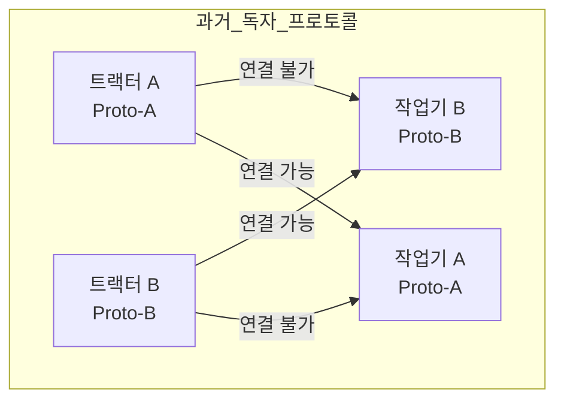
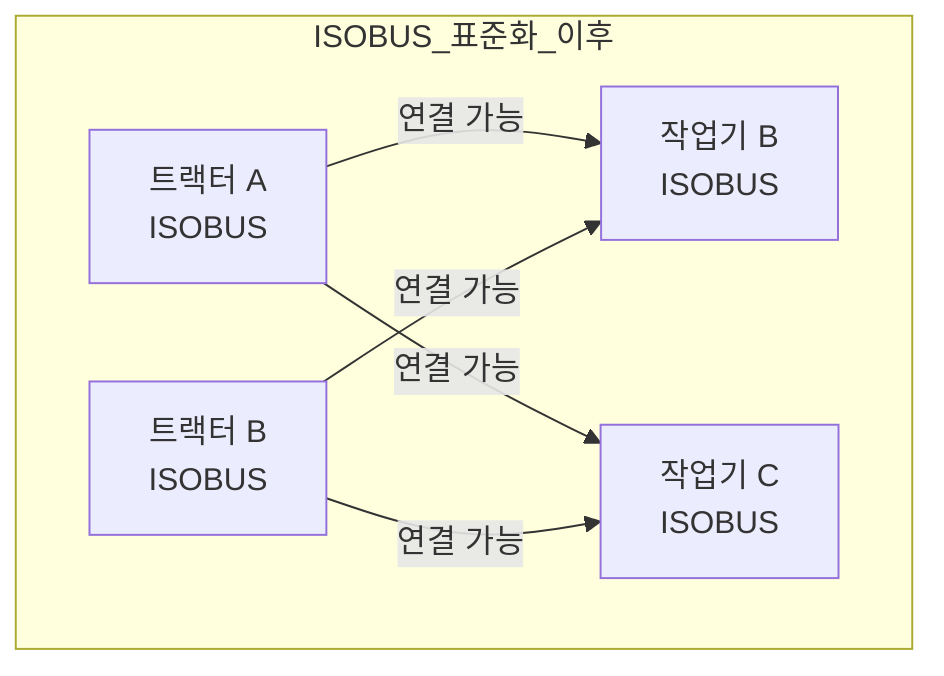
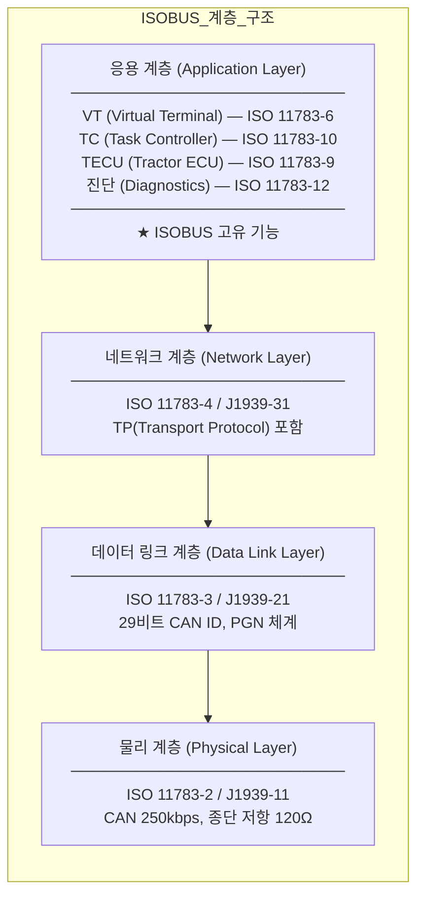

# ISOBUS (ISO 11783) 개요

## 학습 목표
- ISOBUS가 무엇이고 왜 농업 기계에 필요한지 설명할 수 있다.
- ISO 11783의 파트 구성을 알고 각 파트의 역할을 구분할 수 있다.
- J1939과 ISOBUS의 계층적 관계를 도식화할 수 있다.
- AEF와 적합성 인증의 의미를 이해한다.

---

## 1. ISOBUS란

<strong>ISOBUS</strong>는 농업·임업 기계를 위한 직렬 통신 표준이다. 공식 명칭은 다음과 같다.

> **ISO 11783 — Tractors and machinery for agriculture and forestry — Serial control and communications data network**

쉽게 말하면, 트랙터와 작업기(Implement) 사이에서 데이터를 주고받기 위한 규칙 모음이다. 속도, 엔진 RPM, GPS 위치, 작업기 상태 같은 정보를 표준화된 방식으로 교환한다.

핵심 목표는 <strong>상호운용성(Interoperability)</strong>이다. 어떤 제조사의 트랙터와 어떤 제조사의 작업기를 조합해도 동일한 방식으로 통신할 수 있어야 한다.

---

## 2. 왜 ISOBUS가 필요한가

### 과거의 문제

ISOBUS 이전에는 제조사마다 독자적인 통신 프로토콜을 사용했다. 트랙터 A의 커넥터와 작업기 B의 커넥터가 물리적으로 맞더라도, 프로토콜이 달라서 데이터를 교환할 수 없었다.

결과적으로 농민은 같은 제조사의 트랙터와 작업기만 조합할 수 있었고, 장비 구매 선택지가 크게 제한되었다.

### ISOBUS 도입 후

ISOBUS는 통신 규격을 표준화하여 제조사 간 장벽을 없앴다.

트랙터와 작업기가 모두 ISOBUS 인증을 받았다면, 제조사에 관계없이 조합이 가능한다. 농민은 최적의 장비를 자유롭게 선택할 수 있다.

---

## 3. ISO 11783 파트 구성

ISO 11783은 14개의 파트(Part)로 구성된 표준이다.

| 파트 | 제목 | 주요 내용 |
|------|------|-----------|
| Part 1 | General | 표준의 범위, 용어 정의, 전체 구조 |
| Part 2 | Physical Layer | 전기적 특성, 케이블, 커넥터 (CAN 250kbps) |
| Part 3 | Data Link Layer | 프레임 형식, CAN 기반 데이터 링크 |
| Part 4 | Network Layer | 네트워크 상호연결, 브리지 |
| Part 5 | Network Management | 주소 클레임, CF(Control Function) 관리 |
| Part 6 | Virtual Terminal | 작업기 UI를 트랙터 화면에 표시 |
| Part 7 | Implement Messages | 작업기 기능 관련 PGN 정의 |
| Part 8 | Power Train Messages | 엔진·변속기 관련 PGN 정의 |
| Part 9 | Tractor ECU | 트랙터 정보(속도, PTO, 히치) 제공 ECU |
| Part 10 | Task Controller | 작업 계획·기록, 정밀 농업 |
| Part 11 | Mobile Data Element | 데이터 사전(Data Dictionary) |
| Part 12 | Diagnostics | 진단 메시지(DM), 고장 코드 |
| Part 13 | File Server | ECU 간 파일 전송 |
| Part 14 | Sequence Control | 작업 순서 자동화 |

---

## 4. J1939과 ISOBUS의 관계

ISOBUS는 SAE J1939을 기반으로 농업 기계에 맞게 <strong>확장</strong>한 표준이다. 프로토콜 계층 관점에서 살펴보면 다음과 같다.

정리하면:
- **물리·데이터링크·네트워크 계층**: J1939과 동일한 기반 사용
- **응용 계층**: VT, TC, TECU 등 ISOBUS 고유 기능이 추가됨

J1939을 이해했다면 ISOBUS의 하위 계층은 이미 알고 있는 것과 다름없다. ISOBUS 학습은 응용 계층의 고유 기능에 집중한다.

---

## 5. ISOBUS 생태계

### AEF (Agricultural Industry Electronics Foundation)

AEF는 ISOBUS의 실질적 표준화를 이끄는 국제 단체이다. ISO 표준은 문서 수준의 규격이지만, AEF는 실제 장비 간 상호운용성을 보장하기 위한 활동을 한다.

- **AEF Conformance Test**: 제조사가 장비를 ISOBUS 적합성 테스트에 제출
- **ISOBUS 인증 마크**: 테스트를 통과한 장비에 부여. 인증 마크가 있으면 상호운용성 보장
- **AEF Database**: 인증된 제품 목록 공개, 농민이 조합 가능한 장비 확인 가능

### 주요 참여 제조사

John Deere, AGCO, CNH Industrial(케이스·뉴홀랜드), CLAAS, Fendt, Kverneland, Amazone, Horsch 등 전 세계 주요 농기계 제조사가 AEF 멤버로 참여하고 있다.

---

> **핵심 정리**
> - ISOBUS(ISO 11783)는 트랙터-작업기 간 통신을 표준화한 농업 전용 프로토콜이다.
> - J1939을 기반으로 하되, 응용 계층(VT, TC, TECU)이 ISOBUS 고유의 핵심 기능이다.
> - ISO 11783은 14개 파트로 구성되며, Part 6(VT)과 Part 10(TC)이 가장 핵심적이다.
> - AEF 적합성 인증을 통과한 장비끼리는 제조사에 관계없이 상호운용이 가능하다.

---

## 다음 챕터

[ISOBUS 네트워크 아키텍처](/study/isobus/13-isobus-architecture)으로 이어진다.
