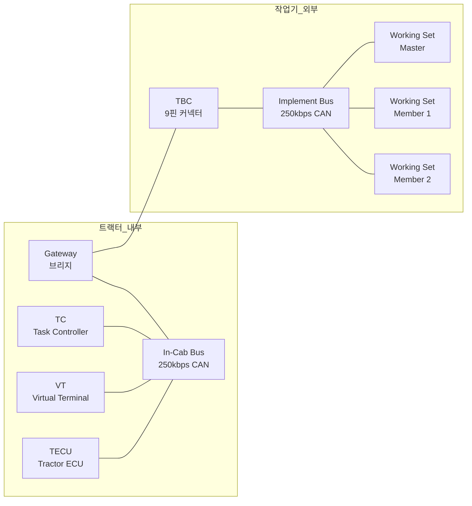
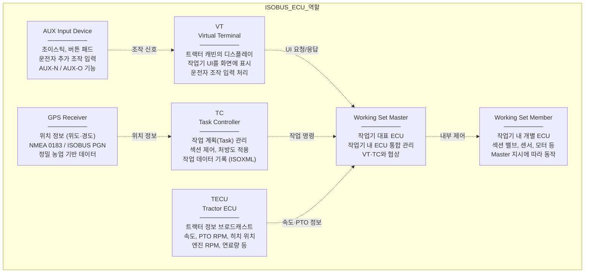
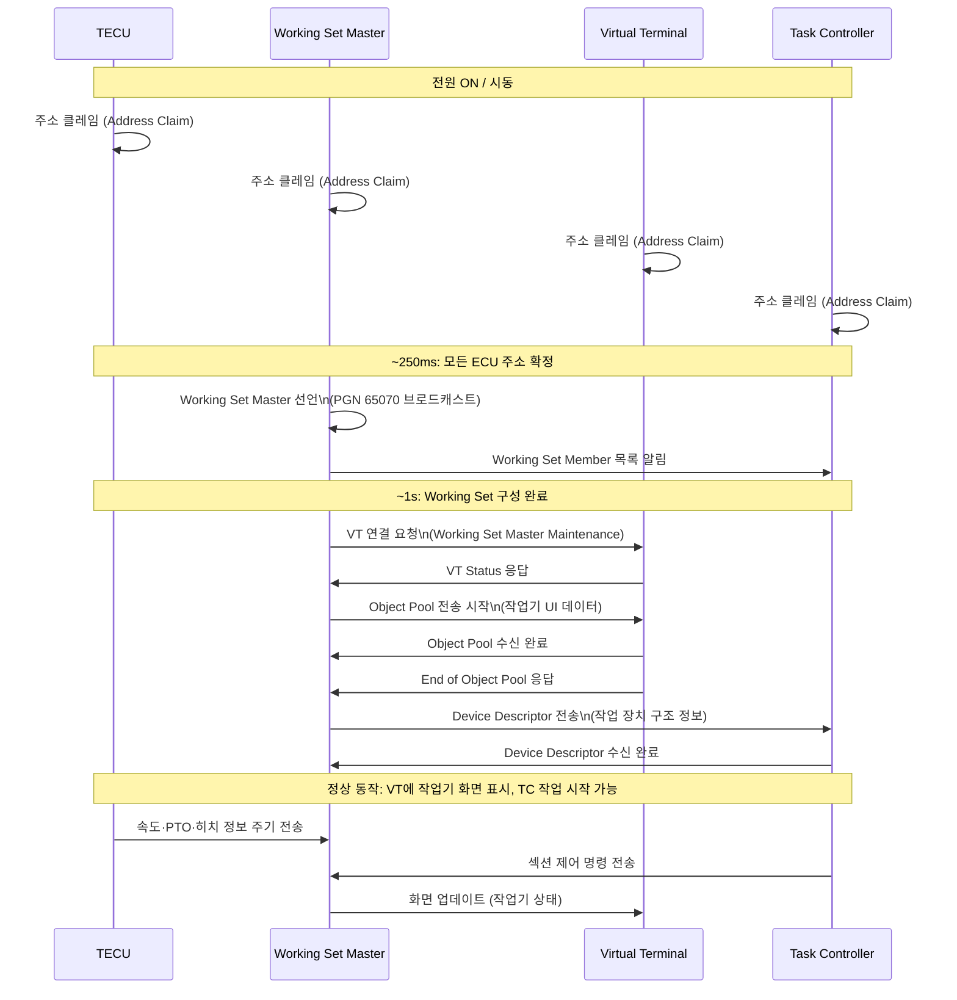

# ISOBUS 네트워크 아키텍처

## 학습 목표
- ISOBUS 네트워크가 In-Cab 버스와 Implement 버스로 구분되는 이유를 설명할 수 있다.
- TBC(Tractor Bus Connector)의 역할과 핀 구성을 이해한다.
- ISOBUS 상의 주요 ECU 종류와 각 역할을 구분할 수 있다.
- 장비 시동 후 ISOBUS 통신이 확립되기까지의 메시지 흐름을 순서대로 설명할 수 있다.

---

## 1. 네트워크 토폴로지

ISOBUS 네트워크는 물리적으로 두 개의 CAN 버스로 구성된다.

- **In-Cab 버스**: 트랙터 내부 ECU들이 연결되는 버스
- **Implement 버스**: 트랙터 외부에 연결되는 작업기 ECU들이 연결되는 버스

두 버스는 <strong>TBC(Tractor Bus Connector)</strong>를 통해 연결된다.

두 버스를 분리하는 이유는 <strong>전기적 안전성</strong>과 <strong>버스 부하 분산</strong>이다. 작업기를 탈착할 때 발생하는 전기적 충격이 트랙터 내부 버스에 영향을 주지 않도록 격리한다.

---

## 2. TBC (Tractor Bus Connector)

TBC는 트랙터와 작업기를 물리적으로 연결하는 9핀 커넥터이다. ISO 11783-2에 정의되어 있다.

### 9핀 커넥터 핀 배치

| 핀 번호 | 신호명 | 설명 |
|---------|--------|------|
| 핀 A | Shield | 차폐선 |
| 핀 B | In-Cab CAN_H | 트랙터 내부 버스 High |
| 핀 C | In-Cab CAN_L | 트랙터 내부 버스 Low |
| 핀 D | ECU_PWR_A | 작업기 ECU 전원 (12V/24V) |
| 핀 E | GND | 접지 |
| 핀 F | Implement CAN_H | 작업기 버스 High |
| 핀 G | Implement CAN_L | 작업기 버스 Low |
| 핀 H | In-Cab PWR | 트랙터 캐빈 전원 |
| 핀 J | ECU_PWR_B | 작업기 ECU 전원 보조 |

### 전원 공급 구조

트랙터는 TBC를 통해 작업기 ECU에 전원을 공급한다. ECU_PWR 핀을 통해 작업기의 ECU와 센서가 동작에 필요한 전력을 받다. 작업기 자체 전원(배터리)이 없어도 트랙터에 연결하면 즉시 동작 가능한다.

---

## 3. ECU 종류

ISOBUS 네트워크 위에는 역할별로 명확히 구분된 ECU들이 존재한다.

### 각 ECU의 핵심 역할 요약

| ECU | 위치 | 핵심 역할 |
|-----|------|-----------|
| VT (Virtual Terminal) | 트랙터 내부 | 작업기 화면 표시, 운전자 UI |
| TC (Task Controller) | 트랙터 내부 | 작업 계획·기록, 섹션 제어 |
| TECU (Tractor ECU) | 트랙터 내부 | 트랙터 상태 정보 제공 |
| GPS Receiver | 트랙터 내부 | 위치 정보 제공 |
| AUX Input Device | 트랙터 내부 | 추가 조작 입력 |
| Working Set Master | 작업기 | 작업기 대표, VT·TC와 통신 |
| Working Set Member | 작업기 | 작업기 내부 개별 제어 |

---

## 4. 네트워크 메시지 흐름

트랙터에 작업기를 연결하고 시동을 켠 후, ISOBUS 통신이 확립되기까지 일련의 단계가 순서대로 진행된다.

각 단계의 의미:

1. **주소 클레임**: 모든 ECU가 네트워크에서 고유한 주소를 확보한다 (J1939 방식과 동일).
2. **Working Set 구성**: 작업기를 대표하는 WSM이 자신과 멤버 ECU를 선언한다.
3. **VT 연결**: WSM이 VT에 연결을 요청하고 상태를 수신한다.
4. **Object Pool 전송**: 작업기 UI 화면 데이터를 VT에 업로드한다.
5. **Device Descriptor 전송**: 작업기의 기능 구조를 TC에 알립니다.
6. **정상 동작**: TECU 정보·TC 명령·VT 화면 업데이트가 주기적으로 이루어집니다.

---

> **핵심 정리**
> - ISOBUS 네트워크는 In-Cab 버스와 Implement 버스로 분리되며, TBC 9핀 커넥터로 연결된다.
> - VT는 화면, TC는 작업 관리, TECU는 트랙터 정보 제공, WSM은 작업기 대표 역할을 한다.
> - 시동 후 주소 클레임 → Working Set 구성 → VT 연결 → Object Pool 전송 순으로 통신이 확립된다.
> - Object Pool은 작업기 UI를 정의하는 데이터로, WSM이 VT에 전송하여 화면을 구성한다.

---

## 다음 챕터

[ISOBUS 네트워크 관리](/study/isobus/14-isobus-network-mgmt)으로 이어진다.
