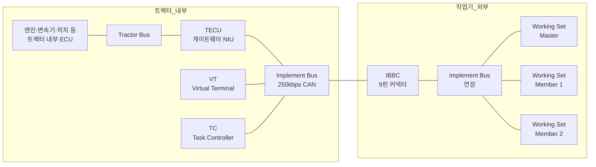
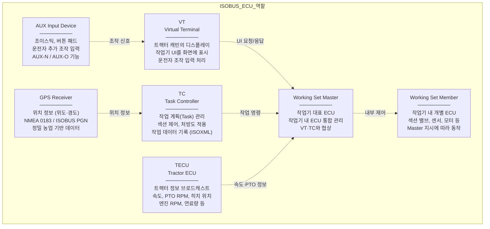
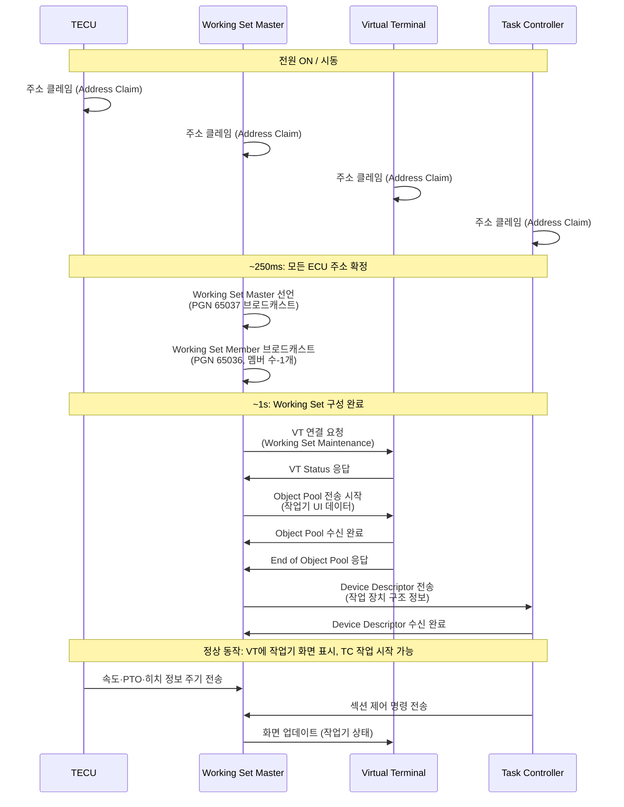

# ISOBUS 네트워크 아키텍처

::: info 학습 목표
- ISOBUS 네트워크가 트랙터 버스와 Implement 버스로 구분되는 이유와, 두 버스를 TECU가 연결하는 구조를 설명할 수 있다.
- IBBC(9핀 브레이크어웨이 커넥터)와 TBC(종단 바이어스 회로)의 역할을 구분할 수 있다.
- ISOBUS 상의 주요 ECU 종류와 각 역할을 구분할 수 있다.
- 장비 시동 후 ISOBUS 통신이 확립되기까지의 메시지 흐름을 순서대로 설명할 수 있다.
:::

## 1. 네트워크 토폴로지

ISOBUS 네트워크는 물리적으로 두 개의 네트워크 세그먼트로 구성된다.

- **트랙터 버스**(tractor network): 엔진, 변속기, 브레이크, 히치 컨트롤러 등 트랙터 구동계·섀시 ECU들이 연결되는 버스. 트랙터 제조사가 관리하며 내부 규격(J1939 등)을 쓸 수도 있다.
- **Implement 버스**(implement network): VT, TC, 작업기 ECU 등 작업기 관련 CF들이 연결되는 버스. 트랙터 위와 작업기 위에 걸쳐 존재하며 ISO 11783을 반드시 준수해야 한다.

두 버스는 <strong>TECU(Tractor ECU)</strong>가 연결한다. TECU는 두 세그먼트 사이의 게이트웨이 역할을 하는 특수 NIU(Network Interconnection Unit)다. VT와 TC는 물리적으로 트랙터 캐빈에 장착되지만 <strong>버스 소속은 Implement 버스</strong>이며, 외부 작업기는 <strong>IBBC(Implement Bus Breakaway Connector)</strong>를 통해 Implement 버스에 이어진다.

```mermaid
graph LR
    subgraph 트랙터_내부
        ENG[엔진·변속기·히치 등<br>트랙터 내부 ECU]
        ENG --- TracBus[Tractor Bus]
        TracBus --- TECU[TECU<br>게이트웨이 NIU]
        TECU --- ImplBus[Implement Bus<br>250kbps CAN]
        VT[VT<br>Virtual Terminal] --- ImplBus
        TC[TC<br>Task Controller] --- ImplBus
    end

    ImplBus --- IBBC[IBBC<br>9핀 커넥터]

    subgraph 작업기_외부
        IBBC --- ImplBus2[Implement Bus<br>연장]
        WSM[Working Set<br>Master]
        WSMem[Working Set<br>Member 1]
        WSMem2[Working Set<br>Member 2]
        ImplBus2 --- WSM
        ImplBus2 --- WSMem
        ImplBus2 --- WSMem2
    end
```

두 버스를 분리하는 이유는 <strong>트랙터 버스의 격리·보호</strong>다. TECU는 두 세그먼트 사이에서 전기적 격리와 메시지 격리(필터링)를 모두 제공해야 하며, 덕분에 외부 작업기의 전기적 문제나 과도한 트래픽이 트랙터 구동계 버스에 영향을 주지 않는다.

::: tip NIU의 다섯 가지 유형 (Part 4)
세그먼트를 연결하는 NIU에는 기능 수준에 따라 리피터(단순 forwarding), 브리지(+ 필터링), 라우터(+ 주소 변환), 게이트웨이(+ 메시지 재조합)가 있고, 트랙터 버스와 Implement 버스를 잇는 <strong>Tractor ECU</strong>가 다섯 번째 특수 유형으로 정의된다. 작업기 내부에 하위 네트워크를 둘 때도 NIU로 Implement 버스와 격리한다.
:::

## 2. IBBC 커넥터와 TBC 종단

<strong>IBBC(Implement Bus Breakaway Connector)</strong>는 트랙터와 작업기의 Implement 버스를 물리적으로 연결하는 9핀 커넥터이다. ISO 11783-2에 정의되어 있으며, 작업기가 분리(breakaway)되어도 트랙터 측 버스가 안전하게 유지되도록 설계된다.

<strong>TBC(Terminating Bias Circuit)</strong>는 커넥터가 아니라 <strong>종단 바이어스 회로</strong>다. 네트워크 세그먼트 양 끝단에 두어 CAN_H·CAN_L에 바이어스 전압과 공통 모드 임피던스 종단을 제공하는 능동 종단으로, 단순 120Ω 저항 종단(J1939-11)과 구별된다.

### 9핀 커넥터 신호 구성

IBBC의 9개 신호는 세 그룹으로 나뉜다.

| 그룹 | 신호 | 설명 |
|------|------|------|
| CAN | CAN_H, CAN_L | Implement 버스 신호선 1쌍 (트랙터 내부 버스는 커넥터를 지나지 않는다) |
| 전원 | PWR, GND, ECU_PWR, ECU_GND | 액추에이터용 전원(PWR)과 ECU 전자회로용 전원(ECU_PWR), 각각의 접지 |
| 종단 제어 | TBC_PWR, TBC_RTN, TBC_DIS | 종단 바이어스 회로(TBC)의 전원·리턴·비활성화 신호 |

### 전원 공급 구조

트랙터는 IBBC를 통해 작업기에 전원을 공급한다. 전원은 용도별로 두 계열로 나뉜다.

- <strong>ECU_PWR</strong>: 작업기 ECU·센서 등 전자회로용 전원 (12V 기준 최소 15A)
- <strong>PWR</strong>: 밸브·모터 등 액추에이터용 전원 (12V 기준 최소 50A)

두 전원의 분배 제어와 상태 메시지 송수신은 TECU(function instance 0)가 책임진다(ISO 11783-9). TBC_PWR은 ECU_PWR 또는 TECU 자체에서 급전되어, ECU 전원이 제어되는 상황에서도 버스 종단이 살아 있도록 한다. 작업기 자체 전원(배터리)이 없어도 트랙터에 연결하면 즉시 동작 가능하다.

## 3. ECU 종류

ISOBUS 네트워크 위에는 역할별로 명확히 구분된 ECU들이 존재한다.

```mermaid
graph TB
    subgraph ISOBUS_ECU_역할
        VT["VT<br>Virtual Terminal<br>─────────<br>트랙터 캐빈의 디스플레이<br>작업기 UI를 화면에 표시<br>운전자 조작 입력 처리"]
        TC["TC<br>Task Controller<br>─────────<br>작업 계획(Task) 관리<br>섹션 제어, 처방도 적용<br>작업 데이터 기록 (ISOXML)"]
        TECU["TECU<br>Tractor ECU<br>─────────<br>트랙터 정보 브로드캐스트<br>속도, PTO RPM, 히치 위치<br>엔진 RPM, 연료량 등"]
        GPS["GPS Receiver<br>─────────<br>위치 정보 (위도·경도)<br>NMEA 0183 / ISOBUS PGN<br>정밀 농업 기반 데이터"]
        AUX["AUX Input Device<br>─────────<br>조이스틱, 버튼 패드<br>운전자 추가 조작 입력<br>AUX-N / AUX-O 기능"]
        WSM["Working Set Master<br>─────────<br>작업기 대표 ECU<br>작업기 내 ECU 통합 관리<br>VT·TC와 협상"]
        WSMem["Working Set Member<br>─────────<br>작업기 내 개별 ECU<br>섹션 밸브, 센서, 모터 등<br>Master 지시에 따라 동작"]

        VT -. "UI 요청/응답" .-> WSM
        TC -. "작업 명령" .-> WSM
        TECU -. "속도·PTO 정보" .-> WSM
        GPS -. "위치 정보" .-> TC
        AUX -. "조작 신호" .-> VT
        WSM -. "내부 제어" .-> WSMem
    end
```

### 각 ECU의 핵심 역할 요약

| ECU | 버스 소속 | 핵심 역할 |
|-----|------|-----------|
| VT (Virtual Terminal) | Implement 버스 (캐빈 장착) | 작업기 화면 표시, 운전자 UI |
| TC (Task Controller) | Implement 버스 (캐빈 장착) | 작업 계획·기록, 섹션 제어 |
| TECU (Tractor ECU) | 트랙터 버스 ↔ Implement 버스 | 두 버스 연결(게이트웨이), 트랙터 상태 정보 제공 |
| GPS Receiver | Implement 버스 | 위치 정보 제공 |
| AUX Input Device | Implement 버스 | 추가 조작 입력 |
| Working Set Master | Implement 버스 (작업기) | 작업기 대표, VT·TC와 통신 |
| Working Set Member | Implement 버스 (작업기) | 작업기 내부 개별 제어 |

### TECU 클래스

ISO 11783-9는 TECU가 Implement 버스에 제공해야 하는 최소 메시지 집합을 <strong>클래스</strong>로 구분한다.

| 클래스 | 의미 |
|--------|------|
| Class 1 | 기본 측정값 제공 (속도, 히치 위치, PTO 회전수 등. 신규 설계에는 비권장) |
| Class 2 | 측정 기능 전체 제공 (Class 1 + 주행 거리·방향, 견인력, 조명, 밸브 유량) |
| Class 3 | Implement 버스로부터의 제어 명령 수용 (히치·PTO·보조 밸브 명령) |

여기에 기능별 addendum이 붙는다: <strong>N</strong>(항법/GPS), <strong>F</strong>(전방 히치·PTO), <strong>G</strong>(조향 제어), <strong>P</strong>(속도·주행 전략 명령), <strong>M</strong>(발진 명령). 예를 들어 class 3GP는 조향과 속도 제어를 모두 수용하는 트랙터다. 작업기가 트랙터를 제어하는 자동화(가변 속도 작업, 자동 조향 등)는 Class 3 이상에서 가능하다.

## 4. 네트워크 메시지 흐름

트랙터에 작업기를 연결하고 시동을 켠 후, ISOBUS 통신이 확립되기까지 일련의 단계가 순서대로 진행된다.

```mermaid
sequenceDiagram
    participant TECU as TECU
    participant WSM as Working Set Master
    participant VT as Virtual Terminal
    participant TC as Task Controller

    Note over TECU,TC: 전원 ON / 시동

    TECU->>TECU: 주소 클레임 (Address Claim)
    WSM->>WSM: 주소 클레임 (Address Claim)
    VT->>VT: 주소 클레임 (Address Claim)
    TC->>TC: 주소 클레임 (Address Claim)

    Note over TECU,TC: ~250ms: 모든 ECU 주소 확정

    WSM->>WSM: Working Set Master 선언<br>(PGN 65037 브로드캐스트)
    WSM->>WSM: Working Set Member 브로드캐스트<br>(PGN 65036, 멤버 수-1개)

    Note over TECU,TC: ~1s: Working Set 구성 완료

    WSM->>VT: VT 연결 요청<br>(Working Set Maintenance)
    VT->>WSM: VT Status 응답

    WSM->>VT: Object Pool 전송 시작<br>(작업기 UI 데이터)
    VT->>WSM: Object Pool 수신 완료
    VT->>WSM: End of Object Pool 응답

    WSM->>TC: Device Descriptor 전송<br>(작업 장치 구조 정보)
    TC->>WSM: Device Descriptor 수신 완료

    Note over TECU,TC: 정상 동작: VT에 작업기 화면 표시, TC 작업 시작 가능

    TECU->>WSM: 속도·PTO·히치 정보 주기 전송
    TC->>WSM: 섹션 제어 명령 전송
    WSM->>VT: 화면 업데이트 (작업기 상태)
```

각 단계의 의미:

1. **주소 클레임**: 모든 ECU가 네트워크에서 고유한 주소를 확보한다 (J1939 방식과 동일).
2. **Working Set 구성**: 작업기를 대표하는 WSM이 Working Set Master 메시지(PGN 65037)로 멤버 수를, Working Set Member 메시지(PGN 65036)로 각 멤버의 NAME을 브로드캐스트한다. VT·TC 같은 서비스 제공자가 이를 수신해 Working Set을 인식한다.
3. **VT 연결**: WSM이 VT에 연결을 요청하고 상태를 수신한다.
4. **Object Pool 전송**: 작업기 UI 화면 데이터를 VT에 업로드한다.
5. **Device Descriptor 전송**: 작업기의 기능 구조를 TC에 알린다.
6. **정상 동작**: TECU 정보·TC 명령·VT 화면 업데이트가 주기적으로 이루어진다.

> **핵심 정리**
> - ISOBUS 네트워크는 트랙터 버스와 Implement 버스로 분리되며, 두 버스는 TECU(게이트웨이 NIU)가 연결한다. 외부 작업기는 IBBC 9핀 커넥터로 Implement 버스에 접속하고, 각 세그먼트 양 끝단은 TBC(종단 바이어스 회로)로 종단한다.
> - VT는 화면, TC는 작업 관리, TECU는 버스 연결과 트랙터 정보 제공, WSM은 작업기 대표 역할을 한다.
> - 시동 후 주소 클레임 → Working Set 구성 → VT 연결 → Object Pool 전송 순으로 통신이 확립된다.
> - Object Pool은 작업기 UI를 정의하는 데이터로, WSM이 VT에 전송하여 화면을 구성한다.

## 다음 챕터

- 다음 : [ISOBUS 네트워크 관리](/study/isobus/14-isobus-network-mgmt)
