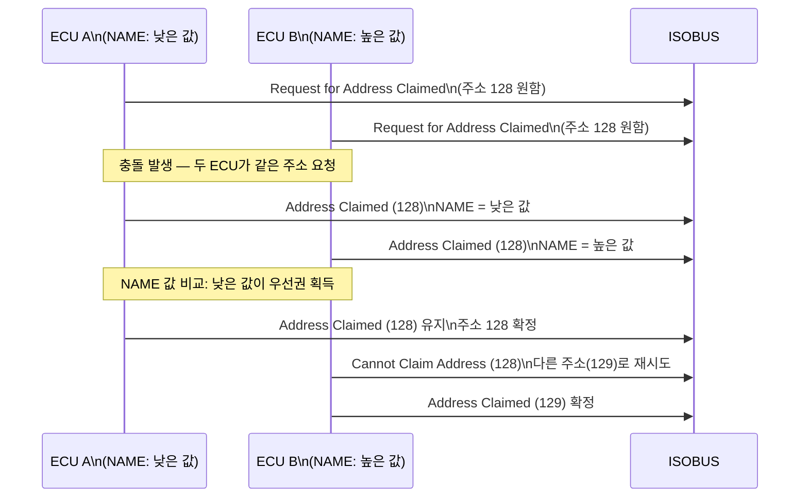
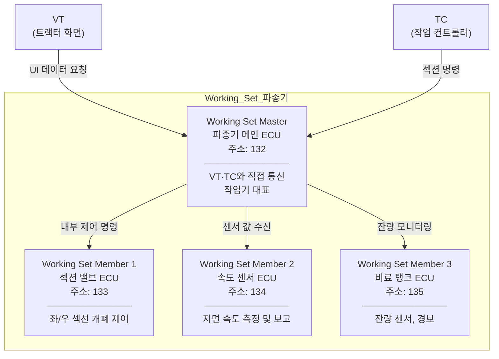
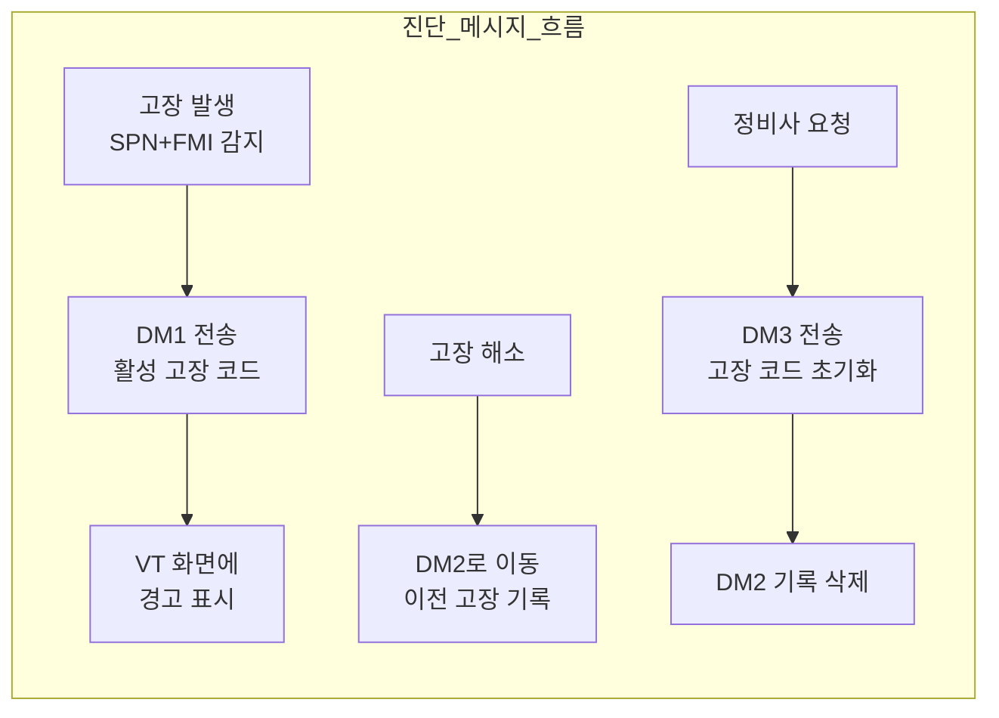
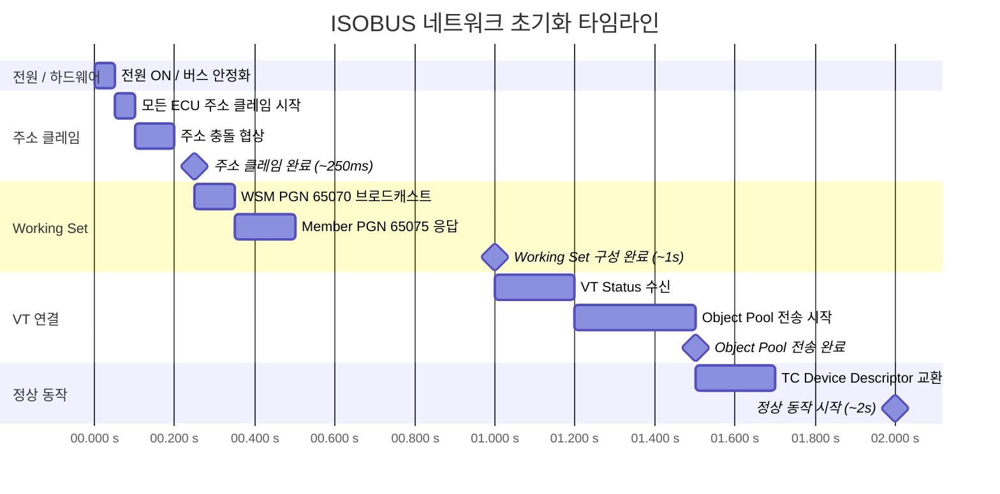

# ISOBUS 네트워크 관리

## 학습 목표
- ISOBUS의 주소 클레임 방식과 CF(Control Function) 개념을 설명할 수 있다.
- Working Set Master와 Member의 관계를 도식으로 이해한다.
- DM1~DM3 진단 메시지의 역할과 SPN+FMI 조합을 구분할 수 있다.
- 전원 ON부터 통신 완료까지의 시간 흐름을 설명할 수 있다.

---

## 1. 주소 클레임 (ISOBUS 방식)

ISOBUS의 주소 클레임은 J1939의 방식을 기반으로 하되, 농업 기계에 맞게 확장된 규칙을 적용한다.

### CF (Control Function)

ISOBUS에서는 네트워크에 참여하는 모든 장치를 <strong>CF(Control Function)</strong>라고 부릅니다. 하나의 물리적 ECU가 여러 CF를 포함할 수도 있다. 각 CF는 독립적인 주소를 가집니다.

### 주소 범위

| 주소 범위 | 용도 |
|-----------|------|
| 0 ~ 127 | 고정 주소 (특정 기능에 예약) |
| 128 ~ 247 | **Self-Configurable 주소** (동적 협상) |
| 248 ~ 253 | 산업별 예약 |
| 254 | Null Address (주소 미확정 상태) |
| 255 | Global Address (브로드캐스트) |

ISOBUS 작업기 ECU는 대부분 **128~247** 범위의 Self-Configurable 주소를 사용한다. 이 범위의 주소는 여러 장치가 동시에 원할 경우 NAME 값의 우선순위로 자동 협상된다.

### 주소 클레임 흐름

---

## 2. Working Set

작업기(Implement)는 내부에 여러 ECU를 포함할 수 있다. 예를 들어 파종기(Seeder)는 메인 제어 ECU, 섹션 밸브 ECU, 속도 센서 ECU를 각각 가질 수 있다. 이 ECU들을 하나의 논리적 단위로 묶는 것이 <strong>Working Set</strong>이다.

### 마스터-멤버 관계

### Working Set 선언 메시지 (PGN 65070)

WSM은 네트워크에 참여한 후 <strong>PGN 65070 (Working Set Master)</strong>를 브로드캐스트하여 자신이 마스터임을 선언한다. 이 메시지에는 Working Set에 속한 멤버 수가 포함된다.

멤버 ECU들은 <strong>PGN 65075 (Working Set Member)</strong>를 전송하여 자신이 특정 마스터에 속함을 알립니다.

VT와 TC는 이 메시지를 수신하여 작업기의 구조를 파악하고, WSM을 통해서만 작업기와 통신한다.

---

## 3. 진단 메시지

ISOBUS는 ISO 11783-12를 통해 표준화된 진단 메시지를 정의한다. J1939의 진단 메시지 체계를 그대로 사용한다.

### 고장 코드 구조: SPN + FMI

모든 고장은 <strong>SPN(Suspect Parameter Number)</strong>과 <strong>FMI(Failure Mode Identifier)</strong>의 조합으로 식별한다.

- **SPN**: 어떤 파라미터에 문제가 생겼는지 (예: SPN 100 = 엔진 오일 압력)
- **FMI**: 어떤 종류의 고장인지 (예: FMI 1 = 데이터 낮음, FMI 3 = 전압 높음)

### 주요 진단 메시지

| 메시지 | PGN | 이름 | 설명 |
|--------|-----|------|------|
| DM1 | 65226 | Active Diagnostic Troubles | 현재 발생 중인 활성 고장 코드 목록 |
| DM2 | 65227 | Previously Active Diagnostics | 이전에 발생했다가 해소된 고장 코드 |
| DM3 | 65228 | Diagnostic Data Clear | 저장된 고장 코드 초기화 요청 |

### FMI 주요 값

| FMI | 의미 |
|-----|------|
| 0 | 데이터 유효 범위 초과 (높음) |
| 1 | 데이터 유효 범위 초과 (낮음) |
| 2 | 데이터 불안정 / 간헐적 |
| 3 | 전압 높음 / 단락 (High) |
| 4 | 전압 낮음 / 단락 (Low) |
| 5 | 전류 낮음 / 단선 |
| 6 | 전류 높음 / 단락 (GND) |
| 12 | 고장 모드 불명확 |
| 19 | 수신 네트워크 데이터 오류 |

---

## 4. 네트워크 관리 타임라인

전원을 켠 순간부터 ISOBUS 통신이 완전히 확립될 때까지의 시간 흐름이다.

### 타임라인 요약

| 시점 | 이벤트 |
|------|--------|
| 0 ms | 전원 ON, 버스 전압 안정화 |
| ~50 ms | 각 ECU 주소 클레임 시작 |
| ~250 ms | 모든 ECU 주소 확정 완료 |
| ~250 ms | WSM Working Set 선언 (PGN 65070) |
| ~1,000 ms | Working Set 구성 완료 |
| ~1,000 ms | VT Status 수신 시작 |
| ~1,500 ms | Object Pool 전송 완료, 화면 표시 시작 |
| ~2,000 ms | TC Device Descriptor 완료, 전체 통신 확립 |

> **실제 현장에서의 차이**: Object Pool 크기, ECU 수, 버스 부하에 따라 타임라인은 달라집니다. 복잡한 작업기의 경우 Object Pool 전송만 수 초가 걸릴 수 있다.

---

> **핵심 정리**
> - ISOBUS에서 ECU는 CF(Control Function)라 불리며, Self-Configurable 주소(128~247)를 NAME 우선순위로 동적 협상한다.
> - Working Set은 작업기 내 여러 ECU를 하나의 논리 단위로 묶으며, WSM이 VT·TC와의 모든 통신을 대표한다.
> - DM1은 현재 활성 고장, DM2는 이전 고장 이력, DM3는 고장 코드 초기화 명령이다.
> - 전원 ON 후 약 2초 안에 주소 클레임 → Working Set → VT 연결 → 정상 동작 순으로 초기화가 완료된다.

---

## 다음 챕터

- 다음 : [Virtual Terminal 기초](/study/isobus/15-vt-basics)
