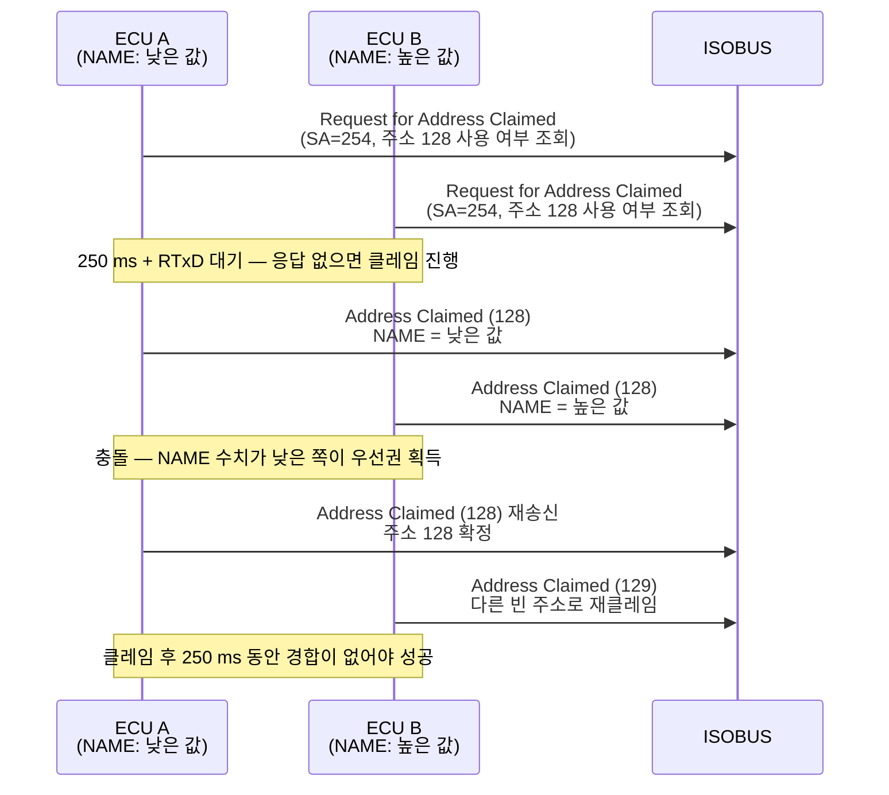
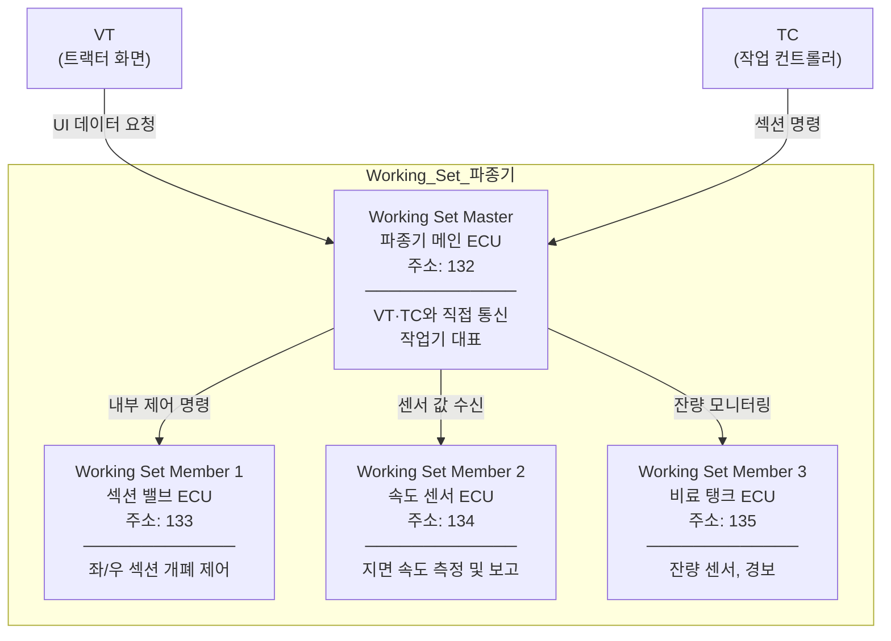
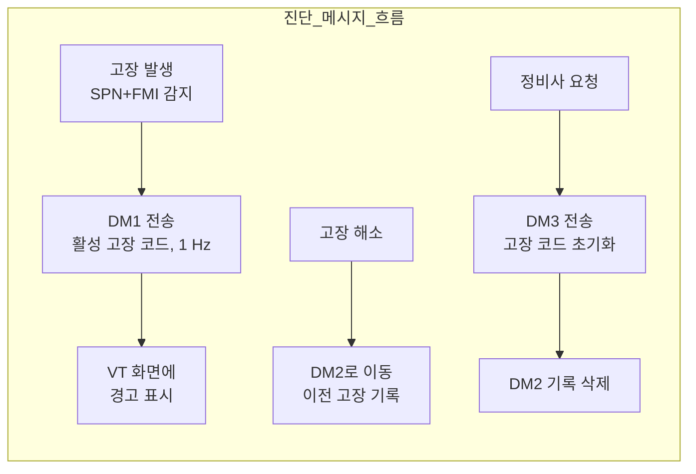
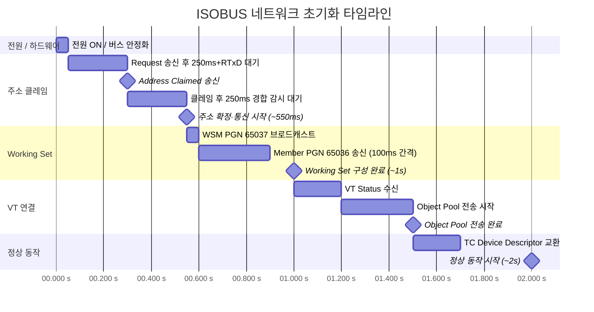

# ISOBUS 네트워크 관리

::: info 학습 목표
- ISOBUS의 주소 클레임 방식과 CF(Control Function) 개념을 설명할 수 있다.
- Working Set Master와 Member의 관계를 도식으로 이해한다.
- DM1~DM3 진단 메시지의 역할과 SPN+FMI 조합을 구분할 수 있다.
- 전원 ON부터 통신 완료까지의 시간 흐름을 설명할 수 있다.
:::

## 1. 주소 클레임 (ISOBUS 방식)

ISOBUS의 주소 클레임은 J1939의 방식을 기반으로 하되, 농업 기계에 맞게 확장된 규칙을 적용한다.

### CF (Control Function)

ISOBUS에서는 네트워크에 참여하는 모든 통신 주체를 <strong>CF(Control Function)</strong>라고 부른다. 하나의 물리적 ECU가 여러 CF를 포함할 수도 있다. 각 CF는 독립적인 주소를 가진다.

### 주소 범위

| 주소 범위 | 용도 |
|-----------|------|
| 0 ~ 127 | Preferred 주소 영역 (특정 기능에 할당) |
| 128 ~ 247 | **Self-Configurable 주소** (동적 협상) |
| 248 ~ 253 | Preferred 주소 영역 (특정 기능에 할당) |
| 254 | Null Address (소스 주소 전용 — 클레임 전·실패 시 네트워크 관리 메시지에 사용) |
| 255 | Global Address (목적지 주소 전용 — 브로드캐스트) |

ISOBUS 작업기 ECU는 대부분 **128~247** 범위의 Self-Configurable 주소를 사용한다. 이 범위의 주소는 여러 장치가 동시에 원할 경우 NAME 값의 우선순위로 자동 협상된다. ISO 11783-5는 적합 CF에 <strong>self-configurable 능력을 필수</strong>로 요구하며, non-configurable CF는 구판·SAE J1939 호환을 위해 허용될 뿐이다.

### 주소 클레임 흐름


```mermaid
sequenceDiagram
    participant ECU_A as ECU A<br>(NAME: 낮은 값)
    participant ECU_B as ECU B<br>(NAME: 높은 값)
    participant BUS as ISOBUS

    ECU_A->>BUS: Request for Address Claimed<br>(SA=254, 주소 128 사용 여부 조회)
    ECU_B->>BUS: Request for Address Claimed<br>(SA=254, 주소 128 사용 여부 조회)

    Note over ECU_A,ECU_B: 250 ms + RTxD 대기 — 응답 없으면 클레임 진행

    ECU_A->>BUS: Address Claimed (128)<br>NAME = 낮은 값
    ECU_B->>BUS: Address Claimed (128)<br>NAME = 높은 값

    Note over ECU_A,ECU_B: 충돌 — NAME 수치가 낮은 쪽이 우선권 획득

    ECU_A->>BUS: Address Claimed (128) 재송신<br>주소 128 확정
    ECU_B->>BUS: Address Claimed (129)<br>다른 빈 주소로 재클레임

    Note over ECU_A,ECU_B: 클레임 후 250 ms 동안 경합이 없어야 성공
```

Request for Address Claimed는 "주소를 원한다"는 요구가 아니라 <strong>해당 주소(또는 전체)의 클레임 상태를 조회</strong>하는 메시지다. 클레임 전의 CF는 SA를 NULL(254)로 하여 보내고, 최소 <strong>250 ms + RTxD</strong>(0~255 난수 × 0,6 ms)를 기다린 뒤 클레임을 진행한다.

Address Claimed 송신 후 <strong>250 ms 동안</strong> 경합 클레임이 없어야 성공이며, 이 250 ms가 지나기 전에는 일반 메시지 송신을 시작할 수 없다(Request에 대한 응답은 예외). Self-configurable CF는 중재에서 지면 위 다이어그램처럼 다른 빈 주소를 재클레임하면 되고, <strong>Cannot Claim Address</strong>는 쓸 수 있는 주소가 하나도 없을 때 NULL 주소(SA=254)로 보내는 실패 보고 메시지다. 이를 보낸 CF는 이후 Request 응답 외의 송신을 중단한다.

## 2. Working Set

작업기(Implement)는 내부에 여러 ECU를 포함할 수 있다. 예를 들어 파종기(Seeder)는 메인 제어 ECU, 섹션 밸브 ECU, 속도 센서 ECU를 각각 가질 수 있다. 이 ECU들을 하나의 논리적 단위로 묶는 것이 <strong>Working Set</strong>이다.

### 마스터-멤버 관계


```mermaid
graph TD
    subgraph Working_Set_파종기
        WSM["Working Set Master<br>파종기 메인 ECU<br>주소: 132<br>─────────────<br>VT·TC와 직접 통신<br>작업기 대표"]

        M1["Working Set Member 1<br>섹션 밸브 ECU<br>주소: 133<br>─────────────<br>좌/우 섹션 개폐 제어"]

        M2["Working Set Member 2<br>속도 센서 ECU<br>주소: 134<br>─────────────<br>지면 속도 측정 및 보고"]

        M3["Working Set Member 3<br>비료 탱크 ECU<br>주소: 135<br>─────────────<br>잔량 센서, 경보"]

        WSM -- "내부 제어 명령" --> M1
        WSM -- "센서 값 수신" --> M2
        WSM -- "잔량 모니터링" --> M3
    end

    VT["VT<br>(트랙터 화면)"] -- "UI 데이터 요청" --> WSM
    TC["TC<br>(작업 컨트롤러)"] -- "섹션 명령" --> WSM
```

### Working Set 선언 메시지 (PGN 65037)

WSM은 네트워크에 참여한 후 <strong>PGN 65037 (Working Set Master)</strong>를 브로드캐스트하여 자신이 마스터임을 선언한다. 이 메시지에는 Working Set에 속한 멤버 수(마스터 자신 포함)가 포함된다.

멤버 식별용 <strong>PGN 65036 (Working Set Member)</strong> 메시지도 멤버가 아니라 <strong>마스터가</strong> 송신한다. 마스터는 멤버 수 − 1개의 Member 메시지를 각 멤버의 NAME을 담아 <strong>100 ms 간격</strong>으로 보내고, 수신 측은 마지막 Member 메시지 후 350 ms가 지나면 Working Set 정의가 완료된 것으로 간주한다.

VT와 TC는 이 메시지들을 수신하여 작업기의 구조를 파악하고, Working Set 대상 통신 대부분을 WSM의 주소로 보낸다. 특히 TC의 명령은 WSM에게만 전달되며, 마스터가 멤버에게 명령을 전파하는 방법은 각 Working Set의 고유(proprietary) 설계 영역이다.

## 3. 진단 메시지

ISOBUS는 ISO 11783-12를 통해 표준화된 진단 메시지를 정의한다. SAE J1939-73의 DM 메시지 체계를 가져와 농기계 환경에 맞게 요구사항을 좁힌 구조다.

### 고장 코드 구조: SPN + FMI

모든 고장은 <strong>SPN(Suspect Parameter Number)</strong>과 <strong>FMI(Failure Mode Identifier)</strong>의 조합으로 식별한다.

- **SPN**: 어떤 파라미터에 문제가 생겼는지 (예: SPN 100 = 엔진 오일 압력)
- **FMI**: 어떤 종류의 고장인지 (예: FMI 1 = 데이터 낮음, FMI 3 = 전압 높음)

### 주요 진단 메시지

| 메시지 | PGN | 이름 | 설명 |
|--------|-----|------|------|
| DM1 | 65226 | Active Diagnostic Trouble Codes | 현재 발생 중인 활성 고장 코드 목록. 상태 변화 시 즉시 + 활성 고장이 있는 동안 <strong>1초에 1회(1 Hz)</strong> 주기 전송 |
| DM2 | 65227 | Previously Active Diagnostic Trouble Codes | 이전에 발생했다가 해소된 고장 코드. <strong>요청(request) 시에만</strong> 전송하며 주기 전송은 없다 |
| DM3 | 65228 | Diagnostic Data Clear | 저장된 이전 고장 코드(DM2) 초기화 요청. 활성 고장(DM1) 데이터에는 영향 없음 |


```mermaid
graph LR
    subgraph 진단_메시지_흐름
        FAULT[고장 발생<br>SPN+FMI 감지] --> DM1[DM1 전송<br>활성 고장 코드, 1 Hz]
        DM1 --> VT_WARN[VT 화면에<br>경고 표시]
        FAULT_CLEAR[고장 해소] --> DM2[DM2로 이동<br>이전 고장 기록]
        TECH[정비사 요청] --> DM3[DM3 전송<br>고장 코드 초기화]
        DM3 --> DM2_CLEAR[DM2 기록 삭제]
    end
```

### FMI 주요 값

| FMI | 의미 |
|-----|------|
| 0 | 데이터는 유효하나 정상 범위보다 높음 (most severe) |
| 1 | 데이터는 유효하나 정상 범위보다 낮음 (most severe) |
| 2 | 데이터 불안정 / 간헐적 / 부정확 |
| 3 | 전압 높음 / 단락 (High) |
| 4 | 전압 낮음 / 단락 (Low) |
| 5 | 전류 낮음 / 단선 |
| 6 | 전류 높음 / 단락 (GND) |
| 12 | 지능형 장치·컴포넌트 내부 고장 (ECU 교체 필요) |
| 19 | 수신 네트워크 데이터 오류 |

## 4. 네트워크 관리 타임라인

전원을 켠 순간부터 ISOBUS 통신이 완전히 확립될 때까지의 시간 흐름이다.


```mermaid
gantt
    title ISOBUS 네트워크 초기화 타임라인
    dateFormat  ss.SSS
    axisFormat  %S.%L s

    section 전원 / 하드웨어
    전원 ON / 버스 안정화      : 00.000, 50ms

    section 주소 클레임
    Request 송신 후 250ms+RTxD 대기 : 00.050, 250ms
    Address Claimed 송신            : milestone, 00.300, 0ms
    클레임 후 250ms 경합 감시 대기  : 00.300, 250ms
    주소 확정·통신 시작 (~550ms)    : milestone, 00.550, 0ms

    section Working Set
    WSM PGN 65037 브로드캐스트 : 00.550, 50ms
    Member PGN 65036 송신 (100ms 간격) : 00.600, 300ms
    Working Set 구성 완료 (~1s): milestone, 01.000, 0ms

    section VT 연결
    VT Status 수신             : 01.000, 200ms
    Object Pool 전송 시작      : 01.200, 300ms
    Object Pool 전송 완료      : milestone, 01.500, 0ms

    section 정상 동작
    TC Device Descriptor 교환  : 01.500, 200ms
    정상 동작 시작 (~2s)       : milestone, 02.000, 0ms
```

### 타임라인 요약

| 시점 | 이벤트 |
|------|--------|
| 0 ms | 전원 ON, 버스 전압 안정화 |
| ~50 ms | 각 ECU가 Request for Address Claimed 송신, 250 ms + RTxD 대기 시작 |
| ~300 ms | Address Claimed 송신 |
| ~550 ms | 250 ms 동안 경합 없음 확인 — 주소 확정, 일반 통신 시작 |
| ~550 ms | WSM Working Set 선언 (PGN 65037) 후 Member 메시지(PGN 65036)를 100 ms 간격 송신 |
| ~1,000 ms | Working Set 구성 완료 |
| ~1,000 ms | VT Status 수신 시작 |
| ~1,500 ms | Object Pool 전송 완료, 화면 표시 시작 |
| ~2,000 ms | TC Device Descriptor 완료, 전체 통신 확립 |

> **실제 현장에서의 차이**: Object Pool 크기, ECU 수, 버스 부하에 따라 타임라인은 달라진다. 복잡한 작업기의 경우 Object Pool 전송만 수 초가 걸릴 수 있다.

> **핵심 정리**
> - ISOBUS에서 ECU는 CF(Control Function)라 불리며, Self-Configurable 주소(128~247)를 NAME 우선순위로 동적 협상한다.
> - Working Set은 작업기 내 여러 ECU를 하나의 논리 단위로 묶으며, WSM이 Master/Member 메시지(PGN 65037/65036)를 모두 송신해 구성을 선언하고 VT·TC와의 통신을 대표한다.
> - DM1은 현재 활성 고장(활성 중 1 Hz 전송), DM2는 이전 고장 이력(요청 시에만 전송), DM3는 이전 고장 기록(DM2) 초기화 명령이다.
> - 전원 ON 후 약 2초 안에 주소 클레임 → Working Set → VT 연결 → 정상 동작 순으로 초기화가 완료된다.

## 5. Working Set 구성 따라가기

2절이 Working Set의 개념을 다뤘다면, 여기서는 <strong>ECU 3개로 이루어진 작업기가 Working Set을 선언하는 과정</strong>을 메시지 하나하나 끝까지 따라간다. 대상은 스프레이어(방제기) 작업기이며, 메인 컨트롤러가 좌·우 두 분무 섹션 컨트롤러를 거느린다.

### 구성

세 CF 모두 §1의 절차로 <strong>이미 주소 클레임을 마친 상태</strong>에서 이 절이 시작된다. 즉 여기서 다루는 건 클레임 이후, Working Set을 선언하는 단계만이다.

| CF | 역할 | SA (주소) | Working Set에서의 위치 |
|---|---|---|---|
| 메인 컨트롤러 | 스프레이어 전체 제어, VT·TC와 통신 | 0x90 (144) | Working Set Master |
| 좌측 섹션 컨트롤러 | 좌측 분무 섹션 개폐 | 0x91 (145) | Member 1 |
| 우측 섹션 컨트롤러 | 우측 분무 섹션 개폐 | 0x92 (146) | Member 2 |

### 타임라인

Working Set 정의에는 두 메시지가 필요하다 — 크기를 알리는 <strong>Working Set Master 메시지(PGN 65037)</strong>와 멤버를 식별하는 <strong>Working Set Member 메시지(PGN 65036)</strong>다. <strong>둘 다 master가 보낸다.</strong>

| t (ms) | 송신 CF | 메시지 (PGN, 8바이트 데이터) | 의미 |
|---|---|---|---|
| 0 | 메인 컨트롤러 (SA 0x90) | PGN 65037, `03 FF FF FF FF FF FF FF` | Working Set 크기 선언 — 멤버 3명(마스터 자신 포함) |
| 100 | 메인 컨트롤러 (SA 0x90) | PGN 65036, `00 00 A8 82 0D 00 91 81` | 좌측 섹션 컨트롤러의 NAME 통지 |
| 200 | 메인 컨트롤러 (SA 0x90) | PGN 65036, `00 00 A8 82 0D 00 92 81` | 우측 섹션 컨트롤러의 NAME 통지 |
| 550 | (없음 — 수신측 타임아웃) | — | 마지막 member 메시지 후 <strong>350 ms</strong> 경과, Working Set 구성 완료로 판정 |

t=100과 t=200 사이의 100ms 간격은 규격이 정한 값이다. 반면 t=0(마스터 메시지)에서 t=100(첫 member 메시지)까지의 간격은 표준에 규정이 없다 — 위 표는 이해를 돕기 위해 같은 100ms 주기를 그대로 이어 쓴 예시일 뿐이다.

### 메시지 바이트 뜯어보기

**Working Set Master 메시지 (PGN 65037)**

| Byte | 값 | 의미 |
|---|---|---|
| 1 | `03` | Working Set 멤버 수 — <strong>마스터 자신을 포함</strong>한 값. "멤버 2명 + 마스터"이므로 `2`가 아니라 `3`이다 |
| 2~8 | `FF FF FF FF FF FF FF` | Reserved |

**Working Set Member 메시지 (PGN 65036)**

| Byte | 값 | 의미 |
|---|---|---|
| 1~8 | 해당 멤버의 NAME (8바이트) | 그 멤버가 주소를 클레임할 때 쓴 것과 동일한 NAME |

마스터가 보내는 member 메시지의 개수는 <strong>멤버 수 − 1</strong>, 즉 3 − 1 = 2개다. 마스터 자신의 NAME은 별도 메시지 없이 마스터의 address claim에서 이미 알 수 있으므로 다시 보내지 않는다.

여기서 CAN ID를 보면 흥미로운 점이 하나 있다. PGN 65037 메시지와 두 PGN 65036 메시지 모두 <strong>Source Address가 0x90(메인 컨트롤러)으로 동일</strong>하다. 두 member 메시지는 PGN·데이터는 다르지만 ID의 SA는 완전히 같다 — 송신자가 항상 마스터이기 때문이다.

### 타이밍 규정

- member 메시지 간격: <strong>100 ms</strong>
- 완료 판정: 마지막 member 메시지 후 <strong>350 ms</strong> 경과 시 수신측(service provider)은 마스터가 모든 멤버 NAME 송신을 마쳤다고 간주한다
- 실패 시: 정확한 개수의 member 메시지를 받지 못한 service provider는 마스터에게 PGN 65037을 재요청할 수 있고, 마스터는 요청을 받으면 master 메시지 + member 메시지 전체를 다시 보낸다. 응용 계층에 별도 규정이 없다면 <strong>최소 3회</strong> 완전한 멤버 목록 확보에 실패한 service provider는 해당 Working Set을 무시할 수 있다

### 흔한 오해 정정

member 메시지를 <strong>각 멤버 ECU가 직접 보낸다</strong>고 생각하기 쉽지만, 실제로는 <strong>마스터가 대신 보낸다</strong>. 위 타임라인의 세 프레임 — PGN 65037 1개, PGN 65036 2개 — 모두 SA 0x90(메인 컨트롤러)에서 나간다. 좌·우 섹션 컨트롤러(SA 0x91, 0x92)는 이 과정에서 <strong>아무 메시지도 보내지 않는다.</strong> 이들의 존재는 오직 마스터가 실어 보내는 NAME 바이트를 통해서만 네트워크에 드러난다.

::: tip 핵심 통찰
Working Set Master 메시지의 Byte 1은 "멤버 수(마스터 포함)"이지 "마스터 아닌 멤버 수"가 아니다. 그리고 이어지는 member 메시지의 개수는 그 값에서 1을 뺀 값이며, 두 메시지 모두 <strong>마스터의 SA</strong>로 나간다. 이 두 가지를 헷갈리면 Working Set 구성 로직이 어긋난다.
:::

:::details 파이썬으로 검산해 보기
```python
PRIORITY = 7                     # ISO 11783-7 B.23.2/B.23.3 — 두 메시지 모두 priority 7
PF_MASTER, PS_MASTER = 0xFE, 0x0D  # PGN 65037 (0x00FE0D) — Working Set Master
PF_MEMBER, PS_MEMBER = 0xFE, 0x0C  # PGN 65036 (0x00FE0C) — Working Set Member


def can_id(priority, pf, ps, sa):
    return (priority << 26) | (pf << 16) | (ps << 8) | sa


MASTER_SA = 0x90                 # 메인 컨트롤러
MEMBER_SAS = [0x91, 0x92]        # 좌측·우측 섹션 컨트롤러 (참고용 — 메시지 자체엔 SA가 실리지 않음)
NUM_MEMBERS = 1 + len(MEMBER_SAS)  # 마스터 자신 포함 = 3

NAME_LEFT  = [0x00, 0x00, 0xA8, 0x82, 0x0D, 0x00, 0x91, 0x81]
NAME_RIGHT = [0x00, 0x00, 0xA8, 0x82, 0x0D, 0x00, 0x92, 0x81]

wsm_id   = can_id(PRIORITY, PF_MASTER, PS_MASTER, MASTER_SA)
wsm_data = [NUM_MEMBERS] + [0xFF] * 7          # Byte1=멤버 수, Byte2~8=Reserved

wsmem_id = can_id(PRIORITY, PF_MEMBER, PS_MEMBER, MASTER_SA)  # SA는 두 메시지 모두 master!

frames = [
    (0,   wsm_id,   wsm_data),
    (100, wsmem_id, NAME_LEFT),
    (200, wsmem_id, NAME_RIGHT),
]

for t, cid, data in frames:
    print(f"t={t:>4}ms  ID=0x{cid:08X}  DATA={' '.join(f'{b:02X}' for b in data)}")

assert wsm_data[0] == NUM_MEMBERS                       # Byte1 = 3 (마스터 포함)
assert len(frames) - 1 == NUM_MEMBERS - 1                # member 메시지 수 = 멤버 수 - 1 = 2
assert all(cid == wsmem_id for _, cid, _ in frames[1:])  # 모든 member 메시지가 master SA에서 나감

completion_ms = frames[-1][0] + 350                       # 마지막 member 메시지 + 350ms
print("Working Set 구성 완료 판정 시각:", completion_ms, "ms")

# 출력:
# t=   0ms  ID=0x1CFE0D90  DATA=03 FF FF FF FF FF FF FF
# t= 100ms  ID=0x1CFE0C90  DATA=00 00 A8 82 0D 00 91 81
# t= 200ms  ID=0x1CFE0C90  DATA=00 00 A8 82 0D 00 92 81
# Working Set 구성 완료 판정 시각: 550 ms
```
:::

## 다음 챕터

- 다음 : [Virtual Terminal 기초](/study/isobus/15-vt-basics)
