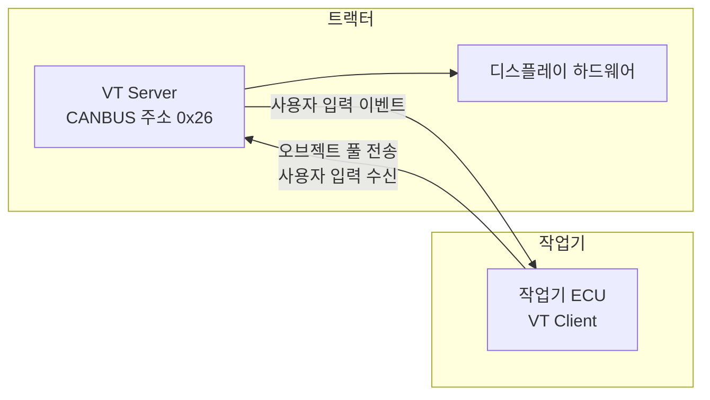
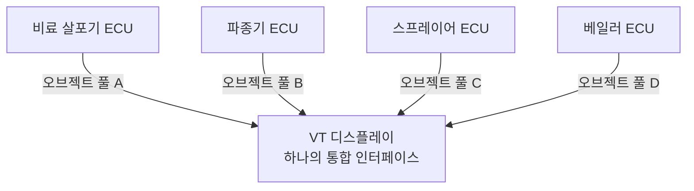
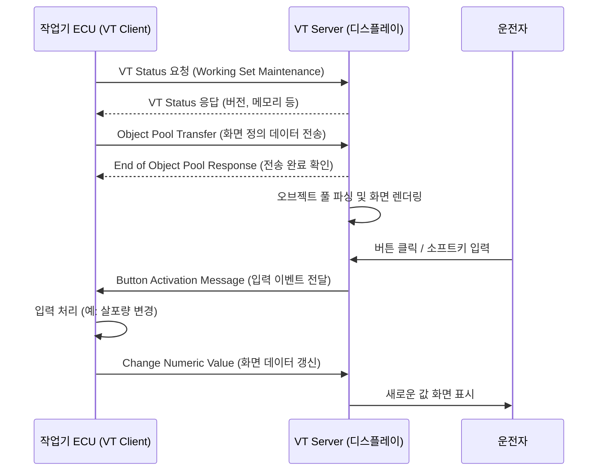
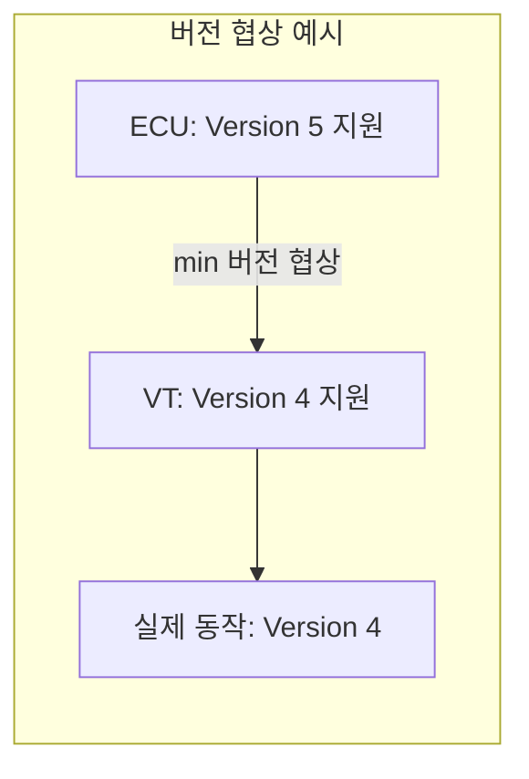
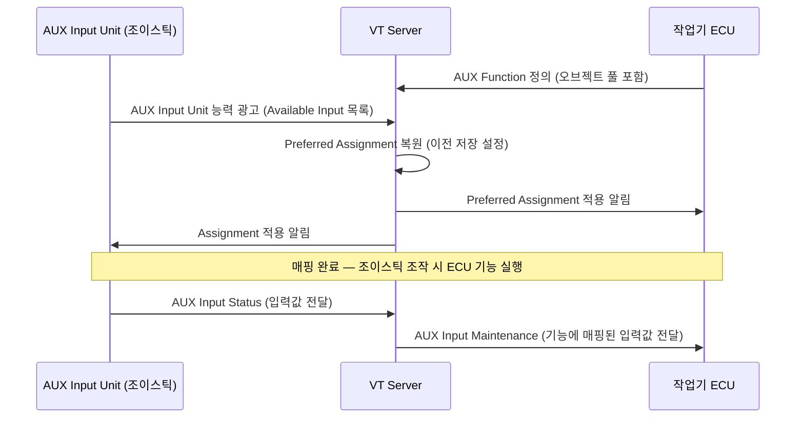

# Virtual Terminal (VT) 기초

::: info 학습 목표
- Virtual Terminal(VT)이 무엇이며 어떤 문제를 해결하는지 설명할 수 있다.
- VT의 동작 원리와 오브젝트 풀의 역할을 이해한다.
- VT 버전별 주요 기능 차이를 비교할 수 있다.
- AUX(보조 입력) 장치의 개념과 Preferred Assignment를 설명할 수 있다.
:::

---

## 1. VT란 무엇인가

<strong>Virtual Terminal(VT)</strong>은 ISO 11783-6에 정의된 표준 사용자 인터페이스 시스템이다. 트랙터 운전석에 장착된 디스플레이에 **작업기의 UI를 표시하고 사용자 입력을 받는** 인터페이스 역할을 한다.

VT 시스템은 두 주체로 구성된다.

| 역할 | 장치 | 담당 |
|------|------|------|
| **VT Server** | 트랙터 캐빈 디스플레이 | 화면 렌더링, 입력 처리 |
| **VT Client** | 작업기 ECU | 화면 내용(오브젝트 풀) 정의, 데이터 갱신 |

즉, <strong>디스플레이 하드웨어는 트랙터가 제공</strong>하고, <strong>화면에 무엇을 보여줄지는 작업기 ECU가 결정</strong>한다. 트랙터와 작업기의 역할이 명확히 분리되어 있는 것이 핵심이다.



---

## 2. 왜 VT가 혁신적인가

### VT 이전: 전용 디스플레이 시대

VT 표준이 없던 시절, 각 작업기 제조사는 <strong>전용 디스플레이 패널</strong>을 함께 납품했다.

- 비료 살포기 → 비료 살포기 전용 컨트롤 박스
- 파종기 → 파종기 전용 모니터
- 스프레이어 → 스프레이어 전용 디스플레이

운전석에 작업기가 늘어날수록 디스플레이도 늘어났다. 배선은 복잡해지고, 운전자는 여러 개의 서로 다른 UI를 익혀야 했다.

### VT 이후: 통합 디스플레이

VT는 이 문제를 <strong>스마트폰 앱 스토어 모델</strong>로 해결했다.

```
스마트폰(VT Server) = 하드웨어 플랫폼
앱(오브젝트 풀)     = 작업기 ECU가 제공하는 UI 정의
```

하나의 VT 디스플레이에 어떤 제조사의 작업기를 연결해도, 작업기가 자신의 UI 정의를 VT로 전송하면 VT가 화면을 렌더링한다. 운전자는 <strong>하나의 디스플레이로 모든 작업기를 조작</strong>할 수 있다.



---

## 3. VT 동작 원리

VT와 작업기 ECU 사이의 동작은 크게 세 단계로 나뉜다.

1. **오브젝트 풀 전송**: 작업기 ECU가 화면 정의 데이터를 VT로 업로드
2. **렌더링**: VT가 오브젝트 풀을 해석해 화면에 표시
3. **상호작용**: 사용자 입력 → VT → ECU, ECU 데이터 갱신 → VT 화면 업데이트



---

## 4. VT 버전

ISO 11783-6은 지속적으로 개정되어 왔으며, VT Server와 Client가 지원하는 <strong>버전(Version)</strong>에 따라 사용 가능한 기능이 달라집니다.

| 버전 | 주요 특징 |
|------|-----------|
| **Version 2** | 기본 오브젝트 타입, 기본 그래픽(픽셀 단위) |
| **Version 3** | 색상 팔레트 확장(256색), 소프트키 마스크 개선 |
| **Version 4** | 향상된 그래픽 품질, 윈도우 마스크(복수 화면 관리) |
| **Version 5** | 스크롤 컨테이너, 드래그 앤 드롭 이벤트 지원 |
| **Version 6** | 최신 버전, 추가 입력 이벤트, 다국어 개선 |

VT Server와 Client가 서로 다른 버전을 지원할 경우, <strong>낮은 버전으로 협상</strong>하여 동작한다. 협상 과정은 VT Status 메시지 교환 시 이루어집니다.



---

## 5. AUX (보조 입력)

<strong>AUX(Auxiliary Input)</strong>는 조이스틱, 추가 버튼 패드, 풋 페달 등 VT 디스플레이 외부의 보조 입력 장치를 ISOBUS에 통합하는 메커니즘이다. ISO 11783-6 Annex에 정의되어 있다.

현재 표준에서 사용되는 버전은 **AUX-N**(New AUX)으로, 기존 AUX-O(Old AUX)를 대체했다.

### AUX 구성 요소

| 구성 요소 | 설명 |
|-----------|------|
| **AUX Input Unit** | 물리적 입력 장치 (조이스틱, 버튼 등) |
| **AUX Function** | 작업기 ECU가 정의하는 논리적 기능 (예: "살포 시작") |
| **Assignment** | 입력 유닛의 특정 입력과 ECU 기능을 연결하는 매핑 |

### Preferred Assignment

AUX의 핵심 개념 중 하나는 <strong>Preferred Assignment</strong>이다. 사용자가 한 번 입력 장치와 기능의 매핑을 설정하면, 그 설정이 VT에 저장된다. 다음에 같은 작업기를 연결하면 <strong>이전 매핑이 자동으로 복원</strong>된다.



---

::: tip 핵심 정리
- VT는 ISO 11783-6에 정의된 표준 디스플레이 인터페이스로, 트랙터 디스플레이(VT Server)와 작업기 ECU(VT Client)로 구성된다.
- 작업기 ECU는 오브젝트 풀을 VT로 전송하고, VT는 이를 렌더링한다.
- VT는 버전(2~6)에 따라 지원 기능이 다르며, 낮은 버전으로 자동 협상한다.
- AUX-N은 조이스틱 등 보조 입력 장치를 ISOBUS에 통합하며, Preferred Assignment로 매핑 설정을 저장한다.
:::

## 다음 챕터

- 다음 : [VT 오브젝트 풀](/study/isobus/16-vt-object-pool)
