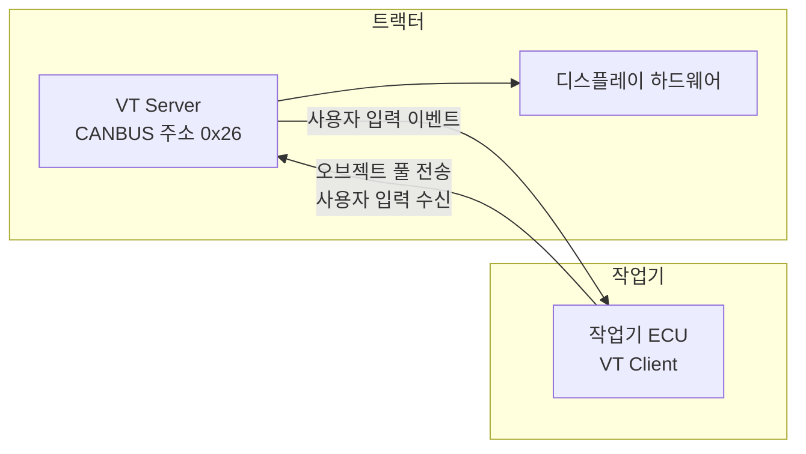
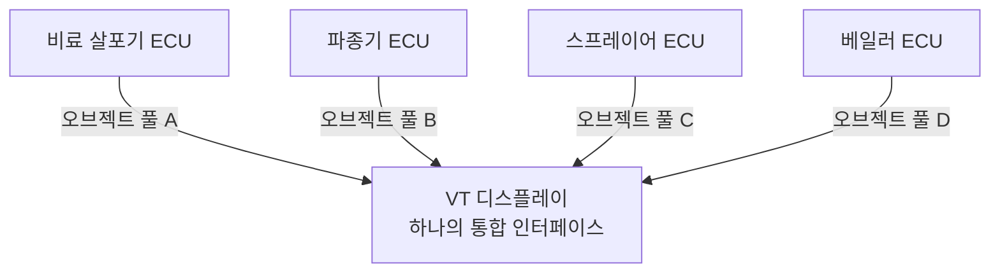
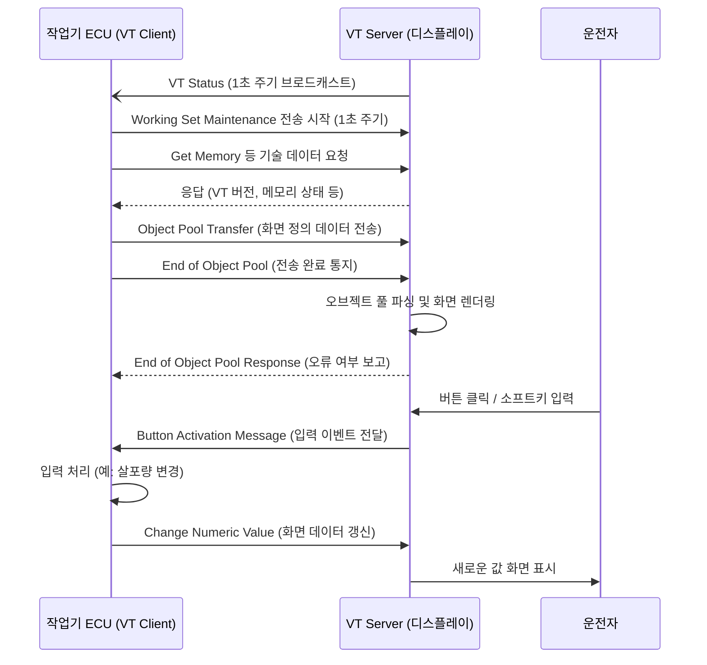
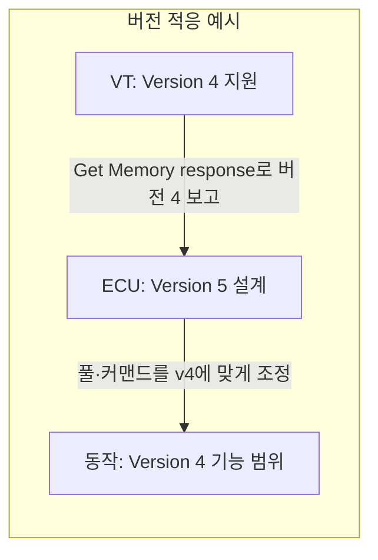
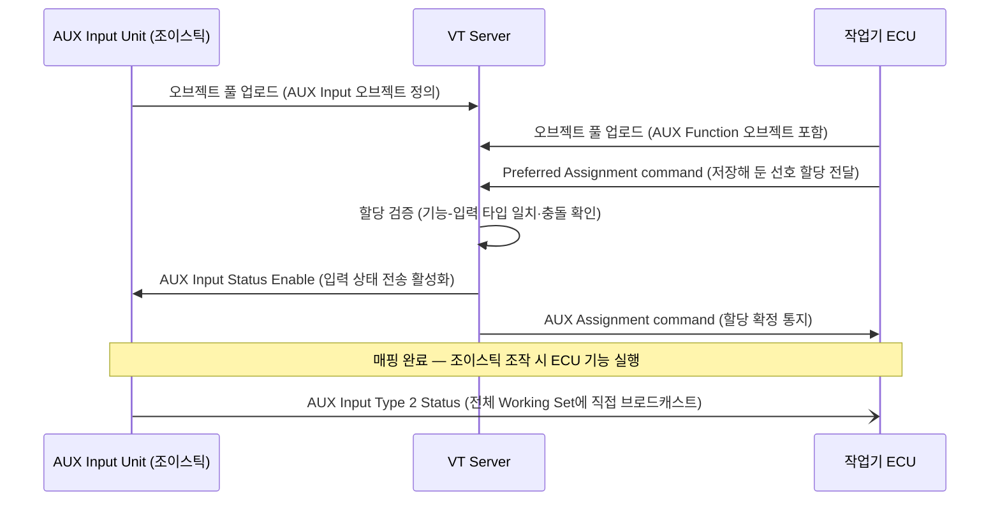

# Virtual Terminal (VT) 기초

::: info 학습 목표
- Virtual Terminal(VT)이 무엇이며 어떤 문제를 해결하는지 설명할 수 있다.
- VT의 동작 원리와 오브젝트 풀의 역할을 이해한다.
- VT 버전별 주요 기능 차이를 비교할 수 있다.
- AUX(보조 입력) 장치의 개념과 Preferred Assignment를 설명할 수 있다.
:::

## 1. VT란 무엇인가

<strong>Virtual Terminal(VT)</strong>은 ISO 11783-6에 정의된 표준 사용자 인터페이스 시스템이다. 트랙터 운전석에 장착된 디스플레이에 **작업기의 UI를 표시하고 사용자 입력을 받는** 인터페이스 역할을 한다.

VT 시스템은 두 주체로 구성된다.

| 역할 | 장치 | 담당 |
|------|------|------|
| **VT Server** | 트랙터 캐빈 디스플레이 | 화면 렌더링, 입력 처리 |
| **VT Client** | 작업기 ECU | 화면 내용(오브젝트 풀) 정의, 데이터 갱신 |

즉, <strong>디스플레이 하드웨어는 트랙터가 제공</strong>하고, <strong>화면에 무엇을 보여줄지는 작업기 ECU가 결정</strong>한다. 트랙터와 작업기의 역할이 명확히 분리되어 있는 것이 핵심이다.


```mermaid
graph LR
    subgraph 트랙터
        VTS[VT Server<br>CANBUS 주소 0x26]
        DISP[디스플레이 하드웨어]
        VTS --> DISP
    end
    subgraph 작업기
        ECU[작업기 ECU<br>VT Client]
    end
    ECU -- "오브젝트 풀 전송<br>사용자 입력 수신" --> VTS
    VTS -- "사용자 입력 이벤트" --> ECU
```

VT 화면은 <strong>Data Mask 영역</strong>(작업기 UI가 표시되는 정사각형 영역, 최소 200 × 200 픽셀, version 6부터 최소 480 × 480)과 <strong>Soft Key Mask 영역</strong>(소프트키 라벨 영역, version 6부터 키당 최소 60 × 60 픽셀)으로 구성된다.

## 2. 왜 VT가 혁신적인가

### VT 이전: 전용 디스플레이 시대

VT 표준이 없던 시절, 각 작업기 제조사는 <strong>전용 디스플레이 패널</strong>을 함께 납품했다.

- 비료 살포기 → 비료 살포기 전용 컨트롤 박스
- 파종기 → 파종기 전용 모니터
- 스프레이어 → 스프레이어 전용 디스플레이

운전석에 작업기가 늘어날수록 디스플레이도 늘어났다. 배선은 복잡해지고, 운전자는 여러 개의 서로 다른 UI를 익혀야 했다.

### VT 이후: 통합 디스플레이

VT는 이 문제를 <strong>스마트폰 앱 스토어 모델</strong>로 해결했다.

```
스마트폰(VT Server) = 하드웨어 플랫폼
앱(오브젝트 풀)     = 작업기 ECU가 제공하는 UI 정의
```

하나의 VT 디스플레이에 어떤 제조사의 작업기를 연결해도, 작업기가 자신의 UI 정의를 VT로 전송하면 VT가 화면을 렌더링한다. 운전자는 <strong>하나의 디스플레이로 모든 작업기를 조작</strong>할 수 있다.


```mermaid
graph TD
    VT[VT 디스플레이<br>하나의 통합 인터페이스]
    A[비료 살포기 ECU]
    B[파종기 ECU]
    C[스프레이어 ECU]
    D[베일러 ECU]

    A -- "오브젝트 풀 A" --> VT
    B -- "오브젝트 풀 B" --> VT
    C -- "오브젝트 풀 C" --> VT
    D -- "오브젝트 풀 D" --> VT
```

## 3. VT 동작 원리

VT와 작업기 ECU 사이의 동작은 크게 세 단계로 나뉜다.

1. **오브젝트 풀 전송**: 작업기 ECU가 화면 정의 데이터를 VT로 업로드
2. **렌더링**: VT가 오브젝트 풀을 해석해 화면에 표시
3. **상호작용**: 사용자 입력 → VT → ECU, ECU 데이터 갱신 → VT 화면 업데이트


```mermaid
sequenceDiagram
    participant ECU as 작업기 ECU (VT Client)
    participant VT as VT Server (디스플레이)
    participant User as 운전자

    VT-)ECU: VT Status (1초 주기 브로드캐스트)
    ECU->>VT: Working Set Maintenance 전송 시작 (1초 주기)
    ECU->>VT: Get Memory 등 기술 데이터 요청
    VT-->>ECU: 응답 (VT 버전, 메모리 상태 등)

    ECU->>VT: Object Pool Transfer (화면 정의 데이터 전송)
    ECU->>VT: End of Object Pool (전송 완료 통지)
    VT->>VT: 오브젝트 풀 파싱 및 화면 렌더링
    VT-->>ECU: End of Object Pool Response (오류 여부 보고)

    User->>VT: 버튼 클릭 / 소프트키 입력
    VT->>ECU: Button Activation Message (입력 이벤트 전달)

    ECU->>ECU: 입력 처리 (예: 살포량 변경)
    ECU->>VT: Change Numeric Value (화면 데이터 갱신)
    VT->>User: 새로운 값 화면 표시
```

연결 유지는 두 주기 메시지가 담당한다. VT는 <strong>VT Status message</strong>를 1초 주기로 전체 브로드캐스트하고(요청-응답이 아니다), 각 Working Set은 <strong>Working Set Maintenance message</strong>를 1초 주기로 VT에 보낸다. 어느 쪽이든 <strong>3초간</strong> 끊기면 상대의 셧다운으로 판정한다 — 작업기 ECU는 안전 상태(safe state)로 진입하고, VT는 unexpected shutdown을 운전자에게 경보한 뒤 해당 풀을 휘발성 메모리에서 삭제한다.

## 4. VT 버전

ISO 11783-6은 지속적으로 개정되어 왔으며, VT Server와 Client가 지원하는 <strong>버전(Version)</strong>에 따라 사용 가능한 기능이 달라진다.

| 버전 | 주요 특징 |
|------|-----------|
| **Version 2** | 초판(2004) 기준 기본 기능 — 기본 오브젝트 타입, 256색 표준 팔레트, 구형 AUX(Type 1) |
| **Version 3** | 2판(2010) — 새 AUX 프로토콜(Type 2, AUX-N) 도입, initiating bit 등 연결 관리 보강 |
| **Version 4** | 2판(2010) — Window Mask·Key Group(여러 Working Set 동시 표시), Graphics Context, 커맨드 응답을 발신자에게 직접 전송 |
| **Version 5** | 3판(2014) — Animation, External Object(Working Set 간 오브젝트 참조), Extended Version 명령, Auxiliary Capabilities, Unsupported VT Function message |
| **Version 6** | 4판(2018) — Data Mask 최소 480×480·소프트키 최소 60×60, Colour Palette·Graphic Data·Scaled Graphic 오브젝트, AUX 입력 잠금(lock) 상태 |

VT Server와 Client가 서로 다른 버전을 지원할 경우 별도의 협상 절차는 없다. 클라이언트가 <strong>Get Memory response 등 기술 데이터 메시지</strong>로 VT의 버전을 확인한 뒤, 자신이 VT 버전에 맞춰 오브젝트 풀과 사용 커맨드를 조정하는 <strong>일방향 적응</strong>이다. 낮은 버전 VT에 높은 버전 메시지를 보내서는 안 되며, 반대로 VT가 더 높은 버전이면 하위 호환으로 그대로 동작한다. Working Set Maintenance message에 보고하는 버전은 Working Set이 설계된 버전이며, VT에 맞춘 런타임 적응 때문에 바뀌지 않는다.


```mermaid
graph LR
    subgraph 버전 적응 예시
        C[ECU: Version 5 설계]
        V[VT: Version 4 지원]
        R[동작: Version 4 기능 범위]
        V -- "Get Memory response로 버전 4 보고" --> C
        C -- "풀·커맨드를 v4에 맞게 조정" --> R
    end
```

## 5. AUX (보조 입력)

<strong>AUX(Auxiliary Input)</strong>는 조이스틱, 추가 버튼 패드, 풋 페달 등 VT 디스플레이 외부의 보조 입력 장치를 ISOBUS에 통합하는 메커니즘이다. ISO 11783-6 Annex J에 정의되어 있다.

현재 표준에서 사용되는 버전은 **AUX-N**(New AUX, 표준의 Type 2, version 3 이상)으로, 기존 AUX-O(Old AUX, Type 1, version 2)를 대체했다. 두 프로토콜은 서로 호환되지 않는다.

### AUX 구성 요소

| 구성 요소 | 설명 |
|-----------|------|
| **AUX Input Unit** | 물리적 입력 장치 (조이스틱, 버튼 등) |
| **AUX Function** | 작업기 ECU가 정의하는 논리적 기능 (예: "살포 시작") |
| **Assignment** | 입력 유닛의 특정 입력과 ECU 기능을 연결하는 매핑 |

### Preferred Assignment

AUX의 핵심 개념 중 하나는 <strong>Preferred Assignment</strong>이다. 사용자가 한 번 입력 장치와 기능의 매핑을 설정하면, <strong>기능을 제공하는 Working Set(작업기 ECU)</strong>이 그 할당을 선호 할당으로 저장한다. 다음에 같은 작업기를 연결하면 Working Set이 Preferred Assignment command로 저장된 할당을 VT에 전달하고, VT가 이를 검증한 뒤 적용해 <strong>이전 매핑이 자동으로 복원</strong>된다.


```mermaid
sequenceDiagram
    participant AUX as AUX Input Unit (조이스틱)
    participant VT as VT Server
    participant ECU as 작업기 ECU

    AUX->>VT: 오브젝트 풀 업로드 (AUX Input 오브젝트 정의)
    ECU->>VT: 오브젝트 풀 업로드 (AUX Function 오브젝트 포함)

    ECU->>VT: Preferred Assignment command (저장해 둔 선호 할당 전달)
    VT->>VT: 할당 검증 (기능-입력 타입 일치·충돌 확인)
    VT->>AUX: AUX Input Status Enable (입력 상태 전송 활성화)
    VT->>ECU: AUX Assignment command (할당 확정 통지)

    Note over AUX, ECU: 매핑 완료 — 조이스틱 조작 시 ECU 기능 실행

    AUX-)ECU: AUX Input Type 2 Status (전체 Working Set에 직접 브로드캐스트)
```

할당이 완료되면 입력값은 VT를 거치지 않는다. AUX Input Unit이 <strong>Auxiliary Input Type 2 Status message</strong>를 초당 1회(값 변경 시 즉시, 최대 20 Hz)로 전체 브로드캐스트하면, 할당된 기능의 Working Set이 이를 직접 수신해 실행한다. 입력 유닛은 별도로 Auxiliary Input Type 2 Maintenance message를 100 ms 주기로 브로드캐스트하며, 300 ms 동안 끊기면 VT와 기능 측 Working Set이 그 유닛의 할당을 제거한다. 다중 VT 환경에서 할당·검증은 <strong>function instance 0 VT</strong>만 수행한다.

::: tip 핵심 정리
- VT는 ISO 11783-6에 정의된 표준 디스플레이 인터페이스로, 트랙터 디스플레이(VT Server)와 작업기 ECU(VT Client)로 구성된다.
- 작업기 ECU는 오브젝트 풀을 VT로 전송하고, VT는 이를 렌더링한다. 연결은 VT Status·Working Set Maintenance(각 1초 주기, 3초 타임아웃)로 유지된다.
- VT는 버전(2~6)에 따라 지원 기능이 다르며, 클라이언트가 기술 데이터 메시지로 확인한 VT 버전에 맞춰 풀·커맨드를 조정한다(일방향 적응).
- AUX-N은 조이스틱 등 보조 입력 장치를 ISOBUS에 통합하며, 매핑 설정은 기능을 제공하는 Working Set이 Preferred Assignment로 저장했다가 VT에 전달해 복원한다. 할당된 입력값은 VT를 거치지 않고 전체 브로드캐스트된다.
:::

## 6. VT 연결 따라가기

§3~§4는 절차를 다이어그램으로만 봤다. 여기서는 그 흐름을 <strong>메시지 단위로 실제 바이트까지</strong> 따라간다. 예제로 쓰는 오브젝트 풀은 [CH16 §5](/study/isobus/16-vt-object-pool)의 "엔진 온도: 85°C" 화면이며, 그 풀을 이루는 5개 오브젝트(Working Set·Data Mask·Font Attributes·Output String·Output Number)의 바이트 구성은 [CH16 §6](/study/isobus/16-vt-object-pool#_6-오브젝트-레코드를-바이트로-보기)에서 계산한다. 여기서는 그 결과(총 95바이트)가 VT에 오르기까지의 <strong>메시지 흐름</strong>만 본다.

### 타임라인

방향 표기는 작업 지시 그대로 <strong>VT→ECU는 PGN 58880(0xE600)</strong>, <strong>ECU→VT는 PGN 59136(0xE700)</strong>이다. 시각은 설명 편의상 붙인 예시값이며 표준이 규정하는 절대 시각이 아니다(주기·타임아웃 규정 자체는 §3에 정리돼 있다). ECU(작업기) 소스 주소는 예시로 `0x81`을 쓴다.

| 시각 | 방향 | PGN | 데이터(hex) | 의미 |
|---|---|---|---|---|
| t=0.000s | VT→ECU | 0xE600 | `FE FF FF FF FF FF 00 FF` | VT Status — 소유 WS 없음(Byte2=FF), busy 없음. 요청 없이 매초 브로드캐스트 |
| t=0.000s | ECU→VT | 0xE700 | `FF 01 04 FF FF FF FF FF` | Working Set Maintenance 최초 전송 — Byte2 bit0=Initiating(1), Byte3=Version 4 |
| t=0.050s | ECU→VT | 0xE700 | `C0 FF 5F 00 00 00 FF FF` | Get Memory — Memory Required = 95(0x5F)바이트(풀 전체 크기), Byte1=함수코드 0xC0 |
| t=0.060s | VT→ECU | 0xE600 | `C0 04 00 FF FF FF FF FF` | Get Memory response — Version=4, Status=0(메모리 가능) |
| t=0.070s~ | ECU→VT | 0xE700 | (TP 다중 프레임 — 총 96바이트: 함수코드 `11` + 오브젝트 레코드 95바이트) | Object Pool Transfer — 5개 오브젝트 레코드 전송(TP/ETP 분해는 [CH11](/study/isobus/11-j1939-transport) 참고) |
| t=0.900s | ECU→VT | 0xE700 | `12 FF FF FF FF FF FF FF` | End of Object Pool — 전송 완료 통지 |
| t=0.901s | VT→ECU | 0xE600 | `FE FF FF FF FF FF 10 FF` | VT Status — Byte7 bit4(parsing)=1, 파싱 중 |
| t=1.9~3.9s | VT→ECU | 0xE600 | `FE FF FF FF FF FF 00 FF` ×3(연속) | parsing 비트 0인 Status 연속 3회 — ECU가 response를 확정적으로 기다려도 되는 조건 |
| t=3.910s | VT→ECU | 0xE600 | `12 00 FF FF FF FF 00 FF` | End of Object Pool response — Byte2 Error Codes=0(오류 없음), 결함 오브젝트 없음(FFFF) |
| t=3.920s | VT→ECU | 0xE600 | `FE 81 01 00 FF FF 00 FF` | VT Status — Byte2=0x81(ECU가 소유), Byte3,4=Data Mask ID 1, Byte5,6=Soft Key Mask 없음(FFFF, 이 풀은 `soft_key_mask="65535"`). 화면 표시 완료 |

Working Set Maintenance는 표에는 최초 1회만 적었지만 연결 내내 1초 주기로 계속 나간다. Get Memory 메시지의 Byte2·7~8과 응답의 Byte4~8은 부록이 값 범위를 명시하지 않은 예약 영역이라, 다른 VT 메시지들의 관례(미사용 필드는 `FF16`)를 따라 채웠다 — 이 두 바이트는 표준이 확정한 값이 아니라 관례적 추정이다.

### 왜 이 순서인가

- <strong>VT Status는 요청-응답이 아니다.</strong> 타임라인 첫 줄부터 VT가 먼저 말을 걸고, ECU가 아직 아무것도 안 보냈는데도 계속 브로드캐스트된다. ECU 입장에서는 이 메시지의 존재 자체가 "VT가 살아 있다"는 유일한 신호다.
- Get Memory로 <strong>버전과 메모리 여유를 먼저 확인</strong>한 뒤에야 풀을 올린다 — 무효 풀을 먼저 보내고 나중에 고치는 방식은 허용되지 않는다(§4 "전송 완료 대기와 오류 처리" 참고).
- End of Object Pool 이후의 대기는 <strong>폴링이 아니라 패턴 관찰</strong>이다. VT Status의 parsing 비트가 0인 상태가 연속 3번 나온 뒤에도 response가 없어야 "메시지가 VT에 안 갔다"고 확정한다 — 이미 큐에 있던 이전 Status가 파싱 상태를 잘못 반영하는 경쟁 상태를 피하기 위해서다.
- 마지막 VT Status는 이전 상태들과 <strong>Byte2~6이 다르다</strong>. 이 변화(소유자·활성 마스크 지정)가 바로 "화면이 떴다"는 것을 ECU가 확인하는 방법이다.

::: tip 핵심 통찰
- VT Status·Working Set Maintenance는 연결 전 과정에서 요청 없이 계속 흐르는 <strong>배경 신호</strong>다. Object Pool Transfer·Get Memory 같은 "용건이 있는" 메시지들은 이 배경 신호 위에 얹혀 지나갈 뿐이다.
- End of Object Pool response를 기다리는 조건은 <strong>"parsing=0 상태가 연속 3번"</strong>이지 "N초가 지났다"가 아니다. 파싱이 오래 걸리는 큰 풀일수록 이 규칙의 의미가 커진다.
:::

:::details 파이썬으로 바이트 구성 검산해 보기
```python
def le(v, n):
    return v.to_bytes(n, "little")


# VT Status — 소유 WS 없음
vt_status_idle = bytes([0xFE, 0xFF]) + b"\xFF" * 4 + bytes([0x00, 0xFF])
assert vt_status_idle.hex(" ").upper() == "FE FF FF FF FF FF 00 FF"

# Working Set Maintenance — 최초 전송(Initiating=1), Version 4
wsm_first = bytes([0xFF, 0b00000001, 4]) + b"\xFF" * 5
assert wsm_first.hex(" ").upper() == "FF 01 04 FF FF FF FF FF"

# Get Memory — Memory Required = CH16 §6에서 계산한 풀 전체 크기
memory_required = 10 + 20 + 7 + 30 + 28  # Working Set + Data Mask + Font Attr + Output String + Output Number
assert memory_required == 95
get_memory = bytes([0xC0, 0xFF]) + le(memory_required, 4) + b"\xFF\xFF"
assert get_memory.hex(" ").upper() == "C0 FF 5F 00 00 00 FF FF"

# VT Status — parsing 비트(Byte7 bit4) = 1
vt_status_parsing = bytes([0xFE, 0xFF]) + b"\xFF" * 4 + bytes([0b00010000, 0xFF])
assert vt_status_parsing.hex(" ").upper() == "FE FF FF FF FF FF 10 FF"

# End of Object Pool response — 오류 없음
eop_resp = bytes([0x12, 0x00]) + b"\xFF\xFF\xFF\xFF" + bytes([0x00, 0xFF])
assert eop_resp.hex(" ").upper() == "12 00 FF FF FF FF 00 FF"

# VT Status — 연결 완료, ECU(0x81)가 소유, Data Mask ID=1, Soft Key Mask 없음
vt_status_final = bytes([0xFE, 0x81]) + le(1, 2) + le(0xFFFF, 2) + bytes([0x00, 0xFF])
assert vt_status_final.hex(" ").upper() == "FE 81 01 00 FF FF 00 FF"

print("모든 프레임 검증 통과")
```
:::

## 다음 챕터

- 다음 : [VT 오브젝트 풀](/study/isobus/16-vt-object-pool)
