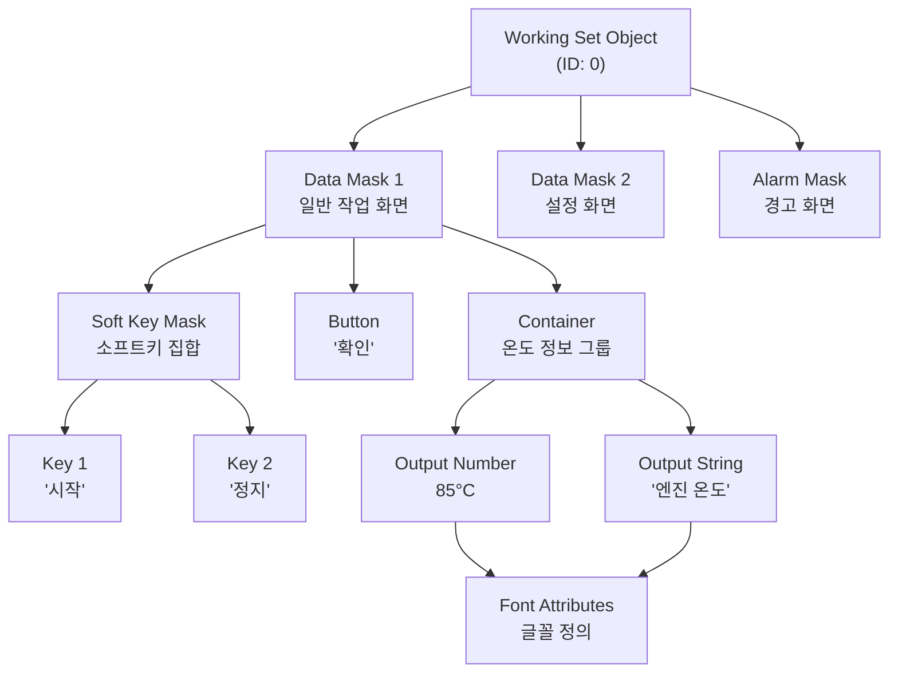
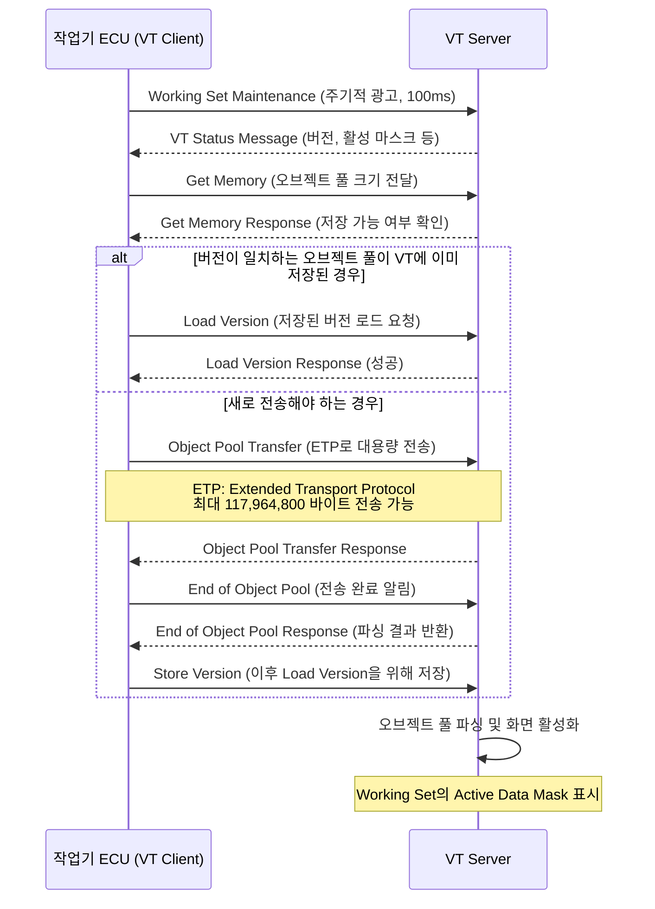

# VT 오브젝트 풀 (Object Pool)

## 학습 목표
- 오브젝트 풀의 개념과 바이너리 구조를 설명할 수 있다.
- 주요 오브젝트 타입의 역할을 구분할 수 있다.
- 오브젝트 간 계층 관계(Working Set → Data Mask → 자식 오브젝트)를 이해한다.
- 오브젝트 풀 전송 과정의 각 단계를 순서대로 설명할 수 있다.
- 간단한 화면을 XML(IOP) 형태로 구성할 수 있다.

---

## 1. 오브젝트 풀이란

<strong>오브젝트 풀(Object Pool)</strong>은 VT 화면 전체를 정의하는 <strong>바이너리 데이터 구조</strong>이다. 작업기 ECU의 플래시 메모리에 저장되어 있다가, VT 연결 시 VT로 전송된다.

각 오브젝트는 세 가지 요소로 구성된다.

```
[Object ID: 16bit] [Object Type: 8bit] [속성(Attribute) 목록...]
```

- **Object ID**: 0x0000 ~ 0xFFFF 범위의 고유 식별자. ID 0은 Working Set Object 예약
- **Object Type**: 오브젝트 종류를 나타내는 1바이트 코드
- **속성**: 오브젝트 타입에 따라 위치, 크기, 색상, 자식 오브젝트 목록 등

### 설계부터 전송까지

```
IOP XML 파일 설계
       ↓
바이너리 변환 (툴체인 사용)
       ↓
ECU 플래시에 저장
       ↓
VT 연결 시 전송
       ↓
VT가 화면 렌더링
```

XML(IOP 형식)로 화면을 설계하고 빌드 시 바이너리로 변환하는 방식이 일반적이다. 이를 통해 설계 시점에는 가독성을, 런타임에는 크기 효율성을 모두 확보한다.

---

## 2. 오브젝트 타입 총정리

ISO 11783-6에는 30여 가지 오브젝트 타입이 정의되어 있다. 역할별로 분류하면 다음과 같다.

### 컨테이너 및 화면 구조

| 타입 이름 | Type 코드 | 역할 |
|-----------|-----------|------|
| **Working Set Object** | 0 | 오브젝트 풀의 루트. 작업기 전체를 대표 |
| **Data Mask** | 1 | 일반 화면(마스크). 실제 UI가 표시되는 단위 |
| **Alarm Mask** | 2 | 경고/알람 전용 화면. 우선순위로 Data Mask 위에 표시 |
| **Container** | 3 | 여러 오브젝트를 묶는 그룹. 가시성 토글 가능 |
| **Window Mask** | 34 | Version 4+. 복수 윈도우 지원 |

### 소프트키 및 버튼

| 타입 이름 | Type 코드 | 역할 |
|-----------|-----------|------|
| **Soft Key Mask** | 4 | Data Mask에 연결되는 소프트키 버튼 집합 |
| **Key** | 5 | 소프트키 개별 버튼 |
| **Button** | 6 | 화면 내 일반 버튼 오브젝트 |
| **Key Group** | 35 | Version 4+. 키 그룹 |

### 입력 오브젝트

| 타입 이름 | Type 코드 | 역할 |
|-----------|-----------|------|
| **Input Number** | 9 | 숫자 입력 필드 |
| **Input String** | 10 | 문자열 입력 필드 |
| **Input List** | 11 | 목록 선택 입력 |
| **Input Boolean** | 8 | 체크박스 등 불리언 입력 |

### 출력 오브젝트

| 타입 이름 | Type 코드 | 역할 |
|-----------|-----------|------|
| **Output Number** | 12 | 숫자 출력 (변수 참조 가능) |
| **Output String** | 13 | 문자열 출력 |
| **Output List** | 14 | 목록 출력 |
| **Output Line** | 15 | 선 그리기 |
| **Output Rectangle** | 16 | 사각형 그리기 |
| **Output Ellipse** | 17 | 타원 그리기 |
| **Output Polygon** | 18 | 다각형 그리기 |
| **Output Meter** | 19 | 미터 게이지 |
| **Output Linear Bar Graph** | 20 | 선형 막대 그래프 |
| **Output Arched Bar Graph** | 21 | 호형 막대 그래프 |
| **Picture Graphic** | 22 | 비트맵 이미지 |

### 속성 오브젝트

| 타입 이름 | Type 코드 | 역할 |
|-----------|-----------|------|
| **Font Attributes** | 23 | 폰트 크기, 색상, 스타일 정의 |
| **Line Attributes** | 24 | 선 색상, 두께, 스타일 정의 |
| **Fill Attributes** | 25 | 채우기 색상, 패턴 정의 |
| **Input Attributes** | 26 | 입력 유효성 검사 규칙 |

### 기타

| 타입 이름 | Type 코드 | 역할 |
|-----------|-----------|------|
| **Object Pointer** | 27 | 다른 오브젝트를 참조하는 포인터 |
| **Variable Number** | 28 | 공유 숫자 변수 |
| **Variable String** | 29 | 공유 문자열 변수 |
| **External Object Pointer** | 36 | 외부 오브젝트 참조 |
| **Macro** | 28 | 이벤트 기반 자동화 명령 목록 |

---

## 3. 오브젝트 간 계층 관계

오브젝트들은 트리 구조로 조직된다. <strong>Working Set Object</strong>가 루트이며, 모든 화면과 요소가 그 아래에 위치한다.



계층의 핵심 규칙:

- <strong>Data Mask</strong>는 Working Set에서 active mask로 지정되어야 화면에 표시된다.
- <strong>Soft Key Mask</strong>는 Data Mask에 연결되어 함께 활성화된다.
- **속성 오브젝트**(Font, Line, Fill Attributes)는 여러 오브젝트에서 공유할 수 있다.
- <strong>Container</strong>는 가시성(visible/hidden) 속성으로 동적으로 표시/숨김이 가능한다.

---

## 4. 오브젝트 풀 전송 과정

작업기 ECU가 VT에 처음 연결될 때 오브젝트 풀을 전송하는 절차는 다음과 같다.



### 버전 관리 (Store/Load Version)

오브젝트 풀이 크면 전송에 수 초가 걸릴 수 있다. 이를 개선하기 위해 VT는 오브젝트 풀을 <strong>버전 이름(8바이트 문자열)</strong>과 함께 내부에 저장할 수 있다. 다음 연결 시 **Load Version** 명령만으로 저장된 풀을 즉시 복원하여 전송 시간을 절약한다.

---

## 5. 간단한 화면 구성 실습

"엔진 온도: 85°C"를 표시하는 화면을 구성해 보겠다.

### 필요한 오브젝트 구성

```
Working Set (ID: 0)
└── Data Mask (ID: 1) ← Active Data Mask로 지정
    ├── Output String (ID: 10) ← "엔진 온도:" 레이블
    │   └── Font Attributes (ID: 30) ← 흰색, 18pt
    └── Output Number (ID: 11) ← 85 (°C 단위)
        └── Font Attributes (ID: 30) ← 공유 사용
```

### IOP XML 예시

```xml
<objectpool>

  <!-- Working Set: 오브젝트 풀의 루트 -->
  <workingset id="0"
              background_colour="1"
              selectable="true"
              active_mask="1">
    <!-- active_mask="1" → Data Mask ID 1이 초기 화면 -->
  </workingset>

  <!-- Font Attributes: 흰색, 18pt 폰트 -->
  <fontattributes id="30"
                  font_colour="0"
                  font_size="6"
                  font_style="0" />
  <!-- font_colour 0 = 흰색(VT 팔레트 기준) -->
  <!-- font_size 6 = 18pt -->

  <!-- Data Mask: 실제 화면 영역 -->
  <datamask id="1"
            background_colour="1"
            soft_key_mask="65535">
    <!-- soft_key_mask 65535 = 소프트키 없음 -->
    <include_object id="10" pos_x="10" pos_y="20" />
    <include_object id="11" pos_x="130" pos_y="20" />
  </datamask>

  <!-- Output String: "엔진 온도:" 레이블 -->
  <outputstring id="10"
                width="120"
                height="30"
                font_attributes="30"
                justification="0"
                value="엔진 온도:" />

  <!-- Output Number: 실시간 온도 값 -->
  <outputnumber id="11"
                width="80"
                height="30"
                font_attributes="30"
                variable_reference="65535"
                value="85"
                offset="0"
                scale="1.0"
                number_of_decimals="0"
                format="true"
                justification="0" />
  <!-- value="85": 초기값 85°C -->
  <!-- ECU가 Change Numeric Value 명령으로 실시간 갱신 -->

</objectpool>
```

### 런타임 데이터 갱신

화면이 표시된 후, ECU는 실측 온도가 바뀔 때마다 `Change Numeric Value` 명령(PGN: EF00)으로 Output Number의 값을 갱신한다. VT는 별도의 오브젝트 풀 재전송 없이 해당 오브젝트만 업데이트하여 화면에 반영한다.

```
ECU → VT: Change Numeric Value
  Object ID: 0x000B (Output Number ID 11)
  New Value : 92    (92°C로 갱신)
```

---

::: tip 핵심 정리
- 오브젝트 풀은 VT 화면 전체를 정의하는 바이너리 구조이며, 각 오브젝트는 ID + 타입 + 속성으로 구성된다.
- Working Set → Data Mask → Container/Output/Input → 속성 오브젝트 순의 계층 구조를 가집니다.
- 오브젝트 풀 전송 시 ETP(Extended Transport Protocol)를 사용하며, Store/Load Version으로 재전송 시간을 절약한다.
- 화면 초기화 후 ECU는 Change Numeric Value 등의 명령어로 특정 오브젝트만 실시간 갱신한다.
:::

## 다음 챕터

- 다음 : [VT 명령어와 상호작용](/study/isobus/17-vt-commands)
