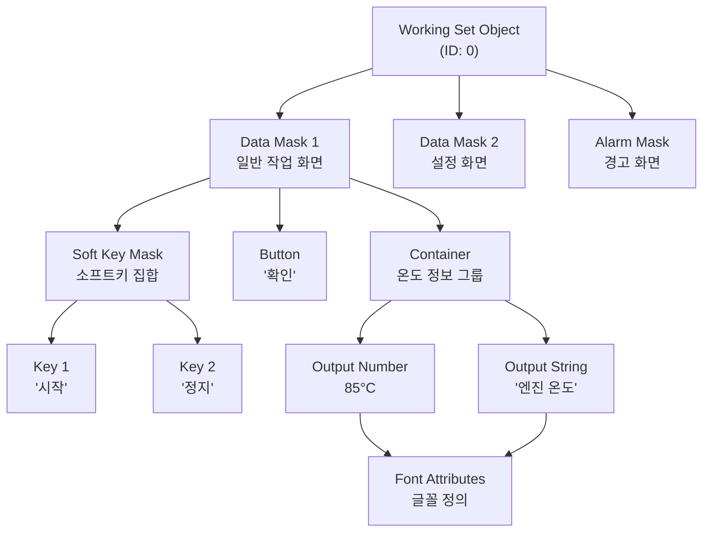
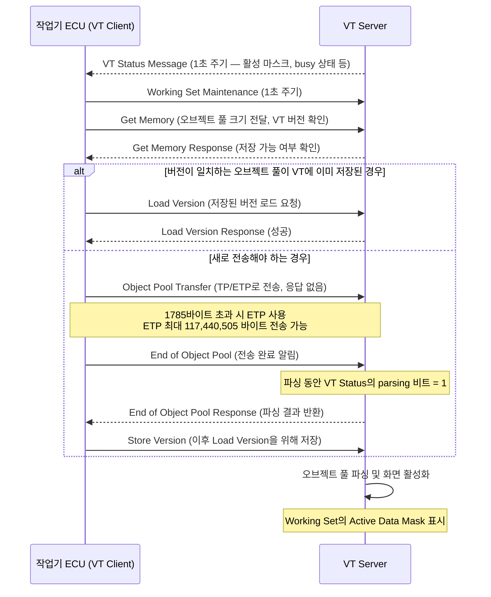

# VT 오브젝트 풀 (Object Pool)

::: info 학습 목표
- 오브젝트 풀의 개념과 바이너리 구조를 설명할 수 있다.
- 주요 오브젝트 타입의 역할을 구분할 수 있다.
- 오브젝트 간 계층 관계(Working Set → Data Mask → 자식 오브젝트)를 이해한다.
- 오브젝트 풀 전송 과정의 각 단계를 순서대로 설명할 수 있다.
- 간단한 화면을 XML(IOP) 형태로 구성할 수 있다.
:::

## 1. 오브젝트 풀이란

<strong>오브젝트 풀(Object Pool)</strong>은 VT 화면 전체를 정의하는 <strong>바이너리 데이터 구조</strong>이다. 작업기 ECU의 플래시 메모리에 저장되어 있다가, VT 연결 시 VT로 전송된다.

각 오브젝트는 세 가지 요소로 구성된다.

```
[Object ID: 16bit] [Object Type: 8bit] [속성(Attribute) 목록...]
```

- **Object ID**: 0x0000 ~ 0xFFFE 범위의 고유 식별자(한 Working Set의 풀 안에서만 유일하면 된다). 0xFFFF는 NULL Object ID로 예약
- **Object Type**: 오브젝트 종류를 나타내는 1바이트 코드
- **속성**: 오브젝트 타입에 따라 위치, 크기, 색상, 자식 오브젝트 목록 등

### 설계부터 전송까지

```
IOP XML 파일 설계
       ↓
바이너리 변환 (툴체인 사용)
       ↓
ECU 플래시에 저장
       ↓
VT 연결 시 전송
       ↓
VT가 화면 렌더링
```

XML(IOP 형식)로 화면을 설계하고 빌드 시 바이너리로 변환하는 방식이 일반적이다. 이를 통해 설계 시점에는 가독성을, 런타임에는 크기 효율성을 모두 확보한다.

## 2. 오브젝트 타입 총정리

ISO 11783-6에는 40여 가지 오브젝트 타입이 정의되어 있다(v6 기준 Type 코드 0~48). 역할별로 분류하면 다음과 같다.

### 컨테이너 및 화면 구조

| 타입 이름 | Type 코드 | 역할 |
|-----------|-----------|------|
| **Working Set Object** | 0 | 오브젝트 풀의 루트. 작업기 전체를 대표 |
| **Data Mask** | 1 | 일반 화면(마스크). 실제 UI가 표시되는 단위 |
| **Alarm Mask** | 2 | 경고/알람 전용 화면. 우선순위로 Data Mask 위에 표시 |
| **Container** | 3 | 여러 오브젝트를 묶는 그룹. 가시성 토글 가능 |
| **Window Mask** | 34 | Version 4+. 복수 윈도우 지원 |

### 소프트키 및 버튼

| 타입 이름 | Type 코드 | 역할 |
|-----------|-----------|------|
| **Soft Key Mask** | 4 | Data Mask에 연결되는 소프트키 버튼 집합 |
| **Key** | 5 | 소프트키 개별 버튼 |
| **Button** | 6 | 화면 내 일반 버튼 오브젝트 |
| **Key Group** | 35 | Version 4+. 키 그룹 |

### 입력 오브젝트

| 타입 이름 | Type 코드 | 역할 |
|-----------|-----------|------|
| **Input Boolean** | 7 | 체크박스 등 불리언 입력 |
| **Input String** | 8 | 문자열 입력 필드 |
| **Input Number** | 9 | 숫자 입력 필드 |
| **Input List** | 10 | 목록 선택 입력 |

### 출력 오브젝트

| 타입 이름 | Type 코드 | 역할 |
|-----------|-----------|------|
| **Output String** | 11 | 문자열 출력 |
| **Output Number** | 12 | 숫자 출력 (변수 참조 가능) |
| **Output Line** | 13 | 선 그리기 |
| **Output Rectangle** | 14 | 사각형 그리기 |
| **Output Ellipse** | 15 | 타원 그리기 |
| **Output Polygon** | 16 | 다각형 그리기 |
| **Output Meter** | 17 | 미터 게이지 |
| **Output Linear Bar Graph** | 18 | 선형 막대 그래프 |
| **Output Arched Bar Graph** | 19 | 호형 막대 그래프 |
| **Picture Graphic** | 20 | 비트맵 이미지 |
| **Output List** | 37 | 목록 출력 (Version 4+) |

### 속성 오브젝트

| 타입 이름 | Type 코드 | 역할 |
|-----------|-----------|------|
| **Font Attributes** | 23 | 폰트 크기, 색상, 스타일 정의 |
| **Line Attributes** | 24 | 선 색상, 두께, 스타일 정의 |
| **Fill Attributes** | 25 | 채우기 색상, 패턴 정의 |
| **Input Attributes** | 26 | 입력 필드의 유효 문자 목록 |

### 기타

| 타입 이름 | Type 코드 | 역할 |
|-----------|-----------|------|
| **Number Variable** | 21 | 공유 숫자 변수 |
| **String Variable** | 22 | 공유 문자열 변수 |
| **Object Pointer** | 27 | 다른 오브젝트를 참조하는 포인터 |
| **Macro** | 28 | 이벤트 기반 자동화 명령 목록 |
| **External Object Pointer** | 43 | 다른 Working Set의 오브젝트 참조 (Version 5+) |

### 직접 눌러 보기

아래는 오브젝트 타입별로 화면에 어떻게 그려지는지, 그리고 운전자가 누를 때 VT가 어떤 메시지를 내보내는지를 재현한 시뮬레이터다. 오브젝트를 누르면 해당 타입 설명과 실제 8바이트 메시지가 함께 표시된다.

<VtObjectPoolDemo />

출력 오브젝트(Output String·Output Number·Output Meter 등)는 눌러도 메시지가 나가지 않는다. 입력 오브젝트와 Button·Key만 운전자 조작을 Working Set에 통지한다. 메시지 종류와 바이트 배치는 [CH17 VT 명령어](/study/isobus/17-vt-commands)에서 더 자세히 다룬다.

## 3. 오브젝트 간 계층 관계

오브젝트들은 트리 구조로 조직된다. <strong>Working Set Object</strong>가 루트이며, 모든 화면과 요소가 그 아래에 위치한다.


```mermaid
graph TD
    WS["Working Set Object<br>(ID: 0)"]
    DM1["Data Mask 1<br>일반 작업 화면"]
    DM2["Data Mask 2<br>설정 화면"]
    AM["Alarm Mask<br>경고 화면"]
    SKM["Soft Key Mask<br>소프트키 집합"]
    SK1["Key 1<br>'시작'"]
    SK2["Key 2<br>'정지'"]
    BTN["Button<br>'확인'"]
    CON["Container<br>온도 정보 그룹"]
    ON["Output Number<br>85°C"]
    OS["Output String<br>'엔진 온도'"]
    FA["Font Attributes<br>글꼴 정의"]

    WS --> DM1
    WS --> DM2
    WS --> AM
    DM1 --> SKM
    DM1 --> CON
    DM1 --> BTN
    SKM --> SK1
    SKM --> SK2
    CON --> ON
    CON --> OS
    ON --> FA
    OS --> FA
```

계층의 핵심 규칙:

- <strong>Data Mask</strong>는 Working Set에서 active mask로 지정되어야 화면에 표시된다.
- <strong>Soft Key Mask</strong>는 Data Mask에 연결되어 함께 활성화된다.
- **속성 오브젝트**(Font, Line, Fill Attributes)는 여러 오브젝트에서 공유할 수 있다.
- <strong>Container</strong>는 가시성(visible/hidden) 속성으로 동적으로 표시/숨김이 가능하다.

## 4. 오브젝트 풀 전송 과정

작업기 ECU가 VT에 처음 연결될 때 오브젝트 풀을 전송하는 절차는 다음과 같다.


```mermaid
sequenceDiagram
    participant ECU as 작업기 ECU (VT Client)
    participant VT as VT Server

    VT-->>ECU: VT Status Message (1초 주기 — 활성 마스크, busy 상태 등)
    ECU->>VT: Working Set Maintenance (1초 주기)

    ECU->>VT: Get Memory (오브젝트 풀 크기 전달, VT 버전 확인)
    VT-->>ECU: Get Memory Response (저장 가능 여부 확인)

    alt 버전이 일치하는 오브젝트 풀이 VT에 이미 저장된 경우
        ECU->>VT: Load Version (저장된 버전 로드 요청)
        VT-->>ECU: Load Version Response (성공)
    else 새로 전송해야 하는 경우
        ECU->>VT: Object Pool Transfer (TP/ETP로 전송, 응답 없음)
        Note over ECU, VT: 1785바이트 초과 시 ETP 사용<br>ETP 최대 117,440,505 바이트 전송 가능
        ECU->>VT: End of Object Pool (전송 완료 알림)
        Note over VT: 파싱 동안 VT Status의 parsing 비트 = 1
        VT-->>ECU: End of Object Pool Response (파싱 결과 반환)
        ECU->>VT: Store Version (이후 Load Version을 위해 저장)
    end

    VT->>VT: 오브젝트 풀 파싱 및 화면 활성화
    Note over VT: Working Set의 Active Data Mask 표시
```

### VT 능력 질의와 스케일링

전송 전에 Working Set Master는 Get Memory 외에도 기술 데이터(Technical data) 메시지 — <strong>Get Number of Soft Keys</strong>, <strong>Get Text Font Data</strong>, <strong>Get Hardware</strong> 등 — 로 VT의 소프트키 수, 지원 폰트·스타일, 색상 모드, Data Mask 픽셀 크기를 질의할 수 있다. Master는 이 응답에 맞춰 풀을 조정해야 한다.

- **위치·크기**: VT의 Data Mask 영역·designator 크기에 맞춰 오브젝트의 위치와 크기를 스케일한다.
- **폰트**: 정의된 영역에 best-fit 알고리즘으로 폰트를 선택한다. 최소 폰트는 6×8이며, 스케일 결과가 그보다 작으면 6×8을 쓴다.
- <strong>Picture Graphic</strong>은 VT가 오브젝트의 width 속성에 따라 자동 스케일한다.

### 전송 완료 대기와 오류 처리

End of Object Pool message를 보낸 뒤 VT는 파싱을 마칠 때까지 VT Status message의 parsing 비트를 1로 유지한다. Working Set Master는 parsing 비트가 0인 VT Status message가 <strong>연속 3번</strong> 수신될 때까지 End of Object Pool response를 기다려야 하고, 그때까지 응답이 없으면 메시지 미도달로 간주해 최대 3회 재시도할 수 있다(Load Version도 같은 대기 규칙을 쓴다).

End of Object Pool response가 오류(풀 오류, 메모리 고갈 등)를 담으면 VT는 풀을 휘발성 메모리에서 삭제하고 Working Set 중단을 운전자에게 알람으로 알린다. 이 응답을 받은 ECU는 장치의 안전한 셧다운 절차를 제공하는 fail-safe 운전 모드로 들어가야 한다.

### 버전 관리 (Store/Load Version)

오브젝트 풀이 크면 전송에 수 초가 걸릴 수 있다. 이를 개선하기 위해 VT는 오브젝트 풀을 <strong>버전 라벨(7문자 문자열, Version 5+는 32문자 확장 라벨도 지원)</strong>과 함께 비휘발성 저장소에 저장할 수 있다. 다음 연결 시 **Load Version** 명령만으로 저장된 풀을 즉시 복원하여 전송 시간을 절약한다.

## 5. 간단한 화면 구성 실습

"엔진 온도: 85°C"를 표시하는 화면을 구성해 보겠다.

### 필요한 오브젝트 구성


### IOP XML 예시

:::info IOP는 표준 용어가 아니다
ISO 11783-6 원문에는 "IOP"라는 표기가 없다. 표준은 이것을 그냥 <strong>object pool</strong>이라 부르며, `.iop`는 오브젝트 풀을 설계·빌드하는 툴체인이 관례적으로 쓰는 파일 확장자다. 아래 XML도 표준이 정의한 형식이 아니라 툴이 쓰는 중간 표현이며, 실제로 버스에 오르는 것은 이를 변환한 바이너리 레코드다.
:::

```xml
<objectpool>

  <!-- Working Set: 오브젝트 풀의 루트 -->
  <workingset id="0"
              background_colour="1"
              selectable="true"
              active_mask="1">
    <!-- active_mask="1" → Data Mask ID 1이 초기 화면 -->
  </workingset>

  <!-- Font Attributes: 검정, 24×32 픽셀 폰트 -->
  <fontattributes id="30"
                  font_colour="0"
                  font_size="6"
                  font_style="0" />
  <!-- font_colour 0 = 검정(VT 표준 팔레트 기준. 1 = 흰색) -->
  <!-- font_size 6 = 24×32 픽셀 -->

  <!-- Data Mask: 실제 화면 영역 -->
  <datamask id="1"
            background_colour="1"
            soft_key_mask="65535">
    <!-- soft_key_mask 65535 = 소프트키 없음 -->
    <include_object id="10" pos_x="10" pos_y="20" />
    <include_object id="11" pos_x="130" pos_y="20" />
  </datamask>

  <!-- Output String: "엔진 온도:" 레이블 -->
  <outputstring id="10"
                width="120"
                height="30"
                font_attributes="30"
                justification="0"
                value="엔진 온도:" />

  <!-- Output Number: 실시간 온도 값 -->
  <outputnumber id="11"
                width="80"
                height="30"
                font_attributes="30"
                variable_reference="65535"
                value="85"
                offset="0"
                scale="1.0"
                number_of_decimals="0"
                format="true"
                justification="0" />
  <!-- value="85": 초기값 85°C -->
  <!-- ECU가 Change Numeric Value 명령으로 실시간 갱신 -->

</objectpool>
```

### 런타임 데이터 갱신

화면이 표시된 후, ECU는 실측 온도가 바뀔 때마다 `Change Numeric Value` 명령으로 Output Number의 값을 갱신한다. VT 명령은 ECU→VT 방향 PGN 0xE700(59136)으로 보내고, VT의 응답은 VT→ECU 방향 PGN 0xE600(58880)으로 돌아온다. VT는 별도의 오브젝트 풀 재전송 없이 해당 오브젝트만 업데이트하여 화면에 반영한다.

```
ECU → VT: Change Numeric Value
  Object ID: 0x000B (Output Number ID 11)
  New Value : 92    (92°C로 갱신)
```

::: tip 핵심 정리
- 오브젝트 풀은 VT 화면 전체를 정의하는 바이너리 구조이며, 각 오브젝트는 ID + 타입 + 속성으로 구성된다.
- Working Set → Data Mask → Container/Output/Input → 속성 오브젝트 순의 계층 구조를 가진다.
- 오브젝트 풀 전송 시 TP/ETP를 사용하며(1785바이트 초과 시 ETP), Store/Load Version으로 재전송 시간을 절약한다.
- 화면 초기화 후 ECU는 Change Numeric Value 등의 명령어로 특정 오브젝트만 실시간 갱신한다.
:::

## 6. 오브젝트 레코드를 바이트로 보기

§2의 타입 표는 이름과 역할을 보여줄 뿐, 실제로 버스에 오를 때 바이트가 어떻게 배치되는지는 보여주지 않는다. Annex B의 공통 규칙은 <strong>모든 오브젝트 레코드가 Object ID(2바이트, 리틀엔디언) + Object Type(1바이트) + 타입별 속성</strong> 순으로 이어진다는 것이다. §5의 "엔진 온도: 85°C" 화면을 이루는 세 오브젝트(Font Attributes, Output String, Output Number)를 실제 바이트로 펼쳐본다.

::: info 정확도 표기
아래 표의 값 중 §5 XML에 명시된 속성(width, height, font_attributes, justification, value, font_colour, font_size, font_style 등)은 ISO 11783-6 Annex B 정의를 그대로 적용한 <strong>확정값</strong>이다. XML에 없는 속성(background colour, Options, 일부 Font type)은 "(가정)"으로 표시했고, 실제 툴체인 결과와 다를 수 있다.
:::

### Font Attributes(ID 30) — 7바이트

Output String·Output Number가 공유 참조하는 오브젝트부터 본다.

| 오프셋 | 바이트(hex) | 크기 | XML 속성 | 설명 |
|---|---|---|---|---|
| 0 | `1E 00` | 2 | `id="30"` | Object ID = 30, 리틀엔디언 |
| 2 | `17` | 1 | — | Object Type = 23(0x17) = Font Attributes |
| 3 | `00` | 1 | `font_colour="0"` | 검정 |
| 4 | `06` | 1 | `font_size="6"` | 24×32 픽셀(고정폭 크기 6) |
| 5 | `00` (가정) | 1 | (미지정) | Font type — XML에 없는 속성. 코드플레인 0(기본 ASCII 계열)으로 가정 |
| 6 | `00` | 1 | `font_style="0"` | 일반 텍스트(Bold·Italic 등 비트 없음) |

### Output String(ID 10) — 30바이트

| 오프셋 | 바이트(hex) | 크기 | XML 속성 | 설명 |
|---|---|---|---|---|
| 0 | `0A 00` | 2 | `id="10"` | Object ID = 10 |
| 2 | `0B` | 1 | — | Object Type = 11(0x0B) = Output String |
| 3 | `78 00` | 2 | `width="120"` | 120픽셀 |
| 5 | `1E 00` | 2 | `height="30"` | 30픽셀 |
| 7 | `01` (가정) | 1 | (미지정) | Background colour — Data Mask와 같은 흰색으로 가정 |
| 8 | `1E 00` | 2 | `font_attributes="30"` | Font Attributes ID 30 참조 |
| 10 | `00` (가정) | 1 | (미지정) | Options — 불투명·Auto-Wrap 없음으로 가정 |
| 11 | `FF FF` | 2 | (미지정, 추정) | Variable reference — XML에 없지만 `value`가 직접 있으므로 스펙상 NULL(65535) 확정 |
| 13 | `00` | 1 | `justification="0"` | 좌측 정렬 |
| 14 | `0E 00` | 2 | (계산값) | Length = 14바이트(아래 Value 참고) |
| 16 | `FF FE D4 C5 C0 C9 20 00 28 C6 C4 B3 3A 00` | 14 | `value="엔진 온도:"` | WideString(UTF-16LE) — BOM(`FF FE`) + "엔"(U+C5D4)"진"(U+C9C0)" "(U+0020)"온"(U+C628)"도"(U+B3C4)":"(U+003A) |

`value` 속성이 한글을 담고 있어 8-bit 인코딩(Annex K 코드플레인)으로는 표현할 수 없다. 그래서 실제 바이너리 변환 시 이 Value는 <strong>WideString</strong>으로 인코딩된다 — 첫 2바이트가 `FF FE`(BOM)로 시작하는 것으로 VT가 WideString임을 판별한다(§3.3의 "첫 2바이트가 FF16 FE16이면 WideString" 규칙). XML 자체에는 이를 나타내는 플래그가 없고, 바이너리 변환 도구가 문자열 내용을 보고 결정한다.

### Output Number(ID 11) — 28바이트

| 오프셋 | 바이트(hex) | 크기 | XML 속성 | 설명 |
|---|---|---|---|---|
| 0 | `0B 00` | 2 | `id="11"` | Object ID = 11 |
| 2 | `0C` | 1 | — | Object Type = 12(0x0C) = Output Number |
| 3 | `50 00` | 2 | `width="80"` | 80픽셀 |
| 5 | `1E 00` | 2 | `height="30"` | 30픽셀 |
| 7 | `01` (가정) | 1 | (미지정) | Background colour — 위와 동일하게 가정 |
| 8 | `1E 00` | 2 | `font_attributes="30"` | Font Attributes ID 30 참조 |
| 10 | `00` (가정) | 1 | (미지정) | Options — 불투명·선행0 없음·0도 표시·반올림으로 가정 |
| 11 | `FF FF` | 2 | `variable_reference="65535"` | NULL — Value 속성 직접 사용 |
| 13 | `55 00 00 00` | 4 | `value="85"` | 원시값 85(unsigned 32bit, LE) |
| 17 | `00 00 00 00` | 4 | `offset="0"` | Offset(signed 32bit) |
| 21 | `00 00 80 3F` | 4 | `scale="1.0"` | Scale — IEEE-754 단정밀도 부동소수 1.0(LE) |
| 25 | `00` | 1 | `number_of_decimals="0"` | 소수점 이하 0자리 |
| 26 | `01` (가정) | 1 | `format="true"` | Format(0=고정소수/1=지수 표기) — XML의 `true` 표기가 이 0/1 enum과 정확히 어떻게 대응하는지 이 챕터 범위에서는 확정할 수 없어 1로 가정 |
| 27 | `00` | 1 | `justification="0"` | 좌측 정렬 |

표시값 계산식 `(value + Offset) × Scale = (85 + 0) × 1.0 = 85`로, XML 주석의 "초기값 85°C"와 일치한다.

### Object Pool Transfer에 실리는 순서

Annex C.2.3에 따르면 Object Pool Transfer message는 <strong>Byte 1 = 함수코드 `0x11`</strong> 뒤에 오브젝트 레코드가 그대로 이어지는 구조다. §5 화면의 풀 전체를 구성하면 다음과 같다.

| 순서 | 오브젝트 | 바이트 수 | 비고 |
|---|---|---|---|
| 1 | Working Set(ID 0) | 10 | designator 오브젝트 0개로 단순화한 크기. Annex B.1은 <strong>Soft Key designator용 오브젝트를 최소 1개</strong> 포함해야 한다고 규정하지만 §5 XML은 이를 생략했으므로, 실제 툴체인이 만드는 정확한 바이트 수는 이보다 클 수 있다 |
| 2 | Data Mask(ID 1) | 20 | 자식 오브젝트 2개(Output String 10, Output Number 11) 포함 |
| 3 | Font Attributes(ID 30) | 7 | 위 표 참고 |
| 4 | Output String(ID 10) | 30 | 위 표 참고 |
| 5 | Output Number(ID 11) | 28 | 위 표 참고 |
| 합계 | | <strong>95</strong> | Object Pool Transfer message 전체 길이 = 1(함수코드) + 95 = 96바이트 |

이 95바이트가 [CH15 §6](/study/isobus/15-vt-basics#_6-vt-연결-따라가기) 타임라인의 Get Memory 메시지에 그대로 들어가는 Memory Required 값이다.

### ETP가 필요해지는 지점

§4에서 "1785바이트 초과 시 ETP"라고 했다. 이번 예제 풀은 95바이트라 TP 한 세션이면 충분하다. 하지만 오브젝트 5개의 평균 크기가 95 ÷ 5 = 19바이트인 것을 기준으로 보면, <strong>1785 ÷ 19 ≈ 94개</strong> — 이 정도 크기의 오브젝트 90여 개만 모여도 ETP 임계값을 넘는다. 실제 작업기 화면은 여러 Data Mask에 버튼·라벨·컨테이너가 수십~수백 개씩 들어가는 경우가 흔하고, Picture Graphic처럼 원시 비트맵 데이터를 통째로 담는 오브젝트(§2 "Picture Graphic")가 하나만 있어도 크기가 급격히 커진다. 풀이 조금만 커져도 ETP 경로를 타게 되는 이유다.

:::details 파이썬으로 바이트 구성 검산해 보기
```python
def le(v, n):
    return v.to_bytes(n, "little", signed=False)


# Font Attributes(ID 30)
font_attr = le(30, 2) + bytes([23, 0, 6, 0, 0])
assert font_attr.hex(" ").upper() == "1E 00 17 00 06 00 00"
assert len(font_attr) == 7

# Output String(ID 10) — Value는 WideString(BOM + UTF-16LE)
text = "엔진 온도:"
value = b"\xFF\xFE" + text.encode("utf-16-le")
assert value.hex(" ").upper() == "FF FE D4 C5 C0 C9 20 00 28 C6 C4 B3 3A 00"
assert len(value) == 14

output_string = (
    le(10, 2) + bytes([11])
    + le(120, 2) + le(30, 2)
    + bytes([0x01])          # background colour(가정)
    + le(30, 2)               # font attributes
    + bytes([0x00])           # options(가정)
    + le(0xFFFF, 2)            # variable reference(NULL)
    + bytes([0])               # justification
    + le(len(value), 2)
    + value
)
assert len(output_string) == 30

# Output Number(ID 11)
import struct
scale = struct.pack("<f", 1.0)
assert scale.hex(" ").upper() == "00 00 80 3F"

output_number = (
    le(11, 2) + bytes([12])
    + le(80, 2) + le(30, 2)
    + bytes([0x01])            # background colour(가정)
    + le(30, 2)
    + bytes([0x00])            # options(가정)
    + le(0xFFFF, 2)
    + le(85, 4)                 # value
    + (0).to_bytes(4, "little", signed=True)  # offset
    + scale
    + bytes([0, 1, 0])          # decimals, format(가정=1), justification
)
assert len(output_number) == 28

pool_size = len(font_attr) + len(output_string) + len(output_number) + 10 + 20  # + Working Set(10) + Data Mask(20)
assert pool_size == 95
print("풀 전체 크기:", pool_size, "바이트 — Get Memory의 Memory Required와 일치")
```
:::

::: tip 핵심 정리
- 오브젝트 레코드는 항상 Object ID(2바이트 LE) + Type(1바이트) + 속성 순이며, 값의 크기·순서는 오브젝트 타입마다 Annex B가 고정한다.
- IOP XML의 속성 이름은 사람이 읽기 위한 것이고, 바이너리에서는 고정된 오프셋의 바이트 값일 뿐이다. XML에 없는 속성도 바이너리에는 반드시 존재한다(위 예제의 "(가정)" 항목들).
- 문자열에 비-ASCII 문자가 있으면 8-bit 인코딩 대신 WideString(BOM + UTF-16LE)으로 바뀐다 — XML에는 이를 나타내는 표시가 없다.
- Object Pool Transfer message는 함수코드 `0x11` 뒤에 오브젝트 레코드가 그대로 이어지는 단순한 구조이며, 풀이 커질수록(오브젝트 수·이미지 데이터) TP의 1785바이트 한계를 넘어 ETP가 필요해진다.
:::

## 다음 챕터

- 다음 : [VT 명령어와 상호작용](/study/isobus/17-vt-commands)
