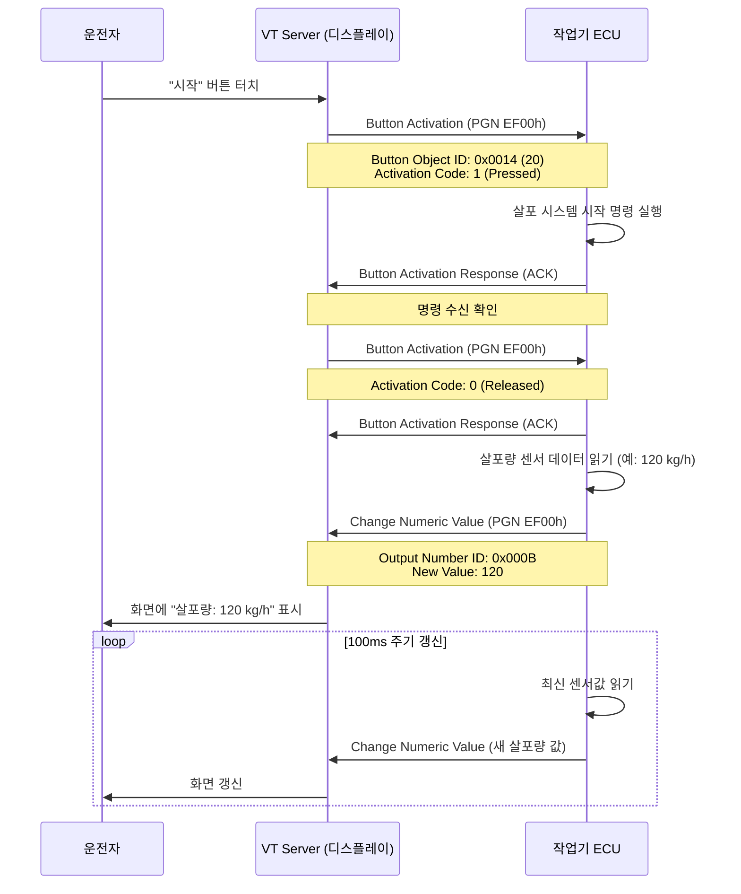
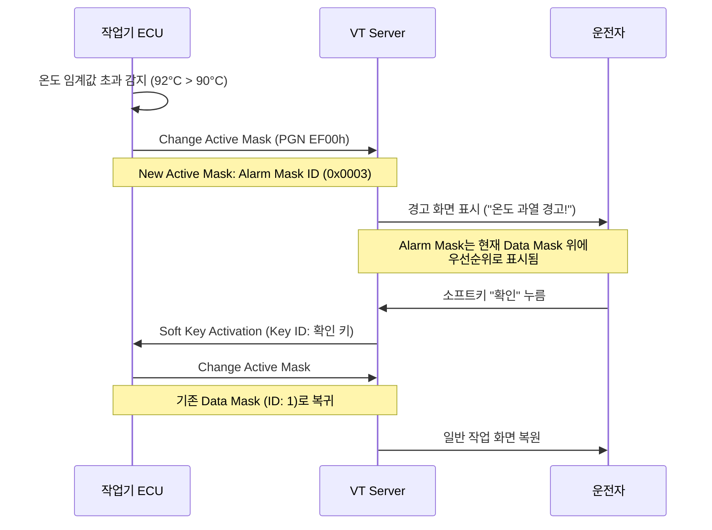

# VT 명령어와 상호작용

::: info 학습 목표
- VT → ECU 방향과 ECU → VT 방향 명령어의 차이를 구분할 수 있다.
- 주요 명령어의 이름, PGN, 용도를 설명할 수 있다.
- 매크로의 개념과 이벤트 바인딩 방식을 이해한다.
- 버튼 클릭부터 화면 갱신까지 전체 상호작용 흐름을 추적할 수 있다.
:::

---

## 1. VT → ECU 명령어

VT Server가 사용자 입력이나 화면 상태 변화를 작업기 ECU(VT Client)에게 알리는 메시지이다. ECU는 이 메시지를 수신해 작업 제어 로직을 실행한다.

모든 VT→ECU 메시지는 **Peer-to-Peer** 방식으로 전송되며, PGN <strong>0xE600 (EF00h)</strong>을 기반으로 한다.

| 명령어 이름 | PGN | 트리거 조건 | 주요 데이터 |
|-------------|-----|-------------|-------------|
| **Soft Key Activation** | EF00h | 소프트키(Key 오브젝트) 누름/뗌 | Key Object ID, 활성화 코드 (Pressed/Released/Held) |
| **Button Activation** | EF00h | Button 오브젝트 누름/뗌 | Button Object ID, 활성화 코드 |
| **Pointing Event** | EF00h | 터치스크린 탭/드래그 | X 좌표, Y 좌표, 터치 타입 |
| **VT Select Input Object** | EF00h | 입력 필드 포커스 변경 | Input Object ID |
| **VT ESC Message** | EF00h | ESC 키 입력 (입력 취소) | Input Object ID |
| **VT Change Active Mask** | EF00h | 화면 전환 완료 알림 | New Active Data Mask ID |
| **VT On User-Layout Hidden or Shown** | EF00h | 사용자 레이아웃 표시 상태 변경 | Object ID, 상태 |

### Activation Code 상세

Button Activation과 Soft Key Activation의 `활성화 코드`는 다음 값을 가진다.

| 코드 | 의미 |
|------|------|
| 0 | Released (눌렀다 뗌) |
| 1 | Pressed (누름) |
| 2 | Held (길게 누르는 중, 반복 전송) |
| 3 | Aborted (누르다 취소) |

---

## 2. ECU → VT 명령어

작업기 ECU(VT Client)가 VT Server로 전송하는 명령어이다. 센서 데이터 갱신, 화면 전환, 오브젝트 속성 변경 등에 사용된다.

ECU → VT 명령어도 **PGN 0xE600 (EF00h)** Peer-to-Peer 메시지로 전송된다.

### 값 갱신 명령어

| 명령어 이름 | 대상 오브젝트 | 설명 |
|-------------|---------------|------|
| **Change Numeric Value** | Output Number, Input Number, 변수 등 | 숫자 값을 새 값으로 갱신 |
| **Change String Value** | Output String, Input String | 문자열 값을 새 값으로 갱신 |
| **Change List Item** | Input List, Output List | 목록의 특정 항목을 변경 |

### 화면 전환 명령어

| 명령어 이름 | 설명 |
|-------------|------|
| **Change Active Mask** | Working Set의 활성 Data Mask 또는 Alarm Mask를 교체 |
| **Change Soft Key Mask** | Data Mask에 연결된 Soft Key Mask를 교체 |

### 속성 변경 명령어

| 명령어 이름 | 설명 |
|-------------|------|
| **Change Attribute** | 오브젝트의 특정 속성(배경색, 크기, 위치 등)을 런타임에 변경 |
| **Change Priority** | Alarm Mask의 우선순위를 변경 |
| **Change Size** | 오브젝트의 너비/높이를 변경 |
| **Change Child Location** | 컨테이너 내 자식 오브젝트의 위치를 변경 |
| **Change Child Position** | Data Mask 내 오브젝트의 절대 위치를 변경 |

### 표시 제어 명령어

| 명령어 이름 | 설명 |
|-------------|------|
| **Hide/Show Object** | Container 또는 오브젝트의 가시성 토글 |
| **Enable/Disable Object** | 입력 오브젝트의 활성화/비활성화 |

### Change Numeric Value 메시지 구조 예시

```
Byte 1: 0xA8          ← Command Byte (Change Numeric Value)
Byte 2: LSB of Object ID
Byte 3: MSB of Object ID
Byte 4: 0xFF          ← 예약 바이트
Byte 5-8: 새로운 값   ← 32bit unsigned integer (Little Endian)
```

---

## 3. 매크로 (Macro)

<strong>매크로(Macro)</strong>는 오브젝트 풀에 사전 정의된 **이벤트 기반 자동 동작** 목록이다. 특정 이벤트가 발생하면 VT가 자동으로 매크로를 실행한다. ECU에 메시지를 보내지 않고도 VT 레벨에서 화면 변화를 처리할 수 있어, ECU 부하를 줄이고 반응 속도를 높일 수 있다.

### 이벤트 종류

| 이벤트 이름 | 발생 조건 |
|-------------|-----------|
| **On Show** | 오브젝트가 화면에 표시될 때 |
| **On Hide** | 오브젝트가 화면에서 숨겨질 때 |
| **On Enable** | 입력 오브젝트가 활성화될 때 |
| **On Disable** | 입력 오브젝트가 비활성화될 때 |
| **On Change Active Mask** | 활성 마스크가 변경될 때 |
| **On Change Soft Key Mask** | Soft Key Mask가 변경될 때 |
| **On Key Press** | Key 또는 Button이 눌릴 때 |
| **On Key Release** | Key 또는 Button이 해제될 때 |
| **On Change Attribute** | 오브젝트 속성이 변경될 때 |
| **On Change String Value** | 문자열 값이 변경될 때 |
| **On Input Field Selection** | 입력 필드가 선택될 때 |
| **On ESC** | ESC 이벤트 발생 시 |
| **On VT Selection** | VT가 Working Set을 선택할 때 |

### 매크로 바인딩 XML 예시

아래는 "설정 화면" 버튼을 누를 때 Active Mask를 ID 2(설정 화면)로 변경하는 매크로이다.

```xml
<!-- 매크로 정의: Active Mask를 ID 2로 변경 -->
<macro id="50">
  <change_active_mask working_set_id="0" new_active_mask="2" />
</macro>

<!-- Button에 이벤트 바인딩 -->
<button id="20"
        width="100" height="40"
        background_colour="7"
        border_colour="8"
        key_code="1">
  <macro_ref event_id="9" macro_id="50" />
  <!-- event_id 9 = On Key Press -->
  <outputstring id="21" ... value="설정" />
</button>
```

매크로 내에서는 여러 명령을 순차적으로 나열할 수 있다.

```xml
<macro id="51">
  <!-- 순차 실행: 경고 컨테이너 표시 후 알람 사운드 출력 -->
  <show_hide_object object_id="60" value="show" />
  <change_attribute object_id="1"
                    attribute_id="7"
                    value="255" />
</macro>
```

---

## 4. VT 상호작용 시퀀스

사용자가 VT의 "시작" 버튼을 클릭했을 때, 살포 시스템이 시작되고 화면의 상태값이 갱신되는 전체 흐름이다.



### Alarm Mask 전환 예시 (경고 발생 시)



---

::: tip 핵심 정리
- VT → ECU 명령어는 사용자 입력 이벤트(버튼, 소프트키, 터치, ESC 등)를 ECU에 전달한다.
- ECU → VT 명령어는 화면 값 갱신(Change Numeric/String Value), 화면 전환(Change Active Mask), 속성 변경에 사용된다.
- 모든 명령어는 PGN EF00h(Peer-to-Peer)로 전송된다.
- 매크로는 오브젝트 풀에 사전 정의된 이벤트 기반 자동 동작으로, ECU 개입 없이 VT 레벨에서 실행된다.
- 버튼 클릭 → Button Activation → ECU 처리 → Change Numeric Value → 화면 갱신이 기본 상호작용 패턴이다.
:::

## 다음 챕터

- 다음 : [Task Controller (TC) 기초](/study/isobus/18-tc-basics)
