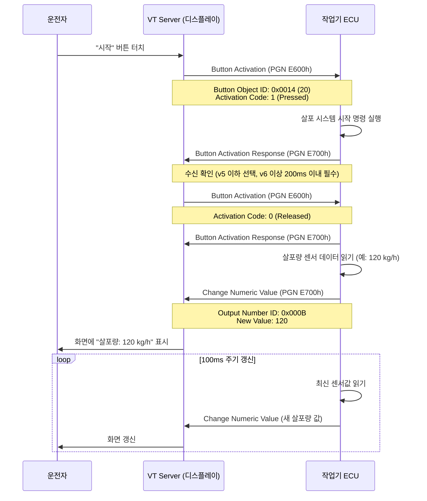
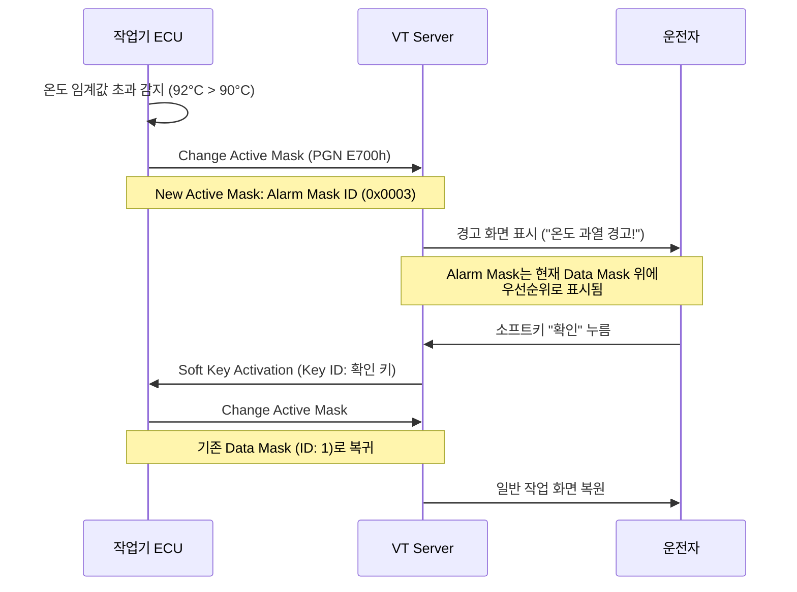

# VT 명령어와 상호작용

::: info 학습 목표
- VT → ECU 방향과 ECU → VT 방향 명령어의 차이를 구분할 수 있다.
- 주요 명령어의 이름, PGN, 용도를 설명할 수 있다.
- 매크로의 개념과 이벤트 바인딩 방식을 이해한다.
- 버튼 클릭부터 화면 갱신까지 전체 상호작용 흐름을 추적할 수 있다.
:::

## 1. VT → ECU 명령어

VT Server가 사용자 입력이나 화면 상태 변화를 작업기 ECU(VT Client)에게 알리는 메시지이다. ECU는 이 메시지를 수신해 작업 제어 로직을 실행한다.

모든 VT→ECU 메시지는 **목적지 지정(destination-specific)** 방식으로 전송되며, PGN <strong>0xE600</strong>(58880)을 사용한다. 반대 방향인 ECU→VT 메시지에는 별도의 PGN <strong>0xE700</strong>(59136)이 예약되어 있다.

| 명령어 이름 | PGN | 트리거 조건 | 주요 데이터 |
|-------------|-----|-------------|-------------|
| **Soft Key Activation** | E600h | 소프트키(Key 오브젝트) 누름/뗌 | Key Object ID, 활성화 코드 (Pressed/Released/Held) |
| **Button Activation** | E600h | Button 오브젝트 누름/뗌 | Button Object ID, 활성화 코드 |
| **Pointing Event** | E600h | 터치스크린 탭/드래그 | X 좌표, Y 좌표, 터치 타입 |
| **VT Select Input Object** | E600h | 입력 필드 포커스 변경 (운전자 조작·ESC에 의한 것만. ECU가 Select Input Object 명령으로 요청한 변경은 통지하지 않음) | Input Object ID |
| **VT ESC Message** | E600h | ESC 키 입력 (입력 취소) | Input Object ID |
| **VT Change Numeric Value** | E600h | 운전자가 Input Number·Input List·Input Boolean 등에 숫자 값 입력 완료 | Object ID, 새 값 |
| **VT Change String Value** | E600h | 운전자가 Input String에 문자열 입력 완료 | Object ID, 새 문자열 |
| **VT Change Active Mask** | E600h | 표시하려는 마스크·Key Group에서 누락 오브젝트 참조나 오류 감지 시 (심각한 오류면 풀 삭제까지 통지) | 마스크 Object ID, 에러 코드, 오류 오브젝트 ID |
| **VT On User-Layout Hidden or Shown** | E600h | 사용자 레이아웃 표시 상태 변경 | Object ID, 상태 |

운전자가 입력 필드에 값을 넣으면 <strong>VT Change Numeric Value / VT Change String Value message</strong>가 새 값을 ECU에 전달한다. 버튼 이벤트와 함께 사용자 입력이 ECU에 도달하는 핵심 경로다. 입력 오브젝트가 변수(Variable)를 참조하면 메시지에는 입력 오브젝트가 아니라 <strong>변수 오브젝트의 Object ID</strong>가 실린다. 한편 화면 전환 상태를 알고 싶다면 VT Change Active Mask(오류 통지용)가 아니라 <strong>VT Status message</strong>(활성 Working Set과 표시 중인 마스크 ID를 담아 초당 1회 브로드캐스트)를 참조해야 한다.

### Activation Code 상세

Button Activation과 Soft Key Activation의 `활성화 코드`는 다음 값을 가진다.

| 코드 | 의미 |
|------|------|
| 0 | Released (눌렀다 뗌) |
| 1 | Pressed (누름) |
| 2 | Held (길게 누르는 중, 반복 전송) |
| 3 | Aborted (누르다 취소) |

홀드 중에는 activation 메시지가 <strong>200 ms</strong>마다 반복 전송되며, Working Set은 메시지 간격이 300 ms를 넘으면 키가 릴리스된 것으로 처리해야 한다. 메시지에는 Object ID·활성화 코드 외에 Parent Object ID(표시 중인 마스크 또는 Key Group)와 key code(소프트키 코드 0은 알람 ACK 전용)도 실린다.

### Activation 응답 규칙과 TAN

Activation 메시지에는 ECU가 같은 내용을 반향(echo)하는 response가 정의되어 있다. v5 이하 조합에서는 응답이 선택이지만, <strong>v6 이상에서는 200 ms 이내 응답이 필수</strong>다. 300 ms 안에 응답이 없으면 VT는 최대 3회 재시도하고, 그래도 응답이 없으면 해당 Working Set의 unexpected shutdown으로 취급한다. v6부터는 메시지에 실리는 4비트 <strong>TAN(Transaction Number)</strong>으로, 빠르게 연속 발생할 수 있는 메시지-응답 쌍을 짝맞춘다.

## 2. ECU → VT 명령어

작업기 ECU(VT Client)가 VT Server로 전송하는 명령어이다. 센서 데이터 갱신, 화면 전환, 오브젝트 속성 변경 등에 사용된다.

ECU → VT 명령어는 <strong>PGN 0xE700</strong>(59136) 목적지 지정 메시지로 전송된다. 모든 명령에는 에러 코드를 담은 response가 정의되어 있으며, 송신자는 응답을 받은 뒤 다음 명령을 보내는 것이 원칙이다. 단, <strong>1.5초</strong> 안에 응답이 없으면 다음 명령을 보낼 수 있다.

### 값 갱신 명령어

| 명령어 이름 | 대상 오브젝트 | 설명 |
|-------------|---------------|------|
| **Change Numeric Value** (A8h) | Output Number, Input Number, 변수 등 | 숫자 값을 새 값으로 갱신 |
| **Change String Value** (B3h) | Output String, Input String | 문자열 값을 새 값으로 갱신 |
| **Change List Item** (B1h) | Input List, Output List | 목록의 특정 항목을 변경 |

### 화면 전환 명령어

| 명령어 이름 | 설명 |
|-------------|------|
| **Change Active Mask** (ADh) | Working Set의 활성 Data Mask 또는 Alarm Mask를 교체 |
| **Change Soft Key Mask** (AEh) | Data Mask에 연결된 Soft Key Mask를 교체 |

### 속성 변경 명령어

| 명령어 이름 | 설명 |
|-------------|------|
| **Change Attribute** (AFh) | AID(Attribute ID)가 부여된 속성(배경색, 폭·높이 등)을 런타임에 변경. 위치는 Change Child Location/Position, 문자열은 Change String Value를 사용 |
| **Change Priority** (B0h) | Alarm Mask의 우선순위를 변경 |
| **Change Size** (A6h) | 오브젝트의 너비/높이를 변경 |
| **Change Child Location** (A5h) | 부모 오브젝트 내 자식 오브젝트의 위치를 상대 이동 |
| **Change Child Position** (B4h) | 부모 오브젝트 좌상단 기준 절대 좌표로 자식 오브젝트의 위치를 변경 (Parent Object ID 함께 지정) |

### 표시 제어 명령어

| 명령어 이름 | 설명 |
|-------------|------|
| **Hide/Show Object** (A0h) | Container 오브젝트의 표시/숨김 제어. 개별 오브젝트를 숨기려면 Container로 묶어야 한다 |
| **Enable/Disable Object** (A1h) | 입력 오브젝트의 활성화/비활성화 |

### Change Numeric Value 메시지 구조 예시

```
Byte 1: 0xA8          ← Command Byte (Change Numeric Value)
Byte 2: LSB of Object ID
Byte 3: MSB of Object ID
Byte 4: 0xFF          ← 예약 바이트
Byte 5-8: 새로운 값   ← 32bit unsigned integer (Little Endian)
```

Byte 5~8의 값 크기는 대상 오브젝트 타입에 따라 다르다 — Input Boolean은 1바이트, Meter·Bar Graph류는 2바이트, Input/Output Number·Number Variable은 4바이트이며 미사용 바이트는 0으로 채운다. 위 예시는 4바이트(32bit) 오브젝트 기준이다.

## 3. 매크로 (Macro)

<strong>매크로(Macro)</strong>는 오브젝트 풀에 사전 정의된 **이벤트 기반 자동 동작** 목록이다. 특정 이벤트가 발생하면 VT가 자동으로 매크로를 실행한다. ECU에 메시지를 보내지 않고도 VT 레벨에서 화면 변화를 처리할 수 있어, ECU 부하를 줄이고 반응 속도를 높일 수 있다. 매크로 안에서 실행된 명령에 대해서는 VT가 CAN 버스에 응답(response)을 보내지 않으므로 버스 트래픽도 줄어든다.

### 이벤트 종류

| 이벤트 이름 | 발생 조건 |
|-------------|-----------|
| **On Show** | 오브젝트가 화면에 표시될 때 |
| **On Hide** | 오브젝트가 화면에서 숨겨질 때 |
| **On Enable** | 입력 오브젝트가 활성화될 때 |
| **On Disable** | 입력 오브젝트가 비활성화될 때 |
| **On Change Active Mask** | 활성 마스크가 변경될 때 |
| **On Change Soft Key Mask** | Soft Key Mask가 변경될 때 |
| **On Key Press** | Key 또는 Button이 눌릴 때 |
| **On Key Release** | Key 또는 Button이 해제될 때 |
| **On Change Attribute** | 오브젝트 속성이 변경될 때 |
| **On Change Value** | Change Numeric/String Value 명령으로 값이 변경될 때 |
| **On Input Field Selection** | 입력 필드가 선택될 때 |
| **On ESC** | ESC 이벤트 발생 시 |
| **On Activate / On Deactivate** | Working Set이 활성/비활성이 될 때 |

### 매크로 바인딩 XML 예시

아래는 "설정 화면" 버튼을 누를 때 Active Mask를 ID 2(설정 화면)로 변경하는 매크로이다.

```xml
<!-- 매크로 정의: Active Mask를 ID 2로 변경 -->
<macro id="50">
  <change_active_mask working_set_id="0" new_active_mask="2" />
</macro>

<!-- Button에 이벤트 바인딩 -->
<button id="20"
        width="100" height="40"
        background_colour="7"
        border_colour="8"
        key_code="1">
  <macro_ref event_id="24" macro_id="50" />
  <!-- event_id 24 = On Key Press -->
  <outputstring id="21" ... value="설정" />
</button>
```

매크로 내에서는 여러 명령을 순차적으로 나열할 수 있다.

```xml
<macro id="51">
  <!-- 순차 실행: 경고 컨테이너 표시 후 알람 사운드 출력 -->
  <show_hide_object object_id="60" value="show" />
  <change_attribute object_id="1"
                    attribute_id="7"
                    value="255" />
</macro>
```

## 4. VT 상호작용 시퀀스

사용자가 VT의 "시작" 버튼을 클릭했을 때, 살포 시스템이 시작되고 화면의 상태값이 갱신되는 전체 흐름이다.


```mermaid
sequenceDiagram
    participant User as 운전자
    participant VT as VT Server (디스플레이)
    participant ECU as 작업기 ECU

    User->>VT: "시작" 버튼 터치

    VT->>ECU: Button Activation (PGN E600h)
    Note over VT, ECU: Button Object ID: 0x0014 (20)<br>Activation Code: 1 (Pressed)

    ECU->>ECU: 살포 시스템 시작 명령 실행

    ECU->>VT: Button Activation Response (PGN E700h)
    Note over ECU, VT: 수신 확인 (v5 이하 선택, v6 이상 200ms 이내 필수)

    VT->>ECU: Button Activation (PGN E600h)
    Note over VT, ECU: Activation Code: 0 (Released)

    ECU->>VT: Button Activation Response (PGN E700h)

    ECU->>ECU: 살포량 센서 데이터 읽기 (예: 120 kg/h)

    ECU->>VT: Change Numeric Value (PGN E700h)
    Note over ECU, VT: Output Number ID: 0x000B<br>New Value: 120

    VT->>User: 화면에 "살포량: 120 kg/h" 표시

    loop 100ms 주기 갱신
        ECU->>ECU: 최신 센서값 읽기
        ECU->>VT: Change Numeric Value (새 살포량 값)
        VT->>User: 화면 갱신
    end
```

### Alarm Mask 전환 예시 (경고 발생 시)


```mermaid
sequenceDiagram
    participant ECU as 작업기 ECU
    participant VT as VT Server
    participant User as 운전자

    ECU->>ECU: 온도 임계값 초과 감지 (92°C > 90°C)

    ECU->>VT: Change Active Mask (PGN E700h)
    Note over ECU, VT: New Active Mask: Alarm Mask ID (0x0003)

    VT->>User: 경고 화면 표시 ("온도 과열 경고!")
    Note over VT, User: Alarm Mask는 현재 Data Mask 위에<br>우선순위로 표시됨

    User->>VT: 소프트키 "확인" 누름

    VT->>ECU: Soft Key Activation (Key ID: 확인 키)

    ECU->>VT: Change Active Mask
    Note over ECU, VT: 기존 Data Mask (ID: 1)로 복귀

    VT->>User: 일반 작업 화면 복원
```

::: tip 핵심 정리
- VT → ECU 메시지는 사용자 입력 이벤트(버튼, 소프트키, 터치, ESC)와 입력값(VT Change Numeric/String Value message)을 ECU에 전달한다.
- ECU → VT 명령어는 화면 값 갱신(Change Numeric/String Value), 화면 전환(Change Active Mask), 속성 변경에 사용되며, 응답을 받은 뒤 다음 명령을 보낸다(1.5초 타임아웃).
- VT→ECU 메시지는 PGN E600h(58880), ECU→VT 명령어는 PGN E700h(59136) — 모두 목적지 지정(destination-specific) 방식이다.
- 매크로는 오브젝트 풀에 사전 정의된 이벤트 기반 자동 동작으로, ECU 개입 없이 VT 레벨에서 실행된다.
- 버튼 클릭 → Button Activation → ECU 처리 → Change Numeric Value → 화면 갱신이 기본 상호작용 패턴이다.
:::

## 5. 운전자 조작 따라가기

앞 절들이 명령어를 개별 항목으로 나열했다면, 여기서는 운전자가 화면을 실제로 조작할 때 오가는 메시지를 <strong>시간순으로 8바이트까지</strong> 끝까지 따라간다. 시나리오는 4단계로 이루어진다.

1. 운전자가 소프트키를 누른다
2. 그 소프트키에 연결된 동작으로 작업기가 화면을 전환한다
3. 운전자가 입력 필드에 숫자를 입력한다
4. 작업기가 표시값을 갱신한다

Object ID는 §3의 매크로 예시(`working_set_id="0"`, `new_active_mask="2"`)와 §4의 다이어그램(Output Number ID `0x000B`, "살포량" 표시값)에서 쓴 값을 그대로 이어받는다. 운전자가 소프트키로 설정 화면을 연 뒤, 입력 필드에 살포량 목표치 <strong>150</strong>을 입력해 확정하면 작업기가 같은 Output Number(`0x000B`)를 150으로 갱신하는 흐름이다.

### 1) 운전자가 소프트키를 누른다

소프트키 Object ID는 `0x0032`(50), 부모는 현재 표시 중인 Data Mask `0x0001`(1), 소프트키 코드는 `5`다. v6 이상이므로 Byte 8의 상위 니블에 TAN이 실린다.

| 시각 | 방향 | PGN | 8바이트 hex | 의미 |
|---|---|---|---|---|
| t=0 ms | VT→ECU | E600h | `00 01 32 00 01 00 05 1F` | Soft Key Activation, code=1(Pressed), Key ID=0x0032, TAN=1 |
| t=5 ms | ECU→VT | E700h | `00 01 32 00 01 00 05 1F` | 응답 — 명령 필드 그대로 반향 |
| t=180 ms | VT→ECU | E600h | `00 00 32 00 01 00 05 2F` | Soft Key Activation, code=0(Released), TAN=2 |
| t=185 ms | ECU→VT | E700h | `00 00 32 00 01 00 05 2F` | 응답 |

누름부터 뗌까지 180 ms로 <strong>200 ms 홀드 반복 주기</strong>보다 짧기 때문에 code=2(Still held) 프레임은 한 번도 나오지 않는다. 릴리스는 상태 변화(code 0)로 명시적으로 통지되며, TAN이 1에서 2로 바뀐 것도 "새 상태 변화 이벤트"이기 때문이다 — 같은 상태를 재전송(재시도)할 때는 TAN을 바꾸지 않는다.

### 2) 작업기가 화면을 전환한다

작업기는 소프트키 릴리스 응답을 받은 뒤 이 소프트키에 매크로가 아니라 직접 로직으로 바인딩된 동작을 실행한다고 가정한다 — Working Set `0x0000`의 Active Mask를 설정 화면(`0x0002`)으로 바꾼다.

| 시각 | 방향 | PGN | 8바이트 hex | 의미 |
|---|---|---|---|---|
| t=190 ms | ECU→VT | E700h | `AD 00 00 02 00 FF FF FF` | Change Active Mask 명령, WS ID=0x0000, 새 Active Mask=0x0002 |
| t=195 ms | VT→ECU | E600h | `AD 02 00 00 FF FF FF FF` | 응답 — 새 Active Mask 반향(Byte 2,3), Error Code=0(Byte 4) |

여기서 방향이 뒤집힌다는 점이 핵심이다. 1)단계는 VT가 보내는 <strong>message</strong>라 E600h를 쓰지만, 2)단계는 ECU가 보내는 <strong>command</strong>라 E700h를 쓴다. 같은 function code(0xAD)라도 어느 PGN에 실렸는지로 명령인지 통지인지가 갈리는 게 아니라, 두 PGN 자체가 애초에 서로 다른 메시지 집합(Annex F 명령·Annex H activation)에 배정되어 있다.

### 3) 운전자가 입력 필드에 숫자를 입력한다

설정 화면의 Input Number 오브젝트(`0x0028`)를 운전자가 탭해 포커스·편집을 열고, 150을 입력해 확정한 뒤 다른 곳으로 포커스를 옮겨 닫는다.

| 시각 | 방향 | PGN | 8바이트 hex | 의미 |
|---|---|---|---|---|
| t=4000 ms | VT→ECU | E600h | `03 28 00 01 01 FF FF 3F` | VT Select Input Object, Object ID=0x0028, Selection=1(선택), Byte5 bit0=1(입력용으로 열림), TAN=3 |
| t=4005 ms | ECU→VT | E700h | `03 28 00 01 01 FF FF 3F` | 응답 |
| t=8500 ms | VT→ECU | E600h | `05 28 00 4F 96 00 00 00` | VT Change Numeric Value, Object ID=0x0028, TAN=4, 값=150(0x96, 4바이트 LE) |
| t=8505 ms | ECU→VT | E700h | `05 28 00 4F 96 00 00 00` | 응답 — 값을 그대로 반향 |
| t=8510 ms | VT→ECU | E600h | `03 28 00 00 00 FF FF 5F` | VT Select Input Object, Selection=0(선택 해제), TAN=5 |
| t=8515 ms | ECU→VT | E700h | `03 28 00 00 00 FF FF 5F` | 응답 |

VT Change Numeric Value는 "값이 실제로 바뀌었는지와 무관하게" 확정 시점에 전송된다. 입력을 취소했다면 이 메시지 대신 VT ESC message(function 4)가 나갔을 것이다. Select Input Object가 열림→닫힘 두 번 나오는 이유는 §H.8의 규칙대로 이 메시지가 포커스 획득·상실을 각각 알리기 때문이며, 운전자가 값을 입력하는 동안(=닫히기 전)에는 편집이 끝나지 않은 상태다.

### 4) 작업기가 표시값을 갱신한다

작업기는 입력이 확정된 것을 확인한 뒤(Select 닫힘 응답까지 받은 뒤), §4에서 다루었던 Output Number `0x000B`를 새 값 150으로 갱신한다.

| 시각 | 방향 | PGN | 8바이트 hex | 의미 |
|---|---|---|---|---|
| t=8520 ms | ECU→VT | E700h | `A8 0B 00 FF 96 00 00 00` | Change Numeric Value 명령, Object ID=0x000B, Byte4 Reserved=FF, 값=150 |
| t=8525 ms | VT→ECU | E600h | `A8 0B 00 00 96 00 00 00` | 응답 — Error Code=0(Byte 4), 값 반향 |

::: tip 이 흐름에서 확인되는 규칙
- <strong>방향이 PGN을 정한다</strong>: 표의 왼쪽 절반(1·3단계, VT가 발신)은 항상 E600h, 오른쪽 절반(2·4단계, ECU가 발신)은 항상 E700h다. Soft Key Activation(0x00)과 VT Select Input Object(0x03)·VT Change Numeric Value(0x05)는 Annex H의 message이고, Change Active Mask(0xAD)·Change Numeric Value(0xA8)는 Annex F의 command다 — 같은 "명령-응답" 짝이라도 어느 Annex에 속하는지에 따라 발신 방향과 PGN이 고정된다.
- <strong>명령-응답 규칙</strong>: 표의 모든 프레임에 응답이 따라붙고, 다음 프레임은 그 응답 이후에만 나간다. Annex F 명령(2·4단계)은 1,5 s 안에 응답이 없으면 다음 명령을 보낼 수 있고, Annex H activation(1·3단계, v6 이상)은 200 ms 이내 응답이 필수이며 300 ms 안에 안 오면 최대 3회 재시도한다.
- <strong>TAN</strong>은 Annex H message에만 실린다 — Soft Key Activation은 Byte 8의 상위 니블, VT Select Input Object도 Byte 8의 상위 니블, VT Change Numeric Value는 Byte 4의 상위 니블이다. Annex F 명령·응답(2·4단계)에는 TAN이 없다 — 이 쌍은 애초에 겹쳐 발생할 일이 드물고 순차적으로 처리되기 때문이다.
- <strong>홀드·릴리스</strong>: 1)단계처럼 누름-뗌 간격이 200 ms 미만이면 "Still held(code 2)" 프레임 없이 곧바로 릴리스로 끝난다. 반대로 200 ms를 넘겨 누르고 있으면 그 사이 code=2 프레임이 200 ms 간격으로 반복되고, Working Set은 이 반복이 300 ms 넘게 끊기면 릴리스로 간주해야 한다.
:::

:::info 원문에 명시되지 않은 부분
TAN을 싣는 바이트의 <strong>하위 4비트</strong> 값은 Soft Key Activation(H.2)에서만 `Fh`로 명시되어 있다. VT Select Input Object(H.8)·VT Change Numeric Value(H.12)는 원문이 "Bits 7~4 = TAN"까지만 규정하고 하위 4비트 값을 규정하지 않는다. 위 표에서는 H.2의 관례를 따라 하위 4비트를 `Fh`로 채웠지만, 이는 ISO 11783-6 appendix가 명시한 값이 아니라 추정이며 실제 구현은 다를 수 있다. 마찬가지로 Change Active Mask 명령·응답의 사용되지 않는 꼬리 바이트도 F.34~F.35 원문에 "Reserved FF16"라고 못 박혀 있지는 않아, Annex F 다른 명령들의 관례를 따라 FF16으로 채웠을 뿐이다.
:::

:::details 파이썬으로 14개 프레임 검산해 보기
```python
def tan_byte(tan, low_nibble=0xF):
    return ((tan & 0xF) << 4) | (low_nibble & 0xF)

def le(value, nbytes):
    return [(value >> (8 * i)) & 0xFF for i in range(nbytes)]

def hx(bs):
    return " ".join(f"{b:02X}" for b in bs)


# 1) Soft Key Activation (H.2~H.3, VT function=0)
key_obj, parent_mask, key_code = 0x0032, 0x0001, 0x05

press = [0x00, 0x01] + le(key_obj, 2) + le(parent_mask, 2) + [key_code, tan_byte(1)]
release = [0x00, 0x00] + le(key_obj, 2) + le(parent_mask, 2) + [key_code, tan_byte(2)]

# 2) Change Active Mask (F.34~F.35, VT function=173=0xAD)
ws_obj, new_mask = 0x0000, 0x0002
cam_cmd = [0xAD] + le(ws_obj, 2) + le(new_mask, 2) + [0xFF, 0xFF, 0xFF]
cam_resp = [0xAD] + le(new_mask, 2) + [0x00] + [0xFF, 0xFF, 0xFF, 0xFF]

# 3) VT Select Input Object (H.8~H.9, function=3) + VT Change Numeric Value (H.12~H.13, function=5)
input_obj, new_val = 0x0028, 150
sel_open = [0x03] + le(input_obj, 2) + [0x01, 0x01, 0xFF, 0xFF, tan_byte(3)]
cnv_msg = [0x05] + le(input_obj, 2) + [tan_byte(4)] + le(new_val, 4)
sel_close = [0x03] + le(input_obj, 2) + [0x00, 0x00, 0xFF, 0xFF, tan_byte(5)]

# 4) Change Numeric Value command (F.22~F.23, VT function=168=0xA8)
disp_obj = 0x000B
cnv_cmd = [0xA8] + le(disp_obj, 2) + [0xFF] + le(new_val, 4)
cnv_cmd_resp = [0xA8] + le(disp_obj, 2) + [0x00] + le(new_val, 4)

frames = [press, press, release, release, cam_cmd, cam_resp,
          sel_open, sel_open, cnv_msg, cnv_msg, sel_close, sel_close,
          cnv_cmd, cnv_cmd_resp]

for f in frames:
    assert len(f) == 8
print(hx(press))      # 00 01 32 00 01 00 05 1F
print(hx(cam_cmd))    # AD 00 00 02 00 FF FF FF
print(hx(cnv_msg))    # 05 28 00 4F 96 00 00 00
print(hx(cnv_cmd))    # A8 0B 00 FF 96 00 00 00
print("14 frames, all 8 bytes: OK")
```
:::

## 다음 챕터

- 다음 : [Task Controller (TC) 기초](/study/isobus/18-tc-basics)
