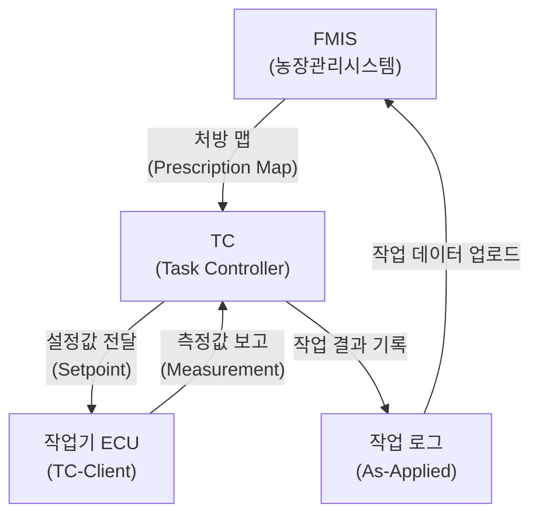
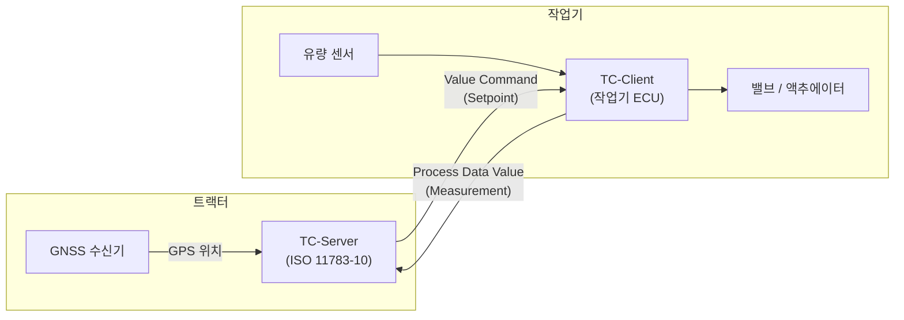
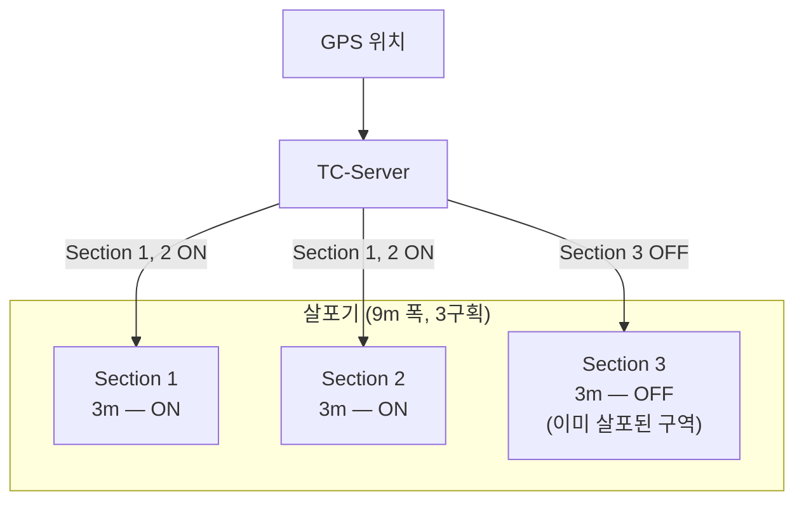
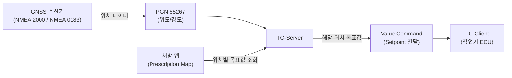

# Task Controller (TC) 기초

## 학습 목표
- Task Controller(TC)가 정밀 농업에서 담당하는 역할을 설명할 수 있다.
- TC-Server와 TC-Client의 차이를 구분하고 각각의 위치를 식별할 수 있다.
- Section Control과 Rate Control의 목적과 동작 원리를 비교할 수 있다.
- GPS 위치 데이터가 TC 제어에 어떻게 활용되는지 설명할 수 있다.

---

## 1. TC란 무엇인가

<strong>Task Controller(TC)</strong>는 ISO 11783-10에 정의된 정밀 농업의 핵심 컴포넌트이다.

> **ISO 11783 Part 10 — Task Controller and Management Information System Data Interchange**

TC는 두 가지 핵심 기능을 수행한다.

- **자동 제어**: 작업 계획(처방 맵, Prescription Map)에 따라 작업기를 자동으로 제어한다. 밭의 위치별로 미리 지정된 살포량·파종량을 GPS 위치와 연동하여 자동으로 적용한다.
- **작업 기록**: 실제 작업 결과(As-Applied Data)를 수집하고 기록한다. 어느 위치에서 얼마나 살포했는지를 나중에 분석할 수 있도록 로그로 남깁니다.

TC가 없던 시대에는 농민이 수동으로 살포량을 조절해야 했다. TC는 이 과정을 자동화하여 비료·농약 과용을 줄이고 생산성을 높이다.

---

## 2. TC의 역할

TC는 FMIS(Farm Management Information System, 농장관리시스템)와 작업기 사이를 연결하는 중간 다리이다.

각 단계의 의미는 다음과 같다.

| 단계 | 방향 | 내용 |
|------|------|------|
| 처방 맵 수신 | FMIS → TC | 밭의 구획별 목표 살포량·파종량이 담긴 계획 파일 |
| Setpoint 전달 | TC → 작업기 | GPS 위치에 해당하는 목표 값을 작업기에 명령 |
| Measurement 수집 | 작업기 → TC | 실제 살포된 양, 속도 등 센서 측정값 보고 |
| 작업 로그 기록 | TC → 저장 | 위치·시간·실제값을 묶어 As-Applied 파일로 저장 |

---

## 3. TC-Client vs TC-Server

ISOBUS에서 TC는 역할에 따라 두 가지로 구분된다.

| 구분 | 위치 | 역할 |
|------|------|------|
| **TC-Server** | 트랙터(또는 별도 단말기) | 처방 맵을 읽고 TC-Client에 명령을 내림 |
| **TC-Client** | 작업기 ECU | 명령을 받아 실제 작업을 수행하고 결과를 보고 |

- <strong>TC-Server</strong>는 처방 맵에서 현재 GPS 위치에 해당하는 값을 조회하고, 그 값을 TC-Client에 전달한다.
- <strong>TC-Client</strong>는 수신한 Setpoint에 맞게 밸브나 모터를 조절하고, 유량 센서 등으로 실제 값을 측정하여 TC-Server에 보고한다.

---

## 4. Section Control과 Rate Control

TC의 두 가지 핵심 제어 기능이다.

### Section Control

작업기를 여러 <strong>구획(Section)</strong>으로 나누어 각 구획을 독립적으로 ON/OFF하는 기능이다. 이미 작업한 영역이나 작업이 필요 없는 영역의 구획을 자동으로 끕니다.

**목적**: 중복 살포(Overlap) 방지 → 비료·농약·씨앗 절감

### Rate Control

GPS 위치에 따라 살포량(Rate)을 **가변적으로** 제어하는 기능이다. 처방 맵에 지정된 위치별 목표량을 실시간으로 반영한다.

**목적**: 토양 조건(양분 상태, 수분 함량)에 맞는 정밀 시비·시약

| 구분 | 설명 | 제어 단위 |
|------|------|-----------|
| Section Control | 구획별 ON/OFF | 논리 값(켜짐/꺼짐) |
| Rate Control | 살포량 가변 조절 | 연속 수치(L/ha, kg/ha) |

두 기능은 함께 사용할 수 있다. 예를 들어, 밭의 경계에서 외부 구획은 OFF(Section Control)하면서 내부 구획의 살포량은 위치별로 조절(Rate Control)할 수 있다.

---

## 5. GPS 연동과 위치 기반 제어

TC는 GPS 위치 데이터를 이용해 현재 위치에 해당하는 처방 맵의 값을 조회한다.

### 위치 관련 PGN

ISOBUS에서 GPS 정보는 다음 PGN으로 전달된다.

| PGN | 이름 | 주요 데이터 |
|-----|------|-------------|
| **65267** (0xFF13) | Vehicle Position | 위도(Latitude), 경도(Longitude) |
| **65256** (0xFF08) | Vehicle Direction | 방위각(Heading), 피치, 롤 |
| **65265** (0xFF11) | Wheel-based Vehicle Speed | 차속(km/h) |

### 위치 기반 제어 흐름

처방 맵은 일반적으로 격자(Grid) 또는 폴리곤(Polygon) 형태로 밭을 구획하고, 각 구획에 목표 값을 지정해 놓다. TC는 현재 GPS 위치가 어느 구획에 속하는지 계산하고, 해당 구획의 목표 값을 TC-Client에 전달한다.

### NMEA와 ISOBUS

GPS 수신기는 NMEA 0183(시리얼) 또는 NMEA 2000(CAN 기반) 프로토콜로 데이터를 제공한다. ISOBUS 네트워크에서는 NMEA 2000과 ISOBUS가 같은 CAN 버스를 공유하거나, 브리지를 통해 연결될 수 있다.

---

> **핵심 정리**
> - TC(Task Controller)는 ISO 11783-10에 정의된 정밀 농업 컴포넌트로, 처방 맵 기반 자동 제어와 작업 로그 기록을 담당한다.
> - TC-Server는 트랙터 측에서 처방 맵을 읽고 명령하며, TC-Client는 작업기 ECU로 명령을 실행한다.
> - Section Control은 구획별 ON/OFF로 중복 살포를 방지하고, Rate Control은 위치별 살포량을 가변 조절한다.
> - GPS 위치(PGN 65267)를 처방 맵과 대조하여 해당 위치의 Setpoint를 실시간으로 TC-Client에 전달한다.

---

## 다음 챕터

- 다음 : [TC 프로세스 데이터](/study/isobus/19-tc-process-data)
