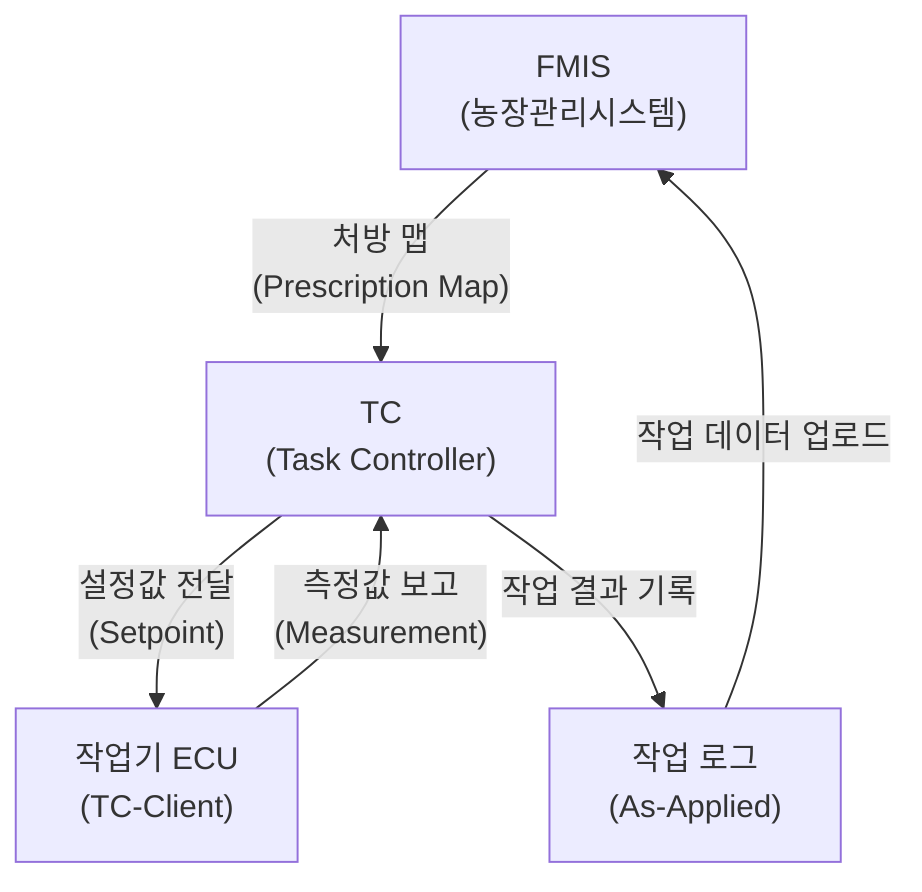
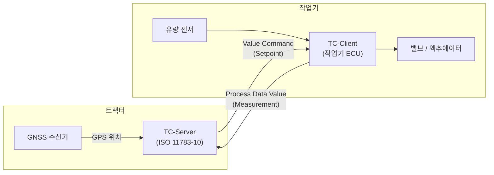
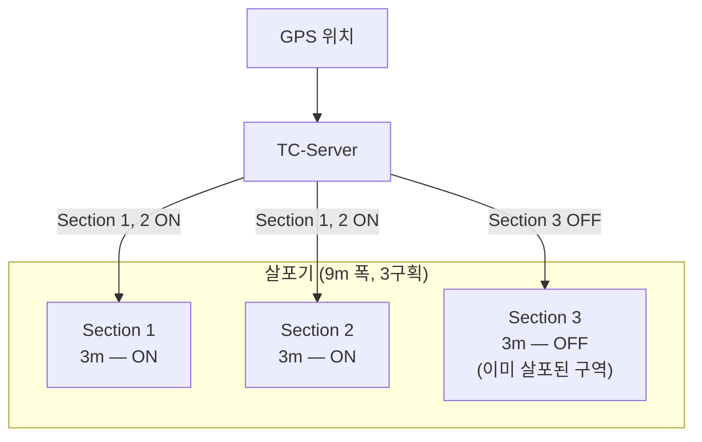
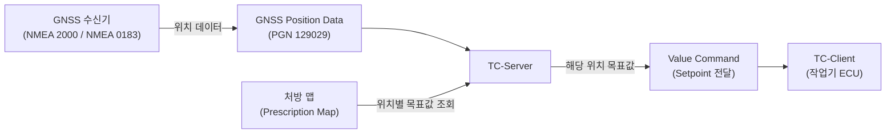

# Task Controller (TC) 기초

::: info 학습 목표
- Task Controller(TC)가 정밀 농업에서 담당하는 역할을 설명할 수 있다.
- TC-Server와 TC-Client의 차이를 구분하고 각각의 위치를 식별할 수 있다.
- Section Control과 Rate Control의 목적과 동작 원리를 비교할 수 있다.
- GPS 위치 데이터가 TC 제어에 어떻게 활용되는지 설명할 수 있다.
:::

## 1. TC란 무엇인가

<strong>Task Controller(TC)</strong>는 ISO 11783-10에 정의된 정밀 농업의 핵심 컴포넌트이다.

> **ISO 11783 Part 10 — Task Controller and Management Information System Data Interchange**

TC는 두 가지 핵심 기능을 수행한다.

- **자동 제어**: 작업 계획(처방 맵, Prescription Map)에 따라 작업기를 자동으로 제어한다. 밭의 위치별로 미리 지정된 살포량·파종량을 GPS 위치와 연동하여 자동으로 적용한다.
- **작업 기록**: 실제 작업 결과(As-Applied Data)를 수집하고 기록한다. 어느 위치에서 얼마나 살포했는지를 나중에 분석할 수 있도록 로그로 남긴다.

TC가 없던 시대에는 농민이 수동으로 살포량을 조절해야 했다. TC는 이 과정을 자동화하여 비료·농약 과용을 줄이고 생산성을 높인다.

### TC 기능성 구분

Part 10 Annex F.2는 TC 기능을 네 가지 <strong>TC functionality</strong>로 구분한다. 제품이 어떤 기능성을 지원하는지에 따라 구현 요구사항이 달라진다.

| 기능성 | 의미 | 내용 |
|--------|------|------|
| **TC-BAS** | basic | 작업 총계(task total) 기록 — 위치와 무관한 작업량 문서화 |
| **TC-GEO** | geo-based | 위치 기반 로깅과 (선택적으로) 처방 맵 기반 위치 제어 |
| **TC-SC** | section control | 섹션 자동 ON/OFF 제어 |
| **LOG** | data logger | 로깅 전용 기능(DL) |

현행 2015년판(2nd edition)은 프로토콜 <strong>버전 4</strong>를 정의하며, 로깅만 수행하는 별도 CF인 <strong>Data Logger(DL)</strong>와 Peer Control 등이 버전 4에서 추가되었다. DL은 TC 기능의 부분집합으로 같은 연결 메커니즘을 쓰고, 클라이언트는 동시에 TC 1개와 DL 1개에 연결할 수 있다.

## 2. TC의 역할

TC는 FMIS(Farm Management Information System, 농장관리시스템)와 작업기 사이를 연결하는 중간 다리이다.

```mermaid
flowchart TD
    FMIS["FMIS<br>(농장관리시스템)"]
    TC["TC<br>(Task Controller)"]
    ECU["작업기 ECU<br>(TC-Client)"]
    LOG["작업 로그<br>(As-Applied)"]

    FMIS -->|"처방 맵<br>(Prescription Map)"| TC
    TC -->|"설정값 전달<br>(Setpoint)"| ECU
    ECU -->|"측정값 보고<br>(Measurement)"| TC
    TC -->|"작업 결과 기록"| LOG
    LOG -->|"작업 데이터 업로드"| FMIS
```

각 단계의 의미는 다음과 같다.

| 단계 | 방향 | 내용 |
|------|------|------|
| 처방 맵 수신 | FMIS → TC | 밭의 구획별 목표 살포량·파종량이 담긴 계획 파일 |
| Setpoint 전달 | TC → 작업기 | GPS 위치에 해당하는 목표 값을 작업기에 명령 |
| Measurement 수집 | 작업기 → TC | 실제 살포된 양, 속도 등 센서 측정값 보고 |
| 작업 로그 기록 | TC → 저장 | 위치·시간·실제값을 묶어 As-Applied 파일로 저장 |

## 3. TC-Client vs TC-Server

ISOBUS에서 TC는 역할에 따라 두 가지로 구분된다.

| 구분 | 위치 | 역할 |
|------|------|------|
| **TC-Server** | 트랙터(또는 별도 단말기) | 처방 맵을 읽고 TC-Client에 명령을 내림 |
| **TC-Client** | 작업기 ECU | 명령을 받아 실제 작업을 수행하고 결과를 보고 |

```mermaid
flowchart LR
    subgraph 트랙터
        TCS["TC-Server<br>(ISO 11783-10)"]
        GNSS["GNSS 수신기"]
    end

    subgraph 작업기
        TCC["TC-Client<br>(작업기 ECU)"]
        VALVE["밸브 / 액추에이터"]
        SENSOR["유량 센서"]
    end

    GNSS -->|"GPS 위치"| TCS
    TCS -->|"Value Command<br>(Setpoint)"| TCC
    TCC -->|"Process Data Value<br>(Measurement)"| TCS
    TCC --> VALVE
    SENSOR --> TCC
```

- <strong>TC-Server</strong>는 처방 맵에서 현재 GPS 위치에 해당하는 값을 조회하고, 그 값을 TC-Client에 전달한다.
- <strong>TC-Client</strong>는 수신한 Setpoint에 맞게 밸브나 모터를 조절하고, 유량 센서 등으로 실제 값을 측정하여 TC-Server에 보고한다.

### TC 연결 관리

TC와 클라이언트의 연결은 Task Controller Status 메시지로 유지된다.

- 클라이언트는 address claim 완료 후 <strong>6초 대기</strong> → TC의 Status 메시지 수신 확인 → Working Set Master 메시지로 자신을 식별하며 연결 절차를 시작한다.
- TC는 Status 메시지를 <strong>2초 주기</strong>로 송신한다(상태 변화 시 즉시 송신 가능, 단 메시지 간 최소 200 ms).
- 타임아웃은 양방향 모두 <strong>6초</strong>다. 클라이언트가 TC Status를 6초간 못 받으면 TC의 비정상 종료로 간주하고, TC가 클라이언트의 Task 메시지를 6초간 못 받으면 클라이언트의 비정상 종료로 간주한다.
- 네트워크에는 TC가 여러 대 있을 수 있다. function instance 0인 TC가 <strong>primary TC</strong>이고, 오퍼레이터에게는 <strong>TC number</strong> = function instance + 1(1~32)로 표시한다. 클라이언트는 동시에 TC 1개·DL 1개에만 연결할 수 있다.

## 4. Section Control과 Rate Control

TC의 두 가지 핵심 제어 기능이다.

### Section Control

작업기를 여러 <strong>구획(Section)</strong>으로 나누어 각 구획을 독립적으로 ON/OFF하는 기능이다. 이미 작업한 영역이나 작업이 필요 없는 영역의 구획을 자동으로 끈다.

**목적**: 중복 살포(Overlap) 방지 → 비료·농약·씨앗 절감

```mermaid
graph TD
    subgraph "살포기 (9m 폭, 3구획)"
        S1["Section 1<br>3m — ON"]
        S2["Section 2<br>3m — ON"]
        S3["Section 3<br>3m — OFF<br>(이미 살포된 구역)"]
    end

    GPS["GPS 위치"] --> TC["TC-Server"]
    TC -->|"Section 3 OFF"| S3
    TC -->|"Section 1, 2 ON"| S1
    TC -->|"Section 1, 2 ON"| S2
```

### Rate Control

GPS 위치에 따라 살포량(Rate)을 **가변적으로** 제어하는 기능이다. 처방 맵에 지정된 위치별 목표량을 실시간으로 반영한다.

**목적**: 토양 조건(양분 상태, 수분 함량)에 맞는 정밀 시비·시약

| 구분 | 설명 | 제어 단위 |
|------|------|-----------|
| Section Control | 구획별 ON/OFF | 논리 값(켜짐/꺼짐) |
| Rate Control | 살포량 가변 조절 | 연속 수치(L/ha, kg/ha) |

두 기능은 함께 사용할 수 있다. 예를 들어, 밭의 경계에서 외부 구획은 OFF(Section Control)하면서 내부 구획의 살포량은 위치별로 조절(Rate Control)할 수 있다.

## 5. GPS 연동과 위치 기반 제어

TC는 GPS 위치 데이터를 이용해 현재 위치에 해당하는 처방 맵의 값을 조회한다.

### 위치·속도 관련 메시지

ISOBUS는 위치 정보를 자체 정의하지 않고 <strong>IEC 61162-3(NMEA 2000)</strong>의 항법 위치 메시지를 그대로 사용한다(Part 7 B.5). 속도는 Part 7이 자체 정의한 트랙터 메시지로 전달된다.

| 메시지 | PGN | 주요 데이터 |
|--------|-----|-------------|
| GNSS Position Data (NMEA 2000) | **129029** | 위도(Latitude), 경도(Longitude), 고도, 측위 방법 |
| COG & SOG, Rapid Update (NMEA 2000) | **129026** | 대지 진행 방향(COG), 대지 속도(SOG) |
| Wheel-based Speed and Distance (Part 7) | **65096** (0xFE48) | 휠 기준 차속·거리 |
| Ground-based Speed and Distance (Part 7) | **65097** (0xFE49) | 대지 기준(레이더 등) 차속·거리 |

### 위치 기반 제어 흐름

```mermaid
flowchart LR
    GNSS["GNSS 수신기<br>(NMEA 2000 / NMEA 0183)"]
    PGN["GNSS Position Data<br>(PGN 129029)"]
    TC["TC-Server"]
    MAP["처방 맵<br>(Prescription Map)"]
    CMD["Value Command<br>(Setpoint 전달)"]
    ECU["TC-Client<br>(작업기 ECU)"]

    GNSS -->|"위치 데이터"| PGN
    PGN --> TC
    MAP -->|"위치별 목표값 조회"| TC
    TC -->|"해당 위치 목표값"| CMD
    CMD --> ECU
```

처방 맵은 격자(Grid) 또는 폴리곤(Polygon) 형태로 밭을 구획하고, 각 구획에 목표 값을 지정해 놓는다(둘 다 TreatmentZone을 참조한다). TC는 현재 GPS 위치가 어느 구획(TreatmentZone)에 속하는지 계산하고, 해당 구획의 목표 값을 TC-Client에 전달한다.

### NMEA와 ISOBUS

GPS 수신기는 NMEA 0183(시리얼) 또는 NMEA 2000(CAN 기반) 프로토콜로 데이터를 제공한다. Part 7이 항법 위치 메시지를 IEC 61162-3(NMEA 2000)에 위임하므로, NMEA 2000 항법 메시지는 ISOBUS 네트워크에서 그대로 사용된다. 이때 여러 데이터 프레임이 필요한 메시지(GNSS Position Data 등)는 ISO 11783-3의 transport protocol이 아니라 <strong>NMEA fast packet protocol</strong>을 사용해야 한다.

> **핵심 정리**
> - TC(Task Controller)는 ISO 11783-10에 정의된 정밀 농업 컴포넌트로, 처방 맵 기반 자동 제어와 작업 로그 기록을 담당한다. 기능성은 TC-BAS·TC-GEO·TC-SC·LOG로 구분된다(Annex F.2).
> - TC-Server는 트랙터 측에서 처방 맵을 읽고 명령하며, TC-Client는 작업기 ECU로 명령을 실행한다. 연결은 TC Status 메시지(2초 주기)로 유지되고 타임아웃은 양방향 6초다.
> - Section Control은 구획별 ON/OFF로 중복 살포를 방지하고, Rate Control은 위치별 살포량을 가변 조절한다.
> - GPS 위치(NMEA 2000 GNSS Position Data, PGN 129029)를 처방 맵과 대조하여 해당 위치의 Setpoint를 실시간으로 TC-Client에 전달한다.

## 다음 챕터

- 다음 : [TC 프로세스 데이터](/study/isobus/19-tc-process-data)
