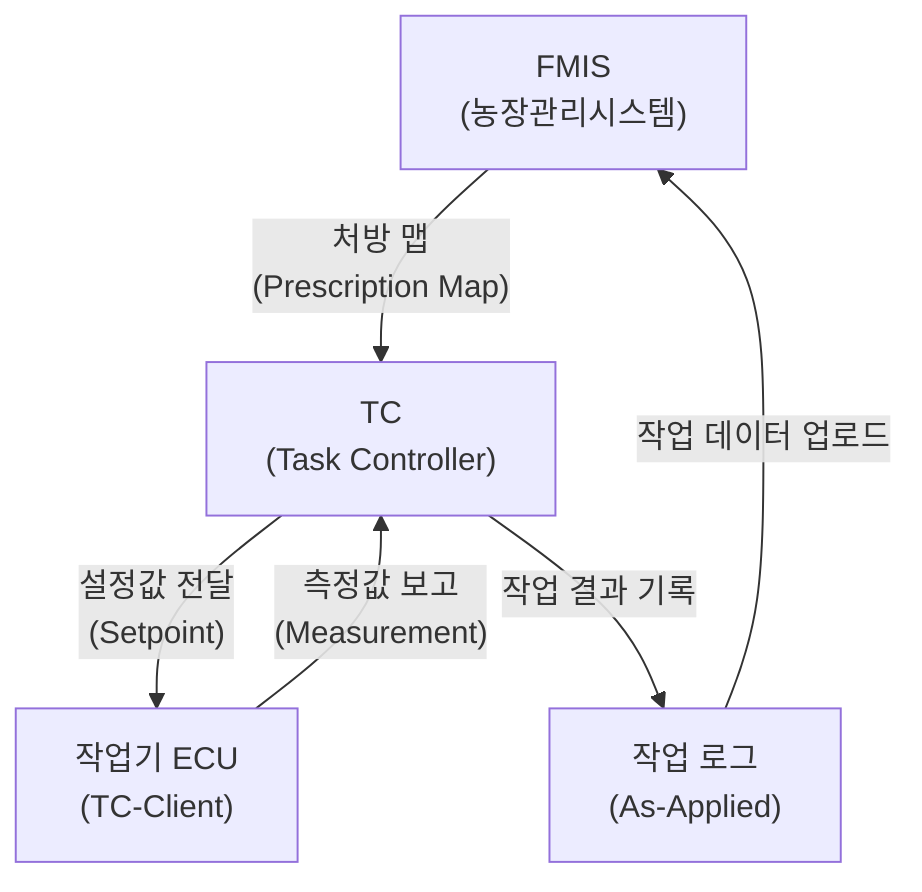
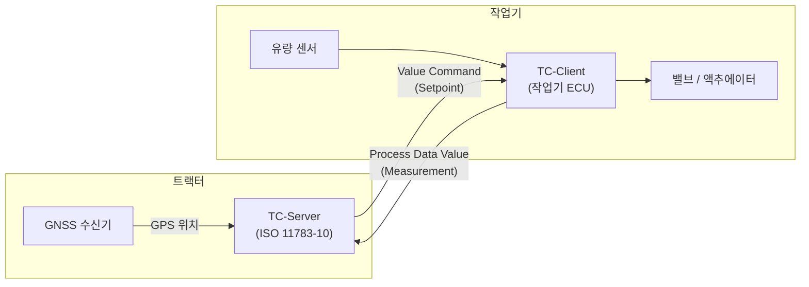
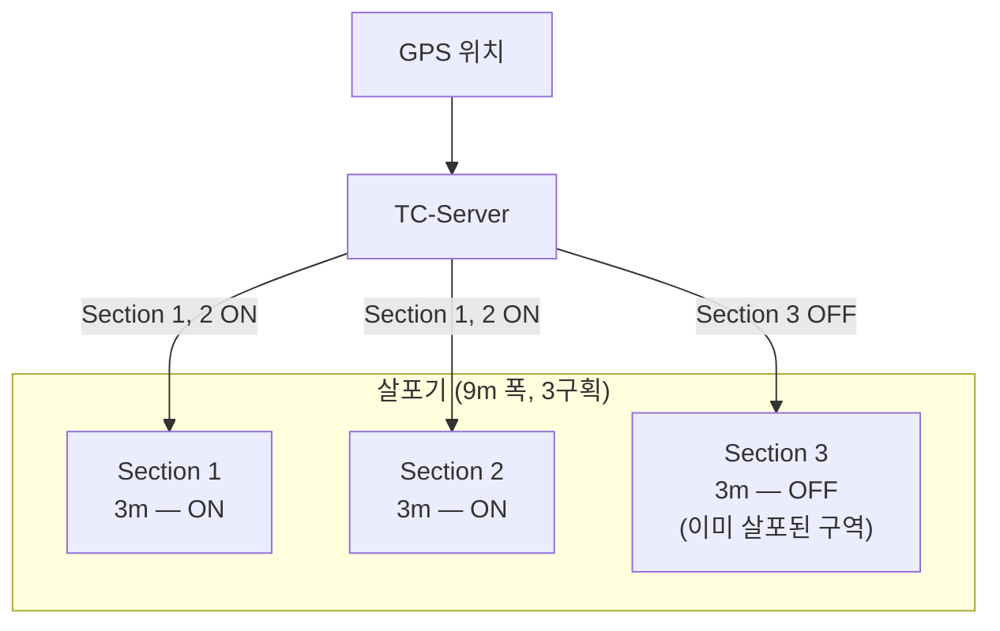
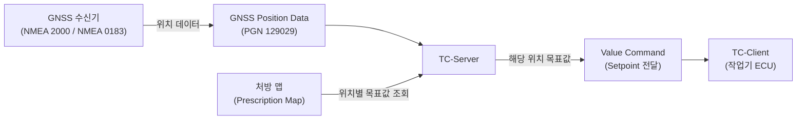

# Task Controller (TC) 기초

::: info 학습 목표
- Task Controller(TC)가 정밀 농업에서 담당하는 역할을 설명할 수 있다.
- TC-Server와 TC-Client의 차이를 구분하고 각각의 위치를 식별할 수 있다.
- Section Control과 Rate Control의 목적과 동작 원리를 비교할 수 있다.
- GPS 위치 데이터가 TC 제어에 어떻게 활용되는지 설명할 수 있다.
:::

## 1. TC란 무엇인가

<strong>Task Controller(TC)</strong>는 ISO 11783-10에 정의된 정밀 농업의 핵심 컴포넌트이다.

> **ISO 11783 Part 10 — Task Controller and Management Information System Data Interchange**

TC는 두 가지 핵심 기능을 수행한다.

- **자동 제어**: 작업 계획(처방 맵, Prescription Map)에 따라 작업기를 자동으로 제어한다. 밭의 위치별로 미리 지정된 살포량·파종량을 GPS 위치와 연동하여 자동으로 적용한다.
- **작업 기록**: 실제 작업 결과(As-Applied Data)를 수집하고 기록한다. 어느 위치에서 얼마나 살포했는지를 나중에 분석할 수 있도록 로그로 남긴다.

TC가 없던 시대에는 농민이 수동으로 살포량을 조절해야 했다. TC는 이 과정을 자동화하여 비료·농약 과용을 줄이고 생산성을 높인다.

### TC 기능성 구분

Part 10 Annex F.2는 TC 기능을 네 가지 <strong>TC functionality</strong>로 구분한다. 제품이 어떤 기능성을 지원하는지에 따라 구현 요구사항이 달라진다.

| 기능성 | 의미 | 내용 |
|--------|------|------|
| **TC-BAS** | basic | 작업 총계(task total) 기록 — 위치와 무관한 작업량 문서화 |
| **TC-GEO** | geo-based | 위치 기반 로깅과 (선택적으로) 처방 맵 기반 위치 제어 |
| **TC-SC** | section control | 섹션 자동 ON/OFF 제어 |
| **LOG** | data logger | 로깅 전용 기능(DL) |

현행 2015년판(2nd edition)은 프로토콜 <strong>버전 4</strong>를 정의하며, 로깅만 수행하는 별도 CF인 <strong>Data Logger(DL)</strong>와 Peer Control 등이 버전 4에서 추가되었다. DL은 TC 기능의 부분집합으로 같은 연결 메커니즘을 쓰고, 클라이언트는 동시에 TC 1개와 DL 1개에 연결할 수 있다.

### TC-BAS·TC-GEO 최소 요건

같은 기능성이라도 <strong>TC 서버와 TC 클라이언트가 지는 부담은 다르다</strong>. TC 서버는 ISO 11783-11에 해당 기능성 관련으로 정의된 DDI를 전부 지원해야 하지만, TC 클라이언트는 자신이 실제로 다루는 부분집합만 제공하면 된다 — 이 비대칭이 아래 요건 전체를 관통하는 원칙이다(부속서 F.2).

| 기능성 | TC 서버 요건 | TC 클라이언트 요건 |
|--------|--------------|---------------------|
| **TC-BAS** | ISO 11783-11에 총계로 정의된 모든 DDI 지원 | 총계의 부분집합만 제공 가능하나 <strong>최소 DDI 119(total time)는 필수</strong>. DDOP에 rate DDI가 있으면 대응하는 total DDI도 필수 |
| **TC-GEO** | TC-BAS 서버 요건 + <strong>Grid type 1·2 처리 필수(최소 350행×350열)</strong> | TC-BAS 클라이언트 요건 + TC-BAS 자체도 함께 지원 필수 |

- <strong>TC-BAS</strong>: FMIS·TC·TC 클라이언트 모두 파일 세트(ISO11783_TaskData 등)와 Version 메시지에 TC 버전 <strong>3</strong>을 게시해야 한다. 파일 세트에 미지원 XML 요소(OperationTechnique, CodedCommentGroup 등)가 있어도 <strong>파일 세트 자체를 거부하면 안 되고</strong>, 해당 요소만 건너뛴 채 나머지 내용은 읽어야 한다.
- <strong>TC-GEO</strong>: 폴리곤 기반 처방 처리는 선택 기능이며, 지원할 경우 Control function functionalities 메시지에 명시해야 한다. TC 클라이언트는 TC가 Version 메시지로 보고하는 <strong>위치 기반 제어 채널 수 이하로</strong> 자신의 device descriptor가 보고하는 제어 채널 수를 제한해야 한다 — 서버가 지원 못 하는 채널을 클라이언트가 먼저 내세우면 안 된다는 뜻이다.

::: info 그리드는 서버의 일
Grid type 1·2 처리(350행×350열 이상)는 <strong>TC 서버</strong>의 요건이지 클라이언트의 요건이 아니다. TC 클라이언트는 자신의 device element·process data 구조와 채널 수 제한만 신경 쓰면 된다.
:::

연결 절차 자체는 [§6 클라이언트 초기화와 연결 유지](#6-클라이언트-초기화와-연결-유지)를 참조한다.

## 2. TC의 역할

TC는 FMIS(Farm Management Information System, 농장관리시스템)와 작업기 사이를 연결하는 중간 다리이다.

```mermaid
flowchart TD
    FMIS["FMIS<br>(농장관리시스템)"]
    TC["TC<br>(Task Controller)"]
    ECU["작업기 ECU<br>(TC-Client)"]
    LOG["작업 로그<br>(As-Applied)"]

    FMIS -->|"처방 맵<br>(Prescription Map)"| TC
    TC -->|"설정값 전달<br>(Setpoint)"| ECU
    ECU -->|"측정값 보고<br>(Measurement)"| TC
    TC -->|"작업 결과 기록"| LOG
    LOG -->|"작업 데이터 업로드"| FMIS
```

각 단계의 의미는 다음과 같다.

| 단계 | 방향 | 내용 |
|------|------|------|
| 처방 맵 수신 | FMIS → TC | 밭의 구획별 목표 살포량·파종량이 담긴 계획 파일 |
| Setpoint 전달 | TC → 작업기 | GPS 위치에 해당하는 목표 값을 작업기에 명령 |
| Measurement 수집 | 작업기 → TC | 실제 살포된 양, 속도 등 센서 측정값 보고 |
| 작업 로그 기록 | TC → 저장 | 위치·시간·실제값을 묶어 As-Applied 파일로 저장 |

## 3. TC-Client vs TC-Server

ISOBUS에서 TC는 역할에 따라 두 가지로 구분된다.

| 구분 | 위치 | 역할 |
|------|------|------|
| **TC-Server** | 트랙터(또는 별도 단말기) | 처방 맵을 읽고 TC-Client에 명령을 내림 |
| **TC-Client** | 작업기 ECU | 명령을 받아 실제 작업을 수행하고 결과를 보고 |

```mermaid
flowchart LR
    subgraph 트랙터
        TCS["TC-Server<br>(ISO 11783-10)"]
        GNSS["GNSS 수신기"]
    end

    subgraph 작업기
        TCC["TC-Client<br>(작업기 ECU)"]
        VALVE["밸브 / 액추에이터"]
        SENSOR["유량 센서"]
    end

    GNSS -->|"GPS 위치"| TCS
    TCS -->|"Value Command<br>(Setpoint)"| TCC
    TCC -->|"Process Data Value<br>(Measurement)"| TCS
    TCC --> VALVE
    SENSOR --> TCC
```

- <strong>TC-Server</strong>는 처방 맵에서 현재 GPS 위치에 해당하는 값을 조회하고, 그 값을 TC-Client에 전달한다.
- <strong>TC-Client</strong>는 수신한 Setpoint에 맞게 밸브나 모터를 조절하고, 유량 센서 등으로 실제 값을 측정하여 TC-Server에 보고한다.

### TC 연결 관리

TC와 클라이언트의 연결은 Task Controller Status 메시지로 유지된다.

- 클라이언트는 address claim 완료 후 <strong>6초 대기</strong> → TC의 Status 메시지 수신 확인 → Working Set Master 메시지로 자신을 식별하며 연결 절차를 시작한다.
- TC는 Status 메시지를 <strong>2초 주기</strong>로 송신한다(상태 변화 시 즉시 송신 가능, 단 메시지 간 최소 200 ms).
- 타임아웃은 양방향 모두 <strong>6초</strong>다. 클라이언트가 TC Status를 6초간 못 받으면 TC의 비정상 종료로 간주하고, TC가 클라이언트의 Task 메시지를 6초간 못 받으면 클라이언트의 비정상 종료로 간주한다.
- 네트워크에는 TC가 여러 대 있을 수 있다. function instance 0인 TC가 <strong>primary TC</strong>이고, 오퍼레이터에게는 <strong>TC number</strong> = function instance + 1(1~32)로 표시한다. 클라이언트는 동시에 TC 1개·DL 1개에만 연결할 수 있다.

## 4. Section Control과 Rate Control

TC의 두 가지 핵심 제어 기능이다.

### Section Control

작업기를 여러 <strong>구획(Section)</strong>으로 나누어 각 구획을 독립적으로 ON/OFF하는 기능이다. 이미 작업한 영역이나 작업이 필요 없는 영역의 구획을 자동으로 끈다.

**목적**: 중복 살포(Overlap) 방지 → 비료·농약·씨앗 절감

```mermaid
graph TD
    subgraph "살포기 (9m 폭, 3구획)"
        S1["Section 1<br>3m — ON"]
        S2["Section 2<br>3m — ON"]
        S3["Section 3<br>3m — OFF<br>(이미 살포된 구역)"]
    end

    GPS["GPS 위치"] --> TC["TC-Server"]
    TC -->|"Section 3 OFF"| S3
    TC -->|"Section 1, 2 ON"| S1
    TC -->|"Section 1, 2 ON"| S2
```

### Rate Control

GPS 위치에 따라 살포량(Rate)을 **가변적으로** 제어하는 기능이다. 처방 맵에 지정된 위치별 목표량을 실시간으로 반영한다.

**목적**: 토양 조건(양분 상태, 수분 함량)에 맞는 정밀 시비·시약

| 구분 | 설명 | 제어 단위 |
|------|------|-----------|
| Section Control | 구획별 ON/OFF | 논리 값(켜짐/꺼짐) |
| Rate Control | 살포량 가변 조절 | 연속 수치(L/ha, kg/ha) |

두 기능은 함께 사용할 수 있다. 예를 들어, 밭의 경계에서 외부 구획은 OFF(Section Control)하면서 내부 구획의 살포량은 위치별로 조절(Rate Control)할 수 있다.

## 5. GPS 연동과 위치 기반 제어

TC는 GPS 위치 데이터를 이용해 현재 위치에 해당하는 처방 맵의 값을 조회한다.

### 위치·속도 관련 메시지

ISOBUS는 위치 정보를 자체 정의하지 않고 <strong>IEC 61162-3(NMEA 2000)</strong>의 항법 위치 메시지를 그대로 사용한다(Part 7 B.5). 속도는 Part 7이 자체 정의한 트랙터 메시지로 전달된다.

| 메시지 | PGN | 주요 데이터 |
|--------|-----|-------------|
| GNSS Position Data (NMEA 2000) | **129029** | 위도(Latitude), 경도(Longitude), 고도, 측위 방법 |
| COG & SOG, Rapid Update (NMEA 2000) | **129026** | 대지 진행 방향(COG), 대지 속도(SOG) |
| Wheel-based Speed and Distance (Part 7) | **65096** (0xFE48) | 휠 기준 차속·거리 |
| Ground-based Speed and Distance (Part 7) | **65097** (0xFE49) | 대지 기준(레이더 등) 차속·거리 |

### 위치 기반 제어 흐름

```mermaid
flowchart LR
    GNSS["GNSS 수신기<br>(NMEA 2000 / NMEA 0183)"]
    PGN["GNSS Position Data<br>(PGN 129029)"]
    TC["TC-Server"]
    MAP["처방 맵<br>(Prescription Map)"]
    CMD["Value Command<br>(Setpoint 전달)"]
    ECU["TC-Client<br>(작업기 ECU)"]

    GNSS -->|"위치 데이터"| PGN
    PGN --> TC
    MAP -->|"위치별 목표값 조회"| TC
    TC -->|"해당 위치 목표값"| CMD
    CMD --> ECU
```

처방 맵은 격자(Grid) 또는 폴리곤(Polygon) 형태로 밭을 구획하고, 각 구획에 목표 값을 지정해 놓는다(둘 다 TreatmentZone을 참조한다). TC는 현재 GPS 위치가 어느 구획(TreatmentZone)에 속하는지 계산하고, 해당 구획의 목표 값을 TC-Client에 전달한다.

### NMEA와 ISOBUS

GPS 수신기는 NMEA 0183(시리얼) 또는 NMEA 2000(CAN 기반) 프로토콜로 데이터를 제공한다. Part 7이 항법 위치 메시지를 IEC 61162-3(NMEA 2000)에 위임하므로, NMEA 2000 항법 메시지는 ISOBUS 네트워크에서 그대로 사용된다. 이때 여러 데이터 프레임이 필요한 메시지(GNSS Position Data 등)는 ISO 11783-3의 transport protocol이 아니라 <strong>NMEA fast packet protocol</strong>을 사용해야 한다.

> **핵심 정리**
> - TC(Task Controller)는 ISO 11783-10에 정의된 정밀 농업 컴포넌트로, 처방 맵 기반 자동 제어와 작업 로그 기록을 담당한다. 기능성은 TC-BAS·TC-GEO·TC-SC·LOG로 구분된다(Annex F.2).
> - TC-Server는 트랙터 측에서 처방 맵을 읽고 명령하며, TC-Client는 작업기 ECU로 명령을 실행한다. 연결은 TC Status 메시지(2초 주기)로 유지되고 타임아웃은 양방향 6초다.
> - Section Control은 구획별 ON/OFF로 중복 살포를 방지하고, Rate Control은 위치별 살포량을 가변 조절한다.
> - GPS 위치(NMEA 2000 GNSS Position Data, PGN 129029)를 처방 맵과 대조하여 해당 위치의 Setpoint를 실시간으로 TC-Client에 전달한다.

## 6. 클라이언트 초기화와 연결 유지

앞 절들이 TC의 역할과 제어 기능을 다뤘다면, 여기서는 <strong>TC-Client가 전원이 켜진 순간부터 실제로 명령을 주고받기까지 반드시 거쳐야 하는 절차</strong>를 순서대로 짚는다.

::: warning 흔한 오해 — "DDOP만 올리면 준비 끝"
TC-Client 구현을 "DDOP를 만들어 업로드하는 일"로 요약하는 경우가 많은데, 반만 맞다. DDOP 업로드와 활성화는 클라이언트 초기화 <strong>9단계 중 8~9번째</strong>일 뿐이다. 그 앞에 주소 확정 → TC 확인 → Working Set Master 선언 → Task 메시지 시작 → 버전 협상까지 7단계가 정해진 순서대로 먼저 끝나야 하고, 순서를 건너뛰면 TC가 DDOP 자체를 받아주지 않는다.
:::

### 클라이언트 초기화 9단계

ISO 11783-10 §6.6.2가 정의하는 순서다.

| 단계 | 동작 | 왜 이 순서인가 |
|---|---|---|
| 1 | address claim 완료 후 <strong>6초 대기</strong> | 네트워크의 다른 CF들도 각자 주소 클레임 중일 수 있다. 6초는 클레임 경합이 가라앉을 시간을 준다 |
| 2 | 선택한 TC의 <strong>Task Controller Status 메시지 수신 대기</strong> | 클라이언트가 먼저 말을 걸지 않는다 — TC가 살아 있고 통신 준비가 됐다는 신호를 먼저 받아야 한다 |
| 3 | Working Set Master/Member 메시지(ISO 11783-7)로 자신을 <strong>Working Set Master로 식별</strong> | 버전 4부터 TC와의 통신은 Working Set Master CF로만 한정된다. 이 선언이 없으면 이후 어떤 메시지도 TC가 받아주지 않는다 |
| 4 | Client Task 메시지 송신 시작 | 이 시점부터 TC가 클라이언트의 생존을 감시한다(연결 유지 타이머 시작) |
| 5 | (버전 4 이상) Request Version으로 TC 버전 질의 → TC가 요구 버전·기능을 지원하지 않으면 <strong>자신의 기능을 TC가 지원하는 수준으로 제한</strong> | 기능을 낮추는 쪽은 항상 클라이언트다. 신형 클라이언트가 구형 TC에 맞춰야 통신이 성립한다 |
| 6 | (버전 4 이상) TC가 보내는 Request Version에 응답 | 버전 질의는 상호적이다 — 어느 쪽이 먼저 묻든 응답 의무가 있다 |
| 7 | (선택) TC에 언어·형식 메시지 요청 | 필수는 아니지만 로캘 설정을 맞추려면 이 단계에서 처리한다 |
| 8 | TC에 <strong>자신의 DDOP가 이미 있는지 질의</strong> | 재접속 상황이면 다시 올릴 필요가 없다 — 있는지부터 확인하는 게 먼저다 |
| 9 | 있으면 <strong>활성화</strong>, 없으면 TP/ETP(ISO 11783-3)로 <strong>DDOP 전송 후 활성화</strong> | DDOP는 Working Set Master 선언·버전 협상이 끝나고 상대가 누군지 확정된 뒤에야 의미가 있다 |

### TC 초기화 5단계

클라이언트 혼자 순서를 지킨다고 되는 일이 아니다. TC 쪽도 §6.6.1에 정해진 순서로 움직여야 위 9단계가 맞물린다.

| 단계 | 동작 |
|---|---|
| 1 | ISO 11783-5에 따라 address claim 완료, global 주소(255)로 address claimed 요청도 송신 |
| 2 | address claim 완료 후 <strong>6초 대기</strong> |
| 3 | Task Controller Status 메시지 송신 시작 |
| 4 | 클라이언트의 DDOP 업로드·초기화 허용 |
| 5 | (버전 4 이상) 클라이언트가 TC 버전을 요청하면 TC도 클라이언트 버전을 요청 |

두 순서를 맞대어 보면 왜 클라이언트가 "TC가 먼저 말할 때까지 기다린다"고 했는지 드러난다. TC의 3단계(Status 송신 시작)가 클라이언트의 2단계(Status 수신 대기)를 풀어주는 신호이고, TC의 4단계(DDOP 업로드 허용)가 클라이언트의 8~9단계를 받아주는 문이다. 버전 협상(클라이언트 5~6단계 / TC 5단계)도 서로가 서로를 향해 묻는 대칭 구조다 — 즉 초기화는 클라이언트 혼자 진행하는 절차가 아니라, TC와 클라이언트가 각자의 5단계·9단계를 교대로 밟는 <strong>맞물린 절차</strong>다.

### 연결 유지

연결이 성립한 뒤에는 [§3 TC 연결 관리](#tc-연결-관리)에서 다룬 값들이 그대로 적용된다 — TC Status는 2초 주기(상태 변화 시 즉시, 단 메시지 간 최소 200 ms), 타임아웃은 양방향 6초. 여기에 클라이언트 쪽 값을 더하면 그림이 완성된다.

| 항목 | 값 |
|---|---|
| Task Controller Status 주기 | 2초(변화 시 즉시, 최소 200 ms 간격) |
| Client Task 메시지 주기 | 2초 |
| 타임아웃(양방향) | 6초 |

- 클라이언트가 TC Status를 6초간 못 받으면 <strong>TC의 비정상 종료</strong>로 간주하고 Client Task 송신을 중단한다. 이후 초기화 절차를 처음부터 다시 밟아야 재연결된다.
- TC가 Client Task를 6초간 못 받으면 <strong>클라이언트의 비정상 종료</strong>로 간주한다. 클라이언트가 address claim 후 6초를 기다린 뒤에야 Client Task를 보내는 이유가 여기 있다 — 그 지연 자체가 TC 입장에서 "클라이언트가 막 재시작했다"는 신호로 읽힌다.

::: tip 권고가 아니라 필수값
200 ms·2초·6초는 참고 수치가 아니라 <strong>구현이 반드시 지켜야 하는 값</strong>이며, 정확도는 AEF(Agricultural Industry Electronics Foundation) 시험 요구사항의 대상이다. 임의로 늘리거나 줄이면 상호운용성 인증을 통과할 수 없다.
:::

### 재접속

작업 도중 클라이언트가 재시작하면 연결이 끊긴 시점의 상태로 되돌아가지 않는다. TC는 재접속한 클라이언트의 <strong>DDOP 업로드·활성화 요청을 다시 수락</strong>해야 하고(위 9단계를 처음부터 다시 밟는다), 그 클라이언트에 내리던 measurement 명령도 <strong>다시 내려야</strong> 한다. 즉 재접속은 "끊긴 지점에서 이어 붙이기"가 아니라 초기화 시퀀스의 재실행이다.

### 연결 종료

Key Switch가 off로 전환되면(ECU Power는 유지된 채) 정돈된 종료 절차가 시작된다. 클라이언트는 <strong>Connection Deactivate</strong> 명령을 보내 TC가 이를 비정상 종료로 오인하지 않게 하고, TC는 활성 DDOP를 가진 클라이언트의 마지막 전원 유지 요청 이후 최소 2초간 서비스를 유지해 수집 중이던 데이터가 정상적으로 마무리되게 한다. Key Switch가 다시 켜지면 양쪽 모두 위 초기화 절차를 재실행한다.

## 다음 챕터

- 다음 : [TC 프로세스 데이터](/study/isobus/19-tc-process-data)
