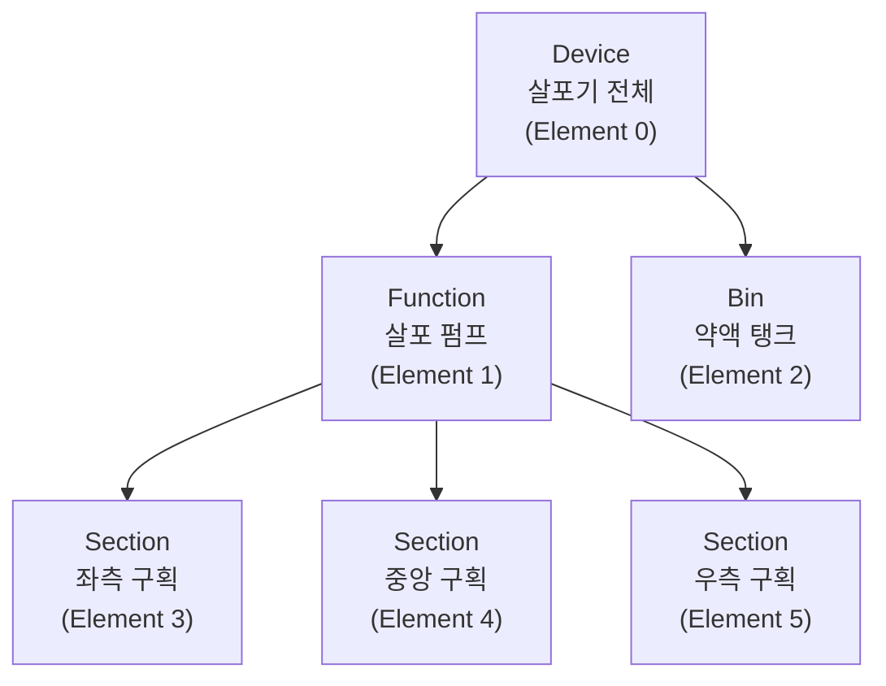
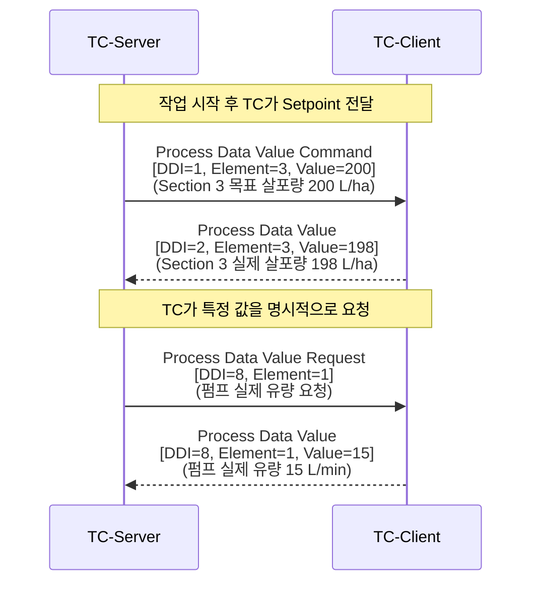
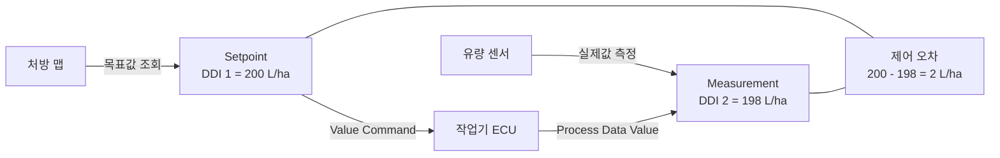
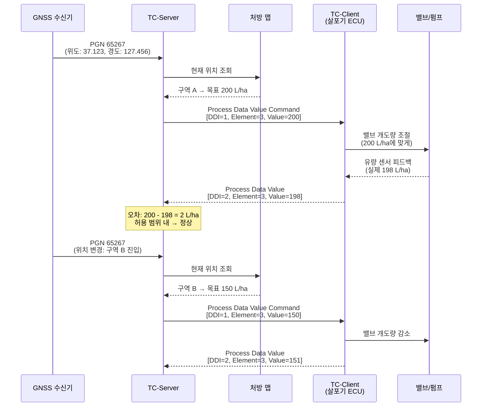

# TC 프로세스 데이터

::: info 학습 목표
- DDI(Data Dictionary Identifier)의 의미와 주요 번호를 설명할 수 있다.
- Device Element의 타입과 역할을 구분할 수 있다.
- Value Command와 Process Data Value의 흐름을 시퀀스 다이어그램으로 그릴 수 있다.
- Measurement와 Setpoint의 차이를 이해하고 제어 오차의 개념을 설명할 수 있다.
- 살포량 제어 시나리오를 통해 전체 프로세스 데이터 흐름을 추적할 수 있다.
:::

---

## 1. DDI (Data Dictionary Identifier)

<strong>DDI</strong>는 TC 프로세스 데이터 항목을 구분하는 표준화된 16비트 번호이다.

> DDI는 "어떤 종류의 데이터인가"를 나타냅니다. 살포량인지, 속도인지, 면적인지를 숫자로 표현한다.

모든 TC 메시지는 DDI를 포함하여 어떤 데이터를 주고받는지 명시한다. 주요 DDI는 다음과 같다.

| DDI | 이름 | 방향 | 설명 |
|-----|------|------|------|
| **1** | Setpoint Volume Per Area | TC → 작업기 | 목표 살포량 (L/ha, ml/m²) |
| **2** | Actual Volume Per Area | 작업기 → TC | 실제 살포량 (센서 측정) |
| **7** | Setpoint Volume Per Time | TC → 작업기 | 시간당 목표 유량 (L/min) |
| **8** | Actual Volume Per Time | 작업기 → TC | 시간당 실제 유량 |
| **73** | Setpoint Mass Per Area | TC → 작업기 | 목표 살포 질량 (kg/ha) |
| **74** | Actual Mass Per Area | 작업기 → TC | 실제 살포 질량 |
| **141** | Section Control State | TC → 작업기 | 구획 ON/OFF 상태 |

전체 DDI 목록은 [isobus.net](https://www.isobus.net/isobus/dDI)에서 확인할 수 있다. 현재 약 600개 이상의 DDI가 정의되어 있다.

---

## 2. Element

<strong>Device Element(DeviceElement)</strong>는 작업기의 논리적 구성 단위이다. 물리적 장치를 계층적으로 표현한다.

### Element Type

| 타입 | 설명 | 예시 |
|------|------|------|
| **Device** | 전체 장치 (최상위) | 살포기 전체 |
| **Function** | 기능 단위 | 살포 펌프, 교반기 |
| **Bin** | 저장 용기 | 약액 탱크, 비료 빈 |
| **Section** | 분할 구획 | 붐 스프레이어의 좌/우 섹션 |
| **Connector** | 연결 포인트 | 히치 연결부 |
| **Navigation Reference** | 위치 기준점 | GPS 안테나 기준 작업 위치 오프셋 |

각 Element는 <strong>Element Number</strong>로 식별된다. 예를 들어, Section 1은 Element Number 1, Section 2는 Element Number 2로 구분된다.

---

## 3. Value Command / Value Request

TC-Server와 TC-Client는 **Process Data** 메시지(PGN: 0x00CB00)를 통해 값을 주고받다.

### 메시지 방향

| 메시지 | 방향 | 설명 |
|--------|------|------|
| **Process Data Value Command** | TC-Server → TC-Client | 설정값(Setpoint) 전달, 작업기에 목표값 명령 |
| **Process Data Value** | TC-Client → TC-Server | 측정값(Measurement) 보고 |
| **Process Data Value Request** | TC-Server → TC-Client | 특정 DDI의 현재값을 요청 |

### 시퀀스 다이어그램

### PGN 0x00CB00 메시지 구조

Process Data 메시지의 데이터 필드는 다음과 같이 구성된다.

| 바이트 | 필드 | 설명 |
|--------|------|------|
| 0 | Command/Response | 명령(0xA) 또는 응답 구분 |
| 1–2 | DDI | 데이터 항목 번호 (16비트) |
| 3–4 | Element Number | 대상 Element 번호 |
| 5–8 | Value | 32비트 정수 값 |

---

## 4. Measurement / Setpoint

TC 프로세스 데이터는 크게 두 가지로 구분된다.

| 구분 | 생성 주체 | 방향 | 의미 |
|------|-----------|------|------|
| **Setpoint** | TC-Server | TC → 작업기 | TC가 처방 맵에서 조회한 목표 값 |
| **Measurement** | 작업기 센서 | 작업기 → TC | 작업기가 실제로 측정한 값 |

**제어 오차(Control Error)** = Setpoint − Measurement

작업기의 제어 시스템은 이 오차를 최소화하도록 밸브 개도량, 펌프 속도 등을 조절한다. TC는 오차가 허용 범위를 벗어나면 알람을 발생시킬 수 있다.

---

## 5. 프로세스 데이터 흐름 실습

### 시나리오: GPS 기반 살포량 제어

트랙터가 밭을 주행하면서 위치에 따라 비료 살포량을 자동으로 조절하는 시나리오이다.

**조건**
- 처방 맵: 구역 A = 200 L/ha, 구역 B = 150 L/ha
- 살포기: 3구획, 각 3m 폭 (총 9m)
- DDI 1: Setpoint Volume Per Area / DDI 2: Actual Volume Per Area

이 시퀀스는 TC 프로세스 데이터의 전체 흐름을 보여줍니다. GPS 위치 변화에 따라 처방 맵의 목표값이 바뀌고, TC는 그 값을 즉시 TC-Client에 전달한다.

---

> **핵심 정리**
> - DDI(Data Dictionary Identifier)는 TC 데이터 항목을 구분하는 16비트 표준 번호이다. DDI 1=Setpoint Volume Per Area, DDI 2=Actual Volume Per Area.
> - Device Element는 작업기의 논리적 구성 단위로, Device/Function/Bin/Section 등의 타입으로 분류된다.
> - TC-Server → TC-Client 방향의 Value Command로 Setpoint를 전달하고, TC-Client → TC-Server 방향의 Process Data Value로 Measurement를 보고한다.
> - Setpoint는 처방 맵 기반 목표값이고, Measurement는 센서 실측값이며, 그 차이가 제어 오차가 된다.
> - GPS 위치(PGN 65267) → 처방 맵 조회 → Value Command 전송 → 밸브 조절 → Measurement 보고 순으로 제어 루프가 완성된다.

---

## 다음 챕터

- 다음 : [TC DDOP](/study/isobus/20-tc-ddop)
