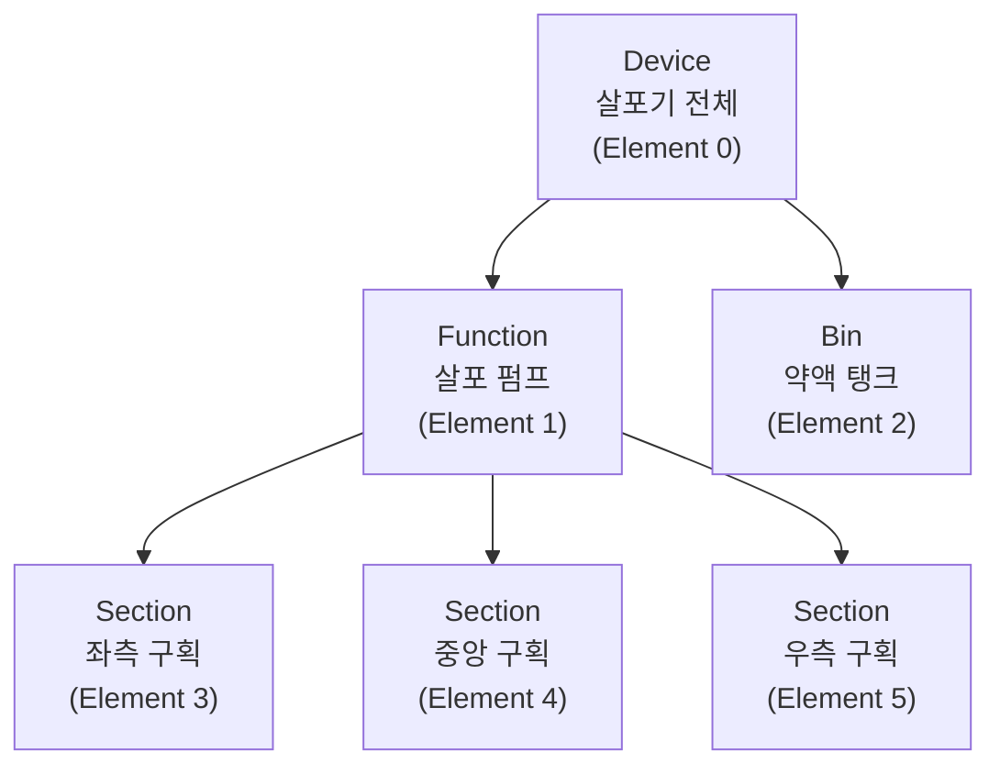
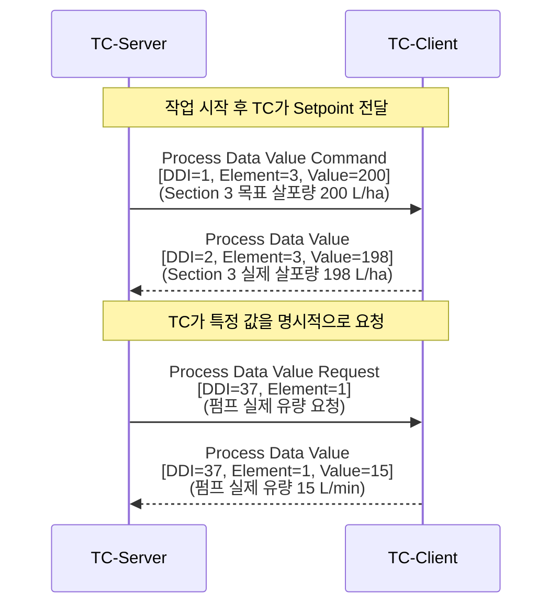
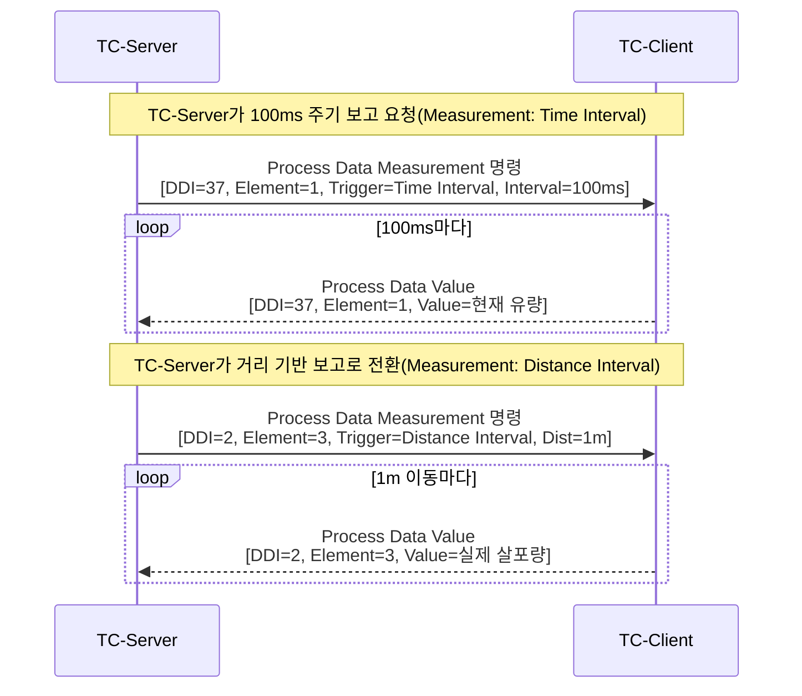
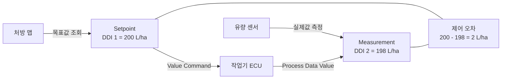
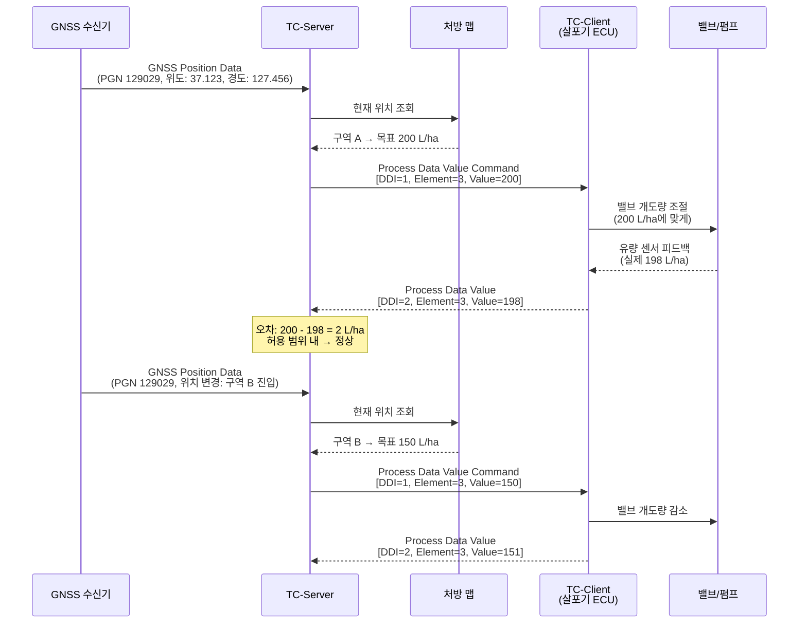

# TC 프로세스 데이터

::: info 학습 목표
- DDI(Data Dictionary Identifier)의 의미와 주요 번호를 설명할 수 있다.
- Device Element의 타입과 역할을 구분할 수 있다.
- Value Command와 Process Data Value의 흐름을 시퀀스 다이어그램으로 그릴 수 있다.
- Measurement와 Setpoint의 차이를 이해하고 제어 오차의 개념을 설명할 수 있다.
- 살포량 제어 시나리오를 통해 전체 프로세스 데이터 흐름을 추적할 수 있다.
:::

## 1. DDI (Data Dictionary Identifier)

<strong>DDI</strong>는 TC 프로세스 데이터 항목을 구분하는 표준화된 16비트 번호이다.

> DDI는 "어떤 종류의 데이터인가"를 나타낸다. 살포량인지, 속도인지, 면적인지를 숫자로 표현한다.

값을 주고받는 Process Data 메시지는 DDI를 포함하여 어떤 데이터를 주고받는지 명시한다. 주요 DDI는 다음과 같다.

| DDI | 이름 | 방향 | 설명 |
|-----|------|------|------|
| **1** | Setpoint Volume Per Area Application Rate | TC → 작업기 | 면적당 목표 살포량 (액체) |
| **2** | Actual Volume Per Area Application Rate | 작업기 → TC | 면적당 실제 살포량 (센서 측정) |
| **6** | Setpoint Mass Per Area Application Rate | TC → 작업기 | 면적당 목표 살포 질량 (고체) |
| **7** | Actual Mass Per Area Application Rate | 작업기 → TC | 면적당 실제 살포 질량 |
| **36** | Setpoint Volume Per Time Application Rate | TC → 작업기 | 시간당 목표 유량 |
| **37** | Actual Volume Per Time Application Rate | 작업기 → TC | 시간당 실제 유량 |
| **141** | Actual Work State | 작업기 → TC | 요소의 실제 작업 상태 (2비트: 00=Off, 01=On, 10=오류, 11=미설치) |
| **289** | Setpoint Work State | TC → 작업기 | 개별 요소의 ON/OFF 목표 명령 (DDI 141의 명령 짝) |
| **290** | Setpoint Condensed Work State (1-16) | TC → 작업기 | 섹션 1~16의 ON/OFF 일괄 명령 (섹션당 2비트) |

전체 DDI 목록은 [isobus.net](https://www.isobus.net/isobus/dDI)에서 확인할 수 있다. 현재 약 600개 이상의 DDI가 정의되어 있다.

### DDI가 없으면 TC는 데이터를 해석할 수 없다

TC가 수신하는 메시지에는 32비트 정수 값이 포함된다. 그 값이 어떤 의미인지—살포량인지, 유량인지, 속도인지—는 오직 DDI가 결정한다. DDI 없이 값만 전달되면 TC는 바이트 데이터의 의미를 전혀 해석할 수 없다. DDI는 데이터의 "단위표"이자 "해석 키"이다.

### Resolution(분해능)과 단위

각 DDI에는 표준으로 정해진 분해능과 단위가 있다. TC-Client는 이 규칙에 따라 정수 값을 인코딩하여 전송하고, TC-Server는 동일한 규칙으로 디코딩한다.

| DDI | 단위 | 분해능 | 예시 |
|-----|------|--------|------|
| 1 (Setpoint Volume Per Area) | mm³/m² | 0.01 | 원시값 2,000,000 → 20,000 mm³/m² = 200 L/ha |
| 2 (Actual Volume Per Area) | mm³/m² | 0.01 | 원시값 1,980,000 → 19,800 mm³/m² = 198 L/ha |
| 36 (Setpoint Volume Per Time) | mm³/s | 1 | 원시값 250,000 → 250,000 mm³/s = 15 L/min |
| 37 (Actual Volume Per Time) | mm³/s | 1 | 원시값 246,667 → 246,667 mm³/s ≈ 14.8 L/min |

mm³/m²는 μL/m²와 같은 값이며, 1 L/ha = 100 mm³/m²다. 시간당 유량은 1 L/min = 16,666.7 mm³/s로 환산된다. 분해능이 다른 DDI끼리 값을 교환하면 단위 불일치가 발생한다. TC 구현 시 DDI별 스케일 팩터를 반드시 적용해야 한다.

### Setpoint DDI와 Actual DDI의 쌍 구조

ISOBUS 표준은 같은 물리량에 대해 Setpoint DDI와 Actual DDI를 쌍으로 정의한다. TC-Server는 Setpoint DDI로 목표값을 명령하고, 작업기 ECU는 Actual DDI로 실제 측정값을 보고한다.

| 물리량 | <strong>Setpoint</strong> DDI (TC → 작업기) | <strong>Actual</strong> DDI (작업기 → TC) |
|--------|------|------|
| 면적당 살포량 | DDI 1 | DDI 2 |
| 시간당 유량 | DDI 36 | DDI 37 |
| 면적당 살포 질량 | DDI 6 | DDI 7 |
| 작업 상태(Work State) | DDI 289 | DDI 141 |

이 쌍 구조 덕분에 TC는 목표값(DDI 1)과 실제값(DDI 2)을 같은 물리 단위로 비교하여 제어 오차를 계산할 수 있다.

## 2. Element

<strong>Device Element(DeviceElement)</strong>는 작업기의 논리적 구성 단위이다. 물리적 장치를 계층적으로 표현한다.

### Element Type

| 코드 | 타입 | 설명 | 예시 |
|------|------|------|------|
| 1 | **Device** | 전체 장치 (최상위, DDOP당 1개, Element Number=0) | 살포기 전체 |
| 2 | **Function** | 기능 단위 | 살포 펌프, 교반기 |
| 3 | **Bin** | 저장 용기 | 약액 탱크, 비료 빈 |
| 4 | **Section** | 분할 구획 | 붐 스프레이어의 좌/우 섹션 |
| 5 | **Unit** | Section 하위의 가장 세분화된 주소 지정 단위 | 노즐, 파종 로우 유닛 |
| 6 | **Connector** | 연결 포인트 | 히치 연결부 |
| 7 | **Navigation Reference** | 위치 기준점 | GPS 안테나 기준 작업 위치 오프셋 |

각 Element는 <strong>Element Number</strong>로 식별된다. 예를 들어, Section 1은 Element Number 1, Section 2는 Element Number 2로 구분된다.

```mermaid
graph TD
    DEV["Device<br>살포기 전체<br>(Element 0)"]
    FUNC["Function<br>살포 펌프<br>(Element 1)"]
    BIN["Bin<br>약액 탱크<br>(Element 2)"]
    SEC1["Section<br>좌측 구획<br>(Element 3)"]
    SEC2["Section<br>중앙 구획<br>(Element 4)"]
    SEC3["Section<br>우측 구획<br>(Element 5)"]

    DEV --> FUNC
    DEV --> BIN
    FUNC --> SEC1
    FUNC --> SEC2
    FUNC --> SEC3
```

### Element 간 부모-자식 관계

Element는 계층 구조를 이룬다. <strong>Device</strong>가 최상위이며, 그 아래에 <strong>Function</strong>과 <strong>Bin</strong>이 중간 계층으로 위치한다. <strong>Section</strong>은 이 예시에서 가장 말단에 해당하며, 실제로는 그 아래에 노즐 단위인 <strong>Unit</strong>이 더 세분화된 계층으로 올 수 있다. TC-Server가 특정 Element에 명령을 보낼 때는 해당 Element Number를 지정한다. 부모 Element에 명령을 보내면 그 아래 모든 자식 Element에 적용되는 것이 일반적이다.

TC가 특정 Section에만 명령을 보내려면 해당 Section의 Element Number를 명시적으로 지정해야 한다. 예를 들어, Section 3(Element 5)에만 DDI 289(Setpoint Work State)로 OFF 명령을 보내면, 나머지 두 구획(Section 1, Section 2)은 살포를 계속하면서 우측 구획만 살포가 중단된다. 작업기 ECU는 실제로 반영된 상태를 DDI 141(Actual Work State)로 되돌려 보고한다. 이 메커니즘이 붐 스프레이어의 구획별 살포 제어(Section Control)를 가능하게 한다.

## 3. Value Command / Value Request

TC-Server와 TC-Client는 **Process Data** 메시지(PGN: 0x00CB00)를 통해 값을 주고받는다.

### 메시지 방향

| 메시지 | 방향 | Command 코드 | 설명 |
|--------|------|------|------|
| **Process Data Value Command** | TC-Server → TC-Client | 316 (Value command) | 설정값(Setpoint) 전달, 작업기에 목표값 명령 |
| **Process Data Value** | TC-Client → TC-Server | 4~816 (Measurement) | 측정값(Measurement) 보고 |
| **Process Data Value Request** | TC-Server → TC-Client | 216 (Request value) | 특정 DDI의 현재값을 1회 요청 |

Process Data 메시지의 첫 니블은 이처럼 016~F16 범위의 command 값으로 메시지 종류를 구분한다. 값 설정과 동시에 수신 확인이 필요하면 A16(Set Value and Acknowledge)을 쓰며, 이 경우 응답은 아래에서 다룰 PDACK(D16)로 온다.

### 시퀀스 다이어그램

```mermaid
sequenceDiagram
    participant TC as TC-Server
    participant CLIENT as TC-Client

    Note over TC,CLIENT: 작업 시작 후 TC가 Setpoint 전달
    TC ->> CLIENT: Process Data Value Command<br>[DDI=1, Element=3, Value=200]<br>(Section 3 목표 살포량 200 L/ha)

    CLIENT -->> TC: Process Data Value<br>[DDI=2, Element=3, Value=198]<br>(Section 3 실제 살포량 198 L/ha)

    Note over TC,CLIENT: TC가 특정 값을 명시적으로 요청
    TC ->> CLIENT: Process Data Value Request<br>[DDI=37, Element=1]<br>(펌프 실제 유량 요청)

    CLIENT -->> TC: Process Data Value<br>[DDI=37, Element=1, Value=15]<br>(펌프 실제 유량 15 L/min)
```

### PGN 0x00CB00 메시지 구조

Process Data 메시지는 총 8바이트로 구성되며, 필드 순서는 <strong>Command → Element Number → DDI → Value</strong>다.

| 바이트 | 필드 | 설명 |
|--------|------|------|
| 0 (하위 4비트) | Command | 명령 코드 (2=Request Value, 3=Value Command, A=Set Value and Acknowledge 등) |
| 0 (상위 4비트) + 1 | Element Number | 대상 Element 번호 (12비트, 0~4095) |
| 2–3 | DDI | 데이터 항목 번호 (16비트) |
| 4–7 | Value | 32비트 부호 있는 정수 값 |

Element Number가 DDI보다 앞선 바이트에 위치한다는 점에 주의한다 — "어느 요소의 값인가"를 먼저 지정하고, 그 뒤에 "어떤 종류의 값인가(DDI)"를 붙이는 순서다.

### PDACK (Process Data Acknowledge)

TC-Client(Working Set Master)와 TC-Server는 명령을 수락·거부할 때 <strong>PDACK</strong>(command D16)로 응답할 수 있다. Element Number·DDI·오류 코드(0=정상, 그 외 비트=명령 미지원/잘못된 Element/DDI 미지원/트리거 미지원/설정 불가/유효 범위 초과 등)를 담아 반환한다. 불필요한 버스 부하를 피하기 위해, 오류 코드 0(정상)인 PDACK는 Measurement 명령(4~816)과 Set Value and Acknowledge(A16)에 대해서만 보내고 나머지 명령에는 생략한다.

### Trigger Method

TC-Client가 Measurement 값을 TC-Server에 보고하는 조건을 <strong>Trigger Method</strong>라고 한다. TC-Server는 Measurement 명령(4~816)을 보내 TC-Client에 트리거 방법과 그 파라미터(간격·임계값)를 설정한다.

| 트리거 방법 | 설명 | 예시 |
|-------------|------|------|
| **Time Interval** | 일정 시간마다 보고 | 100ms마다 현재 유량 전송 |
| **Distance Interval** | 일정 거리마다 보고 | 1m 이동할 때마다 살포량 전송 |
| **Threshold** | 값이 최소/최대 임계값을 벗어날 때 보고 | 유량이 5 L/min 미만으로 떨어지면 전송 |
| **On Change** | 마지막 보고 이후 변화량이 설정한 임계값 이상일 때 보고 | 섹션 상태가 ON→OFF로 바뀔 때만 전송 |
| **Total** | 누적값 요청 시 보고 | 작업 종료 후 총 살포량 요청 |

TC-Server가 트리거 방법을 설정하는 흐름은 다음과 같다.

```mermaid
sequenceDiagram
    participant TC as TC-Server
    participant CLIENT as TC-Client

    Note over TC,CLIENT: TC-Server가 100ms 주기 보고 요청(Measurement: Time Interval)
    TC ->> CLIENT: Process Data Measurement 명령<br>[DDI=37, Element=1, Trigger=Time Interval, Interval=100ms]

    loop 100ms마다
        CLIENT -->> TC: Process Data Value<br>[DDI=37, Element=1, Value=현재 유량]
    end

    Note over TC,CLIENT: TC-Server가 거리 기반 보고로 전환(Measurement: Distance Interval)
    TC ->> CLIENT: Process Data Measurement 명령<br>[DDI=2, Element=3, Trigger=Distance Interval, Dist=1m]

    loop 1m 이동마다
        CLIENT -->> TC: Process Data Value<br>[DDI=2, Element=3, Value=실제 살포량]
    end
```

트리거 방법을 적절히 설정하면 CAN 버스 트래픽을 줄이면서도 필요한 시점에 정확한 데이터를 수집할 수 있다.

## 4. Measurement / Setpoint

TC 프로세스 데이터는 크게 두 가지로 구분된다.

| 구분 | 생성 주체 | 방향 | 의미 |
|------|-----------|------|------|
| **Setpoint** | TC-Server | TC → 작업기 | TC가 처방 맵에서 조회한 목표 값 |
| **Measurement** | 작업기 센서 | 작업기 → TC | 작업기가 실제로 측정한 값 |

```mermaid
graph LR
    MAP["처방 맵"] -->|"목표값 조회"| SP["Setpoint<br>DDI 1 = 200 L/ha"]
    SENSOR["유량 센서"] -->|"실제값 측정"| MS["Measurement<br>DDI 2 = 198 L/ha"]

    SP -->|"Value Command"| ECU["작업기 ECU"]
    ECU -->|"Process Data Value"| MS

    SP --- ERR["제어 오차<br>200 - 198 = 2 L/ha"]
    MS --- ERR
```

**제어 오차(Control Error)** = Setpoint − Measurement

작업기의 제어 시스템은 이 오차를 최소화하도록 밸브 개도량, 펌프 속도 등을 조절한다. TC는 오차가 허용 범위를 벗어나면 알람을 발생시킬 수 있다.

오차가 허용 범위를 벗어나면 TC는 ISO 11783-12에 정의된 <strong>DM1(Diagnostic Message 1)</strong> 진단 코드를 생성할 수 있다. DM1 메시지는 SPN(Suspect Parameter Number)과 FMI(Failure Mode Indicator)를 포함하여 어떤 파라미터가 어떤 방식으로 이상 상태인지 기록한다. 예를 들어 실제 살포량이 목표값 대비 20% 이상 낮으면 "유량 부족" 진단 코드가 발생할 수 있다.

작업기 ECU 내부에서는 <strong>PID(Proportional-Integral-Derivative) 제어 루프</strong>가 오차를 줄이는 방향으로 밸브를 조절한다. P 항은 현재 오차에 즉각적으로 반응하고, I 항은 지속적인 정상 오차(Steady-State Error)를 제거하며, D 항은 오차 변화율에 반응하여 과도한 진동을 억제한다. TC-Server는 Setpoint를 명령할 뿐이며, PID 제어는 전적으로 작업기 ECU(TC-Client 측)가 수행한다.

## 5. 프로세스 데이터 흐름 실습

### 시나리오: GPS 기반 살포량 제어

트랙터가 밭을 주행하면서 위치에 따라 비료 살포량을 자동으로 조절하는 시나리오이다.

**조건**
- 처방 맵: 구역 A = 200 L/ha, 구역 B = 150 L/ha
- 살포기: 3구획, 각 3m 폭 (총 9m)
- DDI 1: Setpoint Volume Per Area / DDI 2: Actual Volume Per Area

```mermaid
sequenceDiagram
    participant GPS as GNSS 수신기
    participant TC as TC-Server
    participant MAP as 처방 맵
    participant CLIENT as TC-Client<br>(살포기 ECU)
    participant VALVE as 밸브/펌프

    GPS ->> TC: GNSS Position Data<br>(PGN 129029, 위도: 37.123, 경도: 127.456)

    TC ->> MAP: 현재 위치 조회
    MAP -->> TC: 구역 A → 목표 200 L/ha

    TC ->> CLIENT: Process Data Value Command<br>[DDI=1, Element=3, Value=200]

    CLIENT ->> VALVE: 밸브 개도량 조절<br>(200 L/ha에 맞게)

    VALVE -->> CLIENT: 유량 센서 피드백<br>(실제 198 L/ha)

    CLIENT -->> TC: Process Data Value<br>[DDI=2, Element=3, Value=198]

    Note over TC: 오차: 200 - 198 = 2 L/ha<br>허용 범위 내 → 정상

    GPS ->> TC: GNSS Position Data<br>(PGN 129029, 위치 변경: 구역 B 진입)

    TC ->> MAP: 현재 위치 조회
    MAP -->> TC: 구역 B → 목표 150 L/ha

    TC ->> CLIENT: Process Data Value Command<br>[DDI=1, Element=3, Value=150]

    CLIENT ->> VALVE: 밸브 개도량 감소
    CLIENT -->> TC: Process Data Value<br>[DDI=2, Element=3, Value=151]
```

이 시퀀스는 TC 프로세스 데이터의 전체 흐름을 보여준다. GPS 위치 변화에 따라 처방 맵의 목표값이 바뀌고, TC는 그 값을 즉시 TC-Client에 전달한다.

> **핵심 정리**
> - DDI(Data Dictionary Identifier)는 TC 데이터 항목을 구분하는 16비트 표준 번호이다. DDI 1=Setpoint Volume Per Area Application Rate, DDI 2=Actual Volume Per Area Application Rate.
> - Device Element는 작업기의 논리적 구성 단위로, Device/Function/Bin/Section/Unit 등의 타입으로 분류된다.
> - TC-Server → TC-Client 방향의 Value Command로 Setpoint를 전달하고, TC-Client → TC-Server 방향의 Process Data Value로 Measurement를 보고한다.
> - Setpoint는 처방 맵 기반 목표값이고, Measurement는 센서 실측값이며, 그 차이가 제어 오차가 된다.
> - GPS 위치(NMEA 2000 GNSS Position Data, PGN 129029) → 처방 맵 조회 → Value Command 전송 → 밸브 조절 → Measurement 보고 순으로 제어 루프가 완성된다.

## 다음 챕터

- 다음 : [TC DDOP](/study/isobus/20-tc-ddop)
