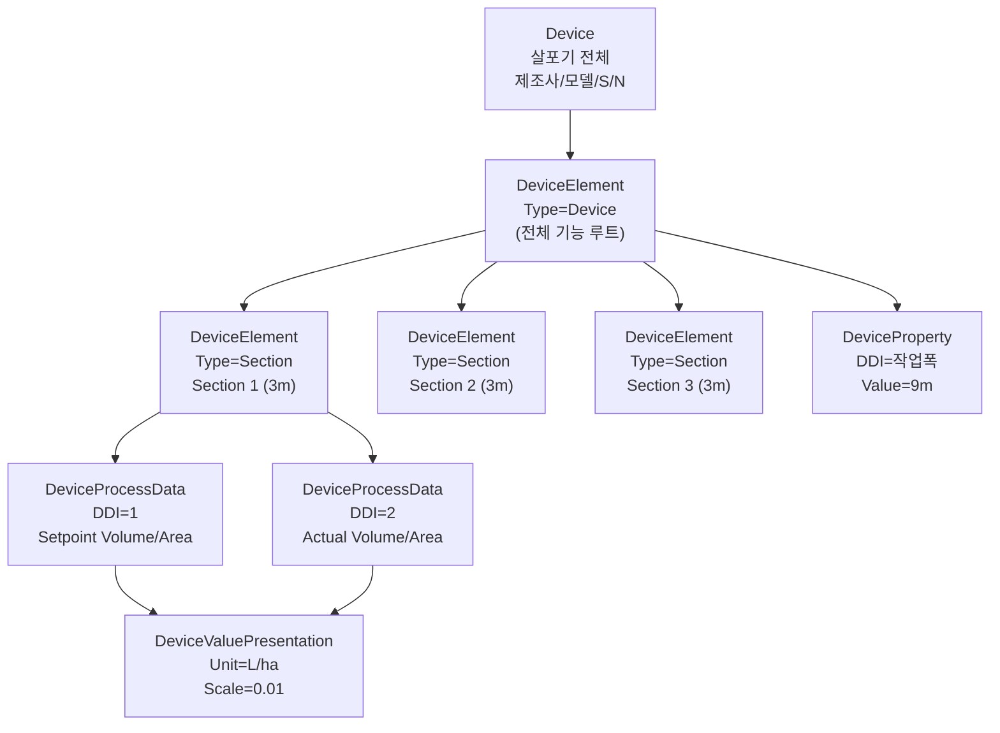
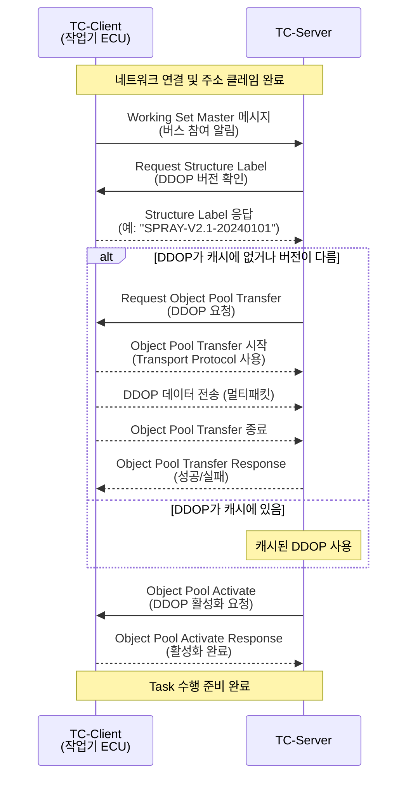
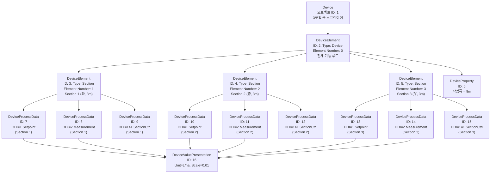

# TC 디바이스 디스크립션 (DDOP)

## 학습 목표
- DDOP가 무엇이고 왜 필요한지 설명할 수 있다.
- DDOP를 구성하는 5가지 오브젝트 타입의 역할을 구분할 수 있다.
- DDOP 전송 과정을 시퀀스 다이어그램으로 그릴 수 있다.
- 3구획 살포기의 DDOP를 직접 설계하고 오브젝트 표를 작성할 수 있다.

---

## 1. DDOP란

<strong>DDOP(Device Description Object Pool)</strong>는 작업기가 자기 자신의 구조와 능력을 TC에게 알려주는 데이터 집합입니다.

> DDOP는 "작업기의 자기소개서"입니다.

TC-Server는 버스에 연결된 작업기에 대해 아무런 사전 정보가 없습니다. 작업기가 어떤 구획(Section)을 가졌는지, 어떤 DDI를 지원하는지, 작업폭이 얼마인지를 TC는 알 수 없습니다. DDOP는 이 정보를 구조화된 형식으로 TC에 전달하여, TC가 작업기를 이해하고 제어할 수 있게 합니다.

**DDOP가 없다면:**
- TC는 작업기에 어떤 명령을 보낼 수 있는지 모릅니다.
- 처방 맵의 살포량을 어느 DDI로 전달해야 하는지 알 수 없습니다.
- Section Control을 위해 몇 개의 구획이 있는지 파악하지 못합니다.

**DDOP가 있다면:**
- TC는 작업기의 구조를 파악하고 적절한 명령을 선택합니다.
- 지원되지 않는 DDI로의 명령 시도를 사전에 방지합니다.

---

## 2. DDOP 오브젝트 구조

DDOP는 5가지 타입의 오브젝트로 구성됩니다.

| 오브젝트 타입 | 역할 | 주요 속성 |
|--------------|------|-----------|
| **Device** | 장치 전체 정보 (최상위) | 제조사, 제품명, 시리얼번호, Structure Label |
| **DeviceElement** | 장치의 논리적 구성 요소 | Element Type, Element Number, 부모 Element |
| **DeviceProcessData** | 지원하는 프로세스 데이터 항목 | DDI, Property Flag (Setpoint/Measurement), Trigger Methods |
| **DeviceProperty** | 고정 속성값 | DDI, 값 (작업폭, 구획 폭 등) |
| **DeviceValuePresentation** | 데이터 표현 방식 | 오프셋, 스케일, 단위 기호 |

### 오브젝트 타입 상세

**Device**
- DDOP 전체의 루트 오브젝트입니다.
- `Structure Label`: DDOP 버전을 나타내는 식별자입니다. TC는 이 라벨을 보고 DDOP를 새로 받을지 캐시된 것을 쓸지 결정합니다.
- `Localization Label`: 언어·단위 설정

**DeviceElement**
- 작업기의 논리적 부품입니다. Element Type으로 역할을 정의합니다.
- `Device`: 장치 전체를 대표하는 Element
- `Function`: 살포 펌프, 파종 유닛 등 기능 단위
- `Section`: 독립 제어 가능한 구획
- `Bin`: 씨앗·비료 저장 용기
- `Connector`: 히치 연결점

**DeviceProcessData**
- DeviceElement에 연결되며, 해당 Element에서 지원하는 DDI 항목을 정의합니다.
- `Property Flag`: Setpoint 지원 여부, Measurement 지원 여부, Default 값 설정 가능 여부
- `Trigger Methods`: 값 보고 트리거 (시간 기반, 변화량 기반, 요청 기반)

**DeviceProperty**
- 변하지 않는 고정 속성입니다. 작업폭, 구획 폭 등이 여기에 해당합니다.
- DeviceProcessData와 달리 TC가 값을 변경하지 않습니다.

**DeviceValuePresentation**
- 숫자값을 사람이 읽기 쉬운 형식으로 변환하는 규칙입니다.
- 공식: `표시값 = (원시값 + Offset) × Scale`
- 예: 원시값 20000, Offset=0, Scale=0.01 → 표시값 200.00 L/ha

---

## 3. DDOP 전송 과정

작업기가 ISOBUS 네트워크에 연결되면 다음 순서로 DDOP를 전송합니다.

### 전송 프로토콜

DDOP 데이터는 일반적으로 수백 바이트~수 킬로바이트에 달하므로, 단일 CAN 프레임으로 전송할 수 없습니다. ISO 11783의 **TP(Transport Protocol)** 또는 <strong>ETP(Extended Transport Protocol)</strong>를 사용하여 멀티패킷으로 분할 전송합니다.

---

## 4. DDOP 설계 예제

### 대상: 3구획 붐 스프레이어

- 총 작업폭: 9m (3구획 × 3m)
- 지원 기능: Section Control(구획별 ON/OFF), Rate Control(살포량 가변)
- 지원 DDI: DDI 1(Setpoint Volume/Area), DDI 2(Actual Volume/Area), DDI 141(Section Control State)

### DDOP 계층 구조

### DDOP 오브젝트 정의 표

| 오브젝트 ID | 타입 | 주요 속성 | 값 |
|------------|------|----------|-----|
| 1 | Device | 제품명 | BoomSprayer-3S |
|   |        | 제조사 | ExampleCo |
|   |        | Structure Label | SPRY3-V1.0 |
| 2 | DeviceElement | Type | Device |
|   |               | Element Number | 0 |
|   |               | 부모 | Device(1) |
| 3 | DeviceElement | Type | Section |
|   |               | Element Number | 1 |
|   |               | 부모 | DE(2) |
| 4 | DeviceElement | Type | Section |
|   |               | Element Number | 2 |
|   |               | 부모 | DE(2) |
| 5 | DeviceElement | Type | Section |
|   |               | Element Number | 3 |
|   |               | 부모 | DE(2) |
| 6 | DeviceProperty | DDI | 작업폭 DDI |
|   |               | Value | 9000 (단위: mm) |
|   |               | 연결 Element | DE(2) |
| 7 | DeviceProcessData | DDI | 1 (Setpoint Vol/Area) |
|   |                   | Property Flag | Setpoint 지원 |
|   |                   | 연결 Element | DE(3) — Section 1 |
| 8 | DeviceProcessData | DDI | 2 (Actual Vol/Area) |
|   |                   | Property Flag | Measurement 지원 |
|   |                   | Trigger | 변화량(10 L/ha 이상 변화 시) |
|   |                   | 연결 Element | DE(3) — Section 1 |
| 9 | DeviceProcessData | DDI | 141 (Section Ctrl) |
|   |                   | Property Flag | Setpoint 지원 |
|   |                   | 연결 Element | DE(3) — Section 1 |
| 10–12 | DeviceProcessData | (Section 2 동일 구조) | DE(4) 연결 |
| 13–15 | DeviceProcessData | (Section 3 동일 구조) | DE(5) 연결 |
| 16 | DeviceValuePresentation | Offset | 0 |
|    |                         | Scale | 0.01 |
|    |                         | Unit Symbol | L/ha |

이 DDOP를 수신한 TC-Server는 다음을 파악합니다.

- 이 작업기는 3개의 Section을 가진 살포기이다.
- 각 Section에 DDI 1(Setpoint), DDI 2(Measurement), DDI 141(Section Control)을 지원한다.
- 전체 작업폭은 9m이다.
- 값의 단위는 L/ha이며 스케일 인자는 0.01이다.

---

> **핵심 정리**
> - DDOP(Device Description Object Pool)는 작업기가 TC에게 자신의 구조와 능력을 알리는 데이터로, "작업기의 자기소개서"이다.
> - DDOP는 Device, DeviceElement, DeviceProcessData, DeviceProperty, DeviceValuePresentation 5가지 오브젝트로 구성된다.
> - TC-Client는 연결 시 Structure Label을 먼저 전달하고, TC가 요청하면 DDOP 전체를 멀티패킷으로 전송한다.
> - TC는 DDOP를 파싱하여 지원 DDI, Section 구성, 작업폭 등을 파악한 뒤 Task를 활성화한다.
> - 3구획 살포기 DDOP에는 Section별로 DDI 1(Setpoint), DDI 2(Measurement), DDI 141(Section Control) 항목이 정의된다.

---

이전: [TC 프로세스 데이터](/study/isobus/19-tc-process-data) | 다음: [TC Task 관리](/study/isobus/21-tc-task)
