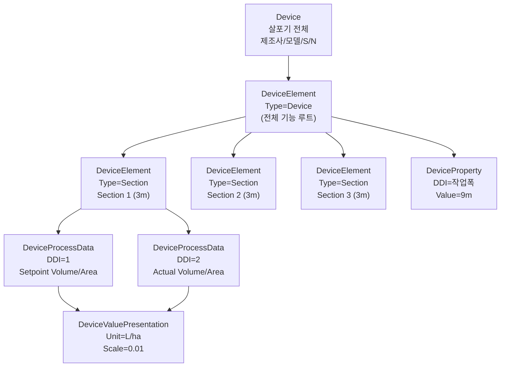
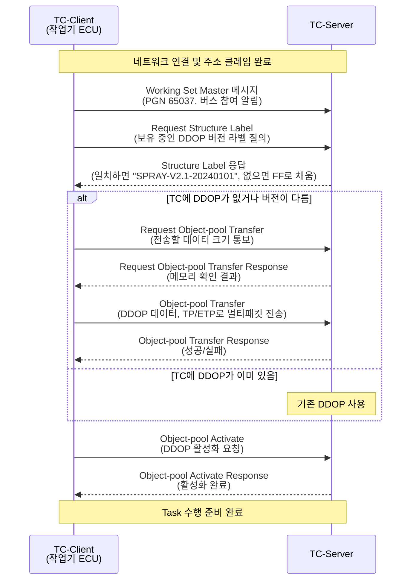
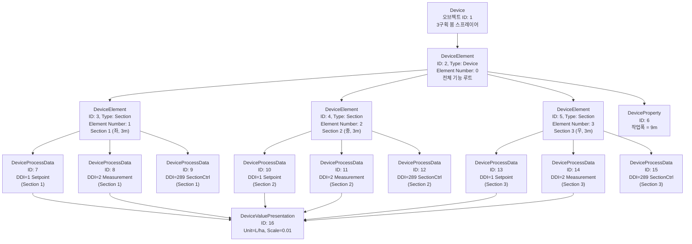

# TC 디바이스 디스크립션 (DDOP)

::: info 학습 목표
- DDOP가 무엇이고 왜 필요한지 설명할 수 있다.
- DDOP를 구성하는 5가지 오브젝트 타입의 역할을 구분할 수 있다.
- DDOP 전송 과정을 시퀀스 다이어그램으로 그릴 수 있다.
- 3구획 살포기의 DDOP를 직접 설계하고 오브젝트 표를 작성할 수 있다.
:::

## 1. DDOP란

<strong>DDOP(Device Description Object Pool)</strong>는 작업기가 자기 자신의 구조와 능력을 TC에게 알려주는 데이터 집합이다.

> DDOP는 "작업기의 자기소개서"이다.

TC-Server는 버스에 연결된 작업기에 대해 아무런 사전 정보가 없다. 작업기가 어떤 구획(Section)을 가졌는지, 어떤 DDI를 지원하는지, 작업폭이 얼마인지를 TC는 알 수 없다. DDOP는 이 정보를 구조화된 형식으로 TC에 전달하여, TC가 작업기를 이해하고 제어할 수 있게 한다.

**DDOP가 없다면:**
- TC는 작업기에 어떤 명령을 보낼 수 있는지 모른다.
- 처방 맵의 살포량을 어느 DDI로 전달해야 하는지 알 수 없다.
- Section Control을 위해 몇 개의 구획이 있는지 파악하지 못한다.

**DDOP가 있다면:**
- TC는 작업기의 구조를 파악하고 적절한 명령을 선택한다.
- 지원되지 않는 DDI로의 명령 시도를 사전에 방지한다.

## 2. DDOP 오브젝트 구조

DDOP는 5가지 타입의 오브젝트로 구성된다.

| 오브젝트 타입 | 역할 | 주요 속성 |
|--------------|------|-----------|
| **Device** | 장치 전체 정보 (최상위) | 제조사, 제품명, 시리얼번호, Structure Label |
| **DeviceElement** | 장치의 논리적 구성 요소 | Element Type, Element Number, 부모 Element |
| **DeviceProcessData** | 지원하는 프로세스 데이터 항목 | DDI, Property Flag (default/settable/control source), Trigger Methods |
| **DeviceProperty** | 고정 속성값 | DDI, 값 (작업폭, 구획 폭 등) |
| **DeviceValuePresentation** | 데이터 표현 방식 | 오프셋, 스케일, 소수 자릿수, 단위 기호 |


```mermaid
graph TD
    DVC["Device<br>살포기 전체<br>제조사/모델/S/N"]

    DE_ROOT["DeviceElement<br>Type=Device<br>(전체 기능 루트)"]
    DE_SEC1["DeviceElement<br>Type=Section<br>Section 1 (3m)"]
    DE_SEC2["DeviceElement<br>Type=Section<br>Section 2 (3m)"]
    DE_SEC3["DeviceElement<br>Type=Section<br>Section 3 (3m)"]

    DPD_SP["DeviceProcessData<br>DDI=1<br>Setpoint Volume/Area"]
    DPD_MS["DeviceProcessData<br>DDI=2<br>Actual Volume/Area"]

    DPROP["DeviceProperty<br>DDI=작업폭<br>Value=9m"]

    DVP["DeviceValuePresentation<br>Unit=L/ha<br>Scale=0.01"]

    DVC --> DE_ROOT
    DE_ROOT --> DE_SEC1
    DE_ROOT --> DE_SEC2
    DE_ROOT --> DE_SEC3
    DE_SEC1 --> DPD_SP
    DE_SEC1 --> DPD_MS
    DE_ROOT --> DPROP
    DPD_SP --> DVP
    DPD_MS --> DVP
```

### 오브젝트 타입 상세

**Device**
- DDOP 전체의 루트 오브젝트이다.
- `Structure Label`: DDOP 버전을 나타내는 식별자이다. TC는 이 라벨을 보고 DDOP를 새로 받을지 캐시된 것을 쓸지 결정한다.
- `Localization Label`: 언어·단위 설정

**DeviceElement**
- 작업기의 논리적 부품이다. Element Type(1바이트 코드)으로 역할을 정의한다.
- `1 Device`: 장치 전체를 대표하는 Element (DDOP당 1개)
- `2 Function`: 살포 펌프, 파종 유닛 등 기능 단위
- `3 Bin`: 씨앗·비료 저장 용기
- `4 Section`: 독립 제어 가능한 구획
- `5 Unit`: Section 하위의 가장 세분화된 단위 (노즐, 파종 로우 유닛 등)
- `6 Connector`: 히치 연결점
- `7 Navigation Reference`: GPS 안테나 등 내비게이션 기준 위치
- Element Number는 12비트(0~4095)이며, Parent Object ID로 상위 Element(또는 Device)를 참조해 계층을 구성한다.

**DeviceProcessData**
- DeviceElement에 연결되며, 해당 Element에서 지원하는 DDI 항목을 정의한다.
- `Property Flag`(3비트): bit1 = 기본값(default) 세트 멤버 여부, bit2 = settable(TC가 값을 설정 가능 — Setpoint류), bit3 = control source(다른 CF의 setpoint 값을 결정하는 소스로 동작). bit2·bit3은 동시에 설정될 수 없다.
- `Trigger Methods`(5비트): time interval(시간 간격), distance interval(거리 간격), threshold limits(임계값), on change(변화량), total(누적값)

**DeviceProperty**
- 변하지 않는 고정 속성이다. 작업폭, 구획 폭 등이 여기에 해당한다.
- DeviceProcessData와 달리 TC가 값을 변경하지 않는다.

**DeviceValuePresentation**
- 숫자값을 사람이 읽기 쉬운 형식으로 변환하는 규칙이다.
- 공식: `표시값 = (원시값 + Offset) × Scale`
- 예: 원시값 20000, Offset=0, Scale=0.01 → 표시값 200.00 L/ha
- `Number of decimals`(0~7) 속성으로 표시 소수 자릿수도 함께 정의한다.

## 3. DDOP 전송 과정

DDOP 관련 메시지는 모두 <strong>TC-Client가 TC/DL에게 보내는 요청</strong>과 그에 대한 TC의 응답으로 구성된다 — TC가 먼저 DDOP를 요구하는 것이 아니라, 클라이언트가 자신의 device descriptor를 TC에 질의·전송·활성화하는 흐름이다.


```mermaid
sequenceDiagram
    participant CLIENT as TC-Client<br>(작업기 ECU)
    participant TC as TC-Server

    Note over CLIENT,TC: 네트워크 연결 및 주소 클레임 완료

    CLIENT ->> TC: Working Set Master 메시지<br>(PGN 65037, 버스 참여 알림)

    CLIENT ->> TC: Request Structure Label<br>(보유 중인 DDOP 버전 라벨 질의)

    TC -->> CLIENT: Structure Label 응답<br>(일치하면 "SPRAY-V2.1-20240101", 없으면 FF로 채움)

    alt TC에 DDOP가 없거나 버전이 다름
        CLIENT ->> TC: Request Object-pool Transfer<br>(전송할 데이터 크기 통보)
        TC -->> CLIENT: Request Object-pool Transfer Response<br>(메모리 확인 결과)
        CLIENT ->> TC: Object-pool Transfer<br>(DDOP 데이터, TP/ETP로 멀티패킷 전송)
        TC -->> CLIENT: Object-pool Transfer Response<br>(성공/실패)
    else TC에 DDOP가 이미 있음
        Note over TC: 기존 DDOP 사용
    end

    CLIENT ->> TC: Object-pool Activate<br>(DDOP 활성화 요청)
    TC -->> CLIENT: Object-pool Activate Response<br>(활성화 완료)

    Note over TC,CLIENT: Task 수행 준비 완료
```

### 전송 프로토콜

DDOP 데이터는 일반적으로 수백 바이트~수 킬로바이트에 달하므로, 단일 CAN 프레임으로 전송할 수 없다. ISO 11783의 <strong>TP(Transport Protocol, TP.CM 60416/TP.DT 60160)</strong> 또는 <strong>ETP(Extended Transport Protocol, ETP.CM 51200/ETP.DT 50944)</strong>를 사용하여 멀티패킷으로 분할 전송한다. 1,785바이트를 넘는 DDOP는 ETP를 써야 한다.

## 4. DDOP 설계 예제

### 대상: 3구획 붐 스프레이어

- 총 작업폭: 9m (3구획 × 3m)
- 지원 기능: Section Control(구획별 ON/OFF), Rate Control(살포량 가변)
- 지원 DDI: DDI 1(Setpoint Volume/Area), DDI 2(Actual Volume/Area), DDI 289(Setpoint Work State — 구획 ON/OFF 명령)

### DDOP 계층 구조


```mermaid
graph TD
    DVC["Device<br>오브젝트 ID: 1<br>3구획 붐 스프레이어"]

    DE0["DeviceElement<br>ID: 2, Type: Device<br>Element Number: 0<br>전체 기능 루트"]

    DE1["DeviceElement<br>ID: 3, Type: Section<br>Element Number: 1<br>Section 1 (좌, 3m)"]

    DE2["DeviceElement<br>ID: 4, Type: Section<br>Element Number: 2<br>Section 2 (중, 3m)"]

    DE3["DeviceElement<br>ID: 5, Type: Section<br>Element Number: 3<br>Section 3 (우, 3m)"]

    PROP["DeviceProperty<br>ID: 6<br>작업폭 = 9m"]

    DPD_SP1["DeviceProcessData<br>ID: 7<br>DDI=1 Setpoint<br>(Section 1)"]
    DPD_MS1["DeviceProcessData<br>ID: 8<br>DDI=2 Measurement<br>(Section 1)"]
    DPD_SC1["DeviceProcessData<br>ID: 9<br>DDI=289 SectionCtrl<br>(Section 1)"]

    DPD_SP2["DeviceProcessData<br>ID: 10<br>DDI=1 Setpoint<br>(Section 2)"]
    DPD_MS2["DeviceProcessData<br>ID: 11<br>DDI=2 Measurement<br>(Section 2)"]
    DPD_SC2["DeviceProcessData<br>ID: 12<br>DDI=289 SectionCtrl<br>(Section 2)"]

    DPD_SP3["DeviceProcessData<br>ID: 13<br>DDI=1 Setpoint<br>(Section 3)"]
    DPD_MS3["DeviceProcessData<br>ID: 14<br>DDI=2 Measurement<br>(Section 3)"]
    DPD_SC3["DeviceProcessData<br>ID: 15<br>DDI=289 SectionCtrl<br>(Section 3)"]

    DVP["DeviceValuePresentation<br>ID: 16<br>Unit=L/ha, Scale=0.01"]

    DVC --> DE0
    DE0 --> DE1
    DE0 --> DE2
    DE0 --> DE3
    DE0 --> PROP

    DE1 --> DPD_SP1
    DE1 --> DPD_MS1
    DE1 --> DPD_SC1

    DE2 --> DPD_SP2
    DE2 --> DPD_MS2
    DE2 --> DPD_SC2

    DE3 --> DPD_SP3
    DE3 --> DPD_MS3
    DE3 --> DPD_SC3

    DPD_SP1 --> DVP
    DPD_MS1 --> DVP
    DPD_SP2 --> DVP
    DPD_MS2 --> DVP
    DPD_SP3 --> DVP
    DPD_MS3 --> DVP
```

### DDOP 오브젝트 정의 표

| 오브젝트 ID | 타입 | 주요 속성 | 값 |
|------------|------|----------|-----|
| 1 | Device | 제품명 | BoomSprayer-3S |
|   |        | 제조사 | ExampleCo |
|   |        | Structure Label | SPRY3-V1.0 |
| 2 | DeviceElement | Type | Device |
|   |               | Element Number | 0 |
|   |               | 부모 | Device(1) |
| 3 | DeviceElement | Type | Section |
|   |               | Element Number | 1 |
|   |               | 부모 | DE(2) |
| 4 | DeviceElement | Type | Section |
|   |               | Element Number | 2 |
|   |               | 부모 | DE(2) |
| 5 | DeviceElement | Type | Section |
|   |               | Element Number | 3 |
|   |               | 부모 | DE(2) |
| 6 | DeviceProperty | DDI | 작업폭 DDI |
|   |               | Value | 9000 (단위: mm) |
|   |               | 연결 Element | DE(2) |
| 7 | DeviceProcessData | DDI | 1 (Setpoint Vol/Area) |
|   |                   | Property Flag | Setpoint 지원 |
|   |                   | 연결 Element | DE(3) — Section 1 |
| 8 | DeviceProcessData | DDI | 2 (Actual Vol/Area) |
|   |                   | Property Flag | Measurement 지원 |
|   |                   | Trigger | 변화량(10 L/ha 이상 변화 시) |
|   |                   | 연결 Element | DE(3) — Section 1 |
| 9 | DeviceProcessData | DDI | 289 (Setpoint Work State) |
|   |                   | Property Flag | Setpoint 지원 |
|   |                   | 연결 Element | DE(3) — Section 1 |
| 10–12 | DeviceProcessData | (Section 2 동일 구조) | DE(4) 연결 |
| 13–15 | DeviceProcessData | (Section 3 동일 구조) | DE(5) 연결 |
| 16 | DeviceValuePresentation | Offset | 0 |
|    |                         | Scale | 0.01 |
|    |                         | Unit Symbol | L/ha |

이 DDOP를 수신한 TC-Server는 다음을 파악한다.

- 이 작업기는 3개의 Section을 가진 살포기이다.
- 각 Section에 DDI 1(Setpoint), DDI 2(Measurement), DDI 289(Setpoint Work State)를 지원한다.
- 전체 작업폭은 9m이다.
- 값의 단위는 L/ha이며 스케일 인자는 0.01이다.

> **핵심 정리**
> - DDOP(Device Description Object Pool)는 작업기가 TC에게 자신의 구조와 능력을 알리는 데이터로, "작업기의 자기소개서"이다.
> - DDOP는 Device, DeviceElement, DeviceProcessData, DeviceProperty, DeviceValuePresentation 5가지 오브젝트로 구성된다.
> - TC-Client는 연결 시 자신의 Structure Label을 TC에 질의하고, TC가 모르는 버전이면 스스로 DDOP 전체를 멀티패킷으로 전송한다.
> - TC는 DDOP를 파싱하여 지원 DDI, Section 구성, 작업폭 등을 파악한 뒤 Task를 활성화한다.
> - 3구획 살포기 DDOP에는 Section별로 DDI 1(Setpoint), DDI 2(Measurement), DDI 289(Setpoint Work State) 항목이 정의된다.

## 5. DDOP를 바이트로 보기

§2와 §4에서 다룬 DDOP 오브젝트들은 결국 TP/ETP로 전송되는 바이트열이다. 어디까지 바이트 단위로 확인 가능한지, 그리고 그 바이트가 §4의 3구획 스프레이어 예제에서 무엇을 나타내는지 살펴본다.

### 오브젝트 공통 구조

모든 DDOP 오브젝트는 <strong>Object ID</strong>(DDOP 전체에서 유일, 참조 없음은 NULL Object ID `0xFFFF`)와 오브젝트 타입(Device·DeviceElement·DeviceProcessData·DeviceProperty·DeviceValuePresentation 다섯 종류 중 하나) 뒤에 타입별 속성이 이어지는 구조다.

:::info 확인 범위
이 절에서 다루는 것은 <strong>타입별로 어떤 필드가 몇 바이트인지</strong>까지다. Object ID와 오브젝트 타입 식별자가 바이트열의 정확히 몇 번째 바이트에 어떤 순서로 놓이는지 — 오브젝트 타입을 텍스트로 싣는지 숫자 코드로 싣는지를 포함해서 — 는 이번에 확인한 정리 자료(`appendix-iso-part10.md`)에 명시돼 있지 않다. 그래서 전체 오브젝트를 바이트 오프셋까지 조립하는 대신, 각 오브젝트가 담아야 하는 필드와 그 폭까지만 다룬다.
:::

### DeviceElement — 계층을 만드는 필드

| 필드 | 폭 | §4 Object 3(DE, Section 1)의 값 |
|---|---|---|
| DeviceElementType | 1바이트 | 4(Section) |
| DeviceElementNumber | 2바이트 (0~4095) | 1 |
| Parent Object ID | Object ID와 같은 폭(2바이트) | 2 (DE(2), 전체 기능 루트) |

DeviceElementNumber가 4095까지인 것은 우연이 아니다. Process Data 메시지의 Element Number 필드도 12비트(0~4095)이므로, DDOP에서 선언한 Element Number를 그대로 [Process Data 메시지의 Element Number 자리](/study/isobus/19-tc-process-data)에 실어 보낼 수 있다.

### DeviceProcessData — DDI·property·trigger를 담는 필드

| 필드 | 폭 | 내용 |
|---|---|---|
| Process data DDI | 2바이트 | ISO 11783-11 정의 DDI |
| Process data properties | 1바이트(비트셋) | bit1=default set 멤버, bit2=settable, bit3=control source(bit2·3 동시 설정 불가) |
| Process data available trigger methods | 1바이트(비트셋) | bit1=time interval, bit2=distance interval, bit3=threshold limits, bit4=on change, bit5=total |
| Device value presentation object ID | 2바이트 | 없으면 NULL(`0xFFFF`) |

§4의 Object 7(Section 1의 DDI 1, Setpoint)과 Object 8(Section 1의 DDI 2, Measurement — 변화량 10 L/ha 이상 트리거)을 이 필드에 채우면 다음과 같다.

| Object | DDI | Properties 비트 | Properties 바이트 | Trigger 비트 | Trigger 바이트 |
|---|---|---|---|---|---|
| 7 (Setpoint) | 1 | bit2(settable)=1, 나머지 0 | `0x02` | §4 표에 트리거 명시 없음 | 확인 불가 |
| 8 (Measurement) | 2 | 전부 0(설정 불가) | `0x00` | bit4(on change)=1, 나머지 0 | `0x08` |

<strong>Object 7의 Properties 바이트가 `0x02`로 bit2(settable)를 세운 것</strong>이 [TC 프로세스 데이터 챕터의 "전체 흐름"](/study/isobus/19-tc-process-data)에서 말한 "DDOP에 없는 DDI는 쓸 수 없다"의 실체다. TC가 `[DDI=1, Element=3, Value=200]`처럼 Value Command를 내려도, 대상 Element에 연결된 DeviceProcessData의 Properties 바이트에 bit2가 서 있지 않으면 작업기는 이를 받아들일 근거가 없어 PDACK 오류 코드(bit5, "process data가 settable 아님")로 거부한다. Object 8은 반대로 bit2가 0이므로 TC가 setpoint로 내릴 수 없고, 오직 작업기가 측정값을 올리는 용도로만 쓰인다.

### DDOP 전송도 같은 PGN, 같은 바이트 배치를 쓴다

앞 챕터에서 다룬 Process Data 메시지(PGN 51968/`0xCB00`, Command 4비트 + Element/DDI/Value)는 살포량 같은 "값"을 나를 때의 구조다. DDOP 자체를 실어 나르는 메시지는 같은 PGN 위에서 <strong>Command 1(Device descriptor)</strong>의 서브커맨드로 오간다. Byte 1의 자리 배치는 형식적으로 같다 — 하위 4비트가 Command(`0001`), 상위 4비트는 이번엔 Element Number가 아니라 서브커맨드를 나타낸다.

| 서브커맨드(Byte 1 bit 8~5) | 메시지 | Byte 1 |
|---|---|---|
| `0000` | Request Structure Label | `0x01` |
| `0110` | Object-pool Transfer(DDOP 본문 전송) | `0x61` |
| `1000` | Object-pool Activate/Deactivate | `0x81` |

`0x61`(Object-pool Transfer)로 시작한 메시지의 뒤(Byte 2~n)에 위에서 채운 DVC·DET·DPD·DPT·DVP 오브젝트 레코드들이 이어져 TP(1,785바이트 이하) 또는 ETP(초과 시)로 분할 전송된다. 즉 DDOP 전송과 Process Data 값 전달은 같은 PGN·같은 Command 니블 구조를 공유하되, Command 값(1 vs 2~A)에 따라 그 뒤에 오는 바이트열의 의미가 완전히 달라진다.

:::details 파이썬으로 검산해 보기
```python
def properties_byte(default=False, settable=False, control_source=False):
    return (int(default) << 0) | (int(settable) << 1) | (int(control_source) << 2)


def trigger_byte(time_interval=False, distance_interval=False,
                  threshold=False, on_change=False, total=False):
    return (
        (int(time_interval) << 0)
        | (int(distance_interval) << 1)
        | (int(threshold) << 2)
        | (int(on_change) << 3)
        | (int(total) << 4)
    )


def device_descriptor_byte1(subcommand):
    command = 1  # Device descriptor
    return (subcommand << 4) | command


# Object 7 — DDI 1 Setpoint: settable만 세운다
print(hex(properties_byte(settable=True)))          # 0x2

# Object 8 — DDI 2 Measurement: settable 없음, on change 트리거
print(hex(properties_byte()))                       # 0x0
print(hex(trigger_byte(on_change=True)))            # 0x8

# Device descriptor 서브커맨드별 Byte 1
print(hex(device_descriptor_byte1(0b0000)))         # 0x1  Request Structure Label
print(hex(device_descriptor_byte1(0b0110)))         # 0x61 Object-pool Transfer
print(hex(device_descriptor_byte1(0b1000)))         # 0x81 Object-pool Activate/Deactivate
```
:::

## 다음 챕터

- 다음 : [ISOBUS 기타 기능](/study/isobus/21-isobus-misc)
