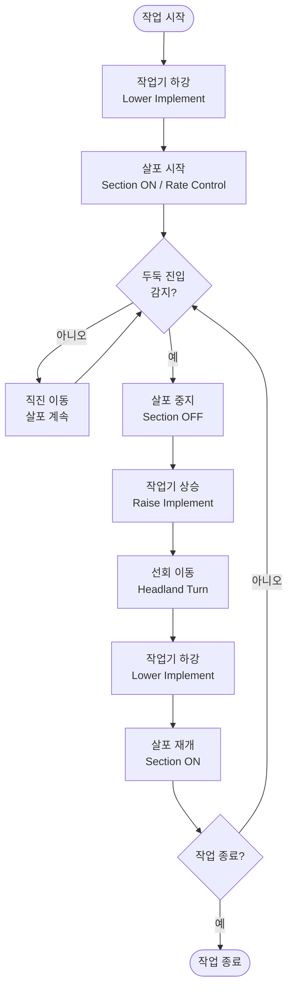
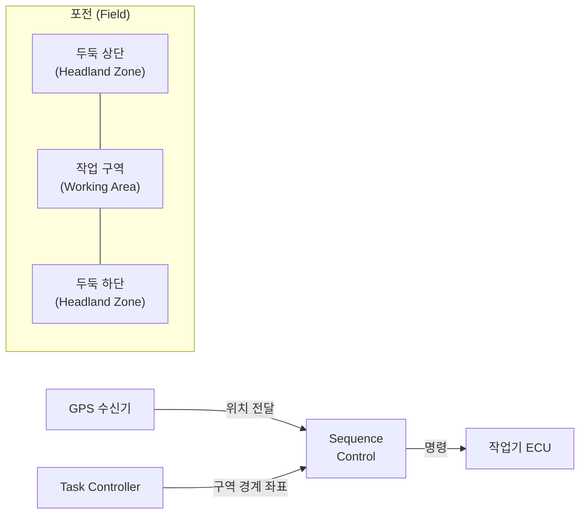
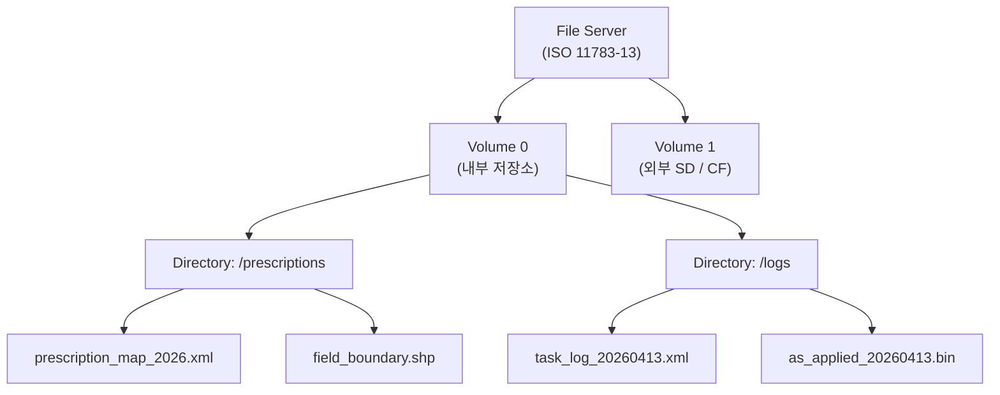
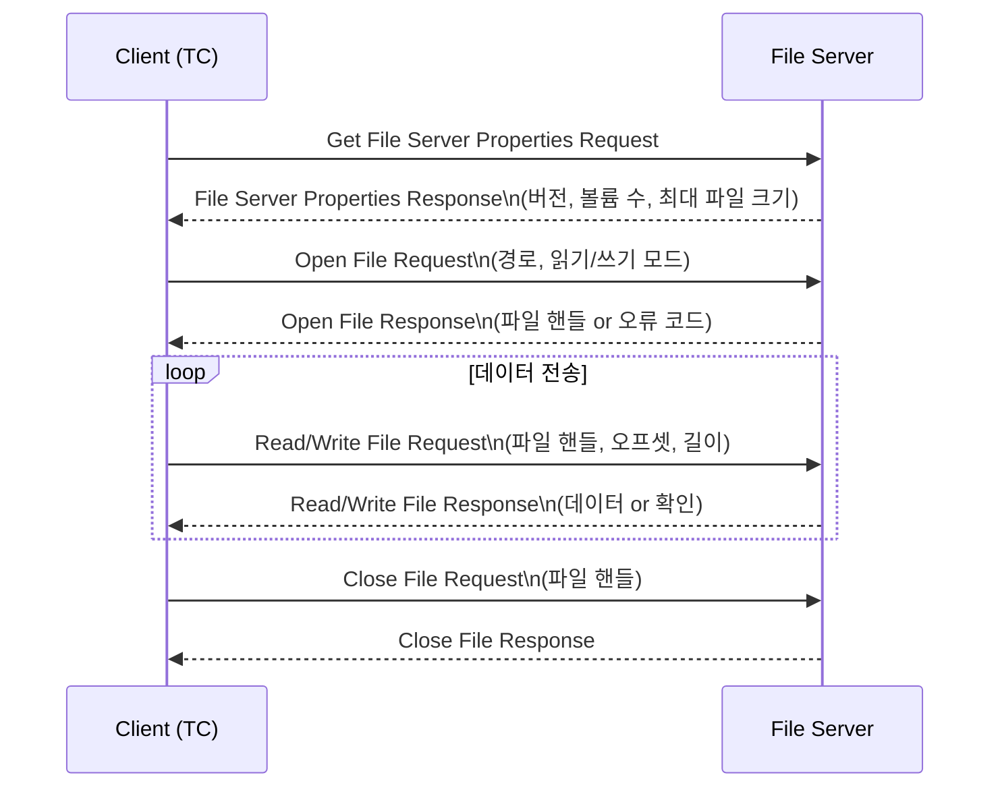

# ISOBUS 기타 기능

## 학습 목표
- ISO 11783-14 Sequence Control의 역할과 Headland Management 적용 방법을 설명할 수 있다.
- Sequence Control이 자동으로 수행하는 작업 단계(하강 → 살포 → 상승)를 순서도로 표현할 수 있다.
- ISO 11783-13 File Server의 파일 계층 구조(Volume / Directory / File)를 이해한다.
- File Server를 통해 처방 맵과 작업 로그를 USB 없이 전송하는 흐름을 설명할 수 있다.

---

## 1. Sequence Control — ISO 11783-14

### 1.1 개요

<strong>Sequence Control</strong>은 작업기가 일련의 동작을 **자동 순서대로** 실행하도록 지시하는 표준이다.
운전자가 일일이 스위치를 조작하지 않아도 사전 정의된 시퀀스가 트리거 조건에 따라 자동 실행된다.

가장 대표적인 활용 사례가 <strong>Headland Management(두둑 관리)</strong>이다.
포전 끝(두둑)에서 방향을 전환할 때 살포 중지 → 작업기 상승 → 선회 → 하강 → 살포 재개를 자동으로 수행한다.

---

### 1.2 Headland Management 자동 시퀀스



두둑 진입 감지는 GPS 경계선 교차, 히치(Hitch) 센서, 또는 운전자 버튼 입력 중 하나로 트리거된다.

---

### 1.3 Sequence Control 메시지 구조

Sequence Control은 **SC(Sequence Control)** 노드와 작업기 ECU 사이에서 명령과 상태를 교환한다.

주요 PGN:

| PGN | 명칭 | 방향 | 내용 |
|-----|------|------|------|
| 0xFC00 | SC Status | SC → Implement | 현재 시퀀스 상태, 단계 번호 |
| 0xFC01 | SC Command | SC → Implement | 다음 동작 명령 (하강/상승/ON/OFF) |
| 0xFC02 | SC Acknowledge | Implement → SC | 명령 수신 및 실행 확인 |

C 언어로 작성한 Sequence Control 명령 전송 예시:

```c
#include <stdint.h>

/* Sequence Control command byte definitions */
#define SC_CMD_LOWER   0x01  /* Lower implement */
#define SC_CMD_RAISE   0x02  /* Raise implement */
#define SC_CMD_SECT_ON 0x03  /* Sections ON */
#define SC_CMD_SECT_OFF 0x04 /* Sections OFF */

typedef struct {
    uint8_t sequence_step;  /* Current step number (0-based) */
    uint8_t command;        /* SC_CMD_* value */
    uint8_t trigger_source; /* 0x00=GPS, 0x01=Hitch, 0x02=Button */
    uint8_t reserved[5];
} SC_Command_t;

/* Build and send a Sequence Control command frame */
int sc_send_command(uint8_t step, uint8_t cmd, uint8_t trigger,
                    void (*can_send)(uint32_t id, uint8_t *data, uint8_t len))
{
    SC_Command_t frame = {
        .sequence_step  = step,
        .command        = cmd,
        .trigger_source = trigger,
        .reserved       = {0xFF, 0xFF, 0xFF, 0xFF, 0xFF},
    };

    /* PGN 0xFC01, DA=0xFF (broadcast), SA=0x26 (Sequence Control) */
    uint32_t can_id = (0x18UL << 24) | (0xFC01UL << 8) | 0x26UL;
    can_send(can_id, (uint8_t *)&frame, sizeof(frame));
    return 0;
}
```

---

### 1.4 Headland 구간 정의 방법

두둑 구간은 TC(Task Controller)의 처방 맵 또는 별도의 Headland Zone 파라미터로 정의된다.



GPS 좌표가 Headland Zone 경계를 넘는 순간 SC가 자동으로 시퀀스를 실행한다.

---

> **Sequence Control 핵심 정리**
> - ISO 11783-14는 작업 동작(하강/상승/ON/OFF)을 자동 순서로 실행하는 표준이다.
> - Headland Management에서 두둑 선회 시 운전자 개입 없이 전체 시퀀스가 자동 실행된다.
> - 트리거 조건은 GPS 경계 교차, 히치 센서, 운전자 입력 중 하나로 설정 가능하다.
> - SC Command(PGN 0xFC01)로 명령을 전달하고, SC Acknowledge(PGN 0xFC02)로 확인한다.

---

## 2. File Server — ISO 11783-13

### 2.1 개요

<strong>File Server(FS)</strong>는 ISOBUS 네트워크 위에서 파일을 저장하고 공유하는 서비스이다.
USB 메모리나 별도 물리 매체 없이 ECU 간에 파일을 주고받을 수 있다.

주요 활용 사례:
- **처방 맵(Prescription Map)**: FMIS에서 생성한 처방 맵을 TC로 전달
- **작업 로그(Task Log / As-Applied Map)**: TC가 기록한 실제 살포 데이터를 FMIS로 회수
- **소프트웨어 업데이트**: ECU 펌웨어 파일 배포

---

### 2.2 파일 계층 구조

File Server는 **Volume → Directory → File** 3단계 계층으로 파일을 관리한다.

```
Volume (최상위 저장소)
├── Directory A
│   ├── prescription_map_2026.xml
│   └── field_boundary.shp
└── Directory B
    ├── task_log_20260413.xml
    └── as_applied_20260413.bin
```



---

### 2.3 File Server 접근 흐름

클라이언트(TC, VT 등)가 File Server에 접근하는 순서는 다음과 같다.



---

### 2.4 Python으로 File Server 메시지 파싱

ISOBUS File Server 메시지는 ISO 11783-13이 정의한 바이트 구조를 따릅니다.
아래는 Open File Response를 파싱하는 Python 예시이다.

```python
import struct

# File Server Function Code definitions (ISO 11783-13 Table 1)
FS_FUNC_OPEN_FILE_REQ  = 0x20
FS_FUNC_OPEN_FILE_RESP = 0x21
FS_FUNC_READ_FILE_REQ  = 0x22
FS_FUNC_READ_FILE_RESP = 0x23
FS_FUNC_CLOSE_FILE_REQ = 0x2C
FS_FUNC_CLOSE_FILE_RESP = 0x2D

ERROR_CODES = {
    0x00: "Success",
    0x01: "Access Denied",
    0x02: "Invalid Access",
    0x03: "Too Many Files Open",
    0x04: "File or Path Not Found",
    0x05: "Invalid Handle",
    0x08: "Volume Out of Free Space",
    0xFF: "Other Error",
}


def parse_open_file_response(data: bytes) -> dict:
    """
    Parse an Open File Response message (Function Code 0x21).
    Byte layout: [0]=FuncCode, [1]=ErrorCode, [2]=FileHandle, [3..7]=reserved
    """
    if len(data) < 3:
        raise ValueError(f"Frame too short: {len(data)} bytes")

    func_code  = data[0]
    error_code = data[1]
    file_handle = data[2]

    if func_code != FS_FUNC_OPEN_FILE_RESP:
        raise ValueError(f"Unexpected function code: 0x{func_code:02X}")

    return {
        "function":    "Open File Response",
        "error":       ERROR_CODES.get(error_code, f"Unknown(0x{error_code:02X})"),
        "file_handle": file_handle if error_code == 0x00 else None,
        "success":     error_code == 0x00,
    }


def build_open_file_request(path: str, write: bool = False) -> bytes:
    """
    Build an Open File Request message (Function Code 0x20).
    Byte layout: [0]=FuncCode, [1]=Flags, [2..N]=null-terminated path
    """
    flags = 0x02 if write else 0x01  # 0x01=Read, 0x02=Write
    path_bytes = path.encode("ascii") + b"\x00"
    return bytes([FS_FUNC_OPEN_FILE_REQ, flags]) + path_bytes


# Example usage
if __name__ == "__main__":
    # Simulate received Open File Response frame
    raw = bytes([0x21, 0x00, 0x03, 0xFF, 0xFF, 0xFF, 0xFF, 0xFF])
    result = parse_open_file_response(raw)
    print(f"Result  : {result['error']}")
    print(f"Handle  : {result['file_handle']}")

    # Build a read request
    req = build_open_file_request("/prescriptions/prescription_map_2026.xml")
    print(f"Request : {req.hex()}")
```

---

> **File Server 핵심 정리**
> - ISO 11783-13 File Server는 ISOBUS 네트워크에서 USB 없이 파일을 공유하는 서비스다.
> - 계층 구조는 Volume → Directory → File이며, 내부 저장소와 외부 미디어를 모두 지원한다.
> - 처방 맵 전달(FMIS → TC)과 작업 로그 회수(TC → FMIS)가 주요 활용 사례다.
> - 클라이언트는 Open → Read/Write → Close 순서로 파일에 접근한다.

---

## 다음 챕터

- 다음 : [종합 실습](/study/isobus/22-practice)
