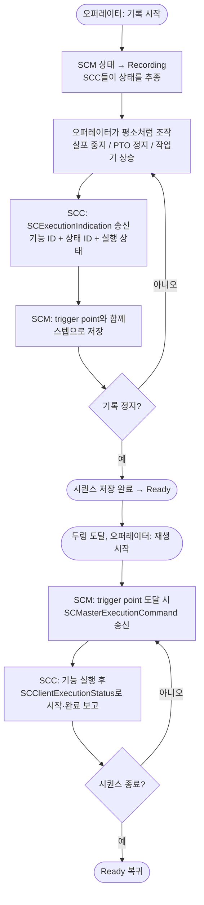
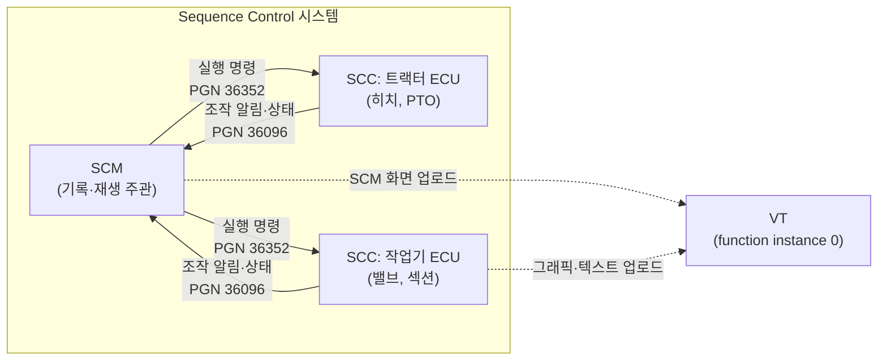
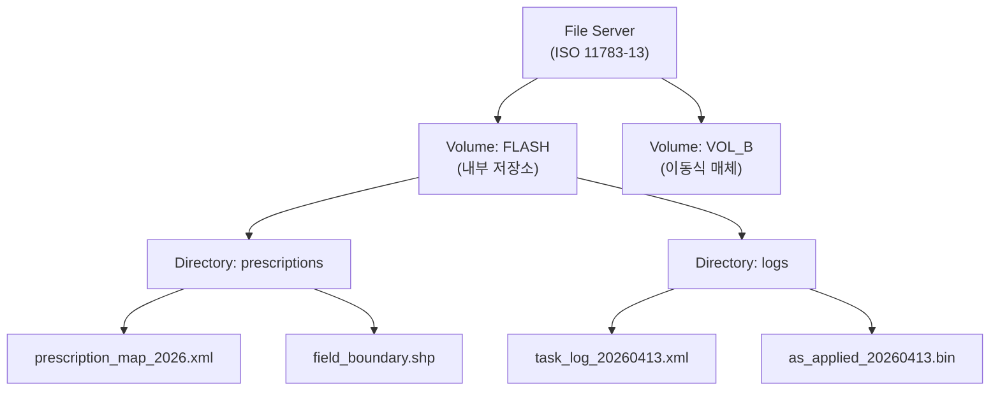
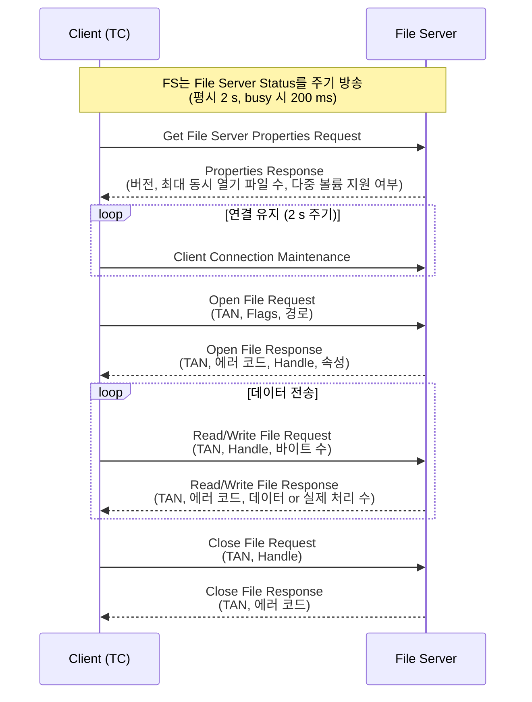

# ISOBUS 기타 기능

::: info 학습 목표
- ISO 11783-14 Sequence Control의 <strong>기록(recording)·재생(playback)</strong> 모델과 SCM/SCC의 역할을 설명할 수 있다.
- Headland Management에서 오퍼레이터 조작이 어떻게 기록되고 재생되는지 순서도로 표현할 수 있다.
- ISO 11783-13 File Server의 파일 계층 구조(Volume / Directory / File)와 연결 유지 방식을 이해한다.
- TAN(Transaction Number)이 명령-응답 통신의 유실·중복 실행 문제를 어떻게 해결하는지 설명할 수 있다.
:::

## 1. Sequence Control — ISO 11783-14

### 1.1 개요

<strong>Sequence Control(SC)</strong>은 오퍼레이터가 반복 수행하는 일련의 조작을 <strong>한 번 기록해 두고, 이후 명령 한 번으로 재생</strong>하는 표준이다.
GPS 같은 외부 센서가 시퀀스를 자동 실행하는 모델이 아니라, 오퍼레이터의 수동 조작을 녹화(record)했다가 오퍼레이터의 재생(play back) 지시에 따라 그대로 되풀이하는 모델이다.

가장 대표적인 활용 사례가 <strong>Headland Management(두렁 관리)</strong>이다.
포전 끝(두렁)에서 선회할 때마다 반복하는 조작 — 살포 중지, PTO 정지, 작업기 상승, 선회 후 하강, 살포 재개 — 을 한 번 기록해 두면, 이후 두렁에 도달할 때마다 오퍼레이터가 버튼 하나로 전체 시퀀스를 재생할 수 있다.

시스템은 두 가지 역할로 구성된다.

| 역할 | 이름 | 담당 |
|------|------|------|
| 마스터 | <strong>SCM</strong>(Sequence Control Master) | 기록·재생을 주관한다. 기록 중 수신한 조작을 trigger 정보와 함께 저장하고, 재생 중 trigger point에 도달하면 해당 명령을 SCC에 송신한다 |
| 클라이언트 | <strong>SCC</strong>(Sequence Control Client) | PTO·히치·밸브 같은 client function을 소유한 ECU. 기록 중 오퍼레이터 조작을 SCM에 알리고, 재생 중 SCM의 명령을 수동 조작과 동일한 방식으로 실행한다 |

active SCM은 동시에 하나만 존재할 수 있고, 트랙터도 SCC이자 SCM으로 동작할 수 있다. SCC들은 서로 독립적이며 SCC 간 직접 통신은 없다.

### 1.2 Headland Management 기록·재생 흐름


```mermaid
flowchart TD
    A([오퍼레이터: 기록 시작]) --> B[SCM 상태 → Recording<br>SCC들이 상태를 추종]
    B --> C[오퍼레이터가 평소처럼 조작<br>살포 중지 / PTO 정지 / 작업기 상승]
    C --> D[SCC: SCExecutionIndication 송신<br>기능 ID + 상태 ID + 실행 상태]
    D --> E[SCM: trigger point와 함께<br>스텝으로 저장]
    E --> F{기록 정지?}
    F -- 아니오 --> C
    F -- 예 --> G([시퀀스 저장 완료 → Ready])
    G --> H([두렁 도달, 오퍼레이터: 재생 시작])
    H --> I[SCM: trigger point 도달 시<br>SCMasterExecutionCommand 송신]
    I --> J[SCC: 기능 실행 후<br>SCClientExecutionStatus로 시작·완료 보고]
    J --> K{시퀀스 종료?}
    K -- 아니오 --> I
    K -- 예 --> L([Ready 복귀])
```

각 스텝의 <strong>trigger</strong>는 시간 기반(두 기능 활성화 사이의 시간) 또는 거리 기반(두 기능 활성화 사이의 주행 거리)으로 저장된다.
재생 중 문제가 생기면 어떤 SCC든 <strong>SCClientAbort</strong> 메시지로 전체 재생을 즉시 중단시킬 수 있고, 이때 각 SCC는 SCM이 명령했던 자기 기능을 스스로 정의한 safe state로 전환한다.

SCM과 SCC는 각각 상태 머신으로 동작한다.

| 구분 | 상태 |
|------|------|
| SCM | Inactive(시동 후 기본) · Ready · Recording · Recording Completion · Play Back · Abort |
| SCC | Disabled(시동 후 기본) · Ready · Recording · Play Back · Abort |

active SCM이 자신의 상태를 <strong>SCMasterStatus</strong> 메시지로 broadcast하면 enabled SCC들이 이를 따라간다.
SCC는 active SCM이 enable을 명령할 때만 Disabled에서 벗어날 수 있고, SCMasterStatus가 timeout 되면 스스로 Disabled로 복귀한다.
반대로 SCM도 어떤 SCC의 상태 메시지가 timeout 되면 기록을 취소하거나 재생을 중단한다 — 양방향 감시로 어느 한쪽이 사라져도 시스템이 safe state로 수렴한다.

### 1.3 Sequence Control 메시지 구조

SC 통신에는 PGN이 단 두 개 예약되어 있고, 메시지 종류는 데이터 <strong>Byte 1의 message code</strong>로 구분한다.

| PGN | 방향 | 특성 |
|-----|------|------|
| 36352 (0x8E00) | SCM → SCC | destination-specific, 우선순위 4 |
| 36096 (0x8D00) | SCC → SCM | destination-specific, 우선순위 4 |

주요 message code:

| code | 메시지 | 방향 | 역할 |
|------|--------|------|------|
| 32 | SCExecutionIndication / Response | SCC → SCM / SCM → SCC | 기록 중 "이 기능을 조작했다" 알림과 저장 확인 |
| 33 | SCMasterExecutionCommand | SCM → SCC | 재생 중 trigger point 도달 시 실행 명령 |
| 34 | SCClientExecutionStatus / Acknowledgement | SCC → SCM / SCM → SCC | 명령 실행의 시작·완료 보고와 확인 |
| 31 | SCClientAbort | SCC → 전역 | 재생 즉시 중단 요구 |
| 95 | SCMasterStatus | SCM → 전체 | SCM 상태 broadcast (Ready 1 Hz, 활동 상태 5 Hz) |
| 96 | SCClientStatus | SCC → SCM | SCC 상태 보고 (주기 동일) |

명령·요청은 응답을 받을 때까지 최소 100 ms 간격으로 반복하고, 1.6 s까지 응답이 없으면 무응답으로 처리한다.

C 언어로 작성한 SCMasterExecutionCommand(재생 중 실행 명령) 전송 예시:

```c
#include <stdint.h>

/* ISO 11783-14 message codes (data Byte 1) */
#define SC_MSG_CLIENT_ABORT        31
#define SC_MSG_EXEC_INDICATION     32
#define SC_MSG_MASTER_EXEC_CMD     33
#define SC_MSG_CLIENT_EXEC_STATUS  34

/* Build and send an SCMasterExecutionCommand (playback trigger) */
int scm_send_execution_command(uint8_t function_id, uint8_t state_id,
                               uint8_t tan, uint32_t function_value,
                               uint8_t da, uint8_t sa,
                               void (*can_send)(uint32_t id, const uint8_t *data, uint8_t len))
{
    uint8_t frame[8];

    frame[0] = SC_MSG_MASTER_EXEC_CMD;      /* message code 33 */
    frame[1] = function_id;                 /* SCD function object의 function ID */
    frame[2] = state_id & 0x3F;             /* bits 1-6 = state ID, 상위 2비트 예약(0) */
    frame[3] = tan;                         /* transaction number */
    frame[4] = (uint8_t)(function_value);   /* 기록 시 저장된 function value, LSB first */
    frame[5] = (uint8_t)(function_value >> 8);
    frame[6] = (uint8_t)(function_value >> 16);
    frame[7] = (uint8_t)(function_value >> 24);

    /* priority 4, PGN 36352 (0x8E00), PDU specific = destination address */
    uint32_t can_id = (4UL << 26) | (0x8EUL << 16) | ((uint32_t)da << 8) | sa;
    can_send(can_id, frame, sizeof(frame));
    return 0;
}
```

SCC는 이 명령에 <strong>SCClientExecutionStatus</strong>(code 34)로 응답하며, 응답에는 명령과 같은 TAN을 실어 어느 명령에 대한 응답인지 밝힌다.

### 1.4 SCD와 TAN

기록·재생이 성립하려면 SCM이 각 SCC가 어떤 기능을 갖고 있는지 알아야 한다.
이를 위해 SCC는 초기화 때 <strong>SCD</strong>(Sequence Control Data)라는 오브젝트 풀을 SCM에 업로드한다.

- SCD는 basic object(SCC 식별) → function object(기록 가능한 기능, 최대 255개) → state object(기능별 상태, 최대 64개)의 계층 구조다.
- 각 오브젝트는 SCC가 VT에 올린 그래픽·텍스트 오브젝트의 ID를 참조하고, SCM은 External Object Pointer로 이를 자기 화면 안에 표시한다. 그래서 SCM과 SCC 모두 function instance 0인 VT에 접속한다.
- SCM은 SCC당 SCD 하나를 비휘발성 메모리에 저장할 수 있어, 매 시동 시 SCD 업로드를 생략할 수 있다.


```mermaid
flowchart LR
    subgraph SC["Sequence Control 시스템"]
        SCM["SCM<br>(기록·재생 주관)"]
        SCC1["SCC: 트랙터 ECU<br>(히치, PTO)"]
        SCC2["SCC: 작업기 ECU<br>(밸브, 섹션)"]
    end

    SCM -- "실행 명령<br>PGN 36352" --> SCC1
    SCM -- "실행 명령<br>PGN 36352" --> SCC2
    SCC1 -- "조작 알림·상태<br>PGN 36096" --> SCM
    SCC2 -- "조작 알림·상태<br>PGN 36096" --> SCM
    SCM -. "SCM 화면 업로드" .-> VT["VT<br>(function instance 0)"]
    SCC2 -. "그래픽·텍스트 업로드" .-> VT
```

<strong>TAN</strong>(Transaction Number)은 명령-응답을 짝 맞추는 장치다.
송신자는 새 명령마다 자기 TAN 카운터를 1 증가시키고, 같은 명령을 반복 송신할 때는 같은 TAN을 유지하며, 수신자는 받은 TAN을 응답에 그대로 되돌린다.
수신 측은 TAN·function ID·state ID가 모두 일치할 때만 응답을 처리하므로, 반복 송신된 명령과 뒤늦게 도착한 응답이 섞여도 혼동이 없고, 한 SCC가 여러 client command를 동시에 걸어 둘 수도 있다.
TAN은 File Server에서도 같은 목적으로 쓰인다(§2.3).

> **Sequence Control 핵심 정리**
> - ISO 11783-14는 오퍼레이터 조작을 기록(recording)했다가 재생(playback)하는 표준이다. GPS 기반 자동 실행 모델이 아니다.
> - SCM이 기록·재생을 주관하고 SCC가 기능을 소유·실행한다. active SCM은 동시에 하나뿐이다.
> - PGN은 2개(SCM→SCC 36352, SCC→SCM 36096)이고 데이터 Byte 1의 message code로 메시지를 구분한다.
> - trigger는 시간·거리 기반으로 저장되고, 재생 중단(Abort) 시 SCC는 자기 기능을 safe state로 전환한다.

## 2. File Server — ISO 11783-13

### 2.1 개요

<strong>File Server(FS)</strong>는 ISOBUS 네트워크 위에서 파일을 저장하고 공유하는 서비스를 제공하는 독립 ECU이다.
USB 메모리나 별도 물리 매체 없이 ECU 간에 파일을 주고받을 수 있고, 자체 저장소가 없는 ECU도 네트워크 공용 저장소를 쓸 수 있다.

주요 활용 사례:
- <strong>처방 맵(Prescription Map)</strong>: FMIS에서 생성한 처방 맵을 TC로 전달
- <strong>작업 로그(Task Log / As-Applied Map)</strong>: TC가 기록한 실제 살포 데이터를 FMIS로 회수
- <strong>공용 저장소</strong>: 대용량 데이터를 다루는 ECU가 자체 저장 장치 없이 네트워크 저장소를 활용

통신에는 PGN 2개가 예약되어 있다(둘 다 destination-specific, 우선순위 7). 9바이트 이상 메시지는 TP(ISO 11783-3)·ETP(ISO 11783-6)로 전송한다.

| PGN | 방향 |
|-----|------|
| 43520 (0xAA00) | Client → FS |
| 43776 (0xAB00) | FS → Client |

### 2.2 파일 계층 구조

File Server는 **Volume → Directory → File** 3단계 계층으로 파일을 관리한다.
경로 구분자는 `\`(백슬래시)이고, 최상위의 볼륨 목록은 `\\`로 지정한다.

```
\\ (볼륨 목록, 최상위)
└── FLASH (Volume)
    ├── prescriptions (Directory)
    │   ├── prescription_map_2026.xml
    │   └── field_boundary.shp
    └── logs (Directory)
        ├── task_log_20260413.xml
        └── as_applied_20260413.bin
```


```mermaid
graph TD
    FS["File Server<br>(ISO 11783-13)"]
    FS --> V1["Volume: FLASH<br>(내부 저장소)"]
    FS --> V2["Volume: VOL_B<br>(이동식 매체)"]
    V1 --> D1["Directory: prescriptions"]
    V1 --> D2["Directory: logs"]
    D1 --> F1["prescription_map_2026.xml"]
    D1 --> F2["field_boundary.shp"]
    D2 --> F3["task_log_20260413.xml"]
    D2 --> F4["as_applied_20260413.bin"]
```

볼륨까지 포함한 절대 경로는 `\\FLASH\logs\task_log_20260413.xml` 형태이고, 볼륨 없이 시작하는 경로는 클라이언트별 <strong>current directory</strong> 기준 상대 경로로 처리된다.
클라이언트가 연결되면 FS는 current directory를 primary volume의 루트로 초기화한다.

### 2.3 File Server 접근 흐름

클라이언트(TC, VT 등)가 File Server에 접근하는 순서는 다음과 같다.


```mermaid
sequenceDiagram
    participant C as Client (TC)
    participant FS as File Server

    Note over C,FS: FS는 File Server Status를 주기 방송<br>(평시 2 s, busy 시 200 ms)

    C->>FS: Get File Server Properties Request
    FS-->>C: Properties Response<br>(버전, 최대 동시 열기 파일 수, 다중 볼륨 지원 여부)

    loop 연결 유지 (2 s 주기)
        C->>FS: Client Connection Maintenance
    end

    C->>FS: Open File Request<br>(TAN, Flags, 경로)
    FS-->>C: Open File Response<br>(TAN, 에러 코드, Handle, 속성)

    loop 데이터 전송
        C->>FS: Read/Write File Request<br>(TAN, Handle, 바이트 수)
        FS-->>C: Read/Write File Response<br>(TAN, 에러 코드, 데이터 or 실제 처리 수)
    end

    C->>FS: Close File Request<br>(TAN, Handle)
    FS-->>C: Close File Response<br>(TAN, 에러 코드)
```

핵심 규칙:

- 클라이언트는 FS와 상호작용하는 동안 <strong>Client Connection Maintenance</strong> 메시지를 2 000 ms 주기로 보낸다. FS가 이 메시지를 <strong>6초</strong>간 못 받으면 그 클라이언트의 열린 파일을 모두 닫고 Handle을 무효화한다 — 클라이언트가 정리 없이 버스에서 이탈해도 FS가 리소스를 회수하는 장치다.
- Read/Write 요청에는 오프셋이 없다. 파일 내 위치 이동은 별도의 <strong>Seek File</strong> 명령으로 수행한다.
- 클라이언트는 응답을 받기 전에 다음 명령을 보내면 안 된다. FS status가 busy를 표시하지 않는데 600 ms 안에 응답이 없으면 실패로 간주하고 <strong>같은 TAN으로</strong> 재요청한다.
- FS는 클라이언트별 마지막 응답을 기억한다. 같은 TAN의 요청이 다시 오면 재전송으로 간주해 <strong>실행 없이</strong> 이전 응답만 다시 보낸다 — 응답 유실 시 Read File 같은 명령이 두 번 실행되어 파일 포인터가 밀리는 사고를 막는다.

### 2.4 Python으로 File Server 메시지 파싱

ISO 11783-13 명령의 Byte 1은 상위 4비트가 커맨드 그룹, 하위 4비트가 함수다.
File Access 그룹(0010)의 함수 코드는 다음과 같고, <strong>요청과 응답이 같은 코드를 쓰며 방향(PGN)으로 구분</strong>된다. Byte 2에는 항상 TAN이 들어간다.

| 명령 | Byte 1 | 요청 배치 (Byte 2~) | 응답 배치 (Byte 2~) |
|------|--------|--------------------|--------------------|
| Open File | 0x20 (32) | TAN, Flags, 경로 길이(2B), 경로 | TAN, 에러 코드, Handle, Attributes |
| Seek File | 0x21 (33) | TAN, Handle, Position Mode, Offset(4B) | TAN, 에러 코드, 새 Position(4B) |
| Read File | 0x22 (34) | TAN, Handle, Count(2B) | TAN, 에러 코드, Count, Data |
| Write File | 0x23 (35) | TAN, Handle, Count(2B), Data | TAN, 에러 코드, 실제 쓴 Count |
| Close File | 0x24 (36) | TAN, Handle | TAN, 에러 코드 |

아래는 Open File 요청 생성과 응답 파싱의 Python 예시이다.

```python
import struct

# ISO 11783-13 File Access group (command group 0b0010, Annex C)
# 요청과 응답은 같은 함수 코드를 쓰고, 방향(PGN)으로 구분한다.
FS_FUNC_OPEN_FILE  = 0x20  # 32: Open File
FS_FUNC_SEEK_FILE  = 0x21  # 33: Seek File
FS_FUNC_READ_FILE  = 0x22  # 34: Read File
FS_FUNC_WRITE_FILE = 0x23  # 35: Write File
FS_FUNC_CLOSE_FILE = 0x24  # 36: Close File

# Open File Flags (ISO 11783-13 B.14)
FLAG_READ_ONLY  = 0x00  # bits 1,0 = 00
FLAG_WRITE_ONLY = 0x01  # bits 1,0 = 01
FLAG_READ_WRITE = 0x02  # bits 1,0 = 10
FLAG_DIRECTORY  = 0x03  # bits 1,0 = 11 (디렉터리 열기)
FLAG_CREATE     = 0x04  # bit 2: 없으면 파일·디렉터리 생성
FLAG_APPEND     = 0x08  # bit 3: 파일 포인터를 파일 끝으로
FLAG_EXCLUSIVE  = 0x10  # bit 4: 배타적 접근 (이미 열려 있으면 실패)

# Error Codes (ISO 11783-13 B.9)
ERROR_CODES = {
    0:  "Success",
    1:  "Access Denied",
    2:  "Invalid Access",
    3:  "Too many files open",
    4:  "File, path or volume not found",
    5:  "Invalid Handle",
    6:  "Invalid given source name",
    7:  "Invalid given destination name",
    8:  "Volume out of free space",
    9:  "Failure during a write operation",
    10: "Media is not present",
    11: "Failure during a read operation",
    12: "Function not supported",
    13: "Volume is possibly not initialized",
    42: "Invalid request length",
    43: "Out of memory",
    44: "Any other error",
    45: "File pointer at end of file",
}


def parse_open_file_response(data: bytes) -> dict:
    """
    Parse an Open File Response (Byte 1 = 0x20, 8 bytes).
    Layout: [0]=FuncCode, [1]=TAN, [2]=ErrorCode, [3]=Handle,
            [4]=Attributes, [5..7]=reserved (0xFF)
    """
    if len(data) < 5:
        raise ValueError(f"Frame too short: {len(data)} bytes")

    func_code, tan, error_code, handle, attributes = data[:5]

    if func_code != FS_FUNC_OPEN_FILE:
        raise ValueError(f"Unexpected function code: 0x{func_code:02X}")

    success = error_code == 0 and handle != 0xFF  # Handle 255 = 배정 실패
    return {
        "function":   "Open File Response",
        "tan":        tan,
        "error":      ERROR_CODES.get(error_code, f"Reserved({error_code})"),
        "handle":     handle if success else None,
        "attributes": attributes,
        "success":    success,
    }


def build_open_file_request(tan: int, path: str, flags: int = FLAG_READ_ONLY) -> bytes:
    """
    Build an Open File Request (Byte 1 = 0x20).
    Layout: [0]=FuncCode, [1]=TAN, [2]=Flags,
            [3,4]=Path Name Length (LSB first), [5..n]=Path
    """
    path_bytes = path.encode("latin-1")  # ISO/IEC 8859-1 문자 집합
    header = bytes([FS_FUNC_OPEN_FILE, tan, flags])
    return header + struct.pack("<H", len(path_bytes)) + path_bytes


# Example usage
if __name__ == "__main__":
    # Simulate received Open File Response frame
    raw = bytes([0x20, 0x07, 0x00, 0x03, 0x20, 0xFF, 0xFF, 0xFF])
    result = parse_open_file_response(raw)
    print(f"Result : {result['error']} (TAN {result['tan']})")
    print(f"Handle : {result['handle']}")

    # Build a read-only open request (경로 구분자는 백슬래시)
    req = build_open_file_request(7, r"\\FLASH\prescriptions\prescription_map_2026.xml")
    print(f"Request: {req.hex()}")
```

이 Open File 요청은 8바이트를 넘으므로 단일 CAN 프레임이 아니라 TP로 전송된다.
클라이언트는 응답의 TAN이 요청의 TAN과 같은지 확인해 명령 유실 여부를 검증하고, 에러 코드가 0이 아니면 그 뒤의 파라미터(Handle 등)는 무시해야 한다.

> **File Server 핵심 정리**
> - ISO 11783-13 File Server는 ISOBUS 네트워크에서 USB 없이 파일을 공유하는 독립 ECU다.
> - 계층 구조는 Volume → Directory → File이며, 경로 구분자는 `\`, 최상위 볼륨 목록은 `\\`다.
> - 클라이언트는 Client Connection Maintenance(2 s 주기)로 연결을 유지하고, Open → Seek/Read/Write → Close 순서로 파일에 접근한다.
> - 모든 명령·응답은 Byte 2의 TAN으로 짝을 맞추고, FS는 같은 TAN의 재요청에 실행 없이 이전 응답을 재전송해 중복 실행을 막는다.

## 다음 챕터

- 다음 : [종합 실습](/study/isobus/22-practice)
