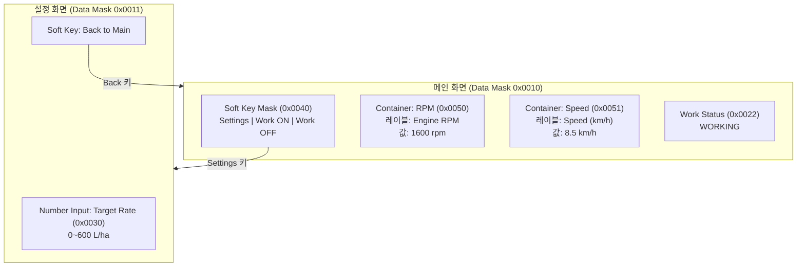
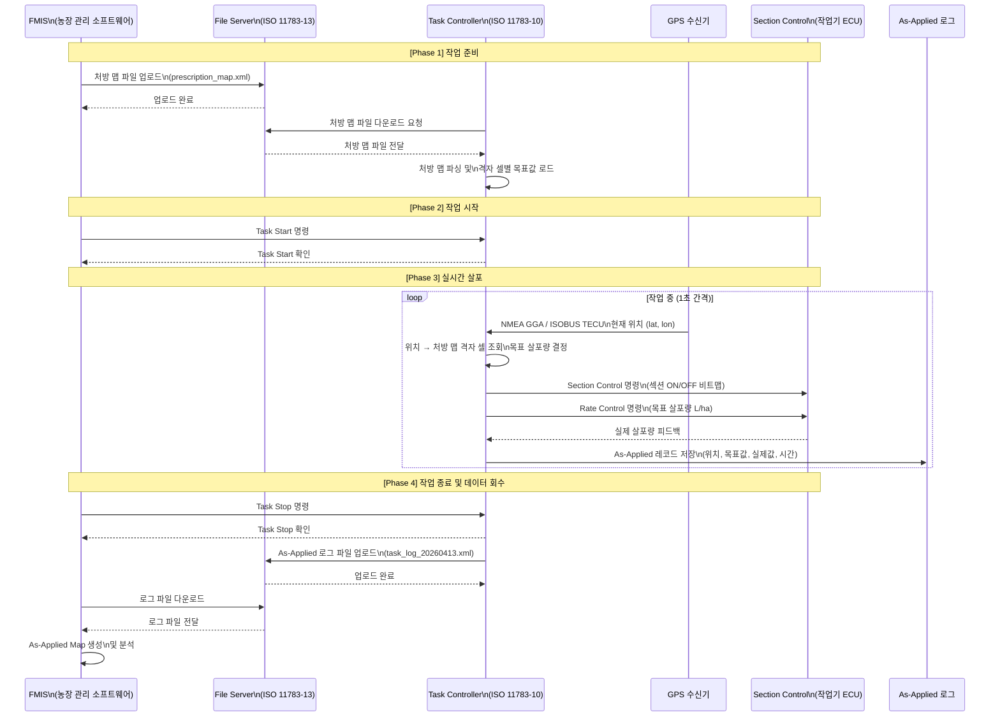

# 종합 실습

## 학습 목표
- 실제 ISOBUS CAN 로그에서 PGN과 SA를 식별하고 메시지 유형을 분류할 수 있다.
- Python 코드로 CAN 프레임을 자동 파싱하여 SPN 값을 추출할 수 있다.
- VT 오브젝트 풀을 구성하는 오브젝트 유형과 계층 구조를 설계할 수 있다.
- TC 처방 맵 기반 가변 살포 시나리오 전체 흐름을 순서도로 표현할 수 있다.

---

## 1. CAN 로그 종합 분석

### 1.1 캡처 예시 데이터

아래는 실제 ISOBUS 트래픽에서 캡처한 예시 로그이다.
형식은 `CAN_ID#DATA` (socketcan candump 포맷)이다.

```
0CF004FE#FF3C320000FFFF00
18EAFFFE#00EE00
18EEFF00#FFB03204FFFFFFFF
0CAC1CFE#014B00FA02000000
18EA26FF#FDEC00
1CEA00FF#FDEC00
18ECFF26#10280000FF04FEFE
18EBFF26#01B003020006043C
18EBFF26#02FFFFFFFFFFFFFE
18EBFF26#03FF640000FFFFFF
0CF00426#FF8C4B0000FFFF00
18FEF026#FFB4032AFC000000
```

각 메시지를 분석한다.

| # | CAN ID | PGN | SA | DA | 분류 |
|---|--------|-----|----|----|------|
| 1 | `0CF004FE` | 0xF004 (EEC1) | 0xFE | - | Engine Speed (엔진 RPM) |
| 2 | `18EAFFFE` | 0xEAFF (Request PGN) | 0xFE | 0xFF | PGN 0xEE00 요청 (Address Claimed) |
| 3 | `18EEFF00` | 0xEE00 (Address Claimed) | 0x00 | 0xFF | 주소 클레임 (SA=0x00) |
| 4 | `0CAC1CFE` | 0xAC1C (TECU) | 0xFE | - | 지상 속도 (Ground Speed) |
| 5 | `18EA26FF` | 0xEA26 (Request PGN) | 0xFF | 0x26 | SC에게 PGN 0xECFD 요청 |
| 6 | `1CEA00FF` | 0xEA00 (Request PGN) | 0xFF | 0x00 | 주소 0x00에게 PGN 요청 |
| 7 | `18ECFF26` | 0xEC00 (TP.CM) | 0xFF | 0x26 | Transport Protocol 연결 개시 (RTS) |
| 8 | `18EBFF26` | 0xEB00 (TP.DT) | 0xFF | 0x26 | Transport Protocol 데이터 패킷 1 |
| 9 | `18EBFF26` | 0xEB00 (TP.DT) | 0xFF | 0x26 | Transport Protocol 데이터 패킷 2 |
| 10 | `18EBFF26` | 0xEB00 (TP.DT) | 0xFF | 0x26 | Transport Protocol 데이터 패킷 3 |
| 11 | `0CF00426` | 0xF004 (EEC1) | 0x26 | - | Engine Speed (SA=0x26 ECU) |
| 12 | `18FEF026` | 0xFEF0 (VT-to-ECU) | 0x26 | 0xFF | VT 소프트키 상태 전송 |

---

### 1.2 분석 도구 소개

**python-can**

```bash
pip install python-can
```

```python
import can

# Log file replay
with can.Bus(interface="virtual", channel="test") as bus:
    with can.LogReader("isobus_capture.asc") as reader:
        for msg in reader:
            print(f"ID=0x{msg.arbitration_id:08X}  "
                  f"Data={msg.data.hex().upper()}")
```

**SavvyCAN**
- GUI 기반 CAN 분석 도구 (무료, 오픈소스)
- ISOBUS 전용 디코더 플러그인 지원
- J1939 PGN 데이터베이스 내장
- 다운로드: https://www.savvycan.com

---

## 2. PGN 디코딩 종합

### 2.1 CAN ID에서 PGN·SA 추출 공식

29비트 CAN ID 구조 (J1939 기준):

```
[28:26] Priority (3bit)
[25]    Reserved (1bit)
[24]    Data Page (1bit)
[23:16] PGN High byte (PDU Format, PF)
[15:8]  PGN Low byte or Destination Address (PS / DA)
[7:0]   Source Address (SA)
```

PF < 0xF0 이면 Peer-to-Peer(DA 있음), PF >= 0xF0 이면 Broadcast.

```python
def decode_can_id(can_id: int) -> dict:
    """
    Decode a 29-bit J1939/ISOBUS CAN ID into its components.
    Returns priority, pgn, da (if P2P), sa.
    """
    priority  = (can_id >> 26) & 0x7
    reserved  = (can_id >> 25) & 0x1
    data_page = (can_id >> 24) & 0x1
    pf        = (can_id >> 16) & 0xFF   # PDU Format
    ps        = (can_id >> 8)  & 0xFF   # PDU Specific
    sa        = can_id & 0xFF

    if pf >= 0xF0:
        # Broadcast — PS is part of PGN
        pgn = (data_page << 17) | (pf << 8) | ps
        da  = None
    else:
        # Peer-to-Peer — PS is Destination Address
        pgn = (data_page << 17) | (pf << 8)
        da  = ps

    return {
        "priority":  priority,
        "pgn":       pgn,
        "pgn_hex":   f"0x{pgn:04X}",
        "da":        f"0x{da:02X}" if da is not None else "Broadcast",
        "sa":        f"0x{sa:02X}",
    }
```

### 2.2 EEC1 (PGN 0xF004) SPN 디코딩 — 엔진 RPM

```python
import struct

def decode_eec1(data: bytes) -> dict:
    """
    Decode PGN 0xF004 (Electronic Engine Controller 1).
    SPN 190 = Engine Speed: bytes [3..4], resolution 0.125 rpm/bit.
    SPN 91  = Accelerator Pedal Position: byte [1], resolution 0.4 %/bit.
    """
    if len(data) < 8:
        raise ValueError("EEC1 requires 8 bytes")

    accel_raw = data[1]
    rpm_raw   = struct.unpack_from("<H", data, 3)[0]  # Little-endian uint16

    return {
        "pgn":               "0xF004 (EEC1)",
        "engine_speed_rpm":  rpm_raw * 0.125,
        "accel_position_pct": accel_raw * 0.4,
    }


def decode_ground_speed(data: bytes) -> dict:
    """
    Decode TECU Ground Speed (PGN 0xFE48 / SPN 517).
    Bytes [0..1]: speed in mm/s (1 bit = 1 mm/s), range 0..65530 mm/s.
    """
    if len(data) < 2:
        raise ValueError("Ground Speed requires at least 2 bytes")

    raw_speed = struct.unpack_from("<H", data, 0)[0]
    speed_mps = raw_speed / 1000.0  # Convert mm/s to m/s

    return {
        "pgn":          "Ground Speed (TECU)",
        "speed_mm_s":   raw_speed,
        "speed_km_h":   round(speed_mps * 3.6, 2),
    }


def batch_decode(log_lines: list[str]) -> list[dict]:
    """
    Batch-decode a list of candump log lines (format: 'CANID#HEXDATA').
    Identifies PGN and dispatches to the appropriate decoder.
    """
    DECODERS = {
        0xF004: decode_eec1,
    }
    results = []
    for line in log_lines:
        line = line.strip()
        if not line or "#" not in line:
            continue
        id_str, data_str = line.split("#")
        can_id = int(id_str, 16)
        data   = bytes.fromhex(data_str)
        info   = decode_can_id(can_id)
        pgn    = info["pgn"]

        if pgn in DECODERS:
            decoded = DECODERS[pgn](data)
        else:
            decoded = {"raw": data_str}

        results.append({**info, **decoded, "raw_id": f"0x{can_id:08X}"})
    return results


# Example
if __name__ == "__main__":
    log = [
        "0CF004FE#FF3C320000FFFF00",
        "0CAC1CFE#014B00FA02000000",
        "0CF00426#FF8C4B0000FFFF00",
    ]
    for entry in batch_decode(log):
        print(entry)
```

실행 결과 예시:

```
{'priority': '0x3', 'pgn': 61444, 'pgn_hex': '0xF004', 'da': 'Broadcast',
 'sa': '0xFE', 'engine_speed_rpm': 1600.0, 'accel_position_pct': 0.0, 'raw_id': '0x0CF004FE'}
{'priority': '0x3', 'pgn': 44060, 'pgn_hex': '0xAC1C', 'da': 'Broadcast',
 'sa': '0xFE', 'raw': '014B00FA02000000', 'raw_id': '0x0CAC1CFE'}
{'priority': '0x3', 'pgn': 61444, 'pgn_hex': '0xF004', 'da': 'Broadcast',
 'sa': '0x26', 'engine_speed_rpm': 2444.0, 'accel_position_pct': 0.0, 'raw_id': '0x0CF00426'}
```

---

## 3. VT 오브젝트 풀 전체 구성

### 3.1 화면 구성 개요

아래 VT 오브젝트 풀은 다음 두 화면으로 구성된다.

- **메인 화면**: 엔진 RPM, 차속, 작업 상태 표시
- **설정 화면**: 살포량 목표값 입력

### 3.2 오브젝트 정의 목록

| Object ID | 유형 | 이름 | 속성 |
|-----------|------|------|------|
| 0x0001 | Working Set | Root WS | 메인 데이터 마스크 참조 |
| 0x0010 | Data Mask | Main Screen | 800×480, 배경색 흰색 |
| 0x0011 | Data Mask | Settings Screen | 800×480, 배경색 회색 |
| 0x0020 | Number Output | Engine RPM | 값 범위 0~4000, 단위 rpm |
| 0x0021 | Number Output | Ground Speed | 값 범위 0~50, 단위 km/h |
| 0x0022 | Output String | Work Status | "WORKING" / "STOPPED" |
| 0x0030 | Number Input | Target Rate | 입력 범위 0~600, 단위 L/ha |
| 0x0040 | Soft Key Mask | Main SKM | 소프트키 4개 배치 |
| 0x0041 | Key | Key: Settings | 설정 화면으로 전환 |
| 0x0042 | Key | Key: Work ON | 작업 시작 명령 |
| 0x0043 | Key | Key: Work OFF | 작업 중지 명령 |
| 0x0050 | Container | RPM Container | RPM 레이블 + 출력 오브젝트 묶음 |
| 0x0051 | Container | Speed Container | 속도 레이블 + 출력 오브젝트 묶음 |
| 0x0060 | Output Archetype | RPM Label | "Engine RPM" 고정 텍스트 |
| 0x0061 | Output Archetype | Speed Label | "Speed (km/h)" 고정 텍스트 |

### 3.3 화면 레이아웃 다이어그램



### 3.4 VT 오브젝트 풀 ISOXML 예시 (핵심 발췌)

```xml
<!-- Working Set Object (ID=0x0001) -->
<WorkingSet ObjectID="1" BackgroundColour="1" Selectable="true"
            ActiveMask="16">
  <Include ObjectID="16"/>  <!-- Main Screen -->
  <Include ObjectID="17"/>  <!-- Settings Screen -->
</WorkingSet>

<!-- Main Screen Data Mask (ID=0x0010) -->
<DataMask ObjectID="16" BackgroundColour="1" SoftKeyMask="64">
  <Include ObjectID="80"/>  <!-- RPM Container -->
  <Include ObjectID="81"/>  <!-- Speed Container -->
  <Include ObjectID="34"/>  <!-- Work Status String -->
</DataMask>

<!-- Engine RPM Number Output (ID=0x0020) -->
<NumberOutput ObjectID="32" BackgroundColour="1"
              Value="0" Offset="0" Scale="1.0"
              NumberOfDecimals="0" Format="false"
              Justification="right" Width="120" Height="30"
              VariableReference="0">
</NumberOutput>

<!-- Target Rate Number Input (ID=0x0030) -->
<InputNumber ObjectID="48" BackgroundColour="1"
             Value="150" Offset="0" Scale="1.0"
             NumberOfDecimals="0" Format="false"
             Justification="right" Width="100" Height="30"
             MinValue="0" MaxValue="600"
             VariableReference="0">
</InputNumber>
```

---

## 4. TC 시나리오 시뮬레이션

### 4.1 처방 맵 기반 가변 살포 시나리오 전체 흐름



### 4.2 처방 맵 격자 조회 Python 시뮬레이션

```python
from dataclasses import dataclass, field
from datetime import datetime

@dataclass
class GridCell:
    """Single cell in a prescription map grid."""
    lat_min: float
    lat_max: float
    lon_min: float
    lon_max: float
    target_rate_lha: float  # Target application rate (L/ha)


@dataclass
class AsAppliedRecord:
    """Single as-applied log record."""
    timestamp: str
    lat: float
    lon: float
    target_rate: float
    actual_rate: float
    sections_active: list[int]


class PrescriptionMap:
    """
    Simple prescription map with GPS-based cell lookup.
    In production, this would be loaded from an ISOXML TaskData file.
    """

    def __init__(self, cells: list[GridCell]):
        self.cells = cells

    def lookup(self, lat: float, lon: float) -> float | None:
        """Return target rate for the given GPS position, or None if outside map."""
        for cell in self.cells:
            if (cell.lat_min <= lat <= cell.lat_max and
                    cell.lon_min <= lon <= cell.lon_max):
                return cell.target_rate_lha
        return None


class TaskControllerSimulator:
    """
    Simulate TC variable-rate application based on a prescription map.
    Demonstrates Phase 3 of the scenario (real-time application loop).
    """

    def __init__(self, presc_map: PrescriptionMap, num_sections: int = 4):
        self.presc_map  = presc_map
        self.num_sections = num_sections
        self.log: list[AsAppliedRecord] = []

    def _determine_sections(self, target_rate: float) -> list[int]:
        """Simple rule: disable all sections if rate == 0."""
        if target_rate == 0:
            return [0] * self.num_sections
        return [1] * self.num_sections

    def process_position(self, lat: float, lon: float,
                         actual_rate: float) -> dict:
        """
        Process a GPS position update:
        1. Look up prescription map
        2. Determine section commands
        3. Log the record
        """
        target = self.presc_map.lookup(lat, lon)
        if target is None:
            target = 0.0  # Outside map — stop application

        sections = self._determine_sections(target)
        record = AsAppliedRecord(
            timestamp       = datetime.utcnow().isoformat(),
            lat             = lat,
            lon             = lon,
            target_rate     = target,
            actual_rate     = actual_rate,
            sections_active = sections,
        )
        self.log.append(record)

        return {
            "target_rate_lha": target,
            "section_cmd":     sections,
            "log_count":       len(self.log),
        }

    def export_log(self) -> list[dict]:
        return [vars(r) for r in self.log]


# --- Simulation entry point ---
if __name__ == "__main__":
    # Define a simple 2x2 prescription map grid
    cells = [
        GridCell(37.500, 37.501, 127.000, 127.001, target_rate_lha=150.0),
        GridCell(37.500, 37.501, 127.001, 127.002, target_rate_lha=200.0),
        GridCell(37.501, 37.502, 127.000, 127.001, target_rate_lha=100.0),
        GridCell(37.501, 37.502, 127.001, 127.002, target_rate_lha=180.0),
    ]
    presc_map = PrescriptionMap(cells)
    tc_sim    = TaskControllerSimulator(presc_map, num_sections=4)

    # Simulate 5 GPS position updates (tractor moving across field)
    gps_trace = [
        (37.5005, 127.0005),
        (37.5005, 127.0015),
        (37.5015, 127.0005),
        (37.5015, 127.0015),
        (37.5025, 127.0025),  # Outside map
    ]

    print("=== TC Variable-Rate Simulation ===")
    for lat, lon in gps_trace:
        result = tc_sim.process_position(lat, lon, actual_rate=148.0)
        print(f"GPS({lat:.4f},{lon:.4f}) → "
              f"Target={result['target_rate_lha']:6.1f} L/ha  "
              f"Sections={result['section_cmd']}")

    print(f"\nTotal as-applied records: {len(tc_sim.log)}")
```

실행 결과:

```
=== TC Variable-Rate Simulation ===
GPS(37.5005,127.0005) → Target= 150.0 L/ha  Sections=[1, 1, 1, 1]
GPS(37.5005,127.0015) → Target= 200.0 L/ha  Sections=[1, 1, 1, 1]
GPS(37.5015,127.0005) → Target= 100.0 L/ha  Sections=[1, 1, 1, 1]
GPS(37.5015,127.0015) → Target= 180.0 L/ha  Sections=[1, 1, 1, 1]
GPS(37.5025,127.0025) → Target=   0.0 L/ha  Sections=[0, 0, 0, 0]

Total as-applied records: 5
```

---

> **종합 실습 핵심 정리**
> - CAN ID 29비트에서 Priority / PGN / DA / SA를 분리하면 모든 ISOBUS 메시지를 분류할 수 있다.
> - EEC1(0xF004) SPN 190은 0.125 rpm/bit 해상도로 엔진 RPM을 인코딩한다.
> - VT 오브젝트 풀은 Working Set → Data Mask → Container → Output/Input 계층으로 구성된다.
> - TC 시나리오는 처방 맵 로드 → GPS 위치 수신 → 셀 조회 → 명령 전송 → As-Applied 로그 순서로 동작한다.

---

이전: [ISOBUS 기타 기능](/study/isobus/21-isobus-misc) | 다음: [정리 및 요약](/study/isobus/23-summary)
