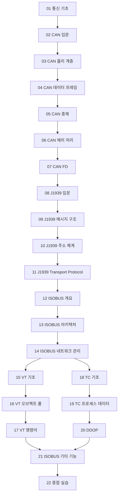

# ISOBUS 스터디

## 스터디 소개

**ISOBUS(ISO 11783)**는 트랙터와 농업 기계 사이의 통신을 표준화한 프로토콜입니다. 제조사가 달라도 트랙터와 작업기가 함께 동작할 수 있도록, CAN 통신 위에 J1939과 ISOBUS 레이어를 쌓아 올린 구조입니다.

이 스터디에서는 다음을 배웁니다.

- **CAN 통신의 원리** — 물리 계층부터 에러 처리, CAN FD까지
- **SAE J1939** — CAN 위에서 메시지를 정의하고 주소를 관리하는 방법
- **ISOBUS(ISO 11783)** — 농업 기계 특화 레이어, 네트워크 아키텍처
- **Virtual Terminal(VT)** — 트랙터 디스플레이에 화면을 그리는 방법
- **Task Controller(TC)** — 정밀 농업을 위한 작업 데이터 교환 방법

---

## 학습 로드맵

---

## 전체 목차

### 통신과 CAN 기초 (01~07)

| 챕터 | 제목 | 한줄 설명 |
|------|------|-----------|
| 01 | [통신의 기초](/study/isobus/01-communication-basics) | ECU 간 통신이 필요한 이유부터 버스 통신의 기초까지 |
| 02 | [CAN 통신 입문](/study/isobus/02-can-intro) | CAN의 탄생 배경, 핵심 특징, 다른 통신 방식과의 비교 |
| 03 | [CAN 물리 계층](/study/isobus/03-can-physical) | 차동 신호, 종단 저항, 통신 속도와 버스 길이 |
| 04 | [CAN 데이터 프레임](/study/isobus/04-can-data-frame) | 프레임의 구조와 각 필드(SOF, ID, DLC, CRC 등)의 역할 |
| 05 | [CAN 중재와 우선순위](/study/isobus/05-can-arbitration) | 충돌 없이 중재하는 비파괴적 비트 중재 메커니즘 |
| 06 | [CAN 에러 처리](/study/isobus/06-can-error) | 오류 감지, 에러 카운터, Bus Off 상태와 복구 |
| 07 | [CAN FD](/study/isobus/07-can-fd) | 최대 64바이트, 듀얼 비트레이트로 Classic CAN을 넘어서 |

### SAE J1939 (08~11)

| 챕터 | 제목 | 한줄 설명 |
|------|------|-----------|
| 08 | [SAE J1939 입문](/study/isobus/08-j1939-intro) | 상위 프로토콜의 역할과 29비트 CAN ID 구성 |
| 09 | [J1939 메시지 구조](/study/isobus/09-j1939-message) | PGN/SPN 개념, PDU1/PDU2 구분, 실제 메시지 디코딩 |
| 10 | [J1939 주소 체계](/study/isobus/10-j1939-address) | 소스 주소(SA), 64비트 NAME, 주소 클레임 절차 |
| 11 | [J1939 Transport Protocol](/study/isobus/11-j1939-transport) | 8바이트 초과 데이터를 보내는 BAM, CMDT, ETP |

### ISOBUS (ISO 11783) (12~14)

| 챕터 | 제목 | 한줄 설명 |
|------|------|-----------|
| 12 | [ISOBUS 개요](/study/isobus/12-isobus-overview) | 탄생 배경, ISO 11783 파트 구성, J1939과의 관계 |
| 13 | [ISOBUS 네트워크 아키텍처](/study/isobus/13-isobus-architecture) | TBC 커넥터, ECU 종류, 물리 토폴로지와 메시지 흐름 |
| 14 | [ISOBUS 네트워크 관리](/study/isobus/14-isobus-network-mgmt) | Working Set, 주소 클레임, 진단 메시지, 초기화 타임라인 |

### Virtual Terminal (15~17)

| 챕터 | 제목 | 한줄 설명 |
|------|------|-----------|
| 15 | [VT 기초](/study/isobus/15-vt-basics) | Virtual Terminal의 개념, 동작 원리, 버전별 기능 |
| 16 | [VT 오브젝트 풀](/study/isobus/16-vt-object-pool) | 화면을 정의하는 오브젝트 풀 구조, 타입, 전송 과정 |
| 17 | VT 명령어 | 화면 전환, 값 갱신, 버튼 이벤트 등 VT 워킹셋 명령어 |

### Task Controller (18~20)

| 챕터 | 제목 | 한줄 설명 |
|------|------|-----------|
| 18 | [TC 기초](/study/isobus/18-tc-basics) | Task Controller의 역할, Section/Rate Control, GPS 연동 |
| 19 | [TC 프로세스 데이터](/study/isobus/19-tc-process-data) | DDI, Element, Measurement/Setpoint 교환 과정 |
| 20 | DDOP | Device Description Object Pool — 장치 능력을 TC에 선언하는 방법 |

### 심화 및 실습 (21~22)

| 챕터 | 제목 | 한줄 설명 |
|------|------|-----------|
| 21 | [ISOBUS 기타 기능](/study/isobus/21-isobus-misc) | Sequence Control(ISO 11783-14)과 File Server(ISO 11783-13) |
| 22 | 종합 실습 | 가상 트랙터-작업기 시나리오로 CAN부터 TC까지 전 과정 실습 |

### 부록

| | 제목 | 설명 |
|--|------|------|
| | [용어집 (Glossary)](/study/isobus/appendix-glossary) | ISOBUS/CAN 주요 용어를 A-Z 순으로 정리 |
| | [PGN/SPN 주요 목록](/study/isobus/appendix-pgn-spn) | 자주 사용하는 PGN과 SPN을 표로 정리한 참조 자료 |

---

## 대상

이 스터디는 CAN 통신과 ISOBUS를 처음 접하는 분을 위해 작성되었습니다. 비개발자도 따라올 수 있도록 기초부터 시작합니다.
