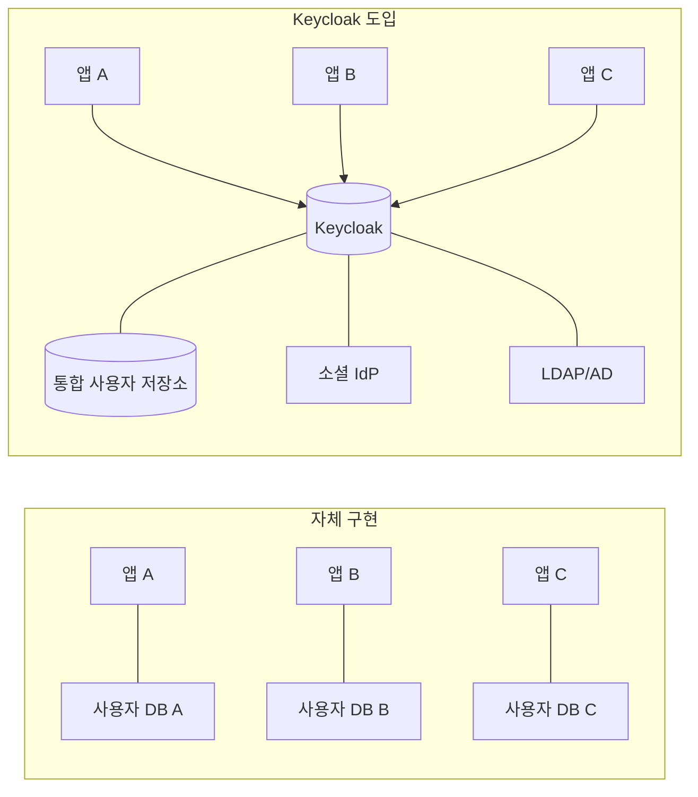
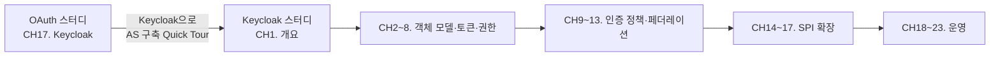

# Keycloak 개요

::: info 학습 목표
- IAM(Identity and Access Management) 문제를 Keycloak이 어떻게 푸는지 설명할 수 있다.
- Keycloak 라이선스와 상용 제품(Red Hat Build of Keycloak, Red Hat SSO)의 관계를 파악한다.
- OAuth 스터디 CH17과 이 스터디의 포지셔닝 차이를 구분한다.
:::

## 1. IAM 문제와 Keycloak의 자리

IAM(Identity and Access Management)은 "누가(Identity) 무엇을(Access) 할 수 있는가"를 일관되게 관리하는 영역이다. 작은 서비스라면 사용자 테이블 하나와 비밀번호 해시만으로도 충분해 보이지만, 서비스가 성장하면 다음과 같은 요구가 한꺼번에 쏟아진다.

| 요구 | 자체 구현 시 부담 |
|------|------------------|
| 소셜 로그인(Google/Kakao/Apple) | IdP별 OAuth/OIDC 플로우 각각 구현, 토큰 저장, 실패 대응 |
| SSO(Single Sign-On) | 서비스 간 세션 공유, 쿠키 도메인/서명 정책 |
| 비밀번호 정책·MFA·Passkey | 해싱 알고리즘 관리, TOTP/WebAuthn 등록 UX |
| 감사 로그·이벤트 | 로그인 실패·관리자 행위 추적, 외부 SIEM 연동 |
| 관리자 UI | 사용자 생성/비활성화/초기화, 역할 부여 |
| 프로토콜 다양성 | OIDC, OAuth 2.0, SAML 2.0, Token Exchange(RFC 8693) |

자체 구현은 "지금 필요한 한 가지"로 시작하지만, 6개월 뒤에는 전담 팀이 필요한 수준이 된다. <strong>Keycloak</strong>은 이 영역을 "외부에 둔다"는 전략의 오픈소스 구현체다. 애플리케이션은 OIDC/SAML 같은 표준 프로토콜만 구현하고, 사용자 저장·로그인 UX·MFA·소셜 로그인은 Keycloak에 위임한다.

Keycloak의 위치는 명확하다. "인증(Authentication)과 인가(Authorization)의 중앙 허브"다. 앱은 사용자 정보를 직접 저장하지 않고, Keycloak이 발급한 토큰(Access Token/ID Token)을 검증해서 사용자를 식별한다.

### 경쟁군 비교

IAM 영역에는 Keycloak 외에도 여러 대안이 있다. 큰 범주로 나누면 다음과 같다.

| 제품 | 형태 | 특징 |
|------|------|------|
| Keycloak | 오픈소스 셀프호스팅 | Apache 2.0, CNCF, Realm·SPI 중심 |
| Auth0 (Okta) | SaaS | 개발 편의성 최고, 벤더 종속·비용 이슈 |
| Okta Workforce | SaaS | 대기업·B2B SSO 표준, 디렉토리 연동 강력 |
| Azure Entra ID | SaaS (MS 생태계) | M365/Azure와 긴밀 통합 |
| AWS Cognito | SaaS (AWS 생태계) | AWS 서비스 연동, Keycloak 대비 기능 제한 |
| Ory Kratos/Hydra | 오픈소스 컴포넌트 | 작은 단위 조합, 러닝커브 높음 |
| Authelia | 오픈소스 Forward-Auth | 경량, 기능 범위 좁음 |

Keycloak은 "셀프호스팅·풀스택·표준 프로토콜"이라는 조합에서 가장 균형 잡힌 선택지로 자주 꼽힌다. 데이터 소버린티 요구가 있거나, 커스터마이징 깊이가 필요하거나, 벤더 락인을 피하려는 조직에 특히 잘 맞는다.

### OAuth 스터디와의 연결

[OAuth 스터디 CH5. 역할과 용어](/study/oauth/05-roles-and-terms)에서 정리한 역할 구분을 복습하면 Keycloak의 자리를 더 분명히 볼 수 있다.

- Resource Owner → 최종 사용자
- Client → 앱(웹/모바일/백엔드)
- Authorization Server → <strong>Keycloak</strong>
- Resource Server → 우리 API 서버

[CH6. Authorization Code Flow](/study/oauth/06-authorization-code-flow)의 표준 플로우에서 "AS" 자리에 그대로 Keycloak을 끼워 넣으면 된다.

## 2. 라이선스와 상용 지원

Keycloak은 <strong>Apache License 2.0</strong>으로 배포된다. 상용 이용·수정·재배포에 제한이 없다. 그래서 많은 기업이 사내 IAM으로 Keycloak을 그대로 쓴다.

### 상용 트랙

상용 지원이 필요한 조직을 위해 Red Hat은 두 가지 제품 라인을 유지한다.

| 이름 | 관계 | 특징 |
|------|------|------|
| Keycloak (커뮤니티) | 업스트림 오픈소스 | Apache 2.0, 빠른 릴리스 주기, Red Hat 지원 없음 |
| Red Hat Build of Keycloak (RHBK) | Keycloak 위에 Red Hat 빌드·지원 추가 | OpenShift 중심, CVE/보안 패치 장기 지원 |
| Red Hat Single Sign-On (RH-SSO) | 구 제품명, RHBK로 대체됨 | 2023년까지 유지되던 상용 브랜드 |

- 커뮤니티 Keycloak은 `quay.io/keycloak/keycloak` 이미지로 공개돼 있다.
- RHBK는 Red Hat 서브스크립션이 있는 조직에게 제공된다. 기술 지원·보안 패치 SLA·인증된 Operator 같은 "엔터프라이즈 계약이 필요한 것"들이 포함된다.
- 공식 Red Hat 문서는 RHBK 기준으로 작성된다. 커뮤니티 기능 중 일부는 RHBK에선 "Technology Preview"로 구분된다.

### 실무 선택 가이드

- 스타트업·내부 도구: 커뮤니티 Keycloak. 충분하다.
- 금융·공공·규제 산업: RHBK 또는 RH-SSO 서브스크립션. 보안 패치 SLA와 지원 계약이 필수다.
- 글로벌 서비스, 자체 운영 역량 있음: 커뮤니티 + 내부 SRE 팀. 대부분의 테크 기업이 여기 속한다.

### 라이선스 오해 방지

Apache 2.0이라는 이유로 종종 "Red Hat 허락 없이 Keycloak 이름을 붙인 SaaS를 팔 수 있나"라는 질문이 나온다. 두 가지로 답할 수 있다.

- 코드와 바이너리의 재배포·수정·상용 이용은 자유다.
- "Keycloak"이라는 상표(Trademark)는 별도 보호 대상이다. 상업 제품명으로 사용하려면 CNCF의 상표 가이드라인을 따라야 한다.

이 구분은 Linux(커널 코드 자유 vs "Linux" 상표)와 동일한 구조다. 내부 운영·고객용 SSO로 쓰는 데는 상표 이슈가 없다.

## 3. OAuth 스터디 CH17과의 관계

[OAuth 스터디 CH17. Keycloak으로 AS 구축](/study/oauth/17-keycloak)은 "OAuth 2.0 소비자 입장에서 Keycloak을 AS로 어떻게 쓸지"에 초점을 맞췄다. Realm 하나 만들고 Client 등록하고 토큰을 받는 수준의 Quick Tour다.

이 스터디(Keycloak 실전)는 그 반대편의 관점을 다룬다.

| 구분 | OAuth CH17 | Keycloak 스터디 |
|------|-----------|----------------|
| 관점 | 사용자(소비자) | 제공자·운영자 |
| 범위 | Realm·Client·토큰 요청 | 전체 관리, SPI, K8s, 업그레이드 |
| 깊이 | "쓸 수 있을 정도" | "운영하고 확장할 수 있을 정도" |
| 길이 | 1챕터 | 23챕터 |

OAuth 스터디를 읽었다면 "왜 Keycloak이 필요한가"는 이미 알고 있다. 이제는 Keycloak 안쪽으로 들어가, Authentication Flow를 뜯고, 커스텀 Authenticator를 만들고, Kubernetes에 Operator로 배포하고, 메이저 버전 업그레이드를 안전하게 수행하는 방법을 다룬다.

### 이 스터디를 읽는 순서 제안

- 이미 Keycloak을 운영 중이라면 CH1을 훑고 CH2부터 정독.
- 신규 도입이라면 CH2(Realm)부터 순서대로 읽고 Admin Console 화면을 눈으로 함께 따라가는 것을 추천.
- SPI 커스터마이징만 관심이라면 CH3·CH9·CH14 이후를 중점 학습.
- Kubernetes 배포만 관심이라면 CH18~19를 먼저 읽고 필요할 때 앞장으로 돌아오기.

### 이 스터디의 범위 한눈에

23개 챕터 전체가 다룰 주제를 범주별로 정리하면 다음과 같다. 챕터 사이의 연결은 서두 목차의 Mermaid 로드맵에 그려 뒀다.

| 범주 | 챕터 | 무엇을 배우는가 |
|------|------|----------------|
| 개요 | CH1 | Keycloak 개요·라이선스 |
| 객체 모델 | CH2~5 | Realm·Client·User·Role |
| 토큰·권한·프로토콜 | CH6~8 | Scope·Mapper·UMA·SAML·Token Exchange |
| 인증 정책 | CH9~11 | Flow·Policy·MFA |
| 페더레이션 | CH12~13 | LDAP·Social IdP |
| SPI 확장 | CH14~17 | Authenticator·User Storage·Theme |
| 운영 | CH18~23 | HA·K8s·DB·REST API·Backup·Upgrade |

"도구를 설치하는 법"에서 시작해 "도구를 만드는 법"까지 내려간 뒤, "도구를 운영하는 법"으로 확장하는 구성이다.

### 실습 환경 권장사항

전체 스터디를 실습하려면 다음 환경이 권장된다.

- 로컬 OS: macOS / Linux / Windows + WSL2 (모두 가능)
- Docker Desktop 또는 OrbStack: Compose 기능 사용
- 메모리 8GB 이상: Keycloak + PostgreSQL + 보조 컨테이너 동시 기동
- JDK 17+ (SPI 커스터마이징 실습 시)
- kubectl + minikube/kind (CH19~20 K8s 실습 시)

준비가 부족해도 CH1~13은 Docker Compose만으로 충분히 따라올 수 있다. K8s·SPI 실습은 해당 챕터 도달 시점에 추가 설치를 검토하면 된다.

### 자주 받는 초기 질문

스터디에 들어가기 전 자주 나오는 의문을 미리 정리한다. 본문 각 장에서 더 깊게 다루지만, 감을 잡는 데 도움이 될 것이다.

- "Keycloak이 없어도 OAuth 2.0은 쓸 수 있지 않은가" → 맞다. 자체 구현도 가능하다. 다만 OIDC/SAML·MFA·소셜·감사·관리 UI를 모두 직접 만들 계획이 없다면, Keycloak은 합리적인 디폴트다.
- "토큰 발급 속도가 충분한가" → Quarkus 전환 후 단일 Pod에서 수백 TPS 이상 가볍게 처리한다. Infinispan 캐시(CH18)와 DB 튜닝(CH20)을 병행하면 대규모 트래픽도 문제없다.
- "업그레이드가 쉬운가" → 쉬운 편은 아니다. 메이저 버전마다 Breaking Change가 누적된다. 그래서 이 스터디의 마지막 챕터(CH23)가 업그레이드와 모니터링에 통째로 할당돼 있다.
- "무료로 전부 쓸 수 있는가" → 코드·기능 전체가 Apache 2.0이다. 상용 제품에 통합해도 라이선스 비용이 없다. "상용 지원(SLA·CVE 대응 계약)"이 필요할 때만 RHBK 서브스크립션을 고려한다.

### 이 스터디를 쓴 시점의 기준

- 커뮤니티 Keycloak <strong>26.x</strong>를 기준으로 한다.
- Docker 이미지 태그는 `quay.io/keycloak/keycloak:26.1`을 사용한다.
- Admin Console 스크린 설명은 v26 레이아웃 기준이다. v24 이하는 메뉴 구조가 일부 다르다.
- Quarkus 배포판만 다룬다. Wildfly 배포판은 이미 제거된 지 오래된 과거 스택이다.

버전이 올라가면서 옵션 이름이 바뀌는 경우가 있다. 본문에서 설명한 환경 변수와 CLI 플래그가 동작하지 않는다면, 먼저 Keycloak 공식 Release Notes의 Breaking Changes 섹션을 확인하는 것이 좋다.

::: tip 핵심 정리
- Keycloak은 인증·인가를 중앙 허브로 위임하는 오픈소스 IAM 솔루션이다. 자체 구현의 장기 부담을 표준 프로토콜(OIDC/SAML)로 대체한다.
- 라이선스는 Apache 2.0. 상용 지원은 Red Hat Build of Keycloak(과거 Red Hat SSO)으로 제공된다.
- 이 스터디는 OAuth CH17의 소비자 관점을 넘어 제공자·운영자 관점을 23챕터에 걸쳐 다룬다.
:::

## 다음 챕터

- 이전 : [Keycloak 스터디 개요](/study/keycloak/)
- 다음 : [Realm과 Organizations](/study/keycloak/02-realm-organizations)
