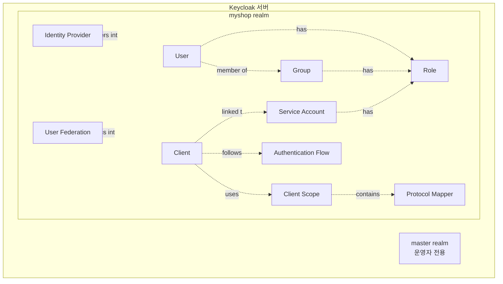
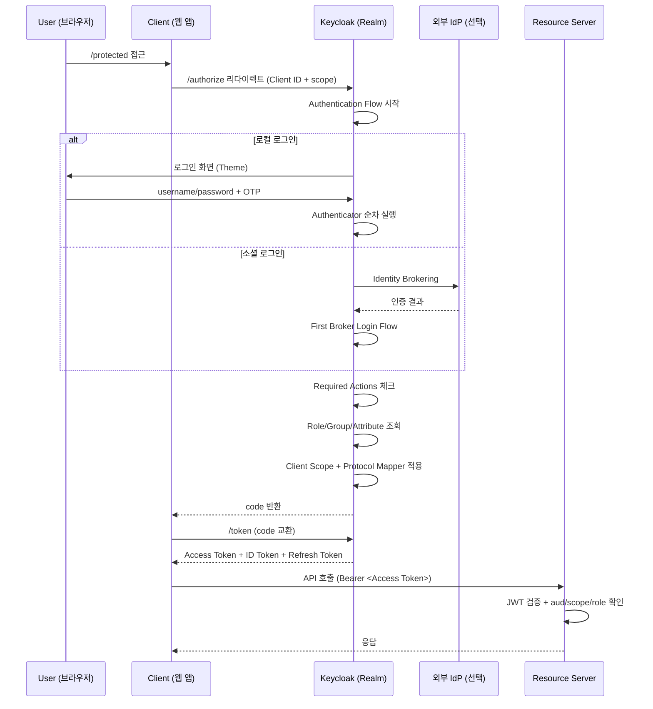

# 핵심 개념과 용어

::: info 학습 목표
- Keycloak의 핵심 객체(Realm, User, Client, Role, Group)를 정의하고 서로의 관계를 이해한다.
- 토큰·세션·플로우·IdP·SPI 등 운영 중 자주 마주치는 용어를 구분할 수 있다.
- 각 개념이 어느 실무 챕터에서 깊게 다뤄지는지 연결 지을 수 있다.
:::

이 챕터는 <strong>개념 사전</strong>이다. 본격적인 설정·실습 내용은 CH3 이후에서 다루며, 여기서는 "용어가 튀어나왔을 때 바로 찾아볼 수 있는 한 장짜리 레퍼런스"를 목표로 한다.

## 1. 객체 모델 한눈에

Keycloak의 데이터는 다음 관계로 엮여 있다.

가장 바깥이 <strong>Realm</strong>(격리 경계)이고, 그 안에 모든 다른 객체가 들어간다. Realm을 벗어나는 참조는 불가능하다.

| 층위 | 객체 | 역할 |
|------|------|------|
| 최상위 | Realm | 격리 경계 |
| 주체 | User · Client(Service Account) | 토큰을 받는 대상 |
| 분류 | Role · Group | 권한·소속 표현 |
| 토큰 가공 | Client Scope · Protocol Mapper | 클레임 조립 |
| 인증 과정 | Authentication Flow · Authenticator · Required Action | 로그인 시나리오 |
| 외부 연동 | Identity Provider · User Federation | 외부 사용자 소스 |
| 확장 | SPI · Theme · Event Listener | 커스터마이징 |

## 2. 격리 단위

### Realm

<strong>한 Keycloak 서버 안의 논리적 "독립 왕국"</strong>이다. 한 Realm의 User/Client/Role/Key/Flow는 다른 Realm에서 전혀 보이지 않는다. 물리적으로는 같은 DB 테이블이지만 `realm_id`로 완벽히 분리된다.

- 토큰의 `iss` 클레임은 `https://auth.example.com/realms/{realm}` 형태로 Realm 이름을 포함한다.
- Realm마다 자체 서명 키 셋을 가지므로, 한 Realm의 토큰을 다른 Realm이 검증할 수 없다.
- 멀티테넌시 설계의 기본 선택지다.

상세: [CH3. Realm과 Organizations](/study/keycloak/03-realm-organizations)

### Master Realm

설치 직후 자동 생성되는 <strong>특수 Realm</strong>. Keycloak 자체를 관리하는 운영자 계정이 사는 곳이다. 이곳의 관리자는 다른 모든 Realm을 건드릴 수 있으므로 서비스 사용자를 절대 두지 않는다.

### Organization (v26+)

<strong>Realm 안에서 B2B 고객사 단위</strong>를 표현하는 기능. 이메일 도메인(`@acme.com`)을 특정 조직과 바인딩하고, 조직별 IdP를 자동 라우팅한다. "Realm per tenant는 과하지만 Group으로는 부족한" 중간 층을 메운다.

상세: [CH3. Realm과 Organizations](/study/keycloak/03-realm-organizations)

## 3. 주체(Principal)

### User

<strong>사람 사용자 계정</strong>이다. Realm 안에 저장되며, 비밀번호 해시·OTP·WebAuthn 자격증명과 속성(email, name, 사용자 정의 attribute)을 가진다. 같은 ID(`alice`)라도 Realm이 다르면 다른 사용자다.

- Credential: 비밀번호·OTP·WebAuthn·Recovery Code 같은 자격증명 레코드
- Attribute: 커스텀 필드(직원번호, 부서 등)로 토큰 클레임에 매핑 가능

상세: [CH5. 사용자와 자격 증명](/study/keycloak/05-user-credentials)

### Client

<strong>토큰을 발급받으려는 애플리케이션 레코드</strong>다. 웹 SPA·모바일·백엔드 API·서버간 호출 주체 등이 각각 하나의 Client로 등록된다. OAuth의 Client와 같은 개념이다.

- Client ID/Secret: Client를 식별·인증하는 값
- Redirect URI: Authorization Code를 돌려받을 콜백 URL 화이트리스트
- Access Type(Confidential/Public/Bearer-only): 비밀키 보유 여부와 플로우 제약
- Client Authenticator: Secret, Signed JWT, mTLS 등 Client 인증 방식

상세: [CH4. Client와 Service Account](/study/keycloak/04-client-service-account)

### Service Account

<strong>Client 자체가 주체가 되는 "기계 계정"</strong>이다. 사람 사용자 없이 Client Credentials Grant로 Client ID/Secret만 가지고 토큰을 받는다. 서버간 호출, 크론잡, CI 파이프라인 등에서 쓴다. 기술적으로는 해당 Client에 자동 연결된 특수 User 레코드다.

상세: [CH4. Client와 Service Account](/study/keycloak/04-client-service-account)

## 4. 권한 모델

### Role

<strong>권한의 단위</strong>. `user`, `admin` 같은 문자열 레이블이며 토큰 안에 들어가 API가 인가 판단에 쓴다.

| 구분 | 정의 | 예 |
|------|------|------|
| Realm Role | Realm 전역 역할 | `realm-admin`, `audit-reader` |
| Client Role | 특정 Client 안에서만 유효한 역할 | `shop-web: order-manager` |
| Composite Role | 다른 역할을 묶은 상위 역할 | `manager = user + report-viewer` |

상세: [CH6. Role·Group과 Composite Role](/study/keycloak/06-role-group)

### Group

<strong>사용자 묶음</strong>. 트리 계층(`/engineering/backend`) 구조이며, Group에 할당된 Role은 소속 User 모두가 자동으로 상속받는다. "부서·팀 단위 권한 일괄 부여"가 전형적 용도다.

### Scope (요청 스코프)

OAuth의 `scope` 파라미터에 담기는 값. Client가 "이번 요청에서 어떤 클레임·권한을 원하는가"를 선언한다. Keycloak에서는 Client Scope 객체와 대응한다.

## 5. 토큰을 조립하는 요소

### Client Scope

<strong>"이 Scope가 요청되면 토큰에 이런 정보를 넣어라"는 묶음</strong>이다. Default Scope는 항상 포함되고, Optional Scope는 요청 시에만 포함된다.

- 표준 스코프: `openid`, `profile`, `email`, `offline_access` 등
- 커스텀 스코프: `order:read`, `admin-panel` 등 프로젝트 전용

### Protocol Mapper

<strong>Client Scope 안에 들어가는 "변환 규칙"</strong>이다. "User의 `department` attribute를 토큰의 `dept` 클레임으로 넣는다" 같은 규칙이 Protocol Mapper 하나다. Hardcoded Claim, User Attribute, Group Membership, Audience 등 여러 유형이 있다.

상세: [CH7. Client Scope와 Protocol Mapper](/study/keycloak/07-protocol-mapper)

### Consent

사용자에게 OAuth 표준 동의 화면(예: "이 앱이 당신의 이메일·프로필 정보를 받으려고 합니다. 동의하시겠습니까?")을 띄우는 기능. Client별로 끄고 켤 수 있으며, OAuth 원칙(권한 위임 시 사용자 동의)을 구현한다.

## 6. 토큰

Keycloak이 발급하는 토큰은 표준 OAuth/OIDC 토큰이다. 구분은 다음과 같다.

| 종류 | 용도 | 기본 수명 |
|------|------|---------|
| Access Token | Resource Server가 인가 판단에 쓰는 JWT | 5분 |
| ID Token | 클라이언트가 "누가 로그인했나"를 알기 위한 JWT | 5분 |
| Refresh Token | Access Token 갱신용. HTTPS 전용 | SSO Session Idle(기본 30분) / SSO Session Max(기본 10시간) 중 작은 값 |
| Offline Token | 세션 만료 후에도 유효한 긴 수명 Refresh Token | 60일(기본) |

Offline Token은 `offline_access` 스코프가 승인됐을 때만 발급되며, 크론잡·백그라운드 워커 같은 "사용자 없이 장기 실행되는 작업"에 쓴다.

상세: [CH7. Client Scope와 Protocol Mapper](/study/keycloak/07-protocol-mapper), OAuth 스터디의 [CH8. 토큰 라이프사이클](/study/oauth/08-token-lifecycle)

## 7. 세션(Session)

<strong>로그인 상태의 단위</strong>다. 두 층으로 나뉜다.

| 층위 | 이름 | 수명 기준 |
|------|------|---------|
| 상위 | User Session | 사용자 단위 로그인 상태(SSO idle/max) |
| 하위 | Client Session | 각 Client가 그 사용자에게 발급한 토큰 묶음 |

<strong>Online Session</strong>과 <strong>Offline Session</strong>이 구분된다. Online은 일정 시간 활동이 없으면 만료되고, Offline은 `offline_access` 스코프로 명시 허용된 장기 세션이다. 클러스터링 시 Infinispan 캐시로 Pod 간 공유된다.

상세: [CH19. Infinispan HA 클러스터링](/study/keycloak/19-ha-clustering)

## 8. 인증 과정

### Authentication Flow

<strong>"어떤 순서로 사용자를 검증할지"의 파이프라인</strong>이다. Browser Flow(브라우저 로그인), Direct Grant Flow(Password Grant), Reset Credentials Flow(비밀번호 재설정) 등 용도별로 여러 Flow가 있다. 각 단계는 Authenticator로 구성되며 `REQUIRED`, `ALTERNATIVE`, `CONDITIONAL`, `DISABLED`로 동작 조건을 설정한다.

### Authenticator

<strong>단일 인증 단계</strong>. 비밀번호 검증, OTP 확인, WebAuthn 인증, IdP Redirect, Conditional 분기 같은 하나하나가 Authenticator다. 커스텀 Authenticator를 SPI로 만들어 끼울 수도 있다.

### Required Actions

로그인은 성공했지만 <strong>완전히 들어오기 전에 사용자가 꼭 해야 하는 일</strong>. "비밀번호 변경", "이메일 인증", "OTP 등록", "Terms and Conditions 동의" 등이 이에 해당한다. Admin이 수동으로 User에 Required Action을 걸 수도 있다.

상세: [CH10. 인증 플로우 커스터마이징](/study/keycloak/10-auth-flow), [CH11. Password Policy와 Brute Force](/study/keycloak/11-password-policy), [CH12. MFA](/study/keycloak/12-mfa)

## 9. 외부 사용자 소스

### Identity Provider (IdP)

<strong>Keycloak 외부의 인증 공급자</strong>. Google·GitHub·Kakao·Apple 같은 소셜 IdP, 파트너 회사의 SAML IdP, 다른 OIDC Provider 등을 Keycloak에 등록하면 사용자가 그 계정으로 로그인할 수 있다.

### Identity Brokering

<strong>IdP의 인증 결과를 받아 Keycloak 토큰으로 다시 포장</strong>하는 동작. 앱 입장에선 소셜 로그인이든 직접 로그인이든 항상 Keycloak 토큰만 받는다. First Broker Login Flow가 최초 로그인 시 로컬 사용자 생성을 담당한다.

상세: [CH14. Identity Brokering](/study/keycloak/14-identity-brokering)

### User Federation

<strong>외부 사용자 저장소를 Keycloak의 일급 사용자 소스로 취급</strong>하는 기능. LDAP/AD가 가장 흔하고, SCIM 2.0 연동이나 커스텀 DB도 SPI로 연결할 수 있다. Identity Brokering과 달리 사용자가 <strong>외부 저장소에 "있는" 상태</strong>에서 Keycloak이 그걸 투명하게 읽고 쓴다.

상세: [CH13. User Federation](/study/keycloak/13-user-federation)

## 10. 세밀한 권한

### Authorization Services

Role만으로는 모자란 <strong>"리소스·속성 기반 인가"를 지원하는 엔진</strong>. "이 사용자가 문서 id=42를 조회할 수 있는가"처럼 데이터 인스턴스 단위 권한을 정책(Policy)·퍼미션(Permission)·리소스(Resource) 모델로 표현한다.

### UMA 2.0 (User-Managed Access)

Authorization Services 위에서 돌아가는 표준. "데이터 주인이 스스로 공유 범위를 정한다"는 모델로, 의료 기록이나 금융 데이터처럼 사용자 중심 권한 부여가 필요한 도메인에서 쓴다.

상세: [CH8. Authorization Services와 UMA](/study/keycloak/08-authz-uma)

## 11. 확장

### SPI (Service Provider Interface)

<strong>Keycloak의 확장 포인트</strong>. 인증 단계(Authenticator), 사용자 저장소(User Storage), 이벤트 리스너, Protocol Mapper, 테마 등 대부분의 내부 기능이 SPI로 구현돼 있어 JAR 하나를 `providers/` 디렉토리에 떨구면 새 구현체로 교체·추가된다.

상세: [CH15. SPI 개요](/study/keycloak/15-spi-overview) 이후

### Theme

<strong>로그인 화면·Account Console·Admin Console의 UI 커스터마이징</strong>. FreeMarker 템플릿과 정적 리소스로 구성되며, Realm별·Client별로 다른 테마를 지정할 수 있다.

상세: [CH18. Theme 커스터마이징](/study/keycloak/18-theme)

### Event Listener

<strong>Keycloak 내부 이벤트를 받아 외부로 흘리는 훅</strong>. 로그인 성공/실패, 토큰 발급, 사용자 생성 같은 Event를 JMS/Kafka/SIEM으로 보내 감사·알림에 쓴다. 기본 제공 리스너도 있고 SPI로 직접 만들 수도 있다.

## 12. 관리 인터페이스

| 이름 | 형태 | 용도 |
|------|------|------|
| Admin Console | 웹 UI (`/admin/`) | 시각적 운영·설정 |
| Admin REST API | HTTP/JSON | 자동화·GitOps |
| kcadm.sh | 셸 스크립트 | CLI에서 REST 호출 |
| Keycloak Operator | Kubernetes CRD | 선언적 K8s 배포 |

운영 자동화는 기본적으로 Admin REST API를 중심으로 한다. Terraform Keycloak Provider도 같은 API를 호출한다.

상세: [CH22. Admin REST API와 자동화](/study/keycloak/22-admin-rest-api), [CH20. Kubernetes + Operator 배포](/study/keycloak/20-k8s-operator)

## 13. 배포·런타임 용어

### Quarkus

Keycloak 17(2022)부터 채택된 <strong>JVM 런타임</strong>. 기존 Wildfly 대비 부팅 속도·메모리·컨테이너 친화성이 크게 개선됐다. `kc.sh build` 단계에서 Provider 스캔과 DB 벤더 결정을 사전 최적화한다.

### Infinispan

Keycloak이 세션·토큰·로그인 실패 카운트를 공유하는 <strong>분산 인메모리 캐시</strong>. 다중 Pod 환경에서 이 캐시가 일관되게 동작해야 "어느 Pod로 붙어도 같은 로그인 상태"가 유지된다.

상세: [CH19. Infinispan HA 클러스터링](/study/keycloak/19-ha-clustering)

### Relative Path (`/auth`)

Wildfly 기반 구 배포판(~v16)의 기본 컨텍스트 경로. Quarkus 기반 v17+에서는 루트(`/`)가 기본이지만, 호환 모드로 `KC_HTTP_RELATIVE_PATH=/auth`를 설정할 수 있다. 기존 앱의 `issuer` URL이 `/auth/realms/...` 형식이었다면 이 설정이 필요하다.

## 14. 토큰 발급 체인 예시

위 개념들이 한 번의 로그인에서 어떻게 엮이는지 대략의 순서로 보면 다음과 같다.

이 시퀀스의 각 단계가 뒤 챕터에서 한 챕터씩 다뤄진다고 보면 된다.

::: tip 핵심 정리
- Keycloak의 모든 객체는 Realm 안에 산다. Realm 경계를 벗어나는 참조는 없다.
- User·Client(·Service Account)는 토큰을 받는 주체이고, Role·Group으로 권한을 분류한다.
- Client Scope + Protocol Mapper는 "토큰에 무엇을 담을지"를 결정한다.
- Authentication Flow는 Authenticator를 엮어 로그인 시나리오를 조립한다.
- Identity Provider는 외부 인증, User Federation은 외부 사용자 저장을 연결한다.
- SPI는 거의 모든 확장 포인트의 진입점이며, 커스텀 기능의 표준 경로다.
:::

## 다음 챕터

- 이전 : [Keycloak 개요](/study/keycloak/01-overview)
- 다음 : [Realm과 Organizations](/study/keycloak/03-realm-organizations)
