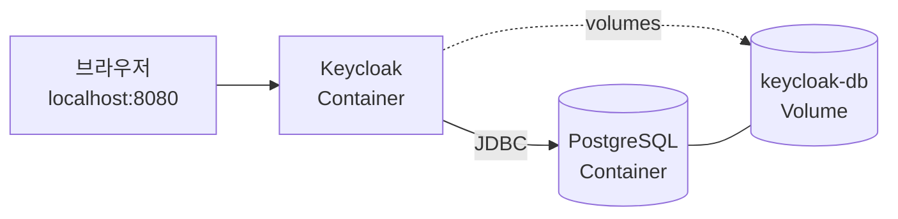
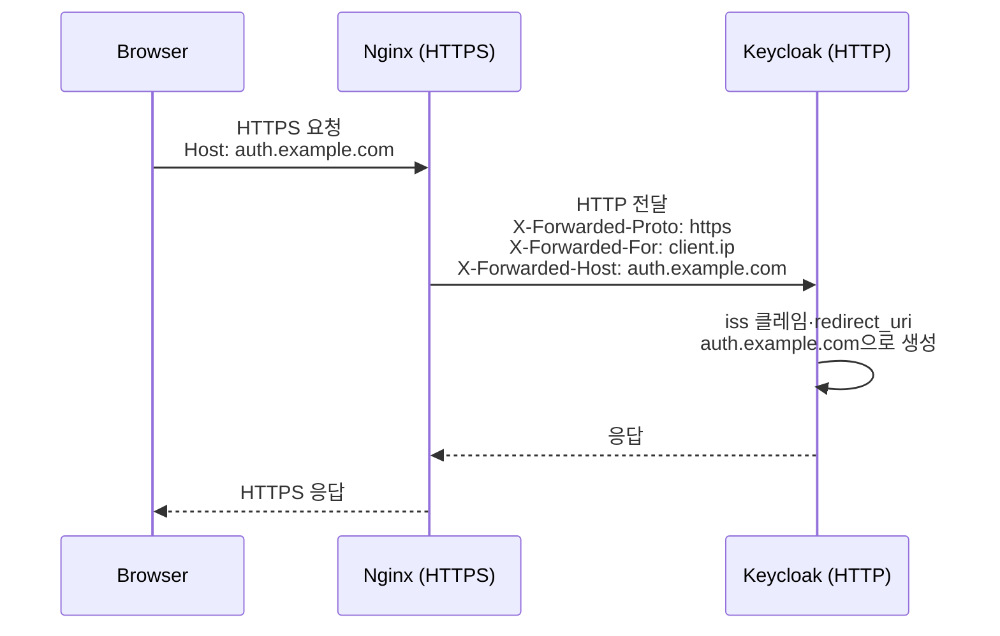

# 로컬에 Keycloak 기동

::: info 학습 목표
- Docker Compose로 Keycloak + PostgreSQL 스택을 설계할 수 있다.
- `start-dev`와 `start`의 차이를 빌드 단계 관점에서 설명할 수 있다.
- Reverse Proxy 뒤에 둘 때 필요한 `--proxy-headers`·`--hostname` 옵션을 이해한다.
- 데이터 영속성(볼륨·DB 백업)과 첫 관리자 프로비저닝 절차를 파악한다.
:::

---

## 1. 최소 Docker Compose

Keycloak 26.x와 PostgreSQL 16으로 최소 스택을 구성한다. Keycloak은 내장 H2 DB도 지원하지만 로컬에서조차 외부 DB를 쓰는 편이 "운영 환경과 닮은 문제"를 먼저 만나게 해서 좋다.

### docker-compose.yml

```yaml
services:
  postgres:
    image: postgres:16
    container_name: keycloak-postgres
    environment:
      POSTGRES_DB: keycloak
      POSTGRES_USER: keycloak
      POSTGRES_PASSWORD: keycloak_db_pw
    volumes:
      - keycloak-db:/var/lib/postgresql/data
    healthcheck:
      test: ["CMD-SHELL", "pg_isready -U keycloak"]
      interval: 5s
      timeout: 5s
      retries: 10

  keycloak:
    image: quay.io/keycloak/keycloak:26.1
    container_name: keycloak
    command: start-dev
    environment:
      # DB
      KC_DB: postgres
      KC_DB_URL: jdbc:postgresql://postgres:5432/keycloak
      KC_DB_USERNAME: keycloak
      KC_DB_PASSWORD: keycloak_db_pw

      # Hostname / HTTP
      KC_HOSTNAME: localhost
      KC_HTTP_ENABLED: "true"

      # Bootstrap Admin (v26+)
      KEYCLOAK_ADMIN: admin
      KEYCLOAK_ADMIN_PASSWORD: admin_temp_pw
    ports:
      - "8080:8080"
    depends_on:
      postgres:
        condition: service_healthy

volumes:
  keycloak-db:
```

주요 환경 변수를 정리하면 다음과 같다.

| 변수 | 의미 | 비고 |
|------|------|------|
| `KC_DB` | DB 벤더 | `postgres`, `mysql`, `mariadb`, `oracle`, `mssql` |
| `KC_DB_URL` | JDBC URL | 서비스 이름(`postgres`)을 호스트로 사용 |
| `KC_HOSTNAME` | 공개 호스트 | 토큰 `iss` 클레임·리다이렉트 URL에 사용 |
| `KC_HTTP_ENABLED` | HTTP 허용 | 로컬/Proxy 뒤에서만 true |
| `KEYCLOAK_ADMIN` | 최초 관리자 계정 | 기동 후 교체 권장 |
| `KEYCLOAK_ADMIN_PASSWORD` | 최초 관리자 비번 | 임시 값, 운영 전 변경 |

### 기동 흐름



```bash
docker compose up -d
docker compose logs -f keycloak
```

로그에 다음 한 줄이 보이면 준비 끝이다.

```
Running the server in development mode. DO NOT use this configuration in production.
Keycloak 26.1.x on JVM (powered by Quarkus 3.x.x) started in 3.542s.
```

---

## 2. start-dev vs start

Keycloak은 <strong>개발 모드</strong>(`start-dev`)와 <strong>운영 모드</strong>(`start`) 두 가지를 명확히 구분한다. Quarkus의 "빌드 타임 최적화" 철학이 여기서 드러난다.

### 모드 비교

| 항목 | start-dev | start |
|------|----------|-------|
| 용도 | 개발·학습 | 운영 |
| HTTPS 강제 | 비활성 | 기본 활성 (TLS 필수) |
| 빌드 단계 | 런타임에 자동 수행 | `kc.sh build` 선수행 필요 |
| Hostname 검증 | 느슨 | 엄격 (`KC_HOSTNAME` 필수) |
| Theme 캐시 | 꺼짐 | 켜짐 |
| Health·Metrics | 옵션 | 기본 활성화 권장 |
| 로그 레벨 | INFO | WARN 권장 |
| 경고 메시지 | "DO NOT use in production" | 없음 |

### 빌드 단계가 왜 필요한가

`start` 모드는 반드시 빌드 결과가 있어야 한다. 빌드 단계에서 다음 결정이 고정된다.

- 어떤 DB 벤더를 쓸 것인가 (JDBC 드라이버 포함 여부)
- Provider(SPI 구현체)를 무엇을 로드할 것인가
- Health·Metrics 엔드포인트를 켤 것인가
- 어떤 Feature(preview/experimental)를 활성화할 것인가

```bash
# 운영 모드 2단계
kc.sh build --db=postgres --features=token-exchange,admin-fine-grained-authz
kc.sh start --optimized
```

`--optimized`는 "빌드 결과를 재사용할 것"이라는 선언이다. 이 플래그가 없으면 `start`도 런타임에 빌드를 다시 돌린다.

Docker에서는 커스텀 이미지를 빌드해 두는 패턴이 흔하다.

```dockerfile
FROM quay.io/keycloak/keycloak:26.1 AS builder
ENV KC_DB=postgres
ENV KC_FEATURES=token-exchange,admin-fine-grained-authz
RUN /opt/keycloak/bin/kc.sh build

FROM quay.io/keycloak/keycloak:26.1
COPY --from=builder /opt/keycloak/ /opt/keycloak/
ENTRYPOINT ["/opt/keycloak/bin/kc.sh", "start", "--optimized"]
```

### 언제 어떤 모드를 쓸까

- 로컬 개발·이 스터디 진행 중: `start-dev`
- CI 파이프라인의 통합 테스트: `start-dev` (편의 > 실전성)
- 스테이지·프로덕션: `start --optimized` 고정

---

## 3. Reverse Proxy 연결

운영에서는 Keycloak을 직접 인터넷에 노출하지 않는다. Nginx·Traefik·ALB 같은 Reverse Proxy 뒤에 두고 HTTPS 종료(TLS termination)를 맡긴다.



### 필수 옵션

```yaml
environment:
  KC_HOSTNAME: https://auth.example.com
  KC_HTTP_ENABLED: "true"
  KC_PROXY_HEADERS: xforwarded
```

| 옵션 | 이유 |
|------|------|
| `KC_HOSTNAME` | 토큰 발급자(`iss`), `.well-known/openid-configuration`의 절대 URL 생성 기준 |
| `KC_HTTP_ENABLED=true` | Proxy→Keycloak 구간은 HTTP. 기본은 차단되므로 명시 허용 |
| `KC_PROXY_HEADERS=xforwarded` | `X-Forwarded-*` 헤더를 신뢰. 없으면 내부 IP/스킴으로 URL을 만든다 |

### Nginx 예시

```nginx
server {
    listen 443 ssl http2;
    server_name auth.example.com;

    ssl_certificate     /etc/letsencrypt/live/auth.example.com/fullchain.pem;
    ssl_certificate_key /etc/letsencrypt/live/auth.example.com/privkey.pem;

    location / {
        proxy_pass http://keycloak:8080;
        proxy_set_header Host              $host;
        proxy_set_header X-Forwarded-For   $proxy_add_x_forwarded_for;
        proxy_set_header X-Forwarded-Proto https;
        proxy_set_header X-Forwarded-Host  $host;
    }
}
```

핵심은 <strong>X-Forwarded-Proto: https</strong>와 Host 헤더다. 이 둘이 없으면 Keycloak이 redirect URL을 `http://internal-host:8080/...`으로 만들어 버려 브라우저 리다이렉트가 깨진다.

---

## 4. HTTPS와 인증서

Reverse Proxy에서 TLS를 종료하는 패턴 외에, Keycloak이 직접 TLS를 다루는 옵션도 있다.

### 두 가지 패턴

| 패턴 | 구성 | 추천 상황 |
|------|------|-----------|
| Proxy TLS Termination | Nginx/ALB가 HTTPS, Keycloak은 HTTP | 대부분의 운영. 인증서·리뉴얼을 Proxy가 담당 |
| Keycloak 직접 TLS | Keycloak이 HTTPS 직접 서빙 | Proxy 없는 단독 VM, 또는 mTLS 요구 |

직접 TLS를 쓰려면 인증서를 keystore 또는 PEM 파일로 준비한다.

```bash
kc.sh start \
  --hostname=https://auth.example.com \
  --https-certificate-file=/opt/keycloak/conf/tls.crt \
  --https-certificate-key-file=/opt/keycloak/conf/tls.key
```

### 자체 서명 vs Let's Encrypt

- 자체 서명 인증서: 로컬·사내 테스트용. 브라우저가 경고를 띄우므로 Client SDK에서 TLS 검증을 꺼야 할 때가 있다(프로덕션에선 절대 금지).
- Let's Encrypt: 운영 기본. 90일 자동 갱신. certbot 또는 Traefik의 `certificatesResolvers.acme`로 자동화한다.

### 자주 만나는 함정

- 인증서 갱신 후 Keycloak이 옛 인증서를 계속 쓴다 → Pod/컨테이너 재시작 필요. Keycloak은 기동 시 키스토어를 읽는다.
- 브라우저는 HTTPS 정상인데 JS 클라이언트가 `ERR_CERT_AUTHORITY_INVALID` → 내부 호스트명(`keycloak.default.svc.cluster.local`)을 `KC_HOSTNAME`으로 쓰고 있다. 외부 노출 URL을 지정해야 한다.

---

## 5. 데이터 영속성

Keycloak은 Realm 설정, 사용자, 역할, 이벤트 로그까지 모두 DB에 저장한다. 컨테이너가 사라져도 데이터가 유지되도록 volume을 반드시 붙여야 한다.

### 영속 대상

| 데이터 | 저장 위치 | 볼륨 전략 |
|--------|-----------|-----------|
| Realm·User·Client | PostgreSQL | DB volume + 정기 `pg_dump` |
| 테마 파일 | `/opt/keycloak/themes/` | 이미지에 포함 or 별도 volume |
| Provider JAR | `/opt/keycloak/providers/` | 이미지에 포함 (권장) |
| 로그 | stdout | Docker 로그 드라이버 / Loki |

### PostgreSQL 백업 요령

```bash
# 매일 pg_dump
docker exec keycloak-postgres \
  pg_dump -U keycloak -Fc keycloak > backup/keycloak-$(date +%F).dump

# 복원
docker exec -i keycloak-postgres \
  pg_restore -U keycloak -d keycloak --clean < backup/keycloak-2026-04-17.dump
```

상세한 백업·복원 전략은 <strong>CH24. Backup·Realm 이관</strong>에서 재해 복구(DR) 관점까지 포함해 다룬다. 여기서는 "볼륨 하나와 pg_dump가 있어야 한다" 정도의 감각이면 충분하다.

### Realm Export/Import와의 관계

PostgreSQL 백업이 "전부를 통째로" 보존한다면, Realm Export/Import는 "선택한 Realm만 이관"한다.

```bash
kc.sh export --dir /tmp/realm-export --realm myrealm --users realm_file
```

이 둘은 용도가 다르다. DB 백업은 재해 복구, Export는 환경 간 이관(Dev→Stage→Prod)이다.

---

## 6. 첫 로그인 검증

Compose를 띄운 뒤 가장 먼저 할 일은 <strong>master realm</strong>에 관리자로 로그인해서 정상 구동을 확인하는 것이다.

### 절차

1. 브라우저로 `http://localhost:8080/`에 접속한다.
2. "Administration Console" 링크 클릭 → `http://localhost:8080/admin/`.
3. `KEYCLOAK_ADMIN` / `KEYCLOAK_ADMIN_PASSWORD`로 로그인.
4. 좌측 상단 Realm Selector가 <strong>master</strong>로 선택돼 있는지 확인.
5. Users → Add user로 자기 자신용 관리자를 하나 더 만든다.
6. 기본 부트스트랩 계정(`admin`)은 비활성화하거나 비밀번호를 강력한 값으로 교체한다.

### v26+ 부트스트랩 변경점

- 과거에는 `KEYCLOAK_USER`/`KEYCLOAK_PASSWORD`였다.
- 26.x부터 `KEYCLOAK_ADMIN`/`KEYCLOAK_ADMIN_PASSWORD`로 공식화됐고, "부트스트랩용 임시 계정"임을 문서가 명시했다.
- Keycloak Operator는 `bootstrap-admin` 기능을 별도로 제공한다(CH21 참조).

### 건강 상태 확인

운영 전에 Health·Metrics 엔드포인트를 반드시 점검한다.

```bash
curl http://localhost:9000/health/ready
curl http://localhost:9000/metrics
```

- 운영 이미지 빌드 시 `--health-enabled=true --metrics-enabled=true`를 포함해야 한다.
- 기본 포트는 9000(관리 인터페이스)이고 8080(공개)과 분리돼 있다.

### 블로그 포스트 참고

이 섹션의 Docker Compose 예제는 [Keycloak 개념 및 간단 사용 포스트](/posts/tech/2025-10-01-keycloak)의 실습 편과 유사하다. 포스트는 "처음 띄워본다"에 초점이 있고, 이 챕터는 운영 모드·Proxy·영속성까지 시야를 넓힌 버전이다.

---

::: tip 핵심 정리
- 최소 스택은 Keycloak + PostgreSQL + (운영 시) Reverse Proxy다. Compose로 한 번에 관리한다.
- `start-dev`는 학습·개발용, 운영은 `kc.sh build` 이후 `start --optimized`로 실행한다.
- Reverse Proxy 뒤에 둘 때는 `KC_HOSTNAME`·`KC_HTTP_ENABLED=true`·`KC_PROXY_HEADERS=xforwarded` 세 옵션이 필수다.
- PostgreSQL volume과 `pg_dump`는 재해 복구용, Realm Export/Import는 환경 이관용으로 용도가 다르다.
- 기동 직후 master realm 관리자 로그인 → 개인 관리자 계정 생성 → 부트스트랩 계정 교체 순으로 마무리한다.
:::

## 다음 챕터

- 이전 : [Keycloak 개요와 역사](/study/keycloak/01-overview)
- 다음 : [Admin Console 구조](/study/keycloak/03-admin-console)
