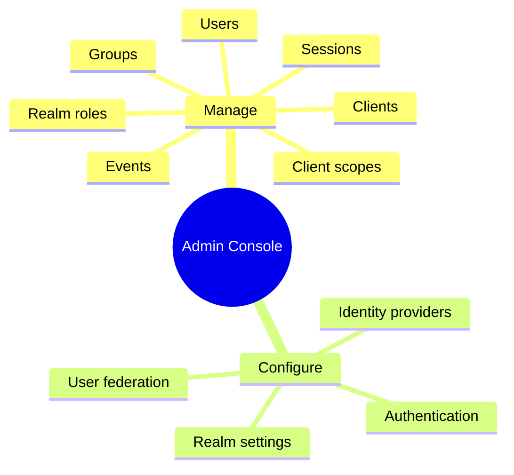
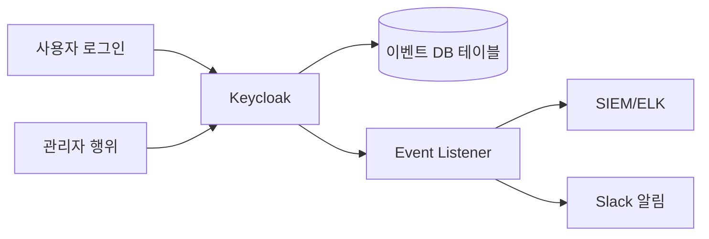
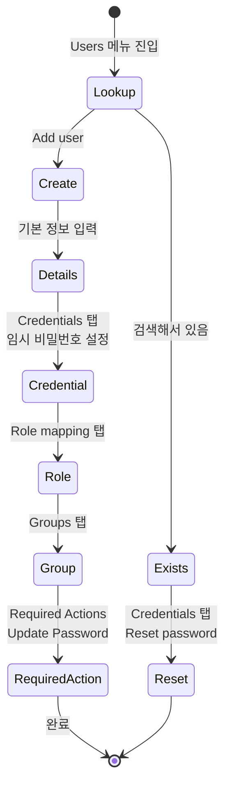

# Admin Console 구조

::: info 학습 목표
- Admin Console의 최상위 메뉴 지도를 머릿속에 그릴 수 있다.
- Realm Selector와 master realm의 의미를 구분할 수 있다.
- 주요 작업(Client 생성, User 추가, Role 부여 등)의 위치를 찾을 수 있다.
- Sessions·Events 탭의 역할과 운영상의 쓰임을 이해한다.
:::

---

## 1. Master Realm vs 업무 Realm

Keycloak에는 특별한 Realm이 하나 있다. 이름이 <strong>master</strong>다. 설치 직후 자동 생성되며, 다른 모든 Realm을 관리하는 "관리자의 관리자" Realm이다.

### 역할 구분

| 항목 | master realm | 업무 realm (예: `myshop`) |
|------|--------------|---------------------------|
| 용도 | Keycloak 자체 관리 | 실제 서비스 사용자 |
| 기본 Client | `master-realm`, `admin-cli` 등 | 서비스 앱 Client |
| 사용자 | Keycloak 관리자만 | 서비스의 최종 사용자 |
| 삭제 가능 | 불가 | 가능 |

master realm은 다른 Realm을 <strong>감독</strong>(supervise)하는 권한을 갖는다. master realm에 로그인한 관리자는 Realm Selector를 바꿔 가며 모든 Realm을 관리할 수 있다. 반대로 업무 Realm의 관리자는 해당 Realm 안에서만 권한을 갖는다.

### 권장 패턴

- master realm에는 "Keycloak 관리 직무" 계정만 둔다. 서비스 사용자는 절대 넣지 않는다.
- 서비스마다 별도 Realm(`myshop`, `staff-portal` 등)을 만든다.
- 업무 Realm 안에도 그 Realm의 관리자를 둘 수 있다(Realm Admin). 중앙의 master 관리자가 아니어도 운영이 굴러가게 한다.

---

## 2. 좌측 메뉴 전체 지도

Admin Console의 좌측 메뉴는 거의 고정된 순서로 배치돼 있다. 기능을 메뉴로 나눠 외우면 "뭘 하려면 어디 가야 하지?"를 빠르게 해결한다.

### 메뉴별 요약

| 메뉴 | 하는 일 |
|------|---------|
| Clients | 앱 등록, Redirect URI, Client Secret, Flow 토글 |
| Client scopes | 여러 Client가 공유하는 스코프·매퍼 |
| Realm roles | Realm 전역 Role 정의 |
| Users | 사용자 CRUD, Credential, Role, Group, Consent |
| Groups | Role과 속성을 묶어 상속하는 컨테이너 |
| Sessions | 현재 활성 세션·오프라인 세션 조회/삭제 |
| Events | 로그인/관리자 이벤트 로그 |
| Realm settings | Realm 수준 설정 전반 |
| Authentication | 인증 Flow, Required Actions, Password Policy |
| Identity providers | Google/GitHub 등 외부 IdP 브로커링 |
| User federation | LDAP/AD 등 외부 사용자 저장소 연동 |

### 탐색 전략

- <strong>사용자 문제</strong>는 Users → 해당 사용자 → 탭 전환(Details/Credentials/Role mapping/Groups/Sessions/Consents)으로 대부분 해결된다.
- <strong>Client 문제</strong>는 Clients → 해당 Client → Settings/Keys/Credentials/Roles/Client scopes/Sessions/Advanced/Authorization 순으로 탭이 늘어선다.
- <strong>Realm 수준 문제</strong>는 Realm settings의 상단 탭 9~10개를 훑는 걸로 시작한다.

---

## 3. Realm settings 투어

Realm settings는 해당 Realm의 거의 모든 행동을 지배한다. 탭이 많아 보이지만 범주로 묶으면 단순하다.

### 탭 요약

| 탭 | 용도 |
|----|------|
| General | Realm 이름, 표시 이름, 프론트엔드 URL |
| Login | 회원가입 허용, 이메일 기반 로그인, 비밀번호 찾기 활성 여부 |
| Email | SMTP 설정, 발신자 주소 |
| Themes | Login/Account/Email 테마 선택 |
| Keys | Realm 서명 키(RSA/EdDSA) 로테이션 |
| Events | Login/Admin 이벤트 활성·보존 기간·Listener |
| Localization | i18n, 기본 언어, 번역 오버라이드 |
| Security defenses | Brute Force, Header defenses(X-Frame-Options 등) |
| Sessions | SSO 세션·토큰 수명 |
| Tokens | Access Token·Refresh Token 수명, 서명 알고리즘 |
| Client registration | 동적 Client 등록 정책 |

### 자주 건드리는 곳

- <strong>Tokens</strong>: Access Token 수명(기본 5분)을 서비스에 맞게 조정.
- <strong>Keys</strong>: 주기적 키 로테이션. Active/Passive/Disabled 상태를 이해해야 한다.
- <strong>Security defenses</strong>: Brute Force Detection을 반드시 켠다. 기본은 off다.
- <strong>Login</strong>: 회원가입 허용 토글. 사내 서비스는 보통 끈다.

---

## 4. Sessions와 Events

운영에서 가장 많이 쓰는 두 메뉴다. 문제가 생겼을 때 가장 먼저 들르는 곳이기도 하다.

### Sessions

세션 상태를 실시간으로 들여다보고 강제 종료한다.

| 범주 | 설명 |
|------|------|
| Realm sessions | Realm 전체의 활성 SSO 세션 |
| User sessions | 특정 사용자의 세션 (Users → 해당 사용자 → Sessions 탭) |
| Offline sessions | refresh_token offline_access를 가진 장기 세션 |
| Client sessions | Client별 활성 세션 |

"Sign out all active sessions" 버튼은 긴급 사고 대응용이다. 모든 사용자의 세션을 끊어 재로그인을 강제한다.

### Events

Keycloak의 감사 로그다. 두 종류가 있다.

| 종류 | 대상 | 예 |
|------|------|----|
| Login Events | 사용자 행위 | LOGIN, LOGIN_ERROR, LOGOUT, CODE_TO_TOKEN |
| Admin Events | 관리자 행위 | CREATE user, UPDATE client, DELETE realm-role |

활성화는 Realm settings → Events 탭에서 토글한다. 이벤트는 기본 DB에 저장되지만, 운영에서는 Event Listener SPI로 외부 SIEM(Splunk/ELK)으로 스트리밍하는 것이 표준이다(CH25에서 상세).

### 보존 기간

- Login Events의 기본 보존 기간은 "무제한". 운영에서는 30~90일로 설정해 DB 팽창을 막는다.
- Admin Events는 감사 요구에 따라 1년 이상 보존하는 조직도 많다. 이 경우 외부 SIEM으로 상시 스트리밍하고 Keycloak DB는 짧게 유지하는 구성이 현실적이다.
- 이벤트 테이블이 커지면 Keycloak 자체 성능에도 영향이 간다. 주기적인 퍼지·아카이브가 필요하다.

---

## 5. User/Group 관리 화면

신규 사용자 추가는 Admin Console에서 가장 자주 수행하는 작업이다.

### 기본 워크플로우

### User 상세의 탭

| 탭 | 용도 |
|----|------|
| Details | 이메일, 이름, 활성 여부, 속성(Attributes) |
| Credentials | 비밀번호·OTP·WebAuthn 조회/초기화/삭제 |
| Role mapping | Realm Role·Client Role 직접 부여 |
| Groups | 그룹 가입/탈퇴 |
| Consents | 사용자가 동의한 Client와 스코프 |
| Identity provider links | 소셜 로그인 연결 정보 |
| Sessions | 해당 사용자의 활성 세션 |

### Group 관리의 요점

- Group은 Role과 속성(Attributes)을 <strong>상속</strong>시키는 컨테이너다.
- 계층 구조를 가진다. `/engineering/backend`처럼 경로 표기.
- 새 User에게 기본 가입시키려면 "Default Groups"로 등록한다.
- 대규모 조직에서는 "Group에 Role을, User를 Group에 넣는다" 패턴이 유지보수 비용이 가장 낮다. CH7에서 깊게 다룬다.

---

## 6. 주의할 메뉴

초보자가 자주 혼동하는 메뉴를 정리한다.

### Clients → Client authentication 토글

Client 설정의 "Client authentication" 토글이 곧 <strong>Access Type</strong>을 결정한다.

| 토글 | 의미 | Access Type |
|------|------|-------------|
| ON | Client Secret/JWT로 자기 증명 | Confidential |
| OFF | 시크릿 없이 Client ID만 | Public |

이 설정을 잘못 두면 SPA가 Confidential로 설정돼 토큰을 못 받거나, 백엔드가 Public으로 설정돼 Client Credentials Flow가 불가능해진다. CH5에서 상세히 다룬다.

### Authentication → Flows

로그인 단계 구성을 편집하는 가장 강력한 메뉴이자, <strong>가장 잘못 건드리기 쉬운 곳</strong>이기도 하다.

- "Duplicate"로 기본 Flow를 복제한 뒤 편집해야 한다. 원본을 직접 수정하면 업그레이드 시 충돌한다.
- Required / Alternative / Disabled / Conditional의 의미를 명확히 이해해야 한다.
- CH11에서 상세히 다룬다.

### Authentication → Required Actions

사용자가 다음 로그인 시 반드시 수행해야 할 행동들이다.

| Required Action | 의미 |
|-----------------|------|
| Update Password | 다음 로그인 시 비밀번호 변경 강제 |
| Configure OTP | TOTP 등록 강제 |
| Verify Email | 이메일 인증 링크 전송 |
| Update Profile | 프로필 재확인 |
| Terms and Conditions | 약관 동의 |

"Default Action" 토글을 켜면 해당 Action이 모든 신규 사용자에게 자동 부여된다.

### Clients → 기본 Client

Realm을 만들면 이미 등록된 Client들이 있다. 삭제하면 안 된다.

| 기본 Client | 용도 |
|-------------|------|
| `account` | Account Console (사용자 자기 관리 UI) |
| `account-console` | Account Console의 프런트엔드 |
| `admin-cli` | `kcadm.sh` CLI용 |
| `broker` | Identity Brokering 내부 처리 |
| `realm-management` | Realm 관리 권한 매핑 대상 |
| `security-admin-console` | Admin Console 프런트엔드 |

### Account Console로의 분기

관리자용 Admin Console과 별개로, 사용자 자신이 자기 프로필·세션·Credential을 관리하는 UI가 있다. `http://localhost:8080/realms/{realm}/account/`로 접근한다.

- Admin Console(`/admin/`)은 Keycloak 운영자 대상.
- Account Console(`/realms/{realm}/account/`)은 최종 사용자 대상.
- 두 UI는 내부적으로 서로 다른 Client(`security-admin-console` vs `account-console`)를 통해 보호된다.
- 운영에서는 Account Console을 서비스 UX에 맞게 커스텀 테마로 덮어쓰는 경우가 많다(CH19).

### 자주 하는 탐색 시나리오

| 목표 | 경로 |
|------|------|
| 특정 사용자의 최근 로그인 실패 확인 | Users → 검색 → 해당 사용자 → Sessions / Events |
| Access Token 수명 변경 | Realm settings → Tokens → Access Token Lifespan |
| Brute Force 잠금 정책 | Realm settings → Security defenses → Brute Force Detection |
| 새 SAML 앱 연동 | Clients → Create → Client Type: SAML |
| 구글 로그인 추가 | Identity providers → Add provider → Google |
| LDAP 연동 | User federation → Add provider → LDAP |
| MFA 강제 | Authentication → Required Actions → Configure OTP "Default Action" ON |

표의 경로를 눈에 익히면 챕터 4 이후에서 Keycloak 기능을 실습할 때 이동 속도가 확연히 빨라진다.

---

::: tip 핵심 정리
- master realm은 Keycloak 자체를 관리하는 상위 Realm이다. 서비스 사용자는 절대 넣지 않는다.
- 좌측 메뉴는 Manage(운영)와 Configure(설정)로 대별된다. 메뉴 지도를 외우면 탐색 속도가 크게 빨라진다.
- Realm settings의 Tokens/Keys/Security defenses는 운영 전 반드시 점검한다.
- Sessions와 Events는 장애·감사 대응의 1차 관문이다. 외부 SIEM 연동은 CH25에서 다룬다.
- Clients의 "Client authentication" 토글과 Authentication의 Required Actions·Flows는 가장 실수가 많은 메뉴다.
:::

## 다음 챕터

- 이전 : [로컬에 Keycloak 기동](/study/keycloak/02-quickstart)
- 다음 : [Realm과 Organizations](/study/keycloak/04-realm-organizations)
