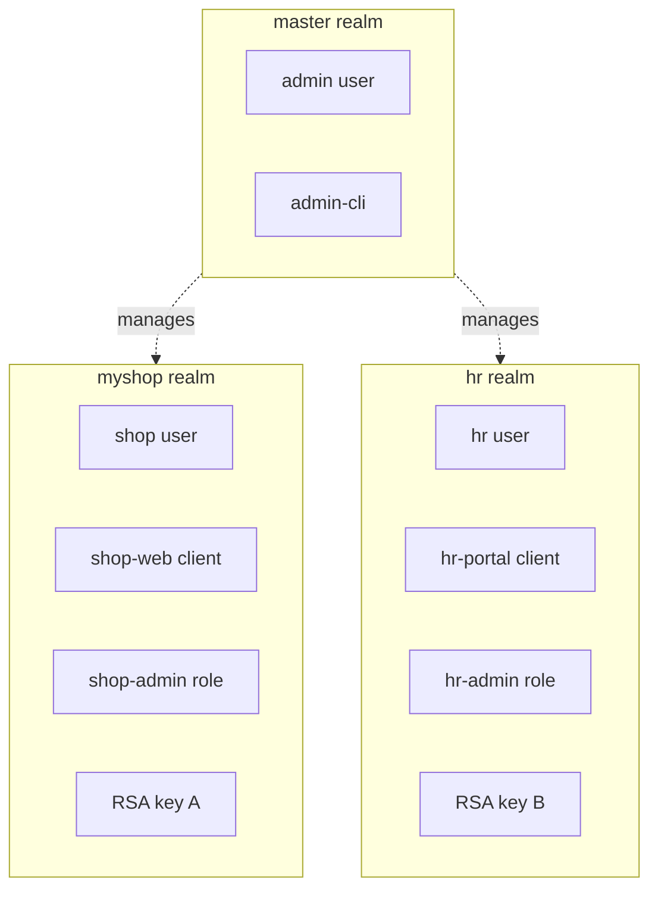
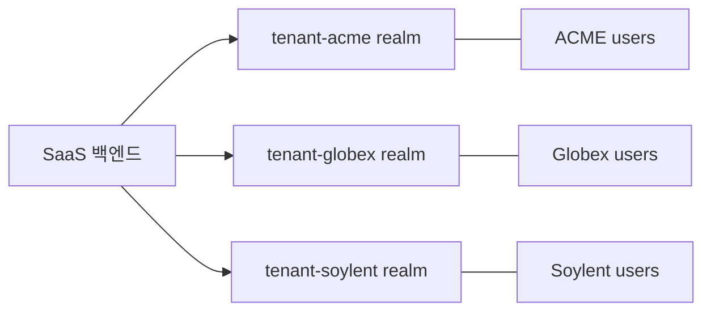
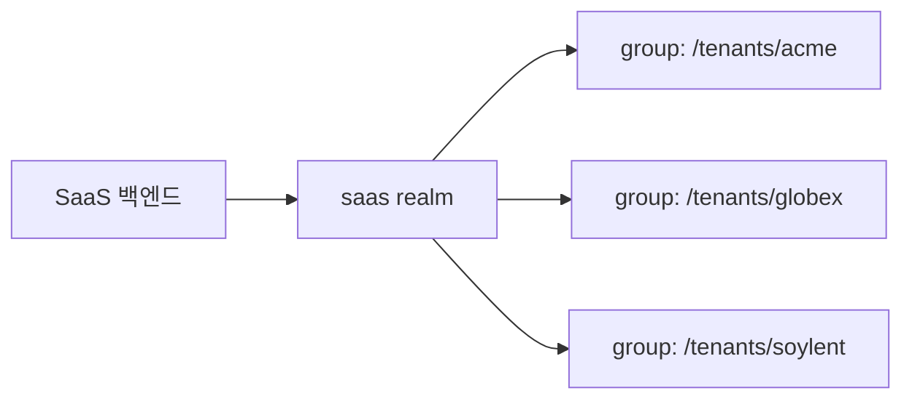
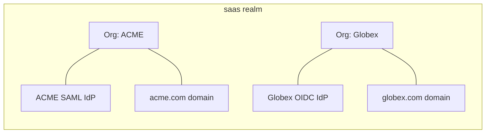
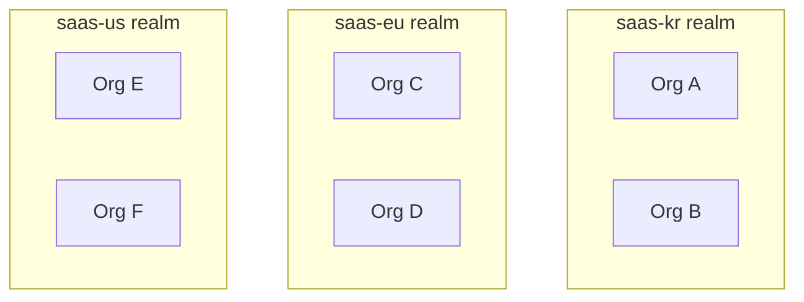
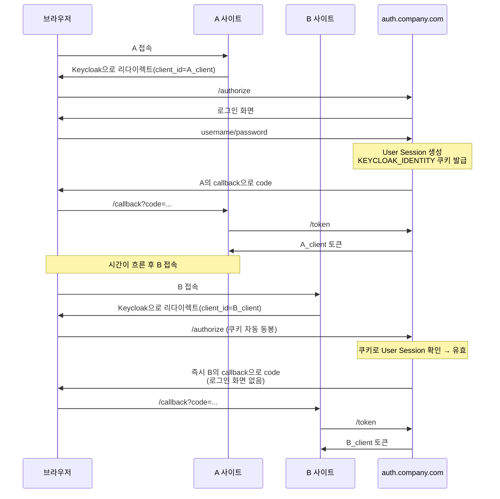

# Realm과 Organizations

::: info 학습 목표
- Realm이 격리하는 대상(사용자·Client·Role·설정)을 명확히 이해한다.
- Master Realm을 운영상 어떻게 취급해야 하는지 설명할 수 있다.
- 멀티테넌시 설계에서 Realm per tenant와 Single realm + Groups 패턴을 비교할 수 있다.
- v26+ Organizations 기능의 용도와 Realm과의 차이를 판단할 수 있다.
:::

## 1. Realm 경계의 의미

Realm은 Keycloak의 <strong>격리 경계</strong>(isolation boundary)다. 한 Realm 안의 모든 객체는 다른 Realm에서 보이지 않는다. 물리적으로는 같은 DB 테이블에 저장되지만, Realm ID로 완벽히 분리돼 있다.

### 격리 대상

| 객체 | Realm 경계 안에서만 유효한가? |
|------|----------------------------|
| User | 그렇다. Realm A의 `alice`와 Realm B의 `alice`는 별개 |
| Client | 그렇다. Client ID가 같아도 Realm이 다르면 다른 앱 |
| Role | 그렇다. Realm Role은 물론 Client Role도 Realm 안에서만 유효 |
| Group | 그렇다 |
| Identity Provider | 그렇다. 같은 Google 연동이라도 Realm마다 별도 등록 |
| User Federation | 그렇다. 같은 LDAP을 써도 Realm별로 provider 설정 |
| 서명 키 | 그렇다. Realm마다 자체 키 셋 |
| Authentication Flow | 그렇다 |
| 토큰 발급자(iss) | `KC_HOSTNAME/realms/{realm}` 형태로 Realm 포함 |



### 격리의 운영적 의미

- Realm별로 보안 정책이 완전히 독립한다. `myshop`은 MFA 강제, `hr`은 LDAP 연동 같은 식으로 갈라 설정 가능하다.
- 토큰은 Realm 경계를 넘지 못한다. `myshop` Realm의 토큰으로는 `hr` API를 부를 수 없다(의도된 설계).
- Realm 간 사용자 공유가 필요하면 Identity Brokering이나 User Federation으로 명시적 연결을 만들어야 한다.

## 2. Master Realm

master realm은 Realm 중 "특별한 것"이다.

### 역할

- 설치 직후 자동 생성되고, 삭제할 수 없다.
- master realm의 사용자·Client·Role은 Keycloak 자체 관리용으로 설계돼 있다.
- master realm 관리자는 "모든 Realm을 관리할 수 있는" 권한을 기본으로 갖는다.

### 일반 사용자를 두면 안 되는 이유

- 권한 누수 위험: master의 Role은 구조적으로 "모든 Realm"을 건드릴 수 있다. 실수 하나로 전사가 잠긴다.
- 섞여서 관리됨: 서비스 사용자와 Keycloak 운영자가 같은 Realm에 있으면 감사·사고 대응 때 혼란.
- 업그레이드 리스크: master realm은 Keycloak 버전마다 "자동 시드" 처리가 들어간다. 일반 사용자 데이터와 충돌 가능.

### 실전 규칙

- master realm에는 Keycloak 운영자 계정만 둔다.
- 서비스 사용자는 반드시 별도 업무 Realm에 생성한다.
- 업무 Realm마다 "Realm Admin" 권한을 가진 관리자를 두고, master 관리자는 최후의 수단으로만 개입한다.

## 3. 멀티테넌시 설계 패턴

"우리 SaaS에 여러 고객사를 수용해야 한다"는 상황이 오면 두 가지 큰 선택지가 있다.

### 패턴 A: Realm per tenant

고객사마다 Realm을 하나씩 할당한다.



| 장점 | 단점 |
|------|------|
| 완전 격리: 사용자·정책·IdP 모두 분리 | Realm 수가 수백·수천이 되면 운영 부담 |
| 고객별 커스텀 IdP(SAML 등) 용이 | Admin Console 탐색·Export 비용 증가 |
| 고객별 감사 로그 분리 | 범용 Role·Client Scope 재사용 어려움 |

### 패턴 B: Single realm + Groups/Attributes

Realm 하나에 모든 고객사를 수용하고, Group이나 사용자 속성(Attributes)으로 구분한다.



| 장점 | 단점 |
|------|------|
| 운영 단순, Realm 하나만 관리 | 테넌트 간 격리가 약함 |
| Role·Client Scope 재사용 용이 | 잘못된 권한 매핑 시 교차 테넌트 누수 |
| 확장성 좋음 | 테넌트별 IdP·테마 분리 어려움 |

### 의사결정 가이드

| 상황 | 추천 |
|------|------|
| 기업 고객이 적고(수십) 각자 SSO 요구 강함 | Realm per tenant |
| B2C 대중 서비스 | Single realm |
| B2B SaaS 수천 테넌트, 테넌트마다 가벼운 커스터마이징 | Single realm + Organizations (§4) |
| 규제 산업(금융·의료) 데이터 격리 필수 | Realm per tenant |

## 4. Organizations (v26+)

Keycloak 26에서 정식 도입된 <strong>Organizations</strong>은 "Realm보다는 가볍고 Group보다는 강한" 테넌트 단위다.

### 무엇을 해결하나

Realm per tenant의 운영 부담을 해결하면서, Single realm의 격리 부족도 보완한다. 특히 B2B SaaS의 "회사(Organization) 단위 로그인" 요구를 표준 기능으로 흡수한다.



### 주요 기능

| 기능 | 설명 |
|------|------|
| 이메일 도메인 매핑 | `alice@acme.com`이 ACME 조직으로 자동 라우팅 |
| 조직별 Identity Provider | 조직마다 전용 SAML/OIDC IdP 바인딩 |
| Managed/Unmanaged 멤버 | 조직에 귀속된 사용자 vs 초대받은 게스트 |
| 조직별 속성 | Organization 자체의 메타데이터 |
| Brokering 자동화 | 이메일 입력만으로 해당 조직 IdP로 리다이렉트 |

### 로그인 흐름 예시

1. 사용자가 이메일 `alice@acme.com` 입력.
2. Keycloak이 도메인 `acme.com`으로 ACME 조직 식별.
3. ACME 조직에 바인딩된 SAML IdP로 자동 리다이렉트.
4. SAML 인증 후 Keycloak이 사용자를 ACME 조직 멤버로 생성·연결.

수작업으로 IdP Hint나 홈리얼름 선택 UI를 만들지 않아도 된다는 점이 핵심 이득이다.

### 기존 Group과의 차이

| 항목 | Group | Organization |
|------|-------|--------------|
| 계층 구조 | 트리 | 평면(조직 단위) |
| IdP 바인딩 | 불가 | 가능 |
| 도메인 기반 라우팅 | 불가 | 핵심 기능 |
| 속성/메타데이터 | 있음 | 더 풍부 |
| 용도 | 권한 묶음·부서 | B2B 고객사 |

## 5. Realm vs Organization 의사결정

실제 설계에서 "Realm을 쪼갤까, Organization으로 갈까"는 자주 맞닥뜨리는 질문이다.

### 기준

| 기준 | Realm 분리가 낫다 | Organization으로 충분 |
|------|------------------|----------------------|
| 보안 격리 수준 | 강 | 중 |
| 테넌트 수 | 소(수십) | 중·대(수십~수천) |
| 고객별 전용 IdP | 요구 | Organizations 기능으로 해결 |
| 토큰 발급자 분리 | 필요 (`iss`에 테넌트 노출) | 불필요 |
| 운영 인력 | 테넌트당 담당자 있음 | 중앙 관리 |
| 커스텀 테마 | 테넌트별 완전히 다름 | 공통 베이스 + 부분 변형 |

### 실전 하이브리드

대규모 B2B SaaS는 "Realm 몇 개 + 각 Realm 안에 Organizations 수백 개" 형태로 가는 경우가 흔하다.

- 지역별·데이터 소버린티 요구로 Realm을 나눔(예: `saas-kr`, `saas-eu`, `saas-us`).
- 각 Realm 안에서 고객사는 Organization으로 표현.
- 이 구조는 운영 부담과 격리 요구의 균형점이다.



## 6. Realm 간 이동

Realm 경계가 강하다 보니, 환경 이관(Dev→Stage→Prod)이나 고객사 이전은 별도 기능으로 처리한다.

### Realm Export/Import

Admin CLI나 서버 커맨드로 Realm 전체를 JSON으로 뽑을 수 있다. 다음은 Keycloak 26.x 기준 CLI 예시다. 옵션 이름은 버전별로 미세하게 변경될 수 있으므로 `kc.sh export --help`로 확인한다.

```bash
# 서버 모드 Export (Realm 전체 + 사용자)
kc.sh export \
  --dir /tmp/realm-export \
  --realm myshop \
  --users realm_file

# Import
kc.sh import --dir /tmp/realm-export
```

또는 Admin REST API / `kcadm.sh`로 partial export도 가능하다.

### 이관 시 주의점

- Client Secret은 export에 포함된다. 파일 관리 주의.
- 사용자 비밀번호 해시도 포함된다. 이관 파일은 민감 자료로 취급.
- 기본적으로 서명 키는 export 파일에 포함되어 그대로 복원된다. 운영 관점에서는 이관 후 Keys를 신규 발급하고 외부 앱의 JWKS 캐시를 재동기화하는 편이 안전하다.
- Import 시 "Policy: OVERWRITE vs IGNORE_EXISTING"을 명시적으로 결정해야 한다.

상세한 백업·이관 전략은 [CH23. Backup·Realm 이관](/study/keycloak/23-backup-restore)에서 DR 시나리오까지 포함해 다룬다.

### 실습 팁

로컬에서 Realm 구조를 여러 번 실험할 때는 "Realm을 통째로 Export → 삭제 → Import"가 가장 빠른 롤백이다. DB 볼륨을 지우지 않고도 Realm 단위로 깨끗한 상태를 재현할 수 있다.

## 7. 같은 Realm으로 멀티 도메인 SSO

한 회사가 여러 도메인의 앱(예: `app1.company.com`, `shop.partner.io`, `admin.tool.io`)을 운영할 때 SSO를 붙이는 표준 패턴은 <strong>하나의 Realm + 앱별 Client</strong>다. Realm을 나누는 것이 아니라 Realm을 공유하고 Client만 여러 개 등록한다.

### SSO가 동작하는 원리

Keycloak의 SSO는 <strong>Keycloak 서버 도메인에 붙는 쿠키</strong>(`KEYCLOAK_IDENTITY`, `AUTH_SESSION_ID`)로 User Session을 유지한다. 앱 도메인과는 무관하다.

| 요소 | 예시 | 설명 |
|------|------|------|
| Keycloak 서버 | `auth.company.com` | SSO 쿠키가 여기 붙음 |
| Realm | `company` | 모든 앱이 공유하는 사용자 공간 |
| Client 1 | `app1-web` | Redirect: `https://app1.company.com/callback` |
| Client 2 | `shop-web` | Redirect: `https://shop.partner.io/callback` |
| Client 3 | `admin-tool` | Redirect: `https://admin.tool.io/callback` |

### A 로그인 후 B 접속 시퀀스



사용자 입장에서는 <strong>비밀번호 입력 없이 잠깐 깜빡임 후 B에 로그인</strong>된다. 세 번의 HTTP 리다이렉트가 일어나지만 UI 프롬프트는 없다.

### User Session과 Client Session

| 구분 | 공유 여부 | 설명 |
|------|---------|------|
| User Session | 공유 | 사용자가 한 번 로그인한 "인증 사실" |
| Client Session | Client별 분리 | A용 토큰, B용 토큰 각각 발급 |
| Access Token | 분리 | `aud=A_client` vs `aud=B_client` |
| Refresh Token | 분리 | Client별 갱신 체인 |

즉, "사용자가 로그인했다"는 사실은 공유되지만 토큰은 Client마다 따로 발급된다. Client가 받은 토큰으로 다른 Client의 API를 호출할 수는 없다(audience 검증 실패). Client 간 토큰 이동이 필요하면 [CH9. Token Exchange](/study/keycloak/09-saml-token-exchange)를 쓴다.

### B의 자동 로그인 타이밍

B가 SSO를 어떻게 트리거하느냐에 따라 사용자 경험이 달라진다.

| B의 동작 | 사용자 경험 |
|---------|-----------|
| 접속 즉시 `/authorize` 호출 (protected route) | 접속하자마자 자동 로그인 |
| "로그인" 버튼 클릭 시 `/authorize` 호출 | 클릭하면 비밀번호 없이 바로 로그인 |
| `prompt=none` silent check | 백그라운드 iframe/fetch로 확인. 이미 로그인돼 있으면 토큰, 아니면 게스트 모드 유지 |

### SSO가 깨지는 경우

- <strong>SSO Session Idle/Max 만료</strong>: 설정값(기본 30분/10시간)이 지나면 쿠키는 있지만 서버 세션이 무효
- <strong>브라우저 완전 종료</strong>: 세션 쿠키가 사라짐. Remember Me 옵션으로 영속 쿠키 발급 가능
- <strong>명시 로그아웃</strong>: Single Sign-Out 설정 시 A에서 로그아웃하면 B 세션도 같이 종료
- <strong>서드파티 쿠키 차단</strong>: Safari ITP·Chrome의 third-party cookie 제한 강화 환경에서 Keycloak 도메인이 앱 도메인과 <strong>완전히 다른 톱 레벨</strong>이면 SSO가 깨질 수 있음

### 실전 권장

- Keycloak을 앱과 같은 톱 레벨 도메인의 <strong>서브도메인</strong>에 둔다. 예: 앱이 `*.company.com`이면 Keycloak은 `auth.company.com`
- Client마다 <strong>Valid Redirect URIs</strong>와 <strong>Web Origins</strong>을 명시한다. 와일드카드 `*`는 서브도메인 탈취 위험이 있어 피한다([CH4. Client](/study/keycloak/04-client-service-account) 참조)
- SSO Session 만료 정책은 Realm Settings → Sessions에서 조정하며, UX와 보안의 균형점을 정한다
- 외부 파트너 도메인(`shop.partner.io`처럼 톱 레벨이 다름)을 붙이려면 서드파티 쿠키 정책을 테스트하고, 필요 시 파트너 측을 CNAME으로 `partner.company.com` 같은 서브도메인에 매핑한다

### 멀티 도메인 SSO와 Realm 분리의 판단

| 상황 | 선택 |
|------|------|
| 같은 회사의 여러 자사 서비스 | 하나의 Realm + Client 여러 개 |
| B2B 고객사가 각자 다른 도메인 | Realm per tenant 또는 Organizations(v26+) |
| 토큰 `iss`를 서비스별로 분리해야 함 | Realm 분리 |
| 자회사·계열사 간 별도 보안 정책 | Realm 분리 + Identity Brokering |

::: tip 핵심 정리
- Realm은 사용자·Client·Role·Key·Flow를 모두 격리하는 Keycloak의 최상위 경계다.
- master realm은 "관리자의 관리자" 전용으로만 쓰고, 서비스 사용자는 별도 Realm에 둔다.
- 멀티테넌시는 Realm per tenant(강한 격리) vs Single realm + Groups(운영 단순) 사이에서 선택한다.
- v26+ Organizations는 Single realm 안에서 B2B 조직 단위를 표현하고, 이메일 도메인 기반 IdP 라우팅을 표준화한다.
- 대규모 SaaS는 지역별 Realm + 조직별 Organization 하이브리드가 자주 쓰인다.
- 한 회사의 여러 자사 도메인을 SSO로 묶을 때는 Realm을 공유하고 Client만 여러 개 등록한다. SSO 쿠키는 Keycloak 서버 도메인에 붙으므로 앱 도메인과는 무관하다.
:::

## 다음 챕터

- 이전 : [핵심 개념과 용어](/study/keycloak/02-core-concepts)
- 다음 : [Client와 Service Account](/study/keycloak/04-client-service-account)
