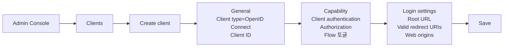
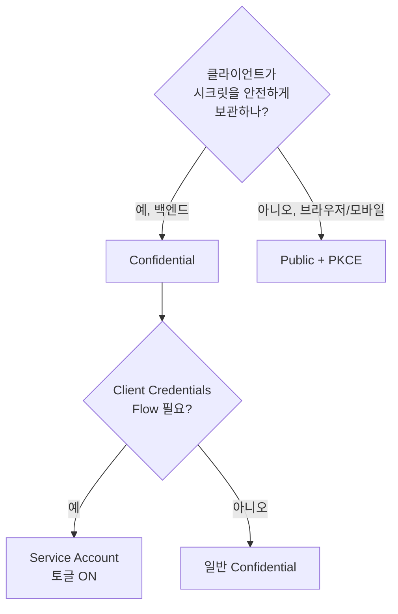
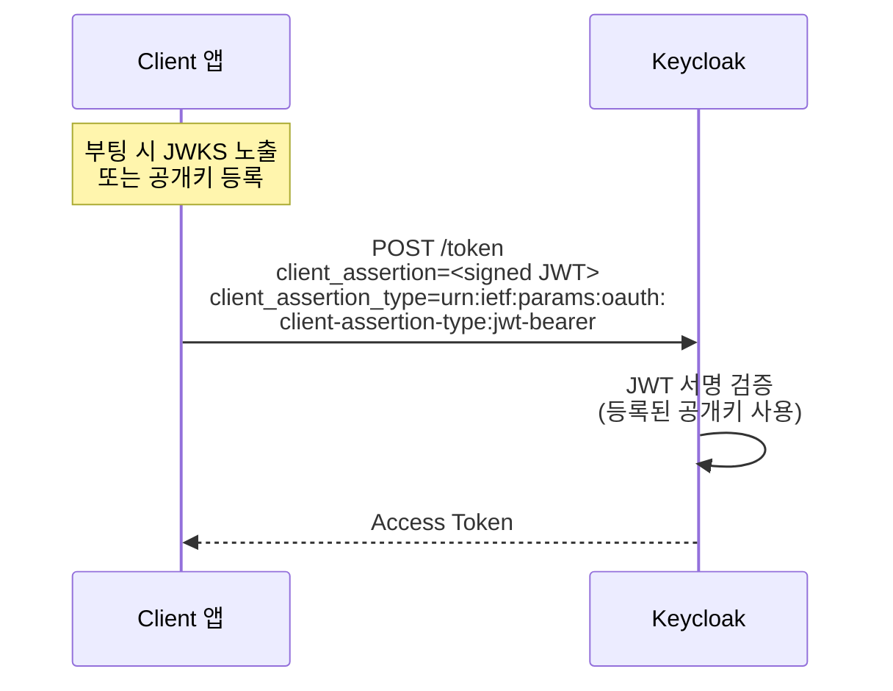
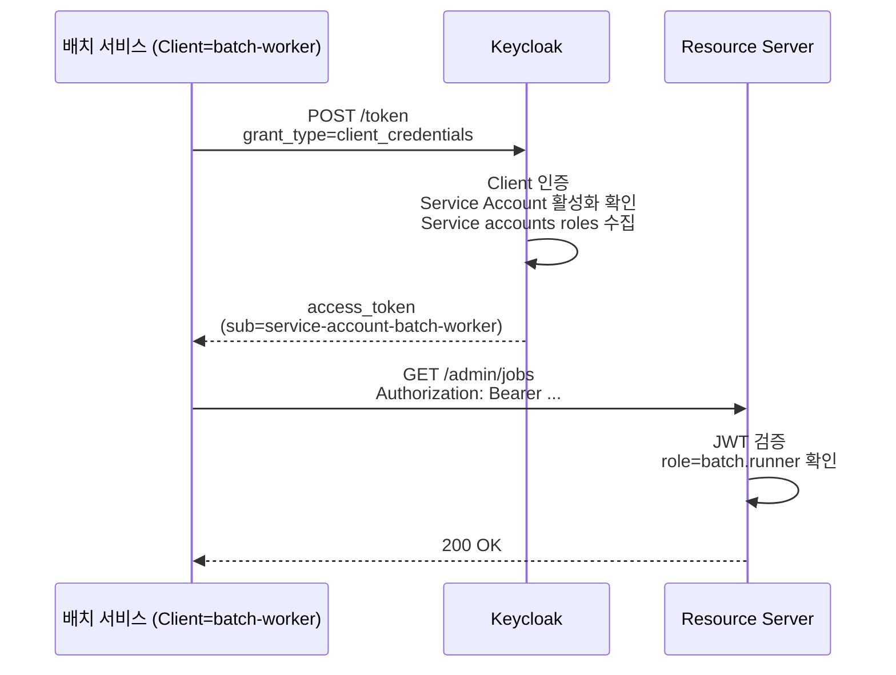
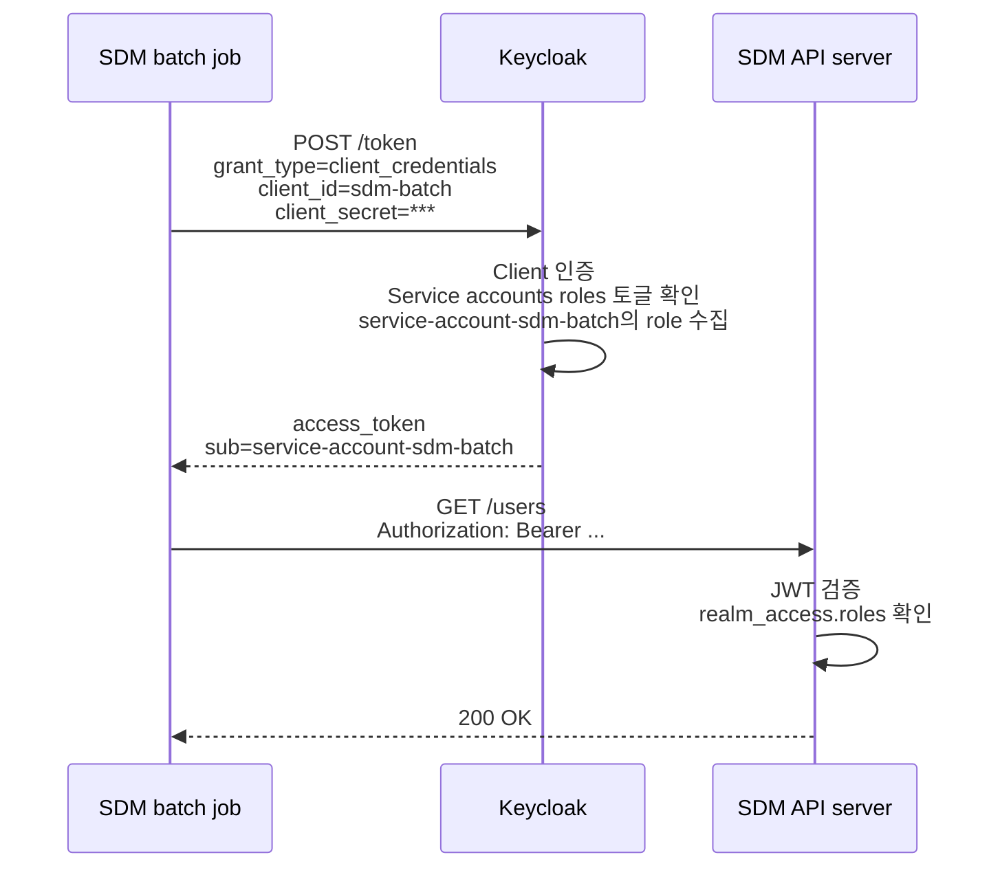
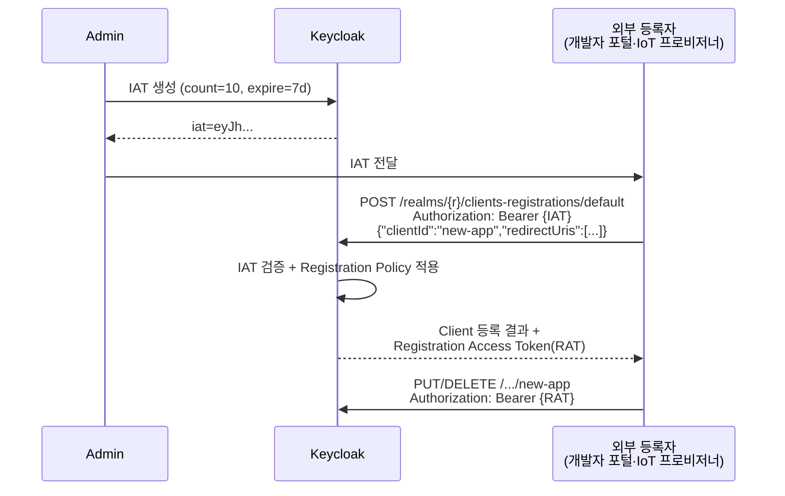
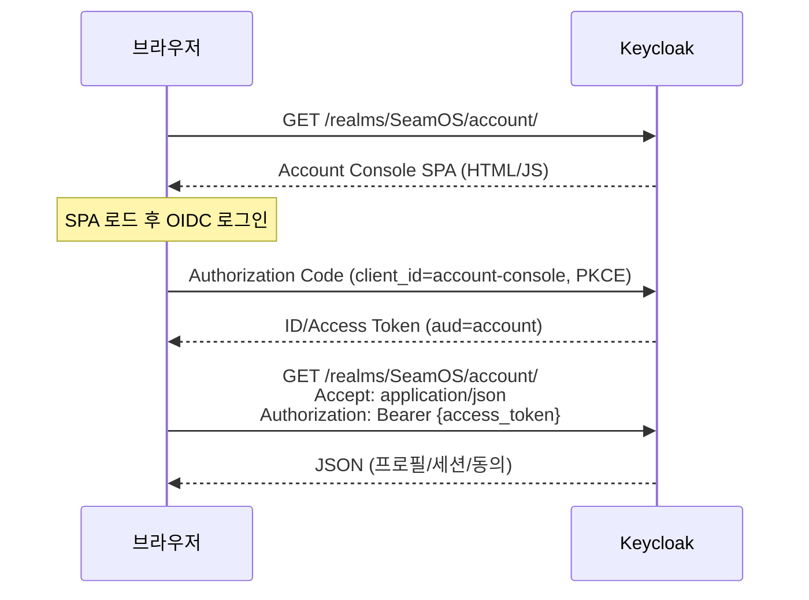

# Client와 Service Account

::: info 학습 목표
- OAuth의 Client 개념을 Keycloak 설정에 1:1로 매핑할 수 있다.
- Access Type 3종(Confidential/Public/Bearer-only)의 차이와 선택 기준을 설명한다.
- Client Authenticator 4종(Secret/Signed JWT/Signed JWT with secret/X.509)을 비교한다.
- Service Account를 사용한 Client Credentials Flow를 구성할 수 있다.
:::

## 1. Client란

OAuth의 <strong>Client</strong>는 "사용자를 대신해 리소스에 접근하려는 애플리케이션"이다. [OAuth 스터디 CH5. 역할과 용어](/study/oauth/05-roles-and-terms)에서 정리한 그 개념 그대로다.

Keycloak 관점에서 Client는 Realm 안에 등록된 <strong>앱 레코드</strong>다. Client ID, Secret(있는 경우), Redirect URI, 발급 가능한 토큰 종류, 사용할 수 있는 Flow가 이 레코드의 필드로 표현된다.

### Client가 필요한 이유

- Keycloak이 누가 토큰을 요청했는지 식별해야 한다(Client ID).
- 토큰을 받을 자격이 있는지 검증해야 한다(Secret/JWT/mTLS).
- 허용된 Redirect URI로만 인가 코드를 돌려준다.
- Client별로 Role Mapping·Scope·Flow를 다르게 적용한다.

### Keycloak에서의 최소 등록



- 최소값: Client type(OIDC/SAML), Client ID, Redirect URI.
- Client authentication 토글 + Flow 토글로 Access Type과 허용 Flow가 결정된다.

## 2. Access Type

Keycloak의 Access Type은 "이 Client가 시크릿을 보관할 수 있는가"에 대한 답이다.

### 3가지 타입

::: info 신·구 UI 매핑
Keycloak 19+ Admin Console에서는 "Access Type" 드롭다운이 제거되고 "Client authentication"·"Authorization" 토글과 "Capability config"(Flow 토글)로 재구성됐다. 아래 표의 "Access Type"은 개념적 분류이며, 실제 UI에서는 다음과 같이 매핑된다.

- Confidential = Client authentication ON
- Public = Client authentication OFF
- Bearer-only = (신 UI 미지원, 레거시 데이터만 존재)
:::

| Access Type | Client authentication | 대표 예 | 받을 수 있는 토큰 |
|-------------|----------------------|---------|-------------------|
| Confidential | ON | 백엔드 서버, 내부 서비스 | ID Token, Access Token, Refresh Token |
| Public | OFF | SPA, 모바일 앱 | ID Token, Access Token(PKCE), Refresh Token |
| Bearer-only | (신 UI 미지원) | Resource Server | (토큰 발급 없음, 검증 전용) |

### Confidential

- 시크릿(또는 JWT/mTLS)으로 자기 증명이 가능하다.
- Authorization Code Flow·Client Credentials Flow 모두 사용.
- 서버 측 앱이 대표 사례. 시크릿 누출 위험이 없는 환경에 둔다.

### Public

- 시크릿을 안전히 보관할 수 없는 환경(브라우저·모바일).
- <strong>PKCE 필수</strong>. [OAuth CH6. Authorization Code Flow](/study/oauth/06-authorization-code-flow)에서 다룬 PKCE를 Keycloak은 S256으로 강제하는 것이 기본이다.
- Client Credentials Flow 불가.

### Bearer-only (신규 UI에서 제거됨)

- "나는 토큰을 받지 않고 검증만 한다"는 Resource Server용.
- Admin Console v19+에서 신규 Client 생성 UI에서는 이 타입을 선택할 수 없다. 기존에 설정된 Bearer-only Client는 계속 동작하지만, 최신 설계에서는 Client를 생성하지 않고 Resource Server가 JWKS로 직접 서명 검증하는 패턴이 권장된다.
- 기존에 등록돼 있다면 단순 Confidential로 전환해도 대부분 동작한다.

### 선택 가이드



## 3. Client Authenticator

Confidential Client가 자기 자신을 Keycloak에 증명하는 방법은 4가지가 있다.

### 4가지 Authenticator

| Authenticator | 원리 | 장점 | 단점 |
|---------------|------|------|------|
| Client Id and Secret | 정적 시크릿(HTTP Basic 또는 폼) | 구현 단순 | 시크릿 유출 시 즉시 무력화 |
| Signed JWT | 비대칭 키(RS256/ES256) JWT | Private Key 미공유, 표준 OIDC | Client가 Private Key 보관 필요 |
| Signed JWT with Client Secret | 대칭 키(HS256) JWT | Client Secret을 HMAC 키로 JWT 서명 | 시크릿 공유 여전히 존재 |
| X.509 (mTLS) | 클라이언트 인증서 | 최고 수준 보증, FAPI 적합 | 인증서 배포·갱신 체계 필요 |

### Signed JWT 설정 흐름

Signed JWT는 Client가 <strong>RSA/EC 키 쌍</strong>을 생성하고, 공개키(또는 JWKS URL)를 Keycloak에 등록한다. 인증 시 Client가 프라이빗 키로 서명한 짧은 JWT를 `client_assertion`으로 전달한다.



### X.509 (mTLS)

금융권(FAPI) 요구에서 자주 등장한다. 앞단 Reverse Proxy에서 mTLS를 종료하고, 클라이언트 인증서 지문을 Keycloak이 헤더로 받아 검증하거나, Keycloak이 직접 mTLS를 처리할 수도 있다. 운영 복잡도가 높아 내부 표준 인증서 체계가 있는 조직에서 선택한다.

### 시크릿 로테이션

어떤 Authenticator를 쓰든 시크릿·키는 주기적으로 교체해야 한다.

- Admin Console → Clients → 해당 Client → Credentials 탭에서 `Regenerate secret`.
- 로테이션 중 무중단을 지원하려면 Client Policies의 Secret Rotation 관련 프로파일을 활성화하거나, Admin REST API로 수동 regenerate 후 구 시크릿 유예 기간을 두는 방식을 쓴다.
- 자동화는 Admin REST API(CH22)와 CI/CD로 구성한다.

## 4. Service Account

Service Account는 "Client 자체가 사용자 없이 토큰을 받는" 메커니즘이다. [Client Credentials Flow](/study/oauth/07-other-grant-types)의 Keycloak 구현이다.

### 활성화 방법

1. Client는 반드시 Confidential이어야 한다(시크릿 필수).
2. Client 상세 → Capability config → "Service accounts roles" 토글 ON.
3. 해당 Client 메뉴에 "Service accounts roles" 탭이 나타난다. Role을 부여.

### 토큰 요청

```http
POST /realms/myshop/protocol/openid-connect/token HTTP/1.1
Host: auth.example.com
Content-Type: application/x-www-form-urlencoded

grant_type=client_credentials
&client_id=batch-worker
&client_secret=s3cr3t-from-keycloak
```

응답은 Access Token만. Refresh Token은 없다(없어야 맞다).

### 흐름



### 토큰 안 sub/preferred_username

Service Account로 발급된 토큰은 특수한 사용자로 표현된다.

- `sub`: Realm 안의 숨김 사용자 UUID
- `preferred_username`: `service-account-<client-id>`
- `client_id`: Client ID

이 숨김 사용자는 User 목록에도 나타난다("Service Account User"). 여기에 Role을 직접 부여하는 것도 가능하지만, 일관성을 위해 Client의 "Service accounts roles" 탭을 통해 부여하는 것이 권장된다.

### Spring Boot 예시

```yaml
spring:
  security:
    oauth2:
      client:
        provider:
          keycloak:
            token-uri: https://auth.example.com/realms/myshop/protocol/openid-connect/token
        registration:
          keycloak:
            client-id: batch-worker
            client-secret: ${KC_CLIENT_SECRET}
            authorization-grant-type: client_credentials
            scope: profile
```

## 5. Redirect URI 패턴

Authorization Code Flow에서 Redirect URI는 <strong>공격 표면</strong>이다. 잘못된 URI가 허용되면 Authorization Code가 탈취될 수 있다.

### Keycloak의 Redirect URI 규칙

- `Valid redirect URIs`에 등록된 값에 완전 일치해야 한다.
- 와일드카드 `*`가 허용되지만 <strong>권장하지 않는다</strong>.
- 예외적으로 `http://localhost:*`은 로컬 개발에서 포트가 바뀔 때 유용.

### 허용된 vs 위험한 패턴

| 패턴 | 안전한가 |
|------|---------|
| `https://app.example.com/auth/callback` | 안전. 완전 일치 권장 |
| `https://app.example.com/*` | 위험. 내부 경로 어디로든 유도 가능 |
| `https://*.example.com/callback` | 위험. 서브도메인 탈취 위험 |
| `*` | 매우 위험. 임의 URL로 코드 전달 가능 |
| `custom-scheme://callback` | OK. 모바일 앱 커스텀 스킴 |

### 왜 중요한가

이 주제는 [OAuth CH15. 공격과 방어](/study/oauth/15-attacks)에서 Covert Redirect, Open Redirect 공격으로 상세히 다룬다. Keycloak이 완전일치를 권장하는 이유가 바로 그 공격 벡터를 막기 위함이다.

### Web Origins

SPA가 직접 토큰 엔드포인트를 호출하려면 <strong>Web Origins</strong>도 등록해야 한다. 이는 CORS 응답 헤더를 위한 허용 목록이다. Redirect URI와는 독립된 개념이다.

- `Web Origins: https://app.example.com` → Keycloak이 해당 오리진에 대해 CORS 헤더 반환
- `+`를 넣으면 "Valid redirect URIs에서 오리진 자동 도출"을 의미

## 6. Capability 토글

Client 상세의 "Capability config" 섹션은 이 Client가 허용할 Flow와 기능을 토글한다.

### 주요 토글

| 토글 | 활성 시 허용 |
|------|-------------|
| Standard flow | Authorization Code Flow (가장 일반) |
| Direct access grants | Resource Owner Password Credentials Flow (지양) |
| Implicit flow | Implicit Flow (deprecated, 사용 금지) |
| Service accounts roles | Client Credentials Flow |
| OAuth 2.0 Device Authorization Grant | 스마트 TV·CLI용 Device Flow |
| OIDC CIBA Grant | Client-Initiated Backchannel Authentication |
| Authorization | Keycloak Authorization Services (UMA, CH8) |

### 권장 기본값

```yaml
# SPA (Public Client)
Standard flow: ON
Direct access grants: OFF
Implicit flow: OFF
Service accounts roles: OFF (시크릿 없어서 애초에 불가)

# 백엔드 서비스 (Confidential Client)
Standard flow: ON (사용자 로그인 제공 시)
Direct access grants: OFF
Implicit flow: OFF
Service accounts roles: ON (서버 간 호출 필요 시)

# 배치 전용 Client
Standard flow: OFF
Service accounts roles: ON
나머지 OFF
```

### 권장 비활성

- <strong>Direct access grants</strong>: "아이디/비밀번호를 Client가 받아 Keycloak에 중계"하는 Flow. 사용자의 자격을 Client가 본다는 점에서 구조적으로 지양된다. 반드시 써야 하는 경우(레거시 CLI) 외엔 끈다.
- <strong>Implicit flow</strong>: 브라우저 URL fragment로 Access Token을 직접 전달. PKCE 미지원 당시 SPA 대안이었지만 현재는 사용 금지. OAuth 2.1에서 공식 퇴출.

### Advanced 탭의 주의 옵션

- <strong>Consent required</strong>: 사용자가 Client에게 Scope 동의하는 화면을 띄울지. 내부 Client는 끈다. 서드파티 Client는 켠다.
- <strong>Front channel logout</strong> / <strong>Back channel logout URL</strong>: SSO 로그아웃 시 이 Client에도 알림 전달. Single Logout 구현에 필수.
- <strong>Access Token Lifespan</strong>: 이 Client만 Realm 기본값 오버라이드.

### 설정 요약 스크린 설명

Admin Console의 Client 상세는 상단에 탭이 늘어선다. 순서대로 이해하면 빠르다.

1. <strong>Settings</strong>: 위 설명한 Access Type·Capability·Redirect URI·Web Origins.
2. <strong>Keys</strong>: Signed JWT Authenticator용 공개키 등록.
3. <strong>Credentials</strong>: Client Secret 관리·Regenerate.
4. <strong>Roles</strong>: 이 Client에 귀속된 Client Role 정의(CH6).
5. <strong>Client scopes</strong>: 기본/선택 스코프 매핑(CH7).
6. <strong>Sessions</strong>: 이 Client의 활성 세션.
7. <strong>Advanced</strong>: Consent·Logout·Lifespan 오버라이드.
8. <strong>Authorization</strong>: Authorization Services 켠 경우에만 표시(CH8).

## 7. 새 Client 만들 때의 토글 선택 가이드

Client 생성 마법사(Create client)의 "Capability config" 단계에서 토글을 고르는 현실적 기준을 정리한다. 항목 이름이 비슷해서 헷갈리는 <strong>Client authentication</strong>과 <strong>Authorization</strong>을 특히 구분해야 한다.

### Client authentication — 시크릿 보관 가능하면 ON

"이 Client가 자기 자신을 시크릿/JWT/mTLS로 증명할 수 있는가"를 결정한다.

- <strong>ON = Confidential</strong> — 백엔드 서버 앱. 토큰 엔드포인트 호출 시 `client_secret` 첨부
- <strong>OFF = Public</strong> — SPA·모바일. 시크릿을 브라우저·앱 번들에 둘 수 없어 PKCE로 대체

서버 애플리케이션(예: SDM server 같은 백엔드)은 시크릿을 환경변수·Secret Manager에 둘 수 있으므로 <strong>ON이 기본</strong>이다. 시크릿 없이 client_id만으로 토큰을 받으면 누구나 같은 client_id로 토큰을 받을 수 있어 인가 보증이 무너진다.

### Authorization — UMA·정책 엔진 안 쓸 거면 OFF

이 토글은 [Keycloak Authorization Services(UMA 2.0)](/study/keycloak/08-authz-uma)를 이 Client에 붙일지 묻는 옵션이다. 켜면 Client 상세에 `Authorization` 탭이 추가되어 Resource·Scope·Policy·Permission을 Keycloak 정책 엔진에서 관리하게 된다.

이름만 보면 "인가니까 당연히 켜야지"라고 오해하기 쉬운데, 여기서 말하는 Authorization은 <strong>OAuth의 인가(로그인·토큰 발급)가 아니다</strong>. Keycloak 고유의 <strong>리소스 기반 미세 권한 정책 엔진</strong>이다. 대부분의 앱은 JWT의 `realm_access.roles`나 scope를 백엔드에서 읽어 인가를 처리하고, 세밀한 정책이 필요해지면 [SpiceDB](/study/spicedb/)·OPA 같은 별도 엔진을 쓴다.

- 일반적인 로그인·API 인가라면 <strong>OFF</strong>
- Keycloak을 PDP(Policy Decision Point)로 쓰려고 설계했거나 UMA permission ticket이 필요할 때만 ON
- 일단 OFF로 시작해도 나중에 켤 수 있고, 켰다가 꺼도 정책은 남아 있다

### SDM server 같은 "서버 앱 + 사용자 로그인" 권장 세팅

| 토글 | 설정 | 이유 |
|------|------|------|
| Client authentication | ON | Confidential |
| Authorization | OFF | UMA 안 쓰면 OFF |
| Standard flow | ON | Authorization Code Flow로 사용자 로그인 |
| Direct access grants | OFF | 비밀번호 중계 플로우 지양 |
| Implicit flow | OFF | Deprecated |
| Service accounts roles | 필요 시 ON | M2M 호출·배치가 있을 때만 |
| OAuth 2.0 Device Authorization | OFF | 스마트 TV·CLI가 아니면 불필요 |
| OIDC CIBA Grant | OFF | 뱅킹 백채널 인증이 아니면 불필요 |

Authenticator는 시작은 `Client Id and Secret`으로 충분하고, 운영 안정되면 `Signed JWT`(비대칭 키)로 올리면 보안이 한 단계 높아진다. 상세는 앞 [§ 3. Client Authenticator](#_3-client-authenticator).

### Service accounts roles 토글 — 정확한 의미

이름이 모호해 헷갈리지만, 정확히는 <strong>이 Client에게 "사용자 없이 자기 자신의 이름으로 토큰을 받을 권한"을 줄지</strong>를 정하는 스위치다. 즉 [Client Credentials Flow](#_4-service-account) 활성화 토글.

켜는 순간 Keycloak은 세 가지를 자동으로 수행한다.

<strong>1. Service Account User 자동 생성</strong>

- Users 목록에 `service-account-{client-id}` 라는 숨김 사용자가 생성됨 (예: `service-account-sdm-server`)
- 비밀번호 없음, 로그인 불가. 오직 이 Client가 `client_credentials` grant로 토큰 받을 때의 `sub`으로만 쓰임

<strong>2. "Service accounts roles" 탭이 Client 상세에 추가됨</strong>

여기서 이 service account user에게 Role을 부여한다.

- Realm Role 매핑 — 자체 Realm Role
- Client Role 매핑 — 다른 Client(특히 `realm-management`, `account`)가 정의한 Role
- 자주 쓰는 패턴: `realm-management`의 `manage-users`, `view-clients`를 매핑해 이 Client가 Admin REST API를 호출할 수 있게 함

<strong>3. `grant_type=client_credentials` 요청이 허용됨</strong>

```http
POST /realms/SeamOS/protocol/openid-connect/token
Content-Type: application/x-www-form-urlencoded

grant_type=client_credentials
&client_id=sdm-server
&client_secret=s3cr3t
```

응답은 Access Token만, Refresh Token은 없다(시스템 계정은 영구 세션을 만들지 않음).

토큰 페이로드가 일반 사용자와 구분된다.

```json
{
  "sub": "7f2a...",
  "preferred_username": "service-account-sdm-server",
  "client_id": "sdm-server",
  "typ": "Bearer",
  "realm_access": { "roles": ["manage-users", "view-clients"] }
}
```

백엔드에서 `preferred_username`의 `service-account-` 접두어 또는 `client_id` 클레임으로 "기계 호출"임을 구분할 수 있다.

<strong>언제 켜고 끄나</strong>

- 끈다(기본) — 사용자 로그인만 받는 일반 웹/서버 앱. 토큰 주체는 언제나 사람
- 켠다 — 사용자 없이 백엔드끼리 API 호출이 필요할 때(M2M): 배치 Job, Cron, 이벤트 기반 서버 간 통신, SDM server가 관리 API로 사용자 자동 생성 같은 로직
- 같은 Client가 로그인과 배치를 동시에 처리해도 되지만, 보안 관점에서는 <strong>용도별로 Client를 분리</strong>하는 편이 안전하다. 예: 로그인용 `sdm-server` + 배치용 `sdm-batch`
- Public Client에서는 토글이 비활성화(회색). 시크릿이 없어 client_credentials grant 자체가 불가능하기 때문



## 8. Clients 탭의 세 하위 영역

Admin Console의 <strong>Clients</strong> 메뉴 상단에는 세 개의 서브 탭이 있다. 용도가 완전히 다르니 먼저 구분부터 한다.

### Client List

가장 자주 쓰는 화면. Realm에 등록된 모든 OIDC/SAML Client의 목록이다.

- 각 row: Client ID, Client type(OpenID Connect/SAML), Enabled 여부, Access Type
- 검색·정렬·상세 진입·신규 Create·일괄 삭제
- 여기서 만든 Client는 <strong>Admin이 직접 등록</strong>한 것이다

반면 아래 두 탭은 Client를 <strong>외부에서 자동으로 등록(Dynamic Client Registration, DCR)</strong>할 수 있게 여는 메커니즘이다.

### Initial Access Token (IAT)

외부 시스템·사용자가 <strong>Keycloak에 Client를 자가 등록하기 위한 일회성 티켓</strong>이다. [OIDC Dynamic Client Registration(RFC 7591)](https://datatracker.ietf.org/doc/html/rfc7591)을 위한 인증 수단.

- 왜 필요한가 — Admin 계정을 외부에 줄 수 없으니, "이 토큰을 가진 주체는 최대 N번, N일 동안 Client를 등록할 수 있다"는 제한된 권한을 미리 발급한다.
- 생성: Clients → Initial access token 탭 → Create. `Expiration`(유효기간), `Count`(허용 등록 횟수) 지정. 생성 직후 표시되는 토큰 문자열을 <strong>반드시 복사</strong>한다(재조회 불가).



등록이 성공하면 <strong>Registration Access Token(RAT)</strong>이 반환된다. 해당 Client만 관리할 수 있는 별도 토큰으로, 이후 redirect URI 변경·삭제 등은 RAT로 수행한다(Admin 권한 없이).

### Client Registration

IAT로 들어온 등록 요청을 <strong>어떻게 검증할지</strong> 정의하는 정책(Policy)과 엔드포인트 설정 영역이다.

두 가지 모드가 있다.

- <strong>Anonymous Access</strong> — IAT 없이 누구나 등록 요청 가능. 공개 DCR 엔드포인트. 기본 정책이 실질적으로 아무것도 못 하게 막아놨다.
- <strong>Authenticated Access</strong> — IAT 또는 Bearer 토큰이 있어야 등록 가능. 실무의 기본.

주요 Registration Policy:

| Policy | 역할 |
|--------|------|
| Trusted Hosts | 특정 호스트·IP에서만 등록 허용 |
| Consent Required | 등록된 Client는 무조건 consent 요구 |
| Protocol Mappers | 허용된 Protocol Mapper만 사용 |
| Client Scope | 허용된 scope만 사용 |
| Max Clients | Realm당 최대 Client 개수 제한 |
| Allowed Client Templates | 허용된 Client Template만 사용 |
| Allowed Signature Algorithm | Signed JWT 허용 알고리즘 |
| Client Disabled | 등록 직후 비활성 상태 생성 (Admin 승인 필요) |

엔드포인트 3종:

- `/realms/{r}/clients-registrations/default` — Keycloak 전용 JSON 포맷
- `/realms/{r}/clients-registrations/openid-connect` — OIDC DCR 표준
- `/realms/{r}/clients-registrations/saml2-entity-descriptor` — SAML Entity Descriptor

언제 쓰나 — 멀티테넌트 SaaS에서 테넌트마다 Client 자동 프로비저닝, 개발자 포털에서 앱 개발자 셀프 등록, IoT 디바이스 대량 온보딩.

::: warning Anonymous 등록을 열 때
최소한 `Trusted Hosts` + `Client Disabled`를 걸어 "아무나 등록은 가능하지만 관리자 승인 전엔 작동 안 함"으로 둬야 한다.
:::

## 9. Realm 생성 시 자동 생성되는 Built-in Client

Keycloak은 Realm을 새로 만들면 Admin이 아무 작업을 하지 않아도 <strong>6개의 Built-in Client를 자동 생성</strong>한다. 삭제하면 Admin Console·Account Console이 먹통이 되니 건드리지 말 것.

| Client ID | 역할 |
|-----------|------|
| `account` | 사용자 셀프 서비스 Account Console의 <strong>백엔드 API</strong>. 프로필·세션·동의 조회·수정 |
| `account-console` | Account Console <strong>프런트 SPA</strong>. `account` API를 호출 |
| `admin-cli` | `kcadm.sh` CLI와 Admin REST API를 Direct Grant로 호출하기 위한 Client. Direct access grants가 기본 ON |
| `broker` | Identity Brokering(외부 IdP 연동, [CH14](/study/keycloak/14-identity-brokering)) 내부 토큰 교환용 |
| `realm-management` | 이 Realm의 관리 권한을 담은 <strong>특수 Client</strong>. `realm-admin`·`manage-users`·`view-clients` 같은 Role이 이 Client 소속. 사용자에게 관리 권한을 줄 때 이 Client의 Role을 매핑 |
| `security-admin-console` | Admin Console SPA 자체 (`/admin/{realm}/console`) |

그리고 master Realm에는 추가로:

| Client ID | 역할 |
|-----------|------|
| `{realmname}-realm` | master에 있는 "다른 Realm을 관리하기 위한 Client". master Admin이 해당 Realm을 관리할 수 있도록 그 Realm의 관리 Role이 여기 복제됨 |

즉 `SeamOS` Realm을 만들면 master에 `SeamOS-realm` Client가 같이 생긴다.

::: warning 건드리면 안 되는 것
- 위 Client를 <strong>삭제</strong>하면 Admin Console·Account Console 접근이 끊긴다
- `admin-cli`의 Direct access grants를 끄면 CLI 자동화가 깨진다
- `realm-management`의 Role 정의를 직접 수정하지 말고, 사용자·그룹에 <strong>매핑만</strong> 해서 쓴다
- `account` Client의 redirect URI를 제거하면 사용자 비밀번호 변경이 막힐 수 있다
:::

## 10. Account Console 동작 구조

사용자에게 제공되는 셀프 서비스 화면, 예를 들면 `https://dev.auth.seamos.io/realms/SeamOS/account/` 같은 URL은 <strong>두 Built-in Client가 함께</strong> 작동한 결과다.

| 역할 | Client |
|------|--------|
| 프런트엔드 SPA — 브라우저에 로드되는 화면 자체 | `account-console` (Public, PKCE) |
| 백엔드 API — 프로필 조회/비밀번호 변경/세션 조회 | `account` (audience 역할) |

실제 요청 흐름은 이렇다.



같은 `/realms/SeamOS/account/` 경로인데 <strong>Accept 헤더로 HTML(SPA)과 JSON(API)을 구분</strong>한다.

- `Accept: text/html` → Account Console SPA 서빙
- `Accept: application/json` → `account` Client audience 토큰으로 인증된 REST API

정리하면:

- URL 경로 자체는 Keycloak 서버의 Account Service 엔드포인트
- 여기서 서빙되는 SPA의 OIDC `client_id`는 <strong>`account-console`</strong>
- SPA가 호출하는 백엔드 API가 요구하는 audience는 <strong>`account`</strong>
- Realm 생성 시 자동 생성되므로 사용자가 바로 자신의 프로필을 관리할 수 있다

커스텀 테마를 적용하려면 Realm → Themes → `Account theme`에서 변경한다. 테마 커스터마이징은 [CH18. Theme 커스터마이징](/study/keycloak/18-theme)에서 다룬다.

::: tip 핵심 정리
- Client는 Realm 안의 앱 레코드이며, Access Type은 "시크릿을 안전히 보관할 수 있는가"가 결정한다.
- Confidential은 백엔드, Public은 SPA·모바일(PKCE 필수), Bearer-only는 신 UI에서 제거됐다.
- Client Authenticator는 Secret < Signed JWT < mTLS 순으로 보안이 올라가고, 금융권은 mTLS가 표준이다.
- Service Account는 Client Credentials Flow를 위한 토글이며, `preferred_username=service-account-<client>`로 토큰에 실린다.
- Redirect URI는 완전 일치를 권장하고, Web Origins는 CORS 별도 허용 목록이다.
- Capability 토글에서 Direct access grants와 Implicit flow는 기본 OFF가 안전하다.
- Client authentication은 서버 앱이면 ON(Confidential), Authorization은 UMA·정책 엔진을 따로 안 쓰면 OFF가 기본이다.
- Service accounts roles는 "이 Client에게 사용자 없이 자기 이름으로 토큰 받을 권한 부여"이며, 토글 ON 시 `service-account-{client-id}` 숨김 사용자가 자동 생성된다.
- Clients 탭은 목록·IAT(Dynamic 등록 티켓)·Registration Policy 세 영역으로 나뉘며, IAT + RAT 조합으로 외부 자가 등록을 안전하게 연다.
- Realm 생성 시 6개 Built-in Client(`account`/`account-console`/`admin-cli`/`broker`/`realm-management`/`security-admin-console`)가 자동 생성되고, Account Console은 `account-console`(SPA) + `account`(API audience)의 페어로 동작한다.
:::

## 다음 챕터

- 이전 : [Realm과 Organizations](/study/keycloak/03-realm-organizations)
- 다음 : [사용자와 자격 증명](/study/keycloak/05-user-credentials)
