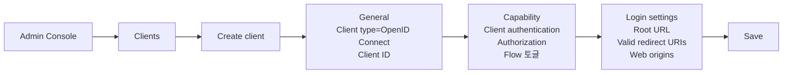
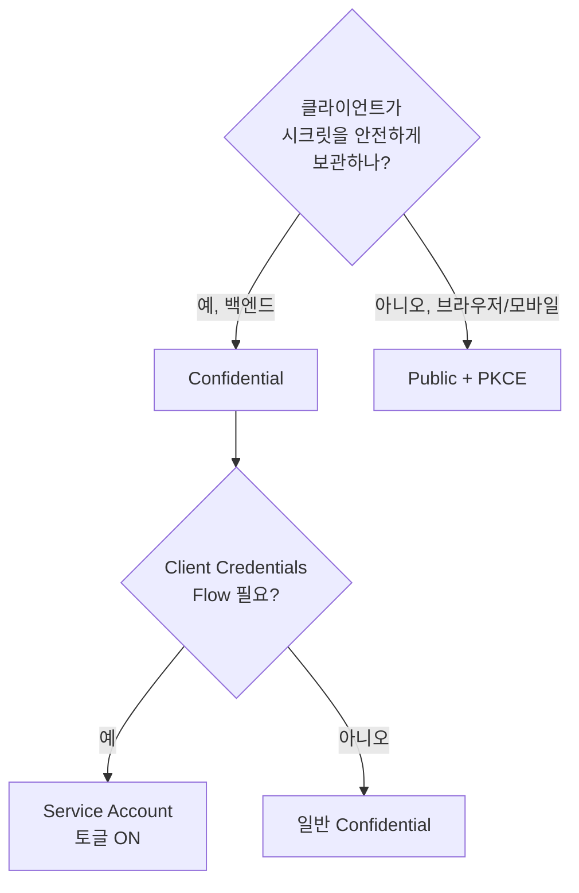
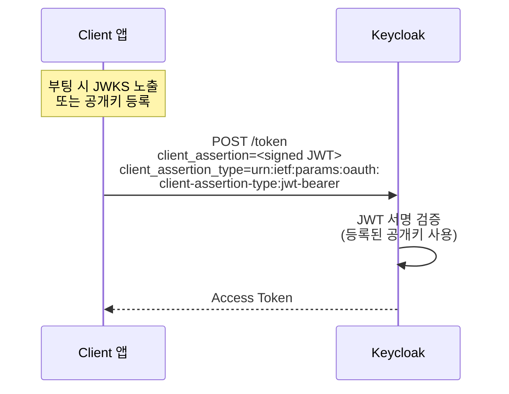
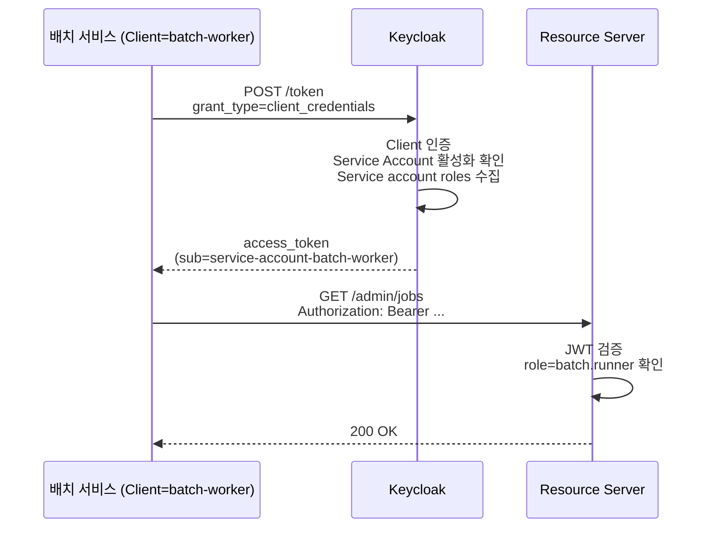

# Client와 Service Account

::: info 학습 목표
- OAuth의 Client 개념을 Keycloak 설정에 1:1로 매핑할 수 있다.
- Access Type 3종(Confidential/Public/Bearer-only)의 차이와 선택 기준을 설명한다.
- Client Authenticator 4종(Secret/Signed JWT/Signed JWT with secret/X.509)을 비교한다.
- Service Account를 사용한 Client Credentials Flow를 구성할 수 있다.
:::

---

## 1. Client란

OAuth의 <strong>Client</strong>는 "사용자를 대신해 리소스에 접근하려는 애플리케이션"이다. [OAuth 스터디 CH5. 역할과 용어](/study/oauth/05-roles-and-terms)에서 정리한 그 개념 그대로다.

Keycloak 관점에서 Client는 Realm 안에 등록된 <strong>앱 레코드</strong>다. Client ID, Secret(있는 경우), Redirect URI, 발급 가능한 토큰 종류, 사용할 수 있는 Flow가 이 레코드의 필드로 표현된다.

### Client가 필요한 이유

- Keycloak이 누가 토큰을 요청했는지 식별해야 한다(Client ID).
- 토큰을 받을 자격이 있는지 검증해야 한다(Secret/JWT/mTLS).
- 허용된 Redirect URI로만 인가 코드를 돌려준다.
- Client별로 Role Mapping·Scope·Flow를 다르게 적용한다.

### Keycloak에서의 최소 등록



- 최소값: Client type(OIDC/SAML), Client ID, Redirect URI.
- Client authentication 토글 + Flow 토글로 Access Type과 허용 Flow가 결정된다.

---

## 2. Access Type

Keycloak의 Access Type은 "이 Client가 시크릿을 보관할 수 있는가"에 대한 답이다.

### 3가지 타입

| Access Type | Client authentication | 대표 예 | 받을 수 있는 토큰 |
|-------------|----------------------|---------|-------------------|
| Confidential | ON | 백엔드 서버, 내부 서비스 | ID Token, Access Token, Refresh Token |
| Public | OFF | SPA, 모바일 앱 | ID Token, Access Token(PKCE), Refresh Token |
| Bearer-only | (deprecated) | Resource Server | (토큰 발급 없음, 검증 전용) |

### Confidential

- 시크릿(또는 JWT/mTLS)으로 자기 증명이 가능하다.
- Authorization Code Flow·Client Credentials Flow 모두 사용.
- 서버 측 앱이 대표 사례. 시크릿 누출 위험이 없는 환경에 둔다.

### Public

- 시크릿을 안전히 보관할 수 없는 환경(브라우저·모바일).
- <strong>PKCE 필수</strong>. [OAuth CH6. Authorization Code Flow](/study/oauth/06-authorization-code-flow)에서 다룬 PKCE를 Keycloak은 S256으로 강제하는 것이 기본이다.
- Client Credentials Flow 불가.

### Bearer-only (deprecated)

- "나는 토큰을 받지 않고 검증만 한다"는 Resource Server용.
- 더 이상 권장되지 않는다. 모든 Resource Server는 Keycloak 없이도 JWT 서명을 직접 검증할 수 있으므로 별도의 Client 등록이 필요하지 않다.
- 기존에 등록돼 있다면 단순 Confidential로 전환해도 대부분 동작한다.

### 선택 가이드



---

## 3. Client Authenticator

Confidential Client가 자기 자신을 Keycloak에 증명하는 방법은 4가지가 있다.

### 4가지 Authenticator

| Authenticator | 원리 | 장점 | 단점 |
|---------------|------|------|------|
| Client Id and Secret | 정적 시크릿(HTTP Basic 또는 폼) | 구현 단순 | 시크릿 유출 시 즉시 무력화 |
| Signed JWT | Client가 자체 키로 서명한 JWT | 키가 서버를 떠나지 않음, 단명 JWT | 키 쌍 관리 필요 |
| Signed JWT with Client Secret | HMAC JWT (공유 시크릿 기반) | 공유 시크릿으로 JWT 전환 가능 | 여전히 시크릿 공유 |
| X.509 (mTLS) | 클라이언트 인증서 | 최고 수준 보증, FAPI 적합 | 인증서 배포·갱신 체계 필요 |

### Signed JWT 설정 흐름

Signed JWT는 Client가 <strong>RSA/EC 키 쌍</strong>을 생성하고, 공개키(또는 JWKS URL)를 Keycloak에 등록한다. 인증 시 Client가 프라이빗 키로 서명한 짧은 JWT를 `client_assertion`으로 전달한다.



### X.509 (mTLS)

금융권(FAPI) 요구에서 자주 등장한다. 앞단 Reverse Proxy에서 mTLS를 종료하고, 클라이언트 인증서 지문을 Keycloak이 헤더로 받아 검증하거나, Keycloak이 직접 mTLS를 처리할 수도 있다. 운영 복잡도가 높아 내부 표준 인증서 체계가 있는 조직에서 선택한다.

### 시크릿 로테이션

어떤 Authenticator를 쓰든 시크릿·키는 주기적으로 교체해야 한다.

- Admin Console → Clients → 해당 Client → Credentials 탭에서 `Regenerate secret`.
- 로테이션 중 무중단을 지원하려면 "Client Rotation" 정책을 활성화한다(구 Client Secret이 짧은 유예 기간 동안 유효).
- 자동화는 Admin REST API(CH23)와 CI/CD로 구성한다.

---

## 4. Service Account

Service Account는 "Client 자체가 사용자 없이 토큰을 받는" 메커니즘이다. [Client Credentials Flow](/study/oauth/06-authorization-code-flow)의 Keycloak 구현이다.

### 활성화 방법

1. Client는 반드시 Confidential이어야 한다(시크릿 필수).
2. Client 상세 → Capability config → "Service accounts roles" 토글 ON.
3. 해당 Client 메뉴에 "Service account roles" 탭이 나타난다. Role을 부여.

### 토큰 요청

```http
POST /realms/myshop/protocol/openid-connect/token HTTP/1.1
Host: auth.example.com
Content-Type: application/x-www-form-urlencoded

grant_type=client_credentials
&client_id=batch-worker
&client_secret=s3cr3t-from-keycloak
```

응답은 Access Token만. Refresh Token은 없다(없어야 맞다).

### 흐름



### 토큰 안 sub/preferred_username

Service Account로 발급된 토큰은 특수한 사용자로 표현된다.

- `sub`: Realm 안의 숨김 사용자 UUID
- `preferred_username`: `service-account-<client-id>`
- `client_id`: Client ID

이 숨김 사용자는 User 목록에도 나타난다("Service Account User"). 여기에 Role을 직접 부여하는 것도 가능하지만, 일관성을 위해 Client의 "Service account roles" 탭을 통해 부여하는 것이 권장된다.

### Spring Boot 예시

```yaml
spring:
  security:
    oauth2:
      client:
        provider:
          keycloak:
            token-uri: https://auth.example.com/realms/myshop/protocol/openid-connect/token
        registration:
          keycloak:
            client-id: batch-worker
            client-secret: ${KC_CLIENT_SECRET}
            authorization-grant-type: client_credentials
            scope: profile
```

---

## 5. Redirect URI 패턴

Authorization Code Flow에서 Redirect URI는 <strong>공격 표면</strong>이다. 잘못된 URI가 허용되면 Authorization Code가 탈취될 수 있다.

### Keycloak의 Redirect URI 규칙

- `Valid redirect URIs`에 등록된 값에 완전 일치해야 한다.
- 와일드카드 `*`가 허용되지만 <strong>권장하지 않는다</strong>.
- 예외적으로 `http://localhost:*`은 로컬 개발에서 포트가 바뀔 때 유용.

### 허용된 vs 위험한 패턴

| 패턴 | 안전한가 |
|------|---------|
| `https://app.example.com/auth/callback` | 안전. 완전 일치 권장 |
| `https://app.example.com/*` | 위험. 내부 경로 어디로든 유도 가능 |
| `https://*.example.com/callback` | 위험. 서브도메인 탈취 위험 |
| `*` | 매우 위험. 임의 URL로 코드 전달 가능 |
| `custom-scheme://callback` | OK. 모바일 앱 커스텀 스킴 |

### 왜 중요한가

이 주제는 [OAuth CH15. 공격과 방어](/study/oauth/15-attacks)에서 Covert Redirect, Open Redirect 공격으로 상세히 다룬다. Keycloak이 완전일치를 권장하는 이유가 바로 그 공격 벡터를 막기 위함이다.

### Web Origins

SPA가 직접 토큰 엔드포인트를 호출하려면 <strong>Web Origins</strong>도 등록해야 한다. 이는 CORS 응답 헤더를 위한 허용 목록이다. Redirect URI와는 독립된 개념이다.

- `Web Origins: https://app.example.com` → Keycloak이 해당 오리진에 대해 CORS 헤더 반환
- `+`를 넣으면 "Valid redirect URIs에서 오리진 자동 도출"을 의미

---

## 6. Capability 토글

Client 상세의 "Capability config" 섹션은 이 Client가 허용할 Flow와 기능을 토글한다.

### 주요 토글

| 토글 | 활성 시 허용 |
|------|-------------|
| Standard flow | Authorization Code Flow (가장 일반) |
| Direct access grants | Resource Owner Password Credentials Flow (지양) |
| Implicit flow | Implicit Flow (deprecated, 사용 금지) |
| Service accounts roles | Client Credentials Flow |
| OAuth 2.0 Device Authorization Grant | 스마트 TV·CLI용 Device Flow |
| OIDC CIBA Grant | Client-Initiated Backchannel Authentication |
| Authorization | Keycloak Authorization Services (UMA, CH9) |

### 권장 기본값

```yaml
# SPA (Public Client)
Standard flow: ON
Direct access grants: OFF
Implicit flow: OFF
Service accounts roles: OFF (시크릿 없어서 애초에 불가)

# 백엔드 서비스 (Confidential Client)
Standard flow: ON (사용자 로그인 제공 시)
Direct access grants: OFF
Implicit flow: OFF
Service accounts roles: ON (서버 간 호출 필요 시)

# 배치 전용 Client
Standard flow: OFF
Service accounts roles: ON
나머지 OFF
```

### 권장 비활성

- <strong>Direct access grants</strong>: "아이디/비밀번호를 Client가 받아 Keycloak에 중계"하는 Flow. 사용자의 자격을 Client가 본다는 점에서 구조적으로 지양된다. 반드시 써야 하는 경우(레거시 CLI) 외엔 끈다.
- <strong>Implicit flow</strong>: 브라우저 URL fragment로 Access Token을 직접 전달. PKCE 미지원 당시 SPA 대안이었지만 현재는 사용 금지. OAuth 2.1에서 공식 퇴출.

### Advanced 탭의 주의 옵션

- <strong>Consent required</strong>: 사용자가 Client에게 Scope 동의하는 화면을 띄울지. 내부 Client는 끈다. 서드파티 Client는 켠다.
- <strong>Front channel logout</strong> / <strong>Back channel logout URL</strong>: SSO 로그아웃 시 이 Client에도 알림 전달. Single Logout 구현에 필수.
- <strong>Access Token Lifespan</strong>: 이 Client만 Realm 기본값 오버라이드.

### 설정 요약 스크린 설명

Admin Console의 Client 상세는 상단에 탭이 늘어선다. 순서대로 이해하면 빠르다.

1. <strong>Settings</strong>: 위 설명한 Access Type·Capability·Redirect URI·Web Origins.
2. <strong>Keys</strong>: Signed JWT Authenticator용 공개키 등록.
3. <strong>Credentials</strong>: Client Secret 관리·Regenerate.
4. <strong>Roles</strong>: 이 Client에 귀속된 Client Role 정의(CH7).
5. <strong>Client scopes</strong>: 기본/선택 스코프 매핑(CH8).
6. <strong>Sessions</strong>: 이 Client의 활성 세션.
7. <strong>Advanced</strong>: Consent·Logout·Lifespan 오버라이드.
8. <strong>Authorization</strong>: Authorization Services 켠 경우에만 표시(CH9).

---

::: tip 핵심 정리
- Client는 Realm 안의 앱 레코드이며, Access Type은 "시크릿을 안전히 보관할 수 있는가"가 결정한다.
- Confidential은 백엔드, Public은 SPA·모바일(PKCE 필수), Bearer-only는 사실상 deprecated.
- Client Authenticator는 Secret < Signed JWT < mTLS 순으로 보안이 올라가고, 금융권은 mTLS가 표준이다.
- Service Account는 Client Credentials Flow를 위한 토글이며, `preferred_username=service-account-<client>`로 토큰에 실린다.
- Redirect URI는 완전 일치를 권장하고, Web Origins는 CORS 별도 허용 목록이다.
- Capability 토글에서 Direct access grants와 Implicit flow는 기본 OFF가 안전하다.
:::

## 다음 챕터

- 이전 : [Realm과 Organizations](/study/keycloak/04-realm-organizations)
- 다음 : [사용자와 자격 증명](/study/keycloak/06-user-credentials)
