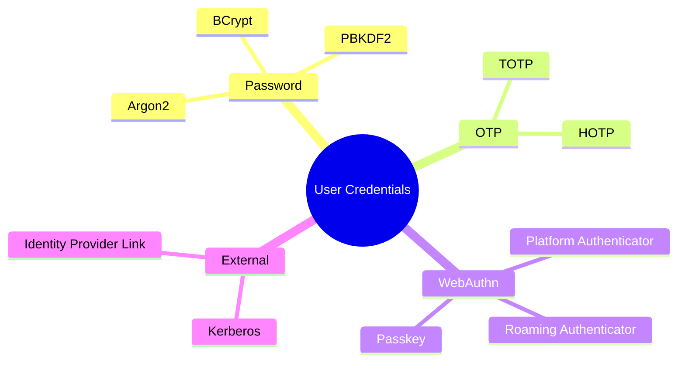
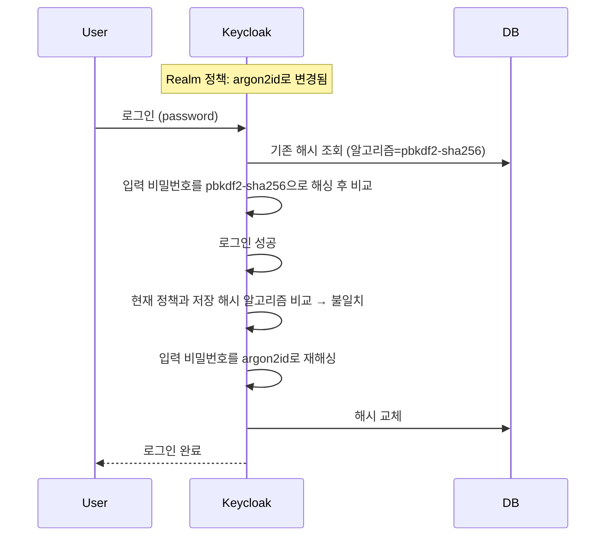
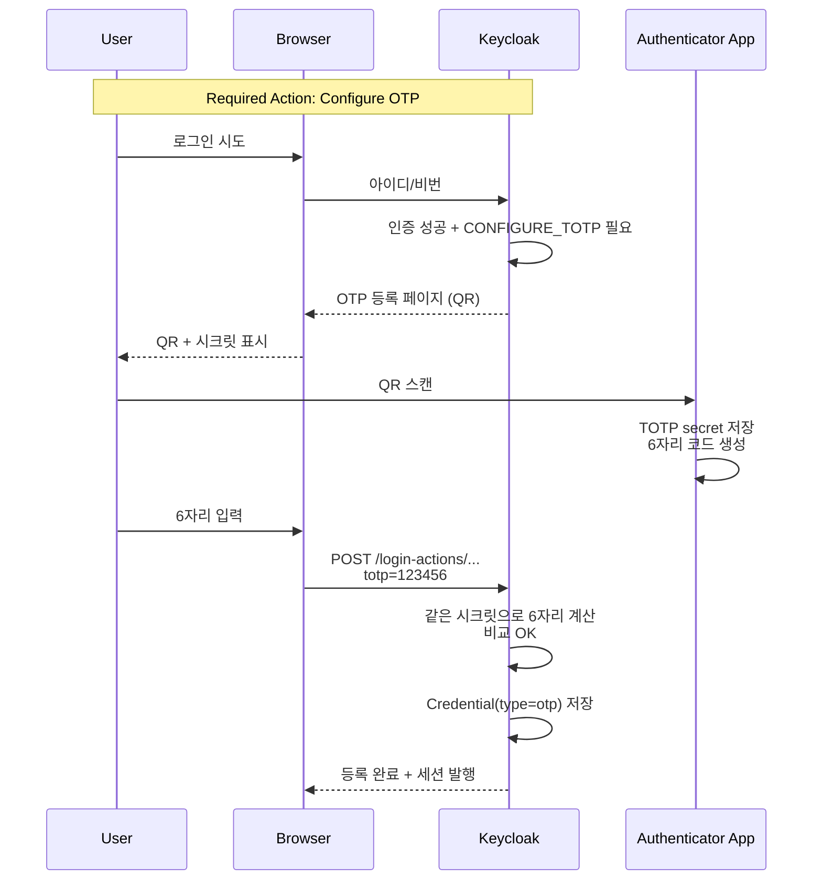
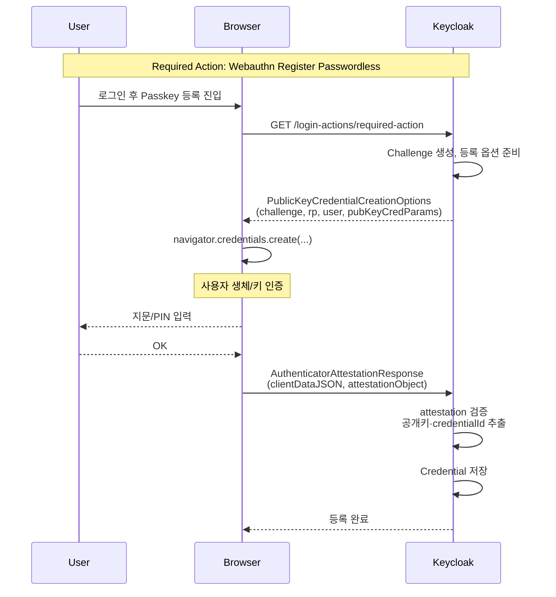

# 사용자와 자격 증명

::: info 학습 목표
- Keycloak이 지원하는 Credential 타입을 열거하고 각각의 용도를 설명할 수 있다.
- Argon2·PBKDF2·BCrypt의 차이와 v26의 기본 해시 변경점을 이해한다.
- Required Actions를 통해 Credential 등록을 강제하는 방법을 익힌다.
- TOTP·WebAuthn 등록 UX의 실제 흐름을 머릿속에 그릴 수 있다.
:::

---

## 1. Credential 타입

Keycloak에서 "자격 증명(Credential)"은 비밀번호 하나가 아니다. 사용자당 여러 개의 Credential이 등록될 수 있고, 각각 타입이 다르다.

### 주요 타입

| 타입 | 저장 내용 | 검증 방식 |
|------|-----------|-----------|
| `password` | 해시값 | 입력 비밀번호를 같은 알고리즘으로 해싱 후 비교 |
| `otp` | TOTP secret | 앱이 생성한 6자리 코드와 서버 계산값 비교 |
| `webauthn` | 공개키 + 크리덴셜 ID | WebAuthn 서명 검증 |
| `webauthn-passwordless` | 공개키 (Resident Key) | Passkey 기반 비밀번호 없는 로그인 |
| `kerberos` | (외부 Kerberos 연동) | Kerberos 티켓 검증 |
| `secret-questions` | 질문/답 해시 | 답 매칭 (저항력 약함, deprecated 권장) |



### 사용자당 복수 등록

한 사용자는 다음과 같은 세트를 갖는 경우가 많다.

- `password` 1개
- `otp` 1~N개(여러 기기 등록)
- `webauthn` 1~N개(YubiKey + 노트북 지문)
- `webauthn-passwordless` 1개 이상

Admin Console의 User 상세 → Credentials 탭에서 이 목록이 보이고, 개별 삭제·우선순위 변경이 가능하다.

### Credential Provider 우선순위

로그인 플로우가 "어느 Credential을 먼저 요구할지"는 <strong>Priority</strong>가 결정한다. 드래그로 순서 변경. 이는 Authentication Flow의 "Password Form" 단계 같은 공용 Provider가 여러 개 중 선택해야 할 때 참조한다.

---

## 2. 비밀번호 해싱

Keycloak은 비밀번호를 평문으로 저장하지 않는다. 모든 비밀번호는 <strong>해시 + 솔트 + 반복 횟수(iterations)</strong>로 저장된다.

### 지원 알고리즘

| 알고리즘 | 특징 | Keycloak 버전 |
|---------|------|---------------|
| Argon2 (argon2id) | 메모리 하드 함수, 최신 권장 | 26+ 기본 |
| PBKDF2 (SHA-256/512) | 표준, 광범위 호환 | 이전 기본 |
| BCrypt | 유명하지만 Keycloak은 기본 미지원 | Provider 추가 필요 |

### v26의 기본 변경

Keycloak 26.x부터 신규 해시 기본값이 <strong>argon2id</strong>로 바뀌었다. 이유는 두 가지다.

- Argon2는 2015년 Password Hashing Competition 우승자. 메모리 하드 설계로 GPU·ASIC 공격에 강하다.
- PBKDF2는 여전히 안전하지만 "반복 횟수만 올리는" 전략이라 하드웨어 발전에 덜 유리하다.

### 해시 저장 포맷

`CREDENTIAL` 테이블의 `secret_data`(JSON) 안에 다음과 유사하게 저장된다.

```json
{
  "algorithm": "argon2id",
  "hashIterations": 5,
  "memoryKb": 7168,
  "parallelism": 1,
  "value": "base64-hash",
  "salt": "base64-salt"
}
```

### 설정 방법

Realm settings → Authentication → Policies → Password policy에서 조정한다.

- `Hashing Algorithm`: argon2id / pbkdf2-sha512 / pbkdf2-sha256
- `Hashing Iterations`: 알고리즘별 기본값 존재

과도한 반복 횟수는 로그인 레이턴시를 늘린다. 실측 없이 무작정 10배로 올리면 피크 트래픽에서 Keycloak CPU가 튄다.

---

## 3. 해싱 알고리즘 이관

해싱 알고리즘을 바꿨을 때 기존 사용자의 해시는 어떻게 될까.

### 자동 재해시

Keycloak은 <strong>로그인 성공 시 재해시</strong>(rehash on login) 전략을 쓴다.



### 중요한 함의

- 정책만 바꿔서는 기존 해시가 마이그레이션되지 않는다. <strong>사용자가 한 번 로그인해야</strong> 신규 알고리즘으로 교체된다.
- 자주 로그인하지 않는 사용자는 오래된 해시로 남는다. 조직 차원의 전환이 필요하면 "모든 사용자에게 비밀번호 재설정을 강제"하는 정책을 Required Actions로 병행하면 된다.
- 이관 중 일시적으로 두 알고리즘이 공존한다. 성능 모니터링에서 두 해시 모두의 비용을 감안해야 한다.

### BCrypt 이관 케이스

레거시 시스템에서 BCrypt로 저장된 해시를 그대로 Keycloak으로 옮기려면 별도 Credential Provider SPI가 필요하다(CH16~17). 단순 이관이 아니라 "레거시 해시를 검증만 하다가, 로그인 성공 시 Keycloak 표준 해시로 재해싱"하는 패턴이 실무 표준이다.

---

## 4. TOTP 등록

TOTP(Time-based One-Time Password)는 "6자리가 30초마다 바뀌는 그것"이다. Google Authenticator·Microsoft Authenticator·1Password가 모두 표준(RFC 6238)을 따른다.

### 등록 흐름



### 시크릿과 QR

- QR 코드는 `otpauth://totp/<label>?secret=<base32>&issuer=<realm>` 형태의 URI를 인코딩한다.
- label에는 보통 `realm:username`이 들어간다.
- 시크릿은 Base32 문자열로, Authenticator 앱은 이것과 현재 시각(UTC)·해싱 파라미터를 조합해 6자리를 만든다.

### 정책 옵션

Realm settings → Authentication → Policies → OTP Policy에서 조정한다.

| 옵션 | 기본 |
|------|------|
| OTP type | Time-based (TOTP) |
| OTP hash algorithm | HmacSHA1 |
| Number of digits | 6 |
| Look ahead window | 1 |
| OTP token period | 30 |

`Look ahead window`는 시각 동기가 조금 어긋난 기기를 허용한다. 너무 크게 잡으면 공격 재시도 창이 넓어진다.

### 복구 고려

TOTP 기기를 잃어버리면 잠긴다. 운영 대비책은 셋 중 하나.

- Recovery Codes 기능 활성화(CH13에서 상세).
- 관리자가 Credentials 탭에서 OTP 삭제 + 재등록 강제.
- 2차 인증 수단(WebAuthn)을 동시에 등록하도록 가이드.

---

## 5. WebAuthn/Passkey 등록

WebAuthn은 공개키 기반 인증 표준이다. 기기 안의 보안 영역(Secure Enclave·TPM·하드웨어 키)에 프라이빗 키가 있고, Keycloak에는 공개키만 저장된다.

### 두 가지 Authenticator 유형

| 유형 | 예 | 저장 위치 |
|------|----|-----------|
| Platform Authenticator | 맥의 Touch ID, 안드로이드 지문, 윈도우 Hello | 기기 내장 |
| Roaming Authenticator | YubiKey, Titan Key | USB/NFC로 이동 가능 |

### Passkey란

<strong>Passkey</strong>는 WebAuthn을 소비자 친화적으로 포장한 이름이다. 특징은 두 가지.

- <strong>Resident Credential</strong>(프라이빗 키가 기기에 상주).
- 기기 동기화(애플/구글 계정으로 iCloud Keychain·Google Password Manager 간 공유).

Keycloak에서는 `webauthn-passwordless` Credential 타입으로 저장되며, "비밀번호 없이 Passkey만으로 로그인" 플로우를 구성할 수 있다.

### 등록 흐름



### 등록에 필요한 Realm 정책

Realm settings → Authentication → Policies에 두 정책이 있다.

- <strong>Webauthn Policy</strong>: 일반 2단계 WebAuthn
- <strong>Webauthn Passwordless Policy</strong>: 패스워드리스용

주요 옵션.

| 옵션 | 설명 |
|------|------|
| Relying Party Entity Name | 브라우저 대화창에 보이는 서비스 이름 |
| Relying Party ID | 도메인(예: `auth.example.com`). 브라우저 스코프 결정 |
| Signature Algorithms | ES256(권장), RS256 |
| Attestation Conveyance Preference | none / indirect / direct |
| User Verification Requirement | preferred / required |

### UX 상의 주의

- Passkey 생성은 <strong>HTTPS</strong>에서만 동작한다. 로컬 개발도 `localhost` 특례 외에는 TLS 필요.
- Relying Party ID는 페이지 도메인과 <strong>등록 당시</strong> 일치해야 한다. Keycloak을 서브도메인에서 돌리다 도메인 바꾸면 기존 Passkey가 무효화된다.
- 기기 분실 시 복구 수단이 필요하다. Required Action으로 "TOTP 백업" 또는 Recovery Codes를 함께 등록시키는 것이 안전하다.

---

## 6. 관리자 비밀번호 임시 설정

관리자가 사용자 비밀번호를 초기화할 때의 플래그와 Required Actions의 결합을 이해해야 한다.

### Temporary 플래그

Admin Console → Users → 해당 사용자 → Credentials → `Reset password`.

- 입력 필드: 새 비밀번호, <strong>Temporary 토글</strong>.
- Temporary=ON: 저장 후 해당 사용자에게 <strong>Update Password</strong> Required Action이 자동 등록된다. 다음 로그인 시 반드시 변경.
- Temporary=OFF: 영구 비밀번호로 저장. 별도 강제 없음.

### Required Actions와의 연계

Required Actions는 "다음 로그인 시 반드시 수행할 행동 목록"이다. 관련 항목.

| Required Action | 용도 |
|-----------------|------|
| Update Password | 다음 로그인 시 비밀번호 변경 강제 |
| Configure OTP | TOTP 등록 강제 |
| Webauthn Register | WebAuthn 등록 강제 |
| Webauthn Register Passwordless | Passkey 등록 강제 |
| Verify Email | 이메일 인증 링크 발송·확인 |
| Update Profile | 프로필 필드 재확인 |
| Terms and Conditions | 약관 재동의 |

### 관리자 실수를 막는 패턴

- 신규 사용자 일괄 생성 시, 비밀번호는 임시값 + Temporary=ON + Verify Email 동시 부여.
- 내부 정책상 "MFA 필수"라면 Configure OTP 또는 Webauthn Register를 Default Action으로 설정.
- 탈퇴 대비: `enabled=false`로 Soft Delete. 나중에 복구할 경우 Credential 재설정 + Required Action 재부여.

### Self-service와 Account Console

사용자가 스스로 자격 증명을 관리하려면 [Account Console](http://localhost:8080/realms/{realm}/account/)을 통한다. 여기서 Password, OTP, WebAuthn을 자발적으로 추가/삭제할 수 있다. Admin Console의 Credentials 탭과 다루는 대상은 같지만, 사용자 본인이 운영 주체라는 점이 다르다.

---

::: tip 핵심 정리
- Credential은 password/otp/webauthn/kerberos 등으로 다양하며, 한 사용자가 여러 개를 병행 등록할 수 있다.
- v26부터 기본 해시는 argon2id이며, 기존 해시는 사용자가 로그인하는 시점에 자동으로 재해시된다.
- TOTP는 RFC 6238 표준을 따르며, Realm의 OTP Policy로 알고리즘·자릿수·창 크기를 조정한다.
- WebAuthn/Passkey는 HTTPS와 Relying Party ID 정합성이 필수이며, 분실 대비 백업 Credential을 함께 등록시켜야 한다.
- 관리자 비밀번호 초기화 시 Temporary 플래그는 Update Password Required Action과 연계되어 다음 로그인 시 강제 변경을 만든다.
:::

## 다음 챕터

- 이전 : [Client와 Service Account](/study/keycloak/05-client-service-account)
- 다음 : [Role·Group과 Composite Role](/study/keycloak/07-role-group)
