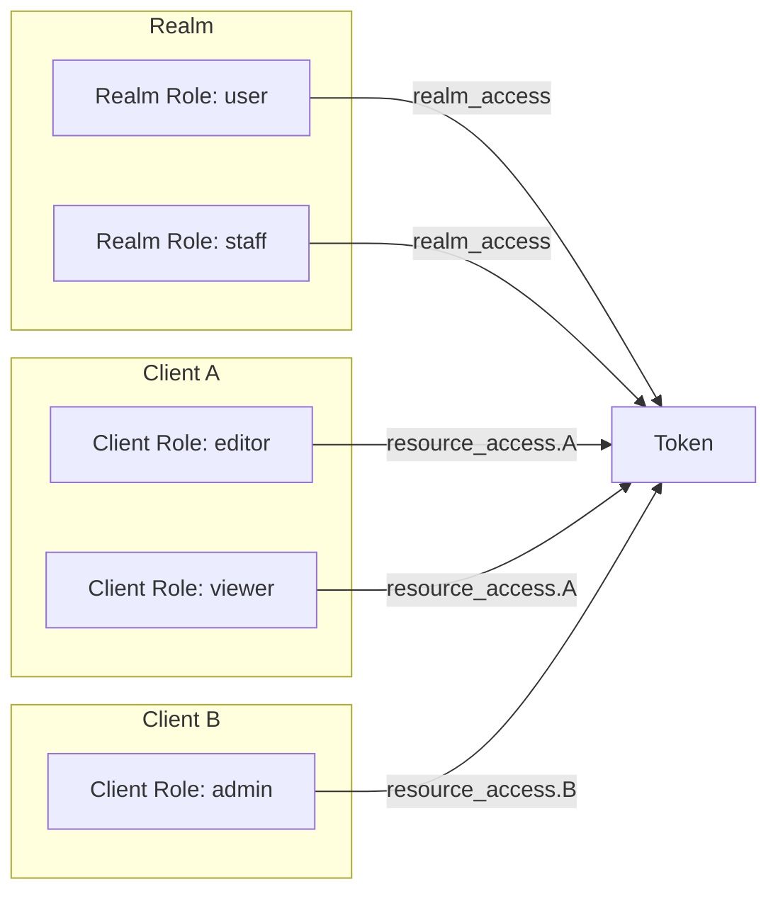
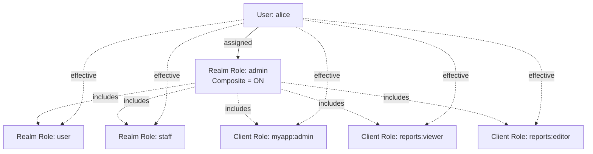
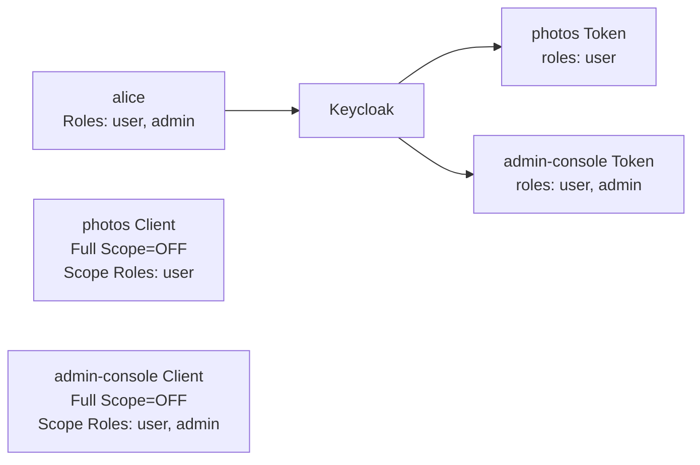

# Role·Group과 Composite Role

::: info 학습 목표
- Realm Role과 Client Role의 저장 위치·토큰 반영 방식을 구분할 수 있다.
- Group 계층과 Role 상속으로 권한을 대량 관리하는 법을 이해한다.
- Composite Role로 "역할의 역할"을 구성해 유지보수를 줄이는 법을 익힌다.
- Effective Role 계산 과정을 추적해 토큰이 가진 권한을 디버깅할 수 있다.
:::

---

## 1. Realm Role vs Client Role

Keycloak의 Role은 "Realm에 귀속된 Role"과 "특정 Client에 귀속된 Role" 두 가지다.

### 두 종류

| 구분 | Realm Role | Client Role |
|------|-----------|-------------|
| 저장 위치 | Realm 전역 | 특정 Client 소속 |
| 명명 공간 | Realm 내 유일 | Client 내 유일 (Client가 다르면 같은 이름 OK) |
| 대표 예 | `admin`, `user`, `staff` | `myapp:editor`, `myapp:viewer` |
| 메뉴 위치 | Realm roles | Clients → 해당 Client → Roles |
| 주 용도 | 횡단 권한 | Client별 도메인 권한 |

### 토큰 반영

Access Token 안에 Role이 실리는 모양이 다르다.

```json
{
  "sub": "alice-uuid",
  "realm_access": {
    "roles": ["user", "staff"]
  },
  "resource_access": {
    "myapp": {
      "roles": ["editor"]
    },
    "reports": {
      "roles": ["viewer"]
    }
  }
}
```

- Realm Role → `realm_access.roles` 배열
- Client Role → `resource_access.<client-id>.roles` 배열

이 구조는 Spring Security Resource Server에서 권한 매핑 시 자주 문제가 된다. 기본 매퍼는 `SCOPE_*`를 읽지만, Keycloak의 Role을 쓰려면 `realm_access.roles`를 읽는 커스텀 `JwtAuthenticationConverter`가 필요하다.



### 언제 어떤 걸 쓸까

- 여러 앱이 공유하는 공통 권한(`user`, `internal`): Realm Role.
- 특정 앱의 세부 권한(`myapp:editor`): Client Role.
- 작은 서비스 하나면 전부 Realm Role로도 충분. 앱이 많아지면 Client Role로 분리해 충돌을 줄인다.

---

## 2. Group

Group은 사용자·Role·속성(Attributes)을 묶는 컨테이너다. Realm 안에 트리 구조로 구성된다.

### 핵심 성질

- <strong>계층 구조</strong>: `/engineering/backend/infra` 같은 경로 형태.
- <strong>Role 상속</strong>: 그룹에 Role을 부여하면 그 그룹 멤버는 자동으로 그 Role을 갖는다.
- <strong>속성 상속</strong>: 그룹의 Attribute는 멤버 사용자에게 전파될 수 있다.
- <strong>하위 상속</strong>: 자식 그룹은 부모 그룹의 Role을 자동 상속한다(옵션).

### 메뉴 동선

- Admin Console → Groups → Create group.
- 그룹 상세 → <strong>Role mapping</strong> 탭에서 Role 부여.
- 그룹 상세 → <strong>Members</strong> 탭에서 사용자 추가 또는 이동.
- 그룹 상세 → <strong>Attributes</strong> 탭에서 메타데이터 등록.

### Default Groups

Realm settings → User registration → Default Groups에 그룹을 등록하면, 신규 가입 사용자가 자동으로 그 그룹에 들어간다. "모든 유저는 기본 `user` 권한을 가진다" 같은 정책을 간단히 구현한다.

### Group vs Role 차이 정리

| 차이 | Group | Role |
|------|-------|------|
| 용도 | 사용자 집합 | 권한 단위 |
| 계층 | 있음 | 없음(단, Composite으로 유사 표현 가능) |
| 토큰에 실리나? | 기본은 안 실림 (매퍼 필요) | Realm/Client Role은 기본 실림 |
| 속성 | 있음 | 없음 |

토큰에 그룹 경로를 실으려면 <strong>Group Membership Mapper</strong>를 추가한다(CH8에서 상세).

---

## 3. Composite Role

Composite Role은 "다른 Role들을 포함하는 Role"이다. Role의 Role이다.

### 왜 필요한가

다음 상황을 상상하자.

- `admin` 권한 = `user` 권한 + `staff` 권한 + `reports:viewer` + `reports:editor` + `myapp:admin`.
- 사용자에게 이 다섯을 매번 붙이는 대신, `admin` 하나에 묶어 관리.

Composite은 "권한 다발을 상위 이름으로 묶는" 방법이다.

### 구성 방법



- Realm Role 또는 Client Role에 "Composite" 토글 → 포함할 Role 선택.
- Composite은 Realm Role뿐 아니라 다른 Client Role도 포함할 수 있다.

### Composite의 Composite

Composite Role이 또 다른 Composite을 포함하는 것도 허용된다. 다만 순환 참조는 금지된다(UI가 막는다). 깊게 중첩하면 Effective Role 추적이 어려워지므로 2단계 정도가 현실적이다.

### Realm Default Roles

Realm settings → User profile 계열의 <strong>Default Roles</strong>는 Composite Role의 대표 사례다. 기본적으로 `default-roles-<realm>`이라는 이름의 Composite이 존재하며, 모든 사용자에게 자동 부여된다. 새 Realm에 기본 권한을 심을 때 이 Composite을 편집한다.

---

## 4. Effective Role 계산

사용자가 받는 <strong>Effective Role</strong>은 여러 경로의 합집합이다.

### 경로

```mermaid
stateDiagram-v2
    [*] --> Direct
    state "Direct Role Assignment<br>사용자에게 직접 부여된 Role" as Direct
    Direct --> Group: Group Membership
    state "Group Role<br>사용자가 속한 Group의 Role" as Group
    Group --> ParentGroup: 상위 Group
    state "Parent Group Role<br>부모 Group의 Role 상속" as ParentGroup
    ParentGroup --> Default: Default Roles
    state "Default Composite<br>default-roles-{realm}" as Default
    Default --> Composite: Composite 전개
    state "Composite Expansion<br>포함된 하위 Role 모두" as Composite
    Composite --> [*]: Effective Set
```

1. 사용자에게 직접 부여된 Role.
2. 사용자가 속한 Group의 Role.
3. 그 Group의 부모 Group들의 Role.
4. `default-roles-<realm>` Composite이 포함한 Role.
5. 위 모든 Role이 Composite이면 그 내부도 재귀 전개.

최종 집합에서 중복을 제거한 것이 Effective Role이다. 이게 토큰에 실리는 `realm_access.roles`와 `resource_access.*.roles`의 원천이다.

### 디버깅 방법

- Admin Console → Users → 해당 사용자 → <strong>Role mapping</strong> 탭 → `Effective` 토글.
- `Effective=ON`이면 직접 부여·간접 상속·Composite 전개까지 반영된 최종 목록이 보인다.
- Admin REST API에서는 `/users/{id}/role-mappings/realm/composite`와 `/users/{id}/role-mappings/clients/{client-id}/composite` 엔드포인트로 같은 정보를 얻는다.

### 흔한 함정

- "Role을 부여했는데 토큰에 안 실린다" → Client Scope 또는 Role Scope Mapper가 제한 중(§5).
- "Group에 Role을 줬는데 하위 Group 멤버는 안 받는다" → 하위 Group의 상속 토글 확인.
- "default-roles에 있는데 일부 사용자만 없다" → Realm 생성 이전 사용자 이관 이슈. 수동 확인 필요.

---

## 5. Role Scope Mapper

Client에 전달되는 Role은 사용자가 가진 Role 전부가 아니다. <strong>Client의 Scope</strong>에 의해 걸러진다.

### Full Scope Allowed 토글

Clients → 해당 Client → Advanced(또는 상단) → <strong>Full scope allowed</strong> 토글.

| 값 | 의미 |
|----|------|
| ON | 사용자의 Effective Role을 모두 토큰에 실어줌 |
| OFF | Client에 명시적으로 매핑된 Role만 토큰에 실음 |

대부분의 프로덕션 Client는 <strong>OFF</strong>가 권장된다. 이유는 최소 권한 원칙이다.

### 왜 OFF가 좋은가

사용자 alice가 Realm Role `admin`을 가진다고 가정하자.

- `photos` Client: 사진 편집에만 관심. `admin`을 이 Client 토큰에 실어줄 이유가 없다.
- `admin-console` Client: 관리 목적. `admin` 필요.

`photos` 토큰에 `admin`이 실리면, 그 토큰이 잘못 유출됐을 때 `admin-console` 호출에도 통과한다. Client별로 토큰 스코프를 좁히는 것이 Full Scope OFF의 목적이다.

### Scope Mapping 화면

Clients → 해당 Client → <strong>Client scopes</strong> 탭 → Evaluate → "Generated access token"으로 확인.

- Assigned default scopes: 항상 적용
- Assigned optional scopes: 요청 시 `scope=` 파라미터에 포함될 때만 적용
- 여기에 Role Scope Mapper가 연결된다. 특정 Role을 Client Scope로 게이팅하는 방식.

### 시나리오



---

## 6. 권한 모델링 패턴

Role·Group·Composite을 어떻게 조합하는지는 조직 규모에 따라 달라진다.

### Flat 패턴 (소규모)

- Realm Role 5~10개로 끝.
- 사용자에게 직접 Role 부여.
- Group은 조직도 시각화 정도로만.

적합: 내부 툴, 10~100명 규모, 권한 2~3개.

```yaml
# 예
realm roles:
  - user      # 모두
  - staff     # 내부 구성원
  - admin     # 관리자 (Composite: user + staff + *:admin)
```

### Group + Composite 패턴 (중~대규모)

- Group = 조직도 또는 팀.
- Group에 Role 부여.
- Composite Role로 직무(Job Title) 표현.

```yaml
groups:
  - /engineering/backend
  - /engineering/frontend
  - /finance

composite roles:
  - eng-backend-dev  (includes: myapp:dev, logs:viewer, ci:runner)
  - eng-backend-lead (includes: eng-backend-dev, myapp:admin)
```

Group `/engineering/backend`에 `eng-backend-dev`를 기본 부여, 팀 리드만 추가로 `eng-backend-lead`를 개별 부여.

### Fine-Grained 패턴 (대규모 + 리소스 레벨)

Role·Group만으로는 "alice가 프로젝트 X의 편집자, 프로젝트 Y의 조회자"처럼 <strong>리소스 인스턴스별 권한</strong>을 표현하기 어렵다. 이럴 때 Keycloak Authorization Services(UMA)로 넘어간다. 상세는 CH9에서 다룬다.

### 안티패턴

- <strong>권한 이름을 Role에 전부 박음</strong>: `can-read-report-monthly-finance`처럼 세분 Role 수백 개. 관리 불가능. 이 단계에서는 Authorization Services로 이관.
- <strong>Group을 Role처럼 씀</strong>: Group에 권한만 들어 있고 사용자 분류 의미가 없는 경우. 그냥 Role 쓰면 된다.
- <strong>Composite을 4단계 이상 중첩</strong>: 디버깅 지옥. 2단계에서 멈춘다.
- <strong>Full Scope Allowed=ON 방치</strong>: Client별 권한 최소화 불가.

### 역할 명명 규칙 제안

| 대상 | 패턴 | 예 |
|------|------|----|
| Realm Role (사용자 분류) | 단일 명사 | `user`, `staff`, `admin` |
| Realm Role (Composite 직무) | 하이픈 | `eng-backend-dev` |
| Client Role (도메인 권한) | 동사·역할 | `editor`, `viewer`, `publisher` |
| Default Roles | `default-roles-<realm>` | 건드리지 말 것 |

---

::: tip 핵심 정리
- Realm Role은 `realm_access.roles`, Client Role은 `resource_access.<client>.roles`로 토큰에 실린다.
- Group은 사용자·Role·속성을 묶는 계층 컨테이너이며, Role과는 "집합 vs 권한"으로 구분된다.
- Composite Role은 Role의 Role이다. 직무(Job Title)나 묶음 권한을 한 이름으로 모아 유지보수를 줄인다.
- Effective Role은 직접 부여 + Group 상속 + Default + Composite 전개의 합집합이다. Admin Console의 Effective 토글로 확인한다.
- Full Scope Allowed=OFF + Client Scope로 각 Client 토큰의 Role을 최소화하는 것이 운영 기본이다.
- 규모별로 Flat → Group+Composite → Authorization Services(UMA) 순으로 모델을 확장한다.
:::

## 다음 챕터

- 이전 : [사용자와 자격 증명](/study/keycloak/06-user-credentials)
- 다음 : [Client Scope와 Protocol Mapper](/study/keycloak/08-protocol-mapper)
