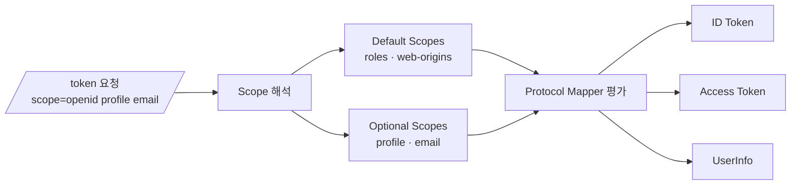
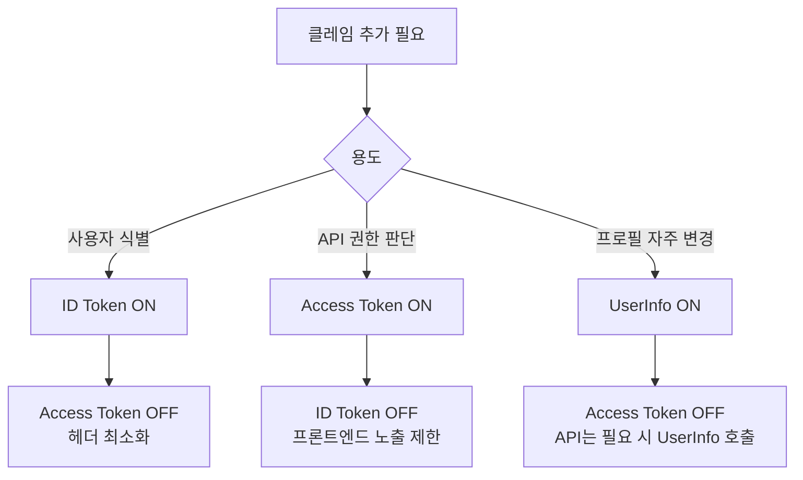

# Client Scope와 Protocol Mapper

::: info 학습 목표
- Client Scope의 Default Scopes와 Optional Scopes 차이를 설명할 수 있다.
- Protocol Mapper의 내장 타입별 동작을 이해하고 필요한 클레임을 선택할 수 있다.
- User Attribute를 토큰에 싣는 커스텀 클레임 추가 과정을 구성할 수 있다.
- Consent 화면이 Scope와 어떻게 연결되고 ID Token/Access Token/UserInfo 분기를 통제하는지 안다.
:::

---

## 1. Client Scope — Default Scopes vs Optional Scopes

Keycloak의 Client Scope는 Client에 재사용 가능한 Protocol Mapper와 Role Scope Mapping 묶음이다. Client마다 동일한 설정을 반복해서 만들지 않도록, 공통 토큰 설계 단위를 먼저 정의하고 여러 Client에 붙이는 방식이다.

### Scope의 두 축

하나의 Client에는 Client Scope를 두 가지 방식으로 연결한다.

| 구분 | 토큰 발급 조건 | 사용자 동의 | 대표 용도 |
|------|------|------|------|
| Default Client Scopes | 항상 포함 | 별도 동의 없음 | 내부 기본 클레임(`roles`, `web-origins`) |
| Optional Client Scopes | `scope` 파라미터로 요청될 때만 | Consent Required 시 표시 | `profile`, `email`, `address`, `phone` |

`scope=openid profile email`처럼 요청된 값이 Optional Scope에 매칭되면 해당 Scope의 Mapper들이 토큰에 적용된다. 요청되지 않은 Optional Scope는 평가 대상에서 제외된다.

### Realm-level vs Client-level

Client Scope는 두 계층으로 관리한다.

- **Realm-level Client Scope**: Realm 전체에서 여러 Client가 공유하는 Scope다. `openid`/`profile`/`email` 같은 표준 Scope는 Realm 수준으로 이미 제공된다.
- **Client-level (Dedicated) Scope**: 개별 Client 전용 Scope다. Admin Console의 Client 상세 화면에서 Dedicated scope에 Mapper를 직접 추가할 수 있다.

공통 클레임은 Realm-level Scope로 모듈화하고, 특정 Client에만 필요한 규칙은 Dedicated Scope로 격리하는 것이 운영상 깔끔하다.

### Scope → Mapper → Token 흐름



Scope가 먼저 Mapper 집합을 결정하고, 각 Mapper가 "어느 토큰에 담을지"를 토글로 제어한다. 이 두 단계 구조 덕분에 "이 Scope는 ID Token에만 영향을 준다"와 같은 세밀한 설계가 가능해진다.

---

## 2. Protocol Mapper 내장 타입

Protocol Mapper는 사용자 모델의 값을 토큰 클레임으로 변환하는 규칙이다. Keycloak은 OIDC와 SAML 각각에 대해 여러 내장 Mapper 타입을 제공한다. 여기서는 OIDC Mapper 중 자주 쓰이는 타입을 정리한다.

### 자주 쓰는 내장 타입

| Mapper 타입 | 용도 | 예시 클레임 |
|------|------|------|
| User Attribute | 사용자 커스텀 Attribute → 클레임 | `department: "platform"` |
| User Property | 내장 속성(`username`, `email`) → 클레임 | `preferred_username` |
| Group Membership | 사용자의 Group 경로 → 클레임 | `groups: ["/org/platform"]` |
| User Realm Role / User Client Role | Realm·Client Role → 클레임 | `realm_access.roles`, `resource_access` |
| Hardcoded Claim | 고정 문자열 주입 | `aud: "internal-api"` |
| Hardcoded Role | 특정 Role 강제 주입 | 외부 IdP 브로커링 후 기본 Role |
| Audience | `aud` 클레임 편집 | `aud: "billing-api"` |
| Audience Resolve | Role 매핑된 Client를 `aud`로 | 서비스 간 토큰 |
| Script Mapper | JavaScript로 계산된 클레임 | `is_staff: user.email.endsWith("@corp.io")` |

### Script Mapper의 현실

Script Mapper는 유연하지만 기본적으로 비활성화된 Preview 기능이다. 활성화하려면 서버 시작 시 `--features=scripts` 플래그를 켜야 하고, 보안상 JS 실행 환경(Nashorn→Rhino 등)의 제약이 있다. 운영 환경에서는 [CH16 SPI](/study/keycloak/16-spi-overview)에서 다룰 커스텀 Mapper Provider로 대체하는 것이 일반적이다.

### Audience Mapper의 중요성

Access Token의 `aud` 클레임은 "이 토큰이 어느 Resource Server를 대상으로 하는가"를 뜻한다. Resource Server가 JWT를 검증할 때 자신이 기대하는 `aud`와 일치하지 않으면 거부해야 한다. 하나의 Client가 여러 API를 호출한다면 Audience Mapper로 `aud`에 해당 API의 Client ID를 포함시킨다. 자세한 배경은 [OAuth CH10. ID Token과 JWT](/study/oauth/10-id-token-jwt)를 참조한다.

---

## 3. 커스텀 클레임 추가 — User Attribute 예제

사용자에게 있는 커스텀 속성을 토큰에 싣는 전형적인 시나리오를 살펴본다. 예: 사내 플랫폼에서 사용자의 `department`와 `employee_number`를 Access Token에 담아 API가 직접 읽도록 한다.

### 1단계 — User Attribute 정의

Users → 대상 사용자 → Attributes 탭에서 `department = "platform"`, `employee_number = "A12345"`를 추가한다. 관리 자동화 관점에서는 Admin REST API([CH23](/study/keycloak/23-admin-rest-api) 예고)로 일괄 주입하는 쪽이 맞다.

```http
PUT /admin/realms/corp/users/{id} HTTP/1.1
Authorization: Bearer {admin-token}
Content-Type: application/json

{
  "attributes": {
    "department": ["platform"],
    "employee_number": ["A12345"]
  }
}
```

### 2단계 — Client Scope 생성

Client Scopes → Create를 눌러 `corp-profile`이라는 Scope를 만든다. Type은 Default 또는 Optional 중 정책에 맞게 고르고, Include in Token Scope는 `scope` 클레임에 이 Scope 이름을 노출할지 여부를 지정한다.

### 3단계 — Protocol Mapper 추가

생성한 Scope → Mappers → Add mapper → By configuration에서 <strong>User Attribute</strong>를 선택한다. 주요 필드는 다음과 같다.

| 필드 | 값 | 설명 |
|------|------|------|
| Name | `department` | Mapper 식별자 |
| User Attribute | `department` | 사용자 속성 키 |
| Token Claim Name | `department` | 토큰에 들어갈 클레임 키 |
| Claim JSON Type | `String` | 직렬화 타입 |
| Add to ID token | On/Off | ID Token 포함 여부 |
| Add to access token | On/Off | Access Token 포함 여부 |
| Add to userinfo | On/Off | `/userinfo` 응답 포함 여부 |
| Multivalued | On/Off | 배열로 담을지 |

같은 방식으로 `employee_number`도 추가한다.

### 4단계 — Client에 Scope 바인딩

대상 Client → Client scopes 탭에서 `corp-profile`을 <strong>Default</strong> 또는 <strong>Optional</strong>로 추가한다. Optional로 붙이면 `scope=openid corp-profile`처럼 명시적으로 요청된 경우에만 클레임이 삽입된다.

### 5단계 — 결과 확인

Admin Console의 **Evaluate** 탭은 실제 요청을 만들지 않고도 Mapper 결과를 미리 볼 수 있는 디버깅 도구다. Client Scopes → Evaluate → 사용자 선택 → Generated Access Token을 눌러 디코딩한다.

```json
{
  "sub": "a7f1...",
  "preferred_username": "hobeen",
  "department": "platform",
  "employee_number": "A12345",
  "aud": "corp-api",
  "scope": "openid corp-profile"
}
```

---

## 4. Consent와 Scope

사용자가 특정 Client에 처음 로그인할 때, "이 앱이 당신의 이메일·프로필에 접근합니다. 동의하시겠습니까?" 화면을 본 적이 있을 것이다. 이 동의(Consent) 화면의 내용은 그대로 Client Scope가 통제한다.

### Consent Required 토글

Client 설정의 <strong>Consent Required</strong>를 On으로 바꾸면 사용자는 최초 로그인 시 Scope 목록을 확인하고 승인해야 한다. 각 Scope의 <strong>Display on consent screen</strong>과 <strong>Consent screen text</strong>가 이 화면에 표시되는 레이블이다.

### 언제 Consent가 필요한가

내부 전용 Client(사내 운영 콘솔, 서비스 간 호출)는 Consent Required를 꺼두는 것이 표준이다. 반대로 서드파티 앱에게 API를 개방하는 경우에는 반드시 켜야 하며, 이는 OAuth 본래의 "사용자 동의 위임" 원칙을 지키는 것이기도 하다([OAuth CH1. 패스워드 공유 시대](/study/oauth/01-password-sharing-era) 참조).

### Consent 이력과 재동의

한 번 동의한 Client·Scope 조합은 사용자 계정에 기록된다. 사용자는 Account Console의 Linked applications에서 동의를 철회할 수 있고, 관리자는 Admin REST API로 일괄 철회할 수 있다. 새 Scope가 추가되면 다음 로그인 시 "추가 동의"만 따로 묻는다.

### Offline Access Scope

`offline_access` Scope는 Consent 화면에서도 특별하게 취급된다. 이 Scope가 승인되면 Refresh Token이 **세션 만료 이후에도** 유효한 Offline Token으로 발급된다. 장기 백그라운드 작업(크론, 배치)에 쓰이며, 보안상 Consent 명시 동의를 강제하는 것이 원칙이다. Refresh Token 전략은 [OAuth CH13. 토큰 전략](/study/oauth/13-token-strategy)에서 다룬다.

---

## 5. ID Token vs Access Token vs UserInfo 분기

Protocol Mapper마다 "어느 토큰/응답에 포함할지"를 개별 토글로 제어한다. 단순해 보이지만 이 분기는 OIDC 표준을 올바르게 따르는 핵심이다.

### 세 채널의 용도

| 채널 | 소비자 | 담기에 적절한 것 |
|------|------|------|
| ID Token | Client(프론트엔드) | 사용자 식별(`sub`), 인증 사실(`iss`, `aud`, `auth_time`) |
| Access Token | Resource Server | 권한 판단에 필요한 최소 정보(`sub`, `scope`, `aud`, Role) |
| UserInfo 응답 | Client가 요청 시 | 자주 변하는 프로필 정보(`email_verified`, `picture`) |

### 분기 원칙

- <strong>ID Token</strong>은 Client가 로그인 성공 여부를 확인하려는 용도다. 최소한의 사용자 식별 클레임만 담는다.
- <strong>Access Token</strong>은 API 호출 시마다 네트워크를 오간다. 너무 많은 클레임을 담으면 헤더 크기 문제(특히 쿠키 기반 BFF 패턴에서)와 토큰 로그 누출 위험이 커진다.
- <strong>UserInfo</strong>는 Access Token으로 조회하는 별도 엔드포인트다. 자주 변하거나 민감한 프로필은 여기서만 노출하고 Access Token에서는 빼는 전략이 많다.

### 의사결정 흐름



### 흔한 실수

- **모든 토글을 켜는 것**: 토큰이 부풀고 민감정보가 불필요하게 유통된다.
- **Access Token에 `email` 담기**: 이메일은 권한 판단에 필요한 정보가 아니다. API가 식별이 필요하면 `sub`로 충분하고, 표시용 이름은 UserInfo에서 가져온다.
- **ID Token에 Role 담기**: ID Token은 "로그인 사실 증명"이지 "권한 주장"이 아니다. Role은 Access Token에 담는 것이 맞다.

---

## 6. OIDC Scope 표준 준수

OIDC는 표준 Scope와 그 Scope가 유발해야 할 클레임을 RFC로 고정해두었다. Keycloak의 내장 Scope는 이 표준을 그대로 구현한다.

### 표준 Scope와 주요 클레임

| Scope | 필수 동반 | 표준 클레임 |
|------|------|------|
| `openid` | 항상(OIDC 전제) | `sub`, `iss`, `aud`, `exp`, `iat` |
| `profile` | Optional | `name`, `preferred_username`, `given_name`, `family_name`, `locale`, `picture` 등 |
| `email` | Optional | `email`, `email_verified` |
| `address` | Optional | `address`(객체) |
| `phone` | Optional | `phone_number`, `phone_number_verified` |
| `offline_access` | Optional | Refresh Token을 Offline Token으로 |

자세한 표준 클레임 사전은 [OAuth CH11. Discovery·JWKS·UserInfo](/study/oauth/11-discovery-jwks-userinfo)에서 정리한다.

### 표준을 지켜야 하는 이유

- **상호 운용성**: Spring Security, Auth.js, oidc-client-ts 같은 라이브러리는 표준 Scope/클레임 이름을 전제로 파싱한다. `email`을 `user_email`로 바꾸는 순간 호환이 깨진다.
- **Discovery 일관성**: `/.well-known/openid-configuration`의 `scopes_supported`와 `claims_supported`는 실제 Client Scope 구성과 일치해야 한다.
- **감사·로그 규약**: SIEM 툴과 감사 로그 파이프라인이 표준 클레임 이름을 전제로 필드를 매핑한다.

### 커스텀 클레임 네이밍 규칙

표준 클레임과 충돌을 피하려면 커스텀 클레임은 네임스페이스를 쓰는 것이 안전하다. 예: `corp.department`, `https://corp.io/employee_number`. URI 형태는 길지만 충돌 가능성이 0에 가까워 기업 시스템에서 자주 쓴다.

### 표준 vs 커스텀 설계 지침

- 표준 Scope로 표현되는 것은 <strong>절대 리네이밍하지 말 것</strong> — `email`은 `email`이어야 한다.
- 사내 전용 클레임만 <strong>커스텀 Scope</strong>(`corp-profile`, `corp-hr`)로 묶고, 네임스페이스를 부여한다.
- 하나의 Scope에 너무 많은 Mapper를 붙이지 말고 <strong>역할별로 쪼갠다</strong>(`corp-hr`, `corp-billing`).

### 표준 Scope별 실전 매핑

각 표준 Scope가 내부 Mapper로 어떻게 구성되는지 아는 것이 정책 변경 시 필요하다. 기본 `profile` Scope는 Realm 수준 Client Scope로 다음 Mapper들을 이미 포함한다.

| Mapper 이름 | 타입 | 결과 클레임 |
|------|------|------|
| username | User Property | `preferred_username` |
| given name | User Property | `given_name` |
| family name | User Property | `family_name` |
| full name | User Property | `name` |
| locale | User Attribute | `locale` |
| profile | User Attribute | `profile` |
| picture | User Attribute | `picture` |
| zoneinfo | User Attribute | `zoneinfo` |
| website | User Attribute | `website` |

`email` Scope는 `email`·`email_verified` 두 Mapper로, `address` Scope는 `address` 복합 객체 Mapper로 구성된다. 이 기본 Mapper들은 삭제보다 **Include in 토글**을 끄는 방식으로 제어하는 것이 안전하다.

### Discovery 문서와의 일치

`/realms/{realm}/.well-known/openid-configuration` 문서의 `scopes_supported` 배열과 Realm의 Client Scope 목록이 일치해야 Client 라이브러리가 정상 동작한다. 새 Scope를 추가하면 Discovery에 자동 반영되지만, `Include in Token Scope` 옵션이 꺼져 있으면 `scope` 클레임에는 노출되지 않는다. Discovery 구조의 상세는 [OAuth CH11](/study/oauth/11-discovery-jwks-userinfo)에서 다룬다.

### 운영 중 Scope 변경 체크리스트

- 기존 Scope에 Mapper를 추가할 때 **ID Token/Access Token 크기 증가**가 임계치를 넘는지 미리 측정.
- Mapper 삭제는 즉시 모든 신규 토큰에 반영되지만, 이미 발급된 토큰은 만료까지 유효 — 민감 데이터 제거 시 토큰 폐기(Backchannel Logout 등) 병행.
- Scope를 Client에서 제거하면 해당 Client 토큰에서 해당 클레임이 사라지므로, 의존 API의 `aud`·권한 로직을 반드시 확인.

---

::: tip 핵심 정리
- Client Scope는 Protocol Mapper와 Role Scope Mapping을 재사용 가능한 단위로 묶은 것이며, Default Scopes는 항상 포함되고 Optional Scopes는 `scope` 파라미터로 요청될 때만 활성화된다.
- Protocol Mapper는 User Attribute/User Property/Group/Role/Hardcoded/Audience/Script 등 내장 타입으로 사용자 모델을 토큰 클레임으로 변환하며, Script Mapper는 Preview라 운영에선 커스텀 SPI가 더 낫다.
- 각 Mapper는 ID Token·Access Token·UserInfo에 대한 포함 여부를 개별 토글로 제어하므로, 용도별로 다른 클레임 세트를 구성해 토큰 크기와 노출 범위를 최소화해야 한다.
- Consent Required 토글은 Scope 목록을 사용자 동의 UI로 노출하며, 서드파티 앱에는 반드시 필요하고 내부 Client에서는 꺼두는 것이 표준이다.
- `openid`/`profile`/`email`/`address`/`phone`/`offline_access`는 OIDC 표준 Scope로 라이브러리 호환성을 위해 리네이밍하지 말고, 사내 전용 클레임은 네임스페이스 형태의 커스텀 Scope로 분리한다.
:::

## 다음 챕터

- 이전 : [Role·Group과 Composite Role](/study/keycloak/07-role-group)
- 다음 : [Authorization Services와 UMA 2.0](/study/keycloak/09-authz-uma)
