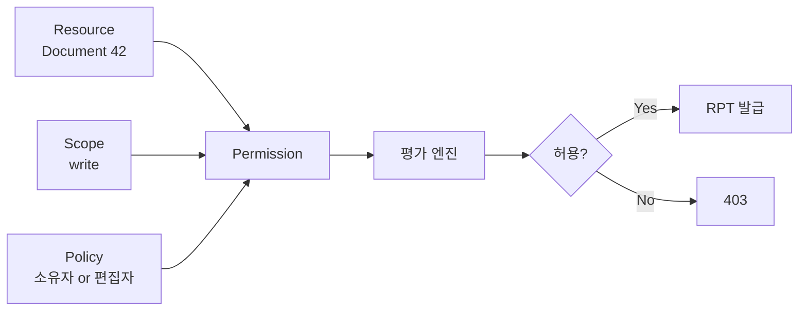
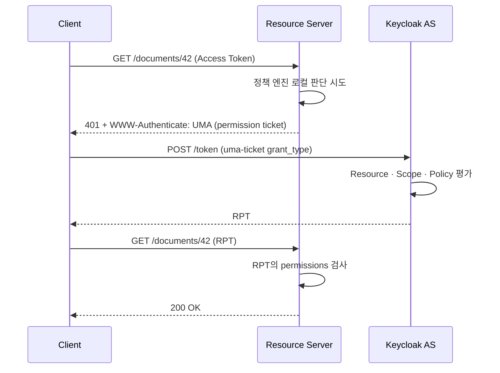

# Authorization Services와 UMA 2.0

::: info 학습 목표
- Role 기반 권한만으로 표현할 수 없는 데이터 레벨 권한의 한계를 설명할 수 있다.
- Resource·Scope·Policy·Permission 4요소 모델을 이해하고 관계를 설계할 수 있다.
- RPT(Requesting Party Token)의 발급·평가 흐름을 요청 레벨에서 설명할 수 있다.
- UMA 2.0이 기존 OAuth와 달리 리소스 소유자가 직접 공유를 허가하는 시나리오를 구현할 수 있다.
:::

---

## 1. Role 기반의 한계

[CH7](/study/keycloak/07-role-group)에서 본 Role·Group·Composite Role은 "무엇을 할 수 있는가"를 행위자 관점에서 묶는 도구다. 하지만 실제 업무 요건은 종종 <strong>특정 데이터 인스턴스</strong>에 묶인다.

### Role로 안 풀리는 요건

다음 요건을 Role만으로 표현해보자.

- "문서 ID 42는 작성자 본인과 편집자 역할 중 초대된 사람만 수정 가능"
- "A 부서의 매니저는 자기 부서 직원의 급여 정보만 열람 가능"
- "의사 김○○는 담당 환자 차트에만 접근 가능"

Role은 행위자 속성이지 리소스 속성이 아니다. `doctor` Role이 있다고 모든 환자 차트에 접근시킬 수는 없다. "어떤 리소스인가"에 따라 판단을 달리해야 한다.

### 해결 방향 두 가지

| 접근 | 위치 | 장단 |
|------|------|------|
| 애플리케이션 코드에서 판단 | RS 내부 | 유연하지만 팀마다 구현 편차, 정책 변경 시 배포 필요 |
| 외부 정책 엔진(AS)에 위임 | Keycloak Authorization Services | 정책 중앙화, 변경 즉시 반영, 러닝커브 존재 |

Keycloak의 Authorization Services는 두 번째 길이다. OAuth의 토큰 발급과는 별도의 기능으로, Client를 "**Resource Server**"로 설정한 뒤 정책 엔진을 그 Client에 탑재한다.

### Client의 역할 전환

Authorization Services를 켜려면 Client 설정의 <strong>Authorization Enabled</strong>를 On으로 바꾼다. 이 순간부터 해당 Client는 단순히 토큰을 받는 Client가 아니라, 자기 자신을 보호 대상 Resource Server로 등록하고 정책을 관리하는 주체가 된다. Admin Console에도 Authorization 탭이 추가된다.

---

## 2. Authorization Services 4요소

Keycloak Authorization Services는 네 가지 객체의 조합으로 세밀한 권한을 기술한다.

### 4요소 정의

| 요소 | 정의 | 예시 |
|------|------|------|
| Resource | 보호 대상 객체(타입 또는 인스턴스) | `Document` 타입, 또는 `Document/42` 인스턴스 |
| Scope | 리소스에 대해 수행할 수 있는 동작 | `document:read`, `document:write`, `document:delete` |
| Policy | 접근을 허용/거부하는 조건식 | "문서 소유자이거나 편집자 Role 보유" |
| Permission | Resource·Scope를 어떤 Policy와 연결할지 묶은 것 | `Document/42`에 `write` Scope는 위 Policy 적용 |

Policy만 놓고 보면 정책(조건)이고, Permission은 그 정책을 특정 리소스·스코프에 바인딩하는 매핑이다.

### 관계 다이어그램



Resource와 Scope가 "무엇을 할까"를, Policy가 "조건"을, Permission이 "연결 방식"을 정한다.

### Resource Type vs Resource Instance

한 번에 모든 문서를 동일한 정책으로 보호하려면 <strong>타입 수준 Resource</strong>(`urn:corp:document`)로 묶는다. 특정 인스턴스에 개별 정책이 필요하면 <strong>인스턴스 Resource</strong>(`urn:corp:document:42`)로 등록한다. 인스턴스 등록은 Admin REST API나 UMA Protection API로 애플리케이션이 동적으로 생성할 수 있다.

### Permission 타입

Permission도 두 가지다.

- **Resource-based Permission**: Resource 단위로 정책 묶음 연결. 예: "Document/42는 P1·P2 정책 적용".
- **Scope-based Permission**: Scope 단위로 정책 묶음 연결. 예: "`document:write` Scope는 언제나 편집자 Policy 적용".

둘을 조합하면 "Document/42에 대한 write는 편집자 Policy, read는 모든 직원" 같은 표현이 가능하다.

---

## 3. Policy 타입

Policy는 "이 조건이 참이면 허용"을 선언한다. Keycloak은 여러 내장 타입을 제공하며 서로 조합할 수 있다.

### 내장 Policy 타입

| 타입 | 조건 | 사용처 |
|------|------|------|
| Role | 요청자가 특정 Role 보유 | `billing-admin` Role 검증 |
| User | 특정 사용자 ID와 일치 | 개인 승인자 지정 |
| Group | 특정 Group 소속 | 부서·팀 단위 제어 |
| Client | 호출한 Client ID 일치 | 내부 서비스만 허용 |
| Time | 날짜·시간 구간 | 업무 시간대에만 허용 |
| Regex | 사용자 속성 정규식 매칭 | `email`이 `@corp.io`로 끝남 |
| JS (Script) | JavaScript 코드 평가 | 커스텀 비즈니스 규칙 |
| Client Scope | 토큰 Scope 포함 여부 | `offline_access` 있어야 허용 |
| Aggregated | 여러 Policy의 AND/OR 조합 | "소유자 AND 업무시간" |

### Decision Strategy

Permission이 여러 Policy와 연결되면 결과를 어떻게 합칠지 결정해야 한다.

- **Unanimous**: 모든 Policy가 허용해야 허용. (AND)
- **Affirmative**: 하나라도 허용하면 허용. (OR)
- **Consensus**: 허용 수가 거부 수보다 많으면 허용.

Aggregated Policy에서도 같은 전략을 선택한다. 설계 시 "교집합"과 "합집합"을 의식적으로 구분해 쓴다.

### JS Policy의 함정

JS Policy는 Script Mapper와 동일하게 Preview 기능으로, `--features=scripts` 활성화가 필요하다. 운영 환경에서 강제 정책으로 쓰려면 SPI 기반 커스텀 Policy Provider를 개발하는 편이 안전하다. 감사·버전 관리·테스트 측면에서도 코드가 Git에 있는 편이 유리하다.

### 재사용 가능한 Policy 설계

Policy는 Client 내부에서 이름으로 재사용된다. "소유자 Policy", "업무 시간 Policy" 같은 단위로 원자적으로 쪼개 두고, Permission 단계에서 Aggregated로 조합하는 방식이 유지보수에 유리하다.

---

## 4. RPT와 평가

권한 평가 결과는 <strong>RPT(Requesting Party Token)</strong>라는 JWT로 발급된다. RPT는 기본 Access Token에 "허가된 Permission" 목록을 덧붙인 확장 JWT다.

### UMA Ticket 기반 요청

클라이언트(또는 Resource Server가 권한을 위임한 경우)가 RPT를 요청할 때는 특수 Grant Type을 쓴다.

```http
POST /realms/corp/protocol/openid-connect/token HTTP/1.1
Authorization: Bearer {access_token}
Content-Type: application/x-www-form-urlencoded

grant_type=urn:ietf:params:oauth:grant-type:uma-ticket
&audience=doc-service
&permission=Document/42#write
&permission=Document/42#read
```

`audience`는 평가를 수행할 Resource Server(Client ID), `permission`은 `{resourceId}#{scope}` 형식으로 요청할 권한 목록이다.

### 성공 응답

성공하면 Keycloak은 평가 결과가 담긴 RPT를 반환한다.

```json
{
  "access_token": "eyJhbGciOi...",
  "token_type": "Bearer",
  "expires_in": 300
}
```

RPT 페이로드(`access_token`을 디코딩)에는 `authorization.permissions`가 포함된다.

```json
{
  "sub": "a7f1...",
  "aud": "doc-service",
  "authorization": {
    "permissions": [
      { "rsid": "doc-42", "rsname": "Document/42", "scopes": ["write", "read"] }
    ]
  }
}
```

### 평가 흐름



두 단계로 나뉜다. 먼저 RS가 요청을 거절하며 permission ticket을 내려주고, Client가 이 ticket으로 Keycloak에서 RPT를 발급받는다. 이어 RPT로 재요청하면 RS는 페이로드만 검사해 허용한다.

### 간이 모드 — Bearer Only에서 바로 평가

RS가 UMA 대화를 중계하지 않고, Keycloak 어댑터가 Access Token의 Subject·Role을 받아 <strong>로컬에서 정책 엔진과 통신</strong>해 즉시 평가하는 모드도 있다. 이 경우 Client는 UMA ticket을 몰라도 되며, RS(어댑터)가 내부적으로 평가를 마친다.

---

## 5. Policy Enforcer

애플리케이션 코드에 "이 URL은 이 리소스·스코프"를 매핑해 자동으로 정책을 강제하는 모듈이 <strong>Policy Enforcer</strong>다. Keycloak은 Java/Spring/Quarkus용 어댑터를 제공하며, 설정은 `keycloak.json` 또는 `application.yml`에 선언한다.

### 설정 예시 (Quarkus)

```yaml
quarkus:
  keycloak:
    policy-enforcer:
      enable: true
      enforcement-mode: ENFORCING
      paths:
        - name: Document Write
          path: /api/documents/{id}
          methods:
            - method: PUT
              scopes: ["document:write"]
            - method: GET
              scopes: ["document:read"]
```

각 경로에 Resource·Scope를 매핑하면, 요청이 올 때 어댑터가 자동으로 Keycloak에 평가를 위임하거나 로컬 정책으로 결정한다.

### Enforcement Mode

- **ENFORCING**: 미등록 경로는 기본 거부.
- **PERMISSIVE**: 미등록 경로는 기본 허용.
- **DISABLED**: 정책 엔진을 끔(개발용).

프로덕션은 <strong>ENFORCING</strong>이 원칙이다. 매핑되지 않은 경로를 실수로 열어두지 않는다.

### 경로 매핑 패턴

- **HTTP Method 분리**: GET은 `read`, PUT/PATCH는 `write`, DELETE는 `delete` Scope로 매핑.
- **Path 변수**: `/documents/{id}`에서 `{id}`는 Resource 인스턴스 ID로 해석되어 Resource-based Permission이 평가된다.
- **Claim Information Point**: 요청 헤더·쿠키·본문에서 값을 뽑아 Policy 평가에 주입할 수 있다. 예: `X-Department` 헤더를 Claim으로 넣어 Regex Policy가 검증.

### 성능 고려

매 요청마다 Keycloak에 평가 요청을 보내면 지연이 누적된다. 어댑터는 결정 결과를 <strong>로컬 캐시</strong>하며, 캐시 TTL과 무효화 이벤트를 조합한다. Policy 변경을 즉시 반영하고 싶다면 Event Listener로 캐시를 비우는 구성이 자주 쓰인다.

---

## 6. UMA 2.0 — 사용자 관리형 액세스

표준 OAuth에서 "누가 접근할지"는 보통 관리자나 앱이 정책으로 정한다. <strong>UMA 2.0(RFC 7662 기반)</strong>은 리소스 소유자 본인이 타인에게 공유를 허가하는 모델을 정식화한 프로파일이다. Keycloak은 UMA 2.0을 Authorization Services의 일부로 구현한다.

### 등장 배경

구글 드라이브에서 문서를 공유할 때 "이 사람에게 편집 권한 주기"를 누르면 된다. 이때 뒤에서 일어나는 일은 관리자가 아닌 <strong>문서 소유자 본인</strong>이 정책을 추가하는 것이다. UMA는 이러한 "사용자가 직접 공유 정책을 편집"하는 시나리오를 프로토콜로 표준화했다.

### UMA의 주요 개념

| 개념 | 역할 |
|------|------|
| Resource Owner | 리소스의 주인(일반 사용자) |
| Requesting Party | 리소스에 접근하려는 다른 사용자 |
| Resource Server | 리소스를 호스팅하는 서비스 |
| Authorization Server | UMA 엔진(=Keycloak) |
| Permission Ticket | RS가 발급하는 "미인가 요청" 증표 |
| Claims Gathering | AS가 Requesting Party에게 추가 정보를 묻는 단계 |

### 공유 시나리오

1. Alice가 문서를 업로드하면 RS가 Keycloak에 Resource를 자동 등록(UMA Protection API).
2. Alice는 Account Console의 My Resources에서 Bob에게 `read` 권한을 부여.
3. Bob이 문서를 조회 요청 → RS가 permission ticket 반환.
4. Bob이 Keycloak에 uma-ticket grant로 RPT 요청 → Alice가 부여한 정책이 충족됨 → RPT 발급.
5. Bob이 RPT로 재요청 → 조회 성공.

### OAuth와의 차이점

| 항목 | 전통 OAuth | UMA 2.0 |
|------|------|------|
| 공유 주체 | 관리자·앱 | 리소스 소유자 |
| 동의 시점 | 인가 코드 획득 시 | 공유 설정 시 + 요청 시점 추가 Claims |
| Ticket | 없음 | Permission Ticket 중간 단계 |
| 사용자 UI | Consent 화면 | My Resources 화면 + 공유 편집 |

### 실전 적용 시 주의

- UMA는 개념이 풍부한 만큼 **초기 학습 비용이 크다**. 단순 RBAC으로 충분하면 도입을 보류하는 편이 낫다.
- Account Console의 My Resources UI는 기본 테마에서 제공되지만, 커스텀 테마를 쓰면 해당 화면을 별도로 구현·검증해야 한다([CH19. Theme](/study/keycloak/19-theme)).
- UMA Protection API는 별도 Service Account가 필요하다. RS가 이 계정으로 리소스를 등록·수정·삭제한다.

---

::: tip 핵심 정리
- Role은 행위자 속성이라 "문서 ID 42만 쓰기 가능" 같은 데이터 레벨 권한을 표현하지 못하며, Authorization Services는 이를 해결하는 Keycloak의 Fine-grained 권한 엔진이다.
- Resource·Scope·Policy·Permission 4요소는 각각 보호 대상, 동작, 조건, 바인딩을 분리해 표현하며 Decision Strategy(Unanimous/Affirmative/Consensus)로 복수 정책을 결합한다.
- Policy는 Role·User·Group·Time·Regex·JS·Aggregated 등 내장 타입을 조합해 만들고, JS Policy는 운영에서 SPI 기반 Policy Provider로 대체하는 것이 안전하다.
- RPT는 `urn:ietf:params:oauth:grant-type:uma-ticket` Grant Type으로 발급되며, Permission Ticket 교환을 거쳐 최종적으로 `authorization.permissions` 클레임을 포함한 확장 JWT가 만들어진다.
- Policy Enforcer(Quarkus/Spring 어댑터)는 경로·메서드·Scope 매핑으로 코드 외부에서 정책을 강제하며, UMA 2.0은 리소스 소유자 본인이 My Resources UI로 직접 타인 공유를 편집하는 사용자 관리형 액세스 모델이다.
:::

## 다음 챕터

- 이전 : [Client Scope와 Protocol Mapper](/study/keycloak/08-protocol-mapper)
- 다음 : [SAML 2.0과 Token Exchange](/study/keycloak/10-saml-token-exchange)
