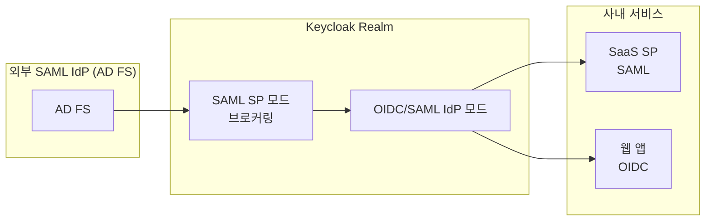
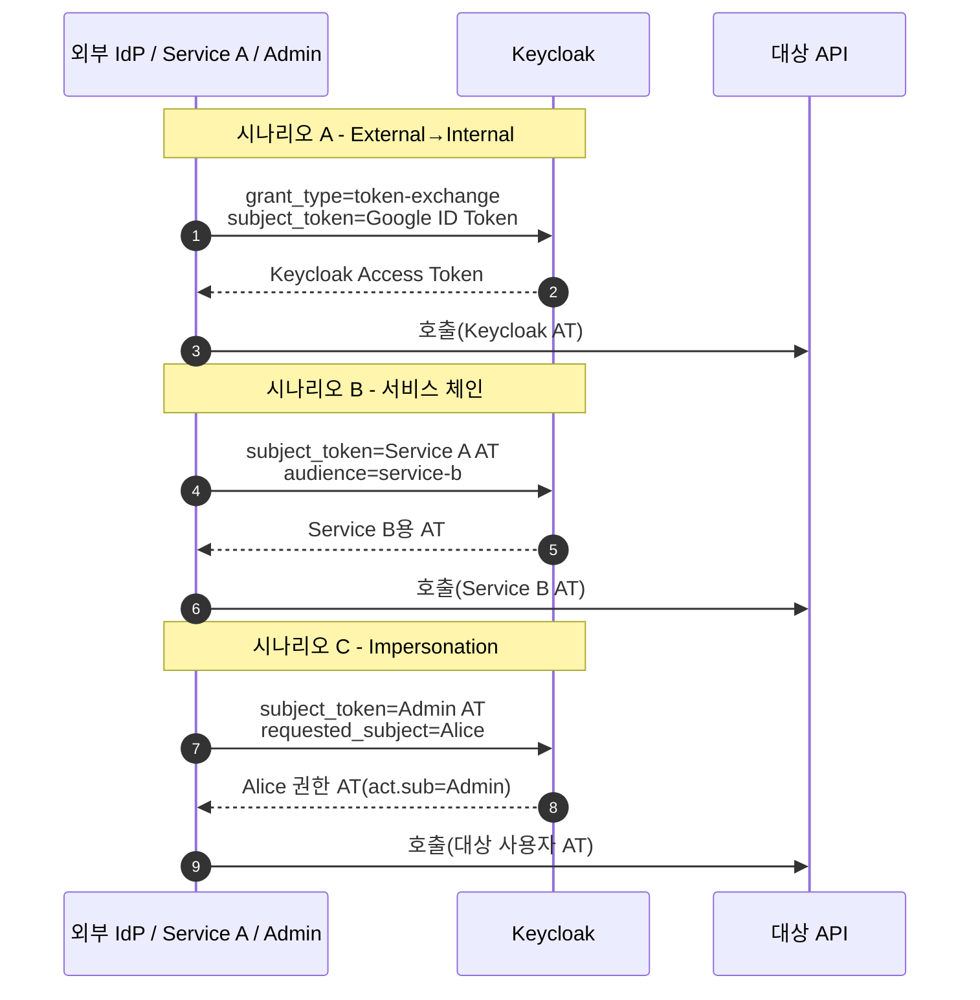

# SAML 2.0과 Token Exchange

::: info 학습 목표
- SAML 2.0의 핵심 구성요소와 OIDC와의 구조적 차이를 설명할 수 있다.
- Keycloak을 SAML IdP로, 또는 SAML 클라이언트·브로커로 설정하는 패턴을 구분할 수 있다.
- RFC 8693 Token Exchange의 3가지 주요 시나리오(외부→내부, 내부→내부, 임퍼소네이션)를 이해한다.
- Impersonation 시나리오의 보안·감사 고려 사항을 안다.
:::

---

## 1. SAML 2.0 빠른 복습

SAML 2.0은 SSO 프로토콜 중 가장 오래 자리잡은 표준이다. XML 기반 Assertion으로 "누가 로그인했는지"를 전달하며, 2005년 OASIS에서 표준화됐다. OIDC가 등장한 2014년 이후에도 엔터프라이즈 SaaS 생태계에서는 여전히 1급 시민이다. SAML과 OIDC의 포지션 비교는 [OAuth CH18. SSO와 Federation](/study/oauth/18-sso-federation)에서 큰 그림으로 본 내용과 이어진다.

### 핵심 구성요소

| 구성요소 | 역할 |
|------|------|
| IdP (Identity Provider) | 인증을 담당하고 Assertion을 발급 |
| SP (Service Provider) | Assertion을 받아 세션을 만드는 서비스 |
| Assertion | XML로 기술된 인증·속성·권한 정보 |
| Binding | Assertion을 전송하는 방식(HTTP-Redirect, HTTP-POST, Artifact) |
| Profile | Binding을 조합한 사용 시나리오(Web Browser SSO, ECP 등) |
| Metadata | IdP와 SP가 서로를 이해하기 위한 설정 XML |

### Assertion의 요점

SAML Assertion은 내부에 세 종류의 Statement를 담는다.

- **Authentication Statement**: 언제, 어떤 방식으로 로그인했는지.
- **Attribute Statement**: 사용자 속성(이메일, 부서 등).
- **Authorization Decision Statement**: 권한 결정(거의 쓰지 않음).

Assertion은 IdP의 개인키로 <strong>서명</strong>되고, 필요 시 SP 공개키로 <strong>암호화</strong>된다.

### OIDC와의 구조적 차이

| 항목 | SAML 2.0 | OIDC |
|------|------|------|
| 직렬화 | XML | JSON(JWT) |
| 전송 방식 | 주로 브라우저 HTTP-POST | JSON over HTTPS |
| 서명·암호화 | XML-DSIG, XML-Encryption | JWS, JWE |
| SSO 범위 | 주로 웹 브라우저 SP | 웹·모바일·API 전반 |
| API 위임 | 표준에 없음(OAuth와 별도 조합) | 동일 프로토콜로 자연스럽게 |
| 디버깅 난이도 | 높음(XML·네임스페이스·서명) | 비교적 낮음 |

SAML은 모바일·API 친화성이 떨어지지만 엔터프라이즈 SaaS와 정부·금융 인프라에서 사실상 표준이라 무시할 수 없다. Keycloak은 SAML을 1급 프로토콜로 지원해 OIDC·SAML 혼합 환경을 한 곳에서 다룬다.

---

## 2. Keycloak을 SAML IdP로 운영

가장 많이 쓰는 구성이다. 사내 IdP로 Keycloak을 두고, 엔터프라이즈 SaaS(SAML 클라이언트)를 Keycloak에 연결한다.

### SAML Client 등록

Admin Console → Clients → Create → <strong>Client Type: SAML</strong>을 선택한다. 주요 설정은 다음과 같다.

| 설정 | 값 예시 | 의미 |
|------|------|------|
| Client ID | `https://workspace.example.com/saml/metadata` | SAML에서는 Client ID가 보통 EntityID URI다 |
| Valid Redirect URIs | `https://workspace.example.com/*` | ACS(Assertion Consumer Service) URL |
| Master SAML Processing URL | `https://workspace.example.com/saml/acs` | 기본 ACS 엔드포인트 |
| Sign Documents | On | Assertion에 IdP 서명 부착 |
| Sign Assertions | On | Assertion 요소도 개별 서명 |
| Encrypt Assertions | 옵션 | SP 공개키로 암호화 |
| Name ID Format | `email` / `persistent` / `transient` | 사용자 식별자 형식 |

### SAML 메타데이터 교환

SAML은 설정이 복잡하기로 유명한 만큼 <strong>메타데이터 XML 교환</strong>으로 대부분을 자동화한다.

- Keycloak의 IdP 메타데이터: `GET /realms/{realm}/protocol/saml/descriptor`
- SP 메타데이터 가져오기: Client 생성 화면의 Import에서 SP가 제공하는 메타데이터 URL/XML을 붙여 넣으면 Valid Redirect URIs·ACS·서명 인증서가 한 번에 채워진다.

### 속성 매핑

OIDC의 Protocol Mapper와 동일한 역할을 SAML도 수행한다. SAML Client → Client Scopes → Mappers에서 Mapper를 추가한다. 자주 쓰는 타입은 다음과 같다.

- **User Property**: `email`, `firstName`, `lastName` → SAML Attribute로.
- **User Attribute**: 커스텀 Attribute → SAML Attribute로.
- **Group list**: Group 경로를 다중값 Attribute로.
- **Role list**: Realm/Client Role을 Attribute로.

예: `email` 속성을 `urn:oid:0.9.2342.19200300.100.1.3` (mail)로 매핑.

### 감사·디버깅

SAML 디버깅은 XML을 직접 들여다봐야 해서 난이도가 높다. 권장 도구는 다음과 같다.

- 브라우저 확장 **SAML-tracer** (Firefox/Chrome).
- Keycloak Event Listener로 `LOGIN`·`LOGIN_ERROR` 이벤트 관찰.
- Quarkus/Wildfly 로그에서 `org.keycloak.protocol.saml` 카테고리 DEBUG.

---

## 3. Keycloak을 SAML 클라이언트(브로커)로

반대 방향도 필요하다. 외부 IdP(기업 AD FS, Okta, 다른 SAML IdP)에 이미 계정이 있고, 사용자는 그 자격으로 우리 서비스에 들어오고 싶다. 이때 Keycloak은 <strong>SAML SP 역할</strong>을 하며, 내부 사용자 관점에서는 "SAML 브로커"로 보인다.

### Identity Brokering 기본

Identity Providers → Add provider → <strong>SAML v2.0</strong>을 선택한다. 외부 IdP의 메타데이터 URL을 넣으면 Entity ID·SSO Service URL·서명 인증서가 자동 채워진다.

### 핵심 옵션

| 옵션 | 설명 |
|------|------|
| Single Sign-On Service URL | 외부 IdP의 로그인 엔드포인트 |
| Single Logout Service URL | 외부 IdP의 로그아웃 엔드포인트 |
| NameID Policy Format | 외부 IdP가 사용하는 식별자 형식과 맞춤 |
| Validate Signature | 외부 IdP 서명 검증(거의 필수) |
| Want AuthnRequests Signed | 우리(SP)가 보낸 AuthnRequest를 서명 |
| Trust Email | 외부 IdP가 보낸 `email`을 검증됨으로 신뢰 |

### First Broker Login Flow

외부 IdP로 처음 로그인한 사용자를 Keycloak 로컬 계정과 어떻게 연결할지는 [CH11. 인증 플로우](/study/keycloak/11-auth-flow)에서 설명할 **First Broker Login** 플로우가 결정한다. 기본 동작은 다음과 같다.

1. 이메일이 기존 사용자와 같으면 "기존 계정에 연결" 선택지를 제시.
2. 없으면 새 사용자로 생성(프로비저닝).

브로커링 설계의 자세한 분류는 [CH15. Identity Brokering](/study/keycloak/15-identity-brokering) 예고.

### 두 모드의 조합

Keycloak은 같은 Realm 안에서 **IdP 모드와 SP 모드를 동시에** 운영할 수 있다. 예: 내부 사내 앱은 Keycloak을 OIDC IdP로 쓰고, 동시에 본사 AD FS의 SAML Assertion으로 로그인한 사용자도 받아들인다.



Keycloak이 중간 허브가 되어 외부 IdP와 사내 SP·OIDC Client를 모두 중개한다.

---

## 4. Token Exchange 개요

<strong>RFC 8693 Token Exchange</strong>는 "어떤 토큰을 다른 토큰으로 바꾼다"를 표준화한 Grant Type이다. 서비스 간 호출, 외부 IdP 브리징, 임퍼소네이션 같은 요구를 동일한 프로토콜로 풀어낸다.

### Grant Type과 주요 파라미터

```http
POST /realms/corp/protocol/openid-connect/token HTTP/1.1
Content-Type: application/x-www-form-urlencoded

grant_type=urn:ietf:params:oauth:grant-type:token-exchange
&subject_token={원본 토큰}
&subject_token_type=urn:ietf:params:oauth:token-type:access_token
&requested_token_type=urn:ietf:params:oauth:token-type:access_token
&audience={대상 Client ID}
&scope=openid profile
```

| 파라미터 | 의미 |
|------|------|
| `subject_token` | 교환에 제시하는 "원본 토큰" |
| `subject_token_type` | 원본 토큰 타입(Access/JWT/Refresh) |
| `actor_token` | 위임 시나리오에서 "누가 교환을 요청했는가"의 증거 |
| `requested_token_type` | 받고 싶은 토큰 타입 |
| `audience` | 새 토큰의 대상 Resource Server |
| `scope` | 새 토큰에 포함될 Scope |

### Keycloak의 지원 범위

Keycloak은 RFC 8693 전체가 아니라 주요 시나리오를 구현한다. 초기에는 Preview였고, 버전별로 안정화·권한 부여 방식이 바뀌었다.

- Token Exchange는 Realm 기능 플래그(`--features=token-exchange`)로 활성화.
- 누가 어떤 교환을 할 수 있는지는 <strong>Authorization Services 기반 Fine-grained Permission</strong>으로 제어(`token-exchange` Scope 단위로 Permission 등록).

### 보안 기본기

Token Exchange는 자칫 "아무 토큰이나 다른 토큰으로 바꾸는" 위험한 문이 될 수 있다. 반드시 지켜야 할 원칙은 다음과 같다.

- 교환 대상(`audience`)별로 허용 Client·사용자 **화이트리스트**.
- 원본 토큰의 Issuer·서명 검증은 Keycloak이 수행하지만, 내부 정책에서 추가 검증(예: Actor가 서비스 계정인지) 필수.
- 교환 이벤트는 Event Listener로 반드시 감사 로그에 적재.

---

## 5. Internal↔External Token Exchange

Keycloak Token Exchange의 세 가지 주요 시나리오를 하나씩 본다.

### 시나리오 A — External→Internal (외부 IdP 브리징)

구글 ID Token을 Keycloak Access Token으로 교환한다. 사용자가 모바일 앱에서 구글 SDK로 받은 토큰을 우리 백엔드에 그대로 넘기는 대신, Keycloak이 한 번 교환해 사내 AT로 바꾼다.

```http
POST /realms/corp/protocol/openid-connect/token
grant_type=urn:ietf:params:oauth:grant-type:token-exchange
&subject_token_type=urn:ietf:params:oauth:token-type:id_token
&subject_token={google-id-token}
&subject_issuer=google
&client_id=mobile-app
```

Keycloak은 `google` Identity Provider의 인증서로 토큰을 검증하고, 매칭되는 로컬 사용자(없으면 First Broker Login Flow로 생성)를 기준으로 새 Access Token을 발급한다. [OAuth CH18](/study/oauth/18-sso-federation)에서 다룬 Federation의 구체 구현체다.

### 시나리오 B — Internal→Internal (서비스 체인)

Service A가 받은 Access Token으로 Service B를 호출해야 한다. 그런데 두 서비스는 서로 다른 `audience`를 기대한다. Service A는 자기가 받은 토큰을 Service B용으로 교환한다.

```http
POST /realms/corp/protocol/openid-connect/token
grant_type=urn:ietf:params:oauth:grant-type:token-exchange
&subject_token_type=urn:ietf:params:oauth:token-type:access_token
&subject_token={service-a-access-token}
&audience=service-b
&client_id=service-a
&client_secret=...
```

이 패턴의 장점은 <strong>각 서비스가 자기 `audience`만 신뢰</strong>하면 되는 것이다. 한 토큰이 여러 API의 `aud`를 동시에 갖지 않도록 강제해 blast radius를 줄인다. 토큰 오남용 방지 원칙은 [OAuth CH13. 토큰 전략](/study/oauth/13-token-strategy)과 같은 맥락이다.

### 시나리오 C — Impersonation (관리자→사용자 전환)

관리자가 고객 지원을 위해 특정 사용자의 세션으로 전환한다. Access Token의 `sub`가 해당 사용자로 바뀌며, `act` 클레임에 "누가 위임했는지"가 남는다.

```http
POST /realms/corp/protocol/openid-connect/token
grant_type=urn:ietf:params:oauth:grant-type:token-exchange
&client_id=support-console
&client_secret=...
&subject_token={admin-access-token}
&requested_subject={target-user-id}
```

결과 토큰은 대상 사용자 권한을 갖되, `act.sub`에 관리자 ID가 남아 감사 추적이 가능하다.

### 시퀀스 요약



---

## 6. Impersonation 시나리오와 권한

Impersonation은 "사용자 세션을 빌리는" 기능이라 보안·감사 설계가 가장 예민한 영역이다.

### 누가 할 수 있는가

기본적으로 Realm의 `impersonation` Role이 필요하다. Client가 Token Exchange로 Impersonation을 수행하려면 다음 조건을 모두 만족해야 한다.

- Client가 Service Account로 동작.
- Service Account에 `realm-management` Client의 `impersonation` Role 부여.
- Fine-grained Admin Permission으로 "이 Client는 이 Group의 사용자만 임퍼소네이션 가능" 같은 추가 제약.

### act 클레임

RFC 8693은 위임 체인을 표현하는 `act` 클레임을 정의한다.

```json
{
  "sub": "alice",
  "aud": "billing-api",
  "act": {
    "sub": "admin-service-account",
    "iss": "https://auth.corp.io/realms/corp"
  }
}
```

`sub`는 실제 권한을 갖는 사용자, `act.sub`는 교환을 요청한 행위자다. 여러 단계가 연쇄되면 `act.act`로 중첩된다. 감사 시스템은 반드시 `act`를 파싱해 "누가 누구 이름으로 무엇을 했는가"를 남긴다.

### 감사 흔적(Audit Trail)

Impersonation이 일어났음을 흘려보내면 사후 추적이 사실상 불가능하다. 다음 세 지점에 로그를 남긴다.

| 지점 | 무엇을 | 이유 |
|------|------|------|
| Keycloak Event Listener | 교환 시각, `act`, `sub`, `client_id` | IdP 레벨 증거 |
| Resource Server 감사 로그 | 호출 경로, 결과, `act` | 실제 작업의 영향 범위 |
| 운영 채널 알림 | Slack/메일 등 실시간 통지 | 남용 즉시 탐지 |

### 오용 방지 체크리스트

- Impersonation Client는 <strong>MFA 통과한 관리자</strong>만 접근하도록 Authentication Flow 분기.
- Refresh Token 미발급 — 교환 결과는 짧은 수명의 Access Token만.
- `audience`를 특정 API로 좁힘 — 모든 API에 대해 한 번에 임퍼소네이션하지 않음.
- 교환 이벤트에 "사유(reason)" 메타데이터 첨부(추가 필드 또는 별도 Audit API).
- 정기적인 Impersonation 로그 리뷰 프로세스.

Impersonation은 일상적인 기능이 아니라 <strong>예외 절차</strong>다. 기능을 켜는 순간부터 운영 프로세스 자체를 함께 세워야 한다.

---

::: tip 핵심 정리
- SAML 2.0은 XML Assertion 기반의 엔터프라이즈 SSO 표준이며, JSON·JWT 중심의 OIDC와 달리 디버깅이 까다롭지만 여전히 SaaS 생태계에서 1급 시민이다.
- Keycloak은 SAML IdP 모드(Client Type=SAML)와 SAML SP 모드(Identity Provider=SAML v2.0)를 모두 지원하며, 메타데이터 XML 교환으로 설정 대부분을 자동화한다.
- RFC 8693 Token Exchange는 `grant_type=urn:ietf:params:oauth:grant-type:token-exchange`로 외부→내부 브리징, 내부 서비스 체인, 관리자 임퍼소네이션이라는 3가지 시나리오를 같은 프로토콜로 다룬다.
- 교환 권한은 Authorization Services의 Fine-grained Permission으로 Client·사용자 화이트리스트를 강제해야 하며, `audience`를 좁히고 이벤트를 감사 로그에 반드시 남긴다.
- Impersonation은 `act` 클레임으로 위임 체인을 기록하고 MFA 강제·짧은 수명·감사 리뷰 프로세스를 동반해야 하는 예외 절차로 운영한다.
:::

## 다음 챕터

- 이전 : [Authorization Services와 UMA 2.0](/study/keycloak/09-authz-uma)
- 다음 : [인증 플로우 커스터마이징](/study/keycloak/11-auth-flow)
