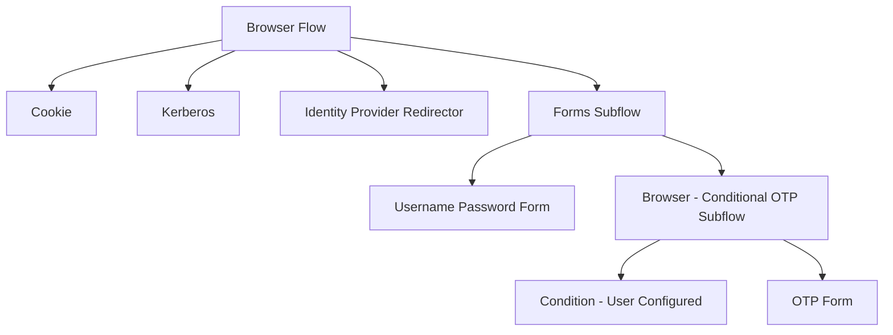
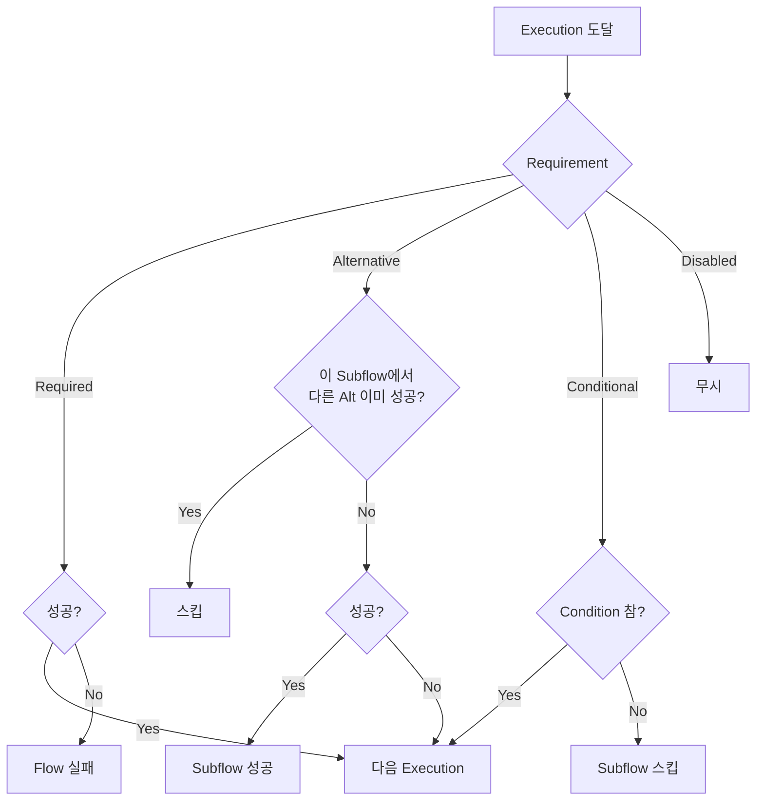
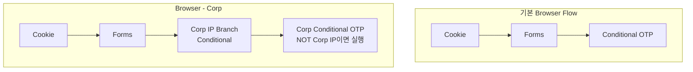

# 인증 플로우 커스터마이징

::: info 학습 목표
- Authentication Flow의 트리 구조(Flow·Subflow·Execution)를 이해한다.
- Execution Requirement의 네 가지 값(Required/Alternative/Conditional/Disabled)과 평가 규칙을 안다.
- 사전 정의된 6가지 Flow의 목적과 바인딩 위치를 구분할 수 있다.
- 플로우 복제 후 편집 패턴으로 실무 요구에 맞춘 분기(예: 사내 IP 분기)를 구성할 수 있다.
:::

---

## 1. Authentication Flow 개념

Keycloak에서 <strong>로그인</strong>, <strong>비밀번호 리셋</strong>, <strong>회원가입</strong>, <strong>브로커링 최초 로그인</strong>은 모두 같은 엔진으로 실행된다. 이 엔진의 단위가 <strong>Authentication Flow</strong>다.

### Flow는 트리다

Flow는 Execution과 Subflow로 구성된 <strong>트리</strong>다.

- **Flow**: 최상위 실행 단위. 이름으로 식별되며 Realm/Client에 바인딩된다.
- **Subflow**: Flow 내부에 중첩된 하위 Flow. 분기를 묶거나 논리적 스텝을 나눌 때 쓴다.
- **Execution**: 실제 인증을 수행하는 개별 스텝(예: 비밀번호 폼, OTP 폼, Cookie 검사, 사내 IP 검사).

각 Execution/Subflow는 **Requirement**(Required/Alternative/Conditional/Disabled)를 갖는다. Keycloak은 이 트리를 위에서 아래로 순회하며 평가한다.

### 예시 — Browser Flow 구조

기본 Browser Flow의 대략적인 트리는 다음과 같다.



"Cookie는 Alternative라서 성공하면 이후 분기를 건너뛴다", "Forms는 Required라서 앞선 Alternative가 실패했을 때 반드시 수행된다"와 같이 Requirement로 흐름이 결정된다.

### 엔진의 책임

Authentication SPI는 Keycloak의 확장 포인트 중 가장 활발한 영역이다(CH16~17에서 다룬다). 엔진은 다음을 담당한다.

- Flow 트리 순회와 Requirement 해석.
- 폼 렌더링(FreeMarker 템플릿) 위임.
- 사용자 입력 수집과 Validator 호출.
- 성공·실패·취소 이벤트 발생.

개발자가 Authenticator 하나를 추가하면 엔진은 자동으로 Execution으로 붙일 수 있게 해준다.

---

## 2. Requirement

Flow 트리의 핵심은 각 Execution/Subflow에 설정된 <strong>Requirement</strong>다. 의미는 얼핏 비슷해 보이지만 동작은 서로 다르다.

### 네 가지 값

| Requirement | 동작 | 사용처 |
|------|------|------|
| Required | 반드시 성공해야 전체 Flow 성공 | 비밀번호 스텝 |
| Alternative | 동일 Subflow 안의 Alternative 중 하나라도 성공하면 OK | Cookie vs 패스워드 vs Kerberos |
| Conditional | Subflow에서만 유효. 내부 Condition이 참일 때만 하위 Execution 실행 | MFA 강제 조건 |
| Disabled | 무시 | 기능 잠깐 끄기 |

### 평가 규칙

같은 Subflow 안에서 Requirement가 섞이면 다음 규칙이 적용된다.

- **Required는 AND**: 하나라도 실패하면 해당 Subflow 실패.
- **Alternative는 OR**: 하나라도 성공하면 해당 Subflow 성공(이후 Alternative는 스킵).
- **Required와 Alternative의 혼합**: Required는 먼저 전부 평가 후, Alternative는 Required가 "성공"만 아니라 "사용자 요구 상태"일 때 여전히 평가된다. 실제로는 <strong>같은 Subflow에 Required와 Alternative를 혼용하지 말 것</strong>이 권고다.

### Conditional의 작동

Conditional Subflow는 최소 하나의 <strong>Condition Execution</strong>을 포함해야 한다. Condition이 참이면 내부 Execution이 실행되고, 거짓이면 Subflow 전체가 스킵된다.

예: "사용자가 OTP를 등록했다면 OTP 스텝 실행"은 아래와 같이 구성된다.

| 레벨 | 항목 | Requirement |
|------|------|------|
| Subflow | Browser - Conditional OTP | Conditional |
| Execution | Condition - User Configured (provider=OTP) | Required |
| Execution | OTP Form | Required |

### 의사결정 흐름



---

## 3. 사전 정의 Flow 6가지

설치 직후 Realm에는 목적별로 6가지 기본 Flow가 들어 있다. 각 Flow는 특정 상황에서 호출된다.

### 기본 6종

| Flow | 호출 시점 | 핵심 단계 |
|------|------|------|
| Browser | 브라우저 기반 `/authorize` | Cookie, IdP Redirector, Username Password Form, Conditional OTP |
| Direct Grant | `grant_type=password` 토큰 엔드포인트 | Username Validation, Password Validation, Conditional OTP |
| Registration | `/registrations` 엔드포인트 | Registration Page Form (Profile, Password, Terms, Recaptcha) |
| Reset Credentials | "비밀번호 찾기" 링크 | Choose User, Send Reset Email, Reset Password |
| Clients | Client 인증 전용(비밀번호/JWT/SecretJwt) | Client Id and Secret, Signed JWT, etc. |
| First Broker Login | 외부 IdP 최초 로그인 | Review Profile, Create User or Link Existing, Verify Email |

### Browser Flow

가장 많이 커스터마이징되는 Flow다. Cookie 인증(이미 로그인 세션), Kerberos(내부망 자동 로그인), IdP Redirector(소셜 로그인), Forms(아이디/비밀번호/OTP)가 위에서 아래로 Alternative로 배치된다.

### Direct Grant Flow

OAuth의 Resource Owner Password Credentials Grant([OAuth CH7. 그 외 Grant Types](/study/oauth/07-other-grant-types))를 처리한다. 레거시 API 호환용이며 신규 설계에선 쓰지 않는 것이 좋다. Flow 자체는 Username/Password Validation으로 단순하다.

### Registration Flow

회원가입 페이지를 구성한다. 각 Execution이 입력 폼의 한 블록으로 렌더링된다.

- **Registration Page Form** Subflow 내부에 User Profile Creation, Password Validation, reCAPTCHA, Terms and Conditions 등이 들어간다.
- Realm 설정에서 "User Registration"을 켜야 공개된다.

### Reset Credentials Flow

비밀번호를 잊은 사용자를 위한 Flow. Choose User(이메일 입력) → Send Reset Email(일회용 링크 메일) → Reset Password(새 비밀번호 입력)로 구성된다. Conditional OTP를 추가해 "이메일 링크만으로는 부족, 기존 OTP도 요구" 같은 강화가 가능하다.

### Clients Flow

Client 자체의 인증을 정의한다. Confidential Client가 `client_secret_basic`/`client_secret_post`/`client_secret_jwt`/`private_key_jwt` 중 어떤 방식으로 인증하는지를 Execution의 배치로 결정한다. Client의 Authenticator 필드와 이 Flow가 연결된다.

### First Broker Login Flow

외부 IdP로 처음 들어온 사용자를 Keycloak 로컬 계정과 어떻게 연결할지 결정한다. 기본 동작은 "Review Profile → 이메일 중복 체크 → 기존 계정에 연결 or 새로 생성". 기업 정책에 따라 "도메인이 `@corp.io`여야만 가입 허용" 같은 커스텀 Execution을 추가한다.

---

## 4. 복제 후 편집

Keycloak의 철칙은 <strong>"기본 Flow를 직접 수정하지 말 것"</strong>이다. 수정하면 업그레이드 시 충돌·손실 위험이 크다. 대신 Duplicate 버튼으로 복제한 뒤 새 Flow에서 편집하고, 필요한 바인딩 지점에 붙인다.

### 실무 예제 — 사내 IP 분기

요건: "사내 IP에서 들어오면 비밀번호만으로 OK, 외부에서 들어오면 OTP 강제".

### 단계 1 — Browser Flow 복제

Authentication → Flows → Browser Flow → **Duplicate** → "Browser - Corp" 이름으로 복제.

### 단계 2 — IP 조건 Subflow 추가

복제한 Flow의 Forms Subflow 아래에 새 Conditional Subflow "Corp IP Branch"를 만든다. 그 안에 두 Execution을 넣는다.

- **Condition - Role** 또는 **Condition - Attribute**(또는 커스텀 IP Condition Authenticator): 사내 IP CIDR 매칭.
- 결과가 참이면 OTP 스킵 플래그를 세팅하는 스크립트 또는 Subflow 분기.

Keycloak 기본에는 IP 기반 Condition이 없으므로 실무에선 SPI로 `IpCheckAuthenticator`를 만들어 `providers/` 디렉토리에 배치한다([CH17. 커스텀 Authenticator](/study/keycloak/17-custom-authenticator) 예고).

### 단계 3 — OTP Subflow 조건화

기존 "Browser - Conditional OTP" Subflow를 복제해 "Corp Conditional OTP"로 만든 뒤, 내부에 <strong>Condition - Is Corp IP</strong>를 `Required=NEGATE`로 배치한다. 결과적으로 "사내 IP가 아닐 때만 OTP 실행" 구조가 된다.

### 단계 4 — 바인딩

Authentication → Bindings → Browser Flow를 <strong>"Browser - Corp"</strong>로 변경. 이후 모든 Realm 레벨 브라우저 로그인이 새 Flow로 처리된다.

### 복제 설계 원칙

- **이름 규칙**: `Browser - {변형 설명}`처럼 원본을 명시.
- **Git 관리**: Realm Import/Export JSON에 Flow 정의가 포함되므로, 변경 사항을 [CH24. Backup/Restore](/study/keycloak/24-backup-restore)에서 다룰 Export로 관리한다.
- **롤백 경로 확보**: 바인딩을 기본 Flow로 즉시 되돌릴 수 있도록 원본은 절대 삭제하지 않는다.

### 편집 전후 비교



---

## 5. Script Authenticator

단순 분기는 Script Authenticator로도 표현할 수 있다. JS 코드 한 조각을 Execution으로 추가해 조건을 평가한다.

### 특성

- Realm 기능 플래그 `--features=scripts`로 활성화되는 Preview.
- `AuthenticationFlowContext`가 JS 전역으로 주입되어 사용자·세션·요청 속성에 접근.
- 반환값에 따라 `success()`/`failure()`/`attempted()`를 호출.

### 간단 예시

```javascript
/* Script Authenticator */
var user = context.getUser();
var dept = user.getFirstAttribute("department");

if (dept === "security") {
  context.success();
} else {
  context.failure(AuthenticationFlowError.INVALID_USER);
}
```

### 제약과 대안

- 런타임 스크립트는 성능 프로파일과 보안 감사에 불리하다.
- Nashorn/Rhino 엔진 의존으로 버전 호환성 이슈가 간간이 발생.
- 스크립트 실수가 전사 로그인 장애로 번질 수 있어 Staging에서 반드시 시나리오 검증.

단순 조건은 Script로, 복잡한 로직·외부 연동이 필요하면 <strong>Java 기반 커스텀 Authenticator SPI</strong>가 표준 답이다.

---

## 6. 바인딩

Flow를 만들어도 어디에 어떻게 붙이냐가 정해져야 실제로 실행된다.

### Realm 수준 바인딩

Authentication → Bindings 탭에서 Flow 용도별로 기본 Flow를 지정한다.

| 항목 | 기본값 |
|------|------|
| Browser Flow | Browser |
| Registration Flow | Registration |
| Direct Grant Flow | Direct Grant |
| Reset Credentials Flow | Reset Credentials |
| Client Authentication Flow | Clients |
| First Broker Login Flow | First Broker Login |
| Docker Auth Flow | Docker Auth |

Realm에 단 하나의 기본 값만 설정된다. 복제한 Flow를 여기에 꽂으면 Realm 전체 동작이 한 번에 바뀐다.

### Client별 오버라이드

일부 Client만 다른 Flow로 돌리고 싶을 때는 Client → Advanced → <strong>Authentication Flow Overrides</strong>를 사용한다. Browser Flow와 Direct Grant Flow를 개별 Client 단위로 덮어쓸 수 있다.

예: 고위험 백오피스 Client는 "Browser - Admin with Strong MFA" Flow를, 일반 Client는 기본 Browser Flow를 사용.

### 바인딩 변경의 파급

Flow 바인딩은 실시간 반영이다. 잘못된 Flow를 Realm에 붙이면 모든 로그인이 즉시 막힌다. 운영 팁은 다음과 같다.

- **변경 전 Staging에서 로그인 시나리오 전수 테스트**(일반 사용자, IdP 브로커링, MFA 등록·미등록, 관리자).
- **Master Realm은 다른 관리자 경로를 남겨둘 것** — 본인이 쓰고 있는 Admin 로그인을 잘못 바꾸면 로그인 불가가 된다.
- **변경 직후 모니터링** — [CH25. 모니터링](/study/keycloak/25-monitoring-upgrade)에서 다룰 Event Listener로 `LOGIN_ERROR` 급증을 감지.

### Realm Export와 Flow

Flow는 Realm 정의 JSON에 `authenticationFlows` 배열로 포함된다. GitOps로 관리하려면 Export 스냅샷을 기준으로 PR 리뷰를 하고, [CH23. Admin REST API](/study/keycloak/23-admin-rest-api)로 일관성 있게 적용한다.

---

::: tip 핵심 정리
- Authentication Flow는 Flow/Subflow/Execution으로 이루어진 트리이며, 각 노드의 Requirement(Required·Alternative·Conditional·Disabled)로 평가 순서와 통과 조건이 결정된다.
- 기본 제공되는 Flow는 Browser·Direct Grant·Registration·Reset Credentials·Clients·First Broker Login 6가지이며 각각 특정 호출 지점에 바인딩된다.
- 기본 Flow는 절대 직접 수정하지 말고 Duplicate한 뒤 편집·바인딩하는 것이 원칙이며, 바인딩은 Realm 수준과 Client 수준 오버라이드로 구분된다.
- Conditional Subflow 안에 Condition Execution을 넣어 "OTP 등록자만 OTP 요구", "사내 IP가 아니면 OTP 요구" 같은 세밀한 분기를 표현한다.
- Script Authenticator는 Preview이고 성능·감사에 불리하므로 단순 조건에만 쓰며, 운영 품질이 필요하면 Java 기반 커스텀 Authenticator SPI를 쓴다.
:::

## 다음 챕터

- 이전 : [SAML 2.0과 Token Exchange](/study/keycloak/10-saml-token-exchange)
- 다음 : [Password Policy와 Brute Force](/study/keycloak/12-password-policy)
