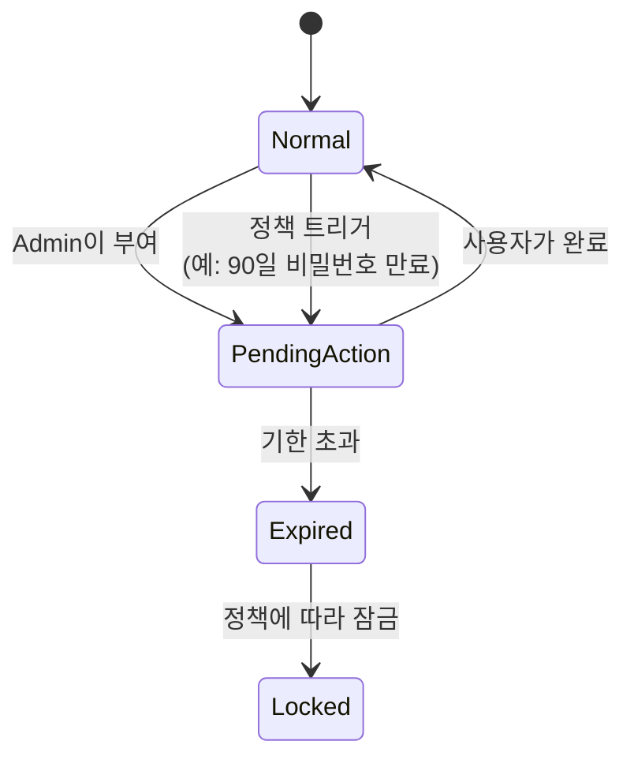
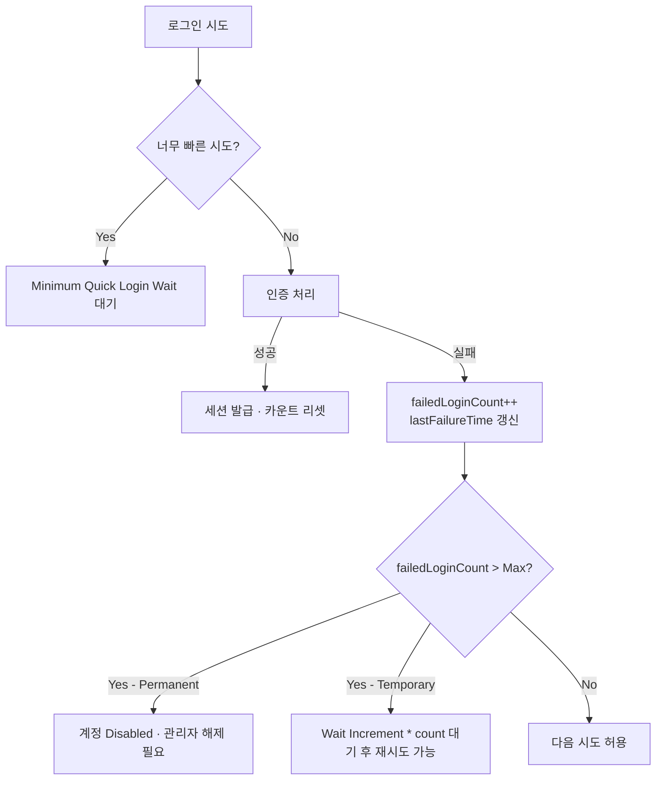

# Password Policy와 Brute Force

::: info 학습 목표
- Password Policy 규칙의 종류와 Regex를 활용한 제약 설계 방법을 안다.
- 비밀번호 해싱 파라미터(Argon2, PBKDF2 반복 횟수)의 트레이드오프를 이해한다.
- Required Actions로 사용자 상태 전이(비밀번호 변경·OTP 구성·이메일 검증 등)를 강제하는 방법을 안다.
- Brute Force Detection의 Temporary/Permanent Lockout 동작과 관리자 해제 절차를 설명할 수 있다.
:::

---

## 1. Password Policy

Realm → Authentication → Policies → Password Policy 화면에서 조합 가능한 규칙을 추가한다. 규칙은 사용자가 비밀번호를 설정·변경할 때 서버 측에서 검증된다.

### 제공 규칙

| 규칙 | 동작 |
|------|------|
| Hash Algorithm | 해시 알고리즘 선택(`argon2`, `pbkdf2-sha256`, `pbkdf2-sha512`) |
| Hashing Iterations | PBKDF2 반복 횟수 또는 Argon2 파라미터 |
| Minimum Length | 최소 길이(예: 12) |
| Maximum Length | 최대 길이(DoS 방지용 상한) |
| Digits / Lowercase / Uppercase / Special Characters | 각각 최소 개수 강제 |
| Not Username | 사용자명을 비밀번호로 쓰지 못하게 |
| Not Email | 이메일을 비밀번호로 쓰지 못하게 |
| Password History | 최근 N개 비밀번호 재사용 금지 |
| Force Expired Password Change | N일마다 만료 |
| Regex Pattern | 임의 Regex 만족 강제 |
| Blacklist | 사전 단어·유출 비밀번호 파일 참조 |

### Regex 예시

"영문 대문자·소문자·숫자·특수문자 각 1개 이상, 12자 이상"을 하나의 Regex로 표현한다.

```
^(?=.*[a-z])(?=.*[A-Z])(?=.*\d)(?=.*[^A-Za-z0-9]).{12,}$
```

다만 Regex 하나에 모든 정책을 우겨넣는 것보다 <strong>Minimum Length + Digits + Uppercase + Special Characters</strong>처럼 개별 규칙을 조합하는 편이 UX가 낫다. 사용자가 어떤 규칙을 어겼는지 개별 메시지로 보여줄 수 있기 때문이다.

### 정책 설계 원칙

- NIST SP 800-63B는 <strong>길이 우선, 복잡도 완화</strong>를 권고한다. 너무 복잡한 규칙은 사용자가 "Password1!"처럼 예측 가능한 패턴을 쓰게 만든다.
- Blacklist 정책은 유출된 비밀번호 리스트(HIBP 등)를 차단하는 강력한 수단이다. 대신 비밀번호 저장소를 서버가 읽을 수 있어야 한다.
- 기업 정책상 90일 만료를 요구하는 경우에도, MFA가 잘 구성되어 있다면 만료 주기는 완화하는 것이 현대적 추세다(NIST 권고).

### Password History

"최근 12개 비밀번호를 재사용하지 말 것"처럼 설정하면 Keycloak은 이전 해시를 저장하고 매 변경 시 비교한다. 저장 비용은 해시 크기에 비례하며, 히스토리 초과분은 자동 삭제된다.

---

## 2. Password Hashing 정책

비밀번호는 절대 평문으로 저장하면 안 된다. 키클로크는 기본으로 <strong>PBKDF2-SHA512</strong>를 사용하고, 버전에 따라 <strong>Argon2</strong>를 기본으로 전환하는 방향으로 움직이고 있다.

### 주요 알고리즘

| 알고리즘 | 특징 | 권장 |
|------|------|------|
| PBKDF2-SHA512 | 오랜 호환성, 반복 횟수 조절 | 기존 시스템 호환 유지 |
| Argon2 | 메모리 하드, GPU·ASIC 공격에 강함 | 신규 설치 권장 |
| PBKDF2-SHA256 | 호환용 | 가급적 사용하지 않음 |

### 반복 횟수

PBKDF2-SHA512의 기본값은 버전별로 상향되어 왔다(최근 버전 기준 27,500 → 210,000 등). 반복 횟수를 올릴수록 무차별 대입 비용이 커지는 만큼, 정책 업데이트와 함께 CPU 사용량을 모니터링해야 한다([CH22. DB 성능](/study/keycloak/22-database-performance)과 함께 본다).

### Argon2 파라미터

Argon2는 세 개 파라미터로 조절한다.

- `memory`: 필요한 메모리 양(기본 7168KiB 수준).
- `time`: 반복 횟수.
- `parallelism`: 병렬 스레드 수.

기본값으로도 현대 GPU 공격을 의미 있게 느리게 만든다. 메모리 설정을 낮추면 Argon2의 장점이 사라지므로 함부로 깎지 않는다.

### 정책 변경과 재해시

Hash Algorithm이나 Iterations를 바꾸면 **기존 비밀번호는 즉시 재해시되지 않는다**. 사용자가 다음 로그인 시 올바른 비밀번호로 인증에 성공하면 그 시점에 새 파라미터로 다시 해시된다. 이 때문에 정책을 강화한 뒤에도 점진적으로 반영되며, 장기 비활성 계정에는 적용이 안 될 수도 있다. 고위험 Realm에서는 Required Actions의 "Update Password"를 전사에 일괄 적용하는 방식을 쓴다.

### 해시 정책의 운영 체크

- 업그레이드 시 기본 반복 횟수가 올라가므로 CPU 부하 증가를 사전 측정.
- 로그인 스파이크 시 해시 연산이 CPU를 잡아먹는다 — 스케일 아웃과 캐시 전략 동시 검토.
- 백업에는 해시만 들어 있더라도 유출 시 오프라인 공격이 가능 — [CH24. Backup](/study/keycloak/24-backup-restore)에서 다룰 암호화 저장 필수.

---

## 3. Required Actions

<strong>Required Action</strong>은 "다음 로그인 시 사용자가 반드시 수행해야 하는 작업"을 알려주는 태그다. 로그인 성공 후 서비스로 리다이렉트되기 전에 Keycloak이 해당 액션의 페이지를 끼워 넣는다.

### 기본 제공 액션

| 액션 | 효과 |
|------|------|
| Update Password | 비밀번호 재설정 화면 강제 |
| Configure OTP | OTP(TOTP/HOTP) 등록 화면 강제 |
| Verify Email | 이메일 인증 링크 발송 |
| Verify Profile | 프로필 필수 필드 확인 |
| Update Profile | 프로필 수정 강제 |
| Terms and Conditions | 약관 동의 |
| Delete Account | (사용자 셀프) 계정 삭제 |
| Webauthn Register / Webauthn Register Passwordless | WebAuthn 등록 강제 |
| Recovery Authn Codes | 복구 코드 재발급 |

### 부여 방법

- **사용자별 수동**: Users → 사용자 → Credentials/Details → Required User Actions에 추가.
- **Admin REST API**: `PUT /admin/realms/{realm}/users/{id}`의 `requiredActions` 배열.
- **Flow 내부**: Authentication Flow Execution에서 특정 조건일 때 추가.
- **전체 사용자**: Realm 수준 설정에 없고, Admin REST API로 순회 적용하거나 Event Listener로 걸어두는 패턴.

### Required Actions 활성화/비활성화

Authentication → Required Actions 화면에서 각 액션을 **Enabled**/**Default Action** 두 토글로 관리한다.

- **Enabled**: 사용자에게 부여 가능하게 한다.
- **Default Action**: 신규 회원가입 시 자동 부여.

예: "신규 가입자는 무조건 이메일 검증"은 Verify Email을 Default Action으로 설정.

### 상태 전이

Required Action은 사용자 상태 머신의 한 축이다.



Required Action이 걸린 사용자는 로그인 성공 후에도 액션을 마치기 전까지 보호 리소스로 진입할 수 없다.

### 실전 패턴

- <strong>비밀번호 정책 변경 → 전사 Update Password 부여</strong>로 단기간 내 재해시.
- **MFA 전면 도입 → Configure OTP 부여**, 미등록자는 로그인 즉시 등록 화면.
- <strong>약관 개정 → Terms and Conditions 부여</strong>로 재동의 강제.

---

## 4. Brute Force Detection

비밀번호 추측 공격을 차단하는 기본 방어는 <strong>실패 카운트·지수 백오프·잠금</strong>이다. Keycloak은 이를 Brute Force Detection으로 제공한다.

### 설정 항목

Realm Settings → Security Defenses → Brute Force Detection에서 켠다.

| 항목 | 의미 |
|------|------|
| Enabled | 탐지 on/off |
| Detection Mode | `lockout` 정책 모드 |
| Max Login Failures | 영구 잠금까지의 최대 실패 횟수(Permanent Lockout 모드) |
| Wait Increment | 각 실패 후 대기 시간 증가분 |
| Quick Login Check Milli Seconds | 너무 빠른 연속 시도 탐지 임계 |
| Minimum Quick Login Wait | 빠른 시도 감지 시 대기 시간 |
| Max Wait | 최대 대기 시간 상한 |
| Failure Reset Time | 실패 카운트 초기화 간격 |

### Permanent Lockout vs Temporary Lockout

- **Permanent Lockout**: 실패 임계치를 넘으면 계정이 <strong>완전 비활성화</strong>되며 관리자가 명시적으로 해제해야 한다. 고위험 계정(관리자·재무)에 적합.
- **Temporary Lockout**: 실패 시 지수 백오프로 대기를 늘리고, 일정 시간 후 자동 복구. 일반 사용자에 적합.

Realm 전역 하나의 모드만 적용되므로, 사용자 그룹별 차등을 원하면 Admin REST API로 "관리자 Realm 별도"처럼 분리한다.

### 탐지 로직



### 사용자 경험 vs 보안

- 너무 빠른 잠금 → 정상 사용자가 오타로 잠김.
- 너무 느린 잠금 → 공격자가 천천히 시도해 우회.
- <strong>임계 튜닝</strong>과 <strong>이벤트 모니터링</strong>을 함께 가져가는 것이 정석. Brute Force 관련 이벤트(`LOGIN_ERROR`, `USER_DISABLED_BY_PERMANENT_LOCKOUT`)를 SIEM으로 보낸다.

### IP 기반 차단

Keycloak의 Brute Force는 <strong>사용자 단위</strong>다. IP 수준 차단은 Keycloak이 직접 하지 않으므로 앞단 WAF나 리버스 프록시(Cloudflare, Nginx rate limiting, Fail2ban 등)로 보완한다. Credential Stuffing 공격은 "수많은 계정에 하나씩 시도"라 사용자 단위 카운트만으로는 막지 못한다. 공격 분류는 [OAuth CH15. 공격과 방어](/study/oauth/15-attacks)에서 다룬다.

---

## 5. 잠금 해제 운영

탐지가 작동하면 잠긴 사용자 해제 절차가 필수다. 단순 UI 토글에서부터 REST API 자동화까지 다양한 경로가 있다.

### Admin Console에서

Users → 대상 사용자 → Attributes 또는 Credentials 탭에서 상태를 확인한다. 잠김 사용자는 User details에 `Temporarily Locked`/`Permanently Locked` 표시가 뜬다. 해제는 "Unlock" 버튼.

### Admin REST API

자동화·대량 처리용.

```http
POST /admin/realms/{realm}/attack-detection/brute-force/users/{userId} HTTP/1.1
Authorization: Bearer {admin-token}
```

메서드가 `DELETE`인 변형(버전별 상이)을 호출하면 해당 사용자의 Brute Force 상태가 리셋된다.

Realm 전체를 초기화하려면 다음을 호출한다.

```http
DELETE /admin/realms/{realm}/attack-detection/brute-force/users HTTP/1.1
Authorization: Bearer {admin-token}
```

### 상태 조회

```http
GET /admin/realms/{realm}/attack-detection/brute-force/users/{userId} HTTP/1.1
```

응답은 다음 형태다.

```json
{
  "numFailures": 5,
  "lastFailure": 1713333000000,
  "lastIPFailure": "203.0.113.42",
  "disabled": true
}
```

`disabled: true`이면 잠긴 상태. 해제 API 호출 후 다시 조회하면 `numFailures: 0`으로 초기화된다.

### 운영 절차 권고

| 단계 | 내용 |
|------|------|
| 1. 알림 | `USER_DISABLED_BY_PERMANENT_LOCKOUT` 이벤트 → 보안팀 채널 |
| 2. 확인 | 본인 여부 검증(전화·사내 메신저) |
| 3. 해제 | Admin REST API 호출, 감사 로그 기록 |
| 4. 후속 | 비밀번호 재설정 Required Action 부여 |
| 5. 분석 | 실패 IP 분포, 다른 계정 공격 유무 확인 |

### 자동화 체인

CH23에서 다룰 Admin REST API와 결합하면 전체 파이프라인을 코드로 운영할 수 있다. 예: Slack 슬래시 커맨드 → 서비스 계정 토큰 → Keycloak 해제 API 호출 → 감사 로그. 자세한 예제는 [CH23. Admin REST API](/study/keycloak/23-admin-rest-api)로 이어진다.

---

::: tip 핵심 정리
- Password Policy는 길이·문자 종류·Not Username·Password History·Regex·Blacklist 등을 조합해 규칙을 세우며, NIST 권고에 따라 길이 우선·복잡도 완화가 현대적 방향이다.
- Hash Algorithm은 PBKDF2-SHA512에서 Argon2(메모리 하드)로 전환하는 추세이고, 파라미터 상향은 CPU·메모리 부하와 트레이드오프가 있으므로 업그레이드 시 측정이 필수다.
- Required Actions는 Update Password·Configure OTP·Verify Email·WebAuthn Register 등 다음 로그인 시 강제 액션을 주입하며 Default Action 토글로 신규 가입자에 자동 부여된다.
- Brute Force Detection은 Temporary Lockout(지수 백오프)과 Permanent Lockout(관리자 해제 필요)을 제공하고, IP 기반 공격은 앞단 WAF/프록시와 조합해야 Credential Stuffing을 막을 수 있다.
- 잠금 해제는 Admin Console의 Unlock 버튼 또는 `/attack-detection/brute-force/users` REST API로 수행하며, 해제 후 비밀번호 재설정 Required Action을 함께 부여해 재발을 방지한다.
:::

## 다음 챕터

- 이전 : [인증 플로우 커스터마이징](/study/keycloak/11-auth-flow)
- 다음 : [MFA — TOTP / WebAuthn](/study/keycloak/13-mfa)
