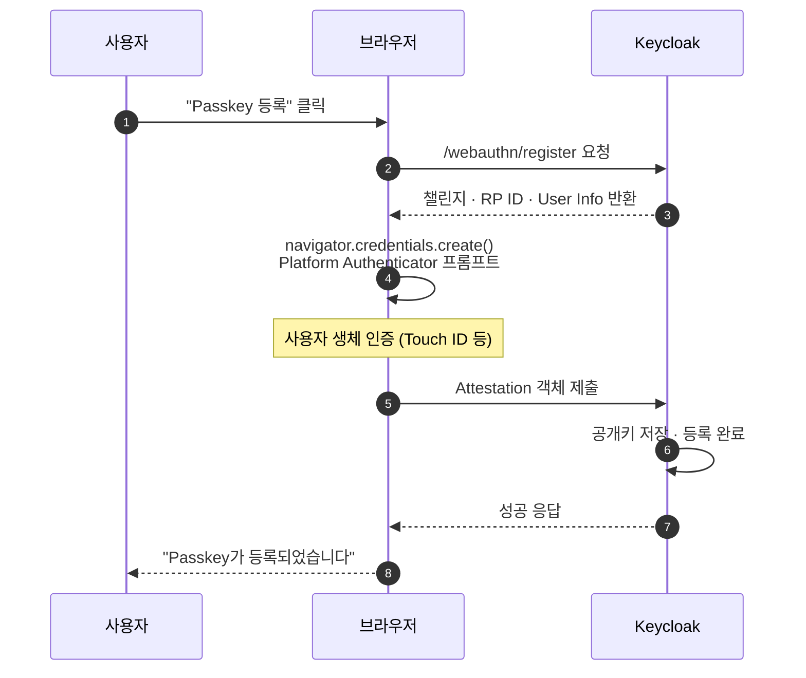

# MFA — TOTP / WebAuthn

::: info 학습 목표
- TOTP와 HOTP의 차이와 OTP Policy의 파라미터(주기·알고리즘·자리수)를 이해한다.
- WebAuthn의 Platform Authenticator와 Roaming Authenticator 구분 및 Keycloak의 두 정책 세트를 구분할 수 있다.
- Recovery Codes의 발급·사용·폐기 수명주기를 설명할 수 있다.
- MFA 강제를 Required Actions로 붙이는 방식과 Conditional Authenticator로 분기하는 방식을 비교할 수 있다.
:::

---

## 1. OTP Policy

OTP(One-Time Password)는 "짧은 시간만 유효한 코드"로 추가 인증을 수행하는 가장 오래된 MFA 방식이다. Keycloak은 TOTP(RFC 6238)와 HOTP(RFC 4226) 둘 다 지원한다.

### TOTP vs HOTP

| 항목 | TOTP | HOTP |
|------|------|------|
| 기반 | 시간 | 카운터 |
| 동기화 | 서버·클라이언트 시계 | 서버·클라이언트 카운터 |
| 생성 빈도 | 30초(기본) | 사용자가 버튼 누를 때 |
| 표류 허용 | 앞뒤 N 윈도 | 앞 N 카운터 |
| 대표 앱 | Google Authenticator, Authy, 1Password | 하드웨어 토큰 |

일반적으로 TOTP를 쓴다. 시계 동기화는 NTP로 충분하며, 모바일 앱 생태계가 풍부하다.

### 정책 파라미터

Realm Settings → Authentication → OTP Policy에서 설정한다.

| 파라미터 | 기본 | 의미 |
|------|------|------|
| OTP Type | TOTP | TOTP/HOTP |
| OTP Hash Algorithm | SHA-1 | SHA-1/SHA-256/SHA-512 |
| Number of Digits | 6 | OTP 자리수 |
| Look Around Window | 1 | 시계 표류 허용 윈도 |
| OTP Token Period | 30초 | TOTP 갱신 주기 |
| Initial Counter | 0 | HOTP 초깃값 |
| Supported Applications | Google Authenticator, FreeOTP | 안내 UI에 표시 |

### SHA-1 vs SHA-256

RFC 6238 기본값은 SHA-1이다. Google Authenticator 같은 구형 앱은 SHA-1만 지원하므로 호환성 때문에 기본을 바꾸기 조심스럽다. 최신 앱(FreeOTP, Authy 최신 버전)은 SHA-256도 지원하며 보안상 유리하다. 정책 변경 전 지원 앱 호환성 매트릭스를 반드시 확인한다.

### 자리수와 UX

자리수를 8자리로 늘리면 무차별 대입 비용이 10^2배로 커지지만, 사용자가 입력 중 틀릴 확률도 커진다. 일반 서비스는 6자리로 충분하고 고위험 서비스는 8자리를 고려한다.

### 시계 표류

Look Around Window = 1이면 서버는 현재 OTP뿐 아니라 앞뒤 1개 윈도(±30초)의 OTP도 허용한다. 사용자의 폰 시계가 조금 틀려도 로그인 성공. 너무 크게 두면 공격 창이 넓어지므로 1~2 권장.

### 등록 흐름

사용자는 "OTP 구성" 액션에서 QR 코드를 스캔한다. Keycloak은 `otpauth://` URI를 QR로 그리고, 앱이 이를 읽어 비밀키(shared secret)를 등록한다.

```
otpauth://totp/Corp:alice?secret=JBSWY3DPEHPK3PXP&issuer=Corp&algorithm=SHA1&digits=6&period=30
```

파라미터가 Realm OTP Policy와 일치해야 올바른 OTP가 생성된다.

---

## 2. WebAuthn 정책

**WebAuthn**(W3C)과 **FIDO2**(FIDO Alliance)는 "공개키 암호 기반 MFA/무비밀번호 인증"을 위한 표준이다. 사용자는 기기에 저장된 개인키로 챌린지에 서명하고, 서버는 등록 시 저장해둔 공개키로 검증한다.

### Platform vs Roaming Authenticator

| 구분 | 예 |
|------|------|
| Platform Authenticator | 기기 내장 — Windows Hello, Apple Touch ID/Face ID, Android 생체 |
| Roaming (Cross-platform) Authenticator | 별도 기기 — YubiKey, Titan Security Key, NFC/USB FIDO2 키 |

Platform은 "이 기기에서만 로그인", Roaming은 "여러 기기에 꽂아서 로그인"이라는 UX 차이가 있다.

### Passkey = Resident Credential + Platform Authenticator

<strong>Passkey</strong>는 Platform Authenticator에 저장되고 iCloud/Google 계정으로 기기 간 동기화되는 Resident Credential의 브랜딩이다. 사용자 입장에서는 "이 아이폰에서 등록한 로그인 방식이 맥북에서도 그대로 쓰인다"가 된다. Keycloak은 WebAuthn 정책의 <strong>Require Resident Key</strong>를 `required`로 설정해 Passkey 방식을 강제할 수 있다.

### Keycloak의 두 정책 세트

Realm Settings → Authentication → WebAuthn Policy와 <strong>WebAuthn Passwordless Policy</strong>가 분리되어 있다.

| 정책 | 목적 | 연계 Execution |
|------|------|------|
| WebAuthn Policy | 2단계 인증(비밀번호 후 추가 단계) | Authentication Flow의 WebAuthn Authenticator |
| WebAuthn Passwordless Policy | 비밀번호 없이 WebAuthn만으로 로그인 | Authentication Flow의 WebAuthn Passwordless Authenticator |

두 정책은 파라미터가 같지만 바인딩되는 Execution이 다르다. Passwordless는 비밀번호를 완전히 대체하는 경로라 정책을 더 엄격하게 잡는다.

### 주요 파라미터

| 파라미터 | 값 | 의미 |
|------|------|------|
| Relying Party Entity Name | `Corp Keycloak` | 사용자에게 보이는 RP 이름 |
| Signature Algorithms | `ES256`, `RS256` | 허용 알고리즘 |
| Attestation Conveyance Preference | `none`/`indirect`/`direct`/`enterprise` | 인증기 증명 수준 |
| Authenticator Attachment | `platform`/`cross-platform`/`null` | Platform만/외장만/자유 |
| Require Resident Key | `not specified`/`Yes`/`No` | Passkey 강제 여부 |
| User Verification Requirement | `required`/`preferred`/`discouraged` | PIN·생체 확인 요구 |
| Acceptable AAGUIDs | 목록 | 특정 모델만 허용(엔터프라이즈) |

### User Verification 정책

- `required`: 반드시 PIN/생체 확인 필요(고위험).
- `preferred`: 가능하면 확인하되 지원 안 되면 스킵.
- `discouraged`: 확인 생략(로그인 편의 우선).

금융·관리자 Realm은 `required`, 일반 서비스는 `preferred`가 합리적 기본.

### 공격자 시점에서의 내성

- 피싱에 구조적으로 강하다. WebAuthn은 `origin`을 서명에 포함해 다른 도메인에서 쓴 챌린지를 돌려막을 수 없다.
- Token Binding 없이도 중간자 공격(adversary-in-the-middle) 저항성이 높다.
- 자세한 공격 분류와 대응은 [OAuth CH15. 공격과 방어](/study/oauth/15-attacks)를 참조한다.

---

## 3. Recovery Codes

MFA 기기를 잃어버리면 계정에 접근할 수 없다. 이를 구제하는 수단이 **Recovery Codes**(Authentication Recovery Codes). Keycloak은 사용자 셀프 백업 코드 발급을 기본 제공한다.

### 발급

Account Console → Signing in → **Recovery Authentication Codes** → Generate.

- 보통 12개 코드가 한 번에 발급된다.
- 각 코드는 일회용. 사용하면 남은 개수가 줄어든다.
- 새 코드 세트를 생성하면 기존 코드는 모두 폐기된다(회전).

### 사용

MFA가 걸린 로그인 단계에서 "복구 코드 사용" 링크 → 발급받은 코드 중 하나 입력.

### 보관

사용자는 비밀번호 관리자 또는 인쇄물(금고) 같은 오프라인 매체에 저장해야 한다. 파일 형태로 클라우드 저장소에 평문으로 두면 복구 코드의 의미가 없다.

### 관리자 관점

- Required Actions에 <strong>Recovery Authn Codes</strong>를 추가하면 다음 로그인 시 강제로 코드 세트 생성.
- 코드 수명주기는 사용자에게 위임되나, 반환 API(전체 폐기)를 Admin REST API로 제공하므로 계정 탈취 의심 시 대응 가능.
- 코드는 해시되어 DB에 저장된다. 원본 값을 관리자도 볼 수 없다.

### 정책 설계

- **백업 MFA 필수**: MFA를 강제하면서 Recovery Codes를 강제하지 않으면 "기기 분실 = 지원팀 고객센터 폭주"가 된다.
- **재발급 감사**: 사용자 본인 인증 채널이 약하다면(예: 이메일만) 재발급 프로세스를 관리자 승인 절차로 보강.

---

## 4. MFA 강제

"MFA를 강제한다"는 말은 세 가지 다른 구현이 있다. 혼동하기 쉬우므로 구분한다.

### 방법 1 — Required Actions

모든 사용자에게 `CONFIGURE_TOTP` 또는 `CONFIGURE_WEBAUTHN` Required Action을 부여한다.

| 장점 | 단점 |
|------|------|
| 구현 간단(한 번 부여) | 모든 사용자에게 동일 강제, 분기 불가 |
| Admin REST API로 일괄 적용 용이 | 이미 OTP가 있는 사용자도 다시 걸림(중복 방지 로직 필요) |

### 방법 2 — Conditional Authenticator

Browser Flow에 Conditional Subflow를 추가해 "조건 시 OTP 요구"로 분기한다.

| 조건 | 설명 |
|------|------|
| Condition - User Role | 특정 Role 보유자(`admin`, `finance`) |
| Condition - User Configured | 사용자가 해당 크리덴셜을 이미 등록한 경우에만 요구 |
| Condition - Group | 특정 Group 소속 |
| Condition - Subflow Executed | 앞선 Subflow 결과에 따라 |

예: "admin Role 보유자는 반드시 OTP, 일반 사용자는 OTP 선택"을 Conditional Subflow로 표현한다.

### 방법 3 — Client별 ACR 요구

Client가 `acr_values=2`와 같은 ACR 요청을 보내 "2단계 인증"을 강제한다. Keycloak은 Authentication Context Class Reference 매핑을 통해 해당 ACR에 필요한 Execution을 끼워 넣는다. 고위험 기능 화면에서만 MFA를 요구하고 싶을 때 쓴다.

### 전략 비교

```mermaid
flowchart TD
    NEED[MFA 필요 요건] --> SCOPE{범위}
    SCOPE -->|전사 일괄| RA[Required Actions<br>모두에게 부여]
    SCOPE -->|Role · Group| CA[Conditional Authenticator]
    SCOPE -->|앱·화면별| ACR[ACR 기반 Step-up]
    RA --> GRAD[단계적 전환 시<br>"신규 가입자 Default Action"]
    CA --> MIX[기존 Browser Flow 복제 편집]
    ACR --> API[앱에서 acr_values 전달]
```

### 배포 전략(Rollout)

전사 MFA 도입은 충격이 크다. 안전한 순서는 다음과 같다.

1. 신규 가입자에 Default Action으로 적용 → 자연스럽게 쌓음.
2. 관리자·민감 Role부터 Conditional Authenticator로 강제.
3. 점진적으로 대상 확대, 매 단계 KPI(등록률·로그인 성공률·CS 문의량) 관찰.
4. 전사 전환 완료 후 Required Actions로 미등록자 남은 계정 처리.

---

## 5. 사용자 경험

기능이 있어도 UX가 나쁘면 사용자는 MFA를 우회하거나 비활성 계정을 방치한다. Keycloak의 기본 UI를 점검하고 필요 시 Theme([CH19. Theme](/study/keycloak/19-theme))로 보완한다.

### TOTP 등록 UX

- QR 코드 아래에 <strong>Secret 값을 수동 입력 옵션</strong>으로 노출(카메라 없는 환경용).
- **Supported Applications** 안내 문구를 현지화. "Google OTP", "네이버 OTP 매니저" 같은 현지 브랜드 포함.
- 등록 성공 직후 <strong>첫 OTP 입력 테스트</strong>로 정상 등록 확인.

### WebAuthn 등록 UX

Passkey 등록은 브라우저 네이티브 다이얼로그가 여러 단계로 뜬다. UI 안내와 실제 다이얼로그의 간극이 큰 만큼, 각 단계에 맞는 보조 문구가 중요하다.



### 로그인 UX 체크리스트

- **MFA 단계 건너뛰기 방지**: 브라우저 뒤로가기로 이전 단계로 돌아가지 못하도록 Flow 설계.
- **대체 경로 안내**: OTP 기기가 없을 때 Recovery Code 입력/관리자 문의 링크를 로그인 실패 화면에 노출.
- **에러 메시지**: "OTP가 올바르지 않음"과 "OTP가 만료됨"을 구분. 단, 너무 자세한 정보는 공격자에게 힌트.
- **세션 지속성**: "이 기기 기억하기" 옵션은 편의성을 크게 올리지만, 쿠키 탈취 시 MFA가 무력해지므로 유효기간을 짧게(7일 이하) 운영.

### 접근성

- QR은 시각 장애인에게 의미가 없으므로 <strong>Secret 값 대체 제공</strong> 필수.
- WebAuthn 프롬프트가 스크린리더에 친화적인지 브라우저별 검증.
- 초고령 사용자 비중이 높다면 OTP 자리수·폰트 크기 조정.

### MFA 운영 메트릭

도입 후 건강 상태를 숫자로 보려면 다음을 대시보드에 꽂는다.

| 지표 | 의미 | 경보 기준 |
|------|------|------|
| MFA 등록률 | 전체 사용자 중 MFA 구성 완료 비율 | 롤아웃 후 2주 뒤 90% 미만 시 원인 분석 |
| MFA 실패율 | MFA Execution 실패 비율 | 일일 5% 초과 시 UX·시계 동기화 재검토 |
| Recovery Code 사용률 | 복구 코드로 로그인한 비율 | 급증 시 기기 분실·피싱 의심 |
| Passkey 전환율 | OTP 대비 Passkey 등록 비율 | 전략 목표 대비 진척도 |
| Step-up 요청 횟수 | ACR 기반 재인증 빈도 | 급증 시 세션 수명·민감 기능 분기 재검토 |

이 지표는 Event Listener SPI로 `LOGIN`·`LOGIN_ERROR`·`USER_UPDATE`·`VERIFY_WEBAUTHN` 이벤트를 관측 백엔드로 보내 계산한다. 이벤트 리스너와 메트릭은 [CH25. 모니터링·감사](/study/keycloak/25-monitoring-upgrade)에서 통합적으로 다룬다.

### 실패 시나리오와 회복 경로

- **OTP 기기 분실 + Recovery Code 분실**: 관리자 수동 해제 후 Configure OTP Required Action 재부여.
- **Passkey만 등록한 사용자가 모든 기기를 교체**: 비밀번호 경로가 살아 있다면 재로그인 후 재등록, 전환 초기 Passwordless만 쓰면 위험 — Passkey 롤아웃 초기엔 비밀번호 fallback을 유지.
- **WebAuthn 브라우저 호환성 문제**: 정책에서 `ES256`·`RS256` 모두 허용, Attestation을 `none`으로 낮춰 범용성 확보.
- **OTP 시계 표류 재발**: NTP 동기화 점검, Look Around Window 임시 확대 후 원인 해결 시 원복.

---

::: tip 핵심 정리
- OTP Policy는 TOTP/HOTP 선택·해시 알고리즘·자리수·Look Around Window를 조절하며 Google Authenticator 호환을 위해 SHA-1이 기본이고 고위험 환경은 SHA-256·8자리를 고려한다.
- WebAuthn은 Platform(기기 내장)과 Roaming(외장 보안 키)으로 나뉘며 Passkey는 Resident Credential + Platform 조합이고, Keycloak은 일반 WebAuthn과 Passwordless WebAuthn 정책을 분리해 관리한다.
- Recovery Codes는 MFA 기기 분실 대비 백업 수단으로 일회용·해시 저장·세트 재발급 시 폐기의 수명주기를 따르며 Required Actions로 강제할 수 있다.
- MFA 강제는 Required Actions 일괄 부여, Conditional Authenticator 분기, Client별 ACR step-up 세 가지 패턴이 있고 범위·단계적 롤아웃에 따라 조합해 사용한다.
- QR 수동 입력·Passkey 등록 문구·"이 기기 기억" 옵션의 유효기간 같은 UX 세부가 MFA 도입의 성패를 결정하므로 Theme 커스터마이징과 함께 설계해야 한다.
:::

## 다음 챕터

- 이전 : [Password Policy와 Brute Force](/study/keycloak/12-password-policy)
- 다음 : [User Federation (LDAP/AD + SCIM)](/study/keycloak/14-user-federation)
