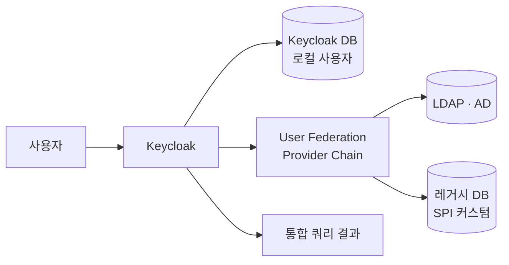
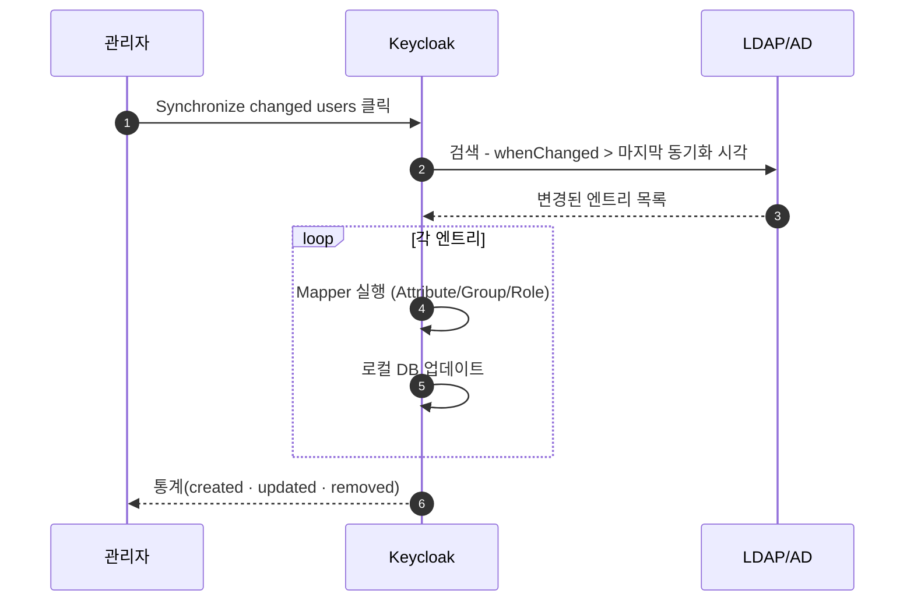
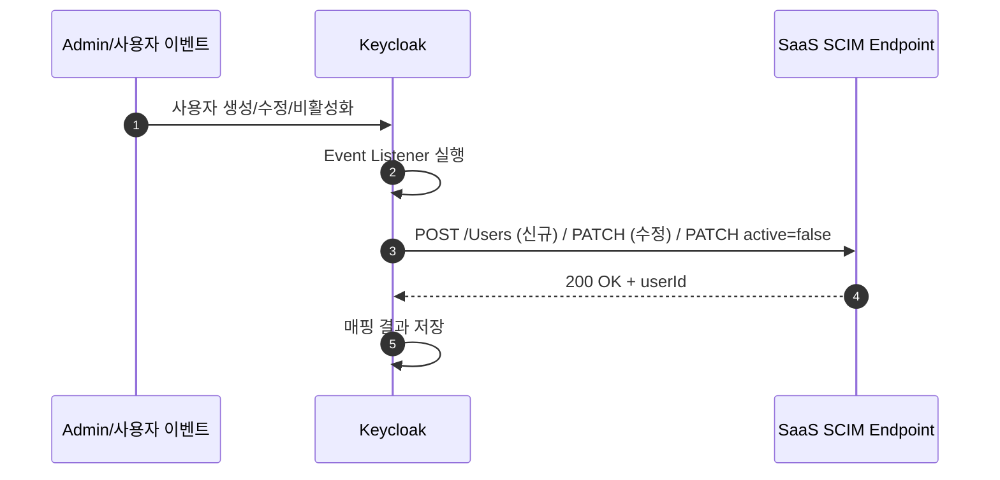

# User Federation (LDAP/AD + SCIM)

::: info 학습 목표
- User Federation이 Keycloak 사용자 DB와 외부 소스를 어떻게 통합 뷰로 보여주는지 이해한다.
- LDAP Provider의 주요 설정(Connection URL, Bind DN, Users DN, Search Scope)을 안다.
- Edit Mode(Read-only/Writable/Unsynced)와 LDAP Mapper의 역할을 구분할 수 있다.
- Kerberos/SPNEGO 자동 로그인과 SCIM 2.0 아웃바운드 프로비저닝의 위치를 설명할 수 있다.
:::

---

## 1. User Federation 개념

Keycloak은 자체 사용자 DB를 갖되, 외부 사용자 소스를 <strong>연동(Federation)</strong>해 통합 뷰로 보여줄 수 있다. 사내 LDAP, Active Directory, 레거시 사용자 DB 등이 모두 대상이다.

### 왜 필요한가

이미 사내에 수천~수만 명의 계정이 LDAP/AD에 있는 회사에서 Keycloak을 도입한다고 생각해보자. 두 개의 사용자 DB를 따로 두면 다음 문제가 생긴다.

- 비밀번호 변경을 어디서 하나?
- 입·퇴사 처리를 두 곳에 해야 함(동기화 지연).
- 그룹·부서 정보가 이중 관리됨.

User Federation은 "Keycloak이 LDAP을 **바라보며** 자기 DB처럼 다룬다"를 가능케 한다. 사용자는 LDAP 비밀번호로 Keycloak에 로그인하고, Keycloak은 필요 정보를 LDAP에서 직접 조회한다.

### 동작 계층



Keycloak은 로컬 DB와 Federation Provider를 체인으로 연결해 사용자 조회·인증 요청을 순서대로 시도한다. 로컬에서 찾으면 그것으로 끝, 없으면 다음 Provider로.

### 지원 Provider

- **LDAP** (OpenLDAP, ApacheDS 등): 범용 LDAPv3.
- **Active Directory**: LDAP과 호환되지만 AD 고유 속성 매핑이 다름.
- **Kerberos**: 단독 Provider로 SPNEGO/자격 위임 처리.
- **커스텀 User Storage SPI**: 레거시 DB·외부 API를 Provider로 구현([CH18. 커스텀 User Storage](/study/keycloak/18-custom-user-storage) 예고).

### 외부 IdP와의 차이

User Federation은 "외부 사용자 DB에 대한 **직접 조회·인증**"이다. 반면 Identity Brokering은 "외부 **IdP에 로그인 위임**"이다. 구분을 헷갈리면 설계가 엉킨다. Brokering 쪽은 [CH15. Identity Brokering](/study/keycloak/15-identity-brokering)에서 다룬다.

| 항목 | User Federation | Identity Brokering |
|------|------|------|
| 외부가 제공하는 것 | 사용자 DB | 로그인 결과(Assertion/Token) |
| Keycloak 역할 | 외부 DB 직접 쿼리 | 외부 IdP의 Client |
| 대표 | LDAP, AD | Google, GitHub, Okta |

---

## 2. LDAP Provider 설정

Admin Console → User Federation → Add LDAP Provider에서 시작한다.

### 필수 필드

| 필드 | 설명 | 예시 |
|------|------|------|
| UI display name | 식별용 이름 | `corp-ad` |
| Vendor | LDAP 구현체 선택 | `Active Directory`/`Other`/`Red Hat Directory Server` |
| Connection URL | LDAP 서버 URL | `ldaps://ad.corp.io:636` |
| Bind Type | 연결 인증 방식 | `simple`/`none` |
| Bind DN | Keycloak이 사용할 서비스 계정 DN | `CN=keycloak,OU=Service,DC=corp,DC=io` |
| Bind Credential | 서비스 계정 비밀번호 | `****` |
| Users DN | 사용자 검색 Base DN | `OU=Users,DC=corp,DC=io` |
| Username LDAP attribute | 사용자명 속성 | `sAMAccountName`(AD) / `uid`(OpenLDAP) |
| RDN LDAP attribute | DN 구성 속성 | 일반적으로 `cn` |
| UUID LDAP attribute | 전역 고유 ID | `objectGUID`(AD) / `entryUUID`(OpenLDAP) |
| User Object Classes | 사용자 오브젝트 클래스 | `user, organizationalPerson`(AD) |
| Search Scope | 검색 범위 | `Subtree`/`One Level` |

### 설정 YAML 예시

`kc.sh` CLI나 Admin REST API로 선언적 관리를 할 때 주로 JSON이지만, 인프라 설정 파일 수준에서는 다음처럼 요약한다.

```yaml
userFederation:
  - name: corp-ad
    providerId: ldap
    config:
      vendor: ad
      connectionUrl: ldaps://ad.corp.io:636
      bindDn: CN=keycloak,OU=Service,DC=corp,DC=io
      bindCredential: ${AD_BIND_PASSWORD}
      usersDn: OU=Users,DC=corp,DC=io
      usernameLDAPAttribute: sAMAccountName
      rdnLDAPAttribute: cn
      uuidLDAPAttribute: objectGUID
      userObjectClasses: user, organizationalPerson
      searchScope: Subtree
      editMode: READ_ONLY
      syncRegistrations: false
      importEnabled: true
      batchSizeForSync: 1000
      fullSyncPeriod: -1
      changedSyncPeriod: 86400
      useKerberosForPasswordAuthentication: false
      startTls: false
      connectionPooling: true
      useTruststoreSpi: ldapsOnly
```

### TLS 설정

운영에서는 `ldaps://`(636)을 쓰거나 `ldap://`(389) + StartTLS를 강제한다. 평문 389는 절대 쓰지 않는다. `useTruststoreSpi`로 Keycloak의 트러스트스토어를 사용하면 Realm 간 인증서 공유가 쉽다.

### 연결 테스트

설정 저장 후 Test connection과 Test authentication 버튼으로 먼저 확인한다. 실패 사유 상위 세 가지는 다음과 같다.

- TLS 인증서 신뢰 실패 — 트러스트스토어에 CA 추가 필요.
- Bind DN 권한 부족 — 서비스 계정에 Users DN 이하 검색 권한 필요.
- Connection URL 방화벽 차단 — 사내망에서만 허용되는 경우.

### 성능 튜닝

- <strong>Connection Pooling</strong>을 켜 연결 재사용.
- **Pagination** 지원 확인 — 대용량 조회 시 필수.
- 조회 빈도를 줄이려면 뒤에 나올 <strong>Import Users</strong>와 <strong>Cache Policy</strong>를 조합.

---

## 3. Edit Mode

LDAP이 <strong>읽기 전용</strong>인지, <strong>쓰기 가능</strong>한지, <strong>Keycloak만 갱신</strong>인지를 Edit Mode로 고른다.

### 세 가지 모드

| 모드 | 의미 |
|------|------|
| READ_ONLY | Keycloak은 LDAP을 수정할 수 없음. 프로필·비밀번호 변경이 막힘 |
| WRITABLE | Keycloak이 LDAP을 직접 수정함(쓰기 권한 필요) |
| UNSYNCED | Keycloak이 수정 사항을 <strong>로컬 DB</strong>에만 반영, LDAP에는 쓰지 않음 |

### 선택 기준

- **WRITABLE**: 사용자가 Account Console에서 비밀번호·이름을 바꿀 때 LDAP에 직접 반영. AD는 쓰기 요건(비밀번호 복잡성 등)을 만족해야 한다.
- **READ_ONLY**: LDAP은 사내 인사 시스템과 동기화되어 함부로 바꿀 수 없을 때. 비밀번호 변경은 사내 포털에서 하도록 안내.
- **UNSYNCED**: 도입 초기 마이그레이션 단계에서 쓰이는 과도기 모드. "LDAP 비밀번호로 로그인하고, 프로필은 Keycloak에만" 같은 혼합. 이해관계가 복잡해지니 장기적으로 두지 말 것.

### Import Users 옵션

`importEnabled: true`이면 첫 로그인 시 Keycloak 로컬 DB에 사용자 엔트리가 <strong>복제</strong>된다. 이후 조회는 로컬 DB로 빠르게 처리되고, LDAP은 변경 시에만 참조된다. 반면 `importEnabled: false`이면 조회할 때마다 LDAP에 쿼리가 나간다.

Import를 쓰면 Keycloak DB가 LDAP의 거울이 되며, LDAP 변경사항을 주기 동기화로 가져와야 한다.

### 동기화 옵션

- `fullSyncPeriod`: 전체 사용자 주기 동기화(초). `-1`이면 비활성.
- `changedSyncPeriod`: 변경분만 동기화. AD의 경우 `whenChanged` 속성 기반으로 효율적.
- 수동 동기화 버튼(Synchronize all users, Synchronize changed users)도 제공.

---

## 4. LDAP Mapper

LDAP Provider는 <strong>Mapper 체인</strong>을 통해 사용자 속성을 Keycloak 모델로 변환한다. Provider를 만들면 기본 Mapper가 자동으로 몇 개 들어가 있다.

### 내장 Mapper 타입

| Mapper | 기능 |
|------|------|
| User Attribute | LDAP 속성 → Keycloak 속성 |
| Full Name | LDAP `cn`을 firstName/lastName 조합으로 |
| Group | LDAP 그룹 ↔ Keycloak Group 매핑 |
| Role | LDAP 그룹/속성 ↔ Keycloak Role 매핑 |
| MS AD User Account Control | AD 고유 `userAccountControl` 플래그 해석(계정 비활성 등) |
| Hardcoded Attribute | 상수 주입 |
| Certificate | x.509 인증서 매핑 |

### Group Mapper의 설계

AD의 그룹 구조(OU 기반)를 Keycloak Group과 어떻게 맞출지 결정한다.

| 옵션 | 설명 |
|------|------|
| LDAP Groups DN | 그룹이 있는 Base DN |
| Group Object Classes | `group`(AD), `groupOfNames`(OpenLDAP) |
| Membership LDAP Attribute | `member`(AD/OpenLDAP), `uniqueMember` |
| Membership User LDAP Attribute | 그룹 멤버십에서 사용자 식별 속성 |
| Mode | `READ_ONLY`/`IMPORT`/`LDAP_ONLY` |
| User Groups Retrieve Strategy | `LOAD_GROUPS_BY_MEMBER_ATTRIBUTE`/`GET_GROUPS_FROM_USER_MEMBEROF_ATTRIBUTE` |

성능상 AD는 `memberOf`를 사용자에 indexing하는 경우가 많아 `GET_GROUPS_FROM_USER_MEMBEROF_ATTRIBUTE` 쪽이 빠르다.

### Role Mapper와 권한 전파

LDAP 그룹을 Keycloak Role로 바로 매핑하면 "LDAP 그룹에 추가 → 즉시 권한 부여"가 된다. Role 매핑은 Role 이름 자체를 그룹 이름과 일치시키거나, 별도 매핑 테이블(Realm/Client Role 이름)을 지정한다.

### 동기화 흐름



주기 동기화에 문제가 생기면 사용자 그룹 권한이 최신이 아닐 수 있다. 모니터링 대시보드에 마지막 동기화 시각 위젯을 두는 것이 실무다.

### Mapper 커스터마이징

내장 Mapper로 표현되지 않는 매핑은 SPI로 구현한다. 예: LDAP의 특정 속성 조합을 Keycloak Attribute로 가공. [CH16. SPI 개요](/study/keycloak/16-spi-overview)에서 Provider 패키징을 다룬다.

---

## 5. Kerberos 통합

Windows 사내망에서 도메인 가입 PC로 로그인하면 Keycloak 화면에서 **비밀번호를 또 묻지 않게** 하고 싶다. 이게 Kerberos/SPNEGO 자동 로그인이다.

### SPNEGO 원리

브라우저가 Keycloak 로그인 페이지 접근 → Keycloak이 `WWW-Authenticate: Negotiate` 응답 → 브라우저가 Windows의 Kerberos 티켓 증명서를 자동 제출 → Keycloak이 검증 후 세션 생성.

### 설정 요건

- Keycloak 호스트의 `krb5.conf`에 사내 Realm(예: `CORP.IO`) 설정.
- keytab 파일(서비스 계정 `HTTP/keycloak.corp.io@CORP.IO`)을 Keycloak 컨테이너에 탑재.
- LDAP Provider 설정에서 <strong>Allow Kerberos authentication</strong>을 On, <strong>Kerberos Realm</strong> `CORP.IO`, <strong>Server Principal</strong> `HTTP/keycloak.corp.io@CORP.IO`, <strong>KeyTab</strong> 경로 지정.

### 브라우저 설정

Chrome·Edge는 `AuthServerWhitelist`/`AuthNegotiateDelegateWhitelist`에 `*.corp.io`를 등록해야 한다. Firefox는 `network.negotiate-auth.trusted-uris`에 도메인 추가.

### Fallback

Kerberos 실패(외부 네트워크, 티켓 없음) 시 일반 Username/Password Form으로 돌아간다. Authentication Flow에서 Kerberos Execution을 Alternative로, Forms Subflow를 아래에 두는 구성이다.

### 실무 팁

- **Credential Delegation**: `storeUserPasswordInDatabase`를 켜면 Keycloak이 사용자 비밀번호를 임시로 LDAP 인증에 쓸 수 있다. 보안상 신중히 결정.
- **Clock Skew**: Kerberos는 시계 차이에 민감하다. NTP 동기화가 필수.
- **여러 도메인**: Multi-realm Kerberos는 `[realms]` 섹션과 cross-realm 트러스트 설정 필요.

---

## 6. SCIM 2.0 프로비저닝

User Federation은 "Keycloak이 외부 DB를 **읽는**" 쪽이다. 반대로 **Keycloak이 외부 SaaS에 계정을 만들어주는** 아웃바운드 프로비저닝은 전통적으로 약점이었다. Keycloak 26+ 생태계에서는 **SCIM 2.0 Provider**(커뮤니티 확장, 그리고 공식 통합 진행 중)로 이 간격을 메운다.

### SCIM이란

<strong>SCIM(System for Cross-domain Identity Management)</strong>은 사용자·그룹을 REST/JSON으로 교환하는 표준이다(RFC 7644). SaaS(예: Slack, Datadog, Notion)가 SCIM 엔드포인트를 제공하고, IdP(예: Keycloak)가 사용자 생성·수정·삭제를 호출한다.

### 역할 분담

| 주체 | 역할 |
|------|------|
| SCIM Service Provider | SaaS 쪽, `/scim/v2/Users` 엔드포인트 호스팅 |
| SCIM Client | Keycloak(IdP) — 사용자 이벤트 시 SaaS로 호출 |
| 프로비저닝 단위 | 사용자·그룹 CRUD |

### Keycloak에서의 구성

SCIM for Keycloak 플러그인(SPI)을 `providers/`에 배치하면 Realm 설정에 SCIM Integration 화면이 추가된다. 주요 설정은 다음과 같다.

- Target URL: `https://api.saas.com/scim/v2`
- Authentication: Bearer Token 또는 Basic.
- User Filter: 특정 Group 사용자만 동기화.
- Mapping: Keycloak User 속성 → SCIM 속성.

### 트리거와 흐름



사용자 이벤트(`USER_CREATE`, `USER_UPDATE`, `GROUP_MEMBERSHIP`)가 발생할 때마다 Keycloak이 SCIM 호출을 비동기로 전송.

### 기존 방식과 비교

| 항목 | LDAP Federation | SCIM 프로비저닝 |
|------|------|------|
| 방향 | 외부 → Keycloak (읽기 중심) | Keycloak → 외부 (쓰기) |
| 대상 | 기업 LDAP/AD | SaaS 애플리케이션 |
| 타이밍 | 조회 시 또는 주기 동기화 | 이벤트 즉시 |
| 목적 | 인증·사용자 뷰 통합 | 계정 자동 생성·회수 |

LDAP이 "사람을 어디서 인증할까"라면, SCIM은 "사람이 쓰는 SaaS 계정을 어떻게 자동 만들까"다.

### 운영 체크

- **실패 재시도**: SaaS가 일시 장애이면 재시도 큐가 필요. Event Listener에서 outbox 패턴을 구현하거나 전용 워커를 둔다.
- **삭제 vs 비활성화**: 퇴사자 SaaS 계정을 삭제하면 기존 문서 소유권이 끊긴다. 보통 <strong>비활성화(`active=false`)</strong> 후 일정 기간 유예.
- **권한 그룹 매핑**: SCIM Group을 정확히 매핑하지 않으면 SaaS에서 권한이 부족·과다해진다.

---

::: tip 핵심 정리
- User Federation은 Keycloak이 LDAP/AD 같은 외부 사용자 DB를 직접 조회·인증해 로컬 DB와 통합된 뷰로 보여주는 기능이며, 로그인 위임(Brokering)과는 구분된다.
- LDAP Provider 설정의 핵심은 Connection URL(ldaps 필수)·Bind DN·Users DN·UUID 속성(`objectGUID`·`entryUUID`)·Search Scope이며, 벤더(AD/OpenLDAP)에 따라 속성 이름이 다르다.
- Edit Mode는 READ_ONLY·WRITABLE·UNSYNCED 세 가지이고 Import Users 옵션을 켜면 로컬 DB가 외부의 거울이 되어 주기 동기화(full/changed)가 필요해진다.
- LDAP Mapper는 Attribute·Full Name·Group·Role 등을 체인으로 매핑하고, AD는 `memberOf` 기반 그룹 조회가 빠르며 Role 매핑으로 "LDAP 그룹에 추가 = Keycloak 권한 즉시 부여"가 가능하다.
- Kerberos/SPNEGO로 도메인 가입 PC 자동 로그인을 구현하고, SCIM 2.0 아웃바운드 프로비저닝으로 Keycloak 사용자 이벤트를 SaaS 계정 생성·회수로 연결해 LDAP Federation의 반대 방향을 보완한다.
:::

## 다음 챕터

- 이전 : [MFA — TOTP / WebAuthn](/study/keycloak/13-mfa)
- 다음 : [Identity Brokering](/study/keycloak/15-identity-brokering)
